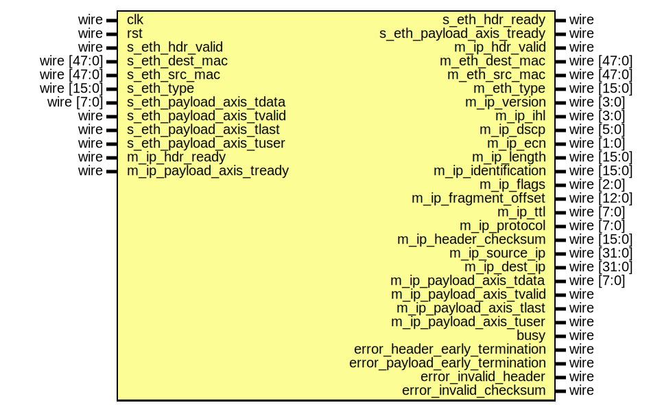

# Entity: ip_eth_rx

## Diagram

## Description

Language: Verilog 2001
 
## Ports

| Port name                       | Direction | Type        | Description |
| ------------------------------- | --------- | ----------- | ----------- |
| clk                             | input     | wire        |             |
| rst                             | input     | wire        |             |
| s_eth_hdr_valid                 | input     | wire        |             |
| s_eth_hdr_ready                 | output    | wire        |             |
| s_eth_dest_mac                  | input     | wire [47:0] |             |
| s_eth_src_mac                   | input     | wire [47:0] |             |
| s_eth_type                      | input     | wire [15:0] |             |
| s_eth_payload_axis_tdata        | input     | wire [7:0]  |             |
| s_eth_payload_axis_tvalid       | input     | wire        |             |
| s_eth_payload_axis_tready       | output    | wire        |             |
| s_eth_payload_axis_tlast        | input     | wire        |             |
| s_eth_payload_axis_tuser        | input     | wire        |             |
| m_ip_hdr_valid                  | output    | wire        |             |
| m_ip_hdr_ready                  | input     | wire        |             |
| m_eth_dest_mac                  | output    | wire [47:0] |             |
| m_eth_src_mac                   | output    | wire [47:0] |             |
| m_eth_type                      | output    | wire [15:0] |             |
| m_ip_version                    | output    | wire [3:0]  |             |
| m_ip_ihl                        | output    | wire [3:0]  |             |
| m_ip_dscp                       | output    | wire [5:0]  |             |
| m_ip_ecn                        | output    | wire [1:0]  |             |
| m_ip_length                     | output    | wire [15:0] |             |
| m_ip_identification             | output    | wire [15:0] |             |
| m_ip_flags                      | output    | wire [2:0]  |             |
| m_ip_fragment_offset            | output    | wire [12:0] |             |
| m_ip_ttl                        | output    | wire [7:0]  |             |
| m_ip_protocol                   | output    | wire [7:0]  |             |
| m_ip_header_checksum            | output    | wire [15:0] |             |
| m_ip_source_ip                  | output    | wire [31:0] |             |
| m_ip_dest_ip                    | output    | wire [31:0] |             |
| m_ip_payload_axis_tdata         | output    | wire [7:0]  |             |
| m_ip_payload_axis_tvalid        | output    | wire        |             |
| m_ip_payload_axis_tready        | input     | wire        |             |
| m_ip_payload_axis_tlast         | output    | wire        |             |
| m_ip_payload_axis_tuser         | output    | wire        |             |
| busy                            | output    | wire        |             |
| error_header_early_termination  | output    | wire        |             |
| error_payload_early_termination | output    | wire        |             |
| error_invalid_header            | output    | wire        |             |
| error_invalid_checksum          | output    | wire        |             |
## Signals

| Name                                 | Type       | Description               |
| ------------------------------------ | ---------- | ------------------------- |
| state_reg                            | reg [2:0]  |                           |
| state_next                           | reg [2:0]  |                           |
| store_eth_hdr                        | reg        | datapath control signals  |
| store_ip_version_ihl                 | reg        |                           |
| store_ip_dscp_ecn                    | reg        |                           |
| store_ip_length_0                    | reg        |                           |
| store_ip_length_1                    | reg        |                           |
| store_ip_identification_0            | reg        |                           |
| store_ip_identification_1            | reg        |                           |
| store_ip_flags_fragment_offset_0     | reg        |                           |
| store_ip_flags_fragment_offset_1     | reg        |                           |
| store_ip_ttl                         | reg        |                           |
| store_ip_protocol                    | reg        |                           |
| store_ip_header_checksum_0           | reg        |                           |
| store_ip_header_checksum_1           | reg        |                           |
| store_ip_source_ip_0                 | reg        |                           |
| store_ip_source_ip_1                 | reg        |                           |
| store_ip_source_ip_2                 | reg        |                           |
| store_ip_source_ip_3                 | reg        |                           |
| store_ip_dest_ip_0                   | reg        |                           |
| store_ip_dest_ip_1                   | reg        |                           |
| store_ip_dest_ip_2                   | reg        |                           |
| store_ip_dest_ip_3                   | reg        |                           |
| store_last_word                      | reg        |                           |
| hdr_ptr_reg                          | reg [5:0]  |                           |
| hdr_ptr_next                         | reg [5:0]  |                           |
| word_count_reg                       | reg [15:0] |                           |
| word_count_next                      | reg [15:0] |                           |
| hdr_sum_reg                          | reg [15:0] |                           |
| hdr_sum_next                         | reg [15:0] |                           |
| last_word_data_reg                   | reg [7:0]  |                           |
| s_eth_hdr_ready_reg                  | reg        |                           |
| s_eth_hdr_ready_next                 | reg        |                           |
| s_eth_payload_axis_tready_reg        | reg        |                           |
| s_eth_payload_axis_tready_next       | reg        |                           |
| m_ip_hdr_valid_reg                   | reg        |                           |
| m_ip_hdr_valid_next                  | reg        |                           |
| m_eth_dest_mac_reg                   | reg [47:0] |                           |
| m_eth_src_mac_reg                    | reg [47:0] |                           |
| m_eth_type_reg                       | reg [15:0] |                           |
| m_ip_version_reg                     | reg [3:0]  |                           |
| m_ip_ihl_reg                         | reg [3:0]  |                           |
| m_ip_dscp_reg                        | reg [5:0]  |                           |
| m_ip_ecn_reg                         | reg [1:0]  |                           |
| m_ip_length_reg                      | reg [15:0] |                           |
| m_ip_identification_reg              | reg [15:0] |                           |
| m_ip_flags_reg                       | reg [2:0]  |                           |
| m_ip_fragment_offset_reg             | reg [12:0] |                           |
| m_ip_ttl_reg                         | reg [7:0]  |                           |
| m_ip_protocol_reg                    | reg [7:0]  |                           |
| m_ip_header_checksum_reg             | reg [15:0] |                           |
| m_ip_source_ip_reg                   | reg [31:0] |                           |
| m_ip_dest_ip_reg                     | reg [31:0] |                           |
| busy_reg                             | reg        |                           |
| error_header_early_termination_reg   | reg        |                           |
| error_header_early_termination_next  | reg        |                           |
| error_payload_early_termination_reg  | reg        |                           |
| error_payload_early_termination_next | reg        |                           |
| error_invalid_header_reg             | reg        |                           |
| error_invalid_header_next            | reg        |                           |
| error_invalid_checksum_reg           | reg        |                           |
| error_invalid_checksum_next          | reg        |                           |
| m_ip_payload_axis_tdata_int          | reg [7:0]  | internal datapath         |
| m_ip_payload_axis_tvalid_int         | reg        |                           |
| m_ip_payload_axis_tready_int_reg     | reg        |                           |
| m_ip_payload_axis_tlast_int          | reg        |                           |
| m_ip_payload_axis_tuser_int          | reg        |                           |
| m_ip_payload_axis_tready_int_early   | wire       |                           |
| m_ip_payload_axis_tdata_reg          | reg [7:0]  | output datapath logic     |
| m_ip_payload_axis_tvalid_reg         | reg        |                           |
| m_ip_payload_axis_tvalid_next        | reg        |                           |
| m_ip_payload_axis_tlast_reg          | reg        |                           |
| m_ip_payload_axis_tuser_reg          | reg        |                           |
| temp_m_ip_payload_axis_tdata_reg     | reg [7:0]  |                           |
| temp_m_ip_payload_axis_tvalid_reg    | reg        |                           |
| temp_m_ip_payload_axis_tvalid_next   | reg        |                           |
| temp_m_ip_payload_axis_tlast_reg     | reg        |                           |
| temp_m_ip_payload_axis_tuser_reg     | reg        |                           |
| store_ip_payload_int_to_output       | reg        | datapath control          |
| store_ip_payload_int_to_temp         | reg        |                           |
| store_ip_payload_axis_temp_to_output | reg        |                           |
## Constants

| Name                    | Type  | Value | Description |
| ----------------------- | ----- | ----- | ----------- |
| STATE_IDLE              | [2:0] | 3'd0  |             |
| STATE_READ_HEADER       | [2:0] | 3'd1  |             |
| STATE_READ_PAYLOAD      | [2:0] | 3'd2  |             |
| STATE_READ_PAYLOAD_LAST | [2:0] | 3'd3  |             |
| STATE_WAIT_LAST         | [2:0] | 3'd4  |             |
## Functions
- add1c16b () return ([15:0])
## Processes
- unnamed: ( @* )
- unnamed: ( @(posedge clk) )
- unnamed: ( @* )
- unnamed: ( @(posedge clk) )
