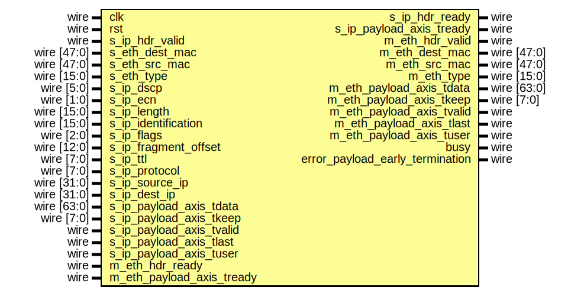

# Entity: ip_eth_tx_64

- **File**: ip_eth_tx_64.v
## Diagram

## Description

 Language: Verilog 2001

## Ports

| Port name                       | Direction | Type        | Description                           |
| ------------------------------- | --------- | ----------- | ------------------------------------- |
| clk                             | input     | wire        |                                       |
| rst                             | input     | wire        |                                       |
| s_ip_hdr_valid                  | input     | wire        |      * IP frame input      */         |
| s_ip_hdr_ready                  | output    | wire        |                                       |
| s_eth_dest_mac                  | input     | wire [47:0] |                                       |
| s_eth_src_mac                   | input     | wire [47:0] |                                       |
| s_eth_type                      | input     | wire [15:0] |                                       |
| s_ip_dscp                       | input     | wire [5:0]  |                                       |
| s_ip_ecn                        | input     | wire [1:0]  |                                       |
| s_ip_length                     | input     | wire [15:0] |                                       |
| s_ip_identification             | input     | wire [15:0] |                                       |
| s_ip_flags                      | input     | wire [2:0]  |                                       |
| s_ip_fragment_offset            | input     | wire [12:0] |                                       |
| s_ip_ttl                        | input     | wire [7:0]  |                                       |
| s_ip_protocol                   | input     | wire [7:0]  |                                       |
| s_ip_source_ip                  | input     | wire [31:0] |                                       |
| s_ip_dest_ip                    | input     | wire [31:0] |                                       |
| s_ip_payload_axis_tdata         | input     | wire [63:0] |                                       |
| s_ip_payload_axis_tkeep         | input     | wire [7:0]  |                                       |
| s_ip_payload_axis_tvalid        | input     | wire        |                                       |
| s_ip_payload_axis_tready        | output    | wire        |                                       |
| s_ip_payload_axis_tlast         | input     | wire        |                                       |
| s_ip_payload_axis_tuser         | input     | wire        |                                       |
| m_eth_hdr_valid                 | output    | wire        |      * Ethernet frame output      */  |
| m_eth_hdr_ready                 | input     | wire        |                                       |
| m_eth_dest_mac                  | output    | wire [47:0] |                                       |
| m_eth_src_mac                   | output    | wire [47:0] |                                       |
| m_eth_type                      | output    | wire [15:0] |                                       |
| m_eth_payload_axis_tdata        | output    | wire [63:0] |                                       |
| m_eth_payload_axis_tkeep        | output    | wire [7:0]  |                                       |
| m_eth_payload_axis_tvalid       | output    | wire        |                                       |
| m_eth_payload_axis_tready       | input     | wire        |                                       |
| m_eth_payload_axis_tlast        | output    | wire        |                                       |
| m_eth_payload_axis_tuser        | output    | wire        |                                       |
| busy                            | output    | wire        |      * Status signals      */         |
| error_payload_early_termination | output    | wire        |                                       |
## Signals

| Name                                  | Type       | Description                |
| ------------------------------------- | ---------- | -------------------------- |
| state_reg                             | reg [2:0]  |                            |
| state_next                            | reg [2:0]  |                            |
| store_ip_hdr                          | reg        |  datapath control signals  |
| store_last_word                       | reg        |                            |
| hdr_ptr_reg                           | reg [5:0]  |                            |
| hdr_ptr_next                          | reg [5:0]  |                            |
| word_count_reg                        | reg [15:0] |                            |
| word_count_next                       | reg [15:0] |                            |
| flush_save                            | reg        |                            |
| transfer_in_save                      | reg        |                            |
| hdr_sum_temp                          | reg [19:0] |                            |
| hdr_sum_reg                           | reg [19:0] |                            |
| hdr_sum_next                          | reg [19:0] |                            |
| last_word_data_reg                    | reg [63:0] |                            |
| last_word_keep_reg                    | reg [7:0]  |                            |
| ip_dscp_reg                           | reg [5:0]  |                            |
| ip_ecn_reg                            | reg [1:0]  |                            |
| ip_length_reg                         | reg [15:0] |                            |
| ip_identification_reg                 | reg [15:0] |                            |
| ip_flags_reg                          | reg [2:0]  |                            |
| ip_fragment_offset_reg                | reg [12:0] |                            |
| ip_ttl_reg                            | reg [7:0]  |                            |
| ip_protocol_reg                       | reg [7:0]  |                            |
| ip_source_ip_reg                      | reg [31:0] |                            |
| ip_dest_ip_reg                        | reg [31:0] |                            |
| s_ip_hdr_ready_reg                    | reg        |                            |
| s_ip_hdr_ready_next                   | reg        |                            |
| s_ip_payload_axis_tready_reg          | reg        |                            |
| s_ip_payload_axis_tready_next         | reg        |                            |
| m_eth_hdr_valid_reg                   | reg        |                            |
| m_eth_hdr_valid_next                  | reg        |                            |
| m_eth_dest_mac_reg                    | reg [47:0] |                            |
| m_eth_src_mac_reg                     | reg [47:0] |                            |
| m_eth_type_reg                        | reg [15:0] |                            |
| busy_reg                              | reg        |                            |
| error_payload_early_termination_reg   | reg        |                            |
| error_payload_early_termination_next  | reg        |                            |
| save_ip_payload_axis_tdata_reg        | reg [63:0] |                            |
| save_ip_payload_axis_tkeep_reg        | reg [7:0]  |                            |
| save_ip_payload_axis_tlast_reg        | reg        |                            |
| save_ip_payload_axis_tuser_reg        | reg        |                            |
| shift_ip_payload_axis_tdata           | reg [63:0] |                            |
| shift_ip_payload_axis_tkeep           | reg [7:0]  |                            |
| shift_ip_payload_axis_tvalid          | reg        |                            |
| shift_ip_payload_axis_tlast           | reg        |                            |
| shift_ip_payload_axis_tuser           | reg        |                            |
| shift_ip_payload_s_tready             | reg        |                            |
| shift_ip_payload_extra_cycle_reg      | reg        |                            |
| m_eth_payload_axis_tdata_int          | reg [63:0] |  internal datapath         |
| m_eth_payload_axis_tkeep_int          | reg [7:0]  |                            |
| m_eth_payload_axis_tvalid_int         | reg        |                            |
| m_eth_payload_axis_tready_int_reg     | reg        |                            |
| m_eth_payload_axis_tlast_int          | reg        |                            |
| m_eth_payload_axis_tuser_int          | reg        |                            |
| m_eth_payload_axis_tready_int_early   | wire       |                            |
| m_eth_payload_axis_tdata_reg          | reg [63:0] |  output datapath logic     |
| m_eth_payload_axis_tkeep_reg          | reg [7:0]  |                            |
| m_eth_payload_axis_tvalid_reg         | reg        |                            |
| m_eth_payload_axis_tvalid_next        | reg        |                            |
| m_eth_payload_axis_tlast_reg          | reg        |                            |
| m_eth_payload_axis_tuser_reg          | reg        |                            |
| temp_m_eth_payload_axis_tdata_reg     | reg [63:0] |                            |
| temp_m_eth_payload_axis_tkeep_reg     | reg [7:0]  |                            |
| temp_m_eth_payload_axis_tvalid_reg    | reg        |                            |
| temp_m_eth_payload_axis_tvalid_next   | reg        |                            |
| temp_m_eth_payload_axis_tlast_reg     | reg        |                            |
| temp_m_eth_payload_axis_tuser_reg     | reg        |                            |
| store_eth_payload_int_to_output       | reg        |  datapath control          |
| store_eth_payload_int_to_temp         | reg        |                            |
| store_eth_payload_axis_temp_to_output | reg        |                            |
## Constants

| Name                     | Type  | Value | Description                                                                                                                                                                                                                                                                                                                                                                                                                                                                                                                                                                                                                                                                                                                                                                                                                                                                                                                                                                                                                        |
| ------------------------ | ----- | ----- | ---------------------------------------------------------------------------------------------------------------------------------------------------------------------------------------------------------------------------------------------------------------------------------------------------------------------------------------------------------------------------------------------------------------------------------------------------------------------------------------------------------------------------------------------------------------------------------------------------------------------------------------------------------------------------------------------------------------------------------------------------------------------------------------------------------------------------------------------------------------------------------------------------------------------------------------------------------------------------------------------------------------------------------- |
| STATE_IDLE               | [2:0] | 3'd0  |   IP Frame   Field                       Length  Destination MAC address     6 octets  Source MAC address          6 octets  Ethertype (0x0800)          2 octets  Version (4)                 4 bits  IHL (5-15)                  4 bits  DSCP (0)                    6 bits  ECN (0)                     2 bits  length                      2 octets  identification (0?)         2 octets  flags (010)                 3 bits  fragment offset (0)         13 bits  time to live (64?)          1 octet  protocol                    1 octet  header checksum             2 octets  source IP                   4 octets  destination IP              4 octets  options                     (IHL-5)*4 octets  payload                     length octets  This module receives an IP frame with header fields in parallel along with the payload in an AXI stream, combines the header with the payload, passes through the Ethernet headers, and transmits the complete Ethernet payload on an AXI interface.  */  |
| STATE_WRITE_HEADER       | [2:0] | 3'd1  |   IP Frame   Field                       Length  Destination MAC address     6 octets  Source MAC address          6 octets  Ethertype (0x0800)          2 octets  Version (4)                 4 bits  IHL (5-15)                  4 bits  DSCP (0)                    6 bits  ECN (0)                     2 bits  length                      2 octets  identification (0?)         2 octets  flags (010)                 3 bits  fragment offset (0)         13 bits  time to live (64?)          1 octet  protocol                    1 octet  header checksum             2 octets  source IP                   4 octets  destination IP              4 octets  options                     (IHL-5)*4 octets  payload                     length octets  This module receives an IP frame with header fields in parallel along with the payload in an AXI stream, combines the header with the payload, passes through the Ethernet headers, and transmits the complete Ethernet payload on an AXI interface.  */  |
| STATE_WRITE_HEADER_LAST  | [2:0] | 3'd2  |   IP Frame   Field                       Length  Destination MAC address     6 octets  Source MAC address          6 octets  Ethertype (0x0800)          2 octets  Version (4)                 4 bits  IHL (5-15)                  4 bits  DSCP (0)                    6 bits  ECN (0)                     2 bits  length                      2 octets  identification (0?)         2 octets  flags (010)                 3 bits  fragment offset (0)         13 bits  time to live (64?)          1 octet  protocol                    1 octet  header checksum             2 octets  source IP                   4 octets  destination IP              4 octets  options                     (IHL-5)*4 octets  payload                     length octets  This module receives an IP frame with header fields in parallel along with the payload in an AXI stream, combines the header with the payload, passes through the Ethernet headers, and transmits the complete Ethernet payload on an AXI interface.  */  |
| STATE_WRITE_PAYLOAD      | [2:0] | 3'd3  |   IP Frame   Field                       Length  Destination MAC address     6 octets  Source MAC address          6 octets  Ethertype (0x0800)          2 octets  Version (4)                 4 bits  IHL (5-15)                  4 bits  DSCP (0)                    6 bits  ECN (0)                     2 bits  length                      2 octets  identification (0?)         2 octets  flags (010)                 3 bits  fragment offset (0)         13 bits  time to live (64?)          1 octet  protocol                    1 octet  header checksum             2 octets  source IP                   4 octets  destination IP              4 octets  options                     (IHL-5)*4 octets  payload                     length octets  This module receives an IP frame with header fields in parallel along with the payload in an AXI stream, combines the header with the payload, passes through the Ethernet headers, and transmits the complete Ethernet payload on an AXI interface.  */  |
| STATE_WRITE_PAYLOAD_LAST | [2:0] | 3'd4  |   IP Frame   Field                       Length  Destination MAC address     6 octets  Source MAC address          6 octets  Ethertype (0x0800)          2 octets  Version (4)                 4 bits  IHL (5-15)                  4 bits  DSCP (0)                    6 bits  ECN (0)                     2 bits  length                      2 octets  identification (0?)         2 octets  flags (010)                 3 bits  fragment offset (0)         13 bits  time to live (64?)          1 octet  protocol                    1 octet  header checksum             2 octets  source IP                   4 octets  destination IP              4 octets  options                     (IHL-5)*4 octets  payload                     length octets  This module receives an IP frame with header fields in parallel along with the payload in an AXI stream, combines the header with the payload, passes through the Ethernet headers, and transmits the complete Ethernet payload on an AXI interface.  */  |
| STATE_WAIT_LAST          | [2:0] | 3'd5  |   IP Frame   Field                       Length  Destination MAC address     6 octets  Source MAC address          6 octets  Ethertype (0x0800)          2 octets  Version (4)                 4 bits  IHL (5-15)                  4 bits  DSCP (0)                    6 bits  ECN (0)                     2 bits  length                      2 octets  identification (0?)         2 octets  flags (010)                 3 bits  fragment offset (0)         13 bits  time to live (64?)          1 octet  protocol                    1 octet  header checksum             2 octets  source IP                   4 octets  destination IP              4 octets  options                     (IHL-5)*4 octets  payload                     length octets  This module receives an IP frame with header fields in parallel along with the payload in an AXI stream, combines the header with the payload, passes through the Ethernet headers, and transmits the complete Ethernet payload on an AXI interface.  */  |
## Functions
- keep2count () return ([3:0])
- count2keep () return ([7:0])
## Processes
- unnamed: ( @* )
  - **Type:** always
- unnamed: ( @* )
  - **Type:** always
- unnamed: ( @(posedge clk) )
  - **Type:** always
- unnamed: ( @* )
  - **Type:** always
- unnamed: ( @(posedge clk) )
  - **Type:** always
