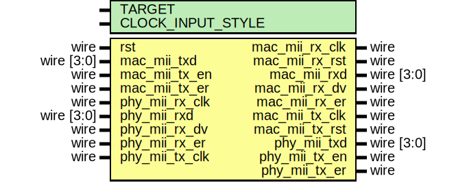

# Entity: mii_phy_if

- **File**: mii_phy_if.v
## Diagram

## Description

 Language: Verilog 2001

## Generics

| Generic name      | Type | Value     | Description                                                                                                                                           |
| ----------------- | ---- | --------- | ----------------------------------------------------------------------------------------------------------------------------------------------------- |
| TARGET            |      | "GENERIC" |  target ("SIM", "GENERIC", "XILINX", "ALTERA")                                                                                                        |
| CLOCK_INPUT_STYLE |      | "BUFIO2"  |  Clock input style ("BUFG", "BUFR", "BUFIO", "BUFIO2")  Use BUFR for Virtex-5, Virtex-6, 7-series  Use BUFG for Ultrascale  Use BUFIO2 for Spartan-6  |
## Ports

| Port name      | Direction | Type       | Description                          |
| -------------- | --------- | ---------- | ------------------------------------ |
| rst            | input     | wire       |                                      |
| mac_mii_rx_clk | output    | wire       |      * MII interface to MAC      */  |
| mac_mii_rx_rst | output    | wire       |                                      |
| mac_mii_rxd    | output    | wire [3:0] |                                      |
| mac_mii_rx_dv  | output    | wire       |                                      |
| mac_mii_rx_er  | output    | wire       |                                      |
| mac_mii_tx_clk | output    | wire       |                                      |
| mac_mii_tx_rst | output    | wire       |                                      |
| mac_mii_txd    | input     | wire [3:0] |                                      |
| mac_mii_tx_en  | input     | wire       |                                      |
| mac_mii_tx_er  | input     | wire       |                                      |
| phy_mii_rx_clk | input     | wire       |      * MII interface to PHY      */  |
| phy_mii_rxd    | input     | wire [3:0] |                                      |
| phy_mii_rx_dv  | input     | wire       |                                      |
| phy_mii_rx_er  | input     | wire       |                                      |
| phy_mii_tx_clk | input     | wire       |                                      |
| phy_mii_txd    | output    | wire [3:0] |                                      |
| phy_mii_tx_en  | output    | wire       |                                      |
| phy_mii_tx_er  | output    | wire       |                                      |
## Signals

| Name              | Type      | Description  |
| ----------------- | --------- | ------------ |
| phy_mii_txd_reg   | reg [3:0] |              |
| phy_mii_tx_en_reg | reg       |              |
| phy_mii_tx_er_reg | reg       |              |
| tx_rst_reg        | reg [3:0] |  reset sync  |
| rx_rst_reg        | reg [3:0] |              |
## Processes
- unnamed: ( @(posedge mac_mii_tx_clk) )
  - **Type:** always
- unnamed: ( @(posedge mac_mii_tx_clk or posedge rst) )
  - **Type:** always
- unnamed: ( @(posedge mac_mii_rx_clk or posedge rst) )
  - **Type:** always
## Instantiations

- rx_ssio_sdr_inst: ssio_sdr_in
