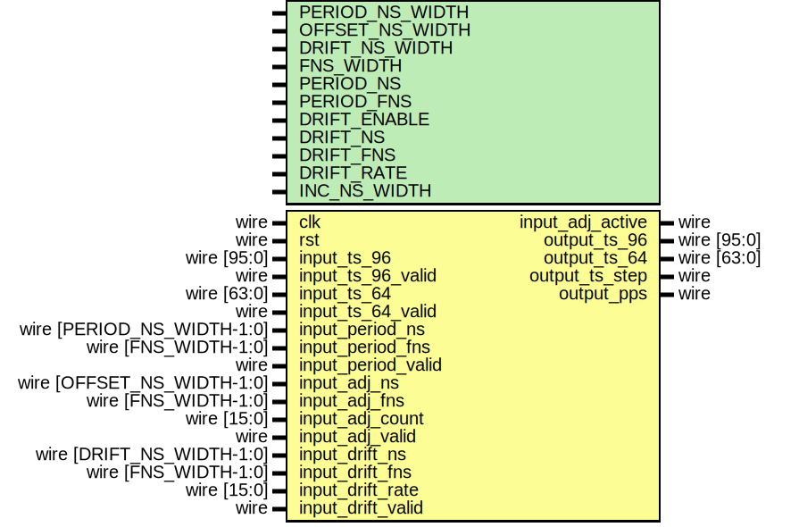

# Entity: ptp_clock

- **File**: ptp_clock.v
## Diagram

## Description

 Language: Verilog 2001

## Generics

| Generic name    | Type | Value                                                               | Description |
| --------------- | ---- | ------------------------------------------------------------------- | ----------- |
| PERIOD_NS_WIDTH |      | 4                                                                   |             |
| OFFSET_NS_WIDTH |      | 4                                                                   |             |
| DRIFT_NS_WIDTH  |      | 4                                                                   |             |
| FNS_WIDTH       |      | 16                                                                  |             |
| PERIOD_NS       |      | 4'h6                                                                |             |
| PERIOD_FNS      |      | 16'h6666                                                            |             |
| DRIFT_ENABLE    |      | 1                                                                   |             |
| DRIFT_NS        |      | 4'h0                                                                |             |
| DRIFT_FNS       |      | 16'h0002                                                            |             |
| DRIFT_RATE      |      | 16'h0005                                                            |             |
| INC_NS_WIDTH    |      | $clog2(2**PERIOD_NS_WIDTH + 2**OFFSET_NS_WIDTH + 2**DRIFT_NS_WIDTH) |             |
## Ports

| Port name          | Direction | Type                       | Description                                          |
| ------------------ | --------- | -------------------------- | ---------------------------------------------------- |
| clk                | input     | wire                       |                                                      |
| rst                | input     | wire                       |                                                      |
| input_ts_96        | input     | wire [95:0]                |      * Timestamp inputs for synchronization      */  |
| input_ts_96_valid  | input     | wire                       |                                                      |
| input_ts_64        | input     | wire [63:0]                |                                                      |
| input_ts_64_valid  | input     | wire                       |                                                      |
| input_period_ns    | input     | wire [PERIOD_NS_WIDTH-1:0] |      * Period adjustment      */                     |
| input_period_fns   | input     | wire [FNS_WIDTH-1:0]       |                                                      |
| input_period_valid | input     | wire                       |                                                      |
| input_adj_ns       | input     | wire [OFFSET_NS_WIDTH-1:0] |      * Offset adjustment      */                     |
| input_adj_fns      | input     | wire [FNS_WIDTH-1:0]       |                                                      |
| input_adj_count    | input     | wire [15:0]                |                                                      |
| input_adj_valid    | input     | wire                       |                                                      |
| input_adj_active   | output    | wire                       |                                                      |
| input_drift_ns     | input     | wire [DRIFT_NS_WIDTH-1:0]  |      * Drift adjustment      */                      |
| input_drift_fns    | input     | wire [FNS_WIDTH-1:0]       |                                                      |
| input_drift_rate   | input     | wire [15:0]                |                                                      |
| input_drift_valid  | input     | wire                       |                                                      |
| output_ts_96       | output    | wire [95:0]                |      * Timestamp outputs      */                     |
| output_ts_64       | output    | wire [63:0]                |                                                      |
| output_ts_step     | output    | wire                       |                                                      |
| output_pps         | output    | wire                       |      * PPS output      */                            |
## Signals

| Name              | Type                      | Description |
| ----------------- | ------------------------- | ----------- |
| period_ns_reg     | reg [PERIOD_NS_WIDTH-1:0] |             |
| period_fns_reg    | reg [FNS_WIDTH-1:0]       |             |
| adj_ns_reg        | reg [OFFSET_NS_WIDTH-1:0] |             |
| adj_fns_reg       | reg [FNS_WIDTH-1:0]       |             |
| adj_count_reg     | reg [15:0]                |             |
| adj_active_reg    | reg                       |             |
| drift_ns_reg      | reg [DRIFT_NS_WIDTH-1:0]  |             |
| drift_fns_reg     | reg [FNS_WIDTH-1:0]       |             |
| drift_rate_reg    | reg [15:0]                |             |
| ts_inc_ns_reg     | reg [INC_NS_WIDTH-1:0]    |             |
| ts_inc_fns_reg    | reg [FNS_WIDTH-1:0]       |             |
| ts_96_s_reg       | reg [47:0]                |             |
| ts_96_ns_reg      | reg [29:0]                |             |
| ts_96_fns_reg     | reg [FNS_WIDTH-1:0]       |             |
| ts_96_ns_inc_reg  | reg [29:0]                |             |
| ts_96_fns_inc_reg | reg [FNS_WIDTH-1:0]       |             |
| ts_96_ns_ovf_reg  | reg [30:0]                |             |
| ts_96_fns_ovf_reg | reg [FNS_WIDTH-1:0]       |             |
| ts_64_ns_reg      | reg [47:0]                |             |
| ts_64_fns_reg     | reg [FNS_WIDTH-1:0]       |             |
| ts_step_reg       | reg                       |             |
| drift_cnt         | reg [15:0]                |             |
| temp              | reg [47:0]                |             |
| pps_reg           | reg                       |             |
## Processes
- unnamed: ( @(posedge clk) )
  - **Type:** always
