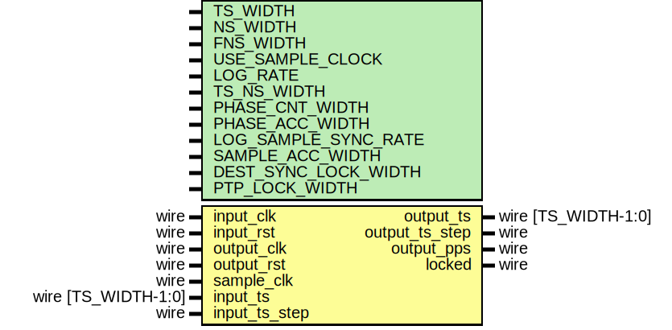

# Entity: ptp_clock_cdc

- **File**: ptp_clock_cdc.v
## Diagram

## Description

Language: Verilog 2001
 
## Generics

| Generic name         | Type | Value                    | Description |
| -------------------- | ---- | ------------------------ | ----------- |
| TS_WIDTH             |      | 96                       |             |
| NS_WIDTH             |      | 4                        |             |
| FNS_WIDTH            |      | 16                       |             |
| USE_SAMPLE_CLOCK     |      | 1                        |             |
| LOG_RATE             |      | 3                        |             |
| TS_NS_WIDTH          |      | TS_WIDTH == 96 ? 30 : 48 |             |
| PHASE_CNT_WIDTH      |      | LOG_RATE                 |             |
| PHASE_ACC_WIDTH      |      | PHASE_CNT_WIDTH+16       |             |
| LOG_SAMPLE_SYNC_RATE |      | LOG_RATE                 |             |
| SAMPLE_ACC_WIDTH     |      | LOG_SAMPLE_SYNC_RATE+2   |             |
| DEST_SYNC_LOCK_WIDTH |      | 7                        |             |
| PTP_LOCK_WIDTH       |      | 8                        |             |
## Ports

| Port name      | Direction | Type                | Description |
| -------------- | --------- | ------------------- | ----------- |
| input_clk      | input     | wire                |             |
| input_rst      | input     | wire                |             |
| output_clk     | input     | wire                |             |
| output_rst     | input     | wire                |             |
| sample_clk     | input     | wire                |             |
| input_ts       | input     | wire [TS_WIDTH-1:0] |             |
| input_ts_step  | input     | wire                |             |
| output_ts      | output    | wire [TS_WIDTH-1:0] |             |
| output_ts_step | output    | wire                |             |
| output_pps     | output    | wire                |             |
| locked         | output    | wire                |             |
## Signals

| Name                       | Type                           | Description                              |
| -------------------------- | ------------------------------ | ---------------------------------------- |
| period_ns_reg              | reg [NS_WIDTH-1:0]             |                                          |
| period_ns_next             | reg [NS_WIDTH-1:0]             |                                          |
| period_fns_reg             | reg [FNS_WIDTH-1:0]            |                                          |
| period_fns_next            | reg [FNS_WIDTH-1:0]            |                                          |
| src_ts_s_capt_reg          | reg [47:0]                     |                                          |
| src_ts_ns_capt_reg         | reg [TS_NS_WIDTH-1:0]          |                                          |
| src_ts_fns_capt_reg        | reg [FNS_WIDTH-1:0]            |                                          |
| src_ts_step_capt_reg       | reg                            |                                          |
| dest_ts_s_capt_reg         | reg [47:0]                     |                                          |
| dest_ts_ns_capt_reg        | reg [TS_NS_WIDTH-1:0]          |                                          |
| dest_ts_fns_capt_reg       | reg [FNS_WIDTH-1:0]            |                                          |
| ts_s_sync_reg              | reg [47:0]                     |                                          |
| ts_ns_sync_reg             | reg [TS_NS_WIDTH-1:0]          |                                          |
| ts_fns_sync_reg            | reg [FNS_WIDTH-1:0]            |                                          |
| ts_step_sync_reg           | reg                            |                                          |
| ts_s_reg                   | reg [47:0]                     |                                          |
| ts_s_next                  | reg [47:0]                     |                                          |
| ts_ns_reg                  | reg [TS_NS_WIDTH-1:0]          |                                          |
| ts_ns_next                 | reg [TS_NS_WIDTH-1:0]          |                                          |
| ts_fns_reg                 | reg [FNS_WIDTH-1:0]            |                                          |
| ts_fns_next                | reg [FNS_WIDTH-1:0]            |                                          |
| ts_ns_inc_reg              | reg [TS_NS_WIDTH-1:0]          |                                          |
| ts_ns_inc_next             | reg [TS_NS_WIDTH-1:0]          |                                          |
| ts_fns_inc_reg             | reg [FNS_WIDTH-1:0]            |                                          |
| ts_fns_inc_next            | reg [FNS_WIDTH-1:0]            |                                          |
| ts_ns_ovf_reg              | reg [TS_NS_WIDTH+1-1:0]        |                                          |
| ts_ns_ovf_next             | reg [TS_NS_WIDTH+1-1:0]        |                                          |
| ts_fns_ovf_reg             | reg [FNS_WIDTH-1:0]            |                                          |
| ts_fns_ovf_next            | reg [FNS_WIDTH-1:0]            |                                          |
| ts_step_reg                | reg                            |                                          |
| ts_step_next               | reg                            |                                          |
| pps_reg                    | reg                            |                                          |
| src_phase_reg              | reg [PHASE_CNT_WIDTH-1:0]      |                                          |
| dest_phase_reg             | reg [PHASE_ACC_WIDTH-1:0]      |                                          |
| dest_phase_next            | reg [PHASE_ACC_WIDTH-1:0]      |                                          |
| dest_phase_inc_reg         | reg [PHASE_ACC_WIDTH-1:0]      |                                          |
| dest_phase_inc_next        | reg [PHASE_ACC_WIDTH-1:0]      |                                          |
| src_sync_reg               | reg                            |                                          |
| src_update_reg             | reg                            |                                          |
| dest_sync_reg              | reg                            |                                          |
| dest_sync_next             | reg                            |                                          |
| dest_update_reg            | reg                            |                                          |
| dest_update_next           | reg                            |                                          |
| src_sync_sync1_reg         | reg                            |                                          |
| src_sync_sync2_reg         | reg                            |                                          |
| src_sync_sync3_reg         | reg                            |                                          |
| dest_sync_sync1_reg        | reg                            |                                          |
| dest_sync_sync2_reg        | reg                            |                                          |
| dest_sync_sync3_reg        | reg                            |                                          |
| src_sync_sample_sync1_reg  | reg                            |                                          |
| src_sync_sample_sync2_reg  | reg                            |                                          |
| src_sync_sample_sync3_reg  | reg                            |                                          |
| dest_sync_sample_sync1_reg | reg                            |                                          |
| dest_sync_sample_sync2_reg | reg                            |                                          |
| dest_sync_sample_sync3_reg | reg                            |                                          |
| sample_acc_reg             | reg [SAMPLE_ACC_WIDTH-1:0]     |                                          |
| sample_acc_next            | reg [SAMPLE_ACC_WIDTH-1:0]     |                                          |
| sample_acc_out_reg         | reg [SAMPLE_ACC_WIDTH-1:0]     |                                          |
| sample_cnt_reg             | reg [LOG_SAMPLE_SYNC_RATE-1:0] |                                          |
| sample_update_reg          | reg                            |                                          |
| sample_update_sync1_reg    | reg                            |                                          |
| sample_update_sync2_reg    | reg                            |                                          |
| sample_update_sync3_reg    | reg                            |                                          |
| input_ts_step_reg          | reg                            | source PTP clock capture and sync logic  |
| edge_1_reg                 | reg                            |                                          |
| edge_2_reg                 | reg                            |                                          |
| active_reg                 | reg [3:0]                      |                                          |
| sample_acc_sync_reg        | reg [SAMPLE_ACC_WIDTH-1:0]     |                                          |
| sample_acc_sync_valid_reg  | reg                            |                                          |
| dest_err_int_reg           | reg [PHASE_ACC_WIDTH-1:0]      |                                          |
| dest_err_int_next          | reg [PHASE_ACC_WIDTH-1:0]      |                                          |
| dest_ovf                   | reg [1:0]                      |                                          |
| dest_sync_lock_count_reg   | reg [DEST_SYNC_LOCK_WIDTH-1:0] |                                          |
| dest_sync_lock_count_next  | reg [DEST_SYNC_LOCK_WIDTH-1:0] |                                          |
| dest_sync_locked_reg       | reg                            |                                          |
| dest_sync_locked_next      | reg                            |                                          |
## Processes
- unnamed: ( @(posedge input_clk) )
- unnamed: ( @(posedge output_clk) )
**Description**
CDC logic

- unnamed: ( @(posedge sample_clk) )
- unnamed: ( @(posedge sample_clk) )
- unnamed: ( @(posedge output_clk) )
- unnamed: ( @(posedge output_clk) )
- unnamed: ( @* )
