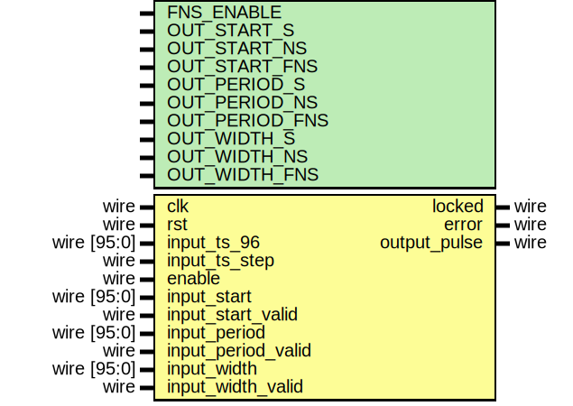

# Entity: ptp_perout

## Diagram

## Description

Language: Verilog 2001
 
## Generics

| Generic name   | Type | Value    | Description |
| -------------- | ---- | -------- | ----------- |
| FNS_ENABLE     |      | 1        |             |
| OUT_START_S    |      | 48'h0    |             |
| OUT_START_NS   |      | 30'h0    |             |
| OUT_START_FNS  |      | 16'h0000 |             |
| OUT_PERIOD_S   |      | 48'd1    |             |
| OUT_PERIOD_NS  |      | 30'd0    |             |
| OUT_PERIOD_FNS |      | 16'h0000 |             |
| OUT_WIDTH_S    |      | 48'h0    |             |
| OUT_WIDTH_NS   |      | 30'd1000 |             |
| OUT_WIDTH_FNS  |      | 16'h0000 |             |
## Ports

| Port name          | Direction | Type        | Description |
| ------------------ | --------- | ----------- | ----------- |
| clk                | input     | wire        |             |
| rst                | input     | wire        |             |
| input_ts_96        | input     | wire [95:0] |             |
| input_ts_step      | input     | wire        |             |
| enable             | input     | wire        |             |
| input_start        | input     | wire [95:0] |             |
| input_start_valid  | input     | wire        |             |
| input_period       | input     | wire [95:0] |             |
| input_period_valid | input     | wire        |             |
| input_width        | input     | wire [95:0] |             |
| input_width_valid  | input     | wire        |             |
| locked             | output    | wire        |             |
| error              | output    | wire        |             |
| output_pulse       | output    | wire        |             |
## Signals

| Name               | Type       | Description |
| ------------------ | ---------- | ----------- |
| state_reg          | reg [2:0]  |             |
| state_next         | reg [2:0]  |             |
| time_s_reg         | reg [47:0] |             |
| time_ns_reg        | reg [30:0] |             |
| time_fns_reg       | reg [15:0] |             |
| next_rise_s_reg    | reg [47:0] |             |
| next_rise_s_next   | reg [47:0] |             |
| next_rise_ns_reg   | reg [30:0] |             |
| next_rise_ns_next  | reg [30:0] |             |
| next_rise_fns_reg  | reg [15:0] |             |
| next_rise_fns_next | reg [15:0] |             |
| next_fall_s_reg    | reg [47:0] |             |
| next_fall_s_next   | reg [47:0] |             |
| next_fall_ns_reg   | reg [30:0] |             |
| next_fall_ns_next  | reg [30:0] |             |
| next_fall_fns_reg  | reg [15:0] |             |
| next_fall_fns_next | reg [15:0] |             |
| start_s_reg        | reg [47:0] |             |
| start_ns_reg       | reg [30:0] |             |
| start_fns_reg      | reg [15:0] |             |
| period_s_reg       | reg [47:0] |             |
| period_ns_reg      | reg [30:0] |             |
| period_fns_reg     | reg [15:0] |             |
| width_s_reg        | reg [47:0] |             |
| width_ns_reg       | reg [30:0] |             |
| width_fns_reg      | reg [15:0] |             |
| ts_96_ns_inc_reg   | reg [29:0] |             |
| ts_96_ns_inc_next  | reg [29:0] |             |
| ts_96_fns_inc_reg  | reg [15:0] |             |
| ts_96_fns_inc_next | reg [15:0] |             |
| ts_96_ns_ovf_reg   | reg [30:0] |             |
| ts_96_ns_ovf_next  | reg [30:0] |             |
| ts_96_fns_ovf_reg  | reg [15:0] |             |
| ts_96_fns_ovf_next | reg [15:0] |             |
| locked_reg         | reg        |             |
| locked_next        | reg        |             |
| error_reg          | reg        |             |
| error_next         | reg        |             |
| level_reg          | reg        |             |
| level_next         | reg        |             |
| output_reg         | reg        |             |
| output_next        | reg        |             |
## Constants

| Name                | Type  | Value | Description |
| ------------------- | ----- | ----- | ----------- |
| STATE_IDLE          | [2:0] | 3'd0  |             |
| STATE_UPDATE_RISE_1 | [2:0] | 3'd1  |             |
| STATE_UPDATE_RISE_2 | [2:0] | 3'd2  |             |
| STATE_UPDATE_FALL_1 | [2:0] | 3'd3  |             |
| STATE_UPDATE_FALL_2 | [2:0] | 3'd4  |             |
| STATE_WAIT_EDGE     | [2:0] | 3'd5  |             |
## Processes
- unnamed: ( @* )
- unnamed: ( @(posedge clk) )
