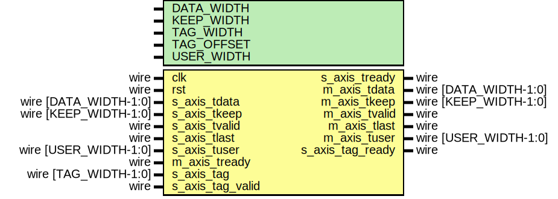

# Entity: ptp_tag_insert

- **File**: ptp_tag_insert.v
## Diagram

## Description

Language: Verilog 2001
 
## Generics

| Generic name | Type | Value                | Description |
| ------------ | ---- | -------------------- | ----------- |
| DATA_WIDTH   |      | 64                   |             |
| KEEP_WIDTH   |      | DATA_WIDTH/8         |             |
| TAG_WIDTH    |      | 16                   |             |
| TAG_OFFSET   |      | 1                    |             |
| USER_WIDTH   |      | TAG_WIDTH+TAG_OFFSET |             |
## Ports

| Port name        | Direction | Type                  | Description |
| ---------------- | --------- | --------------------- | ----------- |
| clk              | input     | wire                  |             |
| rst              | input     | wire                  |             |
| s_axis_tdata     | input     | wire [DATA_WIDTH-1:0] |             |
| s_axis_tkeep     | input     | wire [KEEP_WIDTH-1:0] |             |
| s_axis_tvalid    | input     | wire                  |             |
| s_axis_tready    | output    | wire                  |             |
| s_axis_tlast     | input     | wire                  |             |
| s_axis_tuser     | input     | wire [USER_WIDTH-1:0] |             |
| m_axis_tdata     | output    | wire [DATA_WIDTH-1:0] |             |
| m_axis_tkeep     | output    | wire [KEEP_WIDTH-1:0] |             |
| m_axis_tvalid    | output    | wire                  |             |
| m_axis_tready    | input     | wire                  |             |
| m_axis_tlast     | output    | wire                  |             |
| m_axis_tuser     | output    | wire [USER_WIDTH-1:0] |             |
| s_axis_tag       | input     | wire [TAG_WIDTH-1:0]  |             |
| s_axis_tag_valid | input     | wire                  |             |
| s_axis_tag_ready | output    | wire                  |             |
## Signals

| Name          | Type                 | Description |
| ------------- | -------------------- | ----------- |
| tag_reg       | reg [TAG_WIDTH-1:0]  |             |
| tag_valid_reg | reg                  |             |
| user          | reg [USER_WIDTH-1:0] |             |
## Processes
- unnamed: ( @* )
- unnamed: ( @(posedge clk) )
