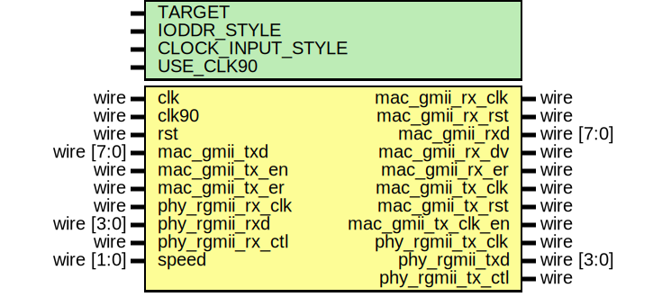

# Entity: rgmii_phy_if

## Diagram

## Description

Language: Verilog 2001
 
## Generics

| Generic name      | Type | Value     | Description                                                                                                                                       |
| ----------------- | ---- | --------- | ------------------------------------------------------------------------------------------------------------------------------------------------- |
| TARGET            |      | "GENERIC" | target ("SIM", "GENERIC", "XILINX", "ALTERA")                                                                                                     |
| IODDR_STYLE       |      | "IODDR2"  | IODDR style ("IODDR", "IODDR2") Use IODDR for Virtex-4, Virtex-5, Virtex-6, 7 Series, Ultrascale Use IODDR2 for Spartan-6                         |
| CLOCK_INPUT_STYLE |      | "BUFIO2"  | Clock input style ("BUFG", "BUFR", "BUFIO", "BUFIO2") Use BUFR for Virtex-5, Virtex-6, 7-series Use BUFG for Ultrascale Use BUFIO2 for Spartan-6  |
| USE_CLK90         |      | "TRUE"    | Use 90 degree clock for RGMII transmit ("TRUE", "FALSE")                                                                                          |
## Ports

| Port name          | Direction | Type       | Description |
| ------------------ | --------- | ---------- | ----------- |
| clk                | input     | wire       |             |
| clk90              | input     | wire       |             |
| rst                | input     | wire       |             |
| mac_gmii_rx_clk    | output    | wire       |             |
| mac_gmii_rx_rst    | output    | wire       |             |
| mac_gmii_rxd       | output    | wire [7:0] |             |
| mac_gmii_rx_dv     | output    | wire       |             |
| mac_gmii_rx_er     | output    | wire       |             |
| mac_gmii_tx_clk    | output    | wire       |             |
| mac_gmii_tx_rst    | output    | wire       |             |
| mac_gmii_tx_clk_en | output    | wire       |             |
| mac_gmii_txd       | input     | wire [7:0] |             |
| mac_gmii_tx_en     | input     | wire       |             |
| mac_gmii_tx_er     | input     | wire       |             |
| phy_rgmii_rx_clk   | input     | wire       |             |
| phy_rgmii_rxd      | input     | wire [3:0] |             |
| phy_rgmii_rx_ctl   | input     | wire       |             |
| phy_rgmii_tx_clk   | output    | wire       |             |
| phy_rgmii_txd      | output    | wire [3:0] |             |
| phy_rgmii_tx_ctl   | output    | wire       |             |
| speed              | input     | wire [1:0] |             |
## Signals

| Name                 | Type       | Description |
| -------------------- | ---------- | ----------- |
| rgmii_rx_ctl_1       | wire       | receive     |
| rgmii_rx_ctl_2       | wire       |             |
| rgmii_tx_clk_1       | reg        | transmit    |
| rgmii_tx_clk_2       | reg        |             |
| rgmii_tx_clk_rise    | reg        |             |
| rgmii_tx_clk_fall    | reg        |             |
| count_reg            | reg [5:0]  |             |
| count_next           | reg [5:0]  |             |
| rgmii_txd_1          | reg [3:0]  |             |
| rgmii_txd_2          | reg [3:0]  |             |
| rgmii_tx_ctl_1       | reg        |             |
| rgmii_tx_ctl_2       | reg        |             |
| gmii_clk_en          | reg        |             |
| phy_rgmii_tx_clk_new | wire       |             |
| phy_rgmii_txd_new    | wire [3:0] |             |
| phy_rgmii_tx_ctl_new | wire       |             |
| tx_rst_reg           | reg [3:0]  | reset sync  |
| rx_rst_reg           | reg [3:0]  |             |
## Processes
- unnamed: ( @(posedge clk) )
- unnamed: ( @* )
- unnamed: ( @(posedge mac_gmii_tx_clk or posedge rst) )
- unnamed: ( @(posedge mac_gmii_rx_clk or posedge rst) )
## Instantiations

- rx_ssio_ddr_inst: ssio_ddr_in
- clk_oddr_inst: oddr
- data_oddr_inst: oddr
