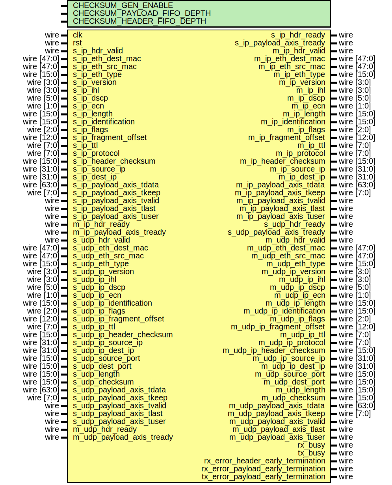

# Entity: udp_64

- **File**: udp_64.v
## Diagram

## Description

 Language: Verilog 2001

## Generics

| Generic name                | Type | Value | Description |
| --------------------------- | ---- | ----- | ----------- |
| CHECKSUM_GEN_ENABLE         |      | 1     |             |
| CHECKSUM_PAYLOAD_FIFO_DEPTH |      | 2048  |             |
| CHECKSUM_HEADER_FIFO_DEPTH  |      | 8     |             |
## Ports

| Port name                          | Direction | Type        | Description                      |
| ---------------------------------- | --------- | ----------- | -------------------------------- |
| clk                                | input     | wire        |                                  |
| rst                                | input     | wire        |                                  |
| s_ip_hdr_valid                     | input     | wire        |      * IP frame input      */    |
| s_ip_hdr_ready                     | output    | wire        |                                  |
| s_ip_eth_dest_mac                  | input     | wire [47:0] |                                  |
| s_ip_eth_src_mac                   | input     | wire [47:0] |                                  |
| s_ip_eth_type                      | input     | wire [15:0] |                                  |
| s_ip_version                       | input     | wire [3:0]  |                                  |
| s_ip_ihl                           | input     | wire [3:0]  |                                  |
| s_ip_dscp                          | input     | wire [5:0]  |                                  |
| s_ip_ecn                           | input     | wire [1:0]  |                                  |
| s_ip_length                        | input     | wire [15:0] |                                  |
| s_ip_identification                | input     | wire [15:0] |                                  |
| s_ip_flags                         | input     | wire [2:0]  |                                  |
| s_ip_fragment_offset               | input     | wire [12:0] |                                  |
| s_ip_ttl                           | input     | wire [7:0]  |                                  |
| s_ip_protocol                      | input     | wire [7:0]  |                                  |
| s_ip_header_checksum               | input     | wire [15:0] |                                  |
| s_ip_source_ip                     | input     | wire [31:0] |                                  |
| s_ip_dest_ip                       | input     | wire [31:0] |                                  |
| s_ip_payload_axis_tdata            | input     | wire [63:0] |                                  |
| s_ip_payload_axis_tkeep            | input     | wire [7:0]  |                                  |
| s_ip_payload_axis_tvalid           | input     | wire        |                                  |
| s_ip_payload_axis_tready           | output    | wire        |                                  |
| s_ip_payload_axis_tlast            | input     | wire        |                                  |
| s_ip_payload_axis_tuser            | input     | wire        |                                  |
| m_ip_hdr_valid                     | output    | wire        |      * IP frame output      */   |
| m_ip_hdr_ready                     | input     | wire        |                                  |
| m_ip_eth_dest_mac                  | output    | wire [47:0] |                                  |
| m_ip_eth_src_mac                   | output    | wire [47:0] |                                  |
| m_ip_eth_type                      | output    | wire [15:0] |                                  |
| m_ip_version                       | output    | wire [3:0]  |                                  |
| m_ip_ihl                           | output    | wire [3:0]  |                                  |
| m_ip_dscp                          | output    | wire [5:0]  |                                  |
| m_ip_ecn                           | output    | wire [1:0]  |                                  |
| m_ip_length                        | output    | wire [15:0] |                                  |
| m_ip_identification                | output    | wire [15:0] |                                  |
| m_ip_flags                         | output    | wire [2:0]  |                                  |
| m_ip_fragment_offset               | output    | wire [12:0] |                                  |
| m_ip_ttl                           | output    | wire [7:0]  |                                  |
| m_ip_protocol                      | output    | wire [7:0]  |                                  |
| m_ip_header_checksum               | output    | wire [15:0] |                                  |
| m_ip_source_ip                     | output    | wire [31:0] |                                  |
| m_ip_dest_ip                       | output    | wire [31:0] |                                  |
| m_ip_payload_axis_tdata            | output    | wire [63:0] |                                  |
| m_ip_payload_axis_tkeep            | output    | wire [7:0]  |                                  |
| m_ip_payload_axis_tvalid           | output    | wire        |                                  |
| m_ip_payload_axis_tready           | input     | wire        |                                  |
| m_ip_payload_axis_tlast            | output    | wire        |                                  |
| m_ip_payload_axis_tuser            | output    | wire        |                                  |
| s_udp_hdr_valid                    | input     | wire        |      * UDP frame input      */   |
| s_udp_hdr_ready                    | output    | wire        |                                  |
| s_udp_eth_dest_mac                 | input     | wire [47:0] |                                  |
| s_udp_eth_src_mac                  | input     | wire [47:0] |                                  |
| s_udp_eth_type                     | input     | wire [15:0] |                                  |
| s_udp_ip_version                   | input     | wire [3:0]  |                                  |
| s_udp_ip_ihl                       | input     | wire [3:0]  |                                  |
| s_udp_ip_dscp                      | input     | wire [5:0]  |                                  |
| s_udp_ip_ecn                       | input     | wire [1:0]  |                                  |
| s_udp_ip_identification            | input     | wire [15:0] |                                  |
| s_udp_ip_flags                     | input     | wire [2:0]  |                                  |
| s_udp_ip_fragment_offset           | input     | wire [12:0] |                                  |
| s_udp_ip_ttl                       | input     | wire [7:0]  |                                  |
| s_udp_ip_header_checksum           | input     | wire [15:0] |                                  |
| s_udp_ip_source_ip                 | input     | wire [31:0] |                                  |
| s_udp_ip_dest_ip                   | input     | wire [31:0] |                                  |
| s_udp_source_port                  | input     | wire [15:0] |                                  |
| s_udp_dest_port                    | input     | wire [15:0] |                                  |
| s_udp_length                       | input     | wire [15:0] |                                  |
| s_udp_checksum                     | input     | wire [15:0] |                                  |
| s_udp_payload_axis_tdata           | input     | wire [63:0] |                                  |
| s_udp_payload_axis_tkeep           | input     | wire [7:0]  |                                  |
| s_udp_payload_axis_tvalid          | input     | wire        |                                  |
| s_udp_payload_axis_tready          | output    | wire        |                                  |
| s_udp_payload_axis_tlast           | input     | wire        |                                  |
| s_udp_payload_axis_tuser           | input     | wire        |                                  |
| m_udp_hdr_valid                    | output    | wire        |      * UDP frame output      */  |
| m_udp_hdr_ready                    | input     | wire        |                                  |
| m_udp_eth_dest_mac                 | output    | wire [47:0] |                                  |
| m_udp_eth_src_mac                  | output    | wire [47:0] |                                  |
| m_udp_eth_type                     | output    | wire [15:0] |                                  |
| m_udp_ip_version                   | output    | wire [3:0]  |                                  |
| m_udp_ip_ihl                       | output    | wire [3:0]  |                                  |
| m_udp_ip_dscp                      | output    | wire [5:0]  |                                  |
| m_udp_ip_ecn                       | output    | wire [1:0]  |                                  |
| m_udp_ip_length                    | output    | wire [15:0] |                                  |
| m_udp_ip_identification            | output    | wire [15:0] |                                  |
| m_udp_ip_flags                     | output    | wire [2:0]  |                                  |
| m_udp_ip_fragment_offset           | output    | wire [12:0] |                                  |
| m_udp_ip_ttl                       | output    | wire [7:0]  |                                  |
| m_udp_ip_protocol                  | output    | wire [7:0]  |                                  |
| m_udp_ip_header_checksum           | output    | wire [15:0] |                                  |
| m_udp_ip_source_ip                 | output    | wire [31:0] |                                  |
| m_udp_ip_dest_ip                   | output    | wire [31:0] |                                  |
| m_udp_source_port                  | output    | wire [15:0] |                                  |
| m_udp_dest_port                    | output    | wire [15:0] |                                  |
| m_udp_length                       | output    | wire [15:0] |                                  |
| m_udp_checksum                     | output    | wire [15:0] |                                  |
| m_udp_payload_axis_tdata           | output    | wire [63:0] |                                  |
| m_udp_payload_axis_tkeep           | output    | wire [7:0]  |                                  |
| m_udp_payload_axis_tvalid          | output    | wire        |                                  |
| m_udp_payload_axis_tready          | input     | wire        |                                  |
| m_udp_payload_axis_tlast           | output    | wire        |                                  |
| m_udp_payload_axis_tuser           | output    | wire        |                                  |
| rx_busy                            | output    | wire        |      * Status signals      */    |
| tx_busy                            | output    | wire        |                                  |
| rx_error_header_early_termination  | output    | wire        |                                  |
| rx_error_payload_early_termination | output    | wire        |                                  |
| tx_error_payload_early_termination | output    | wire        |                                  |
## Signals

| Name                       | Type        | Description |
| -------------------------- | ----------- | ----------- |
| tx_udp_hdr_valid           | wire        |             |
| tx_udp_hdr_ready           | wire        |             |
| tx_udp_eth_dest_mac        | wire [47:0] |             |
| tx_udp_eth_src_mac         | wire [47:0] |             |
| tx_udp_eth_type            | wire [15:0] |             |
| tx_udp_ip_version          | wire [3:0]  |             |
| tx_udp_ip_ihl              | wire [3:0]  |             |
| tx_udp_ip_dscp             | wire [5:0]  |             |
| tx_udp_ip_ecn              | wire [1:0]  |             |
| tx_udp_ip_identification   | wire [15:0] |             |
| tx_udp_ip_flags            | wire [2:0]  |             |
| tx_udp_ip_fragment_offset  | wire [12:0] |             |
| tx_udp_ip_ttl              | wire [7:0]  |             |
| tx_udp_ip_header_checksum  | wire [15:0] |             |
| tx_udp_ip_source_ip        | wire [31:0] |             |
| tx_udp_ip_dest_ip          | wire [31:0] |             |
| tx_udp_source_port         | wire [15:0] |             |
| tx_udp_dest_port           | wire [15:0] |             |
| tx_udp_length              | wire [15:0] |             |
| tx_udp_checksum            | wire [15:0] |             |
| tx_udp_payload_axis_tdata  | wire [63:0] |             |
| tx_udp_payload_axis_tkeep  | wire [7:0]  |             |
| tx_udp_payload_axis_tvalid | wire        |             |
| tx_udp_payload_axis_tready | wire        |             |
| tx_udp_payload_axis_tlast  | wire        |             |
| tx_udp_payload_axis_tuser  | wire        |             |
## Instantiations

- udp_ip_rx_64_inst: udp_ip_rx_64
- udp_ip_tx_64_inst: udp_ip_tx_64
