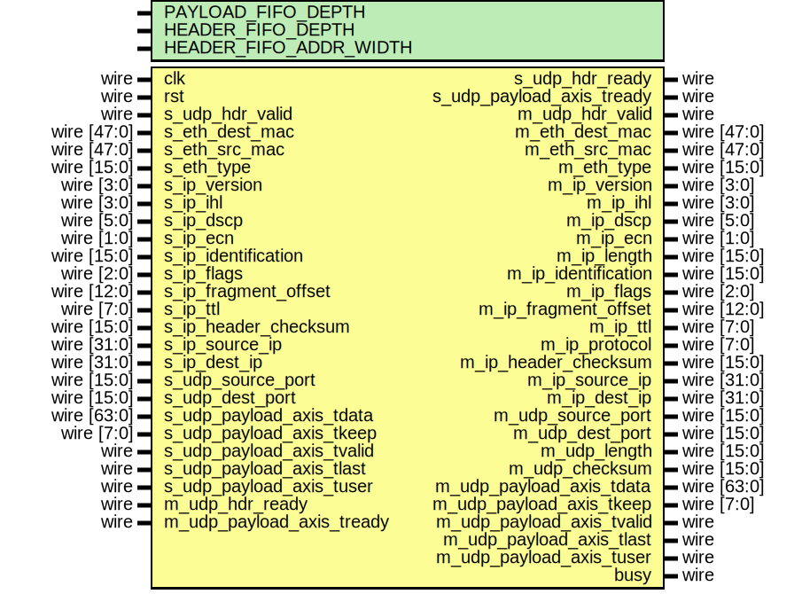

# Entity: udp_checksum_gen_64

- **File**: udp_checksum_gen_64.v
## Diagram

## Description

 Language: Verilog 2001

## Generics

| Generic name           | Type | Value                     | Description                                                                                                                                                                                                                                                                                                                                                                                                                                                                                                                                                                                                                                                                                                                                                                                                                                                                                                                                                                                                                                                                                                                                                                                 |
| ---------------------- | ---- | ------------------------- | ------------------------------------------------------------------------------------------------------------------------------------------------------------------------------------------------------------------------------------------------------------------------------------------------------------------------------------------------------------------------------------------------------------------------------------------------------------------------------------------------------------------------------------------------------------------------------------------------------------------------------------------------------------------------------------------------------------------------------------------------------------------------------------------------------------------------------------------------------------------------------------------------------------------------------------------------------------------------------------------------------------------------------------------------------------------------------------------------------------------------------------------------------------------------------------------- |
| PAYLOAD_FIFO_DEPTH     |      | 2048                      |                                                                                                                                                                                                                                                                                                                                                                                                                                                                                                                                                                                                                                                                                                                                                                                                                                                                                                                                                                                                                                                                                                                                                                                             |
| HEADER_FIFO_DEPTH      |      | 8                         |                                                                                                                                                                                                                                                                                                                                                                                                                                                                                                                                                                                                                                                                                                                                                                                                                                                                                                                                                                                                                                                                                                                                                                                             |
| HEADER_FIFO_ADDR_WIDTH |      | $clog2(HEADER_FIFO_DEPTH) |   UDP Frame   Field                       Length  Destination MAC address     6 octets  Source MAC address          6 octets  Ethertype (0x0800)          2 octets  Version (4)                 4 bits  IHL (5-15)                  4 bits  DSCP (0)                    6 bits  ECN (0)                     2 bits  length                      2 octets  identification (0?)         2 octets  flags (010)                 3 bits  fragment offset (0)         13 bits  time to live (64?)          1 octet  protocol                    1 octet  header checksum             2 octets  source IP                   4 octets  destination IP              4 octets  options                     (IHL-5)*4 octets   source port                 2 octets  desination port             2 octets  length                      2 octets  checksum                    2 octets   payload                     length octets  This module receives a UDP frame with header fields in parallel and payload on an AXI stream interface, calculates the length and checksum, then produces the header fields in parallel along with the UDP payload in a separate AXI stream.  */  |
## Ports

| Port name                 | Direction | Type        | Description                      |
| ------------------------- | --------- | ----------- | -------------------------------- |
| clk                       | input     | wire        |                                  |
| rst                       | input     | wire        |                                  |
| s_udp_hdr_valid           | input     | wire        |      * UDP frame input      */   |
| s_udp_hdr_ready           | output    | wire        |                                  |
| s_eth_dest_mac            | input     | wire [47:0] |                                  |
| s_eth_src_mac             | input     | wire [47:0] |                                  |
| s_eth_type                | input     | wire [15:0] |                                  |
| s_ip_version              | input     | wire [3:0]  |                                  |
| s_ip_ihl                  | input     | wire [3:0]  |                                  |
| s_ip_dscp                 | input     | wire [5:0]  |                                  |
| s_ip_ecn                  | input     | wire [1:0]  |                                  |
| s_ip_identification       | input     | wire [15:0] |                                  |
| s_ip_flags                | input     | wire [2:0]  |                                  |
| s_ip_fragment_offset      | input     | wire [12:0] |                                  |
| s_ip_ttl                  | input     | wire [7:0]  |                                  |
| s_ip_header_checksum      | input     | wire [15:0] |                                  |
| s_ip_source_ip            | input     | wire [31:0] |                                  |
| s_ip_dest_ip              | input     | wire [31:0] |                                  |
| s_udp_source_port         | input     | wire [15:0] |                                  |
| s_udp_dest_port           | input     | wire [15:0] |                                  |
| s_udp_payload_axis_tdata  | input     | wire [63:0] |                                  |
| s_udp_payload_axis_tkeep  | input     | wire [7:0]  |                                  |
| s_udp_payload_axis_tvalid | input     | wire        |                                  |
| s_udp_payload_axis_tready | output    | wire        |                                  |
| s_udp_payload_axis_tlast  | input     | wire        |                                  |
| s_udp_payload_axis_tuser  | input     | wire        |                                  |
| m_udp_hdr_valid           | output    | wire        |      * UDP frame output      */  |
| m_udp_hdr_ready           | input     | wire        |                                  |
| m_eth_dest_mac            | output    | wire [47:0] |                                  |
| m_eth_src_mac             | output    | wire [47:0] |                                  |
| m_eth_type                | output    | wire [15:0] |                                  |
| m_ip_version              | output    | wire [3:0]  |                                  |
| m_ip_ihl                  | output    | wire [3:0]  |                                  |
| m_ip_dscp                 | output    | wire [5:0]  |                                  |
| m_ip_ecn                  | output    | wire [1:0]  |                                  |
| m_ip_length               | output    | wire [15:0] |                                  |
| m_ip_identification       | output    | wire [15:0] |                                  |
| m_ip_flags                | output    | wire [2:0]  |                                  |
| m_ip_fragment_offset      | output    | wire [12:0] |                                  |
| m_ip_ttl                  | output    | wire [7:0]  |                                  |
| m_ip_protocol             | output    | wire [7:0]  |                                  |
| m_ip_header_checksum      | output    | wire [15:0] |                                  |
| m_ip_source_ip            | output    | wire [31:0] |                                  |
| m_ip_dest_ip              | output    | wire [31:0] |                                  |
| m_udp_source_port         | output    | wire [15:0] |                                  |
| m_udp_dest_port           | output    | wire [15:0] |                                  |
| m_udp_length              | output    | wire [15:0] |                                  |
| m_udp_checksum            | output    | wire [15:0] |                                  |
| m_udp_payload_axis_tdata  | output    | wire [63:0] |                                  |
| m_udp_payload_axis_tkeep  | output    | wire [7:0]  |                                  |
| m_udp_payload_axis_tvalid | output    | wire        |                                  |
| m_udp_payload_axis_tready | input     | wire        |                                  |
| m_udp_payload_axis_tlast  | output    | wire        |                                  |
| m_udp_payload_axis_tuser  | output    | wire        |                                  |
| busy                      | output    | wire        |      * Status signals      */    |
## Signals

| Name                           | Type                           | Description                                   |
| ------------------------------ | ------------------------------ | --------------------------------------------- |
| state_reg                      | reg [2:0]                      |                                               |
| state_next                     | reg [2:0]                      |                                               |
| store_udp_hdr                  | reg                            |  datapath control signals                     |
| shift_payload_in               | reg                            |                                               |
| checksum_part                  | reg [31:0]                     |                                               |
| frame_ptr_reg                  | reg [15:0]                     |                                               |
| frame_ptr_next                 | reg [15:0]                     |                                               |
| checksum_reg                   | reg [31:0]                     |                                               |
| checksum_next                  | reg [31:0]                     |                                               |
| checksum_temp1_reg             | reg [16:0]                     |                                               |
| checksum_temp1_next            | reg [16:0]                     |                                               |
| checksum_temp2_reg             | reg [16:0]                     |                                               |
| checksum_temp2_next            | reg [16:0]                     |                                               |
| eth_dest_mac_reg               | reg [47:0]                     |                                               |
| eth_src_mac_reg                | reg [47:0]                     |                                               |
| eth_type_reg                   | reg [15:0]                     |                                               |
| ip_version_reg                 | reg [3:0]                      |                                               |
| ip_ihl_reg                     | reg [3:0]                      |                                               |
| ip_dscp_reg                    | reg [5:0]                      |                                               |
| ip_ecn_reg                     | reg [1:0]                      |                                               |
| ip_identification_reg          | reg [15:0]                     |                                               |
| ip_flags_reg                   | reg [2:0]                      |                                               |
| ip_fragment_offset_reg         | reg [12:0]                     |                                               |
| ip_ttl_reg                     | reg [7:0]                      |                                               |
| ip_header_checksum_reg         | reg [15:0]                     |                                               |
| ip_source_ip_reg               | reg [31:0]                     |                                               |
| ip_dest_ip_reg                 | reg [31:0]                     |                                               |
| udp_source_port_reg            | reg [15:0]                     |                                               |
| udp_dest_port_reg              | reg [15:0]                     |                                               |
| hdr_valid_reg                  | reg                            |                                               |
| hdr_valid_next                 | reg                            |                                               |
| s_udp_hdr_ready_reg            | reg                            |                                               |
| s_udp_hdr_ready_next           | reg                            |                                               |
| s_udp_payload_axis_tready_reg  | reg                            |                                               |
| s_udp_payload_axis_tready_next | reg                            |                                               |
| busy_reg                       | reg                            |                                               |
| s_udp_payload_fifo_tdata       | wire [63:0]                    |   * UDP Payload FIFO  */                      |
| s_udp_payload_fifo_tkeep       | wire [7:0]                     |                                               |
| s_udp_payload_fifo_tvalid      | wire                           |                                               |
| s_udp_payload_fifo_tready      | wire                           |                                               |
| s_udp_payload_fifo_tlast       | wire                           |                                               |
| s_udp_payload_fifo_tuser       | wire                           |                                               |
| m_udp_payload_fifo_tdata       | wire [63:0]                    |                                               |
| m_udp_payload_fifo_tkeep       | wire [7:0]                     |                                               |
| m_udp_payload_fifo_tvalid      | wire                           |                                               |
| m_udp_payload_fifo_tready      | wire                           |                                               |
| m_udp_payload_fifo_tlast       | wire                           |                                               |
| m_udp_payload_fifo_tuser       | wire                           |                                               |
| header_fifo_wr_ptr_reg         | reg [HEADER_FIFO_ADDR_WIDTH:0] |   * UDP Header FIFO  */                       |
| header_fifo_wr_ptr_next        | reg [HEADER_FIFO_ADDR_WIDTH:0] |   * UDP Header FIFO  */                       |
| header_fifo_rd_ptr_reg         | reg [HEADER_FIFO_ADDR_WIDTH:0] |                                               |
| header_fifo_rd_ptr_next        | reg [HEADER_FIFO_ADDR_WIDTH:0] |                                               |
| eth_dest_mac_mem               | reg [47:0]                     |                                               |
| eth_src_mac_mem                | reg [47:0]                     |                                               |
| eth_type_mem                   | reg [15:0]                     |                                               |
| ip_version_mem                 | reg [3:0]                      |                                               |
| ip_ihl_mem                     | reg [3:0]                      |                                               |
| ip_dscp_mem                    | reg [5:0]                      |                                               |
| ip_ecn_mem                     | reg [1:0]                      |                                               |
| ip_identification_mem          | reg [15:0]                     |                                               |
| ip_flags_mem                   | reg [2:0]                      |                                               |
| ip_fragment_offset_mem         | reg [12:0]                     |                                               |
| ip_ttl_mem                     | reg [7:0]                      |                                               |
| ip_header_checksum_mem         | reg [15:0]                     |                                               |
| ip_source_ip_mem               | reg [31:0]                     |                                               |
| ip_dest_ip_mem                 | reg [31:0]                     |                                               |
| udp_source_port_mem            | reg [15:0]                     |                                               |
| udp_dest_port_mem              | reg [15:0]                     |                                               |
| udp_length_mem                 | reg [15:0]                     |                                               |
| udp_checksum_mem               | reg [15:0]                     |                                               |
| m_eth_dest_mac_reg             | reg [47:0]                     |                                               |
| m_eth_src_mac_reg              | reg [47:0]                     |                                               |
| m_eth_type_reg                 | reg [15:0]                     |                                               |
| m_ip_version_reg               | reg [3:0]                      |                                               |
| m_ip_ihl_reg                   | reg [3:0]                      |                                               |
| m_ip_dscp_reg                  | reg [5:0]                      |                                               |
| m_ip_ecn_reg                   | reg [1:0]                      |                                               |
| m_ip_identification_reg        | reg [15:0]                     |                                               |
| m_ip_flags_reg                 | reg [2:0]                      |                                               |
| m_ip_fragment_offset_reg       | reg [12:0]                     |                                               |
| m_ip_ttl_reg                   | reg [7:0]                      |                                               |
| m_ip_header_checksum_reg       | reg [15:0]                     |                                               |
| m_ip_source_ip_reg             | reg [31:0]                     |                                               |
| m_ip_dest_ip_reg               | reg [31:0]                     |                                               |
| m_udp_source_port_reg          | reg [15:0]                     |                                               |
| m_udp_dest_port_reg            | reg [15:0]                     |                                               |
| m_udp_length_reg               | reg [15:0]                     |                                               |
| m_udp_checksum_reg             | reg [15:0]                     |                                               |
| m_udp_hdr_valid_reg            | reg                            |                                               |
| m_udp_hdr_valid_next           | reg                            |                                               |
| header_fifo_full               | wire                           |  full when first MSB different but rest same  |
| header_fifo_empty              | wire                           |  empty when pointers match exactly            |
| header_fifo_write              | reg                            |  control signals                              |
| header_fifo_read               | reg                            |                                               |
| header_fifo_ready              | wire                           |                                               |
| i                              | integer                        |                                               |
| word_cnt                       | integer                        |                                               |
## Constants

| Name               | Type  | Value | Description |
| ------------------ | ----- | ----- | ----------- |
| STATE_IDLE         | [2:0] | 3'd0  |             |
| STATE_SUM_HEADER   | [2:0] | 3'd1  |             |
| STATE_SUM_PAYLOAD  | [2:0] | 3'd2  |             |
| STATE_FINISH_SUM_1 | [2:0] | 3'd3  |             |
| STATE_FINISH_SUM_2 | [2:0] | 3'd4  |             |
## Processes
- unnamed: ( @* )
  - **Type:** always
**Description**
 Write logic 
- unnamed: ( @(posedge clk) )
  - **Type:** always
- unnamed: ( @* )
  - **Type:** always
**Description**
 Read logic 
- unnamed: ( @(posedge clk) )
  - **Type:** always
- unnamed: ( @* )
  - **Type:** always
- unnamed: ( @(posedge clk) )
  - **Type:** always
## Instantiations

- payload_fifo: axis_fifo
