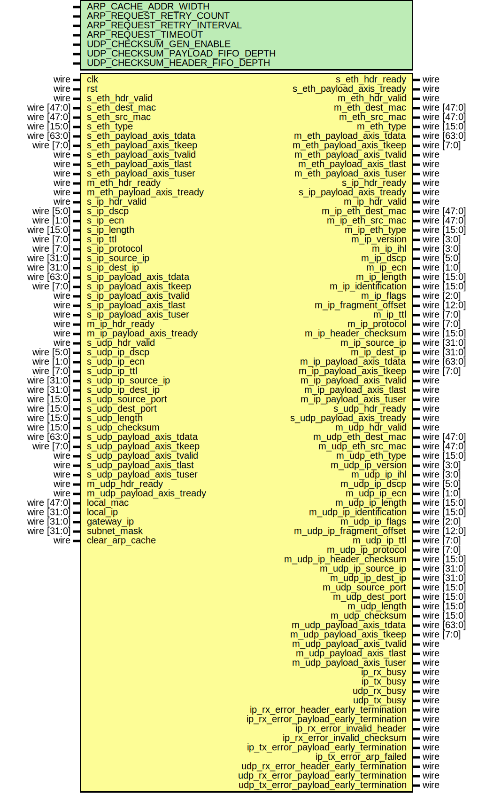

# Entity: udp_complete_64

## Diagram

## Description

Language: Verilog 2001
 
## Generics

| Generic name                    | Type | Value        | Description |
| ------------------------------- | ---- | ------------ | ----------- |
| ARP_CACHE_ADDR_WIDTH            |      | 9            |             |
| ARP_REQUEST_RETRY_COUNT         |      | 4            |             |
| ARP_REQUEST_RETRY_INTERVAL      |      | 125000000*2  |             |
| ARP_REQUEST_TIMEOUT             |      | 125000000*30 |             |
| UDP_CHECKSUM_GEN_ENABLE         |      | 1            |             |
| UDP_CHECKSUM_PAYLOAD_FIFO_DEPTH |      | 2048         |             |
| UDP_CHECKSUM_HEADER_FIFO_DEPTH  |      | 8            |             |
## Ports

| Port name                              | Direction | Type        | Description |
| -------------------------------------- | --------- | ----------- | ----------- |
| clk                                    | input     | wire        |             |
| rst                                    | input     | wire        |             |
| s_eth_hdr_valid                        | input     | wire        |             |
| s_eth_hdr_ready                        | output    | wire        |             |
| s_eth_dest_mac                         | input     | wire [47:0] |             |
| s_eth_src_mac                          | input     | wire [47:0] |             |
| s_eth_type                             | input     | wire [15:0] |             |
| s_eth_payload_axis_tdata               | input     | wire [63:0] |             |
| s_eth_payload_axis_tkeep               | input     | wire [7:0]  |             |
| s_eth_payload_axis_tvalid              | input     | wire        |             |
| s_eth_payload_axis_tready              | output    | wire        |             |
| s_eth_payload_axis_tlast               | input     | wire        |             |
| s_eth_payload_axis_tuser               | input     | wire        |             |
| m_eth_hdr_valid                        | output    | wire        |             |
| m_eth_hdr_ready                        | input     | wire        |             |
| m_eth_dest_mac                         | output    | wire [47:0] |             |
| m_eth_src_mac                          | output    | wire [47:0] |             |
| m_eth_type                             | output    | wire [15:0] |             |
| m_eth_payload_axis_tdata               | output    | wire [63:0] |             |
| m_eth_payload_axis_tkeep               | output    | wire [7:0]  |             |
| m_eth_payload_axis_tvalid              | output    | wire        |             |
| m_eth_payload_axis_tready              | input     | wire        |             |
| m_eth_payload_axis_tlast               | output    | wire        |             |
| m_eth_payload_axis_tuser               | output    | wire        |             |
| s_ip_hdr_valid                         | input     | wire        |             |
| s_ip_hdr_ready                         | output    | wire        |             |
| s_ip_dscp                              | input     | wire [5:0]  |             |
| s_ip_ecn                               | input     | wire [1:0]  |             |
| s_ip_length                            | input     | wire [15:0] |             |
| s_ip_ttl                               | input     | wire [7:0]  |             |
| s_ip_protocol                          | input     | wire [7:0]  |             |
| s_ip_source_ip                         | input     | wire [31:0] |             |
| s_ip_dest_ip                           | input     | wire [31:0] |             |
| s_ip_payload_axis_tdata                | input     | wire [63:0] |             |
| s_ip_payload_axis_tkeep                | input     | wire [7:0]  |             |
| s_ip_payload_axis_tvalid               | input     | wire        |             |
| s_ip_payload_axis_tready               | output    | wire        |             |
| s_ip_payload_axis_tlast                | input     | wire        |             |
| s_ip_payload_axis_tuser                | input     | wire        |             |
| m_ip_hdr_valid                         | output    | wire        |             |
| m_ip_hdr_ready                         | input     | wire        |             |
| m_ip_eth_dest_mac                      | output    | wire [47:0] |             |
| m_ip_eth_src_mac                       | output    | wire [47:0] |             |
| m_ip_eth_type                          | output    | wire [15:0] |             |
| m_ip_version                           | output    | wire [3:0]  |             |
| m_ip_ihl                               | output    | wire [3:0]  |             |
| m_ip_dscp                              | output    | wire [5:0]  |             |
| m_ip_ecn                               | output    | wire [1:0]  |             |
| m_ip_length                            | output    | wire [15:0] |             |
| m_ip_identification                    | output    | wire [15:0] |             |
| m_ip_flags                             | output    | wire [2:0]  |             |
| m_ip_fragment_offset                   | output    | wire [12:0] |             |
| m_ip_ttl                               | output    | wire [7:0]  |             |
| m_ip_protocol                          | output    | wire [7:0]  |             |
| m_ip_header_checksum                   | output    | wire [15:0] |             |
| m_ip_source_ip                         | output    | wire [31:0] |             |
| m_ip_dest_ip                           | output    | wire [31:0] |             |
| m_ip_payload_axis_tdata                | output    | wire [63:0] |             |
| m_ip_payload_axis_tkeep                | output    | wire [7:0]  |             |
| m_ip_payload_axis_tvalid               | output    | wire        |             |
| m_ip_payload_axis_tready               | input     | wire        |             |
| m_ip_payload_axis_tlast                | output    | wire        |             |
| m_ip_payload_axis_tuser                | output    | wire        |             |
| s_udp_hdr_valid                        | input     | wire        |             |
| s_udp_hdr_ready                        | output    | wire        |             |
| s_udp_ip_dscp                          | input     | wire [5:0]  |             |
| s_udp_ip_ecn                           | input     | wire [1:0]  |             |
| s_udp_ip_ttl                           | input     | wire [7:0]  |             |
| s_udp_ip_source_ip                     | input     | wire [31:0] |             |
| s_udp_ip_dest_ip                       | input     | wire [31:0] |             |
| s_udp_source_port                      | input     | wire [15:0] |             |
| s_udp_dest_port                        | input     | wire [15:0] |             |
| s_udp_length                           | input     | wire [15:0] |             |
| s_udp_checksum                         | input     | wire [15:0] |             |
| s_udp_payload_axis_tdata               | input     | wire [63:0] |             |
| s_udp_payload_axis_tkeep               | input     | wire [7:0]  |             |
| s_udp_payload_axis_tvalid              | input     | wire        |             |
| s_udp_payload_axis_tready              | output    | wire        |             |
| s_udp_payload_axis_tlast               | input     | wire        |             |
| s_udp_payload_axis_tuser               | input     | wire        |             |
| m_udp_hdr_valid                        | output    | wire        |             |
| m_udp_hdr_ready                        | input     | wire        |             |
| m_udp_eth_dest_mac                     | output    | wire [47:0] |             |
| m_udp_eth_src_mac                      | output    | wire [47:0] |             |
| m_udp_eth_type                         | output    | wire [15:0] |             |
| m_udp_ip_version                       | output    | wire [3:0]  |             |
| m_udp_ip_ihl                           | output    | wire [3:0]  |             |
| m_udp_ip_dscp                          | output    | wire [5:0]  |             |
| m_udp_ip_ecn                           | output    | wire [1:0]  |             |
| m_udp_ip_length                        | output    | wire [15:0] |             |
| m_udp_ip_identification                | output    | wire [15:0] |             |
| m_udp_ip_flags                         | output    | wire [2:0]  |             |
| m_udp_ip_fragment_offset               | output    | wire [12:0] |             |
| m_udp_ip_ttl                           | output    | wire [7:0]  |             |
| m_udp_ip_protocol                      | output    | wire [7:0]  |             |
| m_udp_ip_header_checksum               | output    | wire [15:0] |             |
| m_udp_ip_source_ip                     | output    | wire [31:0] |             |
| m_udp_ip_dest_ip                       | output    | wire [31:0] |             |
| m_udp_source_port                      | output    | wire [15:0] |             |
| m_udp_dest_port                        | output    | wire [15:0] |             |
| m_udp_length                           | output    | wire [15:0] |             |
| m_udp_checksum                         | output    | wire [15:0] |             |
| m_udp_payload_axis_tdata               | output    | wire [63:0] |             |
| m_udp_payload_axis_tkeep               | output    | wire [7:0]  |             |
| m_udp_payload_axis_tvalid              | output    | wire        |             |
| m_udp_payload_axis_tready              | input     | wire        |             |
| m_udp_payload_axis_tlast               | output    | wire        |             |
| m_udp_payload_axis_tuser               | output    | wire        |             |
| ip_rx_busy                             | output    | wire        |             |
| ip_tx_busy                             | output    | wire        |             |
| udp_rx_busy                            | output    | wire        |             |
| udp_tx_busy                            | output    | wire        |             |
| ip_rx_error_header_early_termination   | output    | wire        |             |
| ip_rx_error_payload_early_termination  | output    | wire        |             |
| ip_rx_error_invalid_header             | output    | wire        |             |
| ip_rx_error_invalid_checksum           | output    | wire        |             |
| ip_tx_error_payload_early_termination  | output    | wire        |             |
| ip_tx_error_arp_failed                 | output    | wire        |             |
| udp_rx_error_header_early_termination  | output    | wire        |             |
| udp_rx_error_payload_early_termination | output    | wire        |             |
| udp_tx_error_payload_early_termination | output    | wire        |             |
| local_mac                              | input     | wire [47:0] |             |
| local_ip                               | input     | wire [31:0] |             |
| gateway_ip                             | input     | wire [31:0] |             |
| subnet_mask                            | input     | wire [31:0] |             |
| clear_arp_cache                        | input     | wire        |             |
## Signals

| Name                          | Type        | Description |
| ----------------------------- | ----------- | ----------- |
| ip_rx_ip_hdr_valid            | wire        |             |
| ip_rx_ip_hdr_ready            | wire        |             |
| ip_rx_ip_eth_dest_mac         | wire [47:0] |             |
| ip_rx_ip_eth_src_mac          | wire [47:0] |             |
| ip_rx_ip_eth_type             | wire [15:0] |             |
| ip_rx_ip_version              | wire [3:0]  |             |
| ip_rx_ip_ihl                  | wire [3:0]  |             |
| ip_rx_ip_dscp                 | wire [5:0]  |             |
| ip_rx_ip_ecn                  | wire [1:0]  |             |
| ip_rx_ip_length               | wire [15:0] |             |
| ip_rx_ip_identification       | wire [15:0] |             |
| ip_rx_ip_flags                | wire [2:0]  |             |
| ip_rx_ip_fragment_offset      | wire [12:0] |             |
| ip_rx_ip_ttl                  | wire [7:0]  |             |
| ip_rx_ip_protocol             | wire [7:0]  |             |
| ip_rx_ip_header_checksum      | wire [15:0] |             |
| ip_rx_ip_source_ip            | wire [31:0] |             |
| ip_rx_ip_dest_ip              | wire [31:0] |             |
| ip_rx_ip_payload_axis_tdata   | wire [63:0] |             |
| ip_rx_ip_payload_axis_tkeep   | wire [7:0]  |             |
| ip_rx_ip_payload_axis_tvalid  | wire        |             |
| ip_rx_ip_payload_axis_tlast   | wire        |             |
| ip_rx_ip_payload_axis_tuser   | wire        |             |
| ip_rx_ip_payload_axis_tready  | wire        |             |
| ip_tx_ip_hdr_valid            | wire        |             |
| ip_tx_ip_hdr_ready            | wire        |             |
| ip_tx_ip_dscp                 | wire [5:0]  |             |
| ip_tx_ip_ecn                  | wire [1:0]  |             |
| ip_tx_ip_length               | wire [15:0] |             |
| ip_tx_ip_ttl                  | wire [7:0]  |             |
| ip_tx_ip_protocol             | wire [7:0]  |             |
| ip_tx_ip_source_ip            | wire [31:0] |             |
| ip_tx_ip_dest_ip              | wire [31:0] |             |
| ip_tx_ip_payload_axis_tdata   | wire [63:0] |             |
| ip_tx_ip_payload_axis_tkeep   | wire [7:0]  |             |
| ip_tx_ip_payload_axis_tvalid  | wire        |             |
| ip_tx_ip_payload_axis_tlast   | wire        |             |
| ip_tx_ip_payload_axis_tuser   | wire        |             |
| ip_tx_ip_payload_axis_tready  | wire        |             |
| udp_rx_ip_hdr_valid           | wire        |             |
| udp_rx_ip_hdr_ready           | wire        |             |
| udp_rx_ip_eth_dest_mac        | wire [47:0] |             |
| udp_rx_ip_eth_src_mac         | wire [47:0] |             |
| udp_rx_ip_eth_type            | wire [15:0] |             |
| udp_rx_ip_version             | wire [3:0]  |             |
| udp_rx_ip_ihl                 | wire [3:0]  |             |
| udp_rx_ip_dscp                | wire [5:0]  |             |
| udp_rx_ip_ecn                 | wire [1:0]  |             |
| udp_rx_ip_length              | wire [15:0] |             |
| udp_rx_ip_identification      | wire [15:0] |             |
| udp_rx_ip_flags               | wire [2:0]  |             |
| udp_rx_ip_fragment_offset     | wire [12:0] |             |
| udp_rx_ip_ttl                 | wire [7:0]  |             |
| udp_rx_ip_protocol            | wire [7:0]  |             |
| udp_rx_ip_header_checksum     | wire [15:0] |             |
| udp_rx_ip_source_ip           | wire [31:0] |             |
| udp_rx_ip_dest_ip             | wire [31:0] |             |
| udp_rx_ip_payload_axis_tdata  | wire [63:0] |             |
| udp_rx_ip_payload_axis_tkeep  | wire [7:0]  |             |
| udp_rx_ip_payload_axis_tvalid | wire        |             |
| udp_rx_ip_payload_axis_tlast  | wire        |             |
| udp_rx_ip_payload_axis_tuser  | wire        |             |
| udp_rx_ip_payload_axis_tready | wire        |             |
| udp_tx_ip_hdr_valid           | wire        |             |
| udp_tx_ip_hdr_ready           | wire        |             |
| udp_tx_ip_dscp                | wire [5:0]  |             |
| udp_tx_ip_ecn                 | wire [1:0]  |             |
| udp_tx_ip_length              | wire [15:0] |             |
| udp_tx_ip_ttl                 | wire [7:0]  |             |
| udp_tx_ip_protocol            | wire [7:0]  |             |
| udp_tx_ip_source_ip           | wire [31:0] |             |
| udp_tx_ip_dest_ip             | wire [31:0] |             |
| udp_tx_ip_payload_axis_tdata  | wire [63:0] |             |
| udp_tx_ip_payload_axis_tkeep  | wire [7:0]  |             |
| udp_tx_ip_payload_axis_tvalid | wire        |             |
| udp_tx_ip_payload_axis_tlast  | wire        |             |
| udp_tx_ip_payload_axis_tuser  | wire        |             |
| udp_tx_ip_payload_axis_tready | wire        |             |
| s_select_udp                  | wire        |             |
| s_select_ip                   | wire        |             |
| s_select_udp_reg              | reg         |             |
| s_select_ip_reg               | reg         |             |
## Processes
- unnamed: ( @(posedge clk) )
## Instantiations

- ip_arb_mux_inst: ip_arb_mux
- ip_complete_64_inst: ip_complete_64
- udp_64_inst: udp_64
