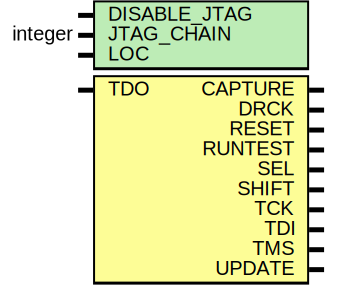

# Entity: BSCANE2

## Diagram

## Description

   Copyright (c) 1995/2010 Xilinx, Inc.
 
    Licensed under the Apache License, Version 2.0 (the "License");
    you may not use this file except in compliance with the License.
    You may obtain a copy of the License at
 
        http://www.apache.org/licenses/LICENSE-2.0
 
    Unless required by applicable law or agreed to in writing, software
    distributed under the License is distributed on an "AS IS" BASIS,
    WITHOUT WARRANTIES OR CONDITIONS OF ANY KIND, either express or implied.
    See the License for the specific language governing permissions and
    limitations under the License.
   ____  ____
  /   /\/   /
 /___/  \  /    Vendor : Xilinx
 \   \   \/     Version : 13.1
  \   \         Description : Xilinx Timing Simulation Library Component
  /   /                  Boundary Scan Logic Control Circuit for VIRTEX7
 /___/   /\     Filename : BSCANE2.v
 \   \  /  \    Timestamp : Mon Feb  8 22:02:00 PST 2010
  \___\/\___\
 Revision:
    02/08/10 - Initial version.
    06/10/11 - CR 613789.
    12/13/11 - Added `celldefine and `endcelldefine (CR 524859).
    10/22/14 - Added #1 to $finish (CR 808642).
    04/07/15 - Added negedge to SEL (CR 857726).
 End Revision
 
## Generics

| Generic name | Type    | Value      | Description |
| ------------ | ------- | ---------- | ----------- |
| DISABLE_JTAG |         | "FALSE"    |             |
| JTAG_CHAIN   | integer | 1          |             |
| LOC          |         | "UNPLACED" |             |
## Ports

| Port name | Direction | Type | Description |
| --------- | --------- | ---- | ----------- |
| CAPTURE   | output    |      |             |
| DRCK      | output    |      |             |
| RESET     | output    |      |             |
| RUNTEST   | output    |      |             |
| SEL       | output    |      |             |
| SHIFT     | output    |      |             |
| TCK       | output    |      |             |
| TDI       | output    |      |             |
| TMS       | output    |      |             |
| UPDATE    | output    |      |             |
| TDO       | input     |      |             |
## Signals

| Name    | Type | Description |
| ------- | ---- | ----------- |
| SEL_reg | reg  |             |
| SEL_zd  | reg  |             |
## Processes
- unnamed: ( @(glbl.JTAG_SEL1_GLBL or glbl.JTAG_SEL2_GLBL or glbl.JTAG_SEL3_GLBL or glbl.JTAG_SEL4_GLBL) )
- unnamed: ( @(TDO) )
- unnamed: ( @(negedge glbl.JTAG_TCK_GLBL or posedge SEL_zd) )
