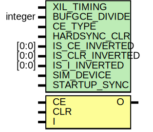

# Entity: BUFGCE_DIV

## Diagram

## Description

    Copyright (c) 1995/2018 Xilinx, Inc.
 
    Licensed under the Apache License, Version 2.0 (the "License");
    you may not use this file except in compliance with the License.
    You may obtain a copy of the License at
 
        http://www.apache.org/licenses/LICENSE-2.0
 
    Unless required by applicable law or agreed to in writing, software
    distributed under the License is distributed on an "AS IS" BASIS,
    WITHOUT WARRANTIES OR CONDITIONS OF ANY KIND, either express or implied.
    See the License for the specific language governing permissions and
    limitations under the License.
   ____  ____
  /   /\/   /
 /___/  \  /     Vendor      : Xilinx
 \   \   \/      Version     : 2020.1
  \   \          Description : Xilinx Unified Simulation Library Component
  /   /                        BUFGCE_DIV
 /___/   /\      Filename    : BUFGCE_DIV.v
 \   \  /  \
  \___\/\___\
  Revision:
  
  End Revision:
 
## Generics

| Generic name    | Type    | Value        | Description |
| --------------- | ------- | ------------ | ----------- |
| XIL_TIMING      |         | "UNPLACED"   |             |
| BUFGCE_DIVIDE   | integer | 1            |             |
| CE_TYPE         |         | "SYNC"       |             |
| HARDSYNC_CLR    |         | "FALSE"      |             |
| IS_CE_INVERTED  | [0:0]   | 1'b0         |             |
| IS_CLR_INVERTED | [0:0]   | 1'b0         |             |
| IS_I_INVERTED   | [0:0]   | 1'b0         |             |
| SIM_DEVICE      |         | "ULTRASCALE" |             |
| STARTUP_SYNC    |         | "FALSE"      |             |
## Ports

| Port name | Direction | Type | Description |
| --------- | --------- | ---- | ----------- |
| O         | output    |      |             |
| CE        | input     |      |             |
| CLR       | input     |      |             |
| I         | input     |      |             |
## Signals

| Name                | Type        | Description             |
| ------------------- | ----------- | ----------------------- |
| trig_attr           | reg         |                         |
| BUFGCE_DIVIDE_REG   | reg [31:0]  |                         |
| CE_TYPE_REG         | reg [64:1]  |                         |
| HARDSYNC_CLR_REG    | reg [40:1]  |                         |
| IS_CE_INVERTED_REG  | reg [0:0]   |                         |
| IS_CLR_INVERTED_REG | reg [0:0]   |                         |
| IS_I_INVERTED_REG   | reg [0:0]   |                         |
| SIM_DEVICE_REG      | reg [144:1] |                         |
| STARTUP_SYNC_REG    | reg [40:1]  |                         |
| BUFGCE_DIVIDE_BIN   | wire [3:0]  |                         |
| CE_TYPE_BIN         | wire        |                         |
| HARDSYNC_CLR_BIN    | wire        |                         |
| SIM_DEVICE_BIN      | wire [4:0]  |                         |
| STARTUP_SYNC_BIN    | wire        |                         |
| BUFGCE_DIVIDE_BIN   | reg [3:0]   |                         |
| CE_TYPE_BIN         | reg         |                         |
| HARDSYNC_CLR_BIN    | reg         |                         |
| SIM_DEVICE_BIN      | reg [4:0]   |                         |
| STARTUP_SYNC_BIN    | reg         |                         |
| glblGSR             | reg         |                         |
| glblGSR             | tri0        |                         |
| CE_in               | wire        |                         |
| CLR_in              | wire        |                         |
| I_in                | wire        |                         |
| CE_delay            | wire        |                         |
| CLR_delay           | wire        |                         |
| I_delay             | wire        |                         |
| attr_test           | reg         |                         |
| attr_err            | reg         |                         |
| notifier            | reg         |                         |
| clk_count           | integer     | begin behavioral model  |
| first_toggle_count  | integer     | begin behavioral model  |
| second_toggle_count | integer     | begin behavioral model  |
| first_rise          | reg         |                         |
| first_half_period   | reg         |                         |
| O_bufgce_div        | reg         |                         |
| i_ce                | wire        |                         |
| CLR_int             | wire        |                         |
| ce_en               | reg         |                         |
| gsr_muxed_sync      | wire        |                         |
| ce_muxed_sync       | wire        |                         |
| clr_muxed_sync      | wire        |                         |
| clr_muxed_xrm       | wire        |                         |
| gwe_sync            | reg [2:0]   |                         |
| ce_sync             | reg [2:0]   |                         |
| clr_sync            | reg [2:0]   |                         |
| i_en_n              | wire        |                         |
| i_en_p              | wire        |                         |
## Constants

| Name                          | Type | Value        | Description                        |
| ----------------------------- | ---- | ------------ | ---------------------------------- |
| MODULE_NAME                   |      | "BUFGCE_DIV" | define constants                   |
| CE_TYPE_HARDSYNC              |      | 1            | Parameter encodings and registers  |
| CE_TYPE_SYNC                  |      | 0            |                                    |
| HARDSYNC_CLR_FALSE            |      | 0            |                                    |
| HARDSYNC_CLR_TRUE             |      | 1            |                                    |
| SIM_DEVICE_ULTRASCALE         |      | 0            |                                    |
| SIM_DEVICE_ULTRASCALE_PLUS    |      | 1            |                                    |
| SIM_DEVICE_VERSAL_AI_CORE     |      | 3            |                                    |
| SIM_DEVICE_VERSAL_AI_CORE_ES1 |      | 4            |                                    |
| SIM_DEVICE_VERSAL_AI_CORE_ES2 |      | 5            |                                    |
| SIM_DEVICE_VERSAL_AI_EDGE     |      | 6            |                                    |
| SIM_DEVICE_VERSAL_AI_EDGE_ES1 |      | 7            |                                    |
| SIM_DEVICE_VERSAL_AI_EDGE_ES2 |      | 8            |                                    |
| SIM_DEVICE_VERSAL_AI_RF       |      | 9            |                                    |
| SIM_DEVICE_VERSAL_AI_RF_ES1   |      | 10           |                                    |
| SIM_DEVICE_VERSAL_AI_RF_ES2   |      | 11           |                                    |
| SIM_DEVICE_VERSAL_HBM         |      | 14           |                                    |
| SIM_DEVICE_VERSAL_HBM_ES1     |      | 15           |                                    |
| SIM_DEVICE_VERSAL_HBM_ES2     |      | 16           |                                    |
| SIM_DEVICE_VERSAL_PREMIUM     |      | 17           |                                    |
| SIM_DEVICE_VERSAL_PREMIUM_ES1 |      | 18           |                                    |
| SIM_DEVICE_VERSAL_PREMIUM_ES2 |      | 19           |                                    |
| SIM_DEVICE_VERSAL_PRIME       |      | 20           |                                    |
| SIM_DEVICE_VERSAL_PRIME_ES1   |      | 21           |                                    |
| SIM_DEVICE_VERSAL_PRIME_ES2   |      | 22           |                                    |
| STARTUP_SYNC_FALSE            |      | 0            |                                    |
| STARTUP_SYNC_TRUE             |      | 1            |                                    |
## Processes
- unnamed: ( @ (trig_attr) )
- unnamed: ( @ (trig_attr) )
- unnamed: ( @ (trig_attr) )
- unnamed: ( @(posedge I_in) )
- unnamed: ( @(negedge I_in) )
- unnamed: ( @(posedge I_in) )
- unnamed: ( @ (trig_attr) )
- unnamed: ( @(gsr_muxed_sync) )
- unnamed: ( @(I_in, gsr_muxed_sync, ce_muxed_sync, clr_muxed_xrm) )
- unnamed: ( @(i_ce or posedge gsr_muxed_sync or posedge clr_muxed_xrm) )
- unnamed: (  )
- unnamed: (  )
- unnamed: (  )
- unnamed: (  )
- unnamed: (  )
- unnamed: (  )
- unnamed: (  )
- unnamed: (  )
- unnamed: (  )
- unnamed: (  )
- unnamed: (  )
- unnamed: (  )
- unnamed: (  )
- unnamed: (  )
- unnamed: (  )
- unnamed: (  )
- unnamed: (  )
- unnamed: (  )
