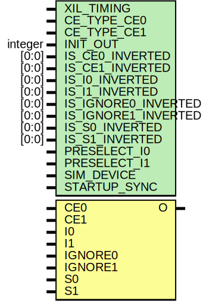

# Entity: BUFGCTRL

## Diagram

## Description

    Copyright (c) 1995/2018 Xilinx, Inc.
 
    Licensed under the Apache License, Version 2.0 (the "License");
    you may not use this file except in compliance with the License.
    You may obtain a copy of the License at
 
        http://www.apache.org/licenses/LICENSE-2.0
 
    Unless required by applicable law or agreed to in writing, software
    distributed under the License is distributed on an "AS IS" BASIS,
    WITHOUT WARRANTIES OR CONDITIONS OF ANY KIND, either express or implied.
    See the License for the specific language governing permissions and
    limitations under the License.
   ____  ____
  /   /\/   / 
 /___/  \  /     Vendor      : Xilinx 
 \   \   \/      Version     : 2019.2
  \   \          Description : Xilinx Unified Simulation Library Component
  /   /                        General Clock Control Buffer
 /___/   /\      Filename    : BUFGCTRL.v
 \   \  /  \ 
  \___\/\___\                    
                                 
  Revision:
  End Revision:
 
## Generics

| Generic name        | Type    | Value        | Description |
| ------------------- | ------- | ------------ | ----------- |
| XIL_TIMING          |         | "UNPLACED"   |             |
| CE_TYPE_CE0         |         | "SYNC"       |             |
| CE_TYPE_CE1         |         | "SYNC"       |             |
| INIT_OUT            | integer | 0            |             |
| IS_CE0_INVERTED     | [0:0]   | 1'b0         |             |
| IS_CE1_INVERTED     | [0:0]   | 1'b0         |             |
| IS_I0_INVERTED      | [0:0]   | 1'b0         |             |
| IS_I1_INVERTED      | [0:0]   | 1'b0         |             |
| IS_IGNORE0_INVERTED | [0:0]   | 1'b0         |             |
| IS_IGNORE1_INVERTED | [0:0]   | 1'b0         |             |
| IS_S0_INVERTED      | [0:0]   | 1'b0         |             |
| IS_S1_INVERTED      | [0:0]   | 1'b0         |             |
| PRESELECT_I0        |         | "FALSE"      |             |
| PRESELECT_I1        |         | "FALSE"      |             |
| SIM_DEVICE          |         | "ULTRASCALE" |             |
| STARTUP_SYNC        |         | "FALSE"      |             |
## Ports

| Port name | Direction | Type | Description |
| --------- | --------- | ---- | ----------- |
| O         | output    |      |             |
| CE0       | input     |      |             |
| CE1       | input     |      |             |
| I0        | input     |      |             |
| I1        | input     |      |             |
| IGNORE0   | input     |      |             |
| IGNORE1   | input     |      |             |
| S0        | input     |      |             |
| S1        | input     |      |             |
## Signals

| Name                    | Type        | Description             |
| ----------------------- | ----------- | ----------------------- |
| trig_attr               | reg         |                         |
| CE_TYPE_CE0_REG         | reg [64:1]  |                         |
| CE_TYPE_CE1_REG         | reg [64:1]  |                         |
| INIT_OUT_REG            | reg [31:0]  |                         |
| IS_CE0_INVERTED_REG     | reg [0:0]   |                         |
| IS_CE1_INVERTED_REG     | reg [0:0]   |                         |
| IS_I0_INVERTED_REG      | reg [0:0]   |                         |
| IS_I1_INVERTED_REG      | reg [0:0]   |                         |
| IS_IGNORE0_INVERTED_REG | reg [0:0]   |                         |
| IS_IGNORE1_INVERTED_REG | reg [0:0]   |                         |
| IS_S0_INVERTED_REG      | reg [0:0]   |                         |
| IS_S1_INVERTED_REG      | reg [0:0]   |                         |
| PRESELECT_I0_REG        | reg [40:1]  |                         |
| PRESELECT_I1_REG        | reg [40:1]  |                         |
| SIM_DEVICE_REG          | reg [144:1] |                         |
| STARTUP_SYNC_REG        | reg [40:1]  |                         |
| CE_TYPE_CE0_BIN         | wire        |                         |
| CE_TYPE_CE1_BIN         | wire        |                         |
| INIT_OUT_BIN            | wire        |                         |
| PRESELECT_I0_BIN        | wire        |                         |
| PRESELECT_I1_BIN        | wire        |                         |
| SIM_DEVICE_BIN          | wire [4:0]  |                         |
| STARTUP_SYNC_BIN        | wire        |                         |
| CE_TYPE_CE0_BIN         | reg         |                         |
| CE_TYPE_CE1_BIN         | reg         |                         |
| INIT_OUT_BIN            | reg         |                         |
| PRESELECT_I0_BIN        | reg         |                         |
| PRESELECT_I1_BIN        | reg         |                         |
| SIM_DEVICE_BIN          | reg [4:0]   |                         |
| STARTUP_SYNC_BIN        | reg         |                         |
| glblGSR                 | reg         |                         |
| glblGRESTORE            | reg         |                         |
| glblGSR                 | tri0        |                         |
| glblGRESTORE            | tri0        |                         |
| CE0_in                  | wire        |                         |
| CE1_in                  | wire        |                         |
| I0_in                   | wire        |                         |
| I1_in                   | wire        |                         |
| IGNORE0_in              | wire        |                         |
| IGNORE1_in              | wire        |                         |
| S0_in                   | wire        |                         |
| S1_in                   | wire        |                         |
| CE0_delay               | wire        |                         |
| CE1_delay               | wire        |                         |
| I0_delay                | wire        |                         |
| I1_delay                | wire        |                         |
| S0_delay                | wire        |                         |
| S1_delay                | wire        |                         |
| attr_test               | reg         |                         |
| attr_err                | reg         |                         |
| notifier                | reg         |                         |
| O_out                   | reg         | begin behavioral model  |
| gwe0_sync               | reg [2:0]   |                         |
| gwe1_sync               | reg [2:0]   |                         |
| gwe_sync                | wire        |                         |
| gwe                     | wire        |                         |
| gwe_muxed_sync          | wire        |                         |
| CE0_sync                | reg [2:0]   |                         |
| CE1_sync                | reg [2:0]   |                         |
| ce0_muxed_sync          | wire        |                         |
| ce1_muxed_sync          | wire        |                         |
| CE0_in_dly              | reg         |                         |
| CE1_in_dly              | reg         |                         |
| I0_optinv               | wire        |                         |
| I1_optinv               | wire        |                         |
| d00                     | wire        |                         |
| d01                     | wire        |                         |
| d10                     | wire        |                         |
| d11                     | wire        |                         |
| qb00                    | reg         |                         |
| qb01                    | reg         |                         |
| qb10                    | reg         |                         |
| qb11                    | reg         |                         |
| cb00                    | wire        |                         |
| cb01                    | wire        |                         |
| cb10                    | wire        |                         |
| cb11                    | wire        |                         |
| state0                  | reg         |                         |
| state1                  | reg         |                         |
| i0_en_n                 | wire        |                         |
| i0_en_p                 | wire        |                         |
| i1_en_n                 | wire        |                         |
| i1_en_p                 | wire        |                         |
## Constants

| Name                          | Type | Value      | Description                        |
| ----------------------------- | ---- | ---------- | ---------------------------------- |
| MODULE_NAME                   |      | "BUFGCTRL" | define constants                   |
| CE_TYPE_CE0_HARDSYNC          |      | 1          | Parameter encodings and registers  |
| CE_TYPE_CE0_SYNC              |      | 0          |                                    |
| CE_TYPE_CE1_HARDSYNC          |      | 1          |                                    |
| CE_TYPE_CE1_SYNC              |      | 0          |                                    |
| PRESELECT_I0_FALSE            |      | 0          |                                    |
| PRESELECT_I0_TRUE             |      | 1          |                                    |
| PRESELECT_I1_FALSE            |      | 0          |                                    |
| PRESELECT_I1_TRUE             |      | 1          |                                    |
| SIM_DEVICE_7SERIES            |      | 1          |                                    |
| SIM_DEVICE_ULTRASCALE         |      | 0          |                                    |
| SIM_DEVICE_ULTRASCALE_PLUS    |      | 2          |                                    |
| SIM_DEVICE_VERSAL_AI_CORE     |      | 4          |                                    |
| SIM_DEVICE_VERSAL_AI_CORE_ES1 |      | 5          |                                    |
| SIM_DEVICE_VERSAL_AI_CORE_ES2 |      | 6          |                                    |
| SIM_DEVICE_VERSAL_AI_EDGE     |      | 7          |                                    |
| SIM_DEVICE_VERSAL_AI_EDGE_ES1 |      | 8          |                                    |
| SIM_DEVICE_VERSAL_AI_EDGE_ES2 |      | 9          |                                    |
| SIM_DEVICE_VERSAL_AI_RF       |      | 10         |                                    |
| SIM_DEVICE_VERSAL_AI_RF_ES1   |      | 11         |                                    |
| SIM_DEVICE_VERSAL_AI_RF_ES2   |      | 12         |                                    |
| SIM_DEVICE_VERSAL_HBM         |      | 15         |                                    |
| SIM_DEVICE_VERSAL_HBM_ES1     |      | 16         |                                    |
| SIM_DEVICE_VERSAL_HBM_ES2     |      | 17         |                                    |
| SIM_DEVICE_VERSAL_PREMIUM     |      | 18         |                                    |
| SIM_DEVICE_VERSAL_PREMIUM_ES1 |      | 19         |                                    |
| SIM_DEVICE_VERSAL_PREMIUM_ES2 |      | 20         |                                    |
| SIM_DEVICE_VERSAL_PRIME       |      | 21         |                                    |
| SIM_DEVICE_VERSAL_PRIME_ES1   |      | 22         |                                    |
| SIM_DEVICE_VERSAL_PRIME_ES2   |      | 23         |                                    |
| STARTUP_SYNC_FALSE            |      | 0          |                                    |
| STARTUP_SYNC_TRUE             |      | 1          |                                    |
## Processes
- unnamed: ( @ (trig_attr) )
- unnamed: ( @ (trig_attr) )
- unnamed: ( @ (trig_attr) )
- unnamed: ( @ (trig_attr) )
- unnamed: ( @ (negedge I0_optinv or posedge glblGRESTORE) )
- unnamed: ( @ (negedge I1_optinv or posedge glblGRESTORE) )
- unnamed: ( @(*) )
- unnamed: ( @(*) )
- unnamed: ( @ (posedge I0_optinv or posedge glblGRESTORE) )
- unnamed: ( @ (posedge I1_optinv or posedge glblGRESTORE) )
- unnamed: ( @(*) )
- unnamed: ( @(*) )
- unnamed: ( @(*) )
- unnamed: ( @(*) )
- unnamed: ( @(*) )
- unnamed: ( @(*) )
