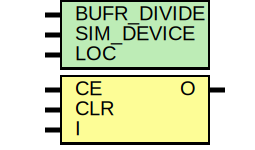

# Entity: BUFR

## Diagram

## Description

   Copyright (c) 1995/2005 Xilinx, Inc.
 
    Licensed under the Apache License, Version 2.0 (the "License");
    you may not use this file except in compliance with the License.
    You may obtain a copy of the License at
 
        http://www.apache.org/licenses/LICENSE-2.0
 
    Unless required by applicable law or agreed to in writing, software
    distributed under the License is distributed on an "AS IS" BASIS,
    WITHOUT WARRANTIES OR CONDITIONS OF ANY KIND, either express or implied.
    See the License for the specific language governing permissions and
    limitations under the License.
   ____  ____
  /   /\/   /
 /___/  \  /    Vendor : Xilinx
 \   \   \/     Version : 13.i (O.72)
  \   \         Description : Xilinx Timing Simulation Library Component
  /   /                  Regional Clock Buffer
 /___/   /\     Filename : BUFR.v
 \   \  /  \    Timestamp : Thu Mar 11 16:44:06 PST 2005
  \___\/\___\
 Revision:
    03/23/04 - Initial version.
    03/11/05 - Added LOC parameter, removed GSR ports and initialized outpus.
    04/04/2005 - Add SIM_DEVICE paramter to support Virtex5. CE pin has 4 clock
                 latency for Virtex 4 and none for Virtex5
    07/25/05 - Updated names to Virtex5
    08/31/05 - Add ce_en to sensitivity list of i_in which make ce asynch.
    05/23/06 - Add count =0 and first_rise=1 when CE = 0 (CR232206).
    07/19/06 - Add wire declaration for undeclared wire signals.
    04/01/09 - CR 517236 -- Added VIRTEX6 support
    11/13/09 - Added VIRTEX7
    01/20/10 - Change VIRTEX7 to internal_name (CR545223)
    02/23/10 - Use assign for o_out (CR543271)
    06/09/10 - Change internal_name to 7_SERIES
    08/18/10 - Change 7_SERIES to 7SERIES (CR571653)
    08/09/11 - Add 7SERIES  to ce_en logic (CR620544)
    12/13/11 - Added `celldefine and `endcelldefine (CR 524859).
    03/15/12 - Match with hardware (CR 650440)
    10/22/14 - Added #1 to $finish (CR 808642).
 End Revision
 
## Generics

| Generic name | Type | Value      | Description |
| ------------ | ---- | ---------- | ----------- |
| BUFR_DIVIDE  |      | "BYPASS"   |             |
| SIM_DEVICE   |      | "7SERIES"  |             |
| LOC          |      | "UNPLACED" |             |
## Ports

| Port name | Direction | Type | Description |
| --------- | --------- | ---- | ----------- |
| O         | output    |      |             |
| CE        | input     |      |             |
| CLR       | input     |      |             |
| I         | input     |      |             |
## Signals

| Name               | Type    | Description |
| ------------------ | ------- | ----------- |
| count              | integer |             |
| period_toggle      | integer |             |
| half_period_toggle | integer |             |
| first_rise         | reg     |             |
| half_period_done   | reg     |             |
| notifier           | reg     |             |
| o_out_divide       | reg     |             |
| o_out              | wire    |             |
| ce_enable1         | reg     |             |
| ce_enable2         | reg     |             |
| ce_enable3         | reg     |             |
| ce_enable4         | reg     |             |
| GSR                | tri0    |             |
| i_in               | wire    |             |
| ce_in              | wire    |             |
| clr_in             | wire    |             |
| gsr_in             | wire    |             |
| ce_en              | wire    |             |
| i_ce               | wire    |             |
## Processes
- unnamed: ( @(gsr_in or clr_in) )
**Description**
initial begin

- unnamed: ( @(negedge i_in) )
- unnamed: ( @(notifier) )
