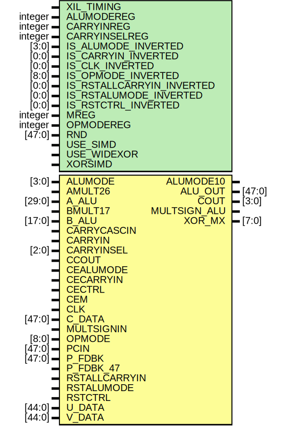

# Entity: DSP_ALU

## Diagram

## Description

    Copyright (c) 1995/2018 Xilinx, Inc.
 
    Licensed under the Apache License, Version 2.0 (the "License");
    you may not use this file except in compliance with the License.
    You may obtain a copy of the License at
 
        http://www.apache.org/licenses/LICENSE-2.0
 
    Unless required by applicable law or agreed to in writing, software
    distributed under the License is distributed on an "AS IS" BASIS,
    WITHOUT WARRANTIES OR CONDITIONS OF ANY KIND, either express or implied.
    See the License for the specific language governing permissions and
    limitations under the License.
   ____  ____
  /   /\/   /
 /___/  \  /     Vendor      : Xilinx
 \   \   \/      Version     : 2018.3
  \   \          Description : Xilinx Unified Simulation Library Component
  /   /                        DSP_ALU
 /___/   /\      Filename    : DSP_ALU.v
 \   \  /  \
  \___\/\___\
  Revision:
  07/15/12 - Migrate from E1.
  12/10/12 - Add dynamic registers
  04/22/13 - 713695 - Zero mult result on USE_SIMD
  04/22/13 - 713617 - CARRYCASCOUT behaviour
  04/23/13 - 714772 - remove sensitivity to negedge GSR
  05/07/13 - 716896 - ALUMODE/OPMODE_INV_REG mis sized
  05/07/13 - x_mac_cascd missing for sensitivity list.
  10/22/14 - 808642 - Added #1 to $finish
  End Revision:
 
## Generics

| Generic name              | Type    | Value            | Description |
| ------------------------- | ------- | ---------------- | ----------- |
| XIL_TIMING                |         | "UNPLACED"       |             |
| ALUMODEREG                | integer | 1                |             |
| CARRYINREG                | integer | 1                |             |
| CARRYINSELREG             | integer | 1                |             |
| IS_ALUMODE_INVERTED       | [3:0]   | 4'b0000          |             |
| IS_CARRYIN_INVERTED       | [0:0]   | 1'b0             |             |
| IS_CLK_INVERTED           | [0:0]   | 1'b0             |             |
| IS_OPMODE_INVERTED        | [8:0]   | 9'b000000000     |             |
| IS_RSTALLCARRYIN_INVERTED | [0:0]   | 1'b0             |             |
| IS_RSTALUMODE_INVERTED    | [0:0]   | 1'b0             |             |
| IS_RSTCTRL_INVERTED       | [0:0]   | 1'b0             |             |
| MREG                      | integer | 1                |             |
| OPMODEREG                 | integer | 1                |             |
| RND                       | [47:0]  | 48'h000000000000 |             |
| USE_SIMD                  |         | "ONE48"          |             |
| USE_WIDEXOR               |         | "FALSE"          |             |
| XORSIMD                   |         | "XOR24_48_96"    |             |
## Ports

| Port name     | Direction | Type   | Description |
| ------------- | --------- | ------ | ----------- |
| ALUMODE10     | output    |        |             |
| ALU_OUT       | output    | [47:0] |             |
| COUT          | output    | [3:0]  |             |
| MULTSIGN_ALU  | output    |        |             |
| XOR_MX        | output    | [7:0]  |             |
| ALUMODE       | input     | [3:0]  |             |
| AMULT26       | input     |        |             |
| A_ALU         | input     | [29:0] |             |
| BMULT17       | input     |        |             |
| B_ALU         | input     | [17:0] |             |
| CARRYCASCIN   | input     |        |             |
| CARRYIN       | input     |        |             |
| CARRYINSEL    | input     | [2:0]  |             |
| CCOUT         | input     |        |             |
| CEALUMODE     | input     |        |             |
| CECARRYIN     | input     |        |             |
| CECTRL        | input     |        |             |
| CEM           | input     |        |             |
| CLK           | input     |        |             |
| C_DATA        | input     | [47:0] |             |
| MULTSIGNIN    | input     |        |             |
| OPMODE        | input     | [8:0]  |             |
| PCIN          | input     | [47:0] |             |
| P_FDBK        | input     | [47:0] |             |
| P_FDBK_47     | input     |        |             |
| RSTALLCARRYIN | input     |        |             |
| RSTALUMODE    | input     |        |             |
| RSTCTRL       | input     |        |             |
| U_DATA        | input     | [44:0] |             |
| V_DATA        | input     | [44:0] |             |
## Signals

| Name                          | Type                    | Description        |
| ----------------------------- | ----------------------- | ------------------ |
| trig_attr                     | reg                     |                    |
| ALUMODEREG_REG                | reg [31:0]              |                    |
| CARRYINREG_REG                | reg [31:0]              |                    |
| CARRYINSELREG_REG             | reg [31:0]              |                    |
| IS_ALUMODE_INVERTED_REG       | reg [3:0]               |                    |
| IS_CARRYIN_INVERTED_REG       | reg [0:0]               |                    |
| IS_CLK_INVERTED_REG           | reg [0:0]               |                    |
| IS_OPMODE_INVERTED_REG        | reg [8:0]               |                    |
| IS_RSTALLCARRYIN_INVERTED_REG | reg [0:0]               |                    |
| IS_RSTALUMODE_INVERTED_REG    | reg [0:0]               |                    |
| IS_RSTCTRL_INVERTED_REG       | reg [0:0]               |                    |
| MREG_REG                      | reg [31:0]              |                    |
| OPMODEREG_REG                 | reg [31:0]              |                    |
| RND_REG                       | reg [47:0]              |                    |
| USE_SIMD_REG                  | reg [48:1]              |                    |
| USE_WIDEXOR_REG               | reg [40:1]              |                    |
| XORSIMD_REG                   | reg [88:1]              |                    |
| ALUMODEREG_BIN                | wire                    |                    |
| CARRYINREG_BIN                | wire                    |                    |
| CARRYINSELREG_BIN             | wire                    |                    |
| MREG_BIN                      | wire                    |                    |
| OPMODEREG_BIN                 | wire                    |                    |
| USE_SIMD_BIN                  | wire [1:0]              |                    |
| USE_WIDEXOR_BIN               | wire                    |                    |
| XORSIMD_BIN                   | wire                    |                    |
| ALUMODEREG_BIN                | reg                     |                    |
| CARRYINREG_BIN                | reg                     |                    |
| CARRYINSELREG_BIN             | reg                     |                    |
| MREG_BIN                      | reg                     |                    |
| OPMODEREG_BIN                 | reg                     |                    |
| USE_SIMD_BIN                  | reg [1:0]               |                    |
| USE_WIDEXOR_BIN               | reg                     |                    |
| XORSIMD_BIN                   | reg                     |                    |
| glblGSR                       | reg                     |                    |
| glblGSR                       | tri0                    |                    |
| AMULT26_in                    | wire                    |                    |
| BMULT17_in                    | wire                    |                    |
| CARRYCASCIN_in                | wire                    |                    |
| CARRYIN_in                    | wire                    |                    |
| CCOUT_in                      | wire                    |                    |
| CEALUMODE_in                  | wire                    |                    |
| CECARRYIN_in                  | wire                    |                    |
| CECTRL_in                     | wire                    |                    |
| CEM_in                        | wire                    |                    |
| CLK_in                        | wire                    |                    |
| MULTSIGNIN_in                 | wire                    |                    |
| P_FDBK_47_in                  | wire                    |                    |
| RSTALLCARRYIN_in              | wire                    |                    |
| RSTALUMODE_in                 | wire                    |                    |
| RSTCTRL_in                    | wire                    |                    |
| B_ALU_in                      | wire [17:0]             |                    |
| A_ALU_in                      | wire [29:0]             |                    |
| CARRYINSEL_in                 | wire [2:0]              |                    |
| ALUMODE_in                    | wire [3:0]              |                    |
| U_DATA_in                     | wire [44:0]             |                    |
| V_DATA_in                     | wire [44:0]             |                    |
| C_DATA_in                     | wire [47:0]             |                    |
| PCIN_in                       | wire [47:0]             |                    |
| P_FDBK_in                     | wire [47:0]             |                    |
| OPMODE_in                     | wire [8:0]              |                    |
| AMULT26_delay                 | wire                    |                    |
| BMULT17_delay                 | wire                    |                    |
| CARRYIN_delay                 | wire                    |                    |
| CEALUMODE_delay               | wire                    |                    |
| CECARRYIN_delay               | wire                    |                    |
| CECTRL_delay                  | wire                    |                    |
| CEM_delay                     | wire                    |                    |
| CLK_delay                     | wire                    |                    |
| RSTALLCARRYIN_delay           | wire                    |                    |
| RSTALUMODE_delay              | wire                    |                    |
| RSTCTRL_delay                 | wire                    |                    |
| CARRYINSEL_delay              | wire [2:0]              |                    |
| ALUMODE_delay                 | wire [3:0]              |                    |
| OPMODE_delay                  | wire [8:0]              |                    |
| attr_test                     | reg                     |                    |
| attr_err                      | reg                     |                    |
| notifier                      | reg                     |                    |
| cci_drc_msg                   | reg                     |                    |
| cis_drc_msg                   | reg                     |                    |
| CARRYIN_mux                   | wire                    |                    |
| CARRYIN_reg                   | reg                     |                    |
| ALUMODE_reg                   | reg [3:0]               |                    |
| CARRYINSEL_mux                | reg [2:0]               |                    |
| CARRYINSEL_reg                | reg [2:0]               |                    |
| OPMODE_mux                    | reg [8:0]               |                    |
| OPMODE_reg                    | reg [8:0]               |                    |
| x_mac_cascd                   | wire [47:0]             |                    |
| wmux                          | reg [47:0]              |                    |
| xmux                          | reg [47:0]              |                    |
| ymux                          | reg [47:0]              |                    |
| zmux                          | reg [47:0]              |                    |
| z_optinv                      | wire [47:0]             |                    |
| cin                           | wire                    |                    |
| cin_b                         | reg                     |                    |
| rst_carryin_g                 | wire                    |                    |
| qmultcarryin                  | reg                     |                    |
| c_mult                        | wire                    |                    |
| ce_m_g                        | wire                    |                    |
| d_carryin_int                 | wire                    |                    |
| dr_carryin_int                | wire                    |                    |
| multcarryin_data              | wire                    |                    |
| invalid_opmode                | reg                     |                    |
| opmode_valid_flag_dal         | reg                     | used in OPMODE DRC |
| ping_opmode_drc_check         | reg                     |                    |
| co                            | wire [MAX_ALU_FULL-1:0] |                    |
| s                             | wire [MAX_ALU_FULL-1:0] |                    |
| comux                         | wire [MAX_ALU_FULL-1:0] |                    |
| comux_w                       | wire [MAX_ALU_FULL-1:0] |                    |
| comux4simd                    | wire [MAX_ALU_FULL-1:0] |                    |
| smux                          | wire [MAX_ALU_FULL-1:0] |                    |
| smux_w                        | wire [MAX_ALU_FULL-1:0] |                    |
| a_int                         | wire [MAX_ALU_FULL:0]   |                    |
| s0                            | wire [12:0]             |                    |
| cout0                         | wire                    |                    |
| intc1                         | wire                    |                    |
| co12_lsb                      | wire                    |                    |
| s1                            | wire [12:0]             |                    |
| cout1                         | wire                    |                    |
| intc2                         | wire                    |                    |
| co24_lsb                      | wire                    |                    |
| s2                            | wire [12:0]             |                    |
| cout2                         | wire                    |                    |
| intc3                         | wire                    |                    |
| co36_lsb                      | wire                    |                    |
| s3                            | wire [13:0]             |                    |
| cout3                         | wire                    |                    |
| cout4                         | wire                    |                    |
| xor_12a                       | wire                    |                    |
| xor_12b                       | wire                    |                    |
| xor_12c                       | wire                    |                    |
| xor_12d                       | wire                    |                    |
| xor_12e                       | wire                    |                    |
| xor_12f                       | wire                    |                    |
| xor_12g                       | wire                    |                    |
| xor_12h                       | wire                    |                    |
| xor_24a                       | wire                    |                    |
| xor_24b                       | wire                    |                    |
| xor_24c                       | wire                    |                    |
| xor_24d                       | wire                    |                    |
| xor_48a                       | wire                    |                    |
| xor_48b                       | wire                    |                    |
| xor_96                        | wire                    |                    |
| cout_0                        | wire                    |                    |
| cout_1                        | wire                    |                    |
| cout_2                        | wire                    |                    |
| cout_3                        | wire                    |                    |
| mult_or_logic                 | wire                    |                    |
| ALUMODE_DATA                  | reg [3:0]               |                    |
| clk_en_n                      | wire                    |                    |
| clk_en_p                      | wire                    |                    |
## Constants

| Name                | Type | Value     | Description                        |
| ------------------- | ---- | --------- | ---------------------------------- |
| MODULE_NAME         |      | "DSP_ALU" | define constants                   |
| USE_SIMD_FOUR12     |      | 1         | Parameter encodings and registers  |
| USE_SIMD_ONE48      |      | 0         |                                    |
| USE_SIMD_TWO24      |      | 2         |                                    |
| USE_WIDEXOR_FALSE   |      | 0         |                                    |
| USE_WIDEXOR_TRUE    |      | 1         |                                    |
| XORSIMD_XOR12       |      | 1         |                                    |
| XORSIMD_XOR24_48_96 |      | 0         |                                    |
| MAX_ALU_FULL        |      | 48        | begin behavioral model             |
| MAX_CARRYOUT        |      | 4         |                                    |
## Processes
- unnamed: ( @(trig_attr) )
- unnamed: ( @(trig_attr) )
- unnamed: ( @(OPMODE_mux[8:7] or P_FDBK_in or RND_REG or C_DATA_in) )
- unnamed: ( @(U_DATA_in or P_FDBK_in or A_ALU_in or B_ALU_in or OPMODE_mux[1:0] or x_mac_cascd) )
- unnamed: ( @(OPMODE_mux[3:2] or V_DATA_in or C_DATA_in) )
- unnamed: ( @(OPMODE_mux[6:4] or PCIN_in or P_FDBK_in or C_DATA_in or P_FDBK_47_in) )
- unnamed: ( @(posedge CLK_in) )
- unnamed: ( @(posedge CLK_in) )
- unnamed: ( @(*) )
- unnamed: ( @(*) )
- unnamed: ( @(CARRYINSEL_mux or CARRYCASCIN_in or MULTSIGNIN_in or OPMODE_mux) )
- unnamed: ( @(posedge CLK_in) )
- unnamed: ( @(*) )
- unnamed: ( @(posedge CLK_in) )
- unnamed: ( @(posedge CLK_in) )
- unnamed: ( @(CARRYINSEL_mux or CARRYIN_mux or PCIN_in[47] or CARRYCASCIN_in or CCOUT_in or P_FDBK_in[47] or multcarryin_data) )
- unnamed: (  )
- unnamed: (  )
- unnamed: (  )
- unnamed: (  )
- unnamed: (  )
- unnamed: (  )
- unnamed: (  )
- unnamed: (  )
- unnamed: (  )
- unnamed: (  )
- unnamed: (  )
- unnamed: (  )
- unnamed: (  )
- unnamed: (  )
- unnamed: (  )
- unnamed: (  )
- unnamed: (  )
- unnamed: (  )
- unnamed: (  )
- unnamed: (  )
- unnamed: (  )
- unnamed: (  )
- unnamed: (  )
- unnamed: (  )
- unnamed: (  )
- unnamed: (  )
- unnamed: (  )
- unnamed: (  )
- unnamed: (  )
- unnamed: (  )
- unnamed: (  )
- unnamed: (  )
- unnamed: (  )
- unnamed: (  )
- unnamed: (  )
- unnamed: (  )
- unnamed: (  )
- unnamed: (  )
- unnamed: (  )
- unnamed: (  )
- unnamed: (  )
- unnamed: (  )
- unnamed: (  )
- unnamed: (  )
- unnamed: (  )
- unnamed: (  )
- unnamed: (  )
- unnamed: (  )
- unnamed: (  )
- unnamed: (  )
- unnamed: (  )
- unnamed: (  )
