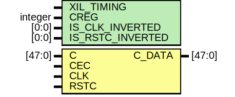

# Entity: DSP_C_DATA

## Diagram

## Description

    Copyright (c) 1995/2018 Xilinx, Inc.
 
    Licensed under the Apache License, Version 2.0 (the "License");
    you may not use this file except in compliance with the License.
    You may obtain a copy of the License at
 
        http://www.apache.org/licenses/LICENSE-2.0
 
    Unless required by applicable law or agreed to in writing, software
    distributed under the License is distributed on an "AS IS" BASIS,
    WITHOUT WARRANTIES OR CONDITIONS OF ANY KIND, either express or implied.
    See the License for the specific language governing permissions and
    limitations under the License.
   ____  ____
  /   /\/   /
 /___/  \  /     Vendor      : Xilinx
 \   \   \/      Version     : 2018.3
  \   \          Description : Xilinx Unified Simulation Library Component
  /   /                        DSP_C_DATA
 /___/   /\      Filename    : DSP_C_DATA.v
 \   \  /  \
  \___\/\___\
  Revision:
  07/15/12 - Migrate from E1.
  12/10/12 - Add dynamic registers
  04/23/13 - 714772 - remove sensitivity to negedge GSR
  10/22/14 - 808642 - Added #1 to $finish
  End Revision:
 
## Generics

| Generic name     | Type    | Value      | Description |
| ---------------- | ------- | ---------- | ----------- |
| XIL_TIMING       |         | "UNPLACED" |             |
| CREG             | integer | 1          |             |
| IS_CLK_INVERTED  | [0:0]   | 1'b0       |             |
| IS_RSTC_INVERTED | [0:0]   | 1'b0       |             |
## Ports

| Port name | Direction | Type   | Description |
| --------- | --------- | ------ | ----------- |
| C_DATA    | output    | [47:0] |             |
| C         | input     | [47:0] |             |
| CEC       | input     |        |             |
| CLK       | input     |        |             |
| RSTC      | input     |        |             |
## Signals

| Name                 | Type              | Description |
| -------------------- | ----------------- | ----------- |
| trig_attr            | reg               |             |
| CREG_REG             | reg [31:0]        |             |
| IS_CLK_INVERTED_REG  | reg [0:0]         |             |
| IS_RSTC_INVERTED_REG | reg [0:0]         |             |
| CREG_BIN             | wire              |             |
| CREG_BIN             | reg               |             |
| glblGSR              | reg               |             |
| glblGSR              | tri0              |             |
| CEC_in               | wire              |             |
| CLK_in               | wire              |             |
| RSTC_in              | wire              |             |
| C_in                 | wire [47:0]       |             |
| CEC_delay            | wire              |             |
| CLK_delay            | wire              |             |
| RSTC_delay           | wire              |             |
| C_delay              | wire [47:0]       |             |
| attr_test            | reg               |             |
| attr_err             | reg               |             |
| notifier             | reg               |             |
| C_reg                | reg [C_WIDTH-1:0] |             |
| clk_en_n             | wire              |             |
| clk_en_p             | wire              |             |
## Constants

| Name        | Type | Value        | Description             |
| ----------- | ---- | ------------ | ----------------------- |
| MODULE_NAME |      | "DSP_C_DATA" | define constants        |
| C_WIDTH     |      | 48           | begin behavioral model  |
## Processes
- unnamed: ( @(trig_attr) )
- unnamed: ( @(trig_attr) )
- unnamed: ( @(posedge CLK_in) )
- unnamed: (  )
- unnamed: (  )
- unnamed: (  )
- unnamed: (  )
- unnamed: (  )
- unnamed: (  )
- unnamed: (  )
- unnamed: (  )
- unnamed: (  )
- unnamed: (  )
- unnamed: (  )
- unnamed: (  )
