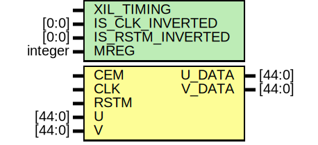

# Entity: DSP_M_DATA

## Diagram

## Description

    Copyright (c) 1995/2018 Xilinx, Inc.
 
    Licensed under the Apache License, Version 2.0 (the "License");
    you may not use this file except in compliance with the License.
    You may obtain a copy of the License at
 
        http://www.apache.org/licenses/LICENSE-2.0
 
    Unless required by applicable law or agreed to in writing, software
    distributed under the License is distributed on an "AS IS" BASIS,
    WITHOUT WARRANTIES OR CONDITIONS OF ANY KIND, either express or implied.
    See the License for the specific language governing permissions and
    limitations under the License.
   ____  ____
  /   /\/   /
 /___/  \  /     Vendor      : Xilinx
 \   \   \/      Version     : 2018.3
  \   \          Description : Xilinx Unified Simulation Library Component
  /   /                        DSP_M_DATA
 /___/   /\      Filename    : DSP_M_DATA.v
 \   \  /  \
  \___\/\___\
  Revision:
  07/15/12 - Migrate from E1.
  12/10/12 - Add dynamic registers
  04/22/13 - 713695 - Zero mult result on USE_SIMD
  04/23/13 - 714772 - remove sensitivity to negedge GSR
  10/22/14 - 808642 - Added #1 to $finish
  End Revision:
 
## Generics

| Generic name     | Type    | Value      | Description |
| ---------------- | ------- | ---------- | ----------- |
| XIL_TIMING       |         | "UNPLACED" |             |
| IS_CLK_INVERTED  | [0:0]   | 1'b0       |             |
| IS_RSTM_INVERTED | [0:0]   | 1'b0       |             |
| MREG             | integer | 1          |             |
## Ports

| Port name | Direction | Type   | Description |
| --------- | --------- | ------ | ----------- |
| U_DATA    | output    | [44:0] |             |
| V_DATA    | output    | [44:0] |             |
| CEM       | input     |        |             |
| CLK       | input     |        |             |
| RSTM      | input     |        |             |
| U         | input     | [44:0] |             |
| V         | input     | [44:0] |             |
## Signals

| Name                 | Type              | Description |
| -------------------- | ----------------- | ----------- |
| trig_attr            | reg               |             |
| IS_CLK_INVERTED_REG  | reg [0:0]         |             |
| IS_RSTM_INVERTED_REG | reg [0:0]         |             |
| MREG_REG             | reg [31:0]        |             |
| MREG_BIN             | wire              |             |
| MREG_BIN             | reg               |             |
| glblGSR              | reg               |             |
| glblGSR              | tri0              |             |
| CEM_in               | wire              |             |
| CLK_in               | wire              |             |
| RSTM_in              | wire              |             |
| U_in                 | wire [44:0]       |             |
| V_in                 | wire [44:0]       |             |
| CEM_delay            | wire              |             |
| CLK_delay            | wire              |             |
| RSTM_delay           | wire              |             |
| U_delay              | wire [44:0]       |             |
| V_delay              | wire [44:0]       |             |
| attr_test            | reg               |             |
| attr_err             | reg               |             |
| notifier             | reg               |             |
| U_DATA_reg           | reg [M_WIDTH-1:0] |             |
| V_DATA_reg           | reg [M_WIDTH-1:0] |             |
| clk_en_n             | wire              |             |
| clk_en_p             | wire              |             |
## Constants

| Name        | Type | Value        | Description             |
| ----------- | ---- | ------------ | ----------------------- |
| MODULE_NAME |      | "DSP_M_DATA" | define constants        |
| M_WIDTH     |      | 45           | begin behavioral model  |
## Processes
- unnamed: ( @(trig_attr) )
- unnamed: ( @(trig_attr) )
- unnamed: ( @(posedge CLK_in) )
- unnamed: (  )
- unnamed: (  )
- unnamed: (  )
- unnamed: (  )
- unnamed: (  )
- unnamed: (  )
- unnamed: (  )
- unnamed: (  )
- unnamed: (  )
- unnamed: (  )
- unnamed: (  )
- unnamed: (  )
- unnamed: (  )
- unnamed: (  )
- unnamed: (  )
- unnamed: (  )
- unnamed: (  )
- unnamed: (  )
- unnamed: (  )
- unnamed: (  )
- unnamed: (  )
- unnamed: (  )
- unnamed: (  )
- unnamed: (  )
- unnamed: (  )
- unnamed: (  )
- unnamed: (  )
- unnamed: (  )
- unnamed: (  )
- unnamed: (  )
- unnamed: (  )
- unnamed: (  )
- unnamed: (  )
- unnamed: (  )
- unnamed: (  )
- unnamed: (  )
- unnamed: (  )
- unnamed: (  )
- unnamed: (  )
- unnamed: (  )
- unnamed: (  )
- unnamed: (  )
- unnamed: (  )
- unnamed: (  )
- unnamed: (  )
- unnamed: (  )
- unnamed: (  )
- unnamed: (  )
- unnamed: (  )
- unnamed: (  )
- unnamed: (  )
- unnamed: (  )
- unnamed: (  )
- unnamed: (  )
- unnamed: (  )
- unnamed: (  )
- unnamed: (  )
- unnamed: (  )
- unnamed: (  )
- unnamed: (  )
- unnamed: (  )
- unnamed: (  )
- unnamed: (  )
- unnamed: (  )
- unnamed: (  )
- unnamed: (  )
- unnamed: (  )
- unnamed: (  )
- unnamed: (  )
- unnamed: (  )
- unnamed: (  )
- unnamed: (  )
- unnamed: (  )
- unnamed: (  )
- unnamed: (  )
- unnamed: (  )
- unnamed: (  )
- unnamed: (  )
- unnamed: (  )
- unnamed: (  )
- unnamed: (  )
- unnamed: (  )
- unnamed: (  )
- unnamed: (  )
- unnamed: (  )
- unnamed: (  )
- unnamed: (  )
- unnamed: (  )
- unnamed: (  )
- unnamed: (  )
- unnamed: (  )
- unnamed: (  )
- unnamed: (  )
- unnamed: (  )
- unnamed: (  )
- unnamed: (  )
- unnamed: (  )
- unnamed: (  )
- unnamed: (  )
- unnamed: (  )
- unnamed: (  )
- unnamed: (  )
- unnamed: (  )
- unnamed: (  )
- unnamed: (  )
- unnamed: (  )
- unnamed: (  )
- unnamed: (  )
- unnamed: (  )
- unnamed: (  )
- unnamed: (  )
- unnamed: (  )
- unnamed: (  )
- unnamed: (  )
- unnamed: (  )
- unnamed: (  )
- unnamed: (  )
- unnamed: (  )
- unnamed: (  )
- unnamed: (  )
- unnamed: (  )
- unnamed: (  )
- unnamed: (  )
- unnamed: (  )
- unnamed: (  )
- unnamed: (  )
- unnamed: (  )
- unnamed: (  )
- unnamed: (  )
- unnamed: (  )
- unnamed: (  )
- unnamed: (  )
- unnamed: (  )
- unnamed: (  )
- unnamed: (  )
- unnamed: (  )
- unnamed: (  )
- unnamed: (  )
- unnamed: (  )
- unnamed: (  )
- unnamed: (  )
- unnamed: (  )
- unnamed: (  )
- unnamed: (  )
- unnamed: (  )
- unnamed: (  )
- unnamed: (  )
- unnamed: (  )
- unnamed: (  )
- unnamed: (  )
- unnamed: (  )
- unnamed: (  )
- unnamed: (  )
- unnamed: (  )
- unnamed: (  )
- unnamed: (  )
- unnamed: (  )
- unnamed: (  )
- unnamed: (  )
- unnamed: (  )
- unnamed: (  )
- unnamed: (  )
- unnamed: (  )
- unnamed: (  )
- unnamed: (  )
- unnamed: (  )
- unnamed: (  )
- unnamed: (  )
- unnamed: (  )
- unnamed: (  )
- unnamed: (  )
- unnamed: (  )
- unnamed: (  )
- unnamed: (  )
- unnamed: (  )
- unnamed: (  )
- unnamed: (  )
- unnamed: (  )
- unnamed: (  )
- unnamed: (  )
- unnamed: (  )
- unnamed: (  )
- unnamed: (  )
- unnamed: (  )
- unnamed: (  )
- unnamed: (  )
- unnamed: (  )
- unnamed: (  )
- unnamed: (  )
- unnamed: (  )
- unnamed: (  )
- unnamed: (  )
- unnamed: (  )
- unnamed: (  )
- unnamed: (  )
- unnamed: (  )
- unnamed: (  )
- unnamed: (  )
- unnamed: (  )
- unnamed: (  )
- unnamed: (  )
- unnamed: (  )
- unnamed: (  )
- unnamed: (  )
- unnamed: (  )
- unnamed: (  )
- unnamed: (  )
- unnamed: (  )
- unnamed: (  )
- unnamed: (  )
- unnamed: (  )
- unnamed: (  )
- unnamed: (  )
- unnamed: (  )
- unnamed: (  )
- unnamed: (  )
- unnamed: (  )
- unnamed: (  )
- unnamed: (  )
- unnamed: (  )
- unnamed: (  )
- unnamed: (  )
- unnamed: (  )
- unnamed: (  )
- unnamed: (  )
- unnamed: (  )
- unnamed: (  )
- unnamed: (  )
- unnamed: (  )
- unnamed: (  )
- unnamed: (  )
- unnamed: (  )
- unnamed: (  )
- unnamed: (  )
- unnamed: (  )
- unnamed: (  )
- unnamed: (  )
- unnamed: (  )
- unnamed: (  )
- unnamed: (  )
- unnamed: (  )
- unnamed: (  )
- unnamed: (  )
- unnamed: (  )
- unnamed: (  )
- unnamed: (  )
- unnamed: (  )
- unnamed: (  )
- unnamed: (  )
- unnamed: (  )
- unnamed: (  )
- unnamed: (  )
- unnamed: (  )
- unnamed: (  )
- unnamed: (  )
- unnamed: (  )
- unnamed: (  )
- unnamed: (  )
- unnamed: (  )
- unnamed: (  )
- unnamed: (  )
- unnamed: (  )
- unnamed: (  )
- unnamed: (  )
- unnamed: (  )
- unnamed: (  )
- unnamed: (  )
- unnamed: (  )
- unnamed: (  )
- unnamed: (  )
- unnamed: (  )
- unnamed: (  )
- unnamed: (  )
- unnamed: (  )
- unnamed: (  )
- unnamed: (  )
- unnamed: (  )
- unnamed: (  )
- unnamed: (  )
- unnamed: (  )
- unnamed: (  )
- unnamed: (  )
- unnamed: (  )
- unnamed: (  )
- unnamed: (  )
- unnamed: (  )
- unnamed: (  )
- unnamed: (  )
- unnamed: (  )
- unnamed: (  )
- unnamed: (  )
- unnamed: (  )
- unnamed: (  )
- unnamed: (  )
- unnamed: (  )
- unnamed: (  )
- unnamed: (  )
- unnamed: (  )
- unnamed: (  )
- unnamed: (  )
- unnamed: (  )
- unnamed: (  )
- unnamed: (  )
- unnamed: (  )
- unnamed: (  )
- unnamed: (  )
- unnamed: (  )
- unnamed: (  )
- unnamed: (  )
- unnamed: (  )
- unnamed: (  )
- unnamed: (  )
- unnamed: (  )
- unnamed: (  )
- unnamed: (  )
- unnamed: (  )
- unnamed: (  )
- unnamed: (  )
- unnamed: (  )
- unnamed: (  )
- unnamed: (  )
- unnamed: (  )
- unnamed: (  )
- unnamed: (  )
- unnamed: (  )
- unnamed: (  )
- unnamed: (  )
- unnamed: (  )
- unnamed: (  )
- unnamed: (  )
- unnamed: (  )
- unnamed: (  )
- unnamed: (  )
- unnamed: (  )
- unnamed: (  )
- unnamed: (  )
- unnamed: (  )
- unnamed: (  )
- unnamed: (  )
- unnamed: (  )
- unnamed: (  )
- unnamed: (  )
- unnamed: (  )
- unnamed: (  )
- unnamed: (  )
- unnamed: (  )
- unnamed: (  )
- unnamed: (  )
