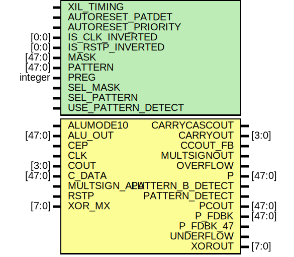

# Entity: DSP_OUTPUT

## Diagram

## Description

    Copyright (c) 1995/2018 Xilinx, Inc.
 
    Licensed under the Apache License, Version 2.0 (the "License");
    you may not use this file except in compliance with the License.
    You may obtain a copy of the License at
 
        http://www.apache.org/licenses/LICENSE-2.0
 
    Unless required by applicable law or agreed to in writing, software
    distributed under the License is distributed on an "AS IS" BASIS,
    WITHOUT WARRANTIES OR CONDITIONS OF ANY KIND, either express or implied.
    See the License for the specific language governing permissions and
    limitations under the License.
   ____  ____
  /   /\/   /
 /___/  \  /     Vendor      : Xilinx
 \   \   \/      Version     : 2018.3
  \   \          Description : Xilinx Unified Simulation Library Component
  /   /                        DSP_OUTPUT
 /___/   /\      Filename    : DSP_OUTPUT.v
 \   \  /  \
  \___\/\___\
  Revision:
  07/15/12 - Migrate from E1.
  12/10/12 - Add dynamic registers
  04/03/13 - yaml update
  04/23/13 - 714772 - remove sensitivity to negedge GSR
  04/23/13 - 713706 - change P_PDBK connection
  10/22/14 - 808642 - Added #1 to $finish
  End Revision:
 
## Generics

| Generic name       | Type    | Value            | Description |
| ------------------ | ------- | ---------------- | ----------- |
| XIL_TIMING         |         | "UNPLACED"       |             |
| AUTORESET_PATDET   |         | "NO_RESET"       |             |
| AUTORESET_PRIORITY |         | "RESET"          |             |
| IS_CLK_INVERTED    | [0:0]   | 1'b0             |             |
| IS_RSTP_INVERTED   | [0:0]   | 1'b0             |             |
| MASK               | [47:0]  | 48'h3FFFFFFFFFFF |             |
| PATTERN            | [47:0]  | 48'h000000000000 |             |
| PREG               | integer | 1                |             |
| SEL_MASK           |         | "MASK"           |             |
| SEL_PATTERN        |         | "PATTERN"        |             |
| USE_PATTERN_DETECT |         | "NO_PATDET"      |             |
## Ports

| Port name        | Direction | Type   | Description |
| ---------------- | --------- | ------ | ----------- |
| CARRYCASCOUT     | output    |        |             |
| CARRYOUT         | output    | [3:0]  |             |
| CCOUT_FB         | output    |        |             |
| MULTSIGNOUT      | output    |        |             |
| OVERFLOW         | output    |        |             |
| P                | output    | [47:0] |             |
| PATTERN_B_DETECT | output    |        |             |
| PATTERN_DETECT   | output    |        |             |
| PCOUT            | output    | [47:0] |             |
| P_FDBK           | output    | [47:0] |             |
| P_FDBK_47        | output    |        |             |
| UNDERFLOW        | output    |        |             |
| XOROUT           | output    | [7:0]  |             |
| ALUMODE10        | input     |        |             |
| ALU_OUT          | input     | [47:0] |             |
| CEP              | input     |        |             |
| CLK              | input     |        |             |
| COUT             | input     | [3:0]  |             |
| C_DATA           | input     | [47:0] |             |
| MULTSIGN_ALU     | input     |        |             |
| RSTP             | input     |        |             |
| XOR_MX           | input     | [7:0]  |             |
## Signals

| Name                   | Type         | Description |
| ---------------------- | ------------ | ----------- |
| trig_attr              | reg          |             |
| AUTORESET_PATDET_REG   | reg [120:1]  |             |
| AUTORESET_PRIORITY_REG | reg [40:1]   |             |
| IS_CLK_INVERTED_REG    | reg [0:0]    |             |
| IS_RSTP_INVERTED_REG   | reg [0:0]    |             |
| MASK_REG               | reg [47:0]   |             |
| PATTERN_REG            | reg [47:0]   |             |
| PREG_REG               | reg [31:0]   |             |
| SEL_MASK_REG           | reg [112:1]  |             |
| SEL_PATTERN_REG        | reg [56:1]   |             |
| USE_PATTERN_DETECT_REG | reg [72:1]   |             |
| AUTORESET_PATDET_BIN   | wire [1:0]   |             |
| AUTORESET_PRIORITY_BIN | wire         |             |
| PREG_BIN               | wire         |             |
| SEL_MASK_BIN           | wire [1:0]   |             |
| SEL_PATTERN_BIN        | wire         |             |
| USE_PATTERN_DETECT_BIN | wire         |             |
| AUTORESET_PATDET_BIN   | reg [1:0]    |             |
| AUTORESET_PRIORITY_BIN | reg          |             |
| PREG_BIN               | reg          |             |
| SEL_MASK_BIN           | reg [1:0]    |             |
| SEL_PATTERN_BIN        | reg          |             |
| USE_PATTERN_DETECT_BIN | reg          |             |
| glblGSR                | reg          |             |
| glblGSR                | tri0         |             |
| ALUMODE10_in           | wire         |             |
| CEP_in                 | wire         |             |
| CLK_in                 | wire         |             |
| MULTSIGN_ALU_in        | wire         |             |
| RSTP_in                | wire         |             |
| COUT_in                | wire [3:0]   |             |
| ALU_OUT_in             | wire [47:0]  |             |
| C_DATA_in              | wire [47:0]  |             |
| XOR_MX_in              | wire [7:0]   |             |
| ALUMODE10_delay        | wire         |             |
| CEP_delay              | wire         |             |
| CLK_delay              | wire         |             |
| MULTSIGN_ALU_delay     | wire         |             |
| RSTP_delay             | wire         |             |
| COUT_delay             | wire [3:0]   |             |
| ALU_OUT_delay          | wire [47:0]  |             |
| C_DATA_delay           | wire [47:0]  |             |
| XOR_MX_delay           | wire [7:0]   |             |
| attr_test              | reg          |             |
| attr_err               | reg          |             |
| notifier               | reg          |             |
| the_auto_reset_patdet  | wire         |             |
| auto_reset_pri         | wire         |             |
| the_mask               | wire [47:0]  |             |
| the_pattern            | wire [47:0]  |             |
| opmode_valid_flag_dou  | reg          | TODO        |
| COUT_reg               | reg [3:0]    |             |
| ALUMODE10_reg          | reg          |             |
| ALUMODE10_mux          | wire         |             |
| MULTSIGN_ALU_reg       | reg          |             |
| ALU_OUT_reg            | reg [47:0]   |             |
| XOR_MX_reg             | reg [7:0]    |             |
| pdet_o                 | wire         |             |
| pdetb_o                | wire         |             |
| pdet_o_mux             | wire         |             |
| pdetb_o_mux            | wire         |             |
| overflow_data          | wire         |             |
| underflow_data         | wire         |             |
| pdet_o_reg1            | reg          |             |
| pdet_o_reg2            | reg          |             |
| pdetb_o_reg1           | reg          |             |
| pdetb_o_reg2           | reg          |             |
| PATTERN_B_DETECT       | ALU_OUT      |             |
| PATTERN_DETECT         | ALU_OUT      |             |
| PCOUT                  | ALU_OUT      |             |
| CARRYOUT               | CLK          |             |
| P                      | CLK          |             |
| PCOUT                  | CLK          |             |
| P_FDBK                 | CLK          |             |
| XOROUT                 | CLK          |             |
| CARRYCASCOUT           | CLK          |             |
| CCOUT_FB               | CLK          |             |
| MULTSIGNOUT            | CLK          |             |
| OVERFLOW               | CLK          |             |
| PATTERN_B_DETECT       | CLK          |             |
| PATTERN_DETECT         | CLK          |             |
| P_FDBK_47              | CLK          |             |
| UNDERFLOW              | CLK          |             |
| CARRYCASCOUT           | COUT         |             |
| CARRYOUT               | COUT         |             |
| PATTERN_B_DETECT       | C_DATA       |             |
| PATTERN_DETECT         | C_DATA       |             |
| MULTSIGNOUT            | MULTSIGN_ALU |             |
| XOROUT                 | XOR_MX       |             |
## Constants

| Name                             | Type | Value        | Description                        |
| -------------------------------- | ---- | ------------ | ---------------------------------- |
| MODULE_NAME                      |      | "DSP_OUTPUT" | define constants                   |
| AUTORESET_PATDET_NO_RESET        |      | 0            | Parameter encodings and registers  |
| AUTORESET_PATDET_RESET_MATCH     |      | 1            |                                    |
| AUTORESET_PATDET_RESET_NOT_MATCH |      | 2            |                                    |
| AUTORESET_PRIORITY_CEP           |      | 1            |                                    |
| AUTORESET_PRIORITY_RESET         |      | 0            |                                    |
| SEL_MASK_C                       |      | 1            |                                    |
| SEL_MASK_MASK                    |      | 0            |                                    |
| SEL_MASK_ROUNDING_MODE1          |      | 2            |                                    |
| SEL_MASK_ROUNDING_MODE2          |      | 3            |                                    |
| SEL_PATTERN_C                    |      | 1            |                                    |
| SEL_PATTERN_PATTERN              |      | 0            |                                    |
| USE_PATTERN_DETECT_NO_PATDET     |      | 0            |                                    |
| USE_PATTERN_DETECT_PATDET        |      | 1            |                                    |
| C_WIDTH                          |      | 48           | begin behavioral model             |
| P_WIDTH                          |      | 48           |                                    |
## Processes
- unnamed: ( @(trig_attr) )
- unnamed: ( @(trig_attr) )
- unnamed: (  )
- unnamed: (  )
- unnamed: (  )
- unnamed: (  )
- unnamed: (  )
- unnamed: (  )
- unnamed: (  )
- unnamed: (  )
- unnamed: (  )
- unnamed: (  )
- unnamed: (  )
- unnamed: (  )
- unnamed: (  )
- unnamed: (  )
- unnamed: (  )
- unnamed: (  )
- unnamed: (  )
- unnamed: (  )
- unnamed: (  )
- unnamed: (  )
- unnamed: (  )
- unnamed: (  )
- unnamed: (  )
- unnamed: (  )
- unnamed: (  )
- unnamed: (  )
- unnamed: (  )
- unnamed: (  )
- unnamed: (  )
- unnamed: (  )
- unnamed: (  )
- unnamed: (  )
- unnamed: (  )
- unnamed: (  )
