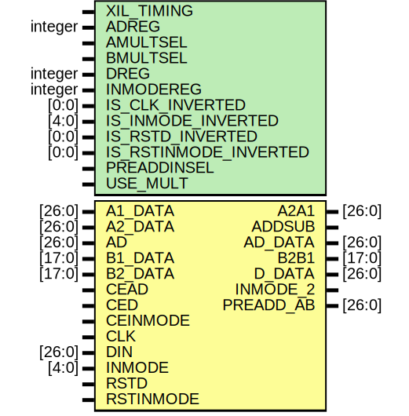

# Entity: DSP_PREADD_DATA

## Diagram

## Description

    Copyright (c) 1995/2018 Xilinx, Inc.
 
    Licensed under the Apache License, Version 2.0 (the "License");
    you may not use this file except in compliance with the License.
    You may obtain a copy of the License at
 
        http://www.apache.org/licenses/LICENSE-2.0
 
    Unless required by applicable law or agreed to in writing, software
    distributed under the License is distributed on an "AS IS" BASIS,
    WITHOUT WARRANTIES OR CONDITIONS OF ANY KIND, either express or implied.
    See the License for the specific language governing permissions and
    limitations under the License.
   ____  ____
  /   /\/   /
 /___/  \  /     Vendor      : Xilinx
 \   \   \/      Version     : 2018.3
  \   \          Description : Xilinx Unified Simulation Library Component
  /   /                        DSP_PREADD_DATA
 /___/   /\      Filename    : DSP_PREADD_DATA.v
 \   \  /  \
  \___\/\___\
  Revision:
  07/15/12 - Migrate from E1.
  12/10/12 - Add dynamic registers
  01/11/13 - DIN, D_DATA data width change (26/24) sync4 yml
  04/23/13 - 714772 - remove sensitivity to negedge GSR
  05/07/13 - 716896 - INMODE_INV_REG mis sized
  10/22/14 - 808642 - Added #1 to $finish
  End Revision:
 
## Generics

| Generic name          | Type    | Value      | Description |
| --------------------- | ------- | ---------- | ----------- |
| XIL_TIMING            |         | "UNPLACED" |             |
| ADREG                 | integer | 1          |             |
| AMULTSEL              |         | "A"        |             |
| BMULTSEL              |         | "B"        |             |
| DREG                  | integer | 1          |             |
| INMODEREG             | integer | 1          |             |
| IS_CLK_INVERTED       | [0:0]   | 1'b0       |             |
| IS_INMODE_INVERTED    | [4:0]   | 5'b00000   |             |
| IS_RSTD_INVERTED      | [0:0]   | 1'b0       |             |
| IS_RSTINMODE_INVERTED | [0:0]   | 1'b0       |             |
| PREADDINSEL           |         | "A"        |             |
| USE_MULT              |         | "MULTIPLY" |             |
## Ports

| Port name | Direction | Type   | Description |
| --------- | --------- | ------ | ----------- |
| A2A1      | output    | [26:0] |             |
| ADDSUB    | output    |        |             |
| AD_DATA   | output    | [26:0] |             |
| B2B1      | output    | [17:0] |             |
| D_DATA    | output    | [26:0] |             |
| INMODE_2  | output    |        |             |
| PREADD_AB | output    | [26:0] |             |
| A1_DATA   | input     | [26:0] |             |
| A2_DATA   | input     | [26:0] |             |
| AD        | input     | [26:0] |             |
| B1_DATA   | input     | [17:0] |             |
| B2_DATA   | input     | [17:0] |             |
| CEAD      | input     |        |             |
| CED       | input     |        |             |
| CEINMODE  | input     |        |             |
| CLK       | input     |        |             |
| DIN       | input     | [26:0] |             |
| INMODE    | input     | [4:0]  |             |
| RSTD      | input     |        |             |
| RSTINMODE | input     |        |             |
## Signals

| Name                      | Type              | Description |
| ------------------------- | ----------------- | ----------- |
| trig_attr                 | reg               |             |
| ADREG_REG                 | reg [31:0]        |             |
| AMULTSEL_REG              | reg [16:1]        |             |
| BMULTSEL_REG              | reg [16:1]        |             |
| DREG_REG                  | reg [31:0]        |             |
| INMODEREG_REG             | reg [31:0]        |             |
| IS_CLK_INVERTED_REG       | reg [0:0]         |             |
| IS_INMODE_INVERTED_REG    | reg [4:0]         |             |
| IS_RSTD_INVERTED_REG      | reg [0:0]         |             |
| IS_RSTINMODE_INVERTED_REG | reg [0:0]         |             |
| PREADDINSEL_REG           | reg [8:1]         |             |
| USE_MULT_REG              | reg [64:1]        |             |
| ADREG_BIN                 | wire              |             |
| AMULTSEL_BIN              | wire              |             |
| BMULTSEL_BIN              | wire              |             |
| DREG_BIN                  | wire              |             |
| INMODEREG_BIN             | wire              |             |
| PREADDINSEL_BIN           | wire              |             |
| USE_MULT_BIN              | wire [1:0]        |             |
| ADREG_BIN                 | reg               |             |
| AMULTSEL_BIN              | reg               |             |
| BMULTSEL_BIN              | reg               |             |
| DREG_BIN                  | reg               |             |
| INMODEREG_BIN             | reg               |             |
| PREADDINSEL_BIN           | reg               |             |
| USE_MULT_BIN              | reg [1:0]         |             |
| glblGSR                   | reg               |             |
| glblGSR                   | tri0              |             |
| CEAD_in                   | wire              |             |
| CED_in                    | wire              |             |
| CEINMODE_in               | wire              |             |
| CLK_in                    | wire              |             |
| RSTD_in                   | wire              |             |
| RSTINMODE_in              | wire              |             |
| B1_DATA_in                | wire [17:0]       |             |
| B2_DATA_in                | wire [17:0]       |             |
| A1_DATA_in                | wire [26:0]       |             |
| A2_DATA_in                | wire [26:0]       |             |
| AD_in                     | wire [26:0]       |             |
| DIN_in                    | wire [26:0]       |             |
| INMODE_in                 | wire [4:0]        |             |
| CEAD_delay                | wire              |             |
| CED_delay                 | wire              |             |
| CEINMODE_delay            | wire              |             |
| CLK_delay                 | wire              |             |
| RSTD_delay                | wire              |             |
| RSTINMODE_delay           | wire              |             |
| AD_delay                  | wire [26:0]       |             |
| DIN_delay                 | wire [26:0]       |             |
| INMODE_delay              | wire [4:0]        |             |
| attr_test                 | reg               |             |
| attr_err                  | reg               |             |
| notifier                  | reg               |             |
| a1a2_i_mux                | wire [26:0]       |             |
| b1b2_i_mux                | wire [17:0]       |             |
| INMODE_mux                | wire [4:0]        |             |
| INMODE_reg                | reg [4:0]         |             |
| AD_DATA_reg               | reg [D_WIDTH-1:0] |             |
| D_DATA_reg                | reg [D_WIDTH-1:0] |             |
| DREG_INT                  | reg               |             |
| ADREG_INT                 | reg               |             |
| clk_en_n                  | wire              |             |
| clk_en_p                  | wire              |             |
## Constants

| Name              | Type | Value             | Description                        |
| ----------------- | ---- | ----------------- | ---------------------------------- |
| MODULE_NAME       |      | "DSP_PREADD_DATA" | define constants                   |
| AMULTSEL_A        |      | 0                 | Parameter encodings and registers  |
| AMULTSEL_AD       |      | 1                 |                                    |
| BMULTSEL_AD       |      | 1                 |                                    |
| BMULTSEL_B        |      | 0                 |                                    |
| PREADDINSEL_A     |      | 0                 |                                    |
| PREADDINSEL_B     |      | 1                 |                                    |
| USE_MULT_DYNAMIC  |      | 1                 |                                    |
| USE_MULT_MULTIPLY |      | 0                 |                                    |
| USE_MULT_NONE     |      | 2                 |                                    |
| D_WIDTH           |      | 27                | begin behavioral model             |
## Processes
- unnamed: ( @(trig_attr) )
- unnamed: ( @(trig_attr) )
- unnamed: ( @ (*) )
- unnamed: ( @ (*) )
- unnamed: ( @(posedge CLK_in) )
**Description**
new

- unnamed: ( @(posedge CLK_in) )
- unnamed: ( @(posedge CLK_in) )
- unnamed: (  )
- unnamed: (  )
- unnamed: (  )
- unnamed: (  )
- unnamed: (  )
- unnamed: (  )
- unnamed: (  )
- unnamed: (  )
- unnamed: (  )
- unnamed: (  )
- unnamed: (  )
- unnamed: (  )
- unnamed: (  )
- unnamed: (  )
- unnamed: (  )
- unnamed: (  )
- unnamed: (  )
- unnamed: (  )
- unnamed: (  )
- unnamed: (  )
- unnamed: (  )
- unnamed: (  )
- unnamed: (  )
- unnamed: (  )
- unnamed: (  )
- unnamed: (  )
- unnamed: (  )
- unnamed: (  )
- unnamed: (  )
- unnamed: (  )
- unnamed: (  )
- unnamed: (  )
