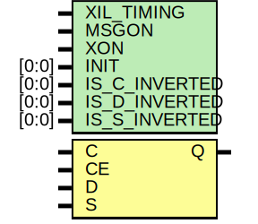

# Entity: FDSE

## Diagram

## Description

   Copyright (c) 1995/2016 Xilinx, Inc.
 
    Licensed under the Apache License, Version 2.0 (the "License");
    you may not use this file except in compliance with the License.
    You may obtain a copy of the License at
 
        http://www.apache.org/licenses/LICENSE-2.0
 
    Unless required by applicable law or agreed to in writing, software
    distributed under the License is distributed on an "AS IS" BASIS,
    WITHOUT WARRANTIES OR CONDITIONS OF ANY KIND, either express or implied.
    See the License for the specific language governing permissions and
    limitations under the License.
   ____  ____
  /   /\/   /
 /___/  \  /    Vendor : Xilinx
 \   \   \/     Version : 2017.1
  \   \         Description : Xilinx Unified Simulation Library Component
  /   /                  D Flip-Flop with Clock Enable and Synchronous Set
 /___/   /\     Filename : FDSE.v
 \   \  /  \
  \___\/\___\
 Revision:
    08/25/10 - Initial version.
    10/20/10 - remove unused pin line from table.
    12/08/11 - add MSGON and XON attributes (CR636891)
    01/16/12 - 640813 - add MSGON and XON functionality
    04/16/13 - PR683925 - add invertible pin support.
 End Revision
 
## Generics

| Generic name  | Type  | Value      | Description |
| ------------- | ----- | ---------- | ----------- |
| XIL_TIMING    |       | "UNPLACED" |             |
| MSGON         |       | "TRUE"     |             |
| XON           |       | "TRUE"     |             |
| INIT          | [0:0] | 1'b1       |             |
| IS_C_INVERTED | [0:0] | 1'b0       |             |
| IS_D_INVERTED | [0:0] | 1'b0       |             |
| IS_S_INVERTED | [0:0] | 1'b0       |             |
## Ports

| Port name | Direction | Type | Description |
| --------- | --------- | ---- | ----------- |
| Q         | output    |      |             |
| C         | input     |      |             |
| CE        | input     |      |             |
| D         | input     |      |             |
| S         | input     |      |             |
## Signals

| Name              | Type      | Description             |
| ----------------- | --------- | ----------------------- |
| IS_C_INVERTED_REG | reg [0:0] |                         |
| IS_D_INVERTED_REG | reg [0:0] |                         |
| IS_S_INVERTED_REG | reg [0:0] |                         |
| glblGSR           | tri0      |                         |
| D_dly             | wire      |                         |
| C_dly             | wire      |                         |
| CE_dly            | wire      |                         |
| S_dly             | wire      |                         |
| Q_out             | reg       | begin behavioral model  |
| notifier          | reg       |                         |
| notifier1         | wire      |                         |
| ngsr              | wire      |                         |
| in_out            | wire      |                         |
| nset              | wire      |                         |
| in_clk_enable     | wire      |                         |
| in_clk_enable_p   | wire      |                         |
| in_clk_enable_n   | wire      |                         |
| ce_clk_enable     | wire      |                         |
| ce_clk_enable_p   | wire      |                         |
| ce_clk_enable_n   | wire      |                         |
| init_enable       | reg       |                         |
| set_clk_enable    | wire      |                         |
| set_clk_enable_p  | wire      |                         |
| set_clk_enable_n  | wire      |                         |
## Processes
- unnamed: ( @(glblGSR) )
**Description**
end behavioral model

- unnamed: ( @(negedge nset) )
