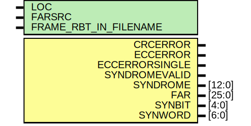

# Entity: FRAME_ECCE2

## Diagram

## Description

    Copyright (c) 2009 Xilinx Inc.
 
    Licensed under the Apache License, Version 2.0 (the "License");
    you may not use this file except in compliance with the License.
    You may obtain a copy of the License at
 
        http://www.apache.org/licenses/LICENSE-2.0
 
    Unless required by applicable law or agreed to in writing, software
    distributed under the License is distributed on an "AS IS" BASIS,
    WITHOUT WARRANTIES OR CONDITIONS OF ANY KIND, either express or implied.
    See the License for the specific language governing permissions and
    limitations under the License.
   ____   ___
  /   /\/   / 
 /___/  \  /     Vendor      : Xilinx 
 \  \    \/      Version     : 13.i (O.71)
  \  \           Description : 
  /  /                      
 /__/   /\       Filename    : FRAME_ECCE2.v
 \  \  /  \ 
  \__\/\__ \                    
                                 
  Revision:		1.0
  07/22/10 - Change Error to Message for input rbt file check (CR568991)
  08/04/11 - Change FRAME_RBT_IN_FILENAME ot NONE (CR618399)
 
## Generics

| Generic name          | Type | Value      | Description |
| --------------------- | ---- | ---------- | ----------- |
| LOC                   |      | "UNPLACED" |             |
| FARSRC                |      | "EFAR"     |             |
| FRAME_RBT_IN_FILENAME |      | "NONE"     |             |
## Ports

| Port name      | Direction | Type   | Description |
| -------------- | --------- | ------ | ----------- |
| CRCERROR       | output    |        |             |
| ECCERROR       | output    |        |             |
| ECCERRORSINGLE | output    |        |             |
| SYNDROMEVALID  | output    |        |             |
| SYNDROME       | output    | [12:0] |             |
| FAR            | output    | [25:0] |             |
| SYNBIT         | output    | [4:0]  |             |
| SYNWORD        | output    | [6:0]  |             |
## Signals

| Name                     | Type         | Description |
| ------------------------ | ------------ | ----------- |
| clk_osc                  | reg          |             |
| rbt_fd                   | integer      |             |
| ecc_ecc_out_fd           | integer      |             |
| ecc_rbt_out_fd           | integer      |             |
| rb_data                  | reg [31:0]   |             |
| data_rbt                 | reg [31:0]   |             |
| tmpwd1                   | reg [31:0]   |             |
| tmpwd2                   | reg [31:0]   |             |
| sim_file_flag            | reg          |             |
| frame_data_bak           | reg [31:0]   |             |
| frame_data               | reg [31:0]   |             |
| frame_addr_i             | integer      |             |
| frame_addr               | reg [31:0]   |             |
| rb_crc_rbt               | reg [31:0]   |             |
| crc_curr                 | reg [31:0]   |             |
| crc_new                  | reg [31:0]   |             |
| crc_input                | reg [36:0]   |             |
| rbcrc_err                | reg          |             |
| rd_rbt_hold              | reg          |             |
| rd_rbt_hold1             | reg          |             |
| rd_rbt_hold2             | reg          |             |
| ecc_wadr                 | reg [6:0]    |             |
| ecc_badr                 | reg [4:0]    |             |
| corr_wd                  | reg [31:0]   |             |
| corr_wd1                 | reg [31:0]   |             |
| rb_data_en               | reg          |             |
| end_rbt                  | reg          |             |
| rd_rbt_en                | reg          |             |
| hamming_rst              | reg          |             |
| i                        | integer      |             |
| bi                       | integer      |             |
| nbi                      | integer      |             |
| n                        | integer      |             |
| ecc_run                  | reg          |             |
| calc_syndrome            | reg          |             |
| new_S                    | wire [12:0]  |             |
| next_S                   | wire [12:0]  |             |
| S                        | reg  [12:0]  |             |
| S_valid                  | reg          |             |
| S_valid_ungated          | reg          |             |
| ecc_corr_mask            | reg  [31:0]  |             |
| ecc_error                | reg          |             |
| ecc_error_single         | reg          |             |
| ecc_error_ungated        | reg          |             |
| ecc_synbit               | reg  [4:0]   |             |
| ecc_synword              | reg  [6:0]   |             |
| ecc_synbit_next          | reg  [4:0]   |             |
| ecc_synword_next         | reg  [6:0]   |             |
| efar_save                | reg          |             |
| hiaddr                   | reg   [11:5] |             |
| hiaddrp1                 | wire [11:5]  |             |
| hiaddr63                 | wire         |             |
| hiaddr127                | wire         |             |
| hclk                     | wire         |             |
| xorall                   | wire         |             |
| overall                  | wire         |             |
| S_valid_next             | wire         |             |
| S_valid_ungated_next     | wire         |             |
| next_error               | wire         |             |
| new_S_xor_S              | wire [12:0]  |             |
| ecc_synword_next_not_par | wire [6:0]   |             |
| tmps1                    | reg [160:0]  |             |
| tmps2                    | reg [160:0]  |             |
| tmps3                    | reg [160:0]  |             |
## Constants

| Name                       | Type | Value                  | Description |
| -------------------------- | ---- | ---------------------- | ----------- |
| FRAME_ECC_OUT_RBT_FILENAME |      | "frame_rbt_out_e2.txt" |             |
| FRAME_ECC_OUT_ECC_FILENAME |      | "frame_ecc_out_e2.txt" |             |
## Processes
- unnamed: (  )
- unnamed: ( @(negedge clk_osc ) )
- unnamed: ( @(negedge clk_osc) )
- unnamed: ( @(posedge clk_osc) )
- unnamed: ( @(negedge clk_osc) )
- unnamed: ( @( posedge clk_osc or posedge hamming_rst) )
- unnamed: ( @(ecc_synword_next_not_par, new_S_xor_S) )
- unnamed: ( @( posedge clk_osc or posedge hamming_rst) )
