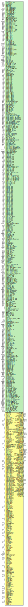

# Entity: GTHE4_CHANNEL

## Diagram

## Description

    Copyright (c) 1995/2017 Xilinx, Inc.
 
    Licensed under the Apache License, Version 2.0 (the "License");
    you may not use this file except in compliance with the License.
    You may obtain a copy of the License at
 
        http://www.apache.org/licenses/LICENSE-2.0
 
    Unless required by applicable law or agreed to in writing, software
    distributed under the License is distributed on an "AS IS" BASIS,
    WITHOUT WARRANTIES OR CONDITIONS OF ANY KIND, either express or implied.
    See the License for the specific language governing permissions and
    limitations under the License.
   ____  ____
  /   /\/   /
 /___/  \  /     Vendor      : Xilinx
 \   \   \/      Version     : 2017.1
  \   \          Description : Xilinx Unified Simulation Library Component
  /   /                        Gigabit Transceiver for UltraScale+ devices
 /___/   /\      Filename    : GTHE4_CHANNEL.v
 \   \  /  \
  \___\/\___\
  Revision:
  End Revision:
 
## Generics

| Generic name                 | Type    | Value                | Description |
| ---------------------------- | ------- | -------------------- | ----------- |
| XIL_TIMING                   |         | "UNPLACED"           |             |
| ACJTAG_DEBUG_MODE            | [0:0]   | 1'b0                 |             |
| ACJTAG_MODE                  | [0:0]   | 1'b0                 |             |
| ACJTAG_RESET                 | [0:0]   | 1'b0                 |             |
| ADAPT_CFG0                   | [15:0]  | 16'h9200             |             |
| ADAPT_CFG1                   | [15:0]  | 16'h801C             |             |
| ADAPT_CFG2                   | [15:0]  | 16'h0000             |             |
| ALIGN_COMMA_DOUBLE           |         | "FALSE"              |             |
| ALIGN_COMMA_ENABLE           | [9:0]   | 10'b0001111111       |             |
| ALIGN_COMMA_WORD             | integer | 1                    |             |
| ALIGN_MCOMMA_DET             |         | "TRUE"               |             |
| ALIGN_MCOMMA_VALUE           | [9:0]   | 10'b1010000011       |             |
| ALIGN_PCOMMA_DET             |         | "TRUE"               |             |
| ALIGN_PCOMMA_VALUE           | [9:0]   | 10'b0101111100       |             |
| A_RXOSCALRESET               | [0:0]   | 1'b0                 |             |
| A_RXPROGDIVRESET             | [0:0]   | 1'b0                 |             |
| A_RXTERMINATION              | [0:0]   | 1'b1                 |             |
| A_TXDIFFCTRL                 | [4:0]   | 5'b01100             |             |
| A_TXPROGDIVRESET             | [0:0]   | 1'b0                 |             |
| CAPBYPASS_FORCE              | [0:0]   | 1'b0                 |             |
| CBCC_DATA_SOURCE_SEL         |         | "DECODED"            |             |
| CDR_SWAP_MODE_EN             | [0:0]   | 1'b0                 |             |
| CFOK_PWRSVE_EN               | [0:0]   | 1'b1                 |             |
| CHAN_BOND_KEEP_ALIGN         |         | "FALSE"              |             |
| CHAN_BOND_MAX_SKEW           | integer | 7                    |             |
| CHAN_BOND_SEQ_1_1            | [9:0]   | 10'b0101111100       |             |
| CHAN_BOND_SEQ_1_2            | [9:0]   | 10'b0000000000       |             |
| CHAN_BOND_SEQ_1_3            | [9:0]   | 10'b0000000000       |             |
| CHAN_BOND_SEQ_1_4            | [9:0]   | 10'b0000000000       |             |
| CHAN_BOND_SEQ_1_ENABLE       | [3:0]   | 4'b1111              |             |
| CHAN_BOND_SEQ_2_1            | [9:0]   | 10'b0100000000       |             |
| CHAN_BOND_SEQ_2_2            | [9:0]   | 10'b0100000000       |             |
| CHAN_BOND_SEQ_2_3            | [9:0]   | 10'b0100000000       |             |
| CHAN_BOND_SEQ_2_4            | [9:0]   | 10'b0100000000       |             |
| CHAN_BOND_SEQ_2_ENABLE       | [3:0]   | 4'b1111              |             |
| CHAN_BOND_SEQ_2_USE          |         | "FALSE"              |             |
| CHAN_BOND_SEQ_LEN            | integer | 2                    |             |
| CH_HSPMUX                    | [15:0]  | 16'h2424             |             |
| CKCAL1_CFG_0                 | [15:0]  | 16'b0000000000000000 |             |
| CKCAL1_CFG_1                 | [15:0]  | 16'b0000000000000000 |             |
| CKCAL1_CFG_2                 | [15:0]  | 16'b0000000000000000 |             |
| CKCAL1_CFG_3                 | [15:0]  | 16'b0000000000000000 |             |
| CKCAL2_CFG_0                 | [15:0]  | 16'b0000000000000000 |             |
| CKCAL2_CFG_1                 | [15:0]  | 16'b0000000000000000 |             |
| CKCAL2_CFG_2                 | [15:0]  | 16'b0000000000000000 |             |
| CKCAL2_CFG_3                 | [15:0]  | 16'b0000000000000000 |             |
| CKCAL2_CFG_4                 | [15:0]  | 16'b0000000000000000 |             |
| CKCAL_RSVD0                  | [15:0]  | 16'h4000             |             |
| CKCAL_RSVD1                  | [15:0]  | 16'h0000             |             |
| CLK_CORRECT_USE              |         | "TRUE"               |             |
| CLK_COR_KEEP_IDLE            |         | "FALSE"              |             |
| CLK_COR_MAX_LAT              | integer | 20                   |             |
| CLK_COR_MIN_LAT              | integer | 18                   |             |
| CLK_COR_PRECEDENCE           |         | "TRUE"               |             |
| CLK_COR_REPEAT_WAIT          | integer | 0                    |             |
| CLK_COR_SEQ_1_1              | [9:0]   | 10'b0100011100       |             |
| CLK_COR_SEQ_1_2              | [9:0]   | 10'b0000000000       |             |
| CLK_COR_SEQ_1_3              | [9:0]   | 10'b0000000000       |             |
| CLK_COR_SEQ_1_4              | [9:0]   | 10'b0000000000       |             |
| CLK_COR_SEQ_1_ENABLE         | [3:0]   | 4'b1111              |             |
| CLK_COR_SEQ_2_1              | [9:0]   | 10'b0100000000       |             |
| CLK_COR_SEQ_2_2              | [9:0]   | 10'b0100000000       |             |
| CLK_COR_SEQ_2_3              | [9:0]   | 10'b0100000000       |             |
| CLK_COR_SEQ_2_4              | [9:0]   | 10'b0100000000       |             |
| CLK_COR_SEQ_2_ENABLE         | [3:0]   | 4'b1111              |             |
| CLK_COR_SEQ_2_USE            |         | "FALSE"              |             |
| CLK_COR_SEQ_LEN              | integer | 2                    |             |
| CPLL_CFG0                    | [15:0]  | 16'h01FA             |             |
| CPLL_CFG1                    | [15:0]  | 16'h24A9             |             |
| CPLL_CFG2                    | [15:0]  | 16'h6807             |             |
| CPLL_CFG3                    | [15:0]  | 16'h0000             |             |
| CPLL_FBDIV                   | integer | 4                    |             |
| CPLL_FBDIV_45                | integer | 4                    |             |
| CPLL_INIT_CFG0               | [15:0]  | 16'h001E             |             |
| CPLL_LOCK_CFG                | [15:0]  | 16'h01E8             |             |
| CPLL_REFCLK_DIV              | integer | 1                    |             |
| CTLE3_OCAP_EXT_CTRL          | [2:0]   | 3'b000               |             |
| CTLE3_OCAP_EXT_EN            | [0:0]   | 1'b0                 |             |
| DDI_CTRL                     | [1:0]   | 2'b00                |             |
| DDI_REALIGN_WAIT             | integer | 15                   |             |
| DEC_MCOMMA_DETECT            |         | "TRUE"               |             |
| DEC_PCOMMA_DETECT            |         | "TRUE"               |             |
| DEC_VALID_COMMA_ONLY         |         | "TRUE"               |             |
| DELAY_ELEC                   | [0:0]   | 1'b0                 |             |
| DMONITOR_CFG0                | [9:0]   | 10'h000              |             |
| DMONITOR_CFG1                | [7:0]   | 8'h00                |             |
| ES_CLK_PHASE_SEL             | [0:0]   | 1'b0                 |             |
| ES_CONTROL                   | [5:0]   | 6'b000000            |             |
| ES_ERRDET_EN                 |         | "FALSE"              |             |
| ES_EYE_SCAN_EN               |         | "FALSE"              |             |
| ES_HORZ_OFFSET               | [11:0]  | 12'h800              |             |
| ES_PRESCALE                  | [4:0]   | 5'b00000             |             |
| ES_QUALIFIER0                | [15:0]  | 16'h0000             |             |
| ES_QUALIFIER1                | [15:0]  | 16'h0000             |             |
| ES_QUALIFIER2                | [15:0]  | 16'h0000             |             |
| ES_QUALIFIER3                | [15:0]  | 16'h0000             |             |
| ES_QUALIFIER4                | [15:0]  | 16'h0000             |             |
| ES_QUALIFIER5                | [15:0]  | 16'h0000             |             |
| ES_QUALIFIER6                | [15:0]  | 16'h0000             |             |
| ES_QUALIFIER7                | [15:0]  | 16'h0000             |             |
| ES_QUALIFIER8                | [15:0]  | 16'h0000             |             |
| ES_QUALIFIER9                | [15:0]  | 16'h0000             |             |
| ES_QUAL_MASK0                | [15:0]  | 16'h0000             |             |
| ES_QUAL_MASK1                | [15:0]  | 16'h0000             |             |
| ES_QUAL_MASK2                | [15:0]  | 16'h0000             |             |
| ES_QUAL_MASK3                | [15:0]  | 16'h0000             |             |
| ES_QUAL_MASK4                | [15:0]  | 16'h0000             |             |
| ES_QUAL_MASK5                | [15:0]  | 16'h0000             |             |
| ES_QUAL_MASK6                | [15:0]  | 16'h0000             |             |
| ES_QUAL_MASK7                | [15:0]  | 16'h0000             |             |
| ES_QUAL_MASK8                | [15:0]  | 16'h0000             |             |
| ES_QUAL_MASK9                | [15:0]  | 16'h0000             |             |
| ES_SDATA_MASK0               | [15:0]  | 16'h0000             |             |
| ES_SDATA_MASK1               | [15:0]  | 16'h0000             |             |
| ES_SDATA_MASK2               | [15:0]  | 16'h0000             |             |
| ES_SDATA_MASK3               | [15:0]  | 16'h0000             |             |
| ES_SDATA_MASK4               | [15:0]  | 16'h0000             |             |
| ES_SDATA_MASK5               | [15:0]  | 16'h0000             |             |
| ES_SDATA_MASK6               | [15:0]  | 16'h0000             |             |
| ES_SDATA_MASK7               | [15:0]  | 16'h0000             |             |
| ES_SDATA_MASK8               | [15:0]  | 16'h0000             |             |
| ES_SDATA_MASK9               | [15:0]  | 16'h0000             |             |
| EYE_SCAN_SWAP_EN             | [0:0]   | 1'b0                 |             |
| FTS_DESKEW_SEQ_ENABLE        | [3:0]   | 4'b1111              |             |
| FTS_LANE_DESKEW_CFG          | [3:0]   | 4'b1111              |             |
| FTS_LANE_DESKEW_EN           |         | "FALSE"              |             |
| GEARBOX_MODE                 | [4:0]   | 5'b00000             |             |
| ISCAN_CK_PH_SEL2             | [0:0]   | 1'b0                 |             |
| LOCAL_MASTER                 | [0:0]   | 1'b0                 |             |
| LPBK_BIAS_CTRL               | [2:0]   | 3'b000               |             |
| LPBK_EN_RCAL_B               | [0:0]   | 1'b0                 |             |
| LPBK_EXT_RCAL                | [3:0]   | 4'b0000              |             |
| LPBK_IND_CTRL0               | [2:0]   | 3'b000               |             |
| LPBK_IND_CTRL1               | [2:0]   | 3'b000               |             |
| LPBK_IND_CTRL2               | [2:0]   | 3'b000               |             |
| LPBK_RG_CTRL                 | [3:0]   | 4'b0000              |             |
| OOBDIVCTL                    | [1:0]   | 2'b00                |             |
| OOB_PWRUP                    | [0:0]   | 1'b0                 |             |
| PCI3_AUTO_REALIGN            |         | "FRST_SMPL"          |             |
| PCI3_PIPE_RX_ELECIDLE        | [0:0]   | 1'b1                 |             |
| PCI3_RX_ASYNC_EBUF_BYPASS    | [1:0]   | 2'b00                |             |
| PCI3_RX_ELECIDLE_EI2_ENABLE  | [0:0]   | 1'b0                 |             |
| PCI3_RX_ELECIDLE_H2L_COUNT   | [5:0]   | 6'b000000            |             |
| PCI3_RX_ELECIDLE_H2L_DISABLE | [2:0]   | 3'b000               |             |
| PCI3_RX_ELECIDLE_HI_COUNT    | [5:0]   | 6'b000000            |             |
| PCI3_RX_ELECIDLE_LP4_DISABLE | [0:0]   | 1'b0                 |             |
| PCI3_RX_FIFO_DISABLE         | [0:0]   | 1'b0                 |             |
| PCIE3_CLK_COR_EMPTY_THRSH    | [4:0]   | 5'b00000             |             |
| PCIE3_CLK_COR_FULL_THRSH     | [5:0]   | 6'b010000            |             |
| PCIE3_CLK_COR_MAX_LAT        | [4:0]   | 5'b01000             |             |
| PCIE3_CLK_COR_MIN_LAT        | [4:0]   | 5'b00100             |             |
| PCIE3_CLK_COR_THRSH_TIMER    | [5:0]   | 6'b001000            |             |
| PCIE_BUFG_DIV_CTRL           | [15:0]  | 16'h0000             |             |
| PCIE_PLL_SEL_MODE_GEN12      | [1:0]   | 2'h0                 |             |
| PCIE_PLL_SEL_MODE_GEN3       | [1:0]   | 2'h0                 |             |
| PCIE_PLL_SEL_MODE_GEN4       | [1:0]   | 2'h0                 |             |
| PCIE_RXPCS_CFG_GEN3          | [15:0]  | 16'h0000             |             |
| PCIE_RXPMA_CFG               | [15:0]  | 16'h0000             |             |
| PCIE_TXPCS_CFG_GEN3          | [15:0]  | 16'h0000             |             |
| PCIE_TXPMA_CFG               | [15:0]  | 16'h0000             |             |
| PCS_PCIE_EN                  |         | "FALSE"              |             |
| PCS_RSVD0                    | [15:0]  | 16'b0000000000000000 |             |
| PD_TRANS_TIME_FROM_P2        | [11:0]  | 12'h03C              |             |
| PD_TRANS_TIME_NONE_P2        | [7:0]   | 8'h19                |             |
| PD_TRANS_TIME_TO_P2          | [7:0]   | 8'h64                |             |
| PREIQ_FREQ_BST               | integer | 0                    |             |
| PROCESS_PAR                  | [2:0]   | 3'b010               |             |
| RATE_SW_USE_DRP              | [0:0]   | 1'b0                 |             |
| RCLK_SIPO_DLY_ENB            | [0:0]   | 1'b0                 |             |
| RCLK_SIPO_INV_EN             | [0:0]   | 1'b0                 |             |
| RESET_POWERSAVE_DISABLE      | [0:0]   | 1'b0                 |             |
| RTX_BUF_CML_CTRL             | [2:0]   | 3'b010               |             |
| RTX_BUF_TERM_CTRL            | [1:0]   | 2'b00                |             |
| RXBUFRESET_TIME              | [4:0]   | 5'b00001             |             |
| RXBUF_ADDR_MODE              |         | "FULL"               |             |
| RXBUF_EIDLE_HI_CNT           | [3:0]   | 4'b1000              |             |
| RXBUF_EIDLE_LO_CNT           | [3:0]   | 4'b0000              |             |
| RXBUF_EN                     |         | "TRUE"               |             |
| RXBUF_RESET_ON_CB_CHANGE     |         | "TRUE"               |             |
| RXBUF_RESET_ON_COMMAALIGN    |         | "FALSE"              |             |
| RXBUF_RESET_ON_EIDLE         |         | "FALSE"              |             |
| RXBUF_RESET_ON_RATE_CHANGE   |         | "TRUE"               |             |
| RXBUF_THRESH_OVFLW           | integer | 0                    |             |
| RXBUF_THRESH_OVRD            |         | "FALSE"              |             |
| RXBUF_THRESH_UNDFLW          | integer | 4                    |             |
| RXCDRFREQRESET_TIME          | [4:0]   | 5'b00001             |             |
| RXCDRPHRESET_TIME            | [4:0]   | 5'b00001             |             |
| RXCDR_CFG0                   | [15:0]  | 16'h0003             |             |
| RXCDR_CFG0_GEN3              | [15:0]  | 16'h0003             |             |
| RXCDR_CFG1                   | [15:0]  | 16'h0000             |             |
| RXCDR_CFG1_GEN3              | [15:0]  | 16'h0000             |             |
| RXCDR_CFG2                   | [15:0]  | 16'h0164             |             |
| RXCDR_CFG2_GEN2              | [9:0]   | 10'h164              |             |
| RXCDR_CFG2_GEN3              | [15:0]  | 16'h0034             |             |
| RXCDR_CFG2_GEN4              | [15:0]  | 16'h0034             |             |
| RXCDR_CFG3                   | [15:0]  | 16'h0024             |             |
| RXCDR_CFG3_GEN2              | [5:0]   | 6'h24                |             |
| RXCDR_CFG3_GEN3              | [15:0]  | 16'h0024             |             |
| RXCDR_CFG3_GEN4              | [15:0]  | 16'h0024             |             |
| RXCDR_CFG4                   | [15:0]  | 16'h5CF6             |             |
| RXCDR_CFG4_GEN3              | [15:0]  | 16'h5CF6             |             |
| RXCDR_CFG5                   | [15:0]  | 16'hB46B             |             |
| RXCDR_CFG5_GEN3              | [15:0]  | 16'h146B             |             |
| RXCDR_FR_RESET_ON_EIDLE      | [0:0]   | 1'b0                 |             |
| RXCDR_HOLD_DURING_EIDLE      | [0:0]   | 1'b0                 |             |
| RXCDR_LOCK_CFG0              | [15:0]  | 16'h0040             |             |
| RXCDR_LOCK_CFG1              | [15:0]  | 16'h8000             |             |
| RXCDR_LOCK_CFG2              | [15:0]  | 16'h0000             |             |
| RXCDR_LOCK_CFG3              | [15:0]  | 16'h0000             |             |
| RXCDR_LOCK_CFG4              | [15:0]  | 16'h0000             |             |
| RXCDR_PH_RESET_ON_EIDLE      | [0:0]   | 1'b0                 |             |
| RXCFOK_CFG0                  | [15:0]  | 16'h0000             |             |
| RXCFOK_CFG1                  | [15:0]  | 16'h0002             |             |
| RXCFOK_CFG2                  | [15:0]  | 16'h002D             |             |
| RXCKCAL1_IQ_LOOP_RST_CFG     | [15:0]  | 16'h0000             |             |
| RXCKCAL1_I_LOOP_RST_CFG      | [15:0]  | 16'h0000             |             |
| RXCKCAL1_Q_LOOP_RST_CFG      | [15:0]  | 16'h0000             |             |
| RXCKCAL2_DX_LOOP_RST_CFG     | [15:0]  | 16'h0000             |             |
| RXCKCAL2_D_LOOP_RST_CFG      | [15:0]  | 16'h0000             |             |
| RXCKCAL2_S_LOOP_RST_CFG      | [15:0]  | 16'h0000             |             |
| RXCKCAL2_X_LOOP_RST_CFG      | [15:0]  | 16'h0000             |             |
| RXDFELPMRESET_TIME           | [6:0]   | 7'b0001111           |             |
| RXDFELPM_KL_CFG0             | [15:0]  | 16'h0000             |             |
| RXDFELPM_KL_CFG1             | [15:0]  | 16'h0022             |             |
| RXDFELPM_KL_CFG2             | [15:0]  | 16'h0100             |             |
| RXDFE_CFG0                   | [15:0]  | 16'h4000             |             |
| RXDFE_CFG1                   | [15:0]  | 16'h0000             |             |
| RXDFE_GC_CFG0                | [15:0]  | 16'h0000             |             |
| RXDFE_GC_CFG1                | [15:0]  | 16'h0000             |             |
| RXDFE_GC_CFG2                | [15:0]  | 16'h0000             |             |
| RXDFE_H2_CFG0                | [15:0]  | 16'h0000             |             |
| RXDFE_H2_CFG1                | [15:0]  | 16'h0002             |             |
| RXDFE_H3_CFG0                | [15:0]  | 16'h0000             |             |
| RXDFE_H3_CFG1                | [15:0]  | 16'h0002             |             |
| RXDFE_H4_CFG0                | [15:0]  | 16'h0000             |             |
| RXDFE_H4_CFG1                | [15:0]  | 16'h0003             |             |
| RXDFE_H5_CFG0                | [15:0]  | 16'h0000             |             |
| RXDFE_H5_CFG1                | [15:0]  | 16'h0002             |             |
| RXDFE_H6_CFG0                | [15:0]  | 16'h0000             |             |
| RXDFE_H6_CFG1                | [15:0]  | 16'h0002             |             |
| RXDFE_H7_CFG0                | [15:0]  | 16'h0000             |             |
| RXDFE_H7_CFG1                | [15:0]  | 16'h0002             |             |
| RXDFE_H8_CFG0                | [15:0]  | 16'h0000             |             |
| RXDFE_H8_CFG1                | [15:0]  | 16'h0002             |             |
| RXDFE_H9_CFG0                | [15:0]  | 16'h0000             |             |
| RXDFE_H9_CFG1                | [15:0]  | 16'h0002             |             |
| RXDFE_HA_CFG0                | [15:0]  | 16'h0000             |             |
| RXDFE_HA_CFG1                | [15:0]  | 16'h0002             |             |
| RXDFE_HB_CFG0                | [15:0]  | 16'h0000             |             |
| RXDFE_HB_CFG1                | [15:0]  | 16'h0002             |             |
| RXDFE_HC_CFG0                | [15:0]  | 16'h0000             |             |
| RXDFE_HC_CFG1                | [15:0]  | 16'h0002             |             |
| RXDFE_HD_CFG0                | [15:0]  | 16'h0000             |             |
| RXDFE_HD_CFG1                | [15:0]  | 16'h0002             |             |
| RXDFE_HE_CFG0                | [15:0]  | 16'h0000             |             |
| RXDFE_HE_CFG1                | [15:0]  | 16'h0002             |             |
| RXDFE_HF_CFG0                | [15:0]  | 16'h0000             |             |
| RXDFE_HF_CFG1                | [15:0]  | 16'h0002             |             |
| RXDFE_KH_CFG0                | [15:0]  | 16'h0000             |             |
| RXDFE_KH_CFG1                | [15:0]  | 16'h0000             |             |
| RXDFE_KH_CFG2                | [15:0]  | 16'h0000             |             |
| RXDFE_KH_CFG3                | [15:0]  | 16'h0000             |             |
| RXDFE_OS_CFG0                | [15:0]  | 16'h0000             |             |
| RXDFE_OS_CFG1                | [15:0]  | 16'h0002             |             |
| RXDFE_PWR_SAVING             | [0:0]   | 1'b0                 |             |
| RXDFE_UT_CFG0                | [15:0]  | 16'h0000             |             |
| RXDFE_UT_CFG1                | [15:0]  | 16'h0002             |             |
| RXDFE_UT_CFG2                | [15:0]  | 16'h0000             |             |
| RXDFE_VP_CFG0                | [15:0]  | 16'h0000             |             |
| RXDFE_VP_CFG1                | [15:0]  | 16'h0022             |             |
| RXDLY_CFG                    | [15:0]  | 16'h0010             |             |
| RXDLY_LCFG                   | [15:0]  | 16'h0030             |             |
| RXELECIDLE_CFG               |         | "SIGCFG_4"           |             |
| RXGBOX_FIFO_INIT_RD_ADDR     | integer | 4                    |             |
| RXGEARBOX_EN                 |         | "FALSE"              |             |
| RXISCANRESET_TIME            | [4:0]   | 5'b00001             |             |
| RXLPM_CFG                    | [15:0]  | 16'h0000             |             |
| RXLPM_GC_CFG                 | [15:0]  | 16'h1000             |             |
| RXLPM_KH_CFG0                | [15:0]  | 16'h0000             |             |
| RXLPM_KH_CFG1                | [15:0]  | 16'h0002             |             |
| RXLPM_OS_CFG0                | [15:0]  | 16'h0000             |             |
| RXLPM_OS_CFG1                | [15:0]  | 16'h0000             |             |
| RXOOB_CFG                    | [8:0]   | 9'b000110000         |             |
| RXOOB_CLK_CFG                |         | "PMA"                |             |
| RXOSCALRESET_TIME            | [4:0]   | 5'b00011             |             |
| RXOUT_DIV                    | integer | 4                    |             |
| RXPCSRESET_TIME              | [4:0]   | 5'b00001             |             |
| RXPHBEACON_CFG               | [15:0]  | 16'h0000             |             |
| RXPHDLY_CFG                  | [15:0]  | 16'h2020             |             |
| RXPHSAMP_CFG                 | [15:0]  | 16'h2100             |             |
| RXPHSLIP_CFG                 | [15:0]  | 16'h9933             |             |
| RXPH_MONITOR_SEL             | [4:0]   | 5'b00000             |             |
| RXPI_AUTO_BW_SEL_BYPASS      | [0:0]   | 1'b0                 |             |
| RXPI_CFG0                    | [15:0]  | 16'h0002             |             |
| RXPI_CFG1                    | [15:0]  | 16'b0000000000000000 |             |
| RXPI_LPM                     | [0:0]   | 1'b0                 |             |
| RXPI_SEL_LC                  | [1:0]   | 2'b00                |             |
| RXPI_STARTCODE               | [1:0]   | 2'b00                |             |
| RXPI_VREFSEL                 | [0:0]   | 1'b0                 |             |
| RXPMACLK_SEL                 |         | "DATA"               |             |
| RXPMARESET_TIME              | [4:0]   | 5'b00001             |             |
| RXPRBS_ERR_LOOPBACK          | [0:0]   | 1'b0                 |             |
| RXPRBS_LINKACQ_CNT           | integer | 15                   |             |
| RXREFCLKDIV2_SEL             | [0:0]   | 1'b0                 |             |
| RXSLIDE_AUTO_WAIT            | integer | 7                    |             |
| RXSLIDE_MODE                 |         | "OFF"                |             |
| RXSYNC_MULTILANE             | [0:0]   | 1'b0                 |             |
| RXSYNC_OVRD                  | [0:0]   | 1'b0                 |             |
| RXSYNC_SKIP_DA               | [0:0]   | 1'b0                 |             |
| RX_AFE_CM_EN                 | [0:0]   | 1'b0                 |             |
| RX_BIAS_CFG0                 | [15:0]  | 16'h12B0             |             |
| RX_BUFFER_CFG                | [5:0]   | 6'b000000            |             |
| RX_CAPFF_SARC_ENB            | [0:0]   | 1'b0                 |             |
| RX_CLK25_DIV                 | integer | 8                    |             |
| RX_CLKMUX_EN                 | [0:0]   | 1'b1                 |             |
| RX_CLK_SLIP_OVRD             | [4:0]   | 5'b00000             |             |
| RX_CM_BUF_CFG                | [3:0]   | 4'b1010              |             |
| RX_CM_BUF_PD                 | [0:0]   | 1'b0                 |             |
| RX_CM_SEL                    | integer | 3                    |             |
| RX_CM_TRIM                   | integer | 12                   |             |
| RX_CTLE3_LPF                 | [7:0]   | 8'b00000000          |             |
| RX_DATA_WIDTH                | integer | 20                   |             |
| RX_DDI_SEL                   | [5:0]   | 6'b000000            |             |
| RX_DEFER_RESET_BUF_EN        |         | "TRUE"               |             |
| RX_DEGEN_CTRL                | [2:0]   | 3'b011               |             |
| RX_DFELPM_CFG0               | integer | 0                    |             |
| RX_DFELPM_CFG1               | [0:0]   | 1'b1                 |             |
| RX_DFELPM_KLKH_AGC_STUP_EN   | [0:0]   | 1'b1                 |             |
| RX_DFE_AGC_CFG0              | [1:0]   | 2'b00                |             |
| RX_DFE_AGC_CFG1              | integer | 4                    |             |
| RX_DFE_KL_LPM_KH_CFG0        | integer | 1                    |             |
| RX_DFE_KL_LPM_KH_CFG1        | integer | 4                    |             |
| RX_DFE_KL_LPM_KL_CFG0        | [1:0]   | 2'b01                |             |
| RX_DFE_KL_LPM_KL_CFG1        | integer | 4                    |             |
| RX_DFE_LPM_HOLD_DURING_EIDLE | [0:0]   | 1'b0                 |             |
| RX_DISPERR_SEQ_MATCH         |         | "TRUE"               |             |
| RX_DIV2_MODE_B               | [0:0]   | 1'b0                 |             |
| RX_DIVRESET_TIME             | [4:0]   | 5'b00001             |             |
| RX_EN_CTLE_RCAL_B            | [0:0]   | 1'b0                 |             |
| RX_EN_HI_LR                  | [0:0]   | 1'b1                 |             |
| RX_EXT_RL_CTRL               | [8:0]   | 9'b000000000         |             |
| RX_EYESCAN_VS_CODE           | [6:0]   | 7'b0000000           |             |
| RX_EYESCAN_VS_NEG_DIR        | [0:0]   | 1'b0                 |             |
| RX_EYESCAN_VS_RANGE          | [1:0]   | 2'b00                |             |
| RX_EYESCAN_VS_UT_SIGN        | [0:0]   | 1'b0                 |             |
| RX_FABINT_USRCLK_FLOP        | [0:0]   | 1'b0                 |             |
| RX_INT_DATAWIDTH             | integer | 1                    |             |
| RX_PMA_POWER_SAVE            | [0:0]   | 1'b0                 |             |
| RX_PMA_RSV0                  | [15:0]  | 16'h0000             |             |
| RX_PROGDIV_CFG               | real    | 0.0                  |             |
| RX_PROGDIV_RATE              | [15:0]  | 16'h0001             |             |
| RX_RESLOAD_CTRL              | [3:0]   | 4'b0000              |             |
| RX_RESLOAD_OVRD              | [0:0]   | 1'b0                 |             |
| RX_SAMPLE_PERIOD             | [2:0]   | 3'b101               |             |
| RX_SIG_VALID_DLY             | integer | 11                   |             |
| RX_SUM_DFETAPREP_EN          | [0:0]   | 1'b0                 |             |
| RX_SUM_IREF_TUNE             | [3:0]   | 4'b1001              |             |
| RX_SUM_RESLOAD_CTRL          | [3:0]   | 4'b0000              |             |
| RX_SUM_VCMTUNE               | [3:0]   | 4'b1010              |             |
| RX_SUM_VCM_OVWR              | [0:0]   | 1'b0                 |             |
| RX_SUM_VREF_TUNE             | [2:0]   | 3'b100               |             |
| RX_TUNE_AFE_OS               | [1:0]   | 2'b00                |             |
| RX_VREG_CTRL                 | [2:0]   | 3'b101               |             |
| RX_VREG_PDB                  | [0:0]   | 1'b1                 |             |
| RX_WIDEMODE_CDR              | [1:0]   | 2'b01                |             |
| RX_WIDEMODE_CDR_GEN3         | [1:0]   | 2'b01                |             |
| RX_WIDEMODE_CDR_GEN4         | [1:0]   | 2'b01                |             |
| RX_XCLK_SEL                  |         | "RXDES"              |             |
| RX_XMODE_SEL                 | [0:0]   | 1'b0                 |             |
| SAMPLE_CLK_PHASE             | [0:0]   | 1'b0                 |             |
| SAS_12G_MODE                 | [0:0]   | 1'b0                 |             |
| SATA_BURST_SEQ_LEN           | [3:0]   | 4'b1111              |             |
| SATA_BURST_VAL               | [2:0]   | 3'b100               |             |
| SATA_CPLL_CFG                |         | "VCO_3000MHZ"        |             |
| SATA_EIDLE_VAL               | [2:0]   | 3'b100               |             |
| SHOW_REALIGN_COMMA           |         | "TRUE"               |             |
| SIM_DEVICE                   |         | "ULTRASCALE_PLUS"    |             |
| SIM_MODE                     |         | "FAST"               |             |
| SIM_RECEIVER_DETECT_PASS     |         | "TRUE"               |             |
| SIM_RESET_SPEEDUP            |         | "TRUE"               |             |
| SIM_TX_EIDLE_DRIVE_LEVEL     |         | "Z"                  |             |
| SRSTMODE                     | [0:0]   | 1'b0                 |             |
| TAPDLY_SET_TX                | [1:0]   | 2'h0                 |             |
| TEMPERATURE_PAR              | [3:0]   | 4'b0010              |             |
| TERM_RCAL_CFG                | [14:0]  | 15'b100001000010000  |             |
| TERM_RCAL_OVRD               | [2:0]   | 3'b000               |             |
| TRANS_TIME_RATE              | [7:0]   | 8'h0E                |             |
| TST_RSV0                     | [7:0]   | 8'h00                |             |
| TST_RSV1                     | [7:0]   | 8'h00                |             |
| TXBUF_EN                     |         | "TRUE"               |             |
| TXBUF_RESET_ON_RATE_CHANGE   |         | "FALSE"              |             |
| TXDLY_CFG                    | [15:0]  | 16'h0010             |             |
| TXDLY_LCFG                   | [15:0]  | 16'h0030             |             |
| TXDRVBIAS_N                  | [3:0]   | 4'b1010              |             |
| TXFIFO_ADDR_CFG              |         | "LOW"                |             |
| TXGBOX_FIFO_INIT_RD_ADDR     | integer | 4                    |             |
| TXGEARBOX_EN                 |         | "FALSE"              |             |
| TXOUT_DIV                    | integer | 4                    |             |
| TXPCSRESET_TIME              | [4:0]   | 5'b00001             |             |
| TXPHDLY_CFG0                 | [15:0]  | 16'h6020             |             |
| TXPHDLY_CFG1                 | [15:0]  | 16'h0002             |             |
| TXPH_CFG                     | [15:0]  | 16'h0123             |             |
| TXPH_CFG2                    | [15:0]  | 16'h0000             |             |
| TXPH_MONITOR_SEL             | [4:0]   | 5'b00000             |             |
| TXPI_CFG                     | [15:0]  | 16'h0000             |             |
| TXPI_CFG0                    | [1:0]   | 2'b00                |             |
| TXPI_CFG1                    | [1:0]   | 2'b00                |             |
| TXPI_CFG2                    | [1:0]   | 2'b00                |             |
| TXPI_CFG3                    | [0:0]   | 1'b0                 |             |
| TXPI_CFG4                    | [0:0]   | 1'b1                 |             |
| TXPI_CFG5                    | [2:0]   | 3'b000               |             |
| TXPI_GRAY_SEL                | [0:0]   | 1'b0                 |             |
| TXPI_INVSTROBE_SEL           | [0:0]   | 1'b0                 |             |
| TXPI_LPM                     | [0:0]   | 1'b0                 |             |
| TXPI_PPM                     | [0:0]   | 1'b0                 |             |
| TXPI_PPMCLK_SEL              |         | "TXUSRCLK2"          |             |
| TXPI_PPM_CFG                 | [7:0]   | 8'b00000000          |             |
| TXPI_SYNFREQ_PPM             | [2:0]   | 3'b000               |             |
| TXPI_VREFSEL                 | [0:0]   | 1'b0                 |             |
| TXPMARESET_TIME              | [4:0]   | 5'b00001             |             |
| TXREFCLKDIV2_SEL             | [0:0]   | 1'b0                 |             |
| TXSYNC_MULTILANE             | [0:0]   | 1'b0                 |             |
| TXSYNC_OVRD                  | [0:0]   | 1'b0                 |             |
| TXSYNC_SKIP_DA               | [0:0]   | 1'b0                 |             |
| TX_CLK25_DIV                 | integer | 8                    |             |
| TX_CLKMUX_EN                 | [0:0]   | 1'b1                 |             |
| TX_DATA_WIDTH                | integer | 20                   |             |
| TX_DCC_LOOP_RST_CFG          | [15:0]  | 16'h0000             |             |
| TX_DEEMPH0                   | [5:0]   | 6'b000000            |             |
| TX_DEEMPH1                   | [5:0]   | 6'b000000            |             |
| TX_DEEMPH2                   | [5:0]   | 6'b000000            |             |
| TX_DEEMPH3                   | [5:0]   | 6'b000000            |             |
| TX_DIVRESET_TIME             | [4:0]   | 5'b00001             |             |
| TX_DRIVE_MODE                |         | "DIRECT"             |             |
| TX_DRVMUX_CTRL               | integer | 2                    |             |
| TX_EIDLE_ASSERT_DELAY        | [2:0]   | 3'b110               |             |
| TX_EIDLE_DEASSERT_DELAY      | [2:0]   | 3'b100               |             |
| TX_FABINT_USRCLK_FLOP        | [0:0]   | 1'b0                 |             |
| TX_FIFO_BYP_EN               | [0:0]   | 1'b0                 |             |
| TX_IDLE_DATA_ZERO            | [0:0]   | 1'b0                 |             |
| TX_INT_DATAWIDTH             | integer | 1                    |             |
| TX_LOOPBACK_DRIVE_HIZ        |         | "FALSE"              |             |
| TX_MAINCURSOR_SEL            | [0:0]   | 1'b0                 |             |
| TX_MARGIN_FULL_0             | [6:0]   | 7'b1001110           |             |
| TX_MARGIN_FULL_1             | [6:0]   | 7'b1001001           |             |
| TX_MARGIN_FULL_2             | [6:0]   | 7'b1000101           |             |
| TX_MARGIN_FULL_3             | [6:0]   | 7'b1000010           |             |
| TX_MARGIN_FULL_4             | [6:0]   | 7'b1000000           |             |
| TX_MARGIN_LOW_0              | [6:0]   | 7'b1000110           |             |
| TX_MARGIN_LOW_1              | [6:0]   | 7'b1000100           |             |
| TX_MARGIN_LOW_2              | [6:0]   | 7'b1000010           |             |
| TX_MARGIN_LOW_3              | [6:0]   | 7'b1000000           |             |
| TX_MARGIN_LOW_4              | [6:0]   | 7'b1000000           |             |
| TX_PHICAL_CFG0               | [15:0]  | 16'h0000             |             |
| TX_PHICAL_CFG1               | [15:0]  | 16'h003F             |             |
| TX_PHICAL_CFG2               | [15:0]  | 16'h0000             |             |
| TX_PI_BIASSET                | integer | 0                    |             |
| TX_PI_IBIAS_MID              | [1:0]   | 2'b00                |             |
| TX_PMADATA_OPT               | [0:0]   | 1'b0                 |             |
| TX_PMA_POWER_SAVE            | [0:0]   | 1'b0                 |             |
| TX_PMA_RSV0                  | [15:0]  | 16'h0008             |             |
| TX_PREDRV_CTRL               | integer | 2                    |             |
| TX_PROGCLK_SEL               |         | "POSTPI"             |             |
| TX_PROGDIV_CFG               | real    | 0.0                  |             |
| TX_PROGDIV_RATE              | [15:0]  | 16'h0001             |             |
| TX_QPI_STATUS_EN             | [0:0]   | 1'b0                 |             |
| TX_RXDETECT_CFG              | [13:0]  | 14'h0032             |             |
| TX_RXDETECT_REF              | integer | 3                    |             |
| TX_SAMPLE_PERIOD             | [2:0]   | 3'b101               |             |
| TX_SARC_LPBK_ENB             | [0:0]   | 1'b0                 |             |
| TX_SW_MEAS                   | [1:0]   | 2'b00                |             |
| TX_VREG_CTRL                 | [2:0]   | 3'b000               |             |
| TX_VREG_PDB                  | [0:0]   | 1'b0                 |             |
| TX_VREG_VREFSEL              | [1:0]   | 2'b00                |             |
| TX_XCLK_SEL                  |         | "TXOUT"              |             |
| USB_BOTH_BURST_IDLE          | [0:0]   | 1'b0                 |             |
| USB_BURSTMAX_U3WAKE          | [6:0]   | 7'b1111111           |             |
| USB_BURSTMIN_U3WAKE          | [6:0]   | 7'b1100011           |             |
| USB_CLK_COR_EQ_EN            | [0:0]   | 1'b0                 |             |
| USB_EXT_CNTL                 | [0:0]   | 1'b1                 |             |
| USB_IDLEMAX_POLLING          | [9:0]   | 10'b1010111011       |             |
| USB_IDLEMIN_POLLING          | [9:0]   | 10'b0100101011       |             |
| USB_LFPSPING_BURST           | [8:0]   | 9'b000000101         |             |
| USB_LFPSPOLLING_BURST        | [8:0]   | 9'b000110001         |             |
| USB_LFPSPOLLING_IDLE_MS      | [8:0]   | 9'b000000100         |             |
| USB_LFPSU1EXIT_BURST         | [8:0]   | 9'b000011101         |             |
| USB_LFPSU2LPEXIT_BURST_MS    | [8:0]   | 9'b001100011         |             |
| USB_LFPSU3WAKE_BURST_MS      | [8:0]   | 9'b111110011         |             |
| USB_LFPS_TPERIOD             | [3:0]   | 4'b0011              |             |
| USB_LFPS_TPERIOD_ACCURATE    | [0:0]   | 1'b1                 |             |
| USB_MODE                     | [0:0]   | 1'b0                 |             |
| USB_PCIE_ERR_REP_DIS         | [0:0]   | 1'b0                 |             |
| USB_PING_SATA_MAX_INIT       | integer | 21                   |             |
| USB_PING_SATA_MIN_INIT       | integer | 12                   |             |
| USB_POLL_SATA_MAX_BURST      | integer | 8                    |             |
| USB_POLL_SATA_MIN_BURST      | integer | 4                    |             |
| USB_RAW_ELEC                 | [0:0]   | 1'b0                 |             |
| USB_RXIDLE_P0_CTRL           | [0:0]   | 1'b1                 |             |
| USB_TXIDLE_TUNE_ENABLE       | [0:0]   | 1'b1                 |             |
| USB_U1_SATA_MAX_WAKE         | integer | 7                    |             |
| USB_U1_SATA_MIN_WAKE         | integer | 4                    |             |
| USB_U2_SAS_MAX_COM           | integer | 64                   |             |
| USB_U2_SAS_MIN_COM           | integer | 36                   |             |
| USE_PCS_CLK_PHASE_SEL        | [0:0]   | 1'b0                 |             |
| Y_ALL_MODE                   | [0:0]   | 1'b0                 |             |
## Ports

| Port name            | Direction | Type    | Description |
| -------------------- | --------- | ------- | ----------- |
| BUFGTCE              | output    |         |             |
| BUFGTCEMASK          | output    | [2:0]   |             |
| BUFGTDIV             | output    | [8:0]   |             |
| BUFGTRESET           | output    |         |             |
| BUFGTRSTMASK         | output    | [2:0]   |             |
| CPLLFBCLKLOST        | output    |         |             |
| CPLLLOCK             | output    |         |             |
| CPLLREFCLKLOST       | output    |         |             |
| DMONITOROUT          | output    | [15:0]  |             |
| DMONITOROUTCLK       | output    |         |             |
| DRPDO                | output    | [15:0]  |             |
| DRPRDY               | output    |         |             |
| EYESCANDATAERROR     | output    |         |             |
| GTHTXN               | output    |         |             |
| GTHTXP               | output    |         |             |
| GTPOWERGOOD          | output    |         |             |
| GTREFCLKMONITOR      | output    |         |             |
| PCIERATEGEN3         | output    |         |             |
| PCIERATEIDLE         | output    |         |             |
| PCIERATEQPLLPD       | output    | [1:0]   |             |
| PCIERATEQPLLRESET    | output    | [1:0]   |             |
| PCIESYNCTXSYNCDONE   | output    |         |             |
| PCIEUSERGEN3RDY      | output    |         |             |
| PCIEUSERPHYSTATUSRST | output    |         |             |
| PCIEUSERRATESTART    | output    |         |             |
| PCSRSVDOUT           | output    | [15:0]  |             |
| PHYSTATUS            | output    |         |             |
| PINRSRVDAS           | output    | [15:0]  |             |
| POWERPRESENT         | output    |         |             |
| RESETEXCEPTION       | output    |         |             |
| RXBUFSTATUS          | output    | [2:0]   |             |
| RXBYTEISALIGNED      | output    |         |             |
| RXBYTEREALIGN        | output    |         |             |
| RXCDRLOCK            | output    |         |             |
| RXCDRPHDONE          | output    |         |             |
| RXCHANBONDSEQ        | output    |         |             |
| RXCHANISALIGNED      | output    |         |             |
| RXCHANREALIGN        | output    |         |             |
| RXCHBONDO            | output    | [4:0]   |             |
| RXCKCALDONE          | output    |         |             |
| RXCLKCORCNT          | output    | [1:0]   |             |
| RXCOMINITDET         | output    |         |             |
| RXCOMMADET           | output    |         |             |
| RXCOMSASDET          | output    |         |             |
| RXCOMWAKEDET         | output    |         |             |
| RXCTRL0              | output    | [15:0]  |             |
| RXCTRL1              | output    | [15:0]  |             |
| RXCTRL2              | output    | [7:0]   |             |
| RXCTRL3              | output    | [7:0]   |             |
| RXDATA               | output    | [127:0] |             |
| RXDATAEXTENDRSVD     | output    | [7:0]   |             |
| RXDATAVALID          | output    | [1:0]   |             |
| RXDLYSRESETDONE      | output    |         |             |
| RXELECIDLE           | output    |         |             |
| RXHEADER             | output    | [5:0]   |             |
| RXHEADERVALID        | output    | [1:0]   |             |
| RXLFPSTRESETDET      | output    |         |             |
| RXLFPSU2LPEXITDET    | output    |         |             |
| RXLFPSU3WAKEDET      | output    |         |             |
| RXMONITOROUT         | output    | [7:0]   |             |
| RXOSINTDONE          | output    |         |             |
| RXOSINTSTARTED       | output    |         |             |
| RXOSINTSTROBEDONE    | output    |         |             |
| RXOSINTSTROBESTARTED | output    |         |             |
| RXOUTCLK             | output    |         |             |
| RXOUTCLKFABRIC       | output    |         |             |
| RXOUTCLKPCS          | output    |         |             |
| RXPHALIGNDONE        | output    |         |             |
| RXPHALIGNERR         | output    |         |             |
| RXPMARESETDONE       | output    |         |             |
| RXPRBSERR            | output    |         |             |
| RXPRBSLOCKED         | output    |         |             |
| RXPRGDIVRESETDONE    | output    |         |             |
| RXQPISENN            | output    |         |             |
| RXQPISENP            | output    |         |             |
| RXRATEDONE           | output    |         |             |
| RXRECCLKOUT          | output    |         |             |
| RXRESETDONE          | output    |         |             |
| RXSLIDERDY           | output    |         |             |
| RXSLIPDONE           | output    |         |             |
| RXSLIPOUTCLKRDY      | output    |         |             |
| RXSLIPPMARDY         | output    |         |             |
| RXSTARTOFSEQ         | output    | [1:0]   |             |
| RXSTATUS             | output    | [2:0]   |             |
| RXSYNCDONE           | output    |         |             |
| RXSYNCOUT            | output    |         |             |
| RXVALID              | output    |         |             |
| TXBUFSTATUS          | output    | [1:0]   |             |
| TXCOMFINISH          | output    |         |             |
| TXDCCDONE            | output    |         |             |
| TXDLYSRESETDONE      | output    |         |             |
| TXOUTCLK             | output    |         |             |
| TXOUTCLKFABRIC       | output    |         |             |
| TXOUTCLKPCS          | output    |         |             |
| TXPHALIGNDONE        | output    |         |             |
| TXPHINITDONE         | output    |         |             |
| TXPMARESETDONE       | output    |         |             |
| TXPRGDIVRESETDONE    | output    |         |             |
| TXQPISENN            | output    |         |             |
| TXQPISENP            | output    |         |             |
| TXRATEDONE           | output    |         |             |
| TXRESETDONE          | output    |         |             |
| TXSYNCDONE           | output    |         |             |
| TXSYNCOUT            | output    |         |             |
| CDRSTEPDIR           | input     |         |             |
| CDRSTEPSQ            | input     |         |             |
| CDRSTEPSX            | input     |         |             |
| CFGRESET             | input     |         |             |
| CLKRSVD0             | input     |         |             |
| CLKRSVD1             | input     |         |             |
| CPLLFREQLOCK         | input     |         |             |
| CPLLLOCKDETCLK       | input     |         |             |
| CPLLLOCKEN           | input     |         |             |
| CPLLPD               | input     |         |             |
| CPLLREFCLKSEL        | input     | [2:0]   |             |
| CPLLRESET            | input     |         |             |
| DMONFIFORESET        | input     |         |             |
| DMONITORCLK          | input     |         |             |
| DRPADDR              | input     | [9:0]   |             |
| DRPCLK               | input     |         |             |
| DRPDI                | input     | [15:0]  |             |
| DRPEN                | input     |         |             |
| DRPRST               | input     |         |             |
| DRPWE                | input     |         |             |
| EYESCANRESET         | input     |         |             |
| EYESCANTRIGGER       | input     |         |             |
| FREQOS               | input     |         |             |
| GTGREFCLK            | input     |         |             |
| GTHRXN               | input     |         |             |
| GTHRXP               | input     |         |             |
| GTNORTHREFCLK0       | input     |         |             |
| GTNORTHREFCLK1       | input     |         |             |
| GTREFCLK0            | input     |         |             |
| GTREFCLK1            | input     |         |             |
| GTRSVD               | input     | [15:0]  |             |
| GTRXRESET            | input     |         |             |
| GTRXRESETSEL         | input     |         |             |
| GTSOUTHREFCLK0       | input     |         |             |
| GTSOUTHREFCLK1       | input     |         |             |
| GTTXRESET            | input     |         |             |
| GTTXRESETSEL         | input     |         |             |
| INCPCTRL             | input     |         |             |
| LOOPBACK             | input     | [2:0]   |             |
| PCIEEQRXEQADAPTDONE  | input     |         |             |
| PCIERSTIDLE          | input     |         |             |
| PCIERSTTXSYNCSTART   | input     |         |             |
| PCIEUSERRATEDONE     | input     |         |             |
| PCSRSVDIN            | input     | [15:0]  |             |
| QPLL0CLK             | input     |         |             |
| QPLL0FREQLOCK        | input     |         |             |
| QPLL0REFCLK          | input     |         |             |
| QPLL1CLK             | input     |         |             |
| QPLL1FREQLOCK        | input     |         |             |
| QPLL1REFCLK          | input     |         |             |
| RESETOVRD            | input     |         |             |
| RX8B10BEN            | input     |         |             |
| RXAFECFOKEN          | input     |         |             |
| RXBUFRESET           | input     |         |             |
| RXCDRFREQRESET       | input     |         |             |
| RXCDRHOLD            | input     |         |             |
| RXCDROVRDEN          | input     |         |             |
| RXCDRRESET           | input     |         |             |
| RXCHBONDEN           | input     |         |             |
| RXCHBONDI            | input     | [4:0]   |             |
| RXCHBONDLEVEL        | input     | [2:0]   |             |
| RXCHBONDMASTER       | input     |         |             |
| RXCHBONDSLAVE        | input     |         |             |
| RXCKCALRESET         | input     |         |             |
| RXCKCALSTART         | input     | [6:0]   |             |
| RXCOMMADETEN         | input     |         |             |
| RXDFEAGCCTRL         | input     | [1:0]   |             |
| RXDFEAGCHOLD         | input     |         |             |
| RXDFEAGCOVRDEN       | input     |         |             |
| RXDFECFOKFCNUM       | input     | [3:0]   |             |
| RXDFECFOKFEN         | input     |         |             |
| RXDFECFOKFPULSE      | input     |         |             |
| RXDFECFOKHOLD        | input     |         |             |
| RXDFECFOKOVREN       | input     |         |             |
| RXDFEKHHOLD          | input     |         |             |
| RXDFEKHOVRDEN        | input     |         |             |
| RXDFELFHOLD          | input     |         |             |
| RXDFELFOVRDEN        | input     |         |             |
| RXDFELPMRESET        | input     |         |             |
| RXDFETAP10HOLD       | input     |         |             |
| RXDFETAP10OVRDEN     | input     |         |             |
| RXDFETAP11HOLD       | input     |         |             |
| RXDFETAP11OVRDEN     | input     |         |             |
| RXDFETAP12HOLD       | input     |         |             |
| RXDFETAP12OVRDEN     | input     |         |             |
| RXDFETAP13HOLD       | input     |         |             |
| RXDFETAP13OVRDEN     | input     |         |             |
| RXDFETAP14HOLD       | input     |         |             |
| RXDFETAP14OVRDEN     | input     |         |             |
| RXDFETAP15HOLD       | input     |         |             |
| RXDFETAP15OVRDEN     | input     |         |             |
| RXDFETAP2HOLD        | input     |         |             |
| RXDFETAP2OVRDEN      | input     |         |             |
| RXDFETAP3HOLD        | input     |         |             |
| RXDFETAP3OVRDEN      | input     |         |             |
| RXDFETAP4HOLD        | input     |         |             |
| RXDFETAP4OVRDEN      | input     |         |             |
| RXDFETAP5HOLD        | input     |         |             |
| RXDFETAP5OVRDEN      | input     |         |             |
| RXDFETAP6HOLD        | input     |         |             |
| RXDFETAP6OVRDEN      | input     |         |             |
| RXDFETAP7HOLD        | input     |         |             |
| RXDFETAP7OVRDEN      | input     |         |             |
| RXDFETAP8HOLD        | input     |         |             |
| RXDFETAP8OVRDEN      | input     |         |             |
| RXDFETAP9HOLD        | input     |         |             |
| RXDFETAP9OVRDEN      | input     |         |             |
| RXDFEUTHOLD          | input     |         |             |
| RXDFEUTOVRDEN        | input     |         |             |
| RXDFEVPHOLD          | input     |         |             |
| RXDFEVPOVRDEN        | input     |         |             |
| RXDFEXYDEN           | input     |         |             |
| RXDLYBYPASS          | input     |         |             |
| RXDLYEN              | input     |         |             |
| RXDLYOVRDEN          | input     |         |             |
| RXDLYSRESET          | input     |         |             |
| RXELECIDLEMODE       | input     | [1:0]   |             |
| RXEQTRAINING         | input     |         |             |
| RXGEARBOXSLIP        | input     |         |             |
| RXLATCLK             | input     |         |             |
| RXLPMEN              | input     |         |             |
| RXLPMGCHOLD          | input     |         |             |
| RXLPMGCOVRDEN        | input     |         |             |
| RXLPMHFHOLD          | input     |         |             |
| RXLPMHFOVRDEN        | input     |         |             |
| RXLPMLFHOLD          | input     |         |             |
| RXLPMLFKLOVRDEN      | input     |         |             |
| RXLPMOSHOLD          | input     |         |             |
| RXLPMOSOVRDEN        | input     |         |             |
| RXMCOMMAALIGNEN      | input     |         |             |
| RXMONITORSEL         | input     | [1:0]   |             |
| RXOOBRESET           | input     |         |             |
| RXOSCALRESET         | input     |         |             |
| RXOSHOLD             | input     |         |             |
| RXOSOVRDEN           | input     |         |             |
| RXOUTCLKSEL          | input     | [2:0]   |             |
| RXPCOMMAALIGNEN      | input     |         |             |
| RXPCSRESET           | input     |         |             |
| RXPD                 | input     | [1:0]   |             |
| RXPHALIGN            | input     |         |             |
| RXPHALIGNEN          | input     |         |             |
| RXPHDLYPD            | input     |         |             |
| RXPHDLYRESET         | input     |         |             |
| RXPHOVRDEN           | input     |         |             |
| RXPLLCLKSEL          | input     | [1:0]   |             |
| RXPMARESET           | input     |         |             |
| RXPOLARITY           | input     |         |             |
| RXPRBSCNTRESET       | input     |         |             |
| RXPRBSSEL            | input     | [3:0]   |             |
| RXPROGDIVRESET       | input     |         |             |
| RXQPIEN              | input     |         |             |
| RXRATE               | input     | [2:0]   |             |
| RXRATEMODE           | input     |         |             |
| RXSLIDE              | input     |         |             |
| RXSLIPOUTCLK         | input     |         |             |
| RXSLIPPMA            | input     |         |             |
| RXSYNCALLIN          | input     |         |             |
| RXSYNCIN             | input     |         |             |
| RXSYNCMODE           | input     |         |             |
| RXSYSCLKSEL          | input     | [1:0]   |             |
| RXTERMINATION        | input     |         |             |
| RXUSERRDY            | input     |         |             |
| RXUSRCLK             | input     |         |             |
| RXUSRCLK2            | input     |         |             |
| SIGVALIDCLK          | input     |         |             |
| TSTIN                | input     | [19:0]  |             |
| TX8B10BBYPASS        | input     | [7:0]   |             |
| TX8B10BEN            | input     |         |             |
| TXCOMINIT            | input     |         |             |
| TXCOMSAS             | input     |         |             |
| TXCOMWAKE            | input     |         |             |
| TXCTRL0              | input     | [15:0]  |             |
| TXCTRL1              | input     | [15:0]  |             |
| TXCTRL2              | input     | [7:0]   |             |
| TXDATA               | input     | [127:0] |             |
| TXDATAEXTENDRSVD     | input     | [7:0]   |             |
| TXDCCFORCESTART      | input     |         |             |
| TXDCCRESET           | input     |         |             |
| TXDEEMPH             | input     | [1:0]   |             |
| TXDETECTRX           | input     |         |             |
| TXDIFFCTRL           | input     | [4:0]   |             |
| TXDLYBYPASS          | input     |         |             |
| TXDLYEN              | input     |         |             |
| TXDLYHOLD            | input     |         |             |
| TXDLYOVRDEN          | input     |         |             |
| TXDLYSRESET          | input     |         |             |
| TXDLYUPDOWN          | input     |         |             |
| TXELECIDLE           | input     |         |             |
| TXHEADER             | input     | [5:0]   |             |
| TXINHIBIT            | input     |         |             |
| TXLATCLK             | input     |         |             |
| TXLFPSTRESET         | input     |         |             |
| TXLFPSU2LPEXIT       | input     |         |             |
| TXLFPSU3WAKE         | input     |         |             |
| TXMAINCURSOR         | input     | [6:0]   |             |
| TXMARGIN             | input     | [2:0]   |             |
| TXMUXDCDEXHOLD       | input     |         |             |
| TXMUXDCDORWREN       | input     |         |             |
| TXONESZEROS          | input     |         |             |
| TXOUTCLKSEL          | input     | [2:0]   |             |
| TXPCSRESET           | input     |         |             |
| TXPD                 | input     | [1:0]   |             |
| TXPDELECIDLEMODE     | input     |         |             |
| TXPHALIGN            | input     |         |             |
| TXPHALIGNEN          | input     |         |             |
| TXPHDLYPD            | input     |         |             |
| TXPHDLYRESET         | input     |         |             |
| TXPHDLYTSTCLK        | input     |         |             |
| TXPHINIT             | input     |         |             |
| TXPHOVRDEN           | input     |         |             |
| TXPIPPMEN            | input     |         |             |
| TXPIPPMOVRDEN        | input     |         |             |
| TXPIPPMPD            | input     |         |             |
| TXPIPPMSEL           | input     |         |             |
| TXPIPPMSTEPSIZE      | input     | [4:0]   |             |
| TXPISOPD             | input     |         |             |
| TXPLLCLKSEL          | input     | [1:0]   |             |
| TXPMARESET           | input     |         |             |
| TXPOLARITY           | input     |         |             |
| TXPOSTCURSOR         | input     | [4:0]   |             |
| TXPRBSFORCEERR       | input     |         |             |
| TXPRBSSEL            | input     | [3:0]   |             |
| TXPRECURSOR          | input     | [4:0]   |             |
| TXPROGDIVRESET       | input     |         |             |
| TXQPIBIASEN          | input     |         |             |
| TXQPIWEAKPUP         | input     |         |             |
| TXRATE               | input     | [2:0]   |             |
| TXRATEMODE           | input     |         |             |
| TXSEQUENCE           | input     | [6:0]   |             |
| TXSWING              | input     |         |             |
| TXSYNCALLIN          | input     |         |             |
| TXSYNCIN             | input     |         |             |
| TXSYNCMODE           | input     |         |             |
| TXSYSCLKSEL          | input     | [1:0]   |             |
| TXUSERRDY            | input     |         |             |
| TXUSRCLK             | input     |         |             |
| TXUSRCLK2            | input     |         |             |
## Signals

| Name                             | Type         | Description |
| -------------------------------- | ------------ | ----------- |
| trig_attr                        | reg          |             |
| ACJTAG_DEBUG_MODE_REG            | reg [0:0]    |             |
| ACJTAG_MODE_REG                  | reg [0:0]    |             |
| ACJTAG_RESET_REG                 | reg [0:0]    |             |
| ADAPT_CFG0_REG                   | reg [15:0]   |             |
| ADAPT_CFG1_REG                   | reg [15:0]   |             |
| ADAPT_CFG2_REG                   | reg [15:0]   |             |
| ALIGN_COMMA_DOUBLE_REG           | reg [40:1]   |             |
| ALIGN_COMMA_ENABLE_REG           | reg [9:0]    |             |
| ALIGN_COMMA_WORD_REG             | reg [2:0]    |             |
| ALIGN_MCOMMA_DET_REG             | reg [40:1]   |             |
| ALIGN_MCOMMA_VALUE_REG           | reg [9:0]    |             |
| ALIGN_PCOMMA_DET_REG             | reg [40:1]   |             |
| ALIGN_PCOMMA_VALUE_REG           | reg [9:0]    |             |
| A_RXOSCALRESET_REG               | reg [0:0]    |             |
| A_RXPROGDIVRESET_REG             | reg [0:0]    |             |
| A_RXTERMINATION_REG              | reg [0:0]    |             |
| A_TXDIFFCTRL_REG                 | reg [4:0]    |             |
| A_TXPROGDIVRESET_REG             | reg [0:0]    |             |
| CAPBYPASS_FORCE_REG              | reg [0:0]    |             |
| CBCC_DATA_SOURCE_SEL_REG         | reg [56:1]   |             |
| CDR_SWAP_MODE_EN_REG             | reg [0:0]    |             |
| CFOK_PWRSVE_EN_REG               | reg [0:0]    |             |
| CHAN_BOND_KEEP_ALIGN_REG         | reg [40:1]   |             |
| CHAN_BOND_MAX_SKEW_REG           | reg [3:0]    |             |
| CHAN_BOND_SEQ_1_1_REG            | reg [9:0]    |             |
| CHAN_BOND_SEQ_1_2_REG            | reg [9:0]    |             |
| CHAN_BOND_SEQ_1_3_REG            | reg [9:0]    |             |
| CHAN_BOND_SEQ_1_4_REG            | reg [9:0]    |             |
| CHAN_BOND_SEQ_1_ENABLE_REG       | reg [3:0]    |             |
| CHAN_BOND_SEQ_2_1_REG            | reg [9:0]    |             |
| CHAN_BOND_SEQ_2_2_REG            | reg [9:0]    |             |
| CHAN_BOND_SEQ_2_3_REG            | reg [9:0]    |             |
| CHAN_BOND_SEQ_2_4_REG            | reg [9:0]    |             |
| CHAN_BOND_SEQ_2_ENABLE_REG       | reg [3:0]    |             |
| CHAN_BOND_SEQ_2_USE_REG          | reg [40:1]   |             |
| CHAN_BOND_SEQ_LEN_REG            | reg [2:0]    |             |
| CH_HSPMUX_REG                    | reg [15:0]   |             |
| CKCAL1_CFG_0_REG                 | reg [15:0]   |             |
| CKCAL1_CFG_1_REG                 | reg [15:0]   |             |
| CKCAL1_CFG_2_REG                 | reg [15:0]   |             |
| CKCAL1_CFG_3_REG                 | reg [15:0]   |             |
| CKCAL2_CFG_0_REG                 | reg [15:0]   |             |
| CKCAL2_CFG_1_REG                 | reg [15:0]   |             |
| CKCAL2_CFG_2_REG                 | reg [15:0]   |             |
| CKCAL2_CFG_3_REG                 | reg [15:0]   |             |
| CKCAL2_CFG_4_REG                 | reg [15:0]   |             |
| CKCAL_RSVD0_REG                  | reg [15:0]   |             |
| CKCAL_RSVD1_REG                  | reg [15:0]   |             |
| CLK_CORRECT_USE_REG              | reg [40:1]   |             |
| CLK_COR_KEEP_IDLE_REG            | reg [40:1]   |             |
| CLK_COR_MAX_LAT_REG              | reg [5:0]    |             |
| CLK_COR_MIN_LAT_REG              | reg [5:0]    |             |
| CLK_COR_PRECEDENCE_REG           | reg [40:1]   |             |
| CLK_COR_REPEAT_WAIT_REG          | reg [4:0]    |             |
| CLK_COR_SEQ_1_1_REG              | reg [9:0]    |             |
| CLK_COR_SEQ_1_2_REG              | reg [9:0]    |             |
| CLK_COR_SEQ_1_3_REG              | reg [9:0]    |             |
| CLK_COR_SEQ_1_4_REG              | reg [9:0]    |             |
| CLK_COR_SEQ_1_ENABLE_REG         | reg [3:0]    |             |
| CLK_COR_SEQ_2_1_REG              | reg [9:0]    |             |
| CLK_COR_SEQ_2_2_REG              | reg [9:0]    |             |
| CLK_COR_SEQ_2_3_REG              | reg [9:0]    |             |
| CLK_COR_SEQ_2_4_REG              | reg [9:0]    |             |
| CLK_COR_SEQ_2_ENABLE_REG         | reg [3:0]    |             |
| CLK_COR_SEQ_2_USE_REG            | reg [40:1]   |             |
| CLK_COR_SEQ_LEN_REG              | reg [2:0]    |             |
| CPLL_CFG0_REG                    | reg [15:0]   |             |
| CPLL_CFG1_REG                    | reg [15:0]   |             |
| CPLL_CFG2_REG                    | reg [15:0]   |             |
| CPLL_CFG3_REG                    | reg [15:0]   |             |
| CPLL_FBDIV_REG                   | reg [4:0]    |             |
| CPLL_FBDIV_45_REG                | reg [2:0]    |             |
| CPLL_INIT_CFG0_REG               | reg [15:0]   |             |
| CPLL_LOCK_CFG_REG                | reg [15:0]   |             |
| CPLL_REFCLK_DIV_REG              | reg [4:0]    |             |
| CTLE3_OCAP_EXT_CTRL_REG          | reg [2:0]    |             |
| CTLE3_OCAP_EXT_EN_REG            | reg [0:0]    |             |
| DDI_CTRL_REG                     | reg [1:0]    |             |
| DDI_REALIGN_WAIT_REG             | reg [4:0]    |             |
| DEC_MCOMMA_DETECT_REG            | reg [40:1]   |             |
| DEC_PCOMMA_DETECT_REG            | reg [40:1]   |             |
| DEC_VALID_COMMA_ONLY_REG         | reg [40:1]   |             |
| DELAY_ELEC_REG                   | reg [0:0]    |             |
| DMONITOR_CFG0_REG                | reg [9:0]    |             |
| DMONITOR_CFG1_REG                | reg [7:0]    |             |
| ES_CLK_PHASE_SEL_REG             | reg [0:0]    |             |
| ES_CONTROL_REG                   | reg [5:0]    |             |
| ES_ERRDET_EN_REG                 | reg [40:1]   |             |
| ES_EYE_SCAN_EN_REG               | reg [40:1]   |             |
| ES_HORZ_OFFSET_REG               | reg [11:0]   |             |
| ES_PRESCALE_REG                  | reg [4:0]    |             |
| ES_QUALIFIER0_REG                | reg [15:0]   |             |
| ES_QUALIFIER1_REG                | reg [15:0]   |             |
| ES_QUALIFIER2_REG                | reg [15:0]   |             |
| ES_QUALIFIER3_REG                | reg [15:0]   |             |
| ES_QUALIFIER4_REG                | reg [15:0]   |             |
| ES_QUALIFIER5_REG                | reg [15:0]   |             |
| ES_QUALIFIER6_REG                | reg [15:0]   |             |
| ES_QUALIFIER7_REG                | reg [15:0]   |             |
| ES_QUALIFIER8_REG                | reg [15:0]   |             |
| ES_QUALIFIER9_REG                | reg [15:0]   |             |
| ES_QUAL_MASK0_REG                | reg [15:0]   |             |
| ES_QUAL_MASK1_REG                | reg [15:0]   |             |
| ES_QUAL_MASK2_REG                | reg [15:0]   |             |
| ES_QUAL_MASK3_REG                | reg [15:0]   |             |
| ES_QUAL_MASK4_REG                | reg [15:0]   |             |
| ES_QUAL_MASK5_REG                | reg [15:0]   |             |
| ES_QUAL_MASK6_REG                | reg [15:0]   |             |
| ES_QUAL_MASK7_REG                | reg [15:0]   |             |
| ES_QUAL_MASK8_REG                | reg [15:0]   |             |
| ES_QUAL_MASK9_REG                | reg [15:0]   |             |
| ES_SDATA_MASK0_REG               | reg [15:0]   |             |
| ES_SDATA_MASK1_REG               | reg [15:0]   |             |
| ES_SDATA_MASK2_REG               | reg [15:0]   |             |
| ES_SDATA_MASK3_REG               | reg [15:0]   |             |
| ES_SDATA_MASK4_REG               | reg [15:0]   |             |
| ES_SDATA_MASK5_REG               | reg [15:0]   |             |
| ES_SDATA_MASK6_REG               | reg [15:0]   |             |
| ES_SDATA_MASK7_REG               | reg [15:0]   |             |
| ES_SDATA_MASK8_REG               | reg [15:0]   |             |
| ES_SDATA_MASK9_REG               | reg [15:0]   |             |
| EYE_SCAN_SWAP_EN_REG             | reg [0:0]    |             |
| FTS_DESKEW_SEQ_ENABLE_REG        | reg [3:0]    |             |
| FTS_LANE_DESKEW_CFG_REG          | reg [3:0]    |             |
| FTS_LANE_DESKEW_EN_REG           | reg [40:1]   |             |
| GEARBOX_MODE_REG                 | reg [4:0]    |             |
| ISCAN_CK_PH_SEL2_REG             | reg [0:0]    |             |
| LOCAL_MASTER_REG                 | reg [0:0]    |             |
| LPBK_BIAS_CTRL_REG               | reg [2:0]    |             |
| LPBK_EN_RCAL_B_REG               | reg [0:0]    |             |
| LPBK_EXT_RCAL_REG                | reg [3:0]    |             |
| LPBK_IND_CTRL0_REG               | reg [2:0]    |             |
| LPBK_IND_CTRL1_REG               | reg [2:0]    |             |
| LPBK_IND_CTRL2_REG               | reg [2:0]    |             |
| LPBK_RG_CTRL_REG                 | reg [3:0]    |             |
| OOBDIVCTL_REG                    | reg [1:0]    |             |
| OOB_PWRUP_REG                    | reg [0:0]    |             |
| PCI3_AUTO_REALIGN_REG            | reg [80:1]   |             |
| PCI3_PIPE_RX_ELECIDLE_REG        | reg [0:0]    |             |
| PCI3_RX_ASYNC_EBUF_BYPASS_REG    | reg [1:0]    |             |
| PCI3_RX_ELECIDLE_EI2_ENABLE_REG  | reg [0:0]    |             |
| PCI3_RX_ELECIDLE_H2L_COUNT_REG   | reg [5:0]    |             |
| PCI3_RX_ELECIDLE_H2L_DISABLE_REG | reg [2:0]    |             |
| PCI3_RX_ELECIDLE_HI_COUNT_REG    | reg [5:0]    |             |
| PCI3_RX_ELECIDLE_LP4_DISABLE_REG | reg [0:0]    |             |
| PCI3_RX_FIFO_DISABLE_REG         | reg [0:0]    |             |
| PCIE3_CLK_COR_EMPTY_THRSH_REG    | reg [4:0]    |             |
| PCIE3_CLK_COR_FULL_THRSH_REG     | reg [5:0]    |             |
| PCIE3_CLK_COR_MAX_LAT_REG        | reg [4:0]    |             |
| PCIE3_CLK_COR_MIN_LAT_REG        | reg [4:0]    |             |
| PCIE3_CLK_COR_THRSH_TIMER_REG    | reg [5:0]    |             |
| PCIE_BUFG_DIV_CTRL_REG           | reg [15:0]   |             |
| PCIE_PLL_SEL_MODE_GEN12_REG      | reg [1:0]    |             |
| PCIE_PLL_SEL_MODE_GEN3_REG       | reg [1:0]    |             |
| PCIE_PLL_SEL_MODE_GEN4_REG       | reg [1:0]    |             |
| PCIE_RXPCS_CFG_GEN3_REG          | reg [15:0]   |             |
| PCIE_RXPMA_CFG_REG               | reg [15:0]   |             |
| PCIE_TXPCS_CFG_GEN3_REG          | reg [15:0]   |             |
| PCIE_TXPMA_CFG_REG               | reg [15:0]   |             |
| PCS_PCIE_EN_REG                  | reg [40:1]   |             |
| PCS_RSVD0_REG                    | reg [15:0]   |             |
| PD_TRANS_TIME_FROM_P2_REG        | reg [11:0]   |             |
| PD_TRANS_TIME_NONE_P2_REG        | reg [7:0]    |             |
| PD_TRANS_TIME_TO_P2_REG          | reg [7:0]    |             |
| PREIQ_FREQ_BST_REG               | reg [1:0]    |             |
| PROCESS_PAR_REG                  | reg [2:0]    |             |
| RATE_SW_USE_DRP_REG              | reg [0:0]    |             |
| RCLK_SIPO_DLY_ENB_REG            | reg [0:0]    |             |
| RCLK_SIPO_INV_EN_REG             | reg [0:0]    |             |
| RESET_POWERSAVE_DISABLE_REG      | reg [0:0]    |             |
| RTX_BUF_CML_CTRL_REG             | reg [2:0]    |             |
| RTX_BUF_TERM_CTRL_REG            | reg [1:0]    |             |
| RXBUFRESET_TIME_REG              | reg [4:0]    |             |
| RXBUF_ADDR_MODE_REG              | reg [32:1]   |             |
| RXBUF_EIDLE_HI_CNT_REG           | reg [3:0]    |             |
| RXBUF_EIDLE_LO_CNT_REG           | reg [3:0]    |             |
| RXBUF_EN_REG                     | reg [40:1]   |             |
| RXBUF_RESET_ON_CB_CHANGE_REG     | reg [40:1]   |             |
| RXBUF_RESET_ON_COMMAALIGN_REG    | reg [40:1]   |             |
| RXBUF_RESET_ON_EIDLE_REG         | reg [40:1]   |             |
| RXBUF_RESET_ON_RATE_CHANGE_REG   | reg [40:1]   |             |
| RXBUF_THRESH_OVFLW_REG           | reg [5:0]    |             |
| RXBUF_THRESH_OVRD_REG            | reg [40:1]   |             |
| RXBUF_THRESH_UNDFLW_REG          | reg [5:0]    |             |
| RXCDRFREQRESET_TIME_REG          | reg [4:0]    |             |
| RXCDRPHRESET_TIME_REG            | reg [4:0]    |             |
| RXCDR_CFG0_REG                   | reg [15:0]   |             |
| RXCDR_CFG0_GEN3_REG              | reg [15:0]   |             |
| RXCDR_CFG1_REG                   | reg [15:0]   |             |
| RXCDR_CFG1_GEN3_REG              | reg [15:0]   |             |
| RXCDR_CFG2_REG                   | reg [15:0]   |             |
| RXCDR_CFG2_GEN2_REG              | reg [9:0]    |             |
| RXCDR_CFG2_GEN3_REG              | reg [15:0]   |             |
| RXCDR_CFG2_GEN4_REG              | reg [15:0]   |             |
| RXCDR_CFG3_REG                   | reg [15:0]   |             |
| RXCDR_CFG3_GEN2_REG              | reg [5:0]    |             |
| RXCDR_CFG3_GEN3_REG              | reg [15:0]   |             |
| RXCDR_CFG3_GEN4_REG              | reg [15:0]   |             |
| RXCDR_CFG4_REG                   | reg [15:0]   |             |
| RXCDR_CFG4_GEN3_REG              | reg [15:0]   |             |
| RXCDR_CFG5_REG                   | reg [15:0]   |             |
| RXCDR_CFG5_GEN3_REG              | reg [15:0]   |             |
| RXCDR_FR_RESET_ON_EIDLE_REG      | reg [0:0]    |             |
| RXCDR_HOLD_DURING_EIDLE_REG      | reg [0:0]    |             |
| RXCDR_LOCK_CFG0_REG              | reg [15:0]   |             |
| RXCDR_LOCK_CFG1_REG              | reg [15:0]   |             |
| RXCDR_LOCK_CFG2_REG              | reg [15:0]   |             |
| RXCDR_LOCK_CFG3_REG              | reg [15:0]   |             |
| RXCDR_LOCK_CFG4_REG              | reg [15:0]   |             |
| RXCDR_PH_RESET_ON_EIDLE_REG      | reg [0:0]    |             |
| RXCFOK_CFG0_REG                  | reg [15:0]   |             |
| RXCFOK_CFG1_REG                  | reg [15:0]   |             |
| RXCFOK_CFG2_REG                  | reg [15:0]   |             |
| RXCKCAL1_IQ_LOOP_RST_CFG_REG     | reg [15:0]   |             |
| RXCKCAL1_I_LOOP_RST_CFG_REG      | reg [15:0]   |             |
| RXCKCAL1_Q_LOOP_RST_CFG_REG      | reg [15:0]   |             |
| RXCKCAL2_DX_LOOP_RST_CFG_REG     | reg [15:0]   |             |
| RXCKCAL2_D_LOOP_RST_CFG_REG      | reg [15:0]   |             |
| RXCKCAL2_S_LOOP_RST_CFG_REG      | reg [15:0]   |             |
| RXCKCAL2_X_LOOP_RST_CFG_REG      | reg [15:0]   |             |
| RXDFELPMRESET_TIME_REG           | reg [6:0]    |             |
| RXDFELPM_KL_CFG0_REG             | reg [15:0]   |             |
| RXDFELPM_KL_CFG1_REG             | reg [15:0]   |             |
| RXDFELPM_KL_CFG2_REG             | reg [15:0]   |             |
| RXDFE_CFG0_REG                   | reg [15:0]   |             |
| RXDFE_CFG1_REG                   | reg [15:0]   |             |
| RXDFE_GC_CFG0_REG                | reg [15:0]   |             |
| RXDFE_GC_CFG1_REG                | reg [15:0]   |             |
| RXDFE_GC_CFG2_REG                | reg [15:0]   |             |
| RXDFE_H2_CFG0_REG                | reg [15:0]   |             |
| RXDFE_H2_CFG1_REG                | reg [15:0]   |             |
| RXDFE_H3_CFG0_REG                | reg [15:0]   |             |
| RXDFE_H3_CFG1_REG                | reg [15:0]   |             |
| RXDFE_H4_CFG0_REG                | reg [15:0]   |             |
| RXDFE_H4_CFG1_REG                | reg [15:0]   |             |
| RXDFE_H5_CFG0_REG                | reg [15:0]   |             |
| RXDFE_H5_CFG1_REG                | reg [15:0]   |             |
| RXDFE_H6_CFG0_REG                | reg [15:0]   |             |
| RXDFE_H6_CFG1_REG                | reg [15:0]   |             |
| RXDFE_H7_CFG0_REG                | reg [15:0]   |             |
| RXDFE_H7_CFG1_REG                | reg [15:0]   |             |
| RXDFE_H8_CFG0_REG                | reg [15:0]   |             |
| RXDFE_H8_CFG1_REG                | reg [15:0]   |             |
| RXDFE_H9_CFG0_REG                | reg [15:0]   |             |
| RXDFE_H9_CFG1_REG                | reg [15:0]   |             |
| RXDFE_HA_CFG0_REG                | reg [15:0]   |             |
| RXDFE_HA_CFG1_REG                | reg [15:0]   |             |
| RXDFE_HB_CFG0_REG                | reg [15:0]   |             |
| RXDFE_HB_CFG1_REG                | reg [15:0]   |             |
| RXDFE_HC_CFG0_REG                | reg [15:0]   |             |
| RXDFE_HC_CFG1_REG                | reg [15:0]   |             |
| RXDFE_HD_CFG0_REG                | reg [15:0]   |             |
| RXDFE_HD_CFG1_REG                | reg [15:0]   |             |
| RXDFE_HE_CFG0_REG                | reg [15:0]   |             |
| RXDFE_HE_CFG1_REG                | reg [15:0]   |             |
| RXDFE_HF_CFG0_REG                | reg [15:0]   |             |
| RXDFE_HF_CFG1_REG                | reg [15:0]   |             |
| RXDFE_KH_CFG0_REG                | reg [15:0]   |             |
| RXDFE_KH_CFG1_REG                | reg [15:0]   |             |
| RXDFE_KH_CFG2_REG                | reg [15:0]   |             |
| RXDFE_KH_CFG3_REG                | reg [15:0]   |             |
| RXDFE_OS_CFG0_REG                | reg [15:0]   |             |
| RXDFE_OS_CFG1_REG                | reg [15:0]   |             |
| RXDFE_PWR_SAVING_REG             | reg [0:0]    |             |
| RXDFE_UT_CFG0_REG                | reg [15:0]   |             |
| RXDFE_UT_CFG1_REG                | reg [15:0]   |             |
| RXDFE_UT_CFG2_REG                | reg [15:0]   |             |
| RXDFE_VP_CFG0_REG                | reg [15:0]   |             |
| RXDFE_VP_CFG1_REG                | reg [15:0]   |             |
| RXDLY_CFG_REG                    | reg [15:0]   |             |
| RXDLY_LCFG_REG                   | reg [15:0]   |             |
| RXELECIDLE_CFG_REG               | reg [72:1]   |             |
| RXGBOX_FIFO_INIT_RD_ADDR_REG     | reg [2:0]    |             |
| RXGEARBOX_EN_REG                 | reg [40:1]   |             |
| RXISCANRESET_TIME_REG            | reg [4:0]    |             |
| RXLPM_CFG_REG                    | reg [15:0]   |             |
| RXLPM_GC_CFG_REG                 | reg [15:0]   |             |
| RXLPM_KH_CFG0_REG                | reg [15:0]   |             |
| RXLPM_KH_CFG1_REG                | reg [15:0]   |             |
| RXLPM_OS_CFG0_REG                | reg [15:0]   |             |
| RXLPM_OS_CFG1_REG                | reg [15:0]   |             |
| RXOOB_CFG_REG                    | reg [8:0]    |             |
| RXOOB_CLK_CFG_REG                | reg [48:1]   |             |
| RXOSCALRESET_TIME_REG            | reg [4:0]    |             |
| RXOUT_DIV_REG                    | reg [4:0]    |             |
| RXPCSRESET_TIME_REG              | reg [4:0]    |             |
| RXPHBEACON_CFG_REG               | reg [15:0]   |             |
| RXPHDLY_CFG_REG                  | reg [15:0]   |             |
| RXPHSAMP_CFG_REG                 | reg [15:0]   |             |
| RXPHSLIP_CFG_REG                 | reg [15:0]   |             |
| RXPH_MONITOR_SEL_REG             | reg [4:0]    |             |
| RXPI_AUTO_BW_SEL_BYPASS_REG      | reg [0:0]    |             |
| RXPI_CFG0_REG                    | reg [15:0]   |             |
| RXPI_CFG1_REG                    | reg [15:0]   |             |
| RXPI_LPM_REG                     | reg [0:0]    |             |
| RXPI_SEL_LC_REG                  | reg [1:0]    |             |
| RXPI_STARTCODE_REG               | reg [1:0]    |             |
| RXPI_VREFSEL_REG                 | reg [0:0]    |             |
| RXPMACLK_SEL_REG                 | reg [64:1]   |             |
| RXPMARESET_TIME_REG              | reg [4:0]    |             |
| RXPRBS_ERR_LOOPBACK_REG          | reg [0:0]    |             |
| RXPRBS_LINKACQ_CNT_REG           | reg [7:0]    |             |
| RXREFCLKDIV2_SEL_REG             | reg [0:0]    |             |
| RXSLIDE_AUTO_WAIT_REG            | reg [3:0]    |             |
| RXSLIDE_MODE_REG                 | reg [32:1]   |             |
| RXSYNC_MULTILANE_REG             | reg [0:0]    |             |
| RXSYNC_OVRD_REG                  | reg [0:0]    |             |
| RXSYNC_SKIP_DA_REG               | reg [0:0]    |             |
| RX_AFE_CM_EN_REG                 | reg [0:0]    |             |
| RX_BIAS_CFG0_REG                 | reg [15:0]   |             |
| RX_BUFFER_CFG_REG                | reg [5:0]    |             |
| RX_CAPFF_SARC_ENB_REG            | reg [0:0]    |             |
| RX_CLK25_DIV_REG                 | reg [5:0]    |             |
| RX_CLKMUX_EN_REG                 | reg [0:0]    |             |
| RX_CLK_SLIP_OVRD_REG             | reg [4:0]    |             |
| RX_CM_BUF_CFG_REG                | reg [3:0]    |             |
| RX_CM_BUF_PD_REG                 | reg [0:0]    |             |
| RX_CM_SEL_REG                    | reg [1:0]    |             |
| RX_CM_TRIM_REG                   | reg [3:0]    |             |
| RX_CTLE3_LPF_REG                 | reg [7:0]    |             |
| RX_DATA_WIDTH_REG                | reg [7:0]    |             |
| RX_DDI_SEL_REG                   | reg [5:0]    |             |
| RX_DEFER_RESET_BUF_EN_REG        | reg [40:1]   |             |
| RX_DEGEN_CTRL_REG                | reg [2:0]    |             |
| RX_DFELPM_CFG0_REG               | reg [3:0]    |             |
| RX_DFELPM_CFG1_REG               | reg [0:0]    |             |
| RX_DFELPM_KLKH_AGC_STUP_EN_REG   | reg [0:0]    |             |
| RX_DFE_AGC_CFG0_REG              | reg [1:0]    |             |
| RX_DFE_AGC_CFG1_REG              | reg [2:0]    |             |
| RX_DFE_KL_LPM_KH_CFG0_REG        | reg [1:0]    |             |
| RX_DFE_KL_LPM_KH_CFG1_REG        | reg [2:0]    |             |
| RX_DFE_KL_LPM_KL_CFG0_REG        | reg [1:0]    |             |
| RX_DFE_KL_LPM_KL_CFG1_REG        | reg [2:0]    |             |
| RX_DFE_LPM_HOLD_DURING_EIDLE_REG | reg [0:0]    |             |
| RX_DISPERR_SEQ_MATCH_REG         | reg [40:1]   |             |
| RX_DIV2_MODE_B_REG               | reg [0:0]    |             |
| RX_DIVRESET_TIME_REG             | reg [4:0]    |             |
| RX_EN_CTLE_RCAL_B_REG            | reg [0:0]    |             |
| RX_EN_HI_LR_REG                  | reg [0:0]    |             |
| RX_EXT_RL_CTRL_REG               | reg [8:0]    |             |
| RX_EYESCAN_VS_CODE_REG           | reg [6:0]    |             |
| RX_EYESCAN_VS_NEG_DIR_REG        | reg [0:0]    |             |
| RX_EYESCAN_VS_RANGE_REG          | reg [1:0]    |             |
| RX_EYESCAN_VS_UT_SIGN_REG        | reg [0:0]    |             |
| RX_FABINT_USRCLK_FLOP_REG        | reg [0:0]    |             |
| RX_INT_DATAWIDTH_REG             | reg [1:0]    |             |
| RX_PMA_POWER_SAVE_REG            | reg [0:0]    |             |
| RX_PMA_RSV0_REG                  | reg [15:0]   |             |
| RX_PROGDIV_CFG_REG               | real         |             |
| RX_PROGDIV_RATE_REG              | reg [15:0]   |             |
| RX_RESLOAD_CTRL_REG              | reg [3:0]    |             |
| RX_RESLOAD_OVRD_REG              | reg [0:0]    |             |
| RX_SAMPLE_PERIOD_REG             | reg [2:0]    |             |
| RX_SIG_VALID_DLY_REG             | reg [5:0]    |             |
| RX_SUM_DFETAPREP_EN_REG          | reg [0:0]    |             |
| RX_SUM_IREF_TUNE_REG             | reg [3:0]    |             |
| RX_SUM_RESLOAD_CTRL_REG          | reg [3:0]    |             |
| RX_SUM_VCMTUNE_REG               | reg [3:0]    |             |
| RX_SUM_VCM_OVWR_REG              | reg [0:0]    |             |
| RX_SUM_VREF_TUNE_REG             | reg [2:0]    |             |
| RX_TUNE_AFE_OS_REG               | reg [1:0]    |             |
| RX_VREG_CTRL_REG                 | reg [2:0]    |             |
| RX_VREG_PDB_REG                  | reg [0:0]    |             |
| RX_WIDEMODE_CDR_REG              | reg [1:0]    |             |
| RX_WIDEMODE_CDR_GEN3_REG         | reg [1:0]    |             |
| RX_WIDEMODE_CDR_GEN4_REG         | reg [1:0]    |             |
| RX_XCLK_SEL_REG                  | reg [40:1]   |             |
| RX_XMODE_SEL_REG                 | reg [0:0]    |             |
| SAMPLE_CLK_PHASE_REG             | reg [0:0]    |             |
| SAS_12G_MODE_REG                 | reg [0:0]    |             |
| SATA_BURST_SEQ_LEN_REG           | reg [3:0]    |             |
| SATA_BURST_VAL_REG               | reg [2:0]    |             |
| SATA_CPLL_CFG_REG                | reg [88:1]   |             |
| SATA_EIDLE_VAL_REG               | reg [2:0]    |             |
| SHOW_REALIGN_COMMA_REG           | reg [40:1]   |             |
| SIM_DEVICE_REG                   | reg [160:1]  |             |
| SIM_MODE_REG                     | reg [48:1]   |             |
| SIM_RECEIVER_DETECT_PASS_REG     | reg [40:1]   |             |
| SIM_RESET_SPEEDUP_REG            | reg [40:1]   |             |
| SIM_TX_EIDLE_DRIVE_LEVEL_REG     | reg [32:1]   |             |
| SRSTMODE_REG                     | reg [0:0]    |             |
| TAPDLY_SET_TX_REG                | reg [1:0]    |             |
| TEMPERATURE_PAR_REG              | reg [3:0]    |             |
| TERM_RCAL_CFG_REG                | reg [14:0]   |             |
| TERM_RCAL_OVRD_REG               | reg [2:0]    |             |
| TRANS_TIME_RATE_REG              | reg [7:0]    |             |
| TST_RSV0_REG                     | reg [7:0]    |             |
| TST_RSV1_REG                     | reg [7:0]    |             |
| TXBUF_EN_REG                     | reg [40:1]   |             |
| TXBUF_RESET_ON_RATE_CHANGE_REG   | reg [40:1]   |             |
| TXDLY_CFG_REG                    | reg [15:0]   |             |
| TXDLY_LCFG_REG                   | reg [15:0]   |             |
| TXDRVBIAS_N_REG                  | reg [3:0]    |             |
| TXFIFO_ADDR_CFG_REG              | reg [32:1]   |             |
| TXGBOX_FIFO_INIT_RD_ADDR_REG     | reg [2:0]    |             |
| TXGEARBOX_EN_REG                 | reg [40:1]   |             |
| TXOUT_DIV_REG                    | reg [4:0]    |             |
| TXPCSRESET_TIME_REG              | reg [4:0]    |             |
| TXPHDLY_CFG0_REG                 | reg [15:0]   |             |
| TXPHDLY_CFG1_REG                 | reg [15:0]   |             |
| TXPH_CFG_REG                     | reg [15:0]   |             |
| TXPH_CFG2_REG                    | reg [15:0]   |             |
| TXPH_MONITOR_SEL_REG             | reg [4:0]    |             |
| TXPI_CFG_REG                     | reg [15:0]   |             |
| TXPI_CFG0_REG                    | reg [1:0]    |             |
| TXPI_CFG1_REG                    | reg [1:0]    |             |
| TXPI_CFG2_REG                    | reg [1:0]    |             |
| TXPI_CFG3_REG                    | reg [0:0]    |             |
| TXPI_CFG4_REG                    | reg [0:0]    |             |
| TXPI_CFG5_REG                    | reg [2:0]    |             |
| TXPI_GRAY_SEL_REG                | reg [0:0]    |             |
| TXPI_INVSTROBE_SEL_REG           | reg [0:0]    |             |
| TXPI_LPM_REG                     | reg [0:0]    |             |
| TXPI_PPM_REG                     | reg [0:0]    |             |
| TXPI_PPMCLK_SEL_REG              | reg [72:1]   |             |
| TXPI_PPM_CFG_REG                 | reg [7:0]    |             |
| TXPI_SYNFREQ_PPM_REG             | reg [2:0]    |             |
| TXPI_VREFSEL_REG                 | reg [0:0]    |             |
| TXPMARESET_TIME_REG              | reg [4:0]    |             |
| TXREFCLKDIV2_SEL_REG             | reg [0:0]    |             |
| TXSYNC_MULTILANE_REG             | reg [0:0]    |             |
| TXSYNC_OVRD_REG                  | reg [0:0]    |             |
| TXSYNC_SKIP_DA_REG               | reg [0:0]    |             |
| TX_CLK25_DIV_REG                 | reg [5:0]    |             |
| TX_CLKMUX_EN_REG                 | reg [0:0]    |             |
| TX_DATA_WIDTH_REG                | reg [7:0]    |             |
| TX_DCC_LOOP_RST_CFG_REG          | reg [15:0]   |             |
| TX_DEEMPH0_REG                   | reg [5:0]    |             |
| TX_DEEMPH1_REG                   | reg [5:0]    |             |
| TX_DEEMPH2_REG                   | reg [5:0]    |             |
| TX_DEEMPH3_REG                   | reg [5:0]    |             |
| TX_DIVRESET_TIME_REG             | reg [4:0]    |             |
| TX_DRIVE_MODE_REG                | reg [64:1]   |             |
| TX_DRVMUX_CTRL_REG               | reg [1:0]    |             |
| TX_EIDLE_ASSERT_DELAY_REG        | reg [2:0]    |             |
| TX_EIDLE_DEASSERT_DELAY_REG      | reg [2:0]    |             |
| TX_FABINT_USRCLK_FLOP_REG        | reg [0:0]    |             |
| TX_FIFO_BYP_EN_REG               | reg [0:0]    |             |
| TX_IDLE_DATA_ZERO_REG            | reg [0:0]    |             |
| TX_INT_DATAWIDTH_REG             | reg [1:0]    |             |
| TX_LOOPBACK_DRIVE_HIZ_REG        | reg [40:1]   |             |
| TX_MAINCURSOR_SEL_REG            | reg [0:0]    |             |
| TX_MARGIN_FULL_0_REG             | reg [6:0]    |             |
| TX_MARGIN_FULL_1_REG             | reg [6:0]    |             |
| TX_MARGIN_FULL_2_REG             | reg [6:0]    |             |
| TX_MARGIN_FULL_3_REG             | reg [6:0]    |             |
| TX_MARGIN_FULL_4_REG             | reg [6:0]    |             |
| TX_MARGIN_LOW_0_REG              | reg [6:0]    |             |
| TX_MARGIN_LOW_1_REG              | reg [6:0]    |             |
| TX_MARGIN_LOW_2_REG              | reg [6:0]    |             |
| TX_MARGIN_LOW_3_REG              | reg [6:0]    |             |
| TX_MARGIN_LOW_4_REG              | reg [6:0]    |             |
| TX_PHICAL_CFG0_REG               | reg [15:0]   |             |
| TX_PHICAL_CFG1_REG               | reg [15:0]   |             |
| TX_PHICAL_CFG2_REG               | reg [15:0]   |             |
| TX_PI_BIASSET_REG                | reg [1:0]    |             |
| TX_PI_IBIAS_MID_REG              | reg [1:0]    |             |
| TX_PMADATA_OPT_REG               | reg [0:0]    |             |
| TX_PMA_POWER_SAVE_REG            | reg [0:0]    |             |
| TX_PMA_RSV0_REG                  | reg [15:0]   |             |
| TX_PREDRV_CTRL_REG               | reg [1:0]    |             |
| TX_PROGCLK_SEL_REG               | reg [48:1]   |             |
| TX_PROGDIV_CFG_REG               | real         |             |
| TX_PROGDIV_RATE_REG              | reg [15:0]   |             |
| TX_QPI_STATUS_EN_REG             | reg [0:0]    |             |
| TX_RXDETECT_CFG_REG              | reg [13:0]   |             |
| TX_RXDETECT_REF_REG              | reg [2:0]    |             |
| TX_SAMPLE_PERIOD_REG             | reg [2:0]    |             |
| TX_SARC_LPBK_ENB_REG             | reg [0:0]    |             |
| TX_SW_MEAS_REG                   | reg [1:0]    |             |
| TX_VREG_CTRL_REG                 | reg [2:0]    |             |
| TX_VREG_PDB_REG                  | reg [0:0]    |             |
| TX_VREG_VREFSEL_REG              | reg [1:0]    |             |
| TX_XCLK_SEL_REG                  | reg [40:1]   |             |
| USB_BOTH_BURST_IDLE_REG          | reg [0:0]    |             |
| USB_BURSTMAX_U3WAKE_REG          | reg [6:0]    |             |
| USB_BURSTMIN_U3WAKE_REG          | reg [6:0]    |             |
| USB_CLK_COR_EQ_EN_REG            | reg [0:0]    |             |
| USB_EXT_CNTL_REG                 | reg [0:0]    |             |
| USB_IDLEMAX_POLLING_REG          | reg [9:0]    |             |
| USB_IDLEMIN_POLLING_REG          | reg [9:0]    |             |
| USB_LFPSPING_BURST_REG           | reg [8:0]    |             |
| USB_LFPSPOLLING_BURST_REG        | reg [8:0]    |             |
| USB_LFPSPOLLING_IDLE_MS_REG      | reg [8:0]    |             |
| USB_LFPSU1EXIT_BURST_REG         | reg [8:0]    |             |
| USB_LFPSU2LPEXIT_BURST_MS_REG    | reg [8:0]    |             |
| USB_LFPSU3WAKE_BURST_MS_REG      | reg [8:0]    |             |
| USB_LFPS_TPERIOD_REG             | reg [3:0]    |             |
| USB_LFPS_TPERIOD_ACCURATE_REG    | reg [0:0]    |             |
| USB_MODE_REG                     | reg [0:0]    |             |
| USB_PCIE_ERR_REP_DIS_REG         | reg [0:0]    |             |
| USB_PING_SATA_MAX_INIT_REG       | reg [5:0]    |             |
| USB_PING_SATA_MIN_INIT_REG       | reg [5:0]    |             |
| USB_POLL_SATA_MAX_BURST_REG      | reg [5:0]    |             |
| USB_POLL_SATA_MIN_BURST_REG      | reg [5:0]    |             |
| USB_RAW_ELEC_REG                 | reg [0:0]    |             |
| USB_RXIDLE_P0_CTRL_REG           | reg [0:0]    |             |
| USB_TXIDLE_TUNE_ENABLE_REG       | reg [0:0]    |             |
| USB_U1_SATA_MAX_WAKE_REG         | reg [5:0]    |             |
| USB_U1_SATA_MIN_WAKE_REG         | reg [5:0]    |             |
| USB_U2_SAS_MAX_COM_REG           | reg [6:0]    |             |
| USB_U2_SAS_MIN_COM_REG           | reg [5:0]    |             |
| USE_PCS_CLK_PHASE_SEL_REG        | reg [0:0]    |             |
| Y_ALL_MODE_REG                   | reg [0:0]    |             |
| AEN_CDRSTEPSEL_REG               | reg [0:0]    |             |
| AEN_CPLL_REG                     | reg [0:0]    |             |
| AEN_LOOPBACK_REG                 | reg [0:0]    |             |
| AEN_MASTER_REG                   | reg [0:0]    |             |
| AEN_PD_AND_EIDLE_REG             | reg [0:0]    |             |
| AEN_POLARITY_REG                 | reg [0:0]    |             |
| AEN_PRBS_REG                     | reg [0:0]    |             |
| AEN_QPI_REG                      | reg [0:0]    |             |
| AEN_RESET_REG                    | reg [0:0]    |             |
| AEN_RXCDR_REG                    | reg [0:0]    |             |
| AEN_RXDFE_REG                    | reg [0:0]    |             |
| AEN_RXDFELPM_REG                 | reg [0:0]    |             |
| AEN_RXOUTCLK_SEL_REG             | reg [0:0]    |             |
| AEN_RXPHDLY_REG                  | reg [0:0]    |             |
| AEN_RXPLLCLK_SEL_REG             | reg [0:0]    |             |
| AEN_RXSYSCLK_SEL_REG             | reg [0:0]    |             |
| AEN_TXMUXDCD_REG                 | reg [0:0]    |             |
| AEN_TXOUTCLK_SEL_REG             | reg [0:0]    |             |
| AEN_TXPHDLY_REG                  | reg [0:0]    |             |
| AEN_TXPI_PPM_REG                 | reg [0:0]    |             |
| AEN_TXPLLCLK_SEL_REG             | reg [0:0]    |             |
| AEN_TXSYSCLK_SEL_REG             | reg [0:0]    |             |
| AEN_TX_DRIVE_MODE_REG            | reg [0:0]    |             |
| AMONITOR_CFG_REG                 | reg [15:0]   |             |
| A_CPLLLOCKEN_REG                 | reg [0:0]    |             |
| A_CPLLPD_REG                     | reg [0:0]    |             |
| A_CPLLRESET_REG                  | reg [0:0]    |             |
| A_EYESCANRESET_REG               | reg [0:0]    |             |
| A_GTRESETSEL_REG                 | reg [0:0]    |             |
| A_GTRXRESET_REG                  | reg [0:0]    |             |
| A_GTTXRESET_REG                  | reg [0:0]    |             |
| A_LOOPBACK_REG                   | reg [80:1]   |             |
| A_RXAFECFOKEN_REG                | reg [0:0]    |             |
| A_RXBUFRESET_REG                 | reg [0:0]    |             |
| A_RXCDRFREQRESET_REG             | reg [0:0]    |             |
| A_RXCDRHOLD_REG                  | reg [0:0]    |             |
| A_RXCDROVRDEN_REG                | reg [0:0]    |             |
| A_RXCDRRESET_REG                 | reg [0:0]    |             |
| A_RXCKCALRESET_REG               | reg [0:0]    |             |
| A_RXDFEAGCCTRL_REG               | reg [1:0]    |             |
| A_RXDFEAGCHOLD_REG               | reg [0:0]    |             |
| A_RXDFEAGCOVRDEN_REG             | reg [0:0]    |             |
| A_RXDFECFOKFCNUM_REG             | reg [3:0]    |             |
| A_RXDFECFOKFEN_REG               | reg [0:0]    |             |
| A_RXDFECFOKFPULSE_REG            | reg [0:0]    |             |
| A_RXDFECFOKHOLD_REG              | reg [0:0]    |             |
| A_RXDFECFOKOVREN_REG             | reg [0:0]    |             |
| A_RXDFEKHHOLD_REG                | reg [0:0]    |             |
| A_RXDFEKHOVRDEN_REG              | reg [0:0]    |             |
| A_RXDFELFHOLD_REG                | reg [0:0]    |             |
| A_RXDFELFOVRDEN_REG              | reg [0:0]    |             |
| A_RXDFELPMRESET_REG              | reg [0:0]    |             |
| A_RXDFETAP10HOLD_REG             | reg [0:0]    |             |
| A_RXDFETAP10OVRDEN_REG           | reg [0:0]    |             |
| A_RXDFETAP11HOLD_REG             | reg [0:0]    |             |
| A_RXDFETAP11OVRDEN_REG           | reg [0:0]    |             |
| A_RXDFETAP12HOLD_REG             | reg [0:0]    |             |
| A_RXDFETAP12OVRDEN_REG           | reg [0:0]    |             |
| A_RXDFETAP13HOLD_REG             | reg [0:0]    |             |
| A_RXDFETAP13OVRDEN_REG           | reg [0:0]    |             |
| A_RXDFETAP14HOLD_REG             | reg [0:0]    |             |
| A_RXDFETAP14OVRDEN_REG           | reg [0:0]    |             |
| A_RXDFETAP15HOLD_REG             | reg [0:0]    |             |
| A_RXDFETAP15OVRDEN_REG           | reg [0:0]    |             |
| A_RXDFETAP2HOLD_REG              | reg [0:0]    |             |
| A_RXDFETAP2OVRDEN_REG            | reg [0:0]    |             |
| A_RXDFETAP3HOLD_REG              | reg [0:0]    |             |
| A_RXDFETAP3OVRDEN_REG            | reg [0:0]    |             |
| A_RXDFETAP4HOLD_REG              | reg [0:0]    |             |
| A_RXDFETAP4OVRDEN_REG            | reg [0:0]    |             |
| A_RXDFETAP5HOLD_REG              | reg [0:0]    |             |
| A_RXDFETAP5OVRDEN_REG            | reg [0:0]    |             |
| A_RXDFETAP6HOLD_REG              | reg [0:0]    |             |
| A_RXDFETAP6OVRDEN_REG            | reg [0:0]    |             |
| A_RXDFETAP7HOLD_REG              | reg [0:0]    |             |
| A_RXDFETAP7OVRDEN_REG            | reg [0:0]    |             |
| A_RXDFETAP8HOLD_REG              | reg [0:0]    |             |
| A_RXDFETAP8OVRDEN_REG            | reg [0:0]    |             |
| A_RXDFETAP9HOLD_REG              | reg [0:0]    |             |
| A_RXDFETAP9OVRDEN_REG            | reg [0:0]    |             |
| A_RXDFEUTHOLD_REG                | reg [0:0]    |             |
| A_RXDFEUTOVRDEN_REG              | reg [0:0]    |             |
| A_RXDFEVPHOLD_REG                | reg [0:0]    |             |
| A_RXDFEVPOVRDEN_REG              | reg [0:0]    |             |
| A_RXDFEXYDEN_REG                 | reg [0:0]    |             |
| A_RXDLYBYPASS_REG                | reg [0:0]    |             |
| A_RXDLYEN_REG                    | reg [0:0]    |             |
| A_RXDLYOVRDEN_REG                | reg [0:0]    |             |
| A_RXDLYSRESET_REG                | reg [0:0]    |             |
| A_RXLPMEN_REG                    | reg [0:0]    |             |
| A_RXLPMGCHOLD_REG                | reg [0:0]    |             |
| A_RXLPMGCOVRDEN_REG              | reg [0:0]    |             |
| A_RXLPMHFHOLD_REG                | reg [0:0]    |             |
| A_RXLPMHFOVRDEN_REG              | reg [0:0]    |             |
| A_RXLPMLFHOLD_REG                | reg [0:0]    |             |
| A_RXLPMLFKLOVRDEN_REG            | reg [0:0]    |             |
| A_RXLPMOSHOLD_REG                | reg [0:0]    |             |
| A_RXLPMOSOVRDEN_REG              | reg [0:0]    |             |
| A_RXMONITORSEL_REG               | reg [1:0]    |             |
| A_RXOOBRESET_REG                 | reg [0:0]    |             |
| A_RXOSHOLD_REG                   | reg [0:0]    |             |
| A_RXOSOVRDEN_REG                 | reg [0:0]    |             |
| A_RXOUTCLKSEL_REG                | reg [128:1]  |             |
| A_RXPCSRESET_REG                 | reg [0:0]    |             |
| A_RXPD_REG                       | reg [24:1]   |             |
| A_RXPHALIGN_REG                  | reg [0:0]    |             |
| A_RXPHALIGNEN_REG                | reg [0:0]    |             |
| A_RXPHDLYPD_REG                  | reg [0:0]    |             |
| A_RXPHDLYRESET_REG               | reg [0:0]    |             |
| A_RXPHOVRDEN_REG                 | reg [0:0]    |             |
| A_RXPLLCLKSEL_REG                | reg [64:1]   |             |
| A_RXPMARESET_REG                 | reg [0:0]    |             |
| A_RXPOLARITY_REG                 | reg [0:0]    |             |
| A_RXPRBSCNTRESET_REG             | reg [0:0]    |             |
| A_RXPRBSSEL_REG                  | reg [48:1]   |             |
| A_RXSYSCLKSEL_REG                | reg [88:1]   |             |
| A_TXBUFDIFFCTRL_REG              | reg [2:0]    |             |
| A_TXDCCRESET_REG                 | reg [0:0]    |             |
| A_TXDEEMPH_REG                   | reg [1:0]    |             |
| A_TXDLYBYPASS_REG                | reg [0:0]    |             |
| A_TXDLYEN_REG                    | reg [0:0]    |             |
| A_TXDLYOVRDEN_REG                | reg [0:0]    |             |
| A_TXDLYSRESET_REG                | reg [0:0]    |             |
| A_TXELECIDLE_REG                 | reg [0:0]    |             |
| A_TXINHIBIT_REG                  | reg [0:0]    |             |
| A_TXMAINCURSOR_REG               | reg [6:0]    |             |
| A_TXMARGIN_REG                   | reg [2:0]    |             |
| A_TXMUXDCDEXHOLD_REG             | reg [0:0]    |             |
| A_TXMUXDCDORWREN_REG             | reg [0:0]    |             |
| A_TXOUTCLKSEL_REG                | reg [128:1]  |             |
| A_TXPCSRESET_REG                 | reg [0:0]    |             |
| A_TXPD_REG                       | reg [24:1]   |             |
| A_TXPHALIGN_REG                  | reg [0:0]    |             |
| A_TXPHALIGNEN_REG                | reg [0:0]    |             |
| A_TXPHDLYPD_REG                  | reg [0:0]    |             |
| A_TXPHDLYRESET_REG               | reg [0:0]    |             |
| A_TXPHINIT_REG                   | reg [0:0]    |             |
| A_TXPHOVRDEN_REG                 | reg [0:0]    |             |
| A_TXPIPPMOVRDEN_REG              | reg [0:0]    |             |
| A_TXPIPPMPD_REG                  | reg [0:0]    |             |
| A_TXPIPPMSEL_REG                 | reg [0:0]    |             |
| A_TXPLLCLKSEL_REG                | reg [64:1]   |             |
| A_TXPMARESET_REG                 | reg [0:0]    |             |
| A_TXPOLARITY_REG                 | reg [0:0]    |             |
| A_TXPOSTCURSOR_REG               | reg [4:0]    |             |
| A_TXPRBSFORCEERR_REG             | reg [0:0]    |             |
| A_TXPRBSSEL_REG                  | reg [96:1]   |             |
| A_TXPRECURSOR_REG                | reg [4:0]    |             |
| A_TXQPIBIASEN_REG                | reg [0:0]    |             |
| A_TXRESETSEL_REG                 | reg [0:0]    |             |
| A_TXSWING_REG                    | reg [0:0]    |             |
| A_TXSYSCLKSEL_REG                | reg [88:1]   |             |
| BSR_ENABLE_REG                   | reg [1:0]    |             |
| COEREG_CLKCTRL_REG               | reg [0:0]    |             |
| CSSD_CLK_MASK0_REG               | reg [15:0]   |             |
| CSSD_CLK_MASK1_REG               | reg [15:0]   |             |
| CSSD_REG0_REG                    | reg [15:0]   |             |
| CSSD_REG1_REG                    | reg [15:0]   |             |
| CSSD_REG10_REG                   | reg [15:0]   |             |
| CSSD_REG2_REG                    | reg [15:0]   |             |
| CSSD_REG3_REG                    | reg [15:0]   |             |
| CSSD_REG4_REG                    | reg [15:0]   |             |
| CSSD_REG5_REG                    | reg [15:0]   |             |
| CSSD_REG6_REG                    | reg [15:0]   |             |
| CSSD_REG7_REG                    | reg [15:0]   |             |
| CSSD_REG8_REG                    | reg [15:0]   |             |
| CSSD_REG9_REG                    | reg [15:0]   |             |
| GEN_RXUSRCLK_REG                 | reg [40:1]   |             |
| GEN_TXUSRCLK_REG                 | reg [40:1]   |             |
| GT_INSTANTIATED_REG              | reg [0:0]    |             |
| INT_MASK_CFG0_REG                | reg [15:0]   |             |
| INT_MASK_CFG1_REG                | reg [15:0]   |             |
| RX_DFECFOKFCDAC_REG              | reg [5:0]    |             |
| TXOUTCLKPCS_SEL_REG              | reg [0:0]    |             |
| TX_USERPATTERN_DATA0_REG         | reg [9:0]    |             |
| TX_USERPATTERN_DATA1_REG         | reg [9:0]    |             |
| TX_USERPATTERN_DATA2_REG         | reg [9:0]    |             |
| TX_USERPATTERN_DATA3_REG         | reg [9:0]    |             |
| TX_USERPATTERN_DATA4_REG         | reg [9:0]    |             |
| TX_USERPATTERN_DATA5_REG         | reg [9:0]    |             |
| TX_USERPATTERN_DATA6_REG         | reg [9:0]    |             |
| TX_USERPATTERN_DATA7_REG         | reg [9:0]    |             |
| RX_PROGDIV_CFG_BIN               | wire [63:0]  |             |
| TX_PROGDIV_CFG_BIN               | wire [63:0]  |             |
| RX_PROGDIV_CFG_BIN               | reg [63:0]   |             |
| TX_PROGDIV_CFG_BIN               | reg [63:0]   |             |
| attr_test                        | reg          |             |
| attr_test                        | reg          |             |
| attr_err                         | reg          |             |
| glblGSR                          | tri0         |             |
| BUFGTCE_out                      | wire         |             |
| BUFGTRESET_out                   | wire         |             |
| CPLLFBCLKLOST_out                | wire         |             |
| CPLLLOCK_out                     | wire         |             |
| CPLLREFCLKLOST_out               | wire         |             |
| CSSDSTOPCLKDONE_out              | wire         |             |
| DMONITOROUTCLK_out               | wire         |             |
| DRPRDY_out                       | wire         |             |
| EYESCANDATAERROR_out             | wire         |             |
| GTHTXN_out                       | wire         |             |
| GTHTXP_out                       | wire         |             |
| GTPOWERGOOD_out                  | wire         |             |
| GTREFCLKMONITOR_out              | wire         |             |
| PCIERATEGEN3_out                 | wire         |             |
| PCIERATEIDLE_out                 | wire         |             |
| PCIESYNCTXSYNCDONE_out           | wire         |             |
| PCIEUSERGEN3RDY_out              | wire         |             |
| PCIEUSERPHYSTATUSRST_out         | wire         |             |
| PCIEUSERRATESTART_out            | wire         |             |
| PHYSTATUS_out                    | wire         |             |
| POWERPRESENT_out                 | wire         |             |
| RESETEXCEPTION_out               | wire         |             |
| RXBYTEISALIGNED_out              | wire         |             |
| RXBYTEREALIGN_out                | wire         |             |
| RXCDRLOCK_out                    | wire         |             |
| RXCDRPHDONE_out                  | wire         |             |
| RXCHANBONDSEQ_out                | wire         |             |
| RXCHANISALIGNED_out              | wire         |             |
| RXCHANREALIGN_out                | wire         |             |
| RXCKCALDONE_out                  | wire         |             |
| RXCOMINITDET_out                 | wire         |             |
| RXCOMMADET_out                   | wire         |             |
| RXCOMSASDET_out                  | wire         |             |
| RXCOMWAKEDET_out                 | wire         |             |
| RXDLYSRESETDONE_out              | wire         |             |
| RXELECIDLE_out                   | wire         |             |
| RXLFPSTRESETDET_out              | wire         |             |
| RXLFPSU2LPEXITDET_out            | wire         |             |
| RXLFPSU3WAKEDET_out              | wire         |             |
| RXOSINTDONE_out                  | wire         |             |
| RXOSINTSTARTED_out               | wire         |             |
| RXOSINTSTROBEDONE_out            | wire         |             |
| RXOSINTSTROBESTARTED_out         | wire         |             |
| RXOUTCLKFABRIC_out               | wire         |             |
| RXOUTCLKPCS_out                  | wire         |             |
| RXOUTCLK_out                     | wire         |             |
| RXPHALIGNDONE_out                | wire         |             |
| RXPHALIGNERR_out                 | wire         |             |
| RXPMARESETDONE_out               | wire         |             |
| RXPRBSERR_out                    | wire         |             |
| RXPRBSLOCKED_out                 | wire         |             |
| RXPRGDIVRESETDONE_out            | wire         |             |
| RXQPISENN_out                    | wire         |             |
| RXQPISENP_out                    | wire         |             |
| RXRATEDONE_out                   | wire         |             |
| RXRECCLKOUT_out                  | wire         |             |
| RXRESETDONE_out                  | wire         |             |
| RXSLIDERDY_out                   | wire         |             |
| RXSLIPDONE_out                   | wire         |             |
| RXSLIPOUTCLKRDY_out              | wire         |             |
| RXSLIPPMARDY_out                 | wire         |             |
| RXSYNCDONE_out                   | wire         |             |
| RXSYNCOUT_out                    | wire         |             |
| RXVALID_out                      | wire         |             |
| TXCOMFINISH_out                  | wire         |             |
| TXDCCDONE_out                    | wire         |             |
| TXDLYSRESETDONE_out              | wire         |             |
| TXOUTCLKFABRIC_out               | wire         |             |
| TXOUTCLKPCS_out                  | wire         |             |
| TXOUTCLK_out                     | wire         |             |
| TXPHALIGNDONE_out                | wire         |             |
| TXPHINITDONE_out                 | wire         |             |
| TXPMARESETDONE_out               | wire         |             |
| TXPRGDIVRESETDONE_out            | wire         |             |
| TXQPISENN_out                    | wire         |             |
| TXQPISENP_out                    | wire         |             |
| TXRATEDONE_out                   | wire         |             |
| TXRESETDONE_out                  | wire         |             |
| TXSYNCDONE_out                   | wire         |             |
| TXSYNCOUT_out                    | wire         |             |
| RXDATA_out                       | wire [127:0] |             |
| DMONITOROUT_out                  | wire [15:0]  |             |
| DRPDO_out                        | wire [15:0]  |             |
| PCSRSVDOUT_out                   | wire [15:0]  |             |
| PINRSRVDAS_out                   | wire [15:0]  |             |
| RXCTRL0_out                      | wire [15:0]  |             |
| RXCTRL1_out                      | wire [15:0]  |             |
| PMASCANOUT_out                   | wire [17:0]  |             |
| SCANOUT_out                      | wire [18:0]  |             |
| PCIERATEQPLLPD_out               | wire [1:0]   |             |
| PCIERATEQPLLRESET_out            | wire [1:0]   |             |
| RXCLKCORCNT_out                  | wire [1:0]   |             |
| RXDATAVALID_out                  | wire [1:0]   |             |
| RXHEADERVALID_out                | wire [1:0]   |             |
| RXSTARTOFSEQ_out                 | wire [1:0]   |             |
| TXBUFSTATUS_out                  | wire [1:0]   |             |
| BUFGTCEMASK_out                  | wire [2:0]   |             |
| BUFGTRSTMASK_out                 | wire [2:0]   |             |
| RXBUFSTATUS_out                  | wire [2:0]   |             |
| RXSTATUS_out                     | wire [2:0]   |             |
| RXCHBONDO_out                    | wire [4:0]   |             |
| RXHEADER_out                     | wire [5:0]   |             |
| RXCTRL2_out                      | wire [7:0]   |             |
| RXCTRL3_out                      | wire [7:0]   |             |
| RXDATAEXTENDRSVD_out             | wire [7:0]   |             |
| RXMONITOROUT_out                 | wire [7:0]   |             |
| BUFGTDIV_out                     | wire [8:0]   |             |
| BSR_SERIAL_in                    | wire         |             |
| CDRSTEPDIR_in                    | wire         |             |
| CDRSTEPSQ_in                     | wire         |             |
| CDRSTEPSX_in                     | wire         |             |
| CFGRESET_in                      | wire         |             |
| CLKRSVD0_in                      | wire         |             |
| CLKRSVD1_in                      | wire         |             |
| CPLLFREQLOCK_in                  | wire         |             |
| CPLLLOCKDETCLK_in                | wire         |             |
| CPLLLOCKEN_in                    | wire         |             |
| CPLLPD_in                        | wire         |             |
| CPLLRESET_in                     | wire         |             |
| CSSDRSTB_in                      | wire         |             |
| CSSDSTOPCLK_in                   | wire         |             |
| DMONFIFORESET_in                 | wire         |             |
| DMONITORCLK_in                   | wire         |             |
| DRPCLK_in                        | wire         |             |
| DRPEN_in                         | wire         |             |
| DRPRST_in                        | wire         |             |
| DRPWE_in                         | wire         |             |
| EYESCANRESET_in                  | wire         |             |
| EYESCANTRIGGER_in                | wire         |             |
| FREQOS_in                        | wire         |             |
| GTGREFCLK_in                     | wire         |             |
| GTHRXN_in                        | wire         |             |
| GTHRXP_in                        | wire         |             |
| GTNORTHREFCLK0_in                | wire         |             |
| GTNORTHREFCLK1_in                | wire         |             |
| GTREFCLK0_in                     | wire         |             |
| GTREFCLK1_in                     | wire         |             |
| GTRXRESETSEL_in                  | wire         |             |
| GTRXRESET_in                     | wire         |             |
| GTSOUTHREFCLK0_in                | wire         |             |
| GTSOUTHREFCLK1_in                | wire         |             |
| GTTXRESETSEL_in                  | wire         |             |
| GTTXRESET_in                     | wire         |             |
| INCPCTRL_in                      | wire         |             |
| PCIEEQRXEQADAPTDONE_in           | wire         |             |
| PCIERSTIDLE_in                   | wire         |             |
| PCIERSTTXSYNCSTART_in            | wire         |             |
| PCIEUSERRATEDONE_in              | wire         |             |
| PMASCANCLK0_in                   | wire         |             |
| PMASCANCLK1_in                   | wire         |             |
| PMASCANCLK2_in                   | wire         |             |
| PMASCANCLK3_in                   | wire         |             |
| PMASCANCLK4_in                   | wire         |             |
| PMASCANCLK5_in                   | wire         |             |
| PMASCANCLK6_in                   | wire         |             |
| PMASCANCLK7_in                   | wire         |             |
| PMASCANCLK8_in                   | wire         |             |
| PMASCANENB_in                    | wire         |             |
| PMASCANMODEB_in                  | wire         |             |
| PMASCANRSTEN_in                  | wire         |             |
| QPLL0CLK_in                      | wire         |             |
| QPLL0FREQLOCK_in                 | wire         |             |
| QPLL0REFCLK_in                   | wire         |             |
| QPLL1CLK_in                      | wire         |             |
| QPLL1FREQLOCK_in                 | wire         |             |
| QPLL1REFCLK_in                   | wire         |             |
| RESETOVRD_in                     | wire         |             |
| RX8B10BEN_in                     | wire         |             |
| RXAFECFOKEN_in                   | wire         |             |
| RXBUFRESET_in                    | wire         |             |
| RXCDRFREQRESET_in                | wire         |             |
| RXCDRHOLD_in                     | wire         |             |
| RXCDROVRDEN_in                   | wire         |             |
| RXCDRRESET_in                    | wire         |             |
| RXCHBONDEN_in                    | wire         |             |
| RXCHBONDMASTER_in                | wire         |             |
| RXCHBONDSLAVE_in                 | wire         |             |
| RXCKCALRESET_in                  | wire         |             |
| RXCOMMADETEN_in                  | wire         |             |
| RXDFEAGCHOLD_in                  | wire         |             |
| RXDFEAGCOVRDEN_in                | wire         |             |
| RXDFECFOKFEN_in                  | wire         |             |
| RXDFECFOKFPULSE_in               | wire         |             |
| RXDFECFOKHOLD_in                 | wire         |             |
| RXDFECFOKOVREN_in                | wire         |             |
| RXDFEKHHOLD_in                   | wire         |             |
| RXDFEKHOVRDEN_in                 | wire         |             |
| RXDFELFHOLD_in                   | wire         |             |
| RXDFELFOVRDEN_in                 | wire         |             |
| RXDFELPMRESET_in                 | wire         |             |
| RXDFETAP10HOLD_in                | wire         |             |
| RXDFETAP10OVRDEN_in              | wire         |             |
| RXDFETAP11HOLD_in                | wire         |             |
| RXDFETAP11OVRDEN_in              | wire         |             |
| RXDFETAP12HOLD_in                | wire         |             |
| RXDFETAP12OVRDEN_in              | wire         |             |
| RXDFETAP13HOLD_in                | wire         |             |
| RXDFETAP13OVRDEN_in              | wire         |             |
| RXDFETAP14HOLD_in                | wire         |             |
| RXDFETAP14OVRDEN_in              | wire         |             |
| RXDFETAP15HOLD_in                | wire         |             |
| RXDFETAP15OVRDEN_in              | wire         |             |
| RXDFETAP2HOLD_in                 | wire         |             |
| RXDFETAP2OVRDEN_in               | wire         |             |
| RXDFETAP3HOLD_in                 | wire         |             |
| RXDFETAP3OVRDEN_in               | wire         |             |
| RXDFETAP4HOLD_in                 | wire         |             |
| RXDFETAP4OVRDEN_in               | wire         |             |
| RXDFETAP5HOLD_in                 | wire         |             |
| RXDFETAP5OVRDEN_in               | wire         |             |
| RXDFETAP6HOLD_in                 | wire         |             |
| RXDFETAP6OVRDEN_in               | wire         |             |
| RXDFETAP7HOLD_in                 | wire         |             |
| RXDFETAP7OVRDEN_in               | wire         |             |
| RXDFETAP8HOLD_in                 | wire         |             |
| RXDFETAP8OVRDEN_in               | wire         |             |
| RXDFETAP9HOLD_in                 | wire         |             |
| RXDFETAP9OVRDEN_in               | wire         |             |
| RXDFEUTHOLD_in                   | wire         |             |
| RXDFEUTOVRDEN_in                 | wire         |             |
| RXDFEVPHOLD_in                   | wire         |             |
| RXDFEVPOVRDEN_in                 | wire         |             |
| RXDFEXYDEN_in                    | wire         |             |
| RXDLYBYPASS_in                   | wire         |             |
| RXDLYEN_in                       | wire         |             |
| RXDLYOVRDEN_in                   | wire         |             |
| RXDLYSRESET_in                   | wire         |             |
| RXEQTRAINING_in                  | wire         |             |
| RXGEARBOXSLIP_in                 | wire         |             |
| RXLATCLK_in                      | wire         |             |
| RXLPMEN_in                       | wire         |             |
| RXLPMGCHOLD_in                   | wire         |             |
| RXLPMGCOVRDEN_in                 | wire         |             |
| RXLPMHFHOLD_in                   | wire         |             |
| RXLPMHFOVRDEN_in                 | wire         |             |
| RXLPMLFHOLD_in                   | wire         |             |
| RXLPMLFKLOVRDEN_in               | wire         |             |
| RXLPMOSHOLD_in                   | wire         |             |
| RXLPMOSOVRDEN_in                 | wire         |             |
| RXMCOMMAALIGNEN_in               | wire         |             |
| RXOOBRESET_in                    | wire         |             |
| RXOSCALRESET_in                  | wire         |             |
| RXOSHOLD_in                      | wire         |             |
| RXOSOVRDEN_in                    | wire         |             |
| RXPCOMMAALIGNEN_in               | wire         |             |
| RXPCSRESET_in                    | wire         |             |
| RXPHALIGNEN_in                   | wire         |             |
| RXPHALIGN_in                     | wire         |             |
| RXPHDLYPD_in                     | wire         |             |
| RXPHDLYRESET_in                  | wire         |             |
| RXPHOVRDEN_in                    | wire         |             |
| RXPMARESET_in                    | wire         |             |
| RXPOLARITY_in                    | wire         |             |
| RXPRBSCNTRESET_in                | wire         |             |
| RXPROGDIVRESET_in                | wire         |             |
| RXQPIEN_in                       | wire         |             |
| RXRATEMODE_in                    | wire         |             |
| RXSLIDE_in                       | wire         |             |
| RXSLIPOUTCLK_in                  | wire         |             |
| RXSLIPPMA_in                     | wire         |             |
| RXSYNCALLIN_in                   | wire         |             |
| RXSYNCIN_in                      | wire         |             |
| RXSYNCMODE_in                    | wire         |             |
| RXTERMINATION_in                 | wire         |             |
| RXUSERRDY_in                     | wire         |             |
| RXUSRCLK2_in                     | wire         |             |
| RXUSRCLK_in                      | wire         |             |
| SARCCLK_in                       | wire         |             |
| SCANCLK_in                       | wire         |             |
| SCANENB_in                       | wire         |             |
| SCANMODEB_in                     | wire         |             |
| SCANRSTB_in                      | wire         |             |
| SCANRSTEN_in                     | wire         |             |
| SIGVALIDCLK_in                   | wire         |             |
| TSTCLK0_in                       | wire         |             |
| TSTCLK1_in                       | wire         |             |
| TSTPDOVRDB_in                    | wire         |             |
| TX8B10BEN_in                     | wire         |             |
| TXCOMINIT_in                     | wire         |             |
| TXCOMSAS_in                      | wire         |             |
| TXCOMWAKE_in                     | wire         |             |
| TXDCCFORCESTART_in               | wire         |             |
| TXDCCRESET_in                    | wire         |             |
| TXDETECTRX_in                    | wire         |             |
| TXDLYBYPASS_in                   | wire         |             |
| TXDLYEN_in                       | wire         |             |
| TXDLYHOLD_in                     | wire         |             |
| TXDLYOVRDEN_in                   | wire         |             |
| TXDLYSRESET_in                   | wire         |             |
| TXDLYUPDOWN_in                   | wire         |             |
| TXELECIDLE_in                    | wire         |             |
| TXINHIBIT_in                     | wire         |             |
| TXLATCLK_in                      | wire         |             |
| TXLFPSTRESET_in                  | wire         |             |
| TXLFPSU2LPEXIT_in                | wire         |             |
| TXLFPSU3WAKE_in                  | wire         |             |
| TXMUXDCDEXHOLD_in                | wire         |             |
| TXMUXDCDORWREN_in                | wire         |             |
| TXONESZEROS_in                   | wire         |             |
| TXPCSRESET_in                    | wire         |             |
| TXPDELECIDLEMODE_in              | wire         |             |
| TXPHALIGNEN_in                   | wire         |             |
| TXPHALIGN_in                     | wire         |             |
| TXPHDLYPD_in                     | wire         |             |
| TXPHDLYRESET_in                  | wire         |             |
| TXPHDLYTSTCLK_in                 | wire         |             |
| TXPHINIT_in                      | wire         |             |
| TXPHOVRDEN_in                    | wire         |             |
| TXPIPPMEN_in                     | wire         |             |
| TXPIPPMOVRDEN_in                 | wire         |             |
| TXPIPPMPD_in                     | wire         |             |
| TXPIPPMSEL_in                    | wire         |             |
| TXPISOPD_in                      | wire         |             |
| TXPMARESET_in                    | wire         |             |
| TXPOLARITY_in                    | wire         |             |
| TXPRBSFORCEERR_in                | wire         |             |
| TXPROGDIVRESET_in                | wire         |             |
| TXQPIBIASEN_in                   | wire         |             |
| TXQPIWEAKPUP_in                  | wire         |             |
| TXRATEMODE_in                    | wire         |             |
| TXSWING_in                       | wire         |             |
| TXSYNCALLIN_in                   | wire         |             |
| TXSYNCIN_in                      | wire         |             |
| TXSYNCMODE_in                    | wire         |             |
| TXUSERRDY_in                     | wire         |             |
| TXUSRCLK2_in                     | wire         |             |
| TXUSRCLK_in                      | wire         |             |
| TXDATA_in                        | wire [127:0] |             |
| DRPDI_in                         | wire [15:0]  |             |
| GTRSVD_in                        | wire [15:0]  |             |
| PCSRSVDIN_in                     | wire [15:0]  |             |
| TXCTRL0_in                       | wire [15:0]  |             |
| TXCTRL1_in                       | wire [15:0]  |             |
| PMASCANIN_in                     | wire [17:0]  |             |
| SCANIN_in                        | wire [18:0]  |             |
| TSTIN_in                         | wire [19:0]  |             |
| RXDFEAGCCTRL_in                  | wire [1:0]   |             |
| RXELECIDLEMODE_in                | wire [1:0]   |             |
| RXMONITORSEL_in                  | wire [1:0]   |             |
| RXPD_in                          | wire [1:0]   |             |
| RXPLLCLKSEL_in                   | wire [1:0]   |             |
| RXSYSCLKSEL_in                   | wire [1:0]   |             |
| TXDEEMPH_in                      | wire [1:0]   |             |
| TXPD_in                          | wire [1:0]   |             |
| TXPLLCLKSEL_in                   | wire [1:0]   |             |
| TXSYSCLKSEL_in                   | wire [1:0]   |             |
| CPLLREFCLKSEL_in                 | wire [2:0]   |             |
| LOOPBACK_in                      | wire [2:0]   |             |
| RXCHBONDLEVEL_in                 | wire [2:0]   |             |
| RXOUTCLKSEL_in                   | wire [2:0]   |             |
| RXRATE_in                        | wire [2:0]   |             |
| TXMARGIN_in                      | wire [2:0]   |             |
| TXOUTCLKSEL_in                   | wire [2:0]   |             |
| TXRATE_in                        | wire [2:0]   |             |
| RXDFECFOKFCNUM_in                | wire [3:0]   |             |
| RXPRBSSEL_in                     | wire [3:0]   |             |
| TXPRBSSEL_in                     | wire [3:0]   |             |
| RXCHBONDI_in                     | wire [4:0]   |             |
| TSTPD_in                         | wire [4:0]   |             |
| TXDIFFCTRL_in                    | wire [4:0]   |             |
| TXPIPPMSTEPSIZE_in               | wire [4:0]   |             |
| TXPOSTCURSOR_in                  | wire [4:0]   |             |
| TXPRECURSOR_in                   | wire [4:0]   |             |
| TXHEADER_in                      | wire [5:0]   |             |
| RXCKCALSTART_in                  | wire [6:0]   |             |
| TXMAINCURSOR_in                  | wire [6:0]   |             |
| TXSEQUENCE_in                    | wire [6:0]   |             |
| TX8B10BBYPASS_in                 | wire [7:0]   |             |
| TXCTRL2_in                       | wire [7:0]   |             |
| TXDATAEXTENDRSVD_in              | wire [7:0]   |             |
| DRPADDR_in                       | wire [9:0]   |             |
| gt_intclk                        | wire         |             |
| gt_clk_int                       | reg          |             |
| DRPCLK_delay                     | wire         |             |
| DRPEN_delay                      | wire         |             |
| DRPWE_delay                      | wire         |             |
| RX8B10BEN_delay                  | wire         |             |
| RXCHBONDEN_delay                 | wire         |             |
| RXCHBONDMASTER_delay             | wire         |             |
| RXCHBONDSLAVE_delay              | wire         |             |
| RXCOMMADETEN_delay               | wire         |             |
| RXGEARBOXSLIP_delay              | wire         |             |
| RXMCOMMAALIGNEN_delay            | wire         |             |
| RXPCOMMAALIGNEN_delay            | wire         |             |
| RXPOLARITY_delay                 | wire         |             |
| RXPRBSCNTRESET_delay             | wire         |             |
| RXSLIDE_delay                    | wire         |             |
| RXSLIPOUTCLK_delay               | wire         |             |
| RXUSRCLK2_delay                  | wire         |             |
| RXUSRCLK_delay                   | wire         |             |
| TX8B10BEN_delay                  | wire         |             |
| TXCOMINIT_delay                  | wire         |             |
| TXCOMSAS_delay                   | wire         |             |
| TXCOMWAKE_delay                  | wire         |             |
| TXDETECTRX_delay                 | wire         |             |
| TXELECIDLE_delay                 | wire         |             |
| TXINHIBIT_delay                  | wire         |             |
| TXPOLARITY_delay                 | wire         |             |
| TXPRBSFORCEERR_delay             | wire         |             |
| TXUSRCLK2_delay                  | wire         |             |
| TXDATA_delay                     | wire [127:0] |             |
| DRPDI_delay                      | wire [15:0]  |             |
| TXCTRL0_delay                    | wire [15:0]  |             |
| TXCTRL1_delay                    | wire [15:0]  |             |
| RXCHBONDLEVEL_delay              | wire [2:0]   |             |
| RXPRBSSEL_delay                  | wire [3:0]   |             |
| TXPRBSSEL_delay                  | wire [3:0]   |             |
| RXCHBONDI_delay                  | wire [4:0]   |             |
| TXHEADER_delay                   | wire [5:0]   |             |
| TXSEQUENCE_delay                 | wire [6:0]   |             |
| TX8B10BBYPASS_delay              | wire [7:0]   |             |
| TXCTRL2_delay                    | wire [7:0]   |             |
| DRPADDR_delay                    | wire [9:0]   |             |
| notifier                         | reg          |             |
## Constants

| Name        | Type | Value           | Description       |
| ----------- | ---- | --------------- | ----------------- |
| MODULE_NAME |      | "GTHE4_CHANNEL" | define constants  |
## Processes
- unnamed: ( @ (trig_attr) )
- unnamed: ( @ (trig_attr) )
- unnamed: (  )
- unnamed: (  )
- unnamed: (  )
- unnamed: (  )
- unnamed: (  )
- unnamed: (  )
- unnamed: (  )
- unnamed: (  )
- unnamed: (  )
- unnamed: (  )
- unnamed: (  )
- unnamed: (  )
- unnamed: (  )
- unnamed: (  )
- unnamed: (  )
- unnamed: (  )
- unnamed: (  )
- unnamed: (  )
- unnamed: (  )
- unnamed: (  )
- unnamed: (  )
- unnamed: (  )
- unnamed: (  )
- unnamed: (  )
- unnamed: (  )
- unnamed: (  )
- unnamed: (  )
- unnamed: (  )
- unnamed: (  )
- unnamed: (  )
- unnamed: (  )
- unnamed: (  )
- unnamed: (  )
- unnamed: (  )
- unnamed: (  )
- unnamed: (  )
- unnamed: (  )
- unnamed: (  )
- unnamed: (  )
- unnamed: (  )
- unnamed: (  )
- unnamed: (  )
- unnamed: (  )
- unnamed: (  )
- unnamed: (  )
- unnamed: (  )
- unnamed: (  )
- unnamed: (  )
- unnamed: (  )
- unnamed: (  )
- unnamed: (  )
- unnamed: (  )
- unnamed: (  )
- unnamed: (  )
- unnamed: (  )
- unnamed: (  )
- unnamed: (  )
- unnamed: (  )
- unnamed: (  )
- unnamed: (  )
- unnamed: (  )
- unnamed: (  )
- unnamed: (  )
- unnamed: (  )
- unnamed: (  )
- unnamed: (  )
- unnamed: (  )
- unnamed: (  )
- unnamed: (  )
- unnamed: (  )
- unnamed: (  )
- unnamed: (  )
- unnamed: (  )
- unnamed: (  )
- unnamed: (  )
- unnamed: (  )
- unnamed: (  )
- unnamed: (  )
- unnamed: (  )
- unnamed: (  )
- unnamed: (  )
- unnamed: (  )
- unnamed: (  )
- unnamed: (  )
- unnamed: (  )
- unnamed: (  )
- unnamed: (  )
- unnamed: (  )
- unnamed: (  )
- unnamed: (  )
- unnamed: (  )
- unnamed: (  )
- unnamed: (  )
- unnamed: (  )
- unnamed: (  )
- unnamed: (  )
- unnamed: (  )
- unnamed: (  )
- unnamed: (  )
- unnamed: (  )
- unnamed: (  )
- unnamed: (  )
- unnamed: (  )
- unnamed: (  )
- unnamed: (  )
- unnamed: (  )
- unnamed: (  )
- unnamed: (  )
- unnamed: (  )
- unnamed: (  )
- unnamed: (  )
- unnamed: (  )
- unnamed: (  )
- unnamed: (  )
- unnamed: (  )
- unnamed: (  )
- unnamed: (  )
- unnamed: (  )
- unnamed: (  )
- unnamed: (  )
- unnamed: (  )
- unnamed: (  )
- unnamed: (  )
- unnamed: (  )
- unnamed: (  )
- unnamed: (  )
- unnamed: (  )
- unnamed: (  )
- unnamed: (  )
- unnamed: (  )
- unnamed: (  )
- unnamed: (  )
- unnamed: (  )
- unnamed: (  )
- unnamed: (  )
- unnamed: (  )
- unnamed: (  )
- unnamed: (  )
- unnamed: (  )
- unnamed: (  )
- unnamed: (  )
- unnamed: (  )
- unnamed: (  )
- unnamed: (  )
- unnamed: (  )
- unnamed: (  )
- unnamed: (  )
- unnamed: (  )
- unnamed: (  )
- unnamed: (  )
- unnamed: (  )
- unnamed: (  )
- unnamed: (  )
- unnamed: (  )
- unnamed: (  )
- unnamed: (  )
- unnamed: (  )
- unnamed: (  )
- unnamed: (  )
- unnamed: (  )
- unnamed: (  )
- unnamed: (  )
- unnamed: (  )
- unnamed: (  )
- unnamed: (  )
- unnamed: (  )
- unnamed: (  )
- unnamed: (  )
- unnamed: (  )
- unnamed: (  )
- unnamed: (  )
- unnamed: (  )
- unnamed: (  )
- unnamed: (  )
- unnamed: (  )
- unnamed: (  )
- unnamed: (  )
- unnamed: (  )
- unnamed: (  )
- unnamed: (  )
- unnamed: (  )
- unnamed: (  )
- unnamed: (  )
- unnamed: (  )
- unnamed: (  )
- unnamed: (  )
- unnamed: (  )
- unnamed: (  )
- unnamed: (  )
- unnamed: (  )
- unnamed: (  )
- unnamed: (  )
- unnamed: (  )
- unnamed: (  )
- unnamed: (  )
- unnamed: (  )
- unnamed: (  )
- unnamed: (  )
- unnamed: (  )
- unnamed: (  )
- unnamed: (  )
- unnamed: (  )
- unnamed: (  )
- unnamed: (  )
- unnamed: (  )
- unnamed: (  )
- unnamed: (  )
- unnamed: (  )
- unnamed: (  )
- unnamed: (  )
- unnamed: (  )
- unnamed: (  )
- unnamed: (  )
- unnamed: (  )
- unnamed: (  )
- unnamed: (  )
- unnamed: (  )
- unnamed: (  )
- unnamed: (  )
- unnamed: (  )
- unnamed: (  )
- unnamed: (  )
- unnamed: (  )
- unnamed: (  )
- unnamed: (  )
- unnamed: (  )
- unnamed: (  )
- unnamed: (  )
- unnamed: (  )
- unnamed: (  )
- unnamed: (  )
- unnamed: (  )
- unnamed: (  )
- unnamed: (  )
- unnamed: (  )
- unnamed: (  )
- unnamed: (  )
- unnamed: (  )
- unnamed: (  )
- unnamed: (  )
- unnamed: (  )
- unnamed: (  )
- unnamed: (  )
- unnamed: (  )
- unnamed: (  )
- unnamed: (  )
- unnamed: (  )
- unnamed: (  )
- unnamed: (  )
- unnamed: (  )
- unnamed: (  )
- unnamed: (  )
- unnamed: (  )
- unnamed: (  )
- unnamed: (  )
- unnamed: (  )
- unnamed: (  )
- unnamed: (  )
- unnamed: (  )
- unnamed: (  )
- unnamed: (  )
- unnamed: (  )
- unnamed: (  )
- unnamed: (  )
- unnamed: (  )
- unnamed: (  )
- unnamed: (  )
- unnamed: (  )
- unnamed: (  )
- unnamed: (  )
- unnamed: (  )
- unnamed: (  )
- unnamed: (  )
- unnamed: (  )
- unnamed: (  )
- unnamed: (  )
- unnamed: (  )
- unnamed: (  )
- unnamed: (  )
- unnamed: (  )
- unnamed: (  )
- unnamed: (  )
- unnamed: (  )
- unnamed: (  )
- unnamed: (  )
- unnamed: (  )
- unnamed: (  )
- unnamed: (  )
- unnamed: (  )
- unnamed: (  )
- unnamed: (  )
- unnamed: (  )
- unnamed: (  )
- unnamed: (  )
- unnamed: (  )
- unnamed: (  )
- unnamed: (  )
- unnamed: (  )
- unnamed: (  )
- unnamed: (  )
- unnamed: (  )
- unnamed: (  )
- unnamed: (  )
- unnamed: (  )
- unnamed: (  )
- unnamed: (  )
- unnamed: (  )
- unnamed: (  )
- unnamed: (  )
- unnamed: (  )
- unnamed: (  )
- unnamed: (  )
- unnamed: (  )
- unnamed: (  )
- unnamed: (  )
- unnamed: (  )
- unnamed: (  )
- unnamed: (  )
- unnamed: (  )
- unnamed: (  )
- unnamed: (  )
- unnamed: (  )
- unnamed: (  )
- unnamed: (  )
- unnamed: (  )
- unnamed: (  )
- unnamed: (  )
- unnamed: (  )
- unnamed: (  )
- unnamed: (  )
- unnamed: (  )
- unnamed: (  )
- unnamed: (  )
- unnamed: (  )
- unnamed: (  )
- unnamed: (  )
- unnamed: (  )
- unnamed: (  )
- unnamed: (  )
- unnamed: (  )
- unnamed: (  )
- unnamed: (  )
- unnamed: (  )
- unnamed: (  )
- unnamed: (  )
- unnamed: (  )
- unnamed: (  )
- unnamed: (  )
- unnamed: (  )
- unnamed: (  )
- unnamed: (  )
- unnamed: (  )
- unnamed: (  )
- unnamed: (  )
- unnamed: (  )
- unnamed: (  )
- unnamed: (  )
- unnamed: (  )
- unnamed: (  )
- unnamed: (  )
- unnamed: (  )
- unnamed: (  )
- unnamed: (  )
- unnamed: (  )
- unnamed: (  )
- unnamed: (  )
- unnamed: (  )
- unnamed: (  )
- unnamed: (  )
- unnamed: (  )
- unnamed: (  )
- unnamed: (  )
- unnamed: (  )
- unnamed: (  )
- unnamed: (  )
- unnamed: (  )
## Instantiations

- SIP_GTHE4_CHANNEL_INST: SIP_GTHE4_CHANNEL
**Description**
tie off

