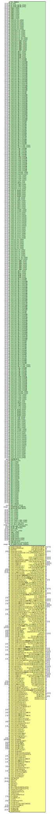

# Entity: hier_bypass_ports

## Diagram

## Description

   Copyright (c) 1995/2018 Xilinx, Inc.
 
    Licensed under the Apache License, Version 2.0 (the "License");
    you may not use this file except in compliance with the License.
    You may obtain a copy of the License at
 
        http://www.apache.org/licenses/LICENSE-2.0
 
    Unless required by applicable law or agreed to in writing, software
    distributed under the License is distributed on an "AS IS" BASIS,
    WITHOUT WARRANTIES OR CONDITIONS OF ANY KIND, either express or implied.
    See the License for the specific language governing permissions and
    limitations under the License.
   ____  ____
  /   /\/   /
 /___/  \  /     Vendor      : Xilinx
 \   \   \/      Version     : 2019.1
  \   \          Description : Xilinx Unified Simulation Library Component
  /   /                        GTM_DUAL
 /___/   /\      Filename    : GTM_DUAL.v
 \   \  /  \
  \___\/\___\
  Revision:
  End Revision:
 
## Generics

| Generic name         | Type    | Value                 | Description |
| -------------------- | ------- | --------------------- | ----------- |
| XIL_TIMING           |         | "UNPLACED"            |             |
| A_CFG                | [15:0]  | 16'b0000100001000000  |             |
| A_SDM_DATA_CFG0      | [15:0]  | 16'b0000000011010000  |             |
| A_SDM_DATA_CFG1      | [15:0]  | 16'b0000000011010000  |             |
| BIAS_CFG0            | [15:0]  | 16'b0000000000000000  |             |
| BIAS_CFG1            | [15:0]  | 16'b0000000000000000  |             |
| BIAS_CFG2            | [15:0]  | 16'b0001000000000000  |             |
| BIAS_CFG3            | [15:0]  | 16'b0000000000000001  |             |
| BIAS_CFG4            | [15:0]  | 16'b0000000000000000  |             |
| BIAS_CFG5            | [15:0]  | 16'b0000000000000000  |             |
| BIAS_CFG6            | [15:0]  | 16'b0000000010000000  |             |
| BIAS_CFG7            | [15:0]  | 16'b0000000000000000  |             |
| CH0_A_CH_CFG0        | [15:0]  | 16'b0000000000000011  |             |
| CH0_A_CH_CFG1        | [15:0]  | 16'b0000000000000000  |             |
| CH0_A_CH_CFG2        | [15:0]  | 16'b0111101111110000  |             |
| CH0_A_CH_CFG3        | [15:0]  | 16'b0000000000000000  |             |
| CH0_A_CH_CFG4        | [15:0]  | 16'b0000000000000000  |             |
| CH0_A_CH_CFG5        | [15:0]  | 16'b0000000000000000  |             |
| CH0_A_CH_CFG6        | [15:0]  | 16'b0000000000000000  |             |
| CH0_RST_LP_CFG0      | [15:0]  | 16'b0001000000010000  |             |
| CH0_RST_LP_CFG1      | [15:0]  | 16'b0011001000010000  |             |
| CH0_RST_LP_CFG2      | [15:0]  | 16'b0110010100000100  |             |
| CH0_RST_LP_CFG3      | [15:0]  | 16'b0011001000010000  |             |
| CH0_RST_LP_CFG4      | [15:0]  | 16'b0000000001000100  |             |
| CH0_RST_LP_ID_CFG0   | [15:0]  | 16'b0011000001110000  |             |
| CH0_RST_LP_ID_CFG1   | [15:0]  | 16'b0001000000010000  |             |
| CH0_RST_TIME_CFG0    | [15:0]  | 16'b0000010000100001  |             |
| CH0_RST_TIME_CFG1    | [15:0]  | 16'b0000010000100001  |             |
| CH0_RST_TIME_CFG2    | [15:0]  | 16'b0000010000100001  |             |
| CH0_RST_TIME_CFG3    | [15:0]  | 16'b0000010000100000  |             |
| CH0_RST_TIME_CFG4    | [15:0]  | 16'b0000010000100001  |             |
| CH0_RST_TIME_CFG5    | [15:0]  | 16'b0000000000000001  |             |
| CH0_RST_TIME_CFG6    | [15:0]  | 16'b0000000000100001  |             |
| CH0_RX_ADC_CFG0      | [15:0]  | 16'b0011010010001111  |             |
| CH0_RX_ADC_CFG1      | [15:0]  | 16'b0011111001010101  |             |
| CH0_RX_ANA_CFG0      | [15:0]  | 16'b1000000000011101  |             |
| CH0_RX_ANA_CFG1      | [15:0]  | 16'b1110100010000000  |             |
| CH0_RX_ANA_CFG2      | [15:0]  | 16'b0000000010001010  |             |
| CH0_RX_APT_CFG0A     | [15:0]  | 16'b0000000001110000  |             |
| CH0_RX_APT_CFG0B     | [15:0]  | 16'b0000000001110000  |             |
| CH0_RX_APT_CFG10A    | [15:0]  | 16'b0000000001110000  |             |
| CH0_RX_APT_CFG10B    | [15:0]  | 16'b0000000001010000  |             |
| CH0_RX_APT_CFG11A    | [15:0]  | 16'b0000000001000000  |             |
| CH0_RX_APT_CFG11B    | [15:0]  | 16'b0000000001110000  |             |
| CH0_RX_APT_CFG12A    | [15:0]  | 16'b0000000001010000  |             |
| CH0_RX_APT_CFG12B    | [15:0]  | 16'b0000000000000000  |             |
| CH0_RX_APT_CFG13A    | [15:0]  | 16'b0000000000000000  |             |
| CH0_RX_APT_CFG13B    | [15:0]  | 16'b0000000000000000  |             |
| CH0_RX_APT_CFG14A    | [15:0]  | 16'b0000000000000000  |             |
| CH0_RX_APT_CFG14B    | [15:0]  | 16'b0000000000000000  |             |
| CH0_RX_APT_CFG15A    | [15:0]  | 16'b0000000000000000  |             |
| CH0_RX_APT_CFG15B    | [15:0]  | 16'b0000100000000000  |             |
| CH0_RX_APT_CFG16A    | [15:0]  | 16'b0000000000000000  |             |
| CH0_RX_APT_CFG16B    | [15:0]  | 16'b0010000000000000  |             |
| CH0_RX_APT_CFG17A    | [15:0]  | 16'b0000000000000000  |             |
| CH0_RX_APT_CFG17B    | [15:0]  | 16'b0001000001000000  |             |
| CH0_RX_APT_CFG18A    | [15:0]  | 16'b0000100000100000  |             |
| CH0_RX_APT_CFG18B    | [15:0]  | 16'b0000000000000000  |             |
| CH0_RX_APT_CFG19A    | [15:0]  | 16'b0000000000000000  |             |
| CH0_RX_APT_CFG19B    | [15:0]  | 16'b0000100000000000  |             |
| CH0_RX_APT_CFG1A     | [15:0]  | 16'b0000000001110000  |             |
| CH0_RX_APT_CFG1B     | [15:0]  | 16'b0000000001110000  |             |
| CH0_RX_APT_CFG20A    | [15:0]  | 16'b1110000000100000  |             |
| CH0_RX_APT_CFG20B    | [15:0]  | 16'b0000000001000000  |             |
| CH0_RX_APT_CFG21A    | [15:0]  | 16'b0001000000000100  |             |
| CH0_RX_APT_CFG21B    | [15:0]  | 16'b0000000000000000  |             |
| CH0_RX_APT_CFG22A    | [15:0]  | 16'b0000000001110000  |             |
| CH0_RX_APT_CFG22B    | [15:0]  | 16'b0000000001110000  |             |
| CH0_RX_APT_CFG23A    | [15:0]  | 16'b0000100000000000  |             |
| CH0_RX_APT_CFG23B    | [15:0]  | 16'b0000000000000000  |             |
| CH0_RX_APT_CFG24A    | [15:0]  | 16'b0000000000000000  |             |
| CH0_RX_APT_CFG24B    | [15:0]  | 16'b0000000000000000  |             |
| CH0_RX_APT_CFG25A    | [15:0]  | 16'b0000000000000000  |             |
| CH0_RX_APT_CFG25B    | [15:0]  | 16'b0000000000000000  |             |
| CH0_RX_APT_CFG26A    | [15:0]  | 16'b0000000000000000  |             |
| CH0_RX_APT_CFG26B    | [15:0]  | 16'b0000000000000000  |             |
| CH0_RX_APT_CFG27A    | [15:0]  | 16'b0100000000000000  |             |
| CH0_RX_APT_CFG27B    | [15:0]  | 16'b0000000000000000  |             |
| CH0_RX_APT_CFG28A    | [15:0]  | 16'b0000000000000000  |             |
| CH0_RX_APT_CFG28B    | [15:0]  | 16'b1000000000000000  |             |
| CH0_RX_APT_CFG2A     | [15:0]  | 16'b0000000001110000  |             |
| CH0_RX_APT_CFG2B     | [15:0]  | 16'b0000000001110000  |             |
| CH0_RX_APT_CFG3A     | [15:0]  | 16'b0000000001110000  |             |
| CH0_RX_APT_CFG3B     | [15:0]  | 16'b0000000001110000  |             |
| CH0_RX_APT_CFG4A     | [15:0]  | 16'b0000000001110000  |             |
| CH0_RX_APT_CFG4B     | [15:0]  | 16'b0000000001110000  |             |
| CH0_RX_APT_CFG5A     | [15:0]  | 16'b0000000001110000  |             |
| CH0_RX_APT_CFG5B     | [15:0]  | 16'b0000000001110000  |             |
| CH0_RX_APT_CFG6A     | [15:0]  | 16'b0000000001110000  |             |
| CH0_RX_APT_CFG6B     | [15:0]  | 16'b0000000001110000  |             |
| CH0_RX_APT_CFG7A     | [15:0]  | 16'b0000000001110000  |             |
| CH0_RX_APT_CFG7B     | [15:0]  | 16'b0000000001110000  |             |
| CH0_RX_APT_CFG8A     | [15:0]  | 16'b0000100000000000  |             |
| CH0_RX_APT_CFG8B     | [15:0]  | 16'b0000100000000000  |             |
| CH0_RX_APT_CFG9A     | [15:0]  | 16'b0000000001110000  |             |
| CH0_RX_APT_CFG9B     | [15:0]  | 16'b0000000001110000  |             |
| CH0_RX_APT_CTRL_CFG2 | [15:0]  | 16'b0000000000000100  |             |
| CH0_RX_APT_CTRL_CFG3 | [15:0]  | 16'b0000000000000000  |             |
| CH0_RX_CAL_CFG0A     | [15:0]  | 16'b0000000000000000  |             |
| CH0_RX_CAL_CFG0B     | [15:0]  | 16'b0011001100110000  |             |
| CH0_RX_CAL_CFG1A     | [15:0]  | 16'b1110111011100001  |             |
| CH0_RX_CAL_CFG1B     | [15:0]  | 16'b1111111100000100  |             |
| CH0_RX_CAL_CFG2A     | [15:0]  | 16'b0000000000000000  |             |
| CH0_RX_CAL_CFG2B     | [15:0]  | 16'b0011000000000000  |             |
| CH0_RX_CDR_CFG0A     | [15:0]  | 16'b0000000000000011  |             |
| CH0_RX_CDR_CFG0B     | [15:0]  | 16'b0000000000000000  |             |
| CH0_RX_CDR_CFG1A     | [15:0]  | 16'b0000000000000000  |             |
| CH0_RX_CDR_CFG1B     | [15:0]  | 16'b0000000000000000  |             |
| CH0_RX_CDR_CFG2A     | [15:0]  | 16'b1001000101100100  |             |
| CH0_RX_CDR_CFG2B     | [15:0]  | 16'b0000000100100100  |             |
| CH0_RX_CDR_CFG3A     | [15:0]  | 16'b0101110011110110  |             |
| CH0_RX_CDR_CFG3B     | [15:0]  | 16'b0000000000001011  |             |
| CH0_RX_CDR_CFG4A     | [15:0]  | 16'b0000000000000110  |             |
| CH0_RX_CDR_CFG4B     | [15:0]  | 16'b0000000000000000  |             |
| CH0_RX_CLKGN_CFG0    | [15:0]  | 16'b1100000000000000  |             |
| CH0_RX_CLKGN_CFG1    | [15:0]  | 16'b0000000110000000  |             |
| CH0_RX_CTLE_CFG0     | [15:0]  | 16'b0011010010001000  |             |
| CH0_RX_CTLE_CFG1     | [15:0]  | 16'b0010000000100010  |             |
| CH0_RX_CTLE_CFG2     | [15:0]  | 16'b0000101000000000  |             |
| CH0_RX_CTLE_CFG3     | [15:0]  | 16'b1111001001000000  |             |
| CH0_RX_DSP_CFG       | [15:0]  | 16'b0000000000000000  |             |
| CH0_RX_MON_CFG       | [15:0]  | 16'b0000000000000000  |             |
| CH0_RX_PAD_CFG0      | [15:0]  | 16'b0001111000000000  |             |
| CH0_RX_PAD_CFG1      | [15:0]  | 16'b0001100000001010  |             |
| CH0_RX_PCS_CFG0      | [15:0]  | 16'b0000000100000000  |             |
| CH0_RX_PCS_CFG1      | [15:0]  | 16'b0000000000000000  |             |
| CH0_TX_ANA_CFG0      | [15:0]  | 16'b0000001010101111  |             |
| CH0_TX_ANA_CFG1      | [15:0]  | 16'b0000000100000000  |             |
| CH0_TX_ANA_CFG2      | [15:0]  | 16'b1000000000010100  |             |
| CH0_TX_ANA_CFG3      | [15:0]  | 16'b0000101000100010  |             |
| CH0_TX_ANA_CFG4      | [15:0]  | 16'b0000000000000000  |             |
| CH0_TX_CAL_CFG0      | [15:0]  | 16'b0000000000100000  |             |
| CH0_TX_CAL_CFG1      | [15:0]  | 16'b0000000001000000  |             |
| CH0_TX_DRV_CFG0      | [15:0]  | 16'b0000000000000000  |             |
| CH0_TX_DRV_CFG1      | [15:0]  | 16'b0000000000100111  |             |
| CH0_TX_DRV_CFG2      | [15:0]  | 16'b0000000000000000  |             |
| CH0_TX_DRV_CFG3      | [15:0]  | 16'b0110110000000000  |             |
| CH0_TX_DRV_CFG4      | [15:0]  | 16'b0000000011000101  |             |
| CH0_TX_DRV_CFG5      | [15:0]  | 16'b0000000000000000  |             |
| CH0_TX_LPBK_CFG0     | [15:0]  | 16'b0000000000000011  |             |
| CH0_TX_LPBK_CFG1     | [15:0]  | 16'b0000000000000000  |             |
| CH0_TX_PCS_CFG0      | [15:0]  | 16'b0000000101100000  |             |
| CH0_TX_PCS_CFG1      | [15:0]  | 16'b0000000000000000  |             |
| CH0_TX_PCS_CFG10     | [15:0]  | 16'b0000000000000000  |             |
| CH0_TX_PCS_CFG11     | [15:0]  | 16'b0000000000000000  |             |
| CH0_TX_PCS_CFG12     | [15:0]  | 16'b0000000000000000  |             |
| CH0_TX_PCS_CFG13     | [15:0]  | 16'b0000000000000000  |             |
| CH0_TX_PCS_CFG14     | [15:0]  | 16'b0000000000000000  |             |
| CH0_TX_PCS_CFG15     | [15:0]  | 16'b0000000000000000  |             |
| CH0_TX_PCS_CFG16     | [15:0]  | 16'b0000000000000000  |             |
| CH0_TX_PCS_CFG17     | [15:0]  | 16'b0000000000000000  |             |
| CH0_TX_PCS_CFG2      | [15:0]  | 16'b0000000000000000  |             |
| CH0_TX_PCS_CFG3      | [15:0]  | 16'b0000000000000000  |             |
| CH0_TX_PCS_CFG4      | [15:0]  | 16'b0000000000000000  |             |
| CH0_TX_PCS_CFG5      | [15:0]  | 16'b0000000000000000  |             |
| CH0_TX_PCS_CFG6      | [15:0]  | 16'b0000000000000000  |             |
| CH0_TX_PCS_CFG7      | [15:0]  | 16'b0000000000000000  |             |
| CH0_TX_PCS_CFG8      | [15:0]  | 16'b0000000000000000  |             |
| CH0_TX_PCS_CFG9      | [15:0]  | 16'b0000000000000000  |             |
| CH1_A_CH_CFG0        | [15:0]  | 16'b0000000000000011  |             |
| CH1_A_CH_CFG1        | [15:0]  | 16'b0000000000000000  |             |
| CH1_A_CH_CFG2        | [15:0]  | 16'b0111101111110000  |             |
| CH1_A_CH_CFG3        | [15:0]  | 16'b0000000000000000  |             |
| CH1_A_CH_CFG4        | [15:0]  | 16'b0000000000000000  |             |
| CH1_A_CH_CFG5        | [15:0]  | 16'b0000000000000000  |             |
| CH1_A_CH_CFG6        | [15:0]  | 16'b0000000000000000  |             |
| CH1_RST_LP_CFG0      | [15:0]  | 16'b0001000000010000  |             |
| CH1_RST_LP_CFG1      | [15:0]  | 16'b0011001000010000  |             |
| CH1_RST_LP_CFG2      | [15:0]  | 16'b0110010100000100  |             |
| CH1_RST_LP_CFG3      | [15:0]  | 16'b0011001000010000  |             |
| CH1_RST_LP_CFG4      | [15:0]  | 16'b0000000001000100  |             |
| CH1_RST_LP_ID_CFG0   | [15:0]  | 16'b0011000001110000  |             |
| CH1_RST_LP_ID_CFG1   | [15:0]  | 16'b0001000000010000  |             |
| CH1_RST_TIME_CFG0    | [15:0]  | 16'b0000010000100001  |             |
| CH1_RST_TIME_CFG1    | [15:0]  | 16'b0000010000100001  |             |
| CH1_RST_TIME_CFG2    | [15:0]  | 16'b0000010000100001  |             |
| CH1_RST_TIME_CFG3    | [15:0]  | 16'b0000010000100000  |             |
| CH1_RST_TIME_CFG4    | [15:0]  | 16'b0000010000100001  |             |
| CH1_RST_TIME_CFG5    | [15:0]  | 16'b0000000000000001  |             |
| CH1_RST_TIME_CFG6    | [15:0]  | 16'b0000000000100001  |             |
| CH1_RX_ADC_CFG0      | [15:0]  | 16'b0011010010001111  |             |
| CH1_RX_ADC_CFG1      | [15:0]  | 16'b0011111001010101  |             |
| CH1_RX_ANA_CFG0      | [15:0]  | 16'b1000000000011101  |             |
| CH1_RX_ANA_CFG1      | [15:0]  | 16'b1110100010000000  |             |
| CH1_RX_ANA_CFG2      | [15:0]  | 16'b0000000010001010  |             |
| CH1_RX_APT_CFG0A     | [15:0]  | 16'b0000000001110000  |             |
| CH1_RX_APT_CFG0B     | [15:0]  | 16'b0000000001110000  |             |
| CH1_RX_APT_CFG10A    | [15:0]  | 16'b0000000001110000  |             |
| CH1_RX_APT_CFG10B    | [15:0]  | 16'b0000000001010000  |             |
| CH1_RX_APT_CFG11A    | [15:0]  | 16'b0000000001000000  |             |
| CH1_RX_APT_CFG11B    | [15:0]  | 16'b0000000001110000  |             |
| CH1_RX_APT_CFG12A    | [15:0]  | 16'b0000000001010000  |             |
| CH1_RX_APT_CFG12B    | [15:0]  | 16'b0000000000000000  |             |
| CH1_RX_APT_CFG13A    | [15:0]  | 16'b0000000000000000  |             |
| CH1_RX_APT_CFG13B    | [15:0]  | 16'b0000000000000000  |             |
| CH1_RX_APT_CFG14A    | [15:0]  | 16'b0000000000000000  |             |
| CH1_RX_APT_CFG14B    | [15:0]  | 16'b0000000000000000  |             |
| CH1_RX_APT_CFG15A    | [15:0]  | 16'b0000000000000000  |             |
| CH1_RX_APT_CFG15B    | [15:0]  | 16'b0000100000000000  |             |
| CH1_RX_APT_CFG16A    | [15:0]  | 16'b0000000000000000  |             |
| CH1_RX_APT_CFG16B    | [15:0]  | 16'b0010000000000000  |             |
| CH1_RX_APT_CFG17A    | [15:0]  | 16'b0000000000000000  |             |
| CH1_RX_APT_CFG17B    | [15:0]  | 16'b0001000001000000  |             |
| CH1_RX_APT_CFG18A    | [15:0]  | 16'b0000100000100000  |             |
| CH1_RX_APT_CFG18B    | [15:0]  | 16'b0000100010000000  |             |
| CH1_RX_APT_CFG19A    | [15:0]  | 16'b0000000000000000  |             |
| CH1_RX_APT_CFG19B    | [15:0]  | 16'b0000100000000000  |             |
| CH1_RX_APT_CFG1A     | [15:0]  | 16'b0000000001110000  |             |
| CH1_RX_APT_CFG1B     | [15:0]  | 16'b0000000001110000  |             |
| CH1_RX_APT_CFG20A    | [15:0]  | 16'b1110000000100000  |             |
| CH1_RX_APT_CFG20B    | [15:0]  | 16'b0000000001000000  |             |
| CH1_RX_APT_CFG21A    | [15:0]  | 16'b0001000000000100  |             |
| CH1_RX_APT_CFG21B    | [15:0]  | 16'b0000000000000000  |             |
| CH1_RX_APT_CFG22A    | [15:0]  | 16'b0000000001110000  |             |
| CH1_RX_APT_CFG22B    | [15:0]  | 16'b0000000001110000  |             |
| CH1_RX_APT_CFG23A    | [15:0]  | 16'b0000100000000000  |             |
| CH1_RX_APT_CFG23B    | [15:0]  | 16'b0000100000000000  |             |
| CH1_RX_APT_CFG24A    | [15:0]  | 16'b0000000000000000  |             |
| CH1_RX_APT_CFG24B    | [15:0]  | 16'b0000000000000000  |             |
| CH1_RX_APT_CFG25A    | [15:0]  | 16'b0000000000000000  |             |
| CH1_RX_APT_CFG25B    | [15:0]  | 16'b0000000000000000  |             |
| CH1_RX_APT_CFG26A    | [15:0]  | 16'b0000000000000000  |             |
| CH1_RX_APT_CFG26B    | [15:0]  | 16'b0000000000000000  |             |
| CH1_RX_APT_CFG27A    | [15:0]  | 16'b0100000000000000  |             |
| CH1_RX_APT_CFG27B    | [15:0]  | 16'b0000000000000000  |             |
| CH1_RX_APT_CFG28A    | [15:0]  | 16'b0000000000000000  |             |
| CH1_RX_APT_CFG28B    | [15:0]  | 16'b1000000000000000  |             |
| CH1_RX_APT_CFG2A     | [15:0]  | 16'b0000000001110000  |             |
| CH1_RX_APT_CFG2B     | [15:0]  | 16'b0000000001110000  |             |
| CH1_RX_APT_CFG3A     | [15:0]  | 16'b0000000001110000  |             |
| CH1_RX_APT_CFG3B     | [15:0]  | 16'b0000000001110000  |             |
| CH1_RX_APT_CFG4A     | [15:0]  | 16'b0000000001110000  |             |
| CH1_RX_APT_CFG4B     | [15:0]  | 16'b0000000001110000  |             |
| CH1_RX_APT_CFG5A     | [15:0]  | 16'b0000000001110000  |             |
| CH1_RX_APT_CFG5B     | [15:0]  | 16'b0000000001110000  |             |
| CH1_RX_APT_CFG6A     | [15:0]  | 16'b0000000001110000  |             |
| CH1_RX_APT_CFG6B     | [15:0]  | 16'b0000000001110000  |             |
| CH1_RX_APT_CFG7A     | [15:0]  | 16'b0000000001110000  |             |
| CH1_RX_APT_CFG7B     | [15:0]  | 16'b0000000001110000  |             |
| CH1_RX_APT_CFG8A     | [15:0]  | 16'b0000100000000000  |             |
| CH1_RX_APT_CFG8B     | [15:0]  | 16'b0000100000000000  |             |
| CH1_RX_APT_CFG9A     | [15:0]  | 16'b0000000001110000  |             |
| CH1_RX_APT_CFG9B     | [15:0]  | 16'b0000000001110000  |             |
| CH1_RX_APT_CTRL_CFG2 | [15:0]  | 16'b0000000000000100  |             |
| CH1_RX_APT_CTRL_CFG3 | [15:0]  | 16'b0000000000000000  |             |
| CH1_RX_CAL_CFG0A     | [15:0]  | 16'b0000000000000000  |             |
| CH1_RX_CAL_CFG0B     | [15:0]  | 16'b0011001100110000  |             |
| CH1_RX_CAL_CFG1A     | [15:0]  | 16'b1110111011100001  |             |
| CH1_RX_CAL_CFG1B     | [15:0]  | 16'b1111111100000100  |             |
| CH1_RX_CAL_CFG2A     | [15:0]  | 16'b0000000000000000  |             |
| CH1_RX_CAL_CFG2B     | [15:0]  | 16'b0011000000000000  |             |
| CH1_RX_CDR_CFG0A     | [15:0]  | 16'b0000000000000011  |             |
| CH1_RX_CDR_CFG0B     | [15:0]  | 16'b0000000000000000  |             |
| CH1_RX_CDR_CFG1A     | [15:0]  | 16'b0000000000000000  |             |
| CH1_RX_CDR_CFG1B     | [15:0]  | 16'b0000000000000000  |             |
| CH1_RX_CDR_CFG2A     | [15:0]  | 16'b1001000101100100  |             |
| CH1_RX_CDR_CFG2B     | [15:0]  | 16'b0000000100100100  |             |
| CH1_RX_CDR_CFG3A     | [15:0]  | 16'b0101110011110110  |             |
| CH1_RX_CDR_CFG3B     | [15:0]  | 16'b0000000000001011  |             |
| CH1_RX_CDR_CFG4A     | [15:0]  | 16'b0000000000000110  |             |
| CH1_RX_CDR_CFG4B     | [15:0]  | 16'b0000000000000000  |             |
| CH1_RX_CLKGN_CFG0    | [15:0]  | 16'b1100000000000000  |             |
| CH1_RX_CLKGN_CFG1    | [15:0]  | 16'b0000000110000000  |             |
| CH1_RX_CTLE_CFG0     | [15:0]  | 16'b0011010010001000  |             |
| CH1_RX_CTLE_CFG1     | [15:0]  | 16'b0010000000100010  |             |
| CH1_RX_CTLE_CFG2     | [15:0]  | 16'b0000101000000000  |             |
| CH1_RX_CTLE_CFG3     | [15:0]  | 16'b1111001001000000  |             |
| CH1_RX_DSP_CFG       | [15:0]  | 16'b0000000000000000  |             |
| CH1_RX_MON_CFG       | [15:0]  | 16'b0000000000000000  |             |
| CH1_RX_PAD_CFG0      | [15:0]  | 16'b0001111000000000  |             |
| CH1_RX_PAD_CFG1      | [15:0]  | 16'b0001100000001010  |             |
| CH1_RX_PCS_CFG0      | [15:0]  | 16'b0000000100000000  |             |
| CH1_RX_PCS_CFG1      | [15:0]  | 16'b0000000000000000  |             |
| CH1_TX_ANA_CFG0      | [15:0]  | 16'b0000001010101111  |             |
| CH1_TX_ANA_CFG1      | [15:0]  | 16'b0000000100000000  |             |
| CH1_TX_ANA_CFG2      | [15:0]  | 16'b1000000000010100  |             |
| CH1_TX_ANA_CFG3      | [15:0]  | 16'b0000101000100010  |             |
| CH1_TX_ANA_CFG4      | [15:0]  | 16'b0000000000000000  |             |
| CH1_TX_CAL_CFG0      | [15:0]  | 16'b0000000000100000  |             |
| CH1_TX_CAL_CFG1      | [15:0]  | 16'b0000000001000000  |             |
| CH1_TX_DRV_CFG0      | [15:0]  | 16'b0000000000000000  |             |
| CH1_TX_DRV_CFG1      | [15:0]  | 16'b0000000000100111  |             |
| CH1_TX_DRV_CFG2      | [15:0]  | 16'b0000000000000000  |             |
| CH1_TX_DRV_CFG3      | [15:0]  | 16'b0110110000000000  |             |
| CH1_TX_DRV_CFG4      | [15:0]  | 16'b0000000011000101  |             |
| CH1_TX_DRV_CFG5      | [15:0]  | 16'b0000000000000000  |             |
| CH1_TX_LPBK_CFG0     | [15:0]  | 16'b0000000000000011  |             |
| CH1_TX_LPBK_CFG1     | [15:0]  | 16'b0000000000000000  |             |
| CH1_TX_PCS_CFG0      | [15:0]  | 16'b0000000101100000  |             |
| CH1_TX_PCS_CFG1      | [15:0]  | 16'b0000000000000000  |             |
| CH1_TX_PCS_CFG10     | [15:0]  | 16'b0000000000000000  |             |
| CH1_TX_PCS_CFG11     | [15:0]  | 16'b0000000000000000  |             |
| CH1_TX_PCS_CFG12     | [15:0]  | 16'b0000000000000000  |             |
| CH1_TX_PCS_CFG13     | [15:0]  | 16'b0000000000000000  |             |
| CH1_TX_PCS_CFG14     | [15:0]  | 16'b0000000000000000  |             |
| CH1_TX_PCS_CFG15     | [15:0]  | 16'b0000000000000000  |             |
| CH1_TX_PCS_CFG16     | [15:0]  | 16'b0000000000000000  |             |
| CH1_TX_PCS_CFG17     | [15:0]  | 16'b0000000000000000  |             |
| CH1_TX_PCS_CFG2      | [15:0]  | 16'b0000000000000000  |             |
| CH1_TX_PCS_CFG3      | [15:0]  | 16'b0000000000000000  |             |
| CH1_TX_PCS_CFG4      | [15:0]  | 16'b0000000000000000  |             |
| CH1_TX_PCS_CFG5      | [15:0]  | 16'b0000000000000000  |             |
| CH1_TX_PCS_CFG6      | [15:0]  | 16'b0000000000000000  |             |
| CH1_TX_PCS_CFG7      | [15:0]  | 16'b0000000000000000  |             |
| CH1_TX_PCS_CFG8      | [15:0]  | 16'b0000000000000000  |             |
| CH1_TX_PCS_CFG9      | [15:0]  | 16'b0000000000000000  |             |
| DATARATE             | real    | 10.000                |             |
| DRPEN_CFG            | [15:0]  | 16'b0000000000000000  |             |
| FEC_CFG0             | [15:0]  | 16'b0000000000000000  |             |
| FEC_CFG1             | [15:0]  | 16'b0000000000000000  |             |
| FEC_CFG10            | [15:0]  | 16'b0000000000000000  |             |
| FEC_CFG11            | [15:0]  | 16'b0000000000000000  |             |
| FEC_CFG12            | [15:0]  | 16'b0000000000000000  |             |
| FEC_CFG13            | [15:0]  | 16'b0000000000000000  |             |
| FEC_CFG14            | [15:0]  | 16'b0000000000000000  |             |
| FEC_CFG15            | [15:0]  | 16'b0000000000000000  |             |
| FEC_CFG16            | [15:0]  | 16'b0000000000000000  |             |
| FEC_CFG17            | [15:0]  | 16'b0000000000000000  |             |
| FEC_CFG18            | [15:0]  | 16'b0000000000000000  |             |
| FEC_CFG19            | [15:0]  | 16'b0000000000000000  |             |
| FEC_CFG2             | [15:0]  | 16'b0000000000000000  |             |
| FEC_CFG20            | [15:0]  | 16'b0000000000000000  |             |
| FEC_CFG21            | [15:0]  | 16'b0000000000000000  |             |
| FEC_CFG22            | [15:0]  | 16'b0000000000000000  |             |
| FEC_CFG23            | [15:0]  | 16'b0000000000000000  |             |
| FEC_CFG24            | [15:0]  | 16'b0000000000000000  |             |
| FEC_CFG25            | [15:0]  | 16'b0000000000000000  |             |
| FEC_CFG26            | [15:0]  | 16'b0000000000000000  |             |
| FEC_CFG27            | [15:0]  | 16'b0000000000000000  |             |
| FEC_CFG3             | [15:0]  | 16'b0000000000000000  |             |
| FEC_CFG4             | [15:0]  | 16'b0000000000000000  |             |
| FEC_CFG5             | [15:0]  | 16'b0000000000000000  |             |
| FEC_CFG6             | [15:0]  | 16'b0000000000000000  |             |
| FEC_CFG7             | [15:0]  | 16'b0000000000000000  |             |
| FEC_CFG8             | [15:0]  | 16'b0000000000000000  |             |
| FEC_CFG9             | [15:0]  | 16'b0000000000000000  |             |
| FEC_MODE             |         | "BYPASS"              |             |
| INS_LOSS_NYQ         | real    | 20.000                |             |
| INTERFACE_WIDTH      | integer | 64                    |             |
| MODULATION_MODE      |         | "NRZ"                 |             |
| PLL_CFG0             | [15:0]  | 16'b0001100111110000  |             |
| PLL_CFG1             | [15:0]  | 16'b0000111101110000  |             |
| PLL_CFG2             | [15:0]  | 16'b1000000111101000  |             |
| PLL_CFG3             | [15:0]  | 16'b0100000000000000  |             |
| PLL_CFG4             | [15:0]  | 16'b0111111111101010  |             |
| PLL_CFG5             | [15:0]  | 16'b0100101100111000  |             |
| PLL_CFG6             | [15:0]  | 16'b0000000000100101  |             |
| PLL_CRS_CTRL_CFG0    | [15:0]  | 16'b0000101100100000  |             |
| PLL_CRS_CTRL_CFG1    | [15:0]  | 16'b1100010111010100  |             |
| PLL_IPS_PIN_EN       | [0:0]   | 1'b1                  |             |
| PLL_IPS_REFCLK_SEL   | integer | 0                     |             |
| RCALSAP_TESTEN       | [0:0]   | 1'b0                  |             |
| RCAL_APROBE          | [0:0]   | 1'b0                  |             |
| RST_CFG              | [15:0]  | 16'b0000000000000010  |             |
| RST_PLL_CFG0         | [15:0]  | 16'b0111011000010100  |             |
| SAP_CFG0             | [15:0]  | 16'b0000000000000000  |             |
| SDM_CFG0             | [15:0]  | 16'b0001100001000000  |             |
| SDM_CFG1             | [15:0]  | 16'b0000000000000000  |             |
| SDM_CFG2             | [15:0]  | 16'b0000000000000000  |             |
| SDM_SEED_CFG0        | [15:0]  | 16'b0000000000000000  |             |
| SDM_SEED_CFG1        | [15:0]  | 16'b0000000000000000  |             |
| SIM_DEVICE           |         | "ULTRASCALE_PLUS_ES1" |             |
| SIM_RESET_SPEEDUP    |         | "TRUE"                |             |
| TX_AMPLITUDE_SWING   | integer | 250                   |             |
## Ports

| Port name             | Direction | Type    | Description |
| --------------------- | --------- | ------- | ----------- |
| CH0_AXISTDATA         | output    | [27:0]  |             |
| CH0_AXISTLAST         | output    |         |             |
| CH0_AXISTVALID        | output    |         |             |
| CH0_DMONITOROUT       | output    | [31:0]  |             |
| CH0_DMONITOROUTCLK    | output    |         |             |
| CH0_GTMTXN            | output    |         |             |
| CH0_GTMTXP            | output    |         |             |
| CH0_PCSRSVDOUT        | output    | [15:0]  |             |
| CH0_PMARSVDOUT        | output    | [15:0]  |             |
| CH0_RESETEXCEPTION    | output    |         |             |
| CH0_RXBUFSTATUS       | output    | [2:0]   |             |
| CH0_RXDATA            | output    | [255:0] |             |
| CH0_RXDATAFLAGS       | output    | [3:0]   |             |
| CH0_RXDATAISAM        | output    |         |             |
| CH0_RXDATASTART       | output    |         |             |
| CH0_RXOUTCLK          | output    |         |             |
| CH0_RXPMARESETDONE    | output    |         |             |
| CH0_RXPRBSERR         | output    |         |             |
| CH0_RXPRBSLOCKED      | output    |         |             |
| CH0_RXPRGDIVRESETDONE | output    |         |             |
| CH0_RXPROGDIVCLK      | output    |         |             |
| CH0_RXRESETDONE       | output    |         |             |
| CH0_TXBUFSTATUS       | output    | [1:0]   |             |
| CH0_TXOUTCLK          | output    |         |             |
| CH0_TXPMARESETDONE    | output    |         |             |
| CH0_TXPRGDIVRESETDONE | output    |         |             |
| CH0_TXPROGDIVCLK      | output    |         |             |
| CH0_TXRESETDONE       | output    |         |             |
| CH1_AXISTDATA         | output    | [27:0]  |             |
| CH1_AXISTLAST         | output    |         |             |
| CH1_AXISTVALID        | output    |         |             |
| CH1_DMONITOROUT       | output    | [31:0]  |             |
| CH1_DMONITOROUTCLK    | output    |         |             |
| CH1_GTMTXN            | output    |         |             |
| CH1_GTMTXP            | output    |         |             |
| CH1_PCSRSVDOUT        | output    | [15:0]  |             |
| CH1_PMARSVDOUT        | output    | [15:0]  |             |
| CH1_RESETEXCEPTION    | output    |         |             |
| CH1_RXBUFSTATUS       | output    | [2:0]   |             |
| CH1_RXDATA            | output    | [255:0] |             |
| CH1_RXDATAFLAGS       | output    | [3:0]   |             |
| CH1_RXDATAISAM        | output    |         |             |
| CH1_RXDATASTART       | output    |         |             |
| CH1_RXOUTCLK          | output    |         |             |
| CH1_RXPMARESETDONE    | output    |         |             |
| CH1_RXPRBSERR         | output    |         |             |
| CH1_RXPRBSLOCKED      | output    |         |             |
| CH1_RXPRGDIVRESETDONE | output    |         |             |
| CH1_RXPROGDIVCLK      | output    |         |             |
| CH1_RXRESETDONE       | output    |         |             |
| CH1_TXBUFSTATUS       | output    | [1:0]   |             |
| CH1_TXOUTCLK          | output    |         |             |
| CH1_TXPMARESETDONE    | output    |         |             |
| CH1_TXPRGDIVRESETDONE | output    |         |             |
| CH1_TXPROGDIVCLK      | output    |         |             |
| CH1_TXRESETDONE       | output    |         |             |
| CLKTESTSIG2PAD        | output    |         |             |
| DMONITOROUTPLLCLK     | output    |         |             |
| DRPDO                 | output    | [15:0]  |             |
| DRPRDY                | output    |         |             |
| FECRX0ALIGNED         | output    |         |             |
| FECRX0CORRCWINC       | output    |         |             |
| FECRX0CWINC           | output    |         |             |
| FECRX0UNCORRCWINC     | output    |         |             |
| FECRX1ALIGNED         | output    |         |             |
| FECRX1CORRCWINC       | output    |         |             |
| FECRX1CWINC           | output    |         |             |
| FECRX1UNCORRCWINC     | output    |         |             |
| FECRXLN0BITERR0TO1INC | output    | [7:0]   |             |
| FECRXLN0BITERR1TO0INC | output    | [7:0]   |             |
| FECRXLN0DLY           | output    | [14:0]  |             |
| FECRXLN0ERRCNTINC     | output    | [3:0]   |             |
| FECRXLN0MAPPING       | output    | [1:0]   |             |
| FECRXLN1BITERR0TO1INC | output    | [7:0]   |             |
| FECRXLN1BITERR1TO0INC | output    | [7:0]   |             |
| FECRXLN1DLY           | output    | [14:0]  |             |
| FECRXLN1ERRCNTINC     | output    | [3:0]   |             |
| FECRXLN1MAPPING       | output    | [1:0]   |             |
| FECRXLN2BITERR0TO1INC | output    | [7:0]   |             |
| FECRXLN2BITERR1TO0INC | output    | [7:0]   |             |
| FECRXLN2DLY           | output    | [14:0]  |             |
| FECRXLN2ERRCNTINC     | output    | [3:0]   |             |
| FECRXLN2MAPPING       | output    | [1:0]   |             |
| FECRXLN3BITERR0TO1INC | output    | [7:0]   |             |
| FECRXLN3BITERR1TO0INC | output    | [7:0]   |             |
| FECRXLN3DLY           | output    | [14:0]  |             |
| FECRXLN3ERRCNTINC     | output    | [3:0]   |             |
| FECRXLN3MAPPING       | output    | [1:0]   |             |
| FECTRXLN0LOCK         | output    |         |             |
| FECTRXLN1LOCK         | output    |         |             |
| FECTRXLN2LOCK         | output    |         |             |
| FECTRXLN3LOCK         | output    |         |             |
| GTPOWERGOOD           | output    |         |             |
| PLLFBCLKLOST          | output    |         |             |
| PLLLOCK               | output    |         |             |
| PLLREFCLKLOST         | output    |         |             |
| PLLREFCLKMONITOR      | output    |         |             |
| PLLRESETDONE          | output    |         |             |
| PLLRSVDOUT            | output    | [15:0]  |             |
| RCALCMP               | output    |         |             |
| RCALOUT               | output    | [4:0]   |             |
| RXRECCLK0             | output    |         |             |
| RXRECCLK1             | output    |         |             |
| BGBYPASSB             | input     |         |             |
| BGMONITORENB          | input     |         |             |
| BGPDB                 | input     |         |             |
| BGRCALOVRD            | input     | [4:0]   |             |
| BGRCALOVRDENB         | input     |         |             |
| CH0_AXISEN            | input     |         |             |
| CH0_AXISRST           | input     |         |             |
| CH0_AXISTRDY          | input     |         |             |
| CH0_CFGRESET          | input     |         |             |
| CH0_DMONFIFORESET     | input     |         |             |
| CH0_DMONITORCLK       | input     |         |             |
| CH0_GTMRXN            | input     |         |             |
| CH0_GTMRXP            | input     |         |             |
| CH0_GTRXRESET         | input     |         |             |
| CH0_GTTXRESET         | input     |         |             |
| CH0_LOOPBACK          | input     | [2:0]   |             |
| CH0_PCSRSVDIN         | input     | [15:0]  |             |
| CH0_PMARSVDIN         | input     | [15:0]  |             |
| CH0_RESETOVRD         | input     |         |             |
| CH0_RXADAPTRESET      | input     |         |             |
| CH0_RXADCCALRESET     | input     |         |             |
| CH0_RXADCCLKGENRESET  | input     |         |             |
| CH0_RXBUFRESET        | input     |         |             |
| CH0_RXCDRFREQOS       | input     |         |             |
| CH0_RXCDRFRRESET      | input     |         |             |
| CH0_RXCDRHOLD         | input     |         |             |
| CH0_RXCDRINCPCTRL     | input     |         |             |
| CH0_RXCDROVRDEN       | input     |         |             |
| CH0_RXCDRPHRESET      | input     |         |             |
| CH0_RXDFERESET        | input     |         |             |
| CH0_RXDSPRESET        | input     |         |             |
| CH0_RXEQTRAINING      | input     |         |             |
| CH0_RXEYESCANRESET    | input     |         |             |
| CH0_RXFECRESET        | input     |         |             |
| CH0_RXOUTCLKSEL       | input     | [2:0]   |             |
| CH0_RXPCSRESET        | input     |         |             |
| CH0_RXPCSRESETMASK    | input     | [3:0]   |             |
| CH0_RXPMARESET        | input     |         |             |
| CH0_RXPMARESETMASK    | input     | [7:0]   |             |
| CH0_RXPOLARITY        | input     |         |             |
| CH0_RXPRBSCNTSTOP     | input     |         |             |
| CH0_RXPRBSCSCNTRST    | input     |         |             |
| CH0_RXPRBSPTN         | input     | [3:0]   |             |
| CH0_RXPROGDIVRESET    | input     |         |             |
| CH0_RXQPRBSEN         | input     |         |             |
| CH0_RXRESETMODE       | input     | [1:0]   |             |
| CH0_RXSPCSEQADV       | input     |         |             |
| CH0_RXUSRCLK          | input     |         |             |
| CH0_RXUSRCLK2         | input     |         |             |
| CH0_RXUSRRDY          | input     |         |             |
| CH0_RXUSRSTART        | input     |         |             |
| CH0_RXUSRSTOP         | input     |         |             |
| CH0_TXCKALRESET       | input     |         |             |
| CH0_TXCTLFIRDAT       | input     | [5:0]   |             |
| CH0_TXDATA            | input     | [255:0] |             |
| CH0_TXDATASTART       | input     |         |             |
| CH0_TXDRVAMP          | input     | [4:0]   |             |
| CH0_TXEMPMAIN         | input     | [5:0]   |             |
| CH0_TXEMPPOST         | input     | [4:0]   |             |
| CH0_TXEMPPRE          | input     | [4:0]   |             |
| CH0_TXEMPPRE2         | input     | [3:0]   |             |
| CH0_TXFECRESET        | input     |         |             |
| CH0_TXINHIBIT         | input     |         |             |
| CH0_TXMUXDCDEXHOLD    | input     |         |             |
| CH0_TXMUXDCDORWREN    | input     |         |             |
| CH0_TXOUTCLKSEL       | input     | [2:0]   |             |
| CH0_TXPCSRESET        | input     |         |             |
| CH0_TXPCSRESETMASK    | input     | [1:0]   |             |
| CH0_TXPMARESET        | input     |         |             |
| CH0_TXPMARESETMASK    | input     | [1:0]   |             |
| CH0_TXPOLARITY        | input     |         |             |
| CH0_TXPRBSINERR       | input     |         |             |
| CH0_TXPRBSPTN         | input     | [3:0]   |             |
| CH0_TXPROGDIVRESET    | input     |         |             |
| CH0_TXQPRBSEN         | input     |         |             |
| CH0_TXRESETMODE       | input     | [1:0]   |             |
| CH0_TXSPCSEQADV       | input     |         |             |
| CH0_TXUSRCLK          | input     |         |             |
| CH0_TXUSRCLK2         | input     |         |             |
| CH0_TXUSRRDY          | input     |         |             |
| CH1_AXISEN            | input     |         |             |
| CH1_AXISRST           | input     |         |             |
| CH1_AXISTRDY          | input     |         |             |
| CH1_CFGRESET          | input     |         |             |
| CH1_DMONFIFORESET     | input     |         |             |
| CH1_DMONITORCLK       | input     |         |             |
| CH1_GTMRXN            | input     |         |             |
| CH1_GTMRXP            | input     |         |             |
| CH1_GTRXRESET         | input     |         |             |
| CH1_GTTXRESET         | input     |         |             |
| CH1_LOOPBACK          | input     | [2:0]   |             |
| CH1_PCSRSVDIN         | input     | [15:0]  |             |
| CH1_PMARSVDIN         | input     | [15:0]  |             |
| CH1_RESETOVRD         | input     |         |             |
| CH1_RXADAPTRESET      | input     |         |             |
| CH1_RXADCCALRESET     | input     |         |             |
| CH1_RXADCCLKGENRESET  | input     |         |             |
| CH1_RXBUFRESET        | input     |         |             |
| CH1_RXCDRFREQOS       | input     |         |             |
| CH1_RXCDRFRRESET      | input     |         |             |
| CH1_RXCDRHOLD         | input     |         |             |
| CH1_RXCDRINCPCTRL     | input     |         |             |
| CH1_RXCDROVRDEN       | input     |         |             |
| CH1_RXCDRPHRESET      | input     |         |             |
| CH1_RXDFERESET        | input     |         |             |
| CH1_RXDSPRESET        | input     |         |             |
| CH1_RXEQTRAINING      | input     |         |             |
| CH1_RXEYESCANRESET    | input     |         |             |
| CH1_RXFECRESET        | input     |         |             |
| CH1_RXOUTCLKSEL       | input     | [2:0]   |             |
| CH1_RXPCSRESET        | input     |         |             |
| CH1_RXPCSRESETMASK    | input     | [3:0]   |             |
| CH1_RXPMARESET        | input     |         |             |
| CH1_RXPMARESETMASK    | input     | [7:0]   |             |
| CH1_RXPOLARITY        | input     |         |             |
| CH1_RXPRBSCNTSTOP     | input     |         |             |
| CH1_RXPRBSCSCNTRST    | input     |         |             |
| CH1_RXPRBSPTN         | input     | [3:0]   |             |
| CH1_RXPROGDIVRESET    | input     |         |             |
| CH1_RXQPRBSEN         | input     |         |             |
| CH1_RXRESETMODE       | input     | [1:0]   |             |
| CH1_RXSPCSEQADV       | input     |         |             |
| CH1_RXUSRCLK          | input     |         |             |
| CH1_RXUSRCLK2         | input     |         |             |
| CH1_RXUSRRDY          | input     |         |             |
| CH1_RXUSRSTART        | input     |         |             |
| CH1_RXUSRSTOP         | input     |         |             |
| CH1_TXCKALRESET       | input     |         |             |
| CH1_TXCTLFIRDAT       | input     | [5:0]   |             |
| CH1_TXDATA            | input     | [255:0] |             |
| CH1_TXDATASTART       | input     |         |             |
| CH1_TXDRVAMP          | input     | [4:0]   |             |
| CH1_TXEMPMAIN         | input     | [5:0]   |             |
| CH1_TXEMPPOST         | input     | [4:0]   |             |
| CH1_TXEMPPRE          | input     | [4:0]   |             |
| CH1_TXEMPPRE2         | input     | [3:0]   |             |
| CH1_TXFECRESET        | input     |         |             |
| CH1_TXINHIBIT         | input     |         |             |
| CH1_TXMUXDCDEXHOLD    | input     |         |             |
| CH1_TXMUXDCDORWREN    | input     |         |             |
| CH1_TXOUTCLKSEL       | input     | [2:0]   |             |
| CH1_TXPCSRESET        | input     |         |             |
| CH1_TXPCSRESETMASK    | input     | [1:0]   |             |
| CH1_TXPMARESET        | input     |         |             |
| CH1_TXPMARESETMASK    | input     | [1:0]   |             |
| CH1_TXPOLARITY        | input     |         |             |
| CH1_TXPRBSINERR       | input     |         |             |
| CH1_TXPRBSPTN         | input     | [3:0]   |             |
| CH1_TXPROGDIVRESET    | input     |         |             |
| CH1_TXQPRBSEN         | input     |         |             |
| CH1_TXRESETMODE       | input     | [1:0]   |             |
| CH1_TXSPCSEQADV       | input     |         |             |
| CH1_TXUSRCLK          | input     |         |             |
| CH1_TXUSRCLK2         | input     |         |             |
| CH1_TXUSRRDY          | input     |         |             |
| DRPADDR               | input     | [10:0]  |             |
| DRPCLK                | input     |         |             |
| DRPDI                 | input     | [15:0]  |             |
| DRPEN                 | input     |         |             |
| DRPRST                | input     |         |             |
| DRPWE                 | input     |         |             |
| FECCTRLRX0BITSLIPFS   | input     |         |             |
| FECCTRLRX1BITSLIPFS   | input     |         |             |
| GTGREFCLK2PLL         | input     |         |             |
| GTNORTHREFCLK         | input     |         |             |
| GTREFCLK              | input     |         |             |
| GTSOUTHREFCLK         | input     |         |             |
| PLLFBDIV              | input     | [7:0]   |             |
| PLLMONCLK             | input     |         |             |
| PLLPD                 | input     |         |             |
| PLLREFCLKSEL          | input     | [2:0]   |             |
| PLLRESET              | input     |         |             |
| PLLRESETBYPASSMODE    | input     |         |             |
| PLLRESETMASK          | input     | [1:0]   |             |
| PLLRSVDIN             | input     | [15:0]  |             |
| RCALENB               | input     |         |             |
| SDMDATA               | input     | [25:0]  |             |
| SDMTOGGLE             | input     |         |             |
## Signals

| Name                      | Type         | Description |
| ------------------------- | ------------ | ----------- |
| trig_attr                 | reg          |             |
| A_CFG_REG                 | reg [15:0]   |             |
| A_SDM_DATA_CFG0_REG       | reg [15:0]   |             |
| A_SDM_DATA_CFG1_REG       | reg [15:0]   |             |
| BIAS_CFG0_REG             | reg [15:0]   |             |
| BIAS_CFG1_REG             | reg [15:0]   |             |
| BIAS_CFG2_REG             | reg [15:0]   |             |
| BIAS_CFG3_REG             | reg [15:0]   |             |
| BIAS_CFG4_REG             | reg [15:0]   |             |
| BIAS_CFG5_REG             | reg [15:0]   |             |
| BIAS_CFG6_REG             | reg [15:0]   |             |
| BIAS_CFG7_REG             | reg [15:0]   |             |
| CH0_A_CH_CFG0_REG         | reg [15:0]   |             |
| CH0_A_CH_CFG1_REG         | reg [15:0]   |             |
| CH0_A_CH_CFG2_REG         | reg [15:0]   |             |
| CH0_A_CH_CFG3_REG         | reg [15:0]   |             |
| CH0_A_CH_CFG4_REG         | reg [15:0]   |             |
| CH0_A_CH_CFG5_REG         | reg [15:0]   |             |
| CH0_A_CH_CFG6_REG         | reg [15:0]   |             |
| CH0_RST_LP_CFG0_REG       | reg [15:0]   |             |
| CH0_RST_LP_CFG1_REG       | reg [15:0]   |             |
| CH0_RST_LP_CFG2_REG       | reg [15:0]   |             |
| CH0_RST_LP_CFG3_REG       | reg [15:0]   |             |
| CH0_RST_LP_CFG4_REG       | reg [15:0]   |             |
| CH0_RST_LP_ID_CFG0_REG    | reg [15:0]   |             |
| CH0_RST_LP_ID_CFG1_REG    | reg [15:0]   |             |
| CH0_RST_TIME_CFG0_REG     | reg [15:0]   |             |
| CH0_RST_TIME_CFG1_REG     | reg [15:0]   |             |
| CH0_RST_TIME_CFG2_REG     | reg [15:0]   |             |
| CH0_RST_TIME_CFG3_REG     | reg [15:0]   |             |
| CH0_RST_TIME_CFG4_REG     | reg [15:0]   |             |
| CH0_RST_TIME_CFG5_REG     | reg [15:0]   |             |
| CH0_RST_TIME_CFG6_REG     | reg [15:0]   |             |
| CH0_RX_ADC_CFG0_REG       | reg [15:0]   |             |
| CH0_RX_ADC_CFG1_REG       | reg [15:0]   |             |
| CH0_RX_ANA_CFG0_REG       | reg [15:0]   |             |
| CH0_RX_ANA_CFG1_REG       | reg [15:0]   |             |
| CH0_RX_ANA_CFG2_REG       | reg [15:0]   |             |
| CH0_RX_APT_CFG0A_REG      | reg [15:0]   |             |
| CH0_RX_APT_CFG0B_REG      | reg [15:0]   |             |
| CH0_RX_APT_CFG10A_REG     | reg [15:0]   |             |
| CH0_RX_APT_CFG10B_REG     | reg [15:0]   |             |
| CH0_RX_APT_CFG11A_REG     | reg [15:0]   |             |
| CH0_RX_APT_CFG11B_REG     | reg [15:0]   |             |
| CH0_RX_APT_CFG12A_REG     | reg [15:0]   |             |
| CH0_RX_APT_CFG12B_REG     | reg [15:0]   |             |
| CH0_RX_APT_CFG13A_REG     | reg [15:0]   |             |
| CH0_RX_APT_CFG13B_REG     | reg [15:0]   |             |
| CH0_RX_APT_CFG14A_REG     | reg [15:0]   |             |
| CH0_RX_APT_CFG14B_REG     | reg [15:0]   |             |
| CH0_RX_APT_CFG15A_REG     | reg [15:0]   |             |
| CH0_RX_APT_CFG15B_REG     | reg [15:0]   |             |
| CH0_RX_APT_CFG16A_REG     | reg [15:0]   |             |
| CH0_RX_APT_CFG16B_REG     | reg [15:0]   |             |
| CH0_RX_APT_CFG17A_REG     | reg [15:0]   |             |
| CH0_RX_APT_CFG17B_REG     | reg [15:0]   |             |
| CH0_RX_APT_CFG18A_REG     | reg [15:0]   |             |
| CH0_RX_APT_CFG18B_REG     | reg [15:0]   |             |
| CH0_RX_APT_CFG19A_REG     | reg [15:0]   |             |
| CH0_RX_APT_CFG19B_REG     | reg [15:0]   |             |
| CH0_RX_APT_CFG1A_REG      | reg [15:0]   |             |
| CH0_RX_APT_CFG1B_REG      | reg [15:0]   |             |
| CH0_RX_APT_CFG20A_REG     | reg [15:0]   |             |
| CH0_RX_APT_CFG20B_REG     | reg [15:0]   |             |
| CH0_RX_APT_CFG21A_REG     | reg [15:0]   |             |
| CH0_RX_APT_CFG21B_REG     | reg [15:0]   |             |
| CH0_RX_APT_CFG22A_REG     | reg [15:0]   |             |
| CH0_RX_APT_CFG22B_REG     | reg [15:0]   |             |
| CH0_RX_APT_CFG23A_REG     | reg [15:0]   |             |
| CH0_RX_APT_CFG23B_REG     | reg [15:0]   |             |
| CH0_RX_APT_CFG24A_REG     | reg [15:0]   |             |
| CH0_RX_APT_CFG24B_REG     | reg [15:0]   |             |
| CH0_RX_APT_CFG25A_REG     | reg [15:0]   |             |
| CH0_RX_APT_CFG25B_REG     | reg [15:0]   |             |
| CH0_RX_APT_CFG26A_REG     | reg [15:0]   |             |
| CH0_RX_APT_CFG26B_REG     | reg [15:0]   |             |
| CH0_RX_APT_CFG27A_REG     | reg [15:0]   |             |
| CH0_RX_APT_CFG27B_REG     | reg [15:0]   |             |
| CH0_RX_APT_CFG28A_REG     | reg [15:0]   |             |
| CH0_RX_APT_CFG28B_REG     | reg [15:0]   |             |
| CH0_RX_APT_CFG2A_REG      | reg [15:0]   |             |
| CH0_RX_APT_CFG2B_REG      | reg [15:0]   |             |
| CH0_RX_APT_CFG3A_REG      | reg [15:0]   |             |
| CH0_RX_APT_CFG3B_REG      | reg [15:0]   |             |
| CH0_RX_APT_CFG4A_REG      | reg [15:0]   |             |
| CH0_RX_APT_CFG4B_REG      | reg [15:0]   |             |
| CH0_RX_APT_CFG5A_REG      | reg [15:0]   |             |
| CH0_RX_APT_CFG5B_REG      | reg [15:0]   |             |
| CH0_RX_APT_CFG6A_REG      | reg [15:0]   |             |
| CH0_RX_APT_CFG6B_REG      | reg [15:0]   |             |
| CH0_RX_APT_CFG7A_REG      | reg [15:0]   |             |
| CH0_RX_APT_CFG7B_REG      | reg [15:0]   |             |
| CH0_RX_APT_CFG8A_REG      | reg [15:0]   |             |
| CH0_RX_APT_CFG8B_REG      | reg [15:0]   |             |
| CH0_RX_APT_CFG9A_REG      | reg [15:0]   |             |
| CH0_RX_APT_CFG9B_REG      | reg [15:0]   |             |
| CH0_RX_APT_CTRL_CFG2_REG  | reg [15:0]   |             |
| CH0_RX_APT_CTRL_CFG3_REG  | reg [15:0]   |             |
| CH0_RX_CAL_CFG0A_REG      | reg [15:0]   |             |
| CH0_RX_CAL_CFG0B_REG      | reg [15:0]   |             |
| CH0_RX_CAL_CFG1A_REG      | reg [15:0]   |             |
| CH0_RX_CAL_CFG1B_REG      | reg [15:0]   |             |
| CH0_RX_CAL_CFG2A_REG      | reg [15:0]   |             |
| CH0_RX_CAL_CFG2B_REG      | reg [15:0]   |             |
| CH0_RX_CDR_CFG0A_REG      | reg [15:0]   |             |
| CH0_RX_CDR_CFG0B_REG      | reg [15:0]   |             |
| CH0_RX_CDR_CFG1A_REG      | reg [15:0]   |             |
| CH0_RX_CDR_CFG1B_REG      | reg [15:0]   |             |
| CH0_RX_CDR_CFG2A_REG      | reg [15:0]   |             |
| CH0_RX_CDR_CFG2B_REG      | reg [15:0]   |             |
| CH0_RX_CDR_CFG3A_REG      | reg [15:0]   |             |
| CH0_RX_CDR_CFG3B_REG      | reg [15:0]   |             |
| CH0_RX_CDR_CFG4A_REG      | reg [15:0]   |             |
| CH0_RX_CDR_CFG4B_REG      | reg [15:0]   |             |
| CH0_RX_CLKGN_CFG0_REG     | reg [15:0]   |             |
| CH0_RX_CLKGN_CFG1_REG     | reg [15:0]   |             |
| CH0_RX_CTLE_CFG0_REG      | reg [15:0]   |             |
| CH0_RX_CTLE_CFG1_REG      | reg [15:0]   |             |
| CH0_RX_CTLE_CFG2_REG      | reg [15:0]   |             |
| CH0_RX_CTLE_CFG3_REG      | reg [15:0]   |             |
| CH0_RX_DSP_CFG_REG        | reg [15:0]   |             |
| CH0_RX_MON_CFG_REG        | reg [15:0]   |             |
| CH0_RX_PAD_CFG0_REG       | reg [15:0]   |             |
| CH0_RX_PAD_CFG1_REG       | reg [15:0]   |             |
| CH0_RX_PCS_CFG0_REG       | reg [15:0]   |             |
| CH0_RX_PCS_CFG1_REG       | reg [15:0]   |             |
| CH0_TX_ANA_CFG0_REG       | reg [15:0]   |             |
| CH0_TX_ANA_CFG1_REG       | reg [15:0]   |             |
| CH0_TX_ANA_CFG2_REG       | reg [15:0]   |             |
| CH0_TX_ANA_CFG3_REG       | reg [15:0]   |             |
| CH0_TX_ANA_CFG4_REG       | reg [15:0]   |             |
| CH0_TX_CAL_CFG0_REG       | reg [15:0]   |             |
| CH0_TX_CAL_CFG1_REG       | reg [15:0]   |             |
| CH0_TX_DRV_CFG0_REG       | reg [15:0]   |             |
| CH0_TX_DRV_CFG1_REG       | reg [15:0]   |             |
| CH0_TX_DRV_CFG2_REG       | reg [15:0]   |             |
| CH0_TX_DRV_CFG3_REG       | reg [15:0]   |             |
| CH0_TX_DRV_CFG4_REG       | reg [15:0]   |             |
| CH0_TX_DRV_CFG5_REG       | reg [15:0]   |             |
| CH0_TX_LPBK_CFG0_REG      | reg [15:0]   |             |
| CH0_TX_LPBK_CFG1_REG      | reg [15:0]   |             |
| CH0_TX_PCS_CFG0_REG       | reg [15:0]   |             |
| CH0_TX_PCS_CFG1_REG       | reg [15:0]   |             |
| CH0_TX_PCS_CFG10_REG      | reg [15:0]   |             |
| CH0_TX_PCS_CFG11_REG      | reg [15:0]   |             |
| CH0_TX_PCS_CFG12_REG      | reg [15:0]   |             |
| CH0_TX_PCS_CFG13_REG      | reg [15:0]   |             |
| CH0_TX_PCS_CFG14_REG      | reg [15:0]   |             |
| CH0_TX_PCS_CFG15_REG      | reg [15:0]   |             |
| CH0_TX_PCS_CFG16_REG      | reg [15:0]   |             |
| CH0_TX_PCS_CFG17_REG      | reg [15:0]   |             |
| CH0_TX_PCS_CFG2_REG       | reg [15:0]   |             |
| CH0_TX_PCS_CFG3_REG       | reg [15:0]   |             |
| CH0_TX_PCS_CFG4_REG       | reg [15:0]   |             |
| CH0_TX_PCS_CFG5_REG       | reg [15:0]   |             |
| CH0_TX_PCS_CFG6_REG       | reg [15:0]   |             |
| CH0_TX_PCS_CFG7_REG       | reg [15:0]   |             |
| CH0_TX_PCS_CFG8_REG       | reg [15:0]   |             |
| CH0_TX_PCS_CFG9_REG       | reg [15:0]   |             |
| CH1_A_CH_CFG0_REG         | reg [15:0]   |             |
| CH1_A_CH_CFG1_REG         | reg [15:0]   |             |
| CH1_A_CH_CFG2_REG         | reg [15:0]   |             |
| CH1_A_CH_CFG3_REG         | reg [15:0]   |             |
| CH1_A_CH_CFG4_REG         | reg [15:0]   |             |
| CH1_A_CH_CFG5_REG         | reg [15:0]   |             |
| CH1_A_CH_CFG6_REG         | reg [15:0]   |             |
| CH1_RST_LP_CFG0_REG       | reg [15:0]   |             |
| CH1_RST_LP_CFG1_REG       | reg [15:0]   |             |
| CH1_RST_LP_CFG2_REG       | reg [15:0]   |             |
| CH1_RST_LP_CFG3_REG       | reg [15:0]   |             |
| CH1_RST_LP_CFG4_REG       | reg [15:0]   |             |
| CH1_RST_LP_ID_CFG0_REG    | reg [15:0]   |             |
| CH1_RST_LP_ID_CFG1_REG    | reg [15:0]   |             |
| CH1_RST_TIME_CFG0_REG     | reg [15:0]   |             |
| CH1_RST_TIME_CFG1_REG     | reg [15:0]   |             |
| CH1_RST_TIME_CFG2_REG     | reg [15:0]   |             |
| CH1_RST_TIME_CFG3_REG     | reg [15:0]   |             |
| CH1_RST_TIME_CFG4_REG     | reg [15:0]   |             |
| CH1_RST_TIME_CFG5_REG     | reg [15:0]   |             |
| CH1_RST_TIME_CFG6_REG     | reg [15:0]   |             |
| CH1_RX_ADC_CFG0_REG       | reg [15:0]   |             |
| CH1_RX_ADC_CFG1_REG       | reg [15:0]   |             |
| CH1_RX_ANA_CFG0_REG       | reg [15:0]   |             |
| CH1_RX_ANA_CFG1_REG       | reg [15:0]   |             |
| CH1_RX_ANA_CFG2_REG       | reg [15:0]   |             |
| CH1_RX_APT_CFG0A_REG      | reg [15:0]   |             |
| CH1_RX_APT_CFG0B_REG      | reg [15:0]   |             |
| CH1_RX_APT_CFG10A_REG     | reg [15:0]   |             |
| CH1_RX_APT_CFG10B_REG     | reg [15:0]   |             |
| CH1_RX_APT_CFG11A_REG     | reg [15:0]   |             |
| CH1_RX_APT_CFG11B_REG     | reg [15:0]   |             |
| CH1_RX_APT_CFG12A_REG     | reg [15:0]   |             |
| CH1_RX_APT_CFG12B_REG     | reg [15:0]   |             |
| CH1_RX_APT_CFG13A_REG     | reg [15:0]   |             |
| CH1_RX_APT_CFG13B_REG     | reg [15:0]   |             |
| CH1_RX_APT_CFG14A_REG     | reg [15:0]   |             |
| CH1_RX_APT_CFG14B_REG     | reg [15:0]   |             |
| CH1_RX_APT_CFG15A_REG     | reg [15:0]   |             |
| CH1_RX_APT_CFG15B_REG     | reg [15:0]   |             |
| CH1_RX_APT_CFG16A_REG     | reg [15:0]   |             |
| CH1_RX_APT_CFG16B_REG     | reg [15:0]   |             |
| CH1_RX_APT_CFG17A_REG     | reg [15:0]   |             |
| CH1_RX_APT_CFG17B_REG     | reg [15:0]   |             |
| CH1_RX_APT_CFG18A_REG     | reg [15:0]   |             |
| CH1_RX_APT_CFG18B_REG     | reg [15:0]   |             |
| CH1_RX_APT_CFG19A_REG     | reg [15:0]   |             |
| CH1_RX_APT_CFG19B_REG     | reg [15:0]   |             |
| CH1_RX_APT_CFG1A_REG      | reg [15:0]   |             |
| CH1_RX_APT_CFG1B_REG      | reg [15:0]   |             |
| CH1_RX_APT_CFG20A_REG     | reg [15:0]   |             |
| CH1_RX_APT_CFG20B_REG     | reg [15:0]   |             |
| CH1_RX_APT_CFG21A_REG     | reg [15:0]   |             |
| CH1_RX_APT_CFG21B_REG     | reg [15:0]   |             |
| CH1_RX_APT_CFG22A_REG     | reg [15:0]   |             |
| CH1_RX_APT_CFG22B_REG     | reg [15:0]   |             |
| CH1_RX_APT_CFG23A_REG     | reg [15:0]   |             |
| CH1_RX_APT_CFG23B_REG     | reg [15:0]   |             |
| CH1_RX_APT_CFG24A_REG     | reg [15:0]   |             |
| CH1_RX_APT_CFG24B_REG     | reg [15:0]   |             |
| CH1_RX_APT_CFG25A_REG     | reg [15:0]   |             |
| CH1_RX_APT_CFG25B_REG     | reg [15:0]   |             |
| CH1_RX_APT_CFG26A_REG     | reg [15:0]   |             |
| CH1_RX_APT_CFG26B_REG     | reg [15:0]   |             |
| CH1_RX_APT_CFG27A_REG     | reg [15:0]   |             |
| CH1_RX_APT_CFG27B_REG     | reg [15:0]   |             |
| CH1_RX_APT_CFG28A_REG     | reg [15:0]   |             |
| CH1_RX_APT_CFG28B_REG     | reg [15:0]   |             |
| CH1_RX_APT_CFG2A_REG      | reg [15:0]   |             |
| CH1_RX_APT_CFG2B_REG      | reg [15:0]   |             |
| CH1_RX_APT_CFG3A_REG      | reg [15:0]   |             |
| CH1_RX_APT_CFG3B_REG      | reg [15:0]   |             |
| CH1_RX_APT_CFG4A_REG      | reg [15:0]   |             |
| CH1_RX_APT_CFG4B_REG      | reg [15:0]   |             |
| CH1_RX_APT_CFG5A_REG      | reg [15:0]   |             |
| CH1_RX_APT_CFG5B_REG      | reg [15:0]   |             |
| CH1_RX_APT_CFG6A_REG      | reg [15:0]   |             |
| CH1_RX_APT_CFG6B_REG      | reg [15:0]   |             |
| CH1_RX_APT_CFG7A_REG      | reg [15:0]   |             |
| CH1_RX_APT_CFG7B_REG      | reg [15:0]   |             |
| CH1_RX_APT_CFG8A_REG      | reg [15:0]   |             |
| CH1_RX_APT_CFG8B_REG      | reg [15:0]   |             |
| CH1_RX_APT_CFG9A_REG      | reg [15:0]   |             |
| CH1_RX_APT_CFG9B_REG      | reg [15:0]   |             |
| CH1_RX_APT_CTRL_CFG2_REG  | reg [15:0]   |             |
| CH1_RX_APT_CTRL_CFG3_REG  | reg [15:0]   |             |
| CH1_RX_CAL_CFG0A_REG      | reg [15:0]   |             |
| CH1_RX_CAL_CFG0B_REG      | reg [15:0]   |             |
| CH1_RX_CAL_CFG1A_REG      | reg [15:0]   |             |
| CH1_RX_CAL_CFG1B_REG      | reg [15:0]   |             |
| CH1_RX_CAL_CFG2A_REG      | reg [15:0]   |             |
| CH1_RX_CAL_CFG2B_REG      | reg [15:0]   |             |
| CH1_RX_CDR_CFG0A_REG      | reg [15:0]   |             |
| CH1_RX_CDR_CFG0B_REG      | reg [15:0]   |             |
| CH1_RX_CDR_CFG1A_REG      | reg [15:0]   |             |
| CH1_RX_CDR_CFG1B_REG      | reg [15:0]   |             |
| CH1_RX_CDR_CFG2A_REG      | reg [15:0]   |             |
| CH1_RX_CDR_CFG2B_REG      | reg [15:0]   |             |
| CH1_RX_CDR_CFG3A_REG      | reg [15:0]   |             |
| CH1_RX_CDR_CFG3B_REG      | reg [15:0]   |             |
| CH1_RX_CDR_CFG4A_REG      | reg [15:0]   |             |
| CH1_RX_CDR_CFG4B_REG      | reg [15:0]   |             |
| CH1_RX_CLKGN_CFG0_REG     | reg [15:0]   |             |
| CH1_RX_CLKGN_CFG1_REG     | reg [15:0]   |             |
| CH1_RX_CTLE_CFG0_REG      | reg [15:0]   |             |
| CH1_RX_CTLE_CFG1_REG      | reg [15:0]   |             |
| CH1_RX_CTLE_CFG2_REG      | reg [15:0]   |             |
| CH1_RX_CTLE_CFG3_REG      | reg [15:0]   |             |
| CH1_RX_DSP_CFG_REG        | reg [15:0]   |             |
| CH1_RX_MON_CFG_REG        | reg [15:0]   |             |
| CH1_RX_PAD_CFG0_REG       | reg [15:0]   |             |
| CH1_RX_PAD_CFG1_REG       | reg [15:0]   |             |
| CH1_RX_PCS_CFG0_REG       | reg [15:0]   |             |
| CH1_RX_PCS_CFG1_REG       | reg [15:0]   |             |
| CH1_TX_ANA_CFG0_REG       | reg [15:0]   |             |
| CH1_TX_ANA_CFG1_REG       | reg [15:0]   |             |
| CH1_TX_ANA_CFG2_REG       | reg [15:0]   |             |
| CH1_TX_ANA_CFG3_REG       | reg [15:0]   |             |
| CH1_TX_ANA_CFG4_REG       | reg [15:0]   |             |
| CH1_TX_CAL_CFG0_REG       | reg [15:0]   |             |
| CH1_TX_CAL_CFG1_REG       | reg [15:0]   |             |
| CH1_TX_DRV_CFG0_REG       | reg [15:0]   |             |
| CH1_TX_DRV_CFG1_REG       | reg [15:0]   |             |
| CH1_TX_DRV_CFG2_REG       | reg [15:0]   |             |
| CH1_TX_DRV_CFG3_REG       | reg [15:0]   |             |
| CH1_TX_DRV_CFG4_REG       | reg [15:0]   |             |
| CH1_TX_DRV_CFG5_REG       | reg [15:0]   |             |
| CH1_TX_LPBK_CFG0_REG      | reg [15:0]   |             |
| CH1_TX_LPBK_CFG1_REG      | reg [15:0]   |             |
| CH1_TX_PCS_CFG0_REG       | reg [15:0]   |             |
| CH1_TX_PCS_CFG1_REG       | reg [15:0]   |             |
| CH1_TX_PCS_CFG10_REG      | reg [15:0]   |             |
| CH1_TX_PCS_CFG11_REG      | reg [15:0]   |             |
| CH1_TX_PCS_CFG12_REG      | reg [15:0]   |             |
| CH1_TX_PCS_CFG13_REG      | reg [15:0]   |             |
| CH1_TX_PCS_CFG14_REG      | reg [15:0]   |             |
| CH1_TX_PCS_CFG15_REG      | reg [15:0]   |             |
| CH1_TX_PCS_CFG16_REG      | reg [15:0]   |             |
| CH1_TX_PCS_CFG17_REG      | reg [15:0]   |             |
| CH1_TX_PCS_CFG2_REG       | reg [15:0]   |             |
| CH1_TX_PCS_CFG3_REG       | reg [15:0]   |             |
| CH1_TX_PCS_CFG4_REG       | reg [15:0]   |             |
| CH1_TX_PCS_CFG5_REG       | reg [15:0]   |             |
| CH1_TX_PCS_CFG6_REG       | reg [15:0]   |             |
| CH1_TX_PCS_CFG7_REG       | reg [15:0]   |             |
| CH1_TX_PCS_CFG8_REG       | reg [15:0]   |             |
| CH1_TX_PCS_CFG9_REG       | reg [15:0]   |             |
| DATARATE_REG              | real         |             |
| DRPEN_CFG_REG             | reg [15:0]   |             |
| FEC_CFG0_REG              | reg [15:0]   |             |
| FEC_CFG1_REG              | reg [15:0]   |             |
| FEC_CFG10_REG             | reg [15:0]   |             |
| FEC_CFG11_REG             | reg [15:0]   |             |
| FEC_CFG12_REG             | reg [15:0]   |             |
| FEC_CFG13_REG             | reg [15:0]   |             |
| FEC_CFG14_REG             | reg [15:0]   |             |
| FEC_CFG15_REG             | reg [15:0]   |             |
| FEC_CFG16_REG             | reg [15:0]   |             |
| FEC_CFG17_REG             | reg [15:0]   |             |
| FEC_CFG18_REG             | reg [15:0]   |             |
| FEC_CFG19_REG             | reg [15:0]   |             |
| FEC_CFG2_REG              | reg [15:0]   |             |
| FEC_CFG20_REG             | reg [15:0]   |             |
| FEC_CFG21_REG             | reg [15:0]   |             |
| FEC_CFG22_REG             | reg [15:0]   |             |
| FEC_CFG23_REG             | reg [15:0]   |             |
| FEC_CFG24_REG             | reg [15:0]   |             |
| FEC_CFG25_REG             | reg [15:0]   |             |
| FEC_CFG26_REG             | reg [15:0]   |             |
| FEC_CFG27_REG             | reg [15:0]   |             |
| FEC_CFG3_REG              | reg [15:0]   |             |
| FEC_CFG4_REG              | reg [15:0]   |             |
| FEC_CFG5_REG              | reg [15:0]   |             |
| FEC_CFG6_REG              | reg [15:0]   |             |
| FEC_CFG7_REG              | reg [15:0]   |             |
| FEC_CFG8_REG              | reg [15:0]   |             |
| FEC_CFG9_REG              | reg [15:0]   |             |
| FEC_MODE_REG              | reg [48:1]   |             |
| INS_LOSS_NYQ_REG          | real         |             |
| INTERFACE_WIDTH_REG       | reg [8:0]    |             |
| MODULATION_MODE_REG       | reg [32:1]   |             |
| PLL_CFG0_REG              | reg [15:0]   |             |
| PLL_CFG1_REG              | reg [15:0]   |             |
| PLL_CFG2_REG              | reg [15:0]   |             |
| PLL_CFG3_REG              | reg [15:0]   |             |
| PLL_CFG4_REG              | reg [15:0]   |             |
| PLL_CFG5_REG              | reg [15:0]   |             |
| PLL_CFG6_REG              | reg [15:0]   |             |
| PLL_CRS_CTRL_CFG0_REG     | reg [15:0]   |             |
| PLL_CRS_CTRL_CFG1_REG     | reg [15:0]   |             |
| PLL_IPS_PIN_EN_REG        | reg [0:0]    |             |
| PLL_IPS_REFCLK_SEL_REG    | reg [2:0]    |             |
| RCALSAP_TESTEN_REG        | reg [0:0]    |             |
| RCAL_APROBE_REG           | reg [0:0]    |             |
| RST_CFG_REG               | reg [15:0]   |             |
| RST_PLL_CFG0_REG          | reg [15:0]   |             |
| SAP_CFG0_REG              | reg [15:0]   |             |
| SDM_CFG0_REG              | reg [15:0]   |             |
| SDM_CFG1_REG              | reg [15:0]   |             |
| SDM_CFG2_REG              | reg [15:0]   |             |
| SDM_SEED_CFG0_REG         | reg [15:0]   |             |
| SDM_SEED_CFG1_REG         | reg [15:0]   |             |
| SIM_DEVICE_REG            | reg [152:1]  |             |
| SIM_RESET_SPEEDUP_REG     | reg [40:1]   |             |
| TX_AMPLITUDE_SWING_REG    | reg [10:0]   |             |
| DATARATE_BIN              | wire [63:0]  |             |
| INS_LOSS_NYQ_BIN          | wire [63:0]  |             |
| DATARATE_BIN              | reg [63:0]   |             |
| INS_LOSS_NYQ_BIN          | reg [63:0]   |             |
| glblGSR                   | reg          |             |
| glblGSR                   | tri0         |             |
| CH0_AXISTLAST_out         | wire         |             |
| CH0_AXISTVALID_out        | wire         |             |
| CH0_DMONITOROUTCLK_out    | wire         |             |
| CH0_GTMTXN_out            | wire         |             |
| CH0_GTMTXP_out            | wire         |             |
| CH0_RESETEXCEPTION_out    | wire         |             |
| CH0_RXDATAISAM_out        | wire         |             |
| CH0_RXDATASTART_out       | wire         |             |
| CH0_RXOUTCLK_out          | wire         |             |
| CH0_RXPMARESETDONE_out    | wire         |             |
| CH0_RXPRBSERR_out         | wire         |             |
| CH0_RXPRBSLOCKED_out      | wire         |             |
| CH0_RXPRGDIVRESETDONE_out | wire         |             |
| CH0_RXPROGDIVCLK_out      | wire         |             |
| CH0_RXRESETDONE_out       | wire         |             |
| CH0_TXOUTCLK_out          | wire         |             |
| CH0_TXPMARESETDONE_out    | wire         |             |
| CH0_TXPRGDIVRESETDONE_out | wire         |             |
| CH0_TXPROGDIVCLK_out      | wire         |             |
| CH0_TXRESETDONE_out       | wire         |             |
| CH1_AXISTLAST_out         | wire         |             |
| CH1_AXISTVALID_out        | wire         |             |
| CH1_DMONITOROUTCLK_out    | wire         |             |
| CH1_GTMTXN_out            | wire         |             |
| CH1_GTMTXP_out            | wire         |             |
| CH1_RESETEXCEPTION_out    | wire         |             |
| CH1_RXDATAISAM_out        | wire         |             |
| CH1_RXDATASTART_out       | wire         |             |
| CH1_RXOUTCLK_out          | wire         |             |
| CH1_RXPMARESETDONE_out    | wire         |             |
| CH1_RXPRBSERR_out         | wire         |             |
| CH1_RXPRBSLOCKED_out      | wire         |             |
| CH1_RXPRGDIVRESETDONE_out | wire         |             |
| CH1_RXPROGDIVCLK_out      | wire         |             |
| CH1_RXRESETDONE_out       | wire         |             |
| CH1_TXOUTCLK_out          | wire         |             |
| CH1_TXPMARESETDONE_out    | wire         |             |
| CH1_TXPRGDIVRESETDONE_out | wire         |             |
| CH1_TXPROGDIVCLK_out      | wire         |             |
| CH1_TXRESETDONE_out       | wire         |             |
| CLKTESTSIG2PAD_out        | wire         |             |
| DMONITOROUTPLLCLK_out     | wire         |             |
| DRPRDY_out                | wire         |             |
| FECRX0ALIGNED_out         | wire         |             |
| FECRX0CORRCWINC_out       | wire         |             |
| FECRX0CWINC_out           | wire         |             |
| FECRX0UNCORRCWINC_out     | wire         |             |
| FECRX1ALIGNED_out         | wire         |             |
| FECRX1CORRCWINC_out       | wire         |             |
| FECRX1CWINC_out           | wire         |             |
| FECRX1UNCORRCWINC_out     | wire         |             |
| FECTRXLN0LOCK_out         | wire         |             |
| FECTRXLN1LOCK_out         | wire         |             |
| FECTRXLN2LOCK_out         | wire         |             |
| FECTRXLN3LOCK_out         | wire         |             |
| GTPOWERGOOD_out           | wire         |             |
| PLLFBCLKLOST_out          | wire         |             |
| PLLLOCK_out               | wire         |             |
| PLLREFCLKLOST_out         | wire         |             |
| PLLREFCLKMONITOR_out      | wire         |             |
| PLLRESETDONE_out          | wire         |             |
| RCALCMP_out               | wire         |             |
| REFCLK2BUFG_out           | wire         |             |
| REFCLKPDB_SA_out          | wire         |             |
| RXRECCLK0_out             | wire         |             |
| RXRECCLK1_out             | wire         |             |
| CH0_PCSSCANOUT_out        | wire [14:0]  |             |
| CH1_PCSSCANOUT_out        | wire [14:0]  |             |
| FECRXLN0DLY_out           | wire [14:0]  |             |
| FECRXLN1DLY_out           | wire [14:0]  |             |
| FECRXLN2DLY_out           | wire [14:0]  |             |
| FECRXLN3DLY_out           | wire [14:0]  |             |
| CH0_PCSRSVDOUT_out        | wire [15:0]  |             |
| CH0_PMARSVDOUT_out        | wire [15:0]  |             |
| CH1_PCSRSVDOUT_out        | wire [15:0]  |             |
| CH1_PMARSVDOUT_out        | wire [15:0]  |             |
| DRPDO_out                 | wire [15:0]  |             |
| PLLRSVDOUT_out            | wire [15:0]  |             |
| FECSCANOUT_out            | wire [199:0] |             |
| CH0_TXBUFSTATUS_out       | wire [1:0]   |             |
| CH1_TXBUFSTATUS_out       | wire [1:0]   |             |
| FECRXLN0MAPPING_out       | wire [1:0]   |             |
| FECRXLN1MAPPING_out       | wire [1:0]   |             |
| FECRXLN2MAPPING_out       | wire [1:0]   |             |
| FECRXLN3MAPPING_out       | wire [1:0]   |             |
| CH0_PMASCANOUT_out        | wire [24:0]  |             |
| CH1_PMASCANOUT_out        | wire [24:0]  |             |
| CH0_RXDATA_out            | wire [255:0] |             |
| CH1_RXDATA_out            | wire [255:0] |             |
| CH0_AXISTDATA_out         | wire [27:0]  |             |
| CH1_AXISTDATA_out         | wire [27:0]  |             |
| CH0_RXBUFSTATUS_out       | wire [2:0]   |             |
| CH1_RXBUFSTATUS_out       | wire [2:0]   |             |
| CH0_DMONITOROUT_out       | wire [31:0]  |             |
| CH1_DMONITOROUT_out       | wire [31:0]  |             |
| CH0_RXDATAFLAGS_out       | wire [3:0]   |             |
| CH1_RXDATAFLAGS_out       | wire [3:0]   |             |
| FECRXLN0ERRCNTINC_out     | wire [3:0]   |             |
| FECRXLN1ERRCNTINC_out     | wire [3:0]   |             |
| FECRXLN2ERRCNTINC_out     | wire [3:0]   |             |
| FECRXLN3ERRCNTINC_out     | wire [3:0]   |             |
| RCALOUT_out               | wire [4:0]   |             |
| FECRXLN0BITERR0TO1INC_out | wire [7:0]   |             |
| FECRXLN0BITERR1TO0INC_out | wire [7:0]   |             |
| FECRXLN1BITERR0TO1INC_out | wire [7:0]   |             |
| FECRXLN1BITERR1TO0INC_out | wire [7:0]   |             |
| FECRXLN2BITERR0TO1INC_out | wire [7:0]   |             |
| FECRXLN2BITERR1TO0INC_out | wire [7:0]   |             |
| FECRXLN3BITERR0TO1INC_out | wire [7:0]   |             |
| FECRXLN3BITERR1TO0INC_out | wire [7:0]   |             |
| PLLSCANOUT_out            | wire [7:0]   |             |
| BGBYPASSB_in              | wire         |             |
| BGMONITORENB_in           | wire         |             |
| BGPDB_in                  | wire         |             |
| BGRCALOVRDENB_in          | wire         |             |
| CH0_AXISEN_in             | wire         |             |
| CH0_AXISRST_in            | wire         |             |
| CH0_AXISTRDY_in           | wire         |             |
| CH0_BSRSERIAL_in          | wire         |             |
| CH0_CFGRESET_in           | wire         |             |
| CH0_DMONFIFORESET_in      | wire         |             |
| CH0_DMONITORCLK_in        | wire         |             |
| CH0_GTMRXN_in             | wire         |             |
| CH0_GTMRXP_in             | wire         |             |
| CH0_GTRXRESET_in          | wire         |             |
| CH0_GTTXRESET_in          | wire         |             |
| CH0_PCSSCANENB_in         | wire         |             |
| CH0_PCSSCANMODEB_in       | wire         |             |
| CH0_PCSSCANRSTB_in        | wire         |             |
| CH0_PCSSCANRSTEN_in       | wire         |             |
| CH0_PMASCANENB_in         | wire         |             |
| CH0_PMASCANMODEB_in       | wire         |             |
| CH0_PMASCANRSTEN_in       | wire         |             |
| CH0_RESETOVRD_in          | wire         |             |
| CH0_RXADAPTRESET_in       | wire         |             |
| CH0_RXADCCALRESET_in      | wire         |             |
| CH0_RXADCCLKGENRESET_in   | wire         |             |
| CH0_RXBUFRESET_in         | wire         |             |
| CH0_RXCDRFREQOS_in        | wire         |             |
| CH0_RXCDRFRRESET_in       | wire         |             |
| CH0_RXCDRHOLD_in          | wire         |             |
| CH0_RXCDRINCPCTRL_in      | wire         |             |
| CH0_RXCDROVRDEN_in        | wire         |             |
| CH0_RXCDRPHRESET_in       | wire         |             |
| CH0_RXDFERESET_in         | wire         |             |
| CH0_RXDSPRESET_in         | wire         |             |
| CH0_RXEQTRAINING_in       | wire         |             |
| CH0_RXEYESCANRESET_in     | wire         |             |
| CH0_RXFECRESET_in         | wire         |             |
| CH0_RXPCSRESET_in         | wire         |             |
| CH0_RXPMARESET_in         | wire         |             |
| CH0_RXPOLARITY_in         | wire         |             |
| CH0_RXPRBSCNTSTOP_in      | wire         |             |
| CH0_RXPRBSCSCNTRST_in     | wire         |             |
| CH0_RXPROGDIVRESET_in     | wire         |             |
| CH0_RXQPRBSEN_in          | wire         |             |
| CH0_RXSPCSEQADV_in        | wire         |             |
| CH0_RXUSRCLK2_in          | wire         |             |
| CH0_RXUSRCLK_in           | wire         |             |
| CH0_RXUSRRDY_in           | wire         |             |
| CH0_RXUSRSTART_in         | wire         |             |
| CH0_RXUSRSTOP_in          | wire         |             |
| CH0_TSTCLK0_in            | wire         |             |
| CH0_TSTCLK1_in            | wire         |             |
| CH0_TXCKALRESET_in        | wire         |             |
| CH0_TXDATASTART_in        | wire         |             |
| CH0_TXFECRESET_in         | wire         |             |
| CH0_TXINHIBIT_in          | wire         |             |
| CH0_TXMUXDCDEXHOLD_in     | wire         |             |
| CH0_TXMUXDCDORWREN_in     | wire         |             |
| CH0_TXPCSRESET_in         | wire         |             |
| CH0_TXPMARESET_in         | wire         |             |
| CH0_TXPOLARITY_in         | wire         |             |
| CH0_TXPRBSINERR_in        | wire         |             |
| CH0_TXPROGDIVRESET_in     | wire         |             |
| CH0_TXQPRBSEN_in          | wire         |             |
| CH0_TXSPCSEQADV_in        | wire         |             |
| CH0_TXUSRCLK2_in          | wire         |             |
| CH0_TXUSRCLK_in           | wire         |             |
| CH0_TXUSRRDY_in           | wire         |             |
| CH1_AXISEN_in             | wire         |             |
| CH1_AXISRST_in            | wire         |             |
| CH1_AXISTRDY_in           | wire         |             |
| CH1_BSRSERIAL_in          | wire         |             |
| CH1_CFGRESET_in           | wire         |             |
| CH1_DMONFIFORESET_in      | wire         |             |
| CH1_DMONITORCLK_in        | wire         |             |
| CH1_GTMRXN_in             | wire         |             |
| CH1_GTMRXP_in             | wire         |             |
| CH1_GTRXRESET_in          | wire         |             |
| CH1_GTTXRESET_in          | wire         |             |
| CH1_PCSSCANENB_in         | wire         |             |
| CH1_PCSSCANMODEB_in       | wire         |             |
| CH1_PCSSCANRSTB_in        | wire         |             |
| CH1_PCSSCANRSTEN_in       | wire         |             |
| CH1_PMASCANENB_in         | wire         |             |
| CH1_PMASCANMODEB_in       | wire         |             |
| CH1_PMASCANRSTEN_in       | wire         |             |
| CH1_RESETOVRD_in          | wire         |             |
| CH1_RXADAPTRESET_in       | wire         |             |
| CH1_RXADCCALRESET_in      | wire         |             |
| CH1_RXADCCLKGENRESET_in   | wire         |             |
| CH1_RXBUFRESET_in         | wire         |             |
| CH1_RXCDRFREQOS_in        | wire         |             |
| CH1_RXCDRFRRESET_in       | wire         |             |
| CH1_RXCDRHOLD_in          | wire         |             |
| CH1_RXCDRINCPCTRL_in      | wire         |             |
| CH1_RXCDROVRDEN_in        | wire         |             |
| CH1_RXCDRPHRESET_in       | wire         |             |
| CH1_RXDFERESET_in         | wire         |             |
| CH1_RXDSPRESET_in         | wire         |             |
| CH1_RXEQTRAINING_in       | wire         |             |
| CH1_RXEYESCANRESET_in     | wire         |             |
| CH1_RXFECRESET_in         | wire         |             |
| CH1_RXPCSRESET_in         | wire         |             |
| CH1_RXPMARESET_in         | wire         |             |
| CH1_RXPOLARITY_in         | wire         |             |
| CH1_RXPRBSCNTSTOP_in      | wire         |             |
| CH1_RXPRBSCSCNTRST_in     | wire         |             |
| CH1_RXPROGDIVRESET_in     | wire         |             |
| CH1_RXQPRBSEN_in          | wire         |             |
| CH1_RXSPCSEQADV_in        | wire         |             |
| CH1_RXUSRCLK2_in          | wire         |             |
| CH1_RXUSRCLK_in           | wire         |             |
| CH1_RXUSRRDY_in           | wire         |             |
| CH1_RXUSRSTART_in         | wire         |             |
| CH1_RXUSRSTOP_in          | wire         |             |
| CH1_TSTCLK0_in            | wire         |             |
| CH1_TSTCLK1_in            | wire         |             |
| CH1_TXCKALRESET_in        | wire         |             |
| CH1_TXDATASTART_in        | wire         |             |
| CH1_TXFECRESET_in         | wire         |             |
| CH1_TXINHIBIT_in          | wire         |             |
| CH1_TXMUXDCDEXHOLD_in     | wire         |             |
| CH1_TXMUXDCDORWREN_in     | wire         |             |
| CH1_TXPCSRESET_in         | wire         |             |
| CH1_TXPMARESET_in         | wire         |             |
| CH1_TXPOLARITY_in         | wire         |             |
| CH1_TXPRBSINERR_in        | wire         |             |
| CH1_TXPROGDIVRESET_in     | wire         |             |
| CH1_TXQPRBSEN_in          | wire         |             |
| CH1_TXSPCSEQADV_in        | wire         |             |
| CH1_TXUSRCLK2_in          | wire         |             |
| CH1_TXUSRCLK_in           | wire         |             |
| CH1_TXUSRRDY_in           | wire         |             |
| CLKTESTSIG_in             | wire         |             |
| DRPCLK_in                 | wire         |             |
| DRPEN_in                  | wire         |             |
| DRPRST_in                 | wire         |             |
| DRPWE_in                  | wire         |             |
| FECCTRLRX0BITSLIPFS_in    | wire         |             |
| FECCTRLRX1BITSLIPFS_in    | wire         |             |
| FECSCANCLK_in             | wire         |             |
| FECSCANENB_in             | wire         |             |
| FECSCANMODEB_in           | wire         |             |
| FECSCANRSTB_in            | wire         |             |
| GTGREFCLK2PLL_in          | wire         |             |
| GTNORTHREFCLK_in          | wire         |             |
| GTREFCLKPD_in             | wire         |             |
| GTREFCLK_in               | wire         |             |
| GTSOUTHREFCLK_in          | wire         |             |
| PLLMONCLK_in              | wire         |             |
| PLLPD_in                  | wire         |             |
| PLLRESETBYPASSMODE_in     | wire         |             |
| PLLRESET_in               | wire         |             |
| PLLSCANENB_in             | wire         |             |
| PLLSCANMODEB_in           | wire         |             |
| PLLSCANRSTEN_in           | wire         |             |
| RCALENB_in                | wire         |             |
| REFCLK2HROW_in            | wire         |             |
| SDMTOGGLE_in              | wire         |             |
| DRPADDR_in                | wire [10:0]  |             |
| CH0_PCSSCANIN_in          | wire [14:0]  |             |
| CH1_PCSSCANIN_in          | wire [14:0]  |             |
| CH0_PCSRSVDIN_in          | wire [15:0]  |             |
| CH0_PMARSVDIN_in          | wire [15:0]  |             |
| CH1_PCSRSVDIN_in          | wire [15:0]  |             |
| CH1_PMARSVDIN_in          | wire [15:0]  |             |
| DRPDI_in                  | wire [15:0]  |             |
| PLLRSVDIN_in              | wire [15:0]  |             |
| FECSCANIN_in              | wire [199:0] |             |
| CH0_PCSSCANCLK_in         | wire [1:0]   |             |
| CH0_RXRESETMODE_in        | wire [1:0]   |             |
| CH0_TXPCSRESETMASK_in     | wire [1:0]   |             |
| CH0_TXPMARESETMASK_in     | wire [1:0]   |             |
| CH0_TXRESETMODE_in        | wire [1:0]   |             |
| CH1_PCSSCANCLK_in         | wire [1:0]   |             |
| CH1_RXRESETMODE_in        | wire [1:0]   |             |
| CH1_TXPCSRESETMASK_in     | wire [1:0]   |             |
| CH1_TXPMARESETMASK_in     | wire [1:0]   |             |
| CH1_TXRESETMODE_in        | wire [1:0]   |             |
| PLLRESETMASK_in           | wire [1:0]   |             |
| RCALSEL_in                | wire [1:0]   |             |
| CH0_PMASCANIN_in          | wire [24:0]  |             |
| CH1_PMASCANIN_in          | wire [24:0]  |             |
| CH0_TXDATA_in             | wire [255:0] |             |
| CH1_TXDATA_in             | wire [255:0] |             |
| SDMDATA_in                | wire [25:0]  |             |
| CH0_LOOPBACK_in           | wire [2:0]   |             |
| CH0_RXOUTCLKSEL_in        | wire [2:0]   |             |
| CH0_TXOUTCLKSEL_in        | wire [2:0]   |             |
| CH1_LOOPBACK_in           | wire [2:0]   |             |
| CH1_RXOUTCLKSEL_in        | wire [2:0]   |             |
| CH1_TXOUTCLKSEL_in        | wire [2:0]   |             |
| PLLREFCLKSEL_in           | wire [2:0]   |             |
| CH0_RXPCSRESETMASK_in     | wire [3:0]   |             |
| CH0_RXPRBSPTN_in          | wire [3:0]   |             |
| CH0_TXEMPPRE2_in          | wire [3:0]   |             |
| CH0_TXPRBSPTN_in          | wire [3:0]   |             |
| CH1_RXPCSRESETMASK_in     | wire [3:0]   |             |
| CH1_RXPRBSPTN_in          | wire [3:0]   |             |
| CH1_TXEMPPRE2_in          | wire [3:0]   |             |
| CH1_TXPRBSPTN_in          | wire [3:0]   |             |
| PLLSCANCLK_in             | wire [3:0]   |             |
| BGRCALOVRD_in             | wire [4:0]   |             |
| CH0_TXDRVAMP_in           | wire [4:0]   |             |
| CH0_TXEMPPOST_in          | wire [4:0]   |             |
| CH0_TXEMPPRE_in           | wire [4:0]   |             |
| CH1_TXDRVAMP_in           | wire [4:0]   |             |
| CH1_TXEMPPOST_in          | wire [4:0]   |             |
| CH1_TXEMPPRE_in           | wire [4:0]   |             |
| CH0_TXCTLFIRDAT_in        | wire [5:0]   |             |
| CH0_TXEMPMAIN_in          | wire [5:0]   |             |
| CH1_TXCTLFIRDAT_in        | wire [5:0]   |             |
| CH1_TXEMPMAIN_in          | wire [5:0]   |             |
| CH0_RXPMARESETMASK_in     | wire [7:0]   |             |
| CH1_RXPMARESETMASK_in     | wire [7:0]   |             |
| PLLFBDIV_in               | wire [7:0]   |             |
| PLLSCANIN_in              | wire [7:0]   |             |
| CH0_PMASCANCLK_in         | wire [8:0]   |             |
| CH1_PMASCANCLK_in         | wire [8:0]   |             |
| CH0_AXISEN_delay          | wire         |             |
| CH0_AXISTRDY_delay        | wire         |             |
| CH0_RXEQTRAINING_delay    | wire         |             |
| CH0_RXPOLARITY_delay      | wire         |             |
| CH0_RXPRBSCNTSTOP_delay   | wire         |             |
| CH0_RXQPRBSEN_delay       | wire         |             |
| CH0_RXUSRCLK2_delay       | wire         |             |
| CH0_RXUSRCLK_delay        | wire         |             |
| CH0_TXDATASTART_delay     | wire         |             |
| CH0_TXINHIBIT_delay       | wire         |             |
| CH0_TXPOLARITY_delay      | wire         |             |
| CH0_TXPRBSINERR_delay     | wire         |             |
| CH0_TXQPRBSEN_delay       | wire         |             |
| CH0_TXUSRCLK2_delay       | wire         |             |
| CH0_TXUSRCLK_delay        | wire         |             |
| CH1_AXISEN_delay          | wire         |             |
| CH1_AXISTRDY_delay        | wire         |             |
| CH1_RXEQTRAINING_delay    | wire         |             |
| CH1_RXPOLARITY_delay      | wire         |             |
| CH1_RXPRBSCNTSTOP_delay   | wire         |             |
| CH1_RXQPRBSEN_delay       | wire         |             |
| CH1_RXUSRCLK2_delay       | wire         |             |
| CH1_RXUSRCLK_delay        | wire         |             |
| CH1_TXDATASTART_delay     | wire         |             |
| CH1_TXINHIBIT_delay       | wire         |             |
| CH1_TXPOLARITY_delay      | wire         |             |
| CH1_TXPRBSINERR_delay     | wire         |             |
| CH1_TXQPRBSEN_delay       | wire         |             |
| CH1_TXUSRCLK2_delay       | wire         |             |
| CH1_TXUSRCLK_delay        | wire         |             |
| DRPCLK_delay              | wire         |             |
| DRPEN_delay               | wire         |             |
| DRPWE_delay               | wire         |             |
| FECCTRLRX0BITSLIPFS_delay | wire         |             |
| FECCTRLRX1BITSLIPFS_delay | wire         |             |
| DRPADDR_delay             | wire [10:0]  |             |
| DRPDI_delay               | wire [15:0]  |             |
| CH0_TXDATA_delay          | wire [255:0] |             |
| CH1_TXDATA_delay          | wire [255:0] |             |
| CH0_RXPRBSPTN_delay       | wire [3:0]   |             |
| CH0_TXPRBSPTN_delay       | wire [3:0]   |             |
| CH1_RXPRBSPTN_delay       | wire [3:0]   |             |
| CH1_TXPRBSPTN_delay       | wire [3:0]   |             |
| CH0_GTMTXN_integer        | integer      |             |
| CH0_GTMTXP_integer        | integer      |             |
| CH1_GTMTXN_integer        | integer      |             |
| CH1_GTMTXP_integer        | integer      |             |
| CH0_GTMRXN_integer        | integer      |             |
| CH0_GTMRXP_integer        | integer      |             |
| CH1_GTMRXN_integer        | integer      |             |
| CH1_GTMRXP_integer        | integer      |             |
| attr_test                 | reg          |             |
| attr_err                  | reg          |             |
| notifier                  | reg          |             |
## Constants

| Name        | Type | Value      | Description       |
| ----------- | ---- | ---------- | ----------------- |
| MODULE_NAME |      | "GTM_DUAL" | define constants  |
## Processes
- unnamed: ( @ (trig_attr) )
- unnamed: ( @ (trig_attr) )
- unnamed: (  )
- unnamed: (  )
- unnamed: (  )
- unnamed: (  )
- unnamed: (  )
- unnamed: (  )
- unnamed: (  )
- unnamed: (  )
- unnamed: (  )
- unnamed: (  )
- unnamed: (  )
- unnamed: (  )
- unnamed: (  )
- unnamed: (  )
- unnamed: (  )
- unnamed: (  )
- unnamed: (  )
- unnamed: (  )
- unnamed: (  )
- unnamed: (  )
- unnamed: (  )
- unnamed: (  )
- unnamed: (  )
- unnamed: (  )
- unnamed: (  )
- unnamed: (  )
- unnamed: (  )
- unnamed: (  )
- unnamed: (  )
- unnamed: (  )
- unnamed: (  )
- unnamed: (  )
- unnamed: (  )
- unnamed: (  )
- unnamed: (  )
- unnamed: (  )
- unnamed: (  )
- unnamed: (  )
- unnamed: (  )
- unnamed: (  )
- unnamed: (  )
- unnamed: (  )
- unnamed: (  )
- unnamed: (  )
- unnamed: (  )
- unnamed: (  )
- unnamed: (  )
- unnamed: (  )
- unnamed: (  )
- unnamed: (  )
- unnamed: (  )
- unnamed: (  )
- unnamed: (  )
- unnamed: (  )
- unnamed: (  )
- unnamed: (  )
- unnamed: (  )
- unnamed: (  )
- unnamed: (  )
- unnamed: (  )
- unnamed: (  )
- unnamed: (  )
- unnamed: (  )
- unnamed: (  )
- unnamed: (  )
- unnamed: (  )
- unnamed: (  )
- unnamed: (  )
- unnamed: (  )
- unnamed: (  )
- unnamed: (  )
- unnamed: (  )
- unnamed: (  )
- unnamed: (  )
- unnamed: (  )
- unnamed: (  )
- unnamed: (  )
- unnamed: (  )
- unnamed: (  )
- unnamed: (  )
- unnamed: (  )
- unnamed: (  )
- unnamed: (  )
- unnamed: (  )
- unnamed: (  )
- unnamed: (  )
- unnamed: (  )
- unnamed: (  )
- unnamed: (  )
- unnamed: (  )
- unnamed: (  )
- unnamed: (  )
- unnamed: (  )
- unnamed: (  )
- unnamed: (  )
- unnamed: (  )
- unnamed: (  )
- unnamed: (  )
- unnamed: (  )
- unnamed: (  )
- unnamed: (  )
- unnamed: (  )
- unnamed: (  )
- unnamed: (  )
- unnamed: (  )
- unnamed: (  )
- unnamed: (  )
- unnamed: (  )
- unnamed: (  )
- unnamed: (  )
- unnamed: (  )
- unnamed: (  )
- unnamed: (  )
- unnamed: (  )
- unnamed: (  )
- unnamed: (  )
- unnamed: (  )
- unnamed: (  )
- unnamed: (  )
- unnamed: (  )
- unnamed: (  )
- unnamed: (  )
- unnamed: (  )
- unnamed: (  )
- unnamed: (  )
- unnamed: (  )
- unnamed: (  )
- unnamed: (  )
- unnamed: (  )
- unnamed: (  )
- unnamed: (  )
- unnamed: (  )
- unnamed: (  )
- unnamed: (  )
- unnamed: (  )
- unnamed: (  )
- unnamed: (  )
- unnamed: (  )
- unnamed: (  )
- unnamed: (  )
- unnamed: (  )
- unnamed: (  )
- unnamed: (  )
- unnamed: (  )
- unnamed: (  )
- unnamed: (  )
- unnamed: (  )
- unnamed: (  )
- unnamed: (  )
- unnamed: (  )
- unnamed: (  )
- unnamed: (  )
- unnamed: (  )
- unnamed: (  )
- unnamed: (  )
- unnamed: (  )
- unnamed: (  )
- unnamed: (  )
- unnamed: (  )
- unnamed: (  )
- unnamed: (  )
- unnamed: (  )
- unnamed: (  )
- unnamed: (  )
- unnamed: (  )
- unnamed: (  )
- unnamed: (  )
- unnamed: (  )
- unnamed: (  )
- unnamed: (  )
- unnamed: (  )
- unnamed: (  )
- unnamed: (  )
- unnamed: (  )
- unnamed: (  )
- unnamed: (  )
- unnamed: (  )
- unnamed: (  )
- unnamed: (  )
- unnamed: (  )
- unnamed: (  )
- unnamed: (  )
- unnamed: (  )
- unnamed: (  )
- unnamed: (  )
- unnamed: (  )
- unnamed: (  )
- unnamed: (  )
- unnamed: (  )
- unnamed: (  )
- unnamed: (  )
- unnamed: (  )
- unnamed: (  )
- unnamed: (  )
- unnamed: (  )
- unnamed: (  )
- unnamed: (  )
- unnamed: (  )
- unnamed: (  )
- unnamed: (  )
- unnamed: (  )
- unnamed: (  )
- unnamed: (  )
- unnamed: (  )
- unnamed: (  )
- unnamed: (  )
- unnamed: (  )
- unnamed: (  )
- unnamed: (  )
- unnamed: (  )
- unnamed: (  )
- unnamed: (  )
- unnamed: (  )
- unnamed: (  )
- unnamed: (  )
- unnamed: (  )
- unnamed: (  )
- unnamed: (  )
- unnamed: (  )
- unnamed: (  )
- unnamed: (  )
- unnamed: (  )
- unnamed: (  )
- unnamed: (  )
- unnamed: (  )
- unnamed: (  )
- unnamed: (  )
- unnamed: (  )
- unnamed: (  )
- unnamed: (  )
- unnamed: (  )
- unnamed: (  )
- unnamed: (  )
- unnamed: (  )
- unnamed: (  )
- unnamed: (  )
- unnamed: (  )
- unnamed: (  )
- unnamed: (  )
- unnamed: (  )
- unnamed: (  )
- unnamed: (  )
- unnamed: (  )
- unnamed: (  )
- unnamed: (  )
- unnamed: (  )
- unnamed: (  )
- unnamed: (  )
- unnamed: (  )
- unnamed: (  )
- unnamed: (  )
- unnamed: (  )
- unnamed: (  )
- unnamed: (  )
- unnamed: (  )
- unnamed: (  )
- unnamed: (  )
- unnamed: (  )
- unnamed: (  )
- unnamed: (  )
- unnamed: (  )
- unnamed: (  )
- unnamed: (  )
- unnamed: (  )
- unnamed: (  )
- unnamed: (  )
- unnamed: (  )
- unnamed: (  )
- unnamed: (  )
- unnamed: (  )
- unnamed: (  )
- unnamed: (  )
- unnamed: (  )
- unnamed: (  )
- unnamed: (  )
- unnamed: (  )
- unnamed: (  )
- unnamed: (  )
- unnamed: (  )
- unnamed: (  )
- unnamed: (  )
- unnamed: (  )
- unnamed: (  )
- unnamed: (  )
- unnamed: (  )
- unnamed: (  )
- unnamed: (  )
- unnamed: (  )
- unnamed: (  )
- unnamed: (  )
- unnamed: (  )
- unnamed: (  )
- unnamed: (  )
- unnamed: (  )
- unnamed: (  )
- unnamed: (  )
- unnamed: (  )
- unnamed: (  )
- unnamed: (  )
- unnamed: (  )
- unnamed: (  )
- unnamed: (  )
- unnamed: (  )
- unnamed: (  )
- unnamed: (  )
- unnamed: (  )
- unnamed: (  )
- unnamed: (  )
- unnamed: (  )
- unnamed: (  )
- unnamed: (  )
- unnamed: (  )
- unnamed: (  )
- unnamed: (  )
- unnamed: (  )
- unnamed: (  )
- unnamed: (  )
- unnamed: (  )
- unnamed: (  )
- unnamed: (  )
- unnamed: (  )
- unnamed: (  )
- unnamed: (  )
- unnamed: (  )
- unnamed: (  )
- unnamed: (  )
- unnamed: (  )
- unnamed: (  )
- unnamed: (  )
- unnamed: (  )
- unnamed: (  )
- unnamed: (  )
- unnamed: (  )
- unnamed: (  )
- unnamed: (  )
- unnamed: (  )
- unnamed: (  )
- unnamed: (  )
- unnamed: (  )
- unnamed: (  )
- unnamed: (  )
- unnamed: (  )
- unnamed: (  )
- unnamed: (  )
- unnamed: (  )
- unnamed: (  )
- unnamed: (  )
- unnamed: (  )
- unnamed: (  )
- unnamed: (  )
- unnamed: (  )
- unnamed: (  )
- unnamed: (  )
- unnamed: (  )
- unnamed: (  )
- unnamed: (  )
- unnamed: (  )
- unnamed: (  )
- unnamed: (  )
- unnamed: (  )
- unnamed: (  )
- unnamed: (  )
- unnamed: (  )
- unnamed: (  )
- unnamed: (  )
- unnamed: (  )
- unnamed: (  )
- unnamed: (  )
- unnamed: (  )
- unnamed: (  )
- unnamed: (  )
- unnamed: (  )
- unnamed: (  )
- unnamed: (  )
- unnamed: (  )
- unnamed: (  )
- unnamed: (  )
- unnamed: (  )
- unnamed: (  )
- unnamed: (  )
- unnamed: (  )
- unnamed: (  )
- unnamed: (  )
- unnamed: (  )
- unnamed: (  )
- unnamed: (  )
- unnamed: (  )
- unnamed: (  )
- unnamed: (  )
- unnamed: (  )
- unnamed: (  )
- unnamed: (  )
- unnamed: (  )
- unnamed: (  )
- unnamed: (  )
- unnamed: (  )
- unnamed: (  )
- unnamed: (  )
- unnamed: (  )
- unnamed: (  )
- unnamed: (  )
- unnamed: (  )
- unnamed: (  )
- unnamed: (  )
- unnamed: (  )
- unnamed: (  )
- unnamed: (  )
- unnamed: (  )
- unnamed: (  )
- unnamed: (  )
- unnamed: (  )
- unnamed: (  )
- unnamed: (  )
- unnamed: (  )
- unnamed: (  )
- unnamed: (  )
- unnamed: (  )
- unnamed: (  )
- unnamed: (  )
- unnamed: (  )
- unnamed: (  )
- unnamed: (  )
- unnamed: (  )
- unnamed: (  )
- unnamed: (  )
- unnamed: (  )
- unnamed: (  )
- unnamed: (  )
- unnamed: (  )
- unnamed: (  )
- unnamed: (  )
- unnamed: (  )
- unnamed: (  )
- unnamed: (  )
- unnamed: (  )
- unnamed: (  )
- unnamed: (  )
- unnamed: (  )
- unnamed: (  )
- unnamed: (  )
- unnamed: (  )
- unnamed: (  )
- unnamed: (  )
- unnamed: (  )
- unnamed: (  )
- unnamed: (  )
- unnamed: (  )
- unnamed: (  )
- unnamed: (  )
- unnamed: (  )
- unnamed: (  )
- unnamed: (  )
- unnamed: (  )
- unnamed: (  )
- unnamed: (  )
- unnamed: (  )
- unnamed: (  )
- unnamed: (  )
- unnamed: (  )
- unnamed: (  )
- unnamed: (  )
- unnamed: (  )
- unnamed: (  )
- unnamed: (  )
- unnamed: (  )
- unnamed: (  )
- unnamed: (  )
- unnamed: (  )
- unnamed: (  )
- unnamed: (  )
- unnamed: (  )
- unnamed: (  )
- unnamed: (  )
- unnamed: (  )
- unnamed: (  )
- unnamed: (  )
- unnamed: (  )
- unnamed: (  )
- unnamed: (  )
- unnamed: (  )
- unnamed: (  )
- unnamed: (  )
- unnamed: (  )
- unnamed: (  )
- unnamed: (  )
- unnamed: (  )
- unnamed: (  )
- unnamed: (  )
- unnamed: (  )
- unnamed: (  )
- unnamed: (  )
- unnamed: (  )
- unnamed: (  )
- unnamed: (  )
- unnamed: (  )
- unnamed: (  )
- unnamed: (  )
- unnamed: (  )
- unnamed: (  )
- unnamed: (  )
- unnamed: (  )
- unnamed: (  )
- unnamed: (  )
- unnamed: (  )
- unnamed: (  )
- unnamed: (  )
- unnamed: (  )
- unnamed: (  )
- unnamed: (  )
- unnamed: (  )
- unnamed: (  )
- unnamed: (  )
- unnamed: (  )
- unnamed: (  )
- unnamed: (  )
- unnamed: (  )
- unnamed: (  )
- unnamed: (  )
- unnamed: (  )
- unnamed: (  )
- unnamed: (  )
- unnamed: (  )
- unnamed: (  )
- unnamed: (  )
- unnamed: (  )
- unnamed: (  )
- unnamed: (  )
- unnamed: (  )
- unnamed: (  )
- unnamed: (  )
- unnamed: (  )
- unnamed: (  )
- unnamed: (  )
- unnamed: (  )
- unnamed: (  )
- unnamed: (  )
- unnamed: (  )
- unnamed: (  )
- unnamed: (  )
- unnamed: (  )
- unnamed: (  )
- unnamed: (  )
- unnamed: (  )
- unnamed: (  )
- unnamed: (  )
- unnamed: (  )
- unnamed: (  )
- unnamed: (  )
- unnamed: (  )
- unnamed: (  )
- unnamed: (  )
- unnamed: (  )
- unnamed: (  )
- unnamed: (  )
- unnamed: (  )
- unnamed: (  )
- unnamed: (  )
- unnamed: (  )
- unnamed: (  )
- unnamed: (  )
- unnamed: (  )
- unnamed: (  )
- unnamed: (  )
- unnamed: (  )
- unnamed: (  )
- unnamed: (  )
- unnamed: (  )
- unnamed: (  )
- unnamed: (  )
- unnamed: (  )
- unnamed: (  )
- unnamed: (  )
- unnamed: (  )
- unnamed: (  )
- unnamed: (  )
- unnamed: (  )
- unnamed: (  )
- unnamed: (  )
- unnamed: (  )
- unnamed: (  )
- unnamed: (  )
- unnamed: (  )
- unnamed: (  )
- unnamed: (  )
- unnamed: (  )
- unnamed: (  )
- unnamed: (  )
- unnamed: (  )
- unnamed: (  )
- unnamed: (  )
- unnamed: (  )
- unnamed: (  )
- unnamed: (  )
- unnamed: (  )
- unnamed: (  )
- unnamed: (  )
- unnamed: (  )
- unnamed: (  )
- unnamed: (  )
- unnamed: (  )
- unnamed: (  )
- unnamed: (  )
- unnamed: (  )
- unnamed: (  )
- unnamed: (  )
- unnamed: (  )
- unnamed: (  )
- unnamed: (  )
- unnamed: (  )
- unnamed: (  )
- unnamed: (  )
- unnamed: (  )
- unnamed: (  )
- unnamed: (  )
- unnamed: (  )
- unnamed: (  )
- unnamed: (  )
- unnamed: (  )
- unnamed: (  )
- unnamed: (  )
- unnamed: (  )
- unnamed: (  )
- unnamed: (  )
- unnamed: (  )
- unnamed: (  )
- unnamed: (  )
- unnamed: (  )
- unnamed: (  )
- unnamed: (  )
- unnamed: (  )
- unnamed: (  )
- unnamed: (  )
- unnamed: (  )
- unnamed: (  )
- unnamed: (  )
- unnamed: (  )
- unnamed: (  )
- unnamed: (  )
- unnamed: (  )
- unnamed: (  )
- unnamed: (  )
- unnamed: (  )
- unnamed: (  )
- unnamed: (  )
- unnamed: (  )
- unnamed: (  )
- unnamed: (  )
- unnamed: (  )
- unnamed: (  )
- unnamed: (  )
- unnamed: (  )
- unnamed: (  )
- unnamed: (  )
- unnamed: (  )
- unnamed: (  )
- unnamed: (  )
- unnamed: (  )
- unnamed: (  )
- unnamed: (  )
- unnamed: (  )
- unnamed: (  )
- unnamed: (  )
- unnamed: (  )
- unnamed: (  )
- unnamed: (  )
- unnamed: (  )
- unnamed: (  )
- unnamed: (  )
- unnamed: (  )
- unnamed: (  )
- unnamed: (  )
- unnamed: (  )
- unnamed: (  )
- unnamed: (  )
- unnamed: (  )
- unnamed: (  )
- unnamed: (  )
- unnamed: (  )
- unnamed: (  )
- unnamed: (  )
- unnamed: (  )
- unnamed: (  )
- unnamed: (  )
- unnamed: (  )
- unnamed: (  )
- unnamed: (  )
- unnamed: (  )
- unnamed: (  )
- unnamed: (  )
- unnamed: (  )
- unnamed: (  )
- unnamed: (  )
- unnamed: (  )
- unnamed: (  )
- unnamed: (  )
- unnamed: (  )
- unnamed: (  )
- unnamed: (  )
- unnamed: (  )
- unnamed: (  )
- unnamed: (  )
- unnamed: (  )
- unnamed: (  )
- unnamed: (  )
- unnamed: (  )
- unnamed: (  )
- unnamed: (  )
- unnamed: (  )
- unnamed: (  )
- unnamed: (  )
- unnamed: (  )
- unnamed: (  )
- unnamed: (  )
- unnamed: (  )
- unnamed: (  )
- unnamed: (  )
- unnamed: (  )
- unnamed: (  )
- unnamed: (  )
- unnamed: (  )
- unnamed: (  )
- unnamed: (  )
- unnamed: (  )
- unnamed: (  )
- unnamed: (  )
- unnamed: (  )
- unnamed: (  )
- unnamed: (  )
- unnamed: (  )
- unnamed: (  )
- unnamed: (  )
- unnamed: (  )
- unnamed: (  )
- unnamed: (  )
- unnamed: (  )
- unnamed: (  )
- unnamed: (  )
- unnamed: (  )
- unnamed: (  )
- unnamed: (  )
- unnamed: (  )
- unnamed: (  )
- unnamed: (  )
- unnamed: (  )
- unnamed: (  )
- unnamed: (  )
- unnamed: (  )
- unnamed: (  )
- unnamed: (  )
- unnamed: (  )
- unnamed: (  )
- unnamed: (  )
- unnamed: (  )
- unnamed: (  )
- unnamed: (  )
- unnamed: (  )
- unnamed: (  )
- unnamed: (  )
- unnamed: (  )
- unnamed: (  )
- unnamed: (  )
- unnamed: (  )
- unnamed: (  )
- unnamed: (  )
- unnamed: (  )
- unnamed: (  )
- unnamed: (  )
- unnamed: (  )
- unnamed: (  )
- unnamed: (  )
- unnamed: (  )
- unnamed: (  )
- unnamed: (  )
- unnamed: (  )
- unnamed: (  )
- unnamed: (  )
- unnamed: (  )
- unnamed: (  )
- unnamed: (  )
- unnamed: (  )
- unnamed: (  )
- unnamed: (  )
- unnamed: (  )
- unnamed: (  )
- unnamed: (  )
- unnamed: (  )
- unnamed: (  )
- unnamed: (  )
- unnamed: (  )
- unnamed: (  )
- unnamed: (  )
- unnamed: (  )
- unnamed: (  )
- unnamed: (  )
- unnamed: (  )
- unnamed: (  )
- unnamed: (  )
- unnamed: (  )
- unnamed: (  )
- unnamed: (  )
- unnamed: (  )
- unnamed: (  )
- unnamed: (  )
- unnamed: (  )
- unnamed: (  )
- unnamed: (  )
- unnamed: (  )
- unnamed: (  )
- unnamed: (  )
- unnamed: (  )
- unnamed: (  )
- unnamed: (  )
- unnamed: (  )
- unnamed: (  )
- unnamed: (  )
- unnamed: (  )
- unnamed: (  )
- unnamed: (  )
- unnamed: (  )
- unnamed: (  )
- unnamed: (  )
- unnamed: (  )
- unnamed: (  )
- unnamed: (  )
- unnamed: (  )
- unnamed: (  )
- unnamed: (  )
- unnamed: (  )
- unnamed: (  )
- unnamed: (  )
- unnamed: (  )
- unnamed: (  )
- unnamed: (  )
- unnamed: (  )
- unnamed: (  )
- unnamed: (  )
- unnamed: (  )
- unnamed: (  )
- unnamed: (  )
- unnamed: (  )
- unnamed: (  )
- unnamed: (  )
- unnamed: (  )
- unnamed: (  )
- unnamed: (  )
- unnamed: (  )
- unnamed: (  )
- unnamed: (  )
- unnamed: (  )
- unnamed: (  )
- unnamed: (  )
- unnamed: (  )
- unnamed: (  )
- unnamed: (  )
- unnamed: (  )
- unnamed: (  )
- unnamed: (  )
- unnamed: (  )
- unnamed: (  )
- unnamed: (  )
- unnamed: (  )
- unnamed: (  )
- unnamed: (  )
- unnamed: (  )
- unnamed: (  )
- unnamed: (  )
- unnamed: (  )
- unnamed: (  )
- unnamed: (  )
- unnamed: (  )
- unnamed: (  )
- unnamed: (  )
- unnamed: (  )
- unnamed: (  )
- unnamed: (  )
- unnamed: (  )
- unnamed: (  )
- unnamed: (  )
- unnamed: (  )
- unnamed: (  )
- unnamed: (  )
- unnamed: (  )
- unnamed: (  )
- unnamed: (  )
- unnamed: (  )
- unnamed: (  )
- unnamed: (  )
- unnamed: (  )
- unnamed: (  )
- unnamed: (  )
- unnamed: (  )
- unnamed: (  )
- unnamed: (  )
- unnamed: (  )
- unnamed: (  )
- unnamed: (  )
- unnamed: (  )
- unnamed: (  )
- unnamed: (  )
- unnamed: (  )
- unnamed: (  )
- unnamed: (  )
- unnamed: (  )
- unnamed: (  )
- unnamed: (  )
- unnamed: (  )
- unnamed: (  )
- unnamed: (  )
- unnamed: (  )
- unnamed: (  )
- unnamed: (  )
- unnamed: (  )
- unnamed: (  )
- unnamed: (  )
- unnamed: (  )
- unnamed: (  )
- unnamed: (  )
- unnamed: (  )
- unnamed: (  )
- unnamed: (  )
- unnamed: (  )
- unnamed: (  )
- unnamed: (  )
- unnamed: (  )
- unnamed: (  )
- unnamed: (  )
- unnamed: (  )
- unnamed: (  )
- unnamed: (  )
- unnamed: (  )
- unnamed: (  )
- unnamed: (  )
- unnamed: (  )
- unnamed: (  )
- unnamed: (  )
- unnamed: (  )
- unnamed: (  )
- unnamed: (  )
- unnamed: (  )
- unnamed: (  )
- unnamed: (  )
- unnamed: (  )
- unnamed: (  )
- unnamed: (  )
- unnamed: (  )
- unnamed: (  )
- unnamed: (  )
- unnamed: (  )
- unnamed: (  )
- unnamed: (  )
- unnamed: (  )
- unnamed: (  )
- unnamed: (  )
- unnamed: (  )
- unnamed: (  )
- unnamed: (  )
- unnamed: (  )
- unnamed: (  )
- unnamed: (  )
- unnamed: (  )
- unnamed: (  )
- unnamed: (  )
- unnamed: (  )
- unnamed: (  )
- unnamed: (  )
- unnamed: (  )
- unnamed: (  )
- unnamed: (  )
- unnamed: (  )
- unnamed: (  )
- unnamed: (  )
- unnamed: (  )
- unnamed: (  )
- unnamed: (  )
- unnamed: (  )
- unnamed: (  )
- unnamed: (  )
- unnamed: (  )
- unnamed: (  )
- unnamed: (  )
- unnamed: (  )
- unnamed: (  )
- unnamed: (  )
- unnamed: (  )
- unnamed: (  )
- unnamed: (  )
- unnamed: (  )
- unnamed: (  )
- unnamed: (  )
- unnamed: (  )
- unnamed: (  )
- unnamed: (  )
- unnamed: (  )
- unnamed: (  )
- unnamed: (  )
- unnamed: (  )
- unnamed: (  )
- unnamed: (  )
- unnamed: (  )
- unnamed: (  )
- unnamed: (  )
- unnamed: (  )
- unnamed: (  )
- unnamed: (  )
- unnamed: (  )
- unnamed: (  )
- unnamed: (  )
- unnamed: (  )
- unnamed: (  )
- unnamed: (  )
- unnamed: (  )
- unnamed: (  )
- unnamed: (  )
- unnamed: (  )
- unnamed: (  )
- unnamed: (  )
- unnamed: (  )
- unnamed: (  )
- unnamed: (  )
- unnamed: (  )
- unnamed: (  )
- unnamed: (  )
- unnamed: (  )
- unnamed: (  )
- unnamed: (  )
- unnamed: (  )
- unnamed: (  )
- unnamed: (  )
- unnamed: (  )
- unnamed: (  )
- unnamed: (  )
- unnamed: (  )
- unnamed: (  )
- unnamed: (  )
- unnamed: (  )
- unnamed: (  )
- unnamed: (  )
- unnamed: (  )
- unnamed: (  )
- unnamed: (  )
- unnamed: (  )
- unnamed: (  )
- unnamed: (  )
- unnamed: (  )
- unnamed: (  )
- unnamed: (  )
- unnamed: (  )
- unnamed: (  )
- unnamed: (  )
- unnamed: (  )
- unnamed: (  )
- unnamed: (  )
- unnamed: (  )
- unnamed: (  )
- unnamed: (  )
- unnamed: (  )
- unnamed: (  )
- unnamed: (  )
- unnamed: (  )
- unnamed: (  )
- unnamed: (  )
- unnamed: (  )
- unnamed: (  )
- unnamed: (  )
- unnamed: (  )
- unnamed: (  )
- unnamed: (  )
- unnamed: (  )
- unnamed: (  )
- unnamed: (  )
- unnamed: (  )
- unnamed: (  )
- unnamed: (  )
- unnamed: (  )
- unnamed: (  )
- unnamed: (  )
- unnamed: (  )
- unnamed: (  )
- unnamed: (  )
- unnamed: (  )
- unnamed: (  )
- unnamed: (  )
- unnamed: (  )
- unnamed: (  )
- unnamed: (  )
- unnamed: (  )
- unnamed: (  )
- unnamed: (  )
- unnamed: (  )
- unnamed: (  )
- unnamed: (  )
- unnamed: (  )
- unnamed: (  )
- unnamed: (  )
- unnamed: (  )
- unnamed: (  )
- unnamed: (  )
- unnamed: (  )
- unnamed: (  )
- unnamed: (  )
- unnamed: (  )
- unnamed: (  )
- unnamed: (  )
- unnamed: (  )
- unnamed: (  )
- unnamed: (  )
- unnamed: (  )
- unnamed: (  )
- unnamed: (  )
- unnamed: (  )
- unnamed: (  )
- unnamed: (  )
- unnamed: (  )
- unnamed: (  )
- unnamed: (  )
- unnamed: (  )
- unnamed: (  )
- unnamed: (  )
- unnamed: (  )
- unnamed: (  )
- unnamed: (  )
- unnamed: (  )
- unnamed: (  )
- unnamed: (  )
- unnamed: (  )
- unnamed: (  )
- unnamed: (  )
- unnamed: (  )
- unnamed: (  )
- unnamed: (  )
- unnamed: (  )
- unnamed: (  )
- unnamed: (  )
- unnamed: (  )
- unnamed: (  )
- unnamed: (  )
- unnamed: (  )
- unnamed: (  )
- unnamed: (  )
- unnamed: (  )
- unnamed: (  )
- unnamed: (  )
- unnamed: (  )
- unnamed: (  )
- unnamed: (  )
- unnamed: (  )
- unnamed: (  )
- unnamed: (  )
- unnamed: (  )
- unnamed: (  )
- unnamed: (  )
- unnamed: (  )
- unnamed: (  )
- unnamed: (  )
- unnamed: (  )
- unnamed: (  )
- unnamed: (  )
- unnamed: (  )
- unnamed: (  )
- unnamed: (  )
- unnamed: (  )
- unnamed: (  )
- unnamed: (  )
- unnamed: (  )
- unnamed: (  )
- unnamed: (  )
- unnamed: (  )
- unnamed: (  )
- unnamed: (  )
- unnamed: (  )
- unnamed: (  )
- unnamed: (  )
- unnamed: (  )
- unnamed: (  )
- unnamed: (  )
- unnamed: (  )
- unnamed: (  )
- unnamed: (  )
- unnamed: (  )
- unnamed: (  )
- unnamed: (  )
- unnamed: (  )
- unnamed: (  )
- unnamed: (  )
- unnamed: (  )
- unnamed: (  )
- unnamed: (  )
- unnamed: (  )
- unnamed: (  )
- unnamed: (  )
- unnamed: (  )
- unnamed: (  )
- unnamed: (  )
- unnamed: (  )
- unnamed: (  )
- unnamed: (  )
- unnamed: (  )
- unnamed: (  )
- unnamed: (  )
- unnamed: (  )
- unnamed: (  )
- unnamed: (  )
- unnamed: (  )
- unnamed: (  )
- unnamed: (  )
- unnamed: (  )
- unnamed: (  )
- unnamed: (  )
- unnamed: (  )
- unnamed: (  )
- unnamed: (  )
- unnamed: (  )
- unnamed: (  )
- unnamed: (  )
- unnamed: (  )
- unnamed: (  )
- unnamed: (  )
- unnamed: (  )
- unnamed: (  )
- unnamed: (  )
- unnamed: (  )
- unnamed: (  )
- unnamed: (  )
- unnamed: (  )
- unnamed: (  )
- unnamed: (  )
- unnamed: (  )
- unnamed: (  )
- unnamed: (  )
- unnamed: (  )
- unnamed: (  )
- unnamed: (  )
- unnamed: (  )
- unnamed: (  )
- unnamed: (  )
- unnamed: (  )
- unnamed: (  )
- unnamed: (  )
- unnamed: (  )
- unnamed: (  )
- unnamed: (  )
- unnamed: (  )
- unnamed: (  )
- unnamed: (  )
- unnamed: (  )
- unnamed: (  )
- unnamed: (  )
- unnamed: (  )
- unnamed: (  )
- unnamed: (  )
- unnamed: (  )
- unnamed: (  )
- unnamed: (  )
- unnamed: (  )
- unnamed: (  )
- unnamed: (  )
- unnamed: (  )
- unnamed: (  )
- unnamed: (  )
- unnamed: (  )
- unnamed: (  )
- unnamed: (  )
- unnamed: (  )
- unnamed: (  )
- unnamed: (  )
- unnamed: (  )
- unnamed: (  )
- unnamed: (  )
- unnamed: (  )
- unnamed: (  )
- unnamed: (  )
- unnamed: (  )
- unnamed: (  )
- unnamed: (  )
- unnamed: (  )
- unnamed: (  )
- unnamed: (  )
- unnamed: (  )
- unnamed: (  )
- unnamed: (  )
- unnamed: (  )
- unnamed: (  )
- unnamed: (  )
- unnamed: (  )
- unnamed: (  )
- unnamed: (  )
- unnamed: (  )
- unnamed: (  )
- unnamed: (  )
- unnamed: (  )
- unnamed: (  )
- unnamed: (  )
- unnamed: (  )
- unnamed: (  )
- unnamed: (  )
- unnamed: (  )
- unnamed: (  )
- unnamed: (  )
- unnamed: (  )
- unnamed: (  )
- unnamed: (  )
- unnamed: (  )
- unnamed: (  )
- unnamed: (  )
- unnamed: (  )
- unnamed: (  )
- unnamed: (  )
- unnamed: (  )
- unnamed: (  )
- unnamed: (  )
- unnamed: (  )
- unnamed: (  )
- unnamed: (  )
- unnamed: (  )
- unnamed: (  )
- unnamed: (  )
- unnamed: (  )
- unnamed: (  )
- unnamed: (  )
- unnamed: (  )
- unnamed: (  )
- unnamed: (  )
- unnamed: (  )
- unnamed: (  )
- unnamed: (  )
- unnamed: (  )
- unnamed: (  )
- unnamed: (  )
- unnamed: (  )
- unnamed: (  )
- unnamed: (  )
- unnamed: (  )
- unnamed: (  )
- unnamed: (  )
- unnamed: (  )
- unnamed: (  )
- unnamed: (  )
- unnamed: (  )
- unnamed: (  )
- unnamed: (  )
- unnamed: (  )
- unnamed: (  )
- unnamed: (  )
- unnamed: (  )
- unnamed: (  )
- unnamed: (  )
- unnamed: (  )
- unnamed: (  )
- unnamed: (  )
- unnamed: (  )
- unnamed: (  )
- unnamed: (  )
- unnamed: (  )
- unnamed: (  )
- unnamed: (  )
- unnamed: (  )
- unnamed: (  )
- unnamed: (  )
- unnamed: (  )
- unnamed: (  )
- unnamed: (  )
- unnamed: (  )
- unnamed: (  )
- unnamed: (  )
- unnamed: (  )
- unnamed: (  )
- unnamed: (  )
- unnamed: (  )
- unnamed: (  )
- unnamed: (  )
- unnamed: (  )
- unnamed: (  )
- unnamed: (  )
- unnamed: (  )
- unnamed: (  )
- unnamed: (  )
- unnamed: (  )
- unnamed: (  )
- unnamed: (  )
- unnamed: (  )
- unnamed: (  )
- unnamed: (  )
- unnamed: (  )
- unnamed: (  )
- unnamed: (  )
- unnamed: (  )
- unnamed: (  )
- unnamed: (  )
- unnamed: (  )
- unnamed: (  )
- unnamed: (  )
- unnamed: (  )
- unnamed: (  )
- unnamed: (  )
- unnamed: (  )
- unnamed: (  )
- unnamed: (  )
- unnamed: (  )
- unnamed: (  )
- unnamed: (  )
- unnamed: (  )
- unnamed: (  )
- unnamed: (  )
- unnamed: (  )
- unnamed: (  )
- unnamed: (  )
- unnamed: (  )
- unnamed: (  )
- unnamed: (  )
- unnamed: (  )
- unnamed: (  )
- unnamed: (  )
- unnamed: (  )
- unnamed: (  )
- unnamed: (  )
- unnamed: (  )
- unnamed: (  )
- unnamed: (  )
- unnamed: (  )
- unnamed: (  )
- unnamed: (  )
- unnamed: (  )
- unnamed: (  )
- unnamed: (  )
- unnamed: (  )
- unnamed: (  )
- unnamed: (  )
- unnamed: (  )
- unnamed: (  )
- unnamed: (  )
- unnamed: (  )
- unnamed: (  )
- unnamed: (  )
- unnamed: (  )
- unnamed: (  )
- unnamed: (  )
- unnamed: (  )
- unnamed: (  )
- unnamed: (  )
- unnamed: (  )
- unnamed: (  )
- unnamed: (  )
- unnamed: (  )
- unnamed: (  )
- unnamed: (  )
- unnamed: (  )
- unnamed: (  )
- unnamed: (  )
- unnamed: (  )
- unnamed: (  )
- unnamed: (  )
- unnamed: (  )
- unnamed: (  )
- unnamed: (  )
- unnamed: (  )
- unnamed: (  )
- unnamed: (  )
- unnamed: (  )
- unnamed: (  )
- unnamed: (  )
- unnamed: (  )
- unnamed: (  )
- unnamed: (  )
- unnamed: (  )
- unnamed: (  )
- unnamed: (  )
- unnamed: (  )
- unnamed: (  )
- unnamed: (  )
- unnamed: (  )
- unnamed: (  )
- unnamed: (  )
- unnamed: (  )
- unnamed: (  )
- unnamed: (  )
- unnamed: (  )
- unnamed: (  )
- unnamed: (  )
- unnamed: (  )
- unnamed: (  )
- unnamed: (  )
- unnamed: (  )
- unnamed: (  )
- unnamed: (  )
- unnamed: (  )
- unnamed: (  )
- unnamed: (  )
- unnamed: (  )
- unnamed: (  )
- unnamed: (  )
- unnamed: (  )
- unnamed: (  )
- unnamed: (  )
- unnamed: (  )
- unnamed: (  )
- unnamed: (  )
- unnamed: (  )
- unnamed: (  )
- unnamed: (  )
- unnamed: (  )
- unnamed: (  )
- unnamed: (  )
- unnamed: (  )
- unnamed: (  )
- unnamed: (  )
- unnamed: (  )
- unnamed: (  )
- unnamed: (  )
- unnamed: (  )
- unnamed: (  )
- unnamed: (  )
- unnamed: (  )
- unnamed: (  )
- unnamed: (  )
- unnamed: (  )
- unnamed: (  )
- unnamed: (  )
- unnamed: (  )
- unnamed: (  )
- unnamed: (  )
- unnamed: (  )
- unnamed: (  )
- unnamed: (  )
- unnamed: (  )
- unnamed: (  )
- unnamed: (  )
- unnamed: (  )
- unnamed: (  )
- unnamed: (  )
- unnamed: (  )
- unnamed: (  )
- unnamed: (  )
- unnamed: (  )
- unnamed: (  )
- unnamed: (  )
- unnamed: (  )
- unnamed: (  )
- unnamed: (  )
- unnamed: (  )
- unnamed: (  )
- unnamed: (  )
- unnamed: (  )
- unnamed: (  )
- unnamed: (  )
- unnamed: (  )
- unnamed: (  )
- unnamed: (  )
- unnamed: (  )
- unnamed: (  )
- unnamed: (  )
- unnamed: (  )
- unnamed: (  )
- unnamed: (  )
- unnamed: (  )
- unnamed: (  )
- unnamed: (  )
- unnamed: (  )
- unnamed: (  )
- unnamed: (  )
- unnamed: (  )
- unnamed: (  )
- unnamed: (  )
- unnamed: (  )
- unnamed: (  )
- unnamed: (  )
- unnamed: (  )
- unnamed: (  )
- unnamed: (  )
- unnamed: (  )
- unnamed: (  )
- unnamed: (  )
- unnamed: (  )
- unnamed: (  )
- unnamed: (  )
- unnamed: (  )
- unnamed: (  )
- unnamed: (  )
- unnamed: (  )
- unnamed: (  )
- unnamed: (  )
- unnamed: (  )
- unnamed: (  )
- unnamed: (  )
- unnamed: (  )
- unnamed: (  )
- unnamed: (  )
- unnamed: (  )
- unnamed: (  )
- unnamed: (  )
- unnamed: (  )
- unnamed: (  )
- unnamed: (  )
- unnamed: (  )
- unnamed: (  )
- unnamed: (  )
- unnamed: (  )
- unnamed: (  )
- unnamed: (  )
- unnamed: (  )
- unnamed: (  )
- unnamed: (  )
- unnamed: (  )
- unnamed: (  )
- unnamed: (  )
- unnamed: (  )
- unnamed: (  )
- unnamed: (  )
- unnamed: (  )
- unnamed: (  )
- unnamed: (  )
- unnamed: (  )
- unnamed: (  )
- unnamed: (  )
- unnamed: (  )
- unnamed: (  )
- unnamed: (  )
- unnamed: (  )
- unnamed: (  )
- unnamed: (  )
- unnamed: (  )
- unnamed: (  )
- unnamed: (  )
- unnamed: (  )
- unnamed: (  )
- unnamed: (  )
- unnamed: (  )
- unnamed: (  )
- unnamed: (  )
- unnamed: (  )
- unnamed: (  )
- unnamed: (  )
- unnamed: (  )
- unnamed: (  )
- unnamed: (  )
- unnamed: (  )
- unnamed: (  )
- unnamed: (  )
- unnamed: (  )
- unnamed: (  )
- unnamed: (  )
- unnamed: (  )
- unnamed: (  )
- unnamed: (  )
- unnamed: (  )
- unnamed: (  )
- unnamed: (  )
- unnamed: (  )
- unnamed: (  )
- unnamed: (  )
- unnamed: (  )
- unnamed: (  )
- unnamed: (  )
- unnamed: (  )
- unnamed: (  )
- unnamed: (  )
- unnamed: (  )
- unnamed: (  )
- unnamed: (  )
- unnamed: (  )
- unnamed: (  )
- unnamed: (  )
- unnamed: (  )
- unnamed: (  )
- unnamed: (  )
- unnamed: (  )
- unnamed: (  )
- unnamed: (  )
- unnamed: (  )
- unnamed: (  )
- unnamed: (  )
- unnamed: (  )
- unnamed: (  )
- unnamed: (  )
- unnamed: (  )
- unnamed: (  )
- unnamed: (  )
- unnamed: (  )
- unnamed: (  )
- unnamed: (  )
- unnamed: (  )
- unnamed: (  )
- unnamed: (  )
- unnamed: (  )
- unnamed: (  )
- unnamed: (  )
- unnamed: (  )
- unnamed: (  )
- unnamed: (  )
- unnamed: (  )
- unnamed: (  )
- unnamed: (  )
- unnamed: (  )
- unnamed: (  )
- unnamed: (  )
- unnamed: (  )
- unnamed: (  )
- unnamed: (  )
- unnamed: (  )
- unnamed: (  )
- unnamed: (  )
- unnamed: (  )
- unnamed: (  )
- unnamed: (  )
- unnamed: (  )
- unnamed: (  )
- unnamed: (  )
- unnamed: (  )
- unnamed: (  )
- unnamed: (  )
- unnamed: (  )
- unnamed: (  )
- unnamed: (  )
- unnamed: (  )
- unnamed: (  )
- unnamed: (  )
- unnamed: (  )
- unnamed: (  )
- unnamed: (  )
- unnamed: (  )
- unnamed: (  )
- unnamed: (  )
- unnamed: (  )
- unnamed: (  )
- unnamed: (  )
- unnamed: (  )
- unnamed: (  )
- unnamed: (  )
- unnamed: (  )
- unnamed: (  )
- unnamed: (  )
- unnamed: (  )
- unnamed: (  )
- unnamed: (  )
- unnamed: (  )
- unnamed: (  )
- unnamed: (  )
- unnamed: (  )
- unnamed: (  )
- unnamed: (  )
- unnamed: (  )
- unnamed: (  )
- unnamed: (  )
- unnamed: (  )
- unnamed: (  )
- unnamed: (  )
- unnamed: (  )
- unnamed: (  )
- unnamed: (  )
- unnamed: (  )
- unnamed: (  )
- unnamed: (  )
- unnamed: (  )
- unnamed: (  )
- unnamed: (  )
- unnamed: (  )
- unnamed: (  )
- unnamed: (  )
- unnamed: (  )
- unnamed: (  )
- unnamed: (  )
- unnamed: (  )
- unnamed: (  )
- unnamed: (  )
- unnamed: (  )
## Instantiations

- SIP_GTM_DUAL_INST: SIP_GTM_DUAL
