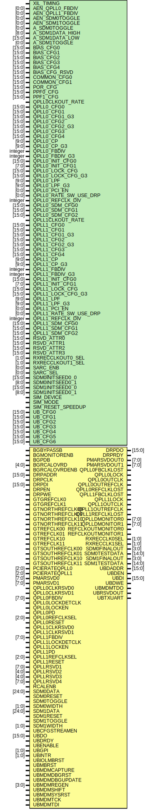

# Entity: GTYE4_COMMON

## Diagram

## Description

    Copyright (c) 1995/2017 Xilinx, Inc.
 
    Licensed under the Apache License, Version 2.0 (the "License");
    you may not use this file except in compliance with the License.
    You may obtain a copy of the License at
 
        http://www.apache.org/licenses/LICENSE-2.0
 
    Unless required by applicable law or agreed to in writing, software
    distributed under the License is distributed on an "AS IS" BASIS,
    WITHOUT WARRANTIES OR CONDITIONS OF ANY KIND, either express or implied.
    See the License for the specific language governing permissions and
    limitations under the License.
   ____  ____
  /   /\/   /
 /___/  \  /     Vendor      : Xilinx
 \   \   \/      Version     : 2018.1
  \   \          Description : Xilinx Unified Simulation Library Component
  /   /                        Gigabit Transceiver for UltraScale+ devices
 /___/   /\      Filename    : GTYE4_COMMON.v
 \   \  /  \
  \___\/\___\
  Revision:
  End Revision:
 
## Generics

| Generic name          | Type    | Value                | Description |
| --------------------- | ------- | -------------------- | ----------- |
| XIL_TIMING            |         | "UNPLACED"           |             |
| AEN_QPLL0_FBDIV       | [0:0]   | 1'b1                 |             |
| AEN_QPLL1_FBDIV       | [0:0]   | 1'b1                 |             |
| AEN_SDM0TOGGLE        | [0:0]   | 1'b0                 |             |
| AEN_SDM1TOGGLE        | [0:0]   | 1'b0                 |             |
| A_SDM0TOGGLE          | [0:0]   | 1'b0                 |             |
| A_SDM1DATA_HIGH       | [8:0]   | 9'b000000000         |             |
| A_SDM1DATA_LOW        | [15:0]  | 16'b0000000000000000 |             |
| A_SDM1TOGGLE          | [0:0]   | 1'b0                 |             |
| BIAS_CFG0             | [15:0]  | 16'h0000             |             |
| BIAS_CFG1             | [15:0]  | 16'h0000             |             |
| BIAS_CFG2             | [15:0]  | 16'h0000             |             |
| BIAS_CFG3             | [15:0]  | 16'h0000             |             |
| BIAS_CFG4             | [15:0]  | 16'h0000             |             |
| BIAS_CFG_RSVD         | [15:0]  | 16'h0000             |             |
| COMMON_CFG0           | [15:0]  | 16'h0000             |             |
| COMMON_CFG1           | [15:0]  | 16'h0000             |             |
| POR_CFG               | [15:0]  | 16'h0000             |             |
| PPF0_CFG              | [15:0]  | 16'h0F00             |             |
| PPF1_CFG              | [15:0]  | 16'h0F00             |             |
| QPLL0CLKOUT_RATE      |         | "FULL"               |             |
| QPLL0_CFG0            | [15:0]  | 16'h391C             |             |
| QPLL0_CFG1            | [15:0]  | 16'h0000             |             |
| QPLL0_CFG1_G3         | [15:0]  | 16'h0020             |             |
| QPLL0_CFG2            | [15:0]  | 16'h0F80             |             |
| QPLL0_CFG2_G3         | [15:0]  | 16'h0F80             |             |
| QPLL0_CFG3            | [15:0]  | 16'h0120             |             |
| QPLL0_CFG4            | [15:0]  | 16'h0002             |             |
| QPLL0_CP              | [9:0]   | 10'b0000011111       |             |
| QPLL0_CP_G3           | [9:0]   | 10'b0000011111       |             |
| QPLL0_FBDIV           | integer | 66                   |             |
| QPLL0_FBDIV_G3        | integer | 80                   |             |
| QPLL0_INIT_CFG0       | [15:0]  | 16'h0000             |             |
| QPLL0_INIT_CFG1       | [7:0]   | 8'h00                |             |
| QPLL0_LOCK_CFG        | [15:0]  | 16'h01E8             |             |
| QPLL0_LOCK_CFG_G3     | [15:0]  | 16'h21E8             |             |
| QPLL0_LPF             | [9:0]   | 10'b1011111111       |             |
| QPLL0_LPF_G3          | [9:0]   | 10'b1111111111       |             |
| QPLL0_PCI_EN          | [0:0]   | 1'b0                 |             |
| QPLL0_RATE_SW_USE_DRP | [0:0]   | 1'b0                 |             |
| QPLL0_REFCLK_DIV      | integer | 1                    |             |
| QPLL0_SDM_CFG0        | [15:0]  | 16'h0040             |             |
| QPLL0_SDM_CFG1        | [15:0]  | 16'h0000             |             |
| QPLL0_SDM_CFG2        | [15:0]  | 16'h0000             |             |
| QPLL1CLKOUT_RATE      |         | "FULL"               |             |
| QPLL1_CFG0            | [15:0]  | 16'h691C             |             |
| QPLL1_CFG1            | [15:0]  | 16'h0020             |             |
| QPLL1_CFG1_G3         | [15:0]  | 16'h0020             |             |
| QPLL1_CFG2            | [15:0]  | 16'h0F80             |             |
| QPLL1_CFG2_G3         | [15:0]  | 16'h0F80             |             |
| QPLL1_CFG3            | [15:0]  | 16'h0120             |             |
| QPLL1_CFG4            | [15:0]  | 16'h0002             |             |
| QPLL1_CP              | [9:0]   | 10'b0000011111       |             |
| QPLL1_CP_G3           | [9:0]   | 10'b0000011111       |             |
| QPLL1_FBDIV           | integer | 66                   |             |
| QPLL1_FBDIV_G3        | integer | 80                   |             |
| QPLL1_INIT_CFG0       | [15:0]  | 16'h0000             |             |
| QPLL1_INIT_CFG1       | [7:0]   | 8'h00                |             |
| QPLL1_LOCK_CFG        | [15:0]  | 16'h01E8             |             |
| QPLL1_LOCK_CFG_G3     | [15:0]  | 16'h21E8             |             |
| QPLL1_LPF             | [9:0]   | 10'b1011111111       |             |
| QPLL1_LPF_G3          | [9:0]   | 10'b1111111111       |             |
| QPLL1_PCI_EN          | [0:0]   | 1'b0                 |             |
| QPLL1_RATE_SW_USE_DRP | [0:0]   | 1'b0                 |             |
| QPLL1_REFCLK_DIV      | integer | 1                    |             |
| QPLL1_SDM_CFG0        | [15:0]  | 16'h0000             |             |
| QPLL1_SDM_CFG1        | [15:0]  | 16'h0000             |             |
| QPLL1_SDM_CFG2        | [15:0]  | 16'h0000             |             |
| RSVD_ATTR0            | [15:0]  | 16'h0000             |             |
| RSVD_ATTR1            | [15:0]  | 16'h0000             |             |
| RSVD_ATTR2            | [15:0]  | 16'h0000             |             |
| RSVD_ATTR3            | [15:0]  | 16'h0000             |             |
| RXRECCLKOUT0_SEL      | [1:0]   | 2'b00                |             |
| RXRECCLKOUT1_SEL      | [1:0]   | 2'b00                |             |
| SARC_ENB              | [0:0]   | 1'b0                 |             |
| SARC_SEL              | [0:0]   | 1'b0                 |             |
| SDM0INITSEED0_0       | [15:0]  | 16'b0000000000000000 |             |
| SDM0INITSEED0_1       | [8:0]   | 9'b000000000         |             |
| SDM1INITSEED0_0       | [15:0]  | 16'b0000000000000000 |             |
| SDM1INITSEED0_1       | [8:0]   | 9'b000000000         |             |
| SIM_DEVICE            |         | "ULTRASCALE_PLUS"    |             |
| SIM_MODE              |         | "FAST"               |             |
| SIM_RESET_SPEEDUP     |         | "TRUE"               |             |
| UB_CFG0               | [15:0]  | 16'h0000             |             |
| UB_CFG1               | [15:0]  | 16'h0000             |             |
| UB_CFG2               | [15:0]  | 16'h0000             |             |
| UB_CFG3               | [15:0]  | 16'h0000             |             |
| UB_CFG4               | [15:0]  | 16'h0000             |             |
| UB_CFG5               | [15:0]  | 16'h0400             |             |
| UB_CFG6               | [15:0]  | 16'h0000             |             |
## Ports

| Port name         | Direction | Type   | Description |
| ----------------- | --------- | ------ | ----------- |
| DRPDO             | output    | [15:0] |             |
| DRPRDY            | output    |        |             |
| PMARSVDOUT0       | output    | [7:0]  |             |
| PMARSVDOUT1       | output    | [7:0]  |             |
| QPLL0FBCLKLOST    | output    |        |             |
| QPLL0LOCK         | output    |        |             |
| QPLL0OUTCLK       | output    |        |             |
| QPLL0OUTREFCLK    | output    |        |             |
| QPLL0REFCLKLOST   | output    |        |             |
| QPLL1FBCLKLOST    | output    |        |             |
| QPLL1LOCK         | output    |        |             |
| QPLL1OUTCLK       | output    |        |             |
| QPLL1OUTREFCLK    | output    |        |             |
| QPLL1REFCLKLOST   | output    |        |             |
| QPLLDMONITOR0     | output    | [7:0]  |             |
| QPLLDMONITOR1     | output    | [7:0]  |             |
| REFCLKOUTMONITOR0 | output    |        |             |
| REFCLKOUTMONITOR1 | output    |        |             |
| RXRECCLK0SEL      | output    | [1:0]  |             |
| RXRECCLK1SEL      | output    | [1:0]  |             |
| SDM0FINALOUT      | output    | [3:0]  |             |
| SDM0TESTDATA      | output    | [14:0] |             |
| SDM1FINALOUT      | output    | [3:0]  |             |
| SDM1TESTDATA      | output    | [14:0] |             |
| UBDADDR           | output    | [15:0] |             |
| UBDEN             | output    |        |             |
| UBDI              | output    | [15:0] |             |
| UBDWE             | output    |        |             |
| UBMDMTDO          | output    |        |             |
| UBRSVDOUT         | output    |        |             |
| UBTXUART          | output    |        |             |
| BGBYPASSB         | input     |        |             |
| BGMONITORENB      | input     |        |             |
| BGPDB             | input     |        |             |
| BGRCALOVRD        | input     | [4:0]  |             |
| BGRCALOVRDENB     | input     |        |             |
| DRPADDR           | input     | [15:0] |             |
| DRPCLK            | input     |        |             |
| DRPDI             | input     | [15:0] |             |
| DRPEN             | input     |        |             |
| DRPWE             | input     |        |             |
| GTGREFCLK0        | input     |        |             |
| GTGREFCLK1        | input     |        |             |
| GTNORTHREFCLK00   | input     |        |             |
| GTNORTHREFCLK01   | input     |        |             |
| GTNORTHREFCLK10   | input     |        |             |
| GTNORTHREFCLK11   | input     |        |             |
| GTREFCLK00        | input     |        |             |
| GTREFCLK01        | input     |        |             |
| GTREFCLK10        | input     |        |             |
| GTREFCLK11        | input     |        |             |
| GTSOUTHREFCLK00   | input     |        |             |
| GTSOUTHREFCLK01   | input     |        |             |
| GTSOUTHREFCLK10   | input     |        |             |
| GTSOUTHREFCLK11   | input     |        |             |
| PCIERATEQPLL0     | input     | [2:0]  |             |
| PCIERATEQPLL1     | input     | [2:0]  |             |
| PMARSVD0          | input     | [7:0]  |             |
| PMARSVD1          | input     | [7:0]  |             |
| QPLL0CLKRSVD0     | input     |        |             |
| QPLL0CLKRSVD1     | input     |        |             |
| QPLL0FBDIV        | input     | [7:0]  |             |
| QPLL0LOCKDETCLK   | input     |        |             |
| QPLL0LOCKEN       | input     |        |             |
| QPLL0PD           | input     |        |             |
| QPLL0REFCLKSEL    | input     | [2:0]  |             |
| QPLL0RESET        | input     |        |             |
| QPLL1CLKRSVD0     | input     |        |             |
| QPLL1CLKRSVD1     | input     |        |             |
| QPLL1FBDIV        | input     | [7:0]  |             |
| QPLL1LOCKDETCLK   | input     |        |             |
| QPLL1LOCKEN       | input     |        |             |
| QPLL1PD           | input     |        |             |
| QPLL1REFCLKSEL    | input     | [2:0]  |             |
| QPLL1RESET        | input     |        |             |
| QPLLRSVD1         | input     | [7:0]  |             |
| QPLLRSVD2         | input     | [4:0]  |             |
| QPLLRSVD3         | input     | [4:0]  |             |
| QPLLRSVD4         | input     | [7:0]  |             |
| RCALENB           | input     |        |             |
| SDM0DATA          | input     | [24:0] |             |
| SDM0RESET         | input     |        |             |
| SDM0TOGGLE        | input     |        |             |
| SDM0WIDTH         | input     | [1:0]  |             |
| SDM1DATA          | input     | [24:0] |             |
| SDM1RESET         | input     |        |             |
| SDM1TOGGLE        | input     |        |             |
| SDM1WIDTH         | input     | [1:0]  |             |
| UBCFGSTREAMEN     | input     |        |             |
| UBDO              | input     | [15:0] |             |
| UBDRDY            | input     |        |             |
| UBENABLE          | input     |        |             |
| UBGPI             | input     | [1:0]  |             |
| UBINTR            | input     | [1:0]  |             |
| UBIOLMBRST        | input     |        |             |
| UBMBRST           | input     |        |             |
| UBMDMCAPTURE      | input     |        |             |
| UBMDMDBGRST       | input     |        |             |
| UBMDMDBGUPDATE    | input     |        |             |
| UBMDMREGEN        | input     | [3:0]  |             |
| UBMDMSHIFT        | input     |        |             |
| UBMDMSYSRST       | input     |        |             |
| UBMDMTCK          | input     |        |             |
| UBMDMTDI          | input     |        |             |
## Signals

| Name                  | Type        | Description |
| --------------------- | ----------- | ----------- |
| trig_attr             | reg         |             |
| attr_test             | reg         |             |
| attr_test             | reg         |             |
| attr_err              | reg         |             |
| glblGSR               | tri0        |             |
| CSSDSTOPCLKDONE0_out  | wire        |             |
| CSSDSTOPCLKDONE1_out  | wire        |             |
| DRPRDY_out            | wire        |             |
| QPLL0FBCLKLOST_out    | wire        |             |
| QPLL0LOCK_out         | wire        |             |
| QPLL0OUTCLK_out       | wire        |             |
| QPLL0OUTREFCLK_out    | wire        |             |
| QPLL0REFCLKLOST_out   | wire        |             |
| QPLL1FBCLKLOST_out    | wire        |             |
| QPLL1LOCK_out         | wire        |             |
| QPLL1OUTCLK_out       | wire        |             |
| QPLL1OUTREFCLK_out    | wire        |             |
| QPLL1REFCLKLOST_out   | wire        |             |
| REFCLKOUTMONITOR0_out | wire        |             |
| REFCLKOUTMONITOR1_out | wire        |             |
| UBDEN_out             | wire        |             |
| UBDWE_out             | wire        |             |
| UBMDMTDO_out          | wire        |             |
| UBRSVDOUT_out         | wire        |             |
| UBTXUART_out          | wire        |             |
| PMASCANOUT_out        | wire [13:0] |             |
| SDM0TESTDATA_out      | wire [14:0] |             |
| SDM1TESTDATA_out      | wire [14:0] |             |
| DRPDO_out             | wire [15:0] |             |
| UBDADDR_out           | wire [15:0] |             |
| UBDI_out              | wire [15:0] |             |
| RXRECCLK0SEL_out      | wire [1:0]  |             |
| RXRECCLK1SEL_out      | wire [1:0]  |             |
| SARCCLK_out           | wire [3:0]  |             |
| SDM0FINALOUT_out      | wire [3:0]  |             |
| SDM1FINALOUT_out      | wire [3:0]  |             |
| PMARSVDOUT0_out       | wire [7:0]  |             |
| PMARSVDOUT1_out       | wire [7:0]  |             |
| QPLLDMONITOR0_out     | wire [7:0]  |             |
| QPLLDMONITOR1_out     | wire [7:0]  |             |
| BGBYPASSB_in          | wire        |             |
| BGMONITORENB_in       | wire        |             |
| BGPDB_in              | wire        |             |
| BGRCALOVRDENB_in      | wire        |             |
| CSSDSTOPCLK0_in       | wire        |             |
| CSSDSTOPCLK1_in       | wire        |             |
| DRPCLK_in             | wire        |             |
| DRPEN_in              | wire        |             |
| DRPWE_in              | wire        |             |
| GTGREFCLK0_in         | wire        |             |
| GTGREFCLK1_in         | wire        |             |
| GTNORTHREFCLK00_in    | wire        |             |
| GTNORTHREFCLK01_in    | wire        |             |
| GTNORTHREFCLK10_in    | wire        |             |
| GTNORTHREFCLK11_in    | wire        |             |
| GTREFCLK00_in         | wire        |             |
| GTREFCLK01_in         | wire        |             |
| GTREFCLK10_in         | wire        |             |
| GTREFCLK11_in         | wire        |             |
| GTSOUTHREFCLK00_in    | wire        |             |
| GTSOUTHREFCLK01_in    | wire        |             |
| GTSOUTHREFCLK10_in    | wire        |             |
| GTSOUTHREFCLK11_in    | wire        |             |
| PMASCANENB_in         | wire        |             |
| QDPMASCANMODEB_in     | wire        |             |
| QDPMASCANRSTEN_in     | wire        |             |
| QPLL0CLKRSVD0_in      | wire        |             |
| QPLL0CLKRSVD1_in      | wire        |             |
| QPLL0LOCKDETCLK_in    | wire        |             |
| QPLL0LOCKEN_in        | wire        |             |
| QPLL0PD_in            | wire        |             |
| QPLL0RESET_in         | wire        |             |
| QPLL1CLKRSVD0_in      | wire        |             |
| QPLL1CLKRSVD1_in      | wire        |             |
| QPLL1LOCKDETCLK_in    | wire        |             |
| QPLL1LOCKEN_in        | wire        |             |
| QPLL1PD_in            | wire        |             |
| QPLL1RESET_in         | wire        |             |
| RCALENB_in            | wire        |             |
| SDM0RESET_in          | wire        |             |
| SDM0TOGGLE_in         | wire        |             |
| SDM1RESET_in          | wire        |             |
| SDM1TOGGLE_in         | wire        |             |
| UBCFGSTREAMEN_in      | wire        |             |
| UBDRDY_in             | wire        |             |
| UBENABLE_in           | wire        |             |
| UBIOLMBRST_in         | wire        |             |
| UBMBRST_in            | wire        |             |
| UBMDMCAPTURE_in       | wire        |             |
| UBMDMDBGRST_in        | wire        |             |
| UBMDMDBGUPDATE_in     | wire        |             |
| UBMDMSHIFT_in         | wire        |             |
| UBMDMSYSRST_in        | wire        |             |
| UBMDMTCK_in           | wire        |             |
| UBMDMTDI_in           | wire        |             |
| PMASCANCLK_in         | wire [13:0] |             |
| PMASCANIN_in          | wire [13:0] |             |
| DRPADDR_in            | wire [15:0] |             |
| DRPDI_in              | wire [15:0] |             |
| UBDO_in               | wire [15:0] |             |
| SDM0WIDTH_in          | wire [1:0]  |             |
| SDM1WIDTH_in          | wire [1:0]  |             |
| UBGPI_in              | wire [1:0]  |             |
| UBINTR_in             | wire [1:0]  |             |
| SDM0DATA_in           | wire [24:0] |             |
| SDM1DATA_in           | wire [24:0] |             |
| PCIERATEQPLL0_in      | wire [2:0]  |             |
| PCIERATEQPLL1_in      | wire [2:0]  |             |
| QPLL0REFCLKSEL_in     | wire [2:0]  |             |
| QPLL1REFCLKSEL_in     | wire [2:0]  |             |
| RXRECCLK_in           | wire [3:0]  |             |
| UBMDMREGEN_in         | wire [3:0]  |             |
| BGRCALOVRD_in         | wire [4:0]  |             |
| QPLLRSVD2_in          | wire [4:0]  |             |
| QPLLRSVD3_in          | wire [4:0]  |             |
| PMARSVD0_in           | wire [7:0]  |             |
| PMARSVD1_in           | wire [7:0]  |             |
| QPLL0FBDIV_in         | wire [7:0]  |             |
| QPLL1FBDIV_in         | wire [7:0]  |             |
| QPLLRSVD1_in          | wire [7:0]  |             |
| QPLLRSVD4_in          | wire [7:0]  |             |
| DRPCLK_delay          | wire        |             |
| DRPEN_delay           | wire        |             |
| DRPWE_delay           | wire        |             |
| UBDRDY_delay          | wire        |             |
| DRPADDR_delay         | wire [15:0] |             |
| DRPDI_delay           | wire [15:0] |             |
| UBDO_delay            | wire [15:0] |             |
| notifier              | reg         |             |
## Constants

| Name                      | Type    | Value                 | Description       |
| ------------------------- | ------- | --------------------- | ----------------- |
| MODULE_NAME               |         | "GTYE4_COMMON"        | define constants  |
| AEN_QPLL0_FBDIV_REG       | [0:0]   | AEN_QPLL0_FBDIV       |                   |
| AEN_QPLL1_FBDIV_REG       | [0:0]   | AEN_QPLL1_FBDIV       |                   |
| AEN_SDM0TOGGLE_REG        | [0:0]   | AEN_SDM0TOGGLE        |                   |
| AEN_SDM1TOGGLE_REG        | [0:0]   | AEN_SDM1TOGGLE        |                   |
| A_SDM0TOGGLE_REG          | [0:0]   | A_SDM0TOGGLE          |                   |
| A_SDM1DATA_HIGH_REG       | [8:0]   | A_SDM1DATA_HIGH       |                   |
| A_SDM1DATA_LOW_REG        | [15:0]  | A_SDM1DATA_LOW        |                   |
| A_SDM1TOGGLE_REG          | [0:0]   | A_SDM1TOGGLE          |                   |
| BIAS_CFG0_REG             | [15:0]  | BIAS_CFG0             |                   |
| BIAS_CFG1_REG             | [15:0]  | BIAS_CFG1             |                   |
| BIAS_CFG2_REG             | [15:0]  | BIAS_CFG2             |                   |
| BIAS_CFG3_REG             | [15:0]  | BIAS_CFG3             |                   |
| BIAS_CFG4_REG             | [15:0]  | BIAS_CFG4             |                   |
| BIAS_CFG_RSVD_REG         | [15:0]  | BIAS_CFG_RSVD         |                   |
| COMMON_CFG0_REG           | [15:0]  | COMMON_CFG0           |                   |
| COMMON_CFG1_REG           | [15:0]  | COMMON_CFG1           |                   |
| POR_CFG_REG               | [15:0]  | POR_CFG               |                   |
| PPF0_CFG_REG              | [15:0]  | PPF0_CFG              |                   |
| PPF1_CFG_REG              | [15:0]  | PPF1_CFG              |                   |
| QPLL0CLKOUT_RATE_REG      | [32:1]  | QPLL0CLKOUT_RATE      |                   |
| QPLL0_CFG0_REG            | [15:0]  | QPLL0_CFG0            |                   |
| QPLL0_CFG1_REG            | [15:0]  | QPLL0_CFG1            |                   |
| QPLL0_CFG1_G3_REG         | [15:0]  | QPLL0_CFG1_G3         |                   |
| QPLL0_CFG2_REG            | [15:0]  | QPLL0_CFG2            |                   |
| QPLL0_CFG2_G3_REG         | [15:0]  | QPLL0_CFG2_G3         |                   |
| QPLL0_CFG3_REG            | [15:0]  | QPLL0_CFG3            |                   |
| QPLL0_CFG4_REG            | [15:0]  | QPLL0_CFG4            |                   |
| QPLL0_CP_REG              | [9:0]   | QPLL0_CP              |                   |
| QPLL0_CP_G3_REG           | [9:0]   | QPLL0_CP_G3           |                   |
| QPLL0_FBDIV_REG           | [7:0]   | QPLL0_FBDIV           |                   |
| QPLL0_FBDIV_G3_REG        | [7:0]   | QPLL0_FBDIV_G3        |                   |
| QPLL0_INIT_CFG0_REG       | [15:0]  | QPLL0_INIT_CFG0       |                   |
| QPLL0_INIT_CFG1_REG       | [7:0]   | QPLL0_INIT_CFG1       |                   |
| QPLL0_LOCK_CFG_REG        | [15:0]  | QPLL0_LOCK_CFG        |                   |
| QPLL0_LOCK_CFG_G3_REG     | [15:0]  | QPLL0_LOCK_CFG_G3     |                   |
| QPLL0_LPF_REG             | [9:0]   | QPLL0_LPF             |                   |
| QPLL0_LPF_G3_REG          | [9:0]   | QPLL0_LPF_G3          |                   |
| QPLL0_PCI_EN_REG          | [0:0]   | QPLL0_PCI_EN          |                   |
| QPLL0_RATE_SW_USE_DRP_REG | [0:0]   | QPLL0_RATE_SW_USE_DRP |                   |
| QPLL0_REFCLK_DIV_REG      | [4:0]   | QPLL0_REFCLK_DIV      |                   |
| QPLL0_SDM_CFG0_REG        | [15:0]  | QPLL0_SDM_CFG0        |                   |
| QPLL0_SDM_CFG1_REG        | [15:0]  | QPLL0_SDM_CFG1        |                   |
| QPLL0_SDM_CFG2_REG        | [15:0]  | QPLL0_SDM_CFG2        |                   |
| QPLL1CLKOUT_RATE_REG      | [32:1]  | QPLL1CLKOUT_RATE      |                   |
| QPLL1_CFG0_REG            | [15:0]  | QPLL1_CFG0            |                   |
| QPLL1_CFG1_REG            | [15:0]  | QPLL1_CFG1            |                   |
| QPLL1_CFG1_G3_REG         | [15:0]  | QPLL1_CFG1_G3         |                   |
| QPLL1_CFG2_REG            | [15:0]  | QPLL1_CFG2            |                   |
| QPLL1_CFG2_G3_REG         | [15:0]  | QPLL1_CFG2_G3         |                   |
| QPLL1_CFG3_REG            | [15:0]  | QPLL1_CFG3            |                   |
| QPLL1_CFG4_REG            | [15:0]  | QPLL1_CFG4            |                   |
| QPLL1_CP_REG              | [9:0]   | QPLL1_CP              |                   |
| QPLL1_CP_G3_REG           | [9:0]   | QPLL1_CP_G3           |                   |
| QPLL1_FBDIV_REG           | [7:0]   | QPLL1_FBDIV           |                   |
| QPLL1_FBDIV_G3_REG        | [7:0]   | QPLL1_FBDIV_G3        |                   |
| QPLL1_INIT_CFG0_REG       | [15:0]  | QPLL1_INIT_CFG0       |                   |
| QPLL1_INIT_CFG1_REG       | [7:0]   | QPLL1_INIT_CFG1       |                   |
| QPLL1_LOCK_CFG_REG        | [15:0]  | QPLL1_LOCK_CFG        |                   |
| QPLL1_LOCK_CFG_G3_REG     | [15:0]  | QPLL1_LOCK_CFG_G3     |                   |
| QPLL1_LPF_REG             | [9:0]   | QPLL1_LPF             |                   |
| QPLL1_LPF_G3_REG          | [9:0]   | QPLL1_LPF_G3          |                   |
| QPLL1_PCI_EN_REG          | [0:0]   | QPLL1_PCI_EN          |                   |
| QPLL1_RATE_SW_USE_DRP_REG | [0:0]   | QPLL1_RATE_SW_USE_DRP |                   |
| QPLL1_REFCLK_DIV_REG      | [4:0]   | QPLL1_REFCLK_DIV      |                   |
| QPLL1_SDM_CFG0_REG        | [15:0]  | QPLL1_SDM_CFG0        |                   |
| QPLL1_SDM_CFG1_REG        | [15:0]  | QPLL1_SDM_CFG1        |                   |
| QPLL1_SDM_CFG2_REG        | [15:0]  | QPLL1_SDM_CFG2        |                   |
| RSVD_ATTR0_REG            | [15:0]  | RSVD_ATTR0            |                   |
| RSVD_ATTR1_REG            | [15:0]  | RSVD_ATTR1            |                   |
| RSVD_ATTR2_REG            | [15:0]  | RSVD_ATTR2            |                   |
| RSVD_ATTR3_REG            | [15:0]  | RSVD_ATTR3            |                   |
| RXRECCLKOUT0_SEL_REG      | [1:0]   | RXRECCLKOUT0_SEL      |                   |
| RXRECCLKOUT1_SEL_REG      | [1:0]   | RXRECCLKOUT1_SEL      |                   |
| SARC_ENB_REG              | [0:0]   | SARC_ENB              |                   |
| SARC_SEL_REG              | [0:0]   | SARC_SEL              |                   |
| SDM0INITSEED0_0_REG       | [15:0]  | SDM0INITSEED0_0       |                   |
| SDM0INITSEED0_1_REG       | [8:0]   | SDM0INITSEED0_1       |                   |
| SDM1INITSEED0_0_REG       | [15:0]  | SDM1INITSEED0_0       |                   |
| SDM1INITSEED0_1_REG       | [8:0]   | SDM1INITSEED0_1       |                   |
| SIM_DEVICE_REG            | [160:1] | SIM_DEVICE            |                   |
| SIM_MODE_REG              | [48:1]  | SIM_MODE              |                   |
| SIM_RESET_SPEEDUP_REG     | [40:1]  | SIM_RESET_SPEEDUP     |                   |
| UB_CFG0_REG               | [15:0]  | UB_CFG0               |                   |
| UB_CFG1_REG               | [15:0]  | UB_CFG1               |                   |
| UB_CFG2_REG               | [15:0]  | UB_CFG2               |                   |
| UB_CFG3_REG               | [15:0]  | UB_CFG3               |                   |
| UB_CFG4_REG               | [15:0]  | UB_CFG4               |                   |
| UB_CFG5_REG               | [15:0]  | UB_CFG5               |                   |
| UB_CFG6_REG               | [15:0]  | UB_CFG6               |                   |
| AEN_BGBS0_REG             | [0:0]   | 1'b0                  |                   |
| AEN_BGBS1_REG             | [0:0]   | 1'b0                  |                   |
| AEN_MASTER0_REG           | [0:0]   | 1'b0                  |                   |
| AEN_MASTER1_REG           | [0:0]   | 1'b0                  |                   |
| AEN_PD0_REG               | [0:0]   | 1'b0                  |                   |
| AEN_PD1_REG               | [0:0]   | 1'b0                  |                   |
| AEN_QPLL0_REG             | [0:0]   | 1'b0                  |                   |
| AEN_QPLL1_REG             | [0:0]   | 1'b0                  |                   |
| AEN_REFCLK0_REG           | [0:0]   | 1'b0                  |                   |
| AEN_REFCLK1_REG           | [0:0]   | 1'b0                  |                   |
| AEN_RESET0_REG            | [0:0]   | 1'b0                  |                   |
| AEN_RESET1_REG            | [0:0]   | 1'b0                  |                   |
| AEN_SDM0DATA_REG          | [0:0]   | 1'b0                  |                   |
| AEN_SDM0RESET_REG         | [0:0]   | 1'b0                  |                   |
| AEN_SDM0WIDTH_REG         | [0:0]   | 1'b0                  |                   |
| AEN_SDM1DATA_REG          | [0:0]   | 1'b0                  |                   |
| AEN_SDM1RESET_REG         | [0:0]   | 1'b0                  |                   |
| AEN_SDM1WIDTH_REG         | [0:0]   | 1'b0                  |                   |
| AQDMUXSEL1_REG            | [3:0]   | 4'b0000               |                   |
| AVCC_SENSE_SEL_REG        | [3:0]   | 4'b0000               |                   |
| AVTT_SENSE_SEL_REG        | [3:0]   | 4'b0000               |                   |
| A_BGMONITOREN_REG         | [0:0]   | 1'b0                  |                   |
| A_BGPD_REG                | [0:0]   | 1'b0                  |                   |
| A_GTREFCLKPD0_REG         | [0:0]   | 1'b0                  |                   |
| A_GTREFCLKPD1_REG         | [0:0]   | 1'b0                  |                   |
| A_QPLL0LOCKEN_REG         | [0:0]   | 1'b0                  |                   |
| A_QPLL0PD_REG             | [0:0]   | 1'b0                  |                   |
| A_QPLL0RESET_REG          | [0:0]   | 1'b0                  |                   |
| A_QPLL1LOCKEN_REG         | [0:0]   | 1'b0                  |                   |
| A_QPLL1PD_REG             | [0:0]   | 1'b0                  |                   |
| A_QPLL1RESET_REG          | [0:0]   | 1'b0                  |                   |
| A_SDM0DATA_HIGH_REG       | [8:0]   | 9'b000000000          |                   |
| A_SDM0DATA_LOW_REG        | [15:0]  | 16'b0000000000000000  |                   |
| A_SDM0RESET_REG           | [0:0]   | 1'b0                  |                   |
| A_SDM1RESET_REG           | [0:0]   | 1'b0                  |                   |
| COMMON_AMUX_SEL0_REG      | [1:0]   | 2'b00                 |                   |
| COMMON_AMUX_SEL1_REG      | [1:0]   | 2'b00                 |                   |
| COMMON_INSTANTIATED_REG   | [0:0]   | 1'b1                  |                   |
| QPLL0_AMONITOR_SEL_REG    | [2:0]   | 3'b000                |                   |
| QPLL1_AMONITOR_SEL_REG    | [2:0]   | 3'b000                |                   |
| RCALSAP_TESTEN_REG        | [0:0]   | 1'b0                  |                   |
| RCAL_APROBE_REG           | [0:0]   | 1'b0                  |                   |
| REFCLK0_EN_DC_COUP_REG    | [0:0]   | 1'b0                  |                   |
| REFCLK0_VCM_HIGH_REG      | [0:0]   | 1'b0                  |                   |
| REFCLK0_VCM_LOW_REG       | [0:0]   | 1'b0                  |                   |
| REFCLK1_EN_DC_COUP_REG    | [0:0]   | 1'b0                  |                   |
| REFCLK1_VCM_HIGH_REG      | [0:0]   | 1'b0                  |                   |
| REFCLK1_VCM_LOW_REG       | [0:0]   | 1'b0                  |                   |
| VCCAUX_SENSE_SEL_REG      | [1:0]   | 2'b00                 |                   |
## Processes
- unnamed: ( @ (trig_attr) )
- unnamed: (  )
- unnamed: (  )
- unnamed: (  )
- unnamed: (  )
- unnamed: (  )
- unnamed: (  )
- unnamed: (  )
- unnamed: (  )
- unnamed: (  )
- unnamed: (  )
- unnamed: (  )
- unnamed: (  )
- unnamed: (  )
- unnamed: (  )
- unnamed: (  )
- unnamed: (  )
- unnamed: (  )
- unnamed: (  )
- unnamed: (  )
- unnamed: (  )
- unnamed: (  )
- unnamed: (  )
- unnamed: (  )
- unnamed: (  )
- unnamed: (  )
- unnamed: (  )
- unnamed: (  )
- unnamed: (  )
- unnamed: (  )
- unnamed: (  )
- unnamed: (  )
- unnamed: (  )
- unnamed: (  )
- unnamed: (  )
- unnamed: (  )
- unnamed: (  )
- unnamed: (  )
- unnamed: (  )
- unnamed: (  )
- unnamed: (  )
- unnamed: (  )
- unnamed: (  )
- unnamed: (  )
- unnamed: (  )
- unnamed: (  )
- unnamed: (  )
- unnamed: (  )
- unnamed: (  )
- unnamed: (  )
- unnamed: (  )
- unnamed: (  )
- unnamed: (  )
- unnamed: (  )
- unnamed: (  )
- unnamed: (  )
- unnamed: (  )
- unnamed: (  )
- unnamed: (  )
- unnamed: (  )
- unnamed: (  )
- unnamed: (  )
- unnamed: (  )
- unnamed: (  )
- unnamed: (  )
- unnamed: (  )
- unnamed: (  )
- unnamed: (  )
- unnamed: (  )
- unnamed: (  )
- unnamed: (  )
- unnamed: (  )
- unnamed: (  )
- unnamed: (  )
- unnamed: (  )
- unnamed: (  )
- unnamed: (  )
- unnamed: (  )
- unnamed: (  )
- unnamed: (  )
- unnamed: (  )
- unnamed: (  )
- unnamed: (  )
- unnamed: (  )
- unnamed: (  )
- unnamed: (  )
- unnamed: (  )
- unnamed: (  )
- unnamed: (  )
- unnamed: (  )
- unnamed: (  )
- unnamed: (  )
- unnamed: (  )
- unnamed: (  )
- unnamed: (  )
- unnamed: (  )
- unnamed: (  )
- unnamed: (  )
- unnamed: (  )
- unnamed: (  )
- unnamed: (  )
- unnamed: (  )
- unnamed: (  )
## Instantiations

- SIP_GTYE4_COMMON_INST: SIP_GTYE4_COMMON
**Description**
tie off

