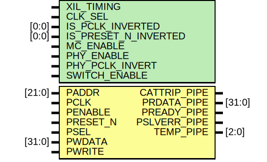

# Entity: HBM_SNGLBLI_INTF_APB

## Diagram

## Description

    Copyright (c) 1995/2017 Xilinx, Inc.
 
    Licensed under the Apache License, Version 2.0 (the "License");
    you may not use this file except in compliance with the License.
    You may obtain a copy of the License at
 
        http://www.apache.org/licenses/LICENSE-2.0
 
    Unless required by applicable law or agreed to in writing, software
    distributed under the License is distributed on an "AS IS" BASIS,
    WITHOUT WARRANTIES OR CONDITIONS OF ANY KIND, either express or implied.
    See the License for the specific language governing permissions and
    limitations under the License.
   ____  ____
  /   /\/   /
 /___/  \  /     Vendor      : Xilinx
 \   \   \/      Version     : 2018.1
  \   \          Description : Xilinx Unified Simulation Library Component
  /   /                        HBM_SNGLBLI_INTF_APB
 /___/   /\      Filename    : HBM_SNGLBLI_INTF_APB.v
 \   \  /  \
  \___\/\___\
  Revision:
  End Revision:
 
## Generics

| Generic name         | Type  | Value      | Description |
| -------------------- | ----- | ---------- | ----------- |
| XIL_TIMING           |       | "UNPLACED" |             |
| CLK_SEL              |       | "FALSE"    |             |
| IS_PCLK_INVERTED     | [0:0] | 1'b0       |             |
| IS_PRESET_N_INVERTED | [0:0] | 1'b0       |             |
| MC_ENABLE            |       | "FALSE"    |             |
| PHY_ENABLE           |       | "FALSE"    |             |
| PHY_PCLK_INVERT      |       | "FALSE"    |             |
| SWITCH_ENABLE        |       | "FALSE"    |             |
## Ports

| Port name    | Direction | Type   | Description |
| ------------ | --------- | ------ | ----------- |
| CATTRIP_PIPE | output    |        |             |
| PRDATA_PIPE  | output    | [31:0] |             |
| PREADY_PIPE  | output    |        |             |
| PSLVERR_PIPE | output    |        |             |
| TEMP_PIPE    | output    | [2:0]  |             |
| PADDR        | input     | [21:0] |             |
| PCLK         | input     |        |             |
| PENABLE      | input     |        |             |
| PRESET_N     | input     |        |             |
| PSEL         | input     |        |             |
| PWDATA       | input     | [31:0] |             |
| PWRITE       | input     |        |             |
## Signals

| Name              | Type        | Description |
| ----------------- | ----------- | ----------- |
| trig_attr         | reg         |             |
| CLK_SEL_BIN       | wire        |             |
| MC_ENABLE_BIN     | wire        |             |
| PHY_ENABLE_BIN    | wire        |             |
| SWITCH_ENABLE_BIN | wire        |             |
| CLK_SEL_BIN       | reg         |             |
| MC_ENABLE_BIN     | reg         |             |
| PHY_ENABLE_BIN    | reg         |             |
| SWITCH_ENABLE_BIN | reg         |             |
| attr_test         | reg         |             |
| attr_err          | reg         |             |
| glblGSR           | tri0        |             |
| PCLK_in           | wire        |             |
| PENABLE_in        | wire        |             |
| PRESET_N_in       | wire        |             |
| PSEL_in           | wire        |             |
| PWRITE_in         | wire        |             |
| PADDR_in          | wire [21:0] |             |
| PWDATA_in         | wire [31:0] |             |
| PCLK_delay        | wire        |             |
| PENABLE_delay     | wire        |             |
| PRESET_N_delay    | wire        |             |
| PSEL_delay        | wire        |             |
| PWRITE_delay      | wire        |             |
| PADDR_delay       | wire [21:0] |             |
| PWDATA_delay      | wire [31:0] |             |
| notifier          | reg         |             |
## Constants

| Name                     | Type   | Value                  | Description                        |
| ------------------------ | ------ | ---------------------- | ---------------------------------- |
| MODULE_NAME              |        | "HBM_SNGLBLI_INTF_APB" | define constants                   |
| CLK_SEL_FALSE            |        | 0                      | Parameter encodings and registers  |
| CLK_SEL_TRUE             |        | 1                      |                                    |
| MC_ENABLE_FALSE          |        | 0                      |                                    |
| MC_ENABLE_TRUE           |        | 1                      |                                    |
| PHY_ENABLE_FALSE         |        | 0                      |                                    |
| PHY_ENABLE_TRUE          |        | 1                      |                                    |
| SWITCH_ENABLE_FALSE      |        | 0                      |                                    |
| SWITCH_ENABLE_TRUE       |        | 1                      |                                    |
| CLK_SEL_REG              | [40:1] | CLK_SEL                |                                    |
| IS_PCLK_INVERTED_REG     | [0:0]  | IS_PCLK_INVERTED       |                                    |
| IS_PRESET_N_INVERTED_REG | [0:0]  | IS_PRESET_N_INVERTED   |                                    |
| MC_ENABLE_REG            | [40:1] | MC_ENABLE              |                                    |
| PHY_ENABLE_REG           | [40:1] | PHY_ENABLE             |                                    |
| PHY_PCLK_INVERT_REG      | [40:1] | PHY_PCLK_INVERT        |                                    |
| SWITCH_ENABLE_REG        | [40:1] | SWITCH_ENABLE          |                                    |
## Processes
- unnamed: ( @ (trig_attr) )
- unnamed: ( @ (trig_attr) )
- unnamed: (  )
- unnamed: (  )
- unnamed: (  )
- unnamed: (  )
- unnamed: (  )
- unnamed: (  )
- unnamed: (  )
- unnamed: (  )
- unnamed: (  )
- unnamed: (  )
- unnamed: (  )
- unnamed: (  )
- unnamed: (  )
- unnamed: (  )
- unnamed: (  )
- unnamed: (  )
- unnamed: (  )
- unnamed: (  )
- unnamed: (  )
- unnamed: (  )
- unnamed: (  )
- unnamed: (  )
- unnamed: (  )
- unnamed: (  )
- unnamed: (  )
- unnamed: (  )
- unnamed: (  )
- unnamed: (  )
- unnamed: (  )
- unnamed: (  )
- unnamed: (  )
- unnamed: (  )
- unnamed: (  )
- unnamed: (  )
- unnamed: (  )
- unnamed: (  )
- unnamed: (  )
- unnamed: (  )
- unnamed: (  )
- unnamed: (  )
- unnamed: (  )
- unnamed: (  )
- unnamed: (  )
- unnamed: (  )
- unnamed: (  )
- unnamed: (  )
- unnamed: (  )
- unnamed: (  )
- unnamed: (  )
- unnamed: (  )
- unnamed: (  )
- unnamed: (  )
- unnamed: (  )
- unnamed: (  )
- unnamed: (  )
- unnamed: (  )
- unnamed: (  )
- unnamed: (  )
- unnamed: (  )
- unnamed: (  )
- unnamed: (  )
- unnamed: (  )
- unnamed: (  )
- unnamed: (  )
- unnamed: (  )
- unnamed: (  )
- unnamed: (  )
- unnamed: (  )
- unnamed: (  )
- unnamed: (  )
- unnamed: (  )
- unnamed: (  )
- unnamed: (  )
- unnamed: (  )
- unnamed: (  )
- unnamed: (  )
- unnamed: (  )
- unnamed: (  )
- unnamed: (  )
- unnamed: (  )
- unnamed: (  )
- unnamed: (  )
- unnamed: (  )
- unnamed: (  )
- unnamed: (  )
- unnamed: (  )
- unnamed: (  )
- unnamed: (  )
- unnamed: (  )
- unnamed: (  )
- unnamed: (  )
- unnamed: (  )
- unnamed: (  )
- unnamed: (  )
- unnamed: (  )
- unnamed: (  )
- unnamed: (  )
- unnamed: (  )
- unnamed: (  )
- unnamed: (  )
- unnamed: (  )
- unnamed: (  )
- unnamed: (  )
- unnamed: (  )
- unnamed: (  )
- unnamed: (  )
- unnamed: (  )
- unnamed: (  )
- unnamed: (  )
- unnamed: (  )
- unnamed: (  )
- unnamed: (  )
- unnamed: (  )
- unnamed: (  )
- unnamed: (  )
- unnamed: (  )
- unnamed: (  )
- unnamed: (  )
- unnamed: (  )
- unnamed: (  )
- unnamed: (  )
- unnamed: (  )
- unnamed: (  )
- unnamed: (  )
- unnamed: (  )
- unnamed: (  )
- unnamed: (  )
- unnamed: (  )
- unnamed: (  )
- unnamed: (  )
- unnamed: (  )
- unnamed: (  )
- unnamed: (  )
- unnamed: (  )
- unnamed: (  )
- unnamed: (  )
- unnamed: (  )
- unnamed: (  )
- unnamed: (  )
- unnamed: (  )
- unnamed: (  )
- unnamed: (  )
- unnamed: (  )
- unnamed: (  )
- unnamed: (  )
- unnamed: (  )
- unnamed: (  )
- unnamed: (  )
- unnamed: (  )
- unnamed: (  )
- unnamed: (  )
- unnamed: (  )
- unnamed: (  )
- unnamed: (  )
- unnamed: (  )
- unnamed: (  )
- unnamed: (  )
- unnamed: (  )
- unnamed: (  )
- unnamed: (  )
- unnamed: (  )
- unnamed: (  )
- unnamed: (  )
- unnamed: (  )
- unnamed: (  )
- unnamed: (  )
- unnamed: (  )
- unnamed: (  )
- unnamed: (  )
- unnamed: (  )
- unnamed: (  )
- unnamed: (  )
- unnamed: (  )
- unnamed: (  )
- unnamed: (  )
- unnamed: (  )
- unnamed: (  )
- unnamed: (  )
- unnamed: (  )
- unnamed: (  )
- unnamed: (  )
- unnamed: (  )
- unnamed: (  )
- unnamed: (  )
- unnamed: (  )
- unnamed: (  )
- unnamed: (  )
- unnamed: (  )
- unnamed: (  )
- unnamed: (  )
- unnamed: (  )
- unnamed: (  )
- unnamed: (  )
- unnamed: (  )
- unnamed: (  )
- unnamed: (  )
- unnamed: (  )
- unnamed: (  )
- unnamed: (  )
- unnamed: (  )
- unnamed: (  )
- unnamed: (  )
- unnamed: (  )
- unnamed: (  )
- unnamed: (  )
- unnamed: (  )
- unnamed: (  )
- unnamed: (  )
- unnamed: (  )
- unnamed: (  )
- unnamed: (  )
- unnamed: (  )
- unnamed: (  )
- unnamed: (  )
- unnamed: (  )
- unnamed: (  )
- unnamed: (  )
- unnamed: (  )
- unnamed: (  )
- unnamed: (  )
- unnamed: (  )
- unnamed: (  )
- unnamed: (  )
- unnamed: (  )
- unnamed: (  )
- unnamed: (  )
- unnamed: (  )
- unnamed: (  )
- unnamed: (  )
- unnamed: (  )
- unnamed: (  )
- unnamed: (  )
