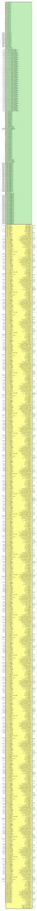

# Entity: HBM_TWO_STACK_INTF

## Diagram

## Description

    Copyright (c) 1995/2017 Xilinx, Inc.
 
    Licensed under the Apache License, Version 2.0 (the "License");
    you may not use this file except in compliance with the License.
    You may obtain a copy of the License at
 
        http://www.apache.org/licenses/LICENSE-2.0
 
    Unless required by applicable law or agreed to in writing, software
    distributed under the License is distributed on an "AS IS" BASIS,
    WITHOUT WARRANTIES OR CONDITIONS OF ANY KIND, either express or implied.
    See the License for the specific language governing permissions and
    limitations under the License.
   ____  ____
  /   /\/   /
 /___/  \  /     Vendor      : Xilinx
 \   \   \/      Version     : 2018.1
  \   \          Description : Xilinx Unified Simulation Library Component
  /   /                        HBM_TWO_STACK_INTF
 /___/   /\      Filename    : HBM_TWO_STACK_INTF.v
 \   \  /  \
  \___\/\___\
  Revision:
  End Revision:
 
## Generics

| Generic name                | Type    | Value             | Description |
| --------------------------- | ------- | ----------------- | ----------- |
| XIL_TIMING                  |         | "UNPLACED"        |             |
| CLK_SEL_00                  |         | "FALSE"           |             |
| CLK_SEL_01                  |         | "FALSE"           |             |
| CLK_SEL_02                  |         | "FALSE"           |             |
| CLK_SEL_03                  |         | "FALSE"           |             |
| CLK_SEL_04                  |         | "FALSE"           |             |
| CLK_SEL_05                  |         | "FALSE"           |             |
| CLK_SEL_06                  |         | "FALSE"           |             |
| CLK_SEL_07                  |         | "FALSE"           |             |
| CLK_SEL_08                  |         | "FALSE"           |             |
| CLK_SEL_09                  |         | "FALSE"           |             |
| CLK_SEL_10                  |         | "FALSE"           |             |
| CLK_SEL_11                  |         | "FALSE"           |             |
| CLK_SEL_12                  |         | "FALSE"           |             |
| CLK_SEL_13                  |         | "FALSE"           |             |
| CLK_SEL_14                  |         | "FALSE"           |             |
| CLK_SEL_15                  |         | "FALSE"           |             |
| CLK_SEL_16                  |         | "FALSE"           |             |
| CLK_SEL_17                  |         | "FALSE"           |             |
| CLK_SEL_18                  |         | "FALSE"           |             |
| CLK_SEL_19                  |         | "FALSE"           |             |
| CLK_SEL_20                  |         | "FALSE"           |             |
| CLK_SEL_21                  |         | "FALSE"           |             |
| CLK_SEL_22                  |         | "FALSE"           |             |
| CLK_SEL_23                  |         | "FALSE"           |             |
| CLK_SEL_24                  |         | "FALSE"           |             |
| CLK_SEL_25                  |         | "FALSE"           |             |
| CLK_SEL_26                  |         | "FALSE"           |             |
| CLK_SEL_27                  |         | "FALSE"           |             |
| CLK_SEL_28                  |         | "FALSE"           |             |
| CLK_SEL_29                  |         | "FALSE"           |             |
| CLK_SEL_30                  |         | "FALSE"           |             |
| CLK_SEL_31                  |         | "FALSE"           |             |
| DATARATE_00                 | integer | 1800              |             |
| DATARATE_01                 | integer | 1800              |             |
| DATARATE_02                 | integer | 1800              |             |
| DATARATE_03                 | integer | 1800              |             |
| DATARATE_04                 | integer | 1800              |             |
| DATARATE_05                 | integer | 1800              |             |
| DATARATE_06                 | integer | 1800              |             |
| DATARATE_07                 | integer | 1800              |             |
| DATARATE_08                 | integer | 1800              |             |
| DATARATE_09                 | integer | 1800              |             |
| DATARATE_10                 | integer | 1800              |             |
| DATARATE_11                 | integer | 1800              |             |
| DATARATE_12                 | integer | 1800              |             |
| DATARATE_13                 | integer | 1800              |             |
| DATARATE_14                 | integer | 1800              |             |
| DATARATE_15                 | integer | 1800              |             |
| DA_LOCKOUT_0                |         | "FALSE"           |             |
| DA_LOCKOUT_1                |         | "FALSE"           |             |
| IS_APB_0_PCLK_INVERTED      | [0:0]   | 1'b0              |             |
| IS_APB_0_PRESET_N_INVERTED  | [0:0]   | 1'b0              |             |
| IS_APB_1_PCLK_INVERTED      | [0:0]   | 1'b0              |             |
| IS_APB_1_PRESET_N_INVERTED  | [0:0]   | 1'b0              |             |
| IS_AXI_00_ACLK_INVERTED     | [0:0]   | 1'b0              |             |
| IS_AXI_00_ARESET_N_INVERTED | [0:0]   | 1'b0              |             |
| IS_AXI_01_ACLK_INVERTED     | [0:0]   | 1'b0              |             |
| IS_AXI_01_ARESET_N_INVERTED | [0:0]   | 1'b0              |             |
| IS_AXI_02_ACLK_INVERTED     | [0:0]   | 1'b0              |             |
| IS_AXI_02_ARESET_N_INVERTED | [0:0]   | 1'b0              |             |
| IS_AXI_03_ACLK_INVERTED     | [0:0]   | 1'b0              |             |
| IS_AXI_03_ARESET_N_INVERTED | [0:0]   | 1'b0              |             |
| IS_AXI_04_ACLK_INVERTED     | [0:0]   | 1'b0              |             |
| IS_AXI_04_ARESET_N_INVERTED | [0:0]   | 1'b0              |             |
| IS_AXI_05_ACLK_INVERTED     | [0:0]   | 1'b0              |             |
| IS_AXI_05_ARESET_N_INVERTED | [0:0]   | 1'b0              |             |
| IS_AXI_06_ACLK_INVERTED     | [0:0]   | 1'b0              |             |
| IS_AXI_06_ARESET_N_INVERTED | [0:0]   | 1'b0              |             |
| IS_AXI_07_ACLK_INVERTED     | [0:0]   | 1'b0              |             |
| IS_AXI_07_ARESET_N_INVERTED | [0:0]   | 1'b0              |             |
| IS_AXI_08_ACLK_INVERTED     | [0:0]   | 1'b0              |             |
| IS_AXI_08_ARESET_N_INVERTED | [0:0]   | 1'b0              |             |
| IS_AXI_09_ACLK_INVERTED     | [0:0]   | 1'b0              |             |
| IS_AXI_09_ARESET_N_INVERTED | [0:0]   | 1'b0              |             |
| IS_AXI_10_ACLK_INVERTED     | [0:0]   | 1'b0              |             |
| IS_AXI_10_ARESET_N_INVERTED | [0:0]   | 1'b0              |             |
| IS_AXI_11_ACLK_INVERTED     | [0:0]   | 1'b0              |             |
| IS_AXI_11_ARESET_N_INVERTED | [0:0]   | 1'b0              |             |
| IS_AXI_12_ACLK_INVERTED     | [0:0]   | 1'b0              |             |
| IS_AXI_12_ARESET_N_INVERTED | [0:0]   | 1'b0              |             |
| IS_AXI_13_ACLK_INVERTED     | [0:0]   | 1'b0              |             |
| IS_AXI_13_ARESET_N_INVERTED | [0:0]   | 1'b0              |             |
| IS_AXI_14_ACLK_INVERTED     | [0:0]   | 1'b0              |             |
| IS_AXI_14_ARESET_N_INVERTED | [0:0]   | 1'b0              |             |
| IS_AXI_15_ACLK_INVERTED     | [0:0]   | 1'b0              |             |
| IS_AXI_15_ARESET_N_INVERTED | [0:0]   | 1'b0              |             |
| IS_AXI_16_ACLK_INVERTED     | [0:0]   | 1'b0              |             |
| IS_AXI_16_ARESET_N_INVERTED | [0:0]   | 1'b0              |             |
| IS_AXI_17_ACLK_INVERTED     | [0:0]   | 1'b0              |             |
| IS_AXI_17_ARESET_N_INVERTED | [0:0]   | 1'b0              |             |
| IS_AXI_18_ACLK_INVERTED     | [0:0]   | 1'b0              |             |
| IS_AXI_18_ARESET_N_INVERTED | [0:0]   | 1'b0              |             |
| IS_AXI_19_ACLK_INVERTED     | [0:0]   | 1'b0              |             |
| IS_AXI_19_ARESET_N_INVERTED | [0:0]   | 1'b0              |             |
| IS_AXI_20_ACLK_INVERTED     | [0:0]   | 1'b0              |             |
| IS_AXI_20_ARESET_N_INVERTED | [0:0]   | 1'b0              |             |
| IS_AXI_21_ACLK_INVERTED     | [0:0]   | 1'b0              |             |
| IS_AXI_21_ARESET_N_INVERTED | [0:0]   | 1'b0              |             |
| IS_AXI_22_ACLK_INVERTED     | [0:0]   | 1'b0              |             |
| IS_AXI_22_ARESET_N_INVERTED | [0:0]   | 1'b0              |             |
| IS_AXI_23_ACLK_INVERTED     | [0:0]   | 1'b0              |             |
| IS_AXI_23_ARESET_N_INVERTED | [0:0]   | 1'b0              |             |
| IS_AXI_24_ACLK_INVERTED     | [0:0]   | 1'b0              |             |
| IS_AXI_24_ARESET_N_INVERTED | [0:0]   | 1'b0              |             |
| IS_AXI_25_ACLK_INVERTED     | [0:0]   | 1'b0              |             |
| IS_AXI_25_ARESET_N_INVERTED | [0:0]   | 1'b0              |             |
| IS_AXI_26_ACLK_INVERTED     | [0:0]   | 1'b0              |             |
| IS_AXI_26_ARESET_N_INVERTED | [0:0]   | 1'b0              |             |
| IS_AXI_27_ACLK_INVERTED     | [0:0]   | 1'b0              |             |
| IS_AXI_27_ARESET_N_INVERTED | [0:0]   | 1'b0              |             |
| IS_AXI_28_ACLK_INVERTED     | [0:0]   | 1'b0              |             |
| IS_AXI_28_ARESET_N_INVERTED | [0:0]   | 1'b0              |             |
| IS_AXI_29_ACLK_INVERTED     | [0:0]   | 1'b0              |             |
| IS_AXI_29_ARESET_N_INVERTED | [0:0]   | 1'b0              |             |
| IS_AXI_30_ACLK_INVERTED     | [0:0]   | 1'b0              |             |
| IS_AXI_30_ARESET_N_INVERTED | [0:0]   | 1'b0              |             |
| IS_AXI_31_ACLK_INVERTED     | [0:0]   | 1'b0              |             |
| IS_AXI_31_ARESET_N_INVERTED | [0:0]   | 1'b0              |             |
| MC_ENABLE_00                |         | "FALSE"           |             |
| MC_ENABLE_01                |         | "FALSE"           |             |
| MC_ENABLE_02                |         | "FALSE"           |             |
| MC_ENABLE_03                |         | "FALSE"           |             |
| MC_ENABLE_04                |         | "FALSE"           |             |
| MC_ENABLE_05                |         | "FALSE"           |             |
| MC_ENABLE_06                |         | "FALSE"           |             |
| MC_ENABLE_07                |         | "FALSE"           |             |
| MC_ENABLE_08                |         | "FALSE"           |             |
| MC_ENABLE_09                |         | "FALSE"           |             |
| MC_ENABLE_10                |         | "FALSE"           |             |
| MC_ENABLE_11                |         | "FALSE"           |             |
| MC_ENABLE_12                |         | "FALSE"           |             |
| MC_ENABLE_13                |         | "FALSE"           |             |
| MC_ENABLE_14                |         | "FALSE"           |             |
| MC_ENABLE_15                |         | "FALSE"           |             |
| MC_ENABLE_APB_00            |         | "FALSE"           |             |
| MC_ENABLE_APB_01            |         | "FALSE"           |             |
| PAGEHIT_PERCENT_00          | integer | 75                |             |
| PAGEHIT_PERCENT_01          | integer | 75                |             |
| PHY_ENABLE_00               |         | "FALSE"           |             |
| PHY_ENABLE_01               |         | "FALSE"           |             |
| PHY_ENABLE_02               |         | "FALSE"           |             |
| PHY_ENABLE_03               |         | "FALSE"           |             |
| PHY_ENABLE_04               |         | "FALSE"           |             |
| PHY_ENABLE_05               |         | "FALSE"           |             |
| PHY_ENABLE_06               |         | "FALSE"           |             |
| PHY_ENABLE_07               |         | "FALSE"           |             |
| PHY_ENABLE_08               |         | "FALSE"           |             |
| PHY_ENABLE_09               |         | "FALSE"           |             |
| PHY_ENABLE_10               |         | "FALSE"           |             |
| PHY_ENABLE_11               |         | "FALSE"           |             |
| PHY_ENABLE_12               |         | "FALSE"           |             |
| PHY_ENABLE_13               |         | "FALSE"           |             |
| PHY_ENABLE_14               |         | "FALSE"           |             |
| PHY_ENABLE_15               |         | "FALSE"           |             |
| PHY_ENABLE_16               |         | "FALSE"           |             |
| PHY_ENABLE_17               |         | "FALSE"           |             |
| PHY_ENABLE_18               |         | "FALSE"           |             |
| PHY_ENABLE_19               |         | "FALSE"           |             |
| PHY_ENABLE_20               |         | "FALSE"           |             |
| PHY_ENABLE_21               |         | "FALSE"           |             |
| PHY_ENABLE_22               |         | "FALSE"           |             |
| PHY_ENABLE_23               |         | "FALSE"           |             |
| PHY_ENABLE_24               |         | "FALSE"           |             |
| PHY_ENABLE_25               |         | "FALSE"           |             |
| PHY_ENABLE_26               |         | "FALSE"           |             |
| PHY_ENABLE_27               |         | "FALSE"           |             |
| PHY_ENABLE_28               |         | "FALSE"           |             |
| PHY_ENABLE_29               |         | "FALSE"           |             |
| PHY_ENABLE_30               |         | "FALSE"           |             |
| PHY_ENABLE_31               |         | "FALSE"           |             |
| PHY_ENABLE_APB_00           |         | "FALSE"           |             |
| PHY_ENABLE_APB_01           |         | "FALSE"           |             |
| PHY_PCLK_INVERT_01          |         | "FALSE"           |             |
| PHY_PCLK_INVERT_02          |         | "FALSE"           |             |
| READ_PERCENT_00             | integer | 50                |             |
| READ_PERCENT_01             | integer | 50                |             |
| READ_PERCENT_02             | integer | 50                |             |
| READ_PERCENT_03             | integer | 50                |             |
| READ_PERCENT_04             | integer | 50                |             |
| READ_PERCENT_05             | integer | 50                |             |
| READ_PERCENT_06             | integer | 50                |             |
| READ_PERCENT_07             | integer | 50                |             |
| READ_PERCENT_08             | integer | 50                |             |
| READ_PERCENT_09             | integer | 50                |             |
| READ_PERCENT_10             | integer | 50                |             |
| READ_PERCENT_11             | integer | 50                |             |
| READ_PERCENT_12             | integer | 50                |             |
| READ_PERCENT_13             | integer | 50                |             |
| READ_PERCENT_14             | integer | 50                |             |
| READ_PERCENT_15             | integer | 50                |             |
| READ_PERCENT_16             | integer | 50                |             |
| READ_PERCENT_17             | integer | 50                |             |
| READ_PERCENT_18             | integer | 50                |             |
| READ_PERCENT_19             | integer | 50                |             |
| READ_PERCENT_20             | integer | 50                |             |
| READ_PERCENT_21             | integer | 50                |             |
| READ_PERCENT_22             | integer | 50                |             |
| READ_PERCENT_23             | integer | 50                |             |
| READ_PERCENT_24             | integer | 50                |             |
| READ_PERCENT_25             | integer | 50                |             |
| READ_PERCENT_26             | integer | 50                |             |
| READ_PERCENT_27             | integer | 50                |             |
| READ_PERCENT_28             | integer | 50                |             |
| READ_PERCENT_29             | integer | 50                |             |
| READ_PERCENT_30             | integer | 50                |             |
| READ_PERCENT_31             | integer | 50                |             |
| SIM_DEVICE                  |         | "ULTRASCALE_PLUS" |             |
| SWITCH_ENABLE_00            |         | "FALSE"           |             |
| SWITCH_ENABLE_01            |         | "FALSE"           |             |
| WRITE_PERCENT_00            | integer | 50                |             |
| WRITE_PERCENT_01            | integer | 50                |             |
| WRITE_PERCENT_02            | integer | 50                |             |
| WRITE_PERCENT_03            | integer | 50                |             |
| WRITE_PERCENT_04            | integer | 50                |             |
| WRITE_PERCENT_05            | integer | 50                |             |
| WRITE_PERCENT_06            | integer | 50                |             |
| WRITE_PERCENT_07            | integer | 50                |             |
| WRITE_PERCENT_08            | integer | 50                |             |
| WRITE_PERCENT_09            | integer | 50                |             |
| WRITE_PERCENT_10            | integer | 50                |             |
| WRITE_PERCENT_11            | integer | 50                |             |
| WRITE_PERCENT_12            | integer | 50                |             |
| WRITE_PERCENT_13            | integer | 50                |             |
| WRITE_PERCENT_14            | integer | 50                |             |
| WRITE_PERCENT_15            | integer | 50                |             |
| WRITE_PERCENT_16            | integer | 50                |             |
| WRITE_PERCENT_17            | integer | 50                |             |
| WRITE_PERCENT_18            | integer | 50                |             |
| WRITE_PERCENT_19            | integer | 50                |             |
| WRITE_PERCENT_20            | integer | 50                |             |
| WRITE_PERCENT_21            | integer | 50                |             |
| WRITE_PERCENT_22            | integer | 50                |             |
| WRITE_PERCENT_23            | integer | 50                |             |
| WRITE_PERCENT_24            | integer | 50                |             |
| WRITE_PERCENT_25            | integer | 50                |             |
| WRITE_PERCENT_26            | integer | 50                |             |
| WRITE_PERCENT_27            | integer | 50                |             |
| WRITE_PERCENT_28            | integer | 50                |             |
| WRITE_PERCENT_29            | integer | 50                |             |
| WRITE_PERCENT_30            | integer | 50                |             |
| WRITE_PERCENT_31            | integer | 50                |             |
## Ports

| Port name                   | Direction | Type    | Description |
| --------------------------- | --------- | ------- | ----------- |
| APB_0_PRDATA                | output    | [31:0]  |             |
| APB_0_PREADY                | output    |         |             |
| APB_0_PSLVERR               | output    |         |             |
| APB_1_PRDATA                | output    | [31:0]  |             |
| APB_1_PREADY                | output    |         |             |
| APB_1_PSLVERR               | output    |         |             |
| AXI_00_ARREADY              | output    |         |             |
| AXI_00_AWREADY              | output    |         |             |
| AXI_00_BID                  | output    | [5:0]   |             |
| AXI_00_BRESP                | output    | [1:0]   |             |
| AXI_00_BVALID               | output    |         |             |
| AXI_00_DFI_AW_AERR_N        | output    | [1:0]   |             |
| AXI_00_DFI_CLK_BUF          | output    |         |             |
| AXI_00_DFI_DBI_BYTE_DISABLE | output    | [7:0]   |             |
| AXI_00_DFI_DW_RDDATA_DBI    | output    | [20:0]  |             |
| AXI_00_DFI_DW_RDDATA_DERR   | output    | [7:0]   |             |
| AXI_00_DFI_DW_RDDATA_VALID  | output    | [1:0]   |             |
| AXI_00_DFI_INIT_COMPLETE    | output    |         |             |
| AXI_00_DFI_PHYUPD_REQ       | output    |         |             |
| AXI_00_DFI_PHY_LP_STATE     | output    |         |             |
| AXI_00_DFI_RST_N_BUF        | output    |         |             |
| AXI_00_MC_STATUS            | output    | [5:0]   |             |
| AXI_00_PHY_STATUS           | output    | [7:0]   |             |
| AXI_00_RDATA                | output    | [255:0] |             |
| AXI_00_RDATA_PARITY         | output    | [31:0]  |             |
| AXI_00_RID                  | output    | [5:0]   |             |
| AXI_00_RLAST                | output    |         |             |
| AXI_00_RRESP                | output    | [1:0]   |             |
| AXI_00_RVALID               | output    |         |             |
| AXI_00_WREADY               | output    |         |             |
| AXI_01_ARREADY              | output    |         |             |
| AXI_01_AWREADY              | output    |         |             |
| AXI_01_BID                  | output    | [5:0]   |             |
| AXI_01_BRESP                | output    | [1:0]   |             |
| AXI_01_BVALID               | output    |         |             |
| AXI_01_DFI_AW_AERR_N        | output    | [1:0]   |             |
| AXI_01_DFI_CLK_BUF          | output    |         |             |
| AXI_01_DFI_DBI_BYTE_DISABLE | output    | [7:0]   |             |
| AXI_01_DFI_DW_RDDATA_DBI    | output    | [20:0]  |             |
| AXI_01_DFI_DW_RDDATA_DERR   | output    | [7:0]   |             |
| AXI_01_DFI_DW_RDDATA_VALID  | output    | [1:0]   |             |
| AXI_01_DFI_INIT_COMPLETE    | output    |         |             |
| AXI_01_DFI_PHYUPD_REQ       | output    |         |             |
| AXI_01_DFI_PHY_LP_STATE     | output    |         |             |
| AXI_01_DFI_RST_N_BUF        | output    |         |             |
| AXI_01_RDATA                | output    | [255:0] |             |
| AXI_01_RDATA_PARITY         | output    | [31:0]  |             |
| AXI_01_RID                  | output    | [5:0]   |             |
| AXI_01_RLAST                | output    |         |             |
| AXI_01_RRESP                | output    | [1:0]   |             |
| AXI_01_RVALID               | output    |         |             |
| AXI_01_WREADY               | output    |         |             |
| AXI_02_ARREADY              | output    |         |             |
| AXI_02_AWREADY              | output    |         |             |
| AXI_02_BID                  | output    | [5:0]   |             |
| AXI_02_BRESP                | output    | [1:0]   |             |
| AXI_02_BVALID               | output    |         |             |
| AXI_02_DFI_AW_AERR_N        | output    | [1:0]   |             |
| AXI_02_DFI_CLK_BUF          | output    |         |             |
| AXI_02_DFI_DBI_BYTE_DISABLE | output    | [7:0]   |             |
| AXI_02_DFI_DW_RDDATA_DBI    | output    | [20:0]  |             |
| AXI_02_DFI_DW_RDDATA_DERR   | output    | [7:0]   |             |
| AXI_02_DFI_DW_RDDATA_VALID  | output    | [1:0]   |             |
| AXI_02_DFI_INIT_COMPLETE    | output    |         |             |
| AXI_02_DFI_PHYUPD_REQ       | output    |         |             |
| AXI_02_DFI_PHY_LP_STATE     | output    |         |             |
| AXI_02_DFI_RST_N_BUF        | output    |         |             |
| AXI_02_MC_STATUS            | output    | [5:0]   |             |
| AXI_02_PHY_STATUS           | output    | [7:0]   |             |
| AXI_02_RDATA                | output    | [255:0] |             |
| AXI_02_RDATA_PARITY         | output    | [31:0]  |             |
| AXI_02_RID                  | output    | [5:0]   |             |
| AXI_02_RLAST                | output    |         |             |
| AXI_02_RRESP                | output    | [1:0]   |             |
| AXI_02_RVALID               | output    |         |             |
| AXI_02_WREADY               | output    |         |             |
| AXI_03_ARREADY              | output    |         |             |
| AXI_03_AWREADY              | output    |         |             |
| AXI_03_BID                  | output    | [5:0]   |             |
| AXI_03_BRESP                | output    | [1:0]   |             |
| AXI_03_BVALID               | output    |         |             |
| AXI_03_DFI_AW_AERR_N        | output    | [1:0]   |             |
| AXI_03_DFI_CLK_BUF          | output    |         |             |
| AXI_03_DFI_DBI_BYTE_DISABLE | output    | [7:0]   |             |
| AXI_03_DFI_DW_RDDATA_DBI    | output    | [20:0]  |             |
| AXI_03_DFI_DW_RDDATA_DERR   | output    | [7:0]   |             |
| AXI_03_DFI_DW_RDDATA_VALID  | output    | [1:0]   |             |
| AXI_03_DFI_INIT_COMPLETE    | output    |         |             |
| AXI_03_DFI_PHYUPD_REQ       | output    |         |             |
| AXI_03_DFI_PHY_LP_STATE     | output    |         |             |
| AXI_03_DFI_RST_N_BUF        | output    |         |             |
| AXI_03_RDATA                | output    | [255:0] |             |
| AXI_03_RDATA_PARITY         | output    | [31:0]  |             |
| AXI_03_RID                  | output    | [5:0]   |             |
| AXI_03_RLAST                | output    |         |             |
| AXI_03_RRESP                | output    | [1:0]   |             |
| AXI_03_RVALID               | output    |         |             |
| AXI_03_WREADY               | output    |         |             |
| AXI_04_ARREADY              | output    |         |             |
| AXI_04_AWREADY              | output    |         |             |
| AXI_04_BID                  | output    | [5:0]   |             |
| AXI_04_BRESP                | output    | [1:0]   |             |
| AXI_04_BVALID               | output    |         |             |
| AXI_04_DFI_AW_AERR_N        | output    | [1:0]   |             |
| AXI_04_DFI_CLK_BUF          | output    |         |             |
| AXI_04_DFI_DBI_BYTE_DISABLE | output    | [7:0]   |             |
| AXI_04_DFI_DW_RDDATA_DBI    | output    | [20:0]  |             |
| AXI_04_DFI_DW_RDDATA_DERR   | output    | [7:0]   |             |
| AXI_04_DFI_DW_RDDATA_VALID  | output    | [1:0]   |             |
| AXI_04_DFI_INIT_COMPLETE    | output    |         |             |
| AXI_04_DFI_PHYUPD_REQ       | output    |         |             |
| AXI_04_DFI_PHY_LP_STATE     | output    |         |             |
| AXI_04_DFI_RST_N_BUF        | output    |         |             |
| AXI_04_MC_STATUS            | output    | [5:0]   |             |
| AXI_04_PHY_STATUS           | output    | [7:0]   |             |
| AXI_04_RDATA                | output    | [255:0] |             |
| AXI_04_RDATA_PARITY         | output    | [31:0]  |             |
| AXI_04_RID                  | output    | [5:0]   |             |
| AXI_04_RLAST                | output    |         |             |
| AXI_04_RRESP                | output    | [1:0]   |             |
| AXI_04_RVALID               | output    |         |             |
| AXI_04_WREADY               | output    |         |             |
| AXI_05_ARREADY              | output    |         |             |
| AXI_05_AWREADY              | output    |         |             |
| AXI_05_BID                  | output    | [5:0]   |             |
| AXI_05_BRESP                | output    | [1:0]   |             |
| AXI_05_BVALID               | output    |         |             |
| AXI_05_DFI_AW_AERR_N        | output    | [1:0]   |             |
| AXI_05_DFI_CLK_BUF          | output    |         |             |
| AXI_05_DFI_DBI_BYTE_DISABLE | output    | [7:0]   |             |
| AXI_05_DFI_DW_RDDATA_DBI    | output    | [20:0]  |             |
| AXI_05_DFI_DW_RDDATA_DERR   | output    | [7:0]   |             |
| AXI_05_DFI_DW_RDDATA_VALID  | output    | [1:0]   |             |
| AXI_05_DFI_INIT_COMPLETE    | output    |         |             |
| AXI_05_DFI_PHYUPD_REQ       | output    |         |             |
| AXI_05_DFI_PHY_LP_STATE     | output    |         |             |
| AXI_05_DFI_RST_N_BUF        | output    |         |             |
| AXI_05_RDATA                | output    | [255:0] |             |
| AXI_05_RDATA_PARITY         | output    | [31:0]  |             |
| AXI_05_RID                  | output    | [5:0]   |             |
| AXI_05_RLAST                | output    |         |             |
| AXI_05_RRESP                | output    | [1:0]   |             |
| AXI_05_RVALID               | output    |         |             |
| AXI_05_WREADY               | output    |         |             |
| AXI_06_ARREADY              | output    |         |             |
| AXI_06_AWREADY              | output    |         |             |
| AXI_06_BID                  | output    | [5:0]   |             |
| AXI_06_BRESP                | output    | [1:0]   |             |
| AXI_06_BVALID               | output    |         |             |
| AXI_06_DFI_AW_AERR_N        | output    | [1:0]   |             |
| AXI_06_DFI_CLK_BUF          | output    |         |             |
| AXI_06_DFI_DBI_BYTE_DISABLE | output    | [7:0]   |             |
| AXI_06_DFI_DW_RDDATA_DBI    | output    | [20:0]  |             |
| AXI_06_DFI_DW_RDDATA_DERR   | output    | [7:0]   |             |
| AXI_06_DFI_DW_RDDATA_VALID  | output    | [1:0]   |             |
| AXI_06_DFI_INIT_COMPLETE    | output    |         |             |
| AXI_06_DFI_PHYUPD_REQ       | output    |         |             |
| AXI_06_DFI_PHY_LP_STATE     | output    |         |             |
| AXI_06_DFI_RST_N_BUF        | output    |         |             |
| AXI_06_MC_STATUS            | output    | [5:0]   |             |
| AXI_06_PHY_STATUS           | output    | [7:0]   |             |
| AXI_06_RDATA                | output    | [255:0] |             |
| AXI_06_RDATA_PARITY         | output    | [31:0]  |             |
| AXI_06_RID                  | output    | [5:0]   |             |
| AXI_06_RLAST                | output    |         |             |
| AXI_06_RRESP                | output    | [1:0]   |             |
| AXI_06_RVALID               | output    |         |             |
| AXI_06_WREADY               | output    |         |             |
| AXI_07_ARREADY              | output    |         |             |
| AXI_07_AWREADY              | output    |         |             |
| AXI_07_BID                  | output    | [5:0]   |             |
| AXI_07_BRESP                | output    | [1:0]   |             |
| AXI_07_BVALID               | output    |         |             |
| AXI_07_DFI_AW_AERR_N        | output    | [1:0]   |             |
| AXI_07_DFI_CLK_BUF          | output    |         |             |
| AXI_07_DFI_DBI_BYTE_DISABLE | output    | [7:0]   |             |
| AXI_07_DFI_DW_RDDATA_DBI    | output    | [20:0]  |             |
| AXI_07_DFI_DW_RDDATA_DERR   | output    | [7:0]   |             |
| AXI_07_DFI_DW_RDDATA_VALID  | output    | [1:0]   |             |
| AXI_07_DFI_INIT_COMPLETE    | output    |         |             |
| AXI_07_DFI_PHYUPD_REQ       | output    |         |             |
| AXI_07_DFI_PHY_LP_STATE     | output    |         |             |
| AXI_07_DFI_RST_N_BUF        | output    |         |             |
| AXI_07_RDATA                | output    | [255:0] |             |
| AXI_07_RDATA_PARITY         | output    | [31:0]  |             |
| AXI_07_RID                  | output    | [5:0]   |             |
| AXI_07_RLAST                | output    |         |             |
| AXI_07_RRESP                | output    | [1:0]   |             |
| AXI_07_RVALID               | output    |         |             |
| AXI_07_WREADY               | output    |         |             |
| AXI_08_ARREADY              | output    |         |             |
| AXI_08_AWREADY              | output    |         |             |
| AXI_08_BID                  | output    | [5:0]   |             |
| AXI_08_BRESP                | output    | [1:0]   |             |
| AXI_08_BVALID               | output    |         |             |
| AXI_08_DFI_AW_AERR_N        | output    | [1:0]   |             |
| AXI_08_DFI_CLK_BUF          | output    |         |             |
| AXI_08_DFI_DBI_BYTE_DISABLE | output    | [7:0]   |             |
| AXI_08_DFI_DW_RDDATA_DBI    | output    | [20:0]  |             |
| AXI_08_DFI_DW_RDDATA_DERR   | output    | [7:0]   |             |
| AXI_08_DFI_DW_RDDATA_VALID  | output    | [1:0]   |             |
| AXI_08_DFI_INIT_COMPLETE    | output    |         |             |
| AXI_08_DFI_PHYUPD_REQ       | output    |         |             |
| AXI_08_DFI_PHY_LP_STATE     | output    |         |             |
| AXI_08_DFI_RST_N_BUF        | output    |         |             |
| AXI_08_MC_STATUS            | output    | [5:0]   |             |
| AXI_08_PHY_STATUS           | output    | [7:0]   |             |
| AXI_08_RDATA                | output    | [255:0] |             |
| AXI_08_RDATA_PARITY         | output    | [31:0]  |             |
| AXI_08_RID                  | output    | [5:0]   |             |
| AXI_08_RLAST                | output    |         |             |
| AXI_08_RRESP                | output    | [1:0]   |             |
| AXI_08_RVALID               | output    |         |             |
| AXI_08_WREADY               | output    |         |             |
| AXI_09_ARREADY              | output    |         |             |
| AXI_09_AWREADY              | output    |         |             |
| AXI_09_BID                  | output    | [5:0]   |             |
| AXI_09_BRESP                | output    | [1:0]   |             |
| AXI_09_BVALID               | output    |         |             |
| AXI_09_DFI_AW_AERR_N        | output    | [1:0]   |             |
| AXI_09_DFI_CLK_BUF          | output    |         |             |
| AXI_09_DFI_DBI_BYTE_DISABLE | output    | [7:0]   |             |
| AXI_09_DFI_DW_RDDATA_DBI    | output    | [20:0]  |             |
| AXI_09_DFI_DW_RDDATA_DERR   | output    | [7:0]   |             |
| AXI_09_DFI_DW_RDDATA_VALID  | output    | [1:0]   |             |
| AXI_09_DFI_INIT_COMPLETE    | output    |         |             |
| AXI_09_DFI_PHYUPD_REQ       | output    |         |             |
| AXI_09_DFI_PHY_LP_STATE     | output    |         |             |
| AXI_09_DFI_RST_N_BUF        | output    |         |             |
| AXI_09_RDATA                | output    | [255:0] |             |
| AXI_09_RDATA_PARITY         | output    | [31:0]  |             |
| AXI_09_RID                  | output    | [5:0]   |             |
| AXI_09_RLAST                | output    |         |             |
| AXI_09_RRESP                | output    | [1:0]   |             |
| AXI_09_RVALID               | output    |         |             |
| AXI_09_WREADY               | output    |         |             |
| AXI_10_ARREADY              | output    |         |             |
| AXI_10_AWREADY              | output    |         |             |
| AXI_10_BID                  | output    | [5:0]   |             |
| AXI_10_BRESP                | output    | [1:0]   |             |
| AXI_10_BVALID               | output    |         |             |
| AXI_10_DFI_AW_AERR_N        | output    | [1:0]   |             |
| AXI_10_DFI_CLK_BUF          | output    |         |             |
| AXI_10_DFI_DBI_BYTE_DISABLE | output    | [7:0]   |             |
| AXI_10_DFI_DW_RDDATA_DBI    | output    | [20:0]  |             |
| AXI_10_DFI_DW_RDDATA_DERR   | output    | [7:0]   |             |
| AXI_10_DFI_DW_RDDATA_VALID  | output    | [1:0]   |             |
| AXI_10_DFI_INIT_COMPLETE    | output    |         |             |
| AXI_10_DFI_PHYUPD_REQ       | output    |         |             |
| AXI_10_DFI_PHY_LP_STATE     | output    |         |             |
| AXI_10_DFI_RST_N_BUF        | output    |         |             |
| AXI_10_MC_STATUS            | output    | [5:0]   |             |
| AXI_10_PHY_STATUS           | output    | [7:0]   |             |
| AXI_10_RDATA                | output    | [255:0] |             |
| AXI_10_RDATA_PARITY         | output    | [31:0]  |             |
| AXI_10_RID                  | output    | [5:0]   |             |
| AXI_10_RLAST                | output    |         |             |
| AXI_10_RRESP                | output    | [1:0]   |             |
| AXI_10_RVALID               | output    |         |             |
| AXI_10_WREADY               | output    |         |             |
| AXI_11_ARREADY              | output    |         |             |
| AXI_11_AWREADY              | output    |         |             |
| AXI_11_BID                  | output    | [5:0]   |             |
| AXI_11_BRESP                | output    | [1:0]   |             |
| AXI_11_BVALID               | output    |         |             |
| AXI_11_DFI_AW_AERR_N        | output    | [1:0]   |             |
| AXI_11_DFI_CLK_BUF          | output    |         |             |
| AXI_11_DFI_DBI_BYTE_DISABLE | output    | [7:0]   |             |
| AXI_11_DFI_DW_RDDATA_DBI    | output    | [20:0]  |             |
| AXI_11_DFI_DW_RDDATA_DERR   | output    | [7:0]   |             |
| AXI_11_DFI_DW_RDDATA_VALID  | output    | [1:0]   |             |
| AXI_11_DFI_INIT_COMPLETE    | output    |         |             |
| AXI_11_DFI_PHYUPD_REQ       | output    |         |             |
| AXI_11_DFI_PHY_LP_STATE     | output    |         |             |
| AXI_11_DFI_RST_N_BUF        | output    |         |             |
| AXI_11_RDATA                | output    | [255:0] |             |
| AXI_11_RDATA_PARITY         | output    | [31:0]  |             |
| AXI_11_RID                  | output    | [5:0]   |             |
| AXI_11_RLAST                | output    |         |             |
| AXI_11_RRESP                | output    | [1:0]   |             |
| AXI_11_RVALID               | output    |         |             |
| AXI_11_WREADY               | output    |         |             |
| AXI_12_ARREADY              | output    |         |             |
| AXI_12_AWREADY              | output    |         |             |
| AXI_12_BID                  | output    | [5:0]   |             |
| AXI_12_BRESP                | output    | [1:0]   |             |
| AXI_12_BVALID               | output    |         |             |
| AXI_12_DFI_AW_AERR_N        | output    | [1:0]   |             |
| AXI_12_DFI_CLK_BUF          | output    |         |             |
| AXI_12_DFI_DBI_BYTE_DISABLE | output    | [7:0]   |             |
| AXI_12_DFI_DW_RDDATA_DBI    | output    | [20:0]  |             |
| AXI_12_DFI_DW_RDDATA_DERR   | output    | [7:0]   |             |
| AXI_12_DFI_DW_RDDATA_VALID  | output    | [1:0]   |             |
| AXI_12_DFI_INIT_COMPLETE    | output    |         |             |
| AXI_12_DFI_PHYUPD_REQ       | output    |         |             |
| AXI_12_DFI_PHY_LP_STATE     | output    |         |             |
| AXI_12_DFI_RST_N_BUF        | output    |         |             |
| AXI_12_MC_STATUS            | output    | [5:0]   |             |
| AXI_12_PHY_STATUS           | output    | [7:0]   |             |
| AXI_12_RDATA                | output    | [255:0] |             |
| AXI_12_RDATA_PARITY         | output    | [31:0]  |             |
| AXI_12_RID                  | output    | [5:0]   |             |
| AXI_12_RLAST                | output    |         |             |
| AXI_12_RRESP                | output    | [1:0]   |             |
| AXI_12_RVALID               | output    |         |             |
| AXI_12_WREADY               | output    |         |             |
| AXI_13_ARREADY              | output    |         |             |
| AXI_13_AWREADY              | output    |         |             |
| AXI_13_BID                  | output    | [5:0]   |             |
| AXI_13_BRESP                | output    | [1:0]   |             |
| AXI_13_BVALID               | output    |         |             |
| AXI_13_DFI_AW_AERR_N        | output    | [1:0]   |             |
| AXI_13_DFI_CLK_BUF          | output    |         |             |
| AXI_13_DFI_DBI_BYTE_DISABLE | output    | [7:0]   |             |
| AXI_13_DFI_DW_RDDATA_DBI    | output    | [20:0]  |             |
| AXI_13_DFI_DW_RDDATA_DERR   | output    | [7:0]   |             |
| AXI_13_DFI_DW_RDDATA_VALID  | output    | [1:0]   |             |
| AXI_13_DFI_INIT_COMPLETE    | output    |         |             |
| AXI_13_DFI_PHYUPD_REQ       | output    |         |             |
| AXI_13_DFI_PHY_LP_STATE     | output    |         |             |
| AXI_13_DFI_RST_N_BUF        | output    |         |             |
| AXI_13_RDATA                | output    | [255:0] |             |
| AXI_13_RDATA_PARITY         | output    | [31:0]  |             |
| AXI_13_RID                  | output    | [5:0]   |             |
| AXI_13_RLAST                | output    |         |             |
| AXI_13_RRESP                | output    | [1:0]   |             |
| AXI_13_RVALID               | output    |         |             |
| AXI_13_WREADY               | output    |         |             |
| AXI_14_ARREADY              | output    |         |             |
| AXI_14_AWREADY              | output    |         |             |
| AXI_14_BID                  | output    | [5:0]   |             |
| AXI_14_BRESP                | output    | [1:0]   |             |
| AXI_14_BVALID               | output    |         |             |
| AXI_14_DFI_AW_AERR_N        | output    | [1:0]   |             |
| AXI_14_DFI_CLK_BUF          | output    |         |             |
| AXI_14_DFI_DBI_BYTE_DISABLE | output    | [7:0]   |             |
| AXI_14_DFI_DW_RDDATA_DBI    | output    | [20:0]  |             |
| AXI_14_DFI_DW_RDDATA_DERR   | output    | [7:0]   |             |
| AXI_14_DFI_DW_RDDATA_VALID  | output    | [1:0]   |             |
| AXI_14_DFI_INIT_COMPLETE    | output    |         |             |
| AXI_14_DFI_PHYUPD_REQ       | output    |         |             |
| AXI_14_DFI_PHY_LP_STATE     | output    |         |             |
| AXI_14_DFI_RST_N_BUF        | output    |         |             |
| AXI_14_MC_STATUS            | output    | [5:0]   |             |
| AXI_14_PHY_STATUS           | output    | [7:0]   |             |
| AXI_14_RDATA                | output    | [255:0] |             |
| AXI_14_RDATA_PARITY         | output    | [31:0]  |             |
| AXI_14_RID                  | output    | [5:0]   |             |
| AXI_14_RLAST                | output    |         |             |
| AXI_14_RRESP                | output    | [1:0]   |             |
| AXI_14_RVALID               | output    |         |             |
| AXI_14_WREADY               | output    |         |             |
| AXI_15_ARREADY              | output    |         |             |
| AXI_15_AWREADY              | output    |         |             |
| AXI_15_BID                  | output    | [5:0]   |             |
| AXI_15_BRESP                | output    | [1:0]   |             |
| AXI_15_BVALID               | output    |         |             |
| AXI_15_DFI_AW_AERR_N        | output    | [1:0]   |             |
| AXI_15_DFI_CLK_BUF          | output    |         |             |
| AXI_15_DFI_DBI_BYTE_DISABLE | output    | [7:0]   |             |
| AXI_15_DFI_DW_RDDATA_DBI    | output    | [20:0]  |             |
| AXI_15_DFI_DW_RDDATA_DERR   | output    | [7:0]   |             |
| AXI_15_DFI_DW_RDDATA_VALID  | output    | [1:0]   |             |
| AXI_15_DFI_INIT_COMPLETE    | output    |         |             |
| AXI_15_DFI_PHYUPD_REQ       | output    |         |             |
| AXI_15_DFI_PHY_LP_STATE     | output    |         |             |
| AXI_15_DFI_RST_N_BUF        | output    |         |             |
| AXI_15_RDATA                | output    | [255:0] |             |
| AXI_15_RDATA_PARITY         | output    | [31:0]  |             |
| AXI_15_RID                  | output    | [5:0]   |             |
| AXI_15_RLAST                | output    |         |             |
| AXI_15_RRESP                | output    | [1:0]   |             |
| AXI_15_RVALID               | output    |         |             |
| AXI_15_WREADY               | output    |         |             |
| AXI_16_ARREADY              | output    |         |             |
| AXI_16_AWREADY              | output    |         |             |
| AXI_16_BID                  | output    | [5:0]   |             |
| AXI_16_BRESP                | output    | [1:0]   |             |
| AXI_16_BVALID               | output    |         |             |
| AXI_16_DFI_AW_AERR_N        | output    | [1:0]   |             |
| AXI_16_DFI_CLK_BUF          | output    |         |             |
| AXI_16_DFI_DBI_BYTE_DISABLE | output    | [7:0]   |             |
| AXI_16_DFI_DW_RDDATA_DBI    | output    | [20:0]  |             |
| AXI_16_DFI_DW_RDDATA_DERR   | output    | [7:0]   |             |
| AXI_16_DFI_DW_RDDATA_VALID  | output    | [1:0]   |             |
| AXI_16_DFI_INIT_COMPLETE    | output    |         |             |
| AXI_16_DFI_PHYUPD_REQ       | output    |         |             |
| AXI_16_DFI_PHY_LP_STATE     | output    |         |             |
| AXI_16_DFI_RST_N_BUF        | output    |         |             |
| AXI_16_MC_STATUS            | output    | [5:0]   |             |
| AXI_16_PHY_STATUS           | output    | [7:0]   |             |
| AXI_16_RDATA                | output    | [255:0] |             |
| AXI_16_RDATA_PARITY         | output    | [31:0]  |             |
| AXI_16_RID                  | output    | [5:0]   |             |
| AXI_16_RLAST                | output    |         |             |
| AXI_16_RRESP                | output    | [1:0]   |             |
| AXI_16_RVALID               | output    |         |             |
| AXI_16_WREADY               | output    |         |             |
| AXI_17_ARREADY              | output    |         |             |
| AXI_17_AWREADY              | output    |         |             |
| AXI_17_BID                  | output    | [5:0]   |             |
| AXI_17_BRESP                | output    | [1:0]   |             |
| AXI_17_BVALID               | output    |         |             |
| AXI_17_DFI_AW_AERR_N        | output    | [1:0]   |             |
| AXI_17_DFI_CLK_BUF          | output    |         |             |
| AXI_17_DFI_DBI_BYTE_DISABLE | output    | [7:0]   |             |
| AXI_17_DFI_DW_RDDATA_DBI    | output    | [20:0]  |             |
| AXI_17_DFI_DW_RDDATA_DERR   | output    | [7:0]   |             |
| AXI_17_DFI_DW_RDDATA_VALID  | output    | [1:0]   |             |
| AXI_17_DFI_INIT_COMPLETE    | output    |         |             |
| AXI_17_DFI_PHYUPD_REQ       | output    |         |             |
| AXI_17_DFI_PHY_LP_STATE     | output    |         |             |
| AXI_17_DFI_RST_N_BUF        | output    |         |             |
| AXI_17_RDATA                | output    | [255:0] |             |
| AXI_17_RDATA_PARITY         | output    | [31:0]  |             |
| AXI_17_RID                  | output    | [5:0]   |             |
| AXI_17_RLAST                | output    |         |             |
| AXI_17_RRESP                | output    | [1:0]   |             |
| AXI_17_RVALID               | output    |         |             |
| AXI_17_WREADY               | output    |         |             |
| AXI_18_ARREADY              | output    |         |             |
| AXI_18_AWREADY              | output    |         |             |
| AXI_18_BID                  | output    | [5:0]   |             |
| AXI_18_BRESP                | output    | [1:0]   |             |
| AXI_18_BVALID               | output    |         |             |
| AXI_18_DFI_AW_AERR_N        | output    | [1:0]   |             |
| AXI_18_DFI_CLK_BUF          | output    |         |             |
| AXI_18_DFI_DBI_BYTE_DISABLE | output    | [7:0]   |             |
| AXI_18_DFI_DW_RDDATA_DBI    | output    | [20:0]  |             |
| AXI_18_DFI_DW_RDDATA_DERR   | output    | [7:0]   |             |
| AXI_18_DFI_DW_RDDATA_VALID  | output    | [1:0]   |             |
| AXI_18_DFI_INIT_COMPLETE    | output    |         |             |
| AXI_18_DFI_PHYUPD_REQ       | output    |         |             |
| AXI_18_DFI_PHY_LP_STATE     | output    |         |             |
| AXI_18_DFI_RST_N_BUF        | output    |         |             |
| AXI_18_MC_STATUS            | output    | [5:0]   |             |
| AXI_18_PHY_STATUS           | output    | [7:0]   |             |
| AXI_18_RDATA                | output    | [255:0] |             |
| AXI_18_RDATA_PARITY         | output    | [31:0]  |             |
| AXI_18_RID                  | output    | [5:0]   |             |
| AXI_18_RLAST                | output    |         |             |
| AXI_18_RRESP                | output    | [1:0]   |             |
| AXI_18_RVALID               | output    |         |             |
| AXI_18_WREADY               | output    |         |             |
| AXI_19_ARREADY              | output    |         |             |
| AXI_19_AWREADY              | output    |         |             |
| AXI_19_BID                  | output    | [5:0]   |             |
| AXI_19_BRESP                | output    | [1:0]   |             |
| AXI_19_BVALID               | output    |         |             |
| AXI_19_DFI_AW_AERR_N        | output    | [1:0]   |             |
| AXI_19_DFI_CLK_BUF          | output    |         |             |
| AXI_19_DFI_DBI_BYTE_DISABLE | output    | [7:0]   |             |
| AXI_19_DFI_DW_RDDATA_DBI    | output    | [20:0]  |             |
| AXI_19_DFI_DW_RDDATA_DERR   | output    | [7:0]   |             |
| AXI_19_DFI_DW_RDDATA_VALID  | output    | [1:0]   |             |
| AXI_19_DFI_INIT_COMPLETE    | output    |         |             |
| AXI_19_DFI_PHYUPD_REQ       | output    |         |             |
| AXI_19_DFI_PHY_LP_STATE     | output    |         |             |
| AXI_19_DFI_RST_N_BUF        | output    |         |             |
| AXI_19_RDATA                | output    | [255:0] |             |
| AXI_19_RDATA_PARITY         | output    | [31:0]  |             |
| AXI_19_RID                  | output    | [5:0]   |             |
| AXI_19_RLAST                | output    |         |             |
| AXI_19_RRESP                | output    | [1:0]   |             |
| AXI_19_RVALID               | output    |         |             |
| AXI_19_WREADY               | output    |         |             |
| AXI_20_ARREADY              | output    |         |             |
| AXI_20_AWREADY              | output    |         |             |
| AXI_20_BID                  | output    | [5:0]   |             |
| AXI_20_BRESP                | output    | [1:0]   |             |
| AXI_20_BVALID               | output    |         |             |
| AXI_20_DFI_AW_AERR_N        | output    | [1:0]   |             |
| AXI_20_DFI_CLK_BUF          | output    |         |             |
| AXI_20_DFI_DBI_BYTE_DISABLE | output    | [7:0]   |             |
| AXI_20_DFI_DW_RDDATA_DBI    | output    | [20:0]  |             |
| AXI_20_DFI_DW_RDDATA_DERR   | output    | [7:0]   |             |
| AXI_20_DFI_DW_RDDATA_VALID  | output    | [1:0]   |             |
| AXI_20_DFI_INIT_COMPLETE    | output    |         |             |
| AXI_20_DFI_PHYUPD_REQ       | output    |         |             |
| AXI_20_DFI_PHY_LP_STATE     | output    |         |             |
| AXI_20_DFI_RST_N_BUF        | output    |         |             |
| AXI_20_MC_STATUS            | output    | [5:0]   |             |
| AXI_20_PHY_STATUS           | output    | [7:0]   |             |
| AXI_20_RDATA                | output    | [255:0] |             |
| AXI_20_RDATA_PARITY         | output    | [31:0]  |             |
| AXI_20_RID                  | output    | [5:0]   |             |
| AXI_20_RLAST                | output    |         |             |
| AXI_20_RRESP                | output    | [1:0]   |             |
| AXI_20_RVALID               | output    |         |             |
| AXI_20_WREADY               | output    |         |             |
| AXI_21_ARREADY              | output    |         |             |
| AXI_21_AWREADY              | output    |         |             |
| AXI_21_BID                  | output    | [5:0]   |             |
| AXI_21_BRESP                | output    | [1:0]   |             |
| AXI_21_BVALID               | output    |         |             |
| AXI_21_DFI_AW_AERR_N        | output    | [1:0]   |             |
| AXI_21_DFI_CLK_BUF          | output    |         |             |
| AXI_21_DFI_DBI_BYTE_DISABLE | output    | [7:0]   |             |
| AXI_21_DFI_DW_RDDATA_DBI    | output    | [20:0]  |             |
| AXI_21_DFI_DW_RDDATA_DERR   | output    | [7:0]   |             |
| AXI_21_DFI_DW_RDDATA_VALID  | output    | [1:0]   |             |
| AXI_21_DFI_INIT_COMPLETE    | output    |         |             |
| AXI_21_DFI_PHYUPD_REQ       | output    |         |             |
| AXI_21_DFI_PHY_LP_STATE     | output    |         |             |
| AXI_21_DFI_RST_N_BUF        | output    |         |             |
| AXI_21_RDATA                | output    | [255:0] |             |
| AXI_21_RDATA_PARITY         | output    | [31:0]  |             |
| AXI_21_RID                  | output    | [5:0]   |             |
| AXI_21_RLAST                | output    |         |             |
| AXI_21_RRESP                | output    | [1:0]   |             |
| AXI_21_RVALID               | output    |         |             |
| AXI_21_WREADY               | output    |         |             |
| AXI_22_ARREADY              | output    |         |             |
| AXI_22_AWREADY              | output    |         |             |
| AXI_22_BID                  | output    | [5:0]   |             |
| AXI_22_BRESP                | output    | [1:0]   |             |
| AXI_22_BVALID               | output    |         |             |
| AXI_22_DFI_AW_AERR_N        | output    | [1:0]   |             |
| AXI_22_DFI_CLK_BUF          | output    |         |             |
| AXI_22_DFI_DBI_BYTE_DISABLE | output    | [7:0]   |             |
| AXI_22_DFI_DW_RDDATA_DBI    | output    | [20:0]  |             |
| AXI_22_DFI_DW_RDDATA_DERR   | output    | [7:0]   |             |
| AXI_22_DFI_DW_RDDATA_VALID  | output    | [1:0]   |             |
| AXI_22_DFI_INIT_COMPLETE    | output    |         |             |
| AXI_22_DFI_PHYUPD_REQ       | output    |         |             |
| AXI_22_DFI_PHY_LP_STATE     | output    |         |             |
| AXI_22_DFI_RST_N_BUF        | output    |         |             |
| AXI_22_MC_STATUS            | output    | [5:0]   |             |
| AXI_22_PHY_STATUS           | output    | [7:0]   |             |
| AXI_22_RDATA                | output    | [255:0] |             |
| AXI_22_RDATA_PARITY         | output    | [31:0]  |             |
| AXI_22_RID                  | output    | [5:0]   |             |
| AXI_22_RLAST                | output    |         |             |
| AXI_22_RRESP                | output    | [1:0]   |             |
| AXI_22_RVALID               | output    |         |             |
| AXI_22_WREADY               | output    |         |             |
| AXI_23_ARREADY              | output    |         |             |
| AXI_23_AWREADY              | output    |         |             |
| AXI_23_BID                  | output    | [5:0]   |             |
| AXI_23_BRESP                | output    | [1:0]   |             |
| AXI_23_BVALID               | output    |         |             |
| AXI_23_DFI_AW_AERR_N        | output    | [1:0]   |             |
| AXI_23_DFI_CLK_BUF          | output    |         |             |
| AXI_23_DFI_DBI_BYTE_DISABLE | output    | [7:0]   |             |
| AXI_23_DFI_DW_RDDATA_DBI    | output    | [20:0]  |             |
| AXI_23_DFI_DW_RDDATA_DERR   | output    | [7:0]   |             |
| AXI_23_DFI_DW_RDDATA_VALID  | output    | [1:0]   |             |
| AXI_23_DFI_INIT_COMPLETE    | output    |         |             |
| AXI_23_DFI_PHYUPD_REQ       | output    |         |             |
| AXI_23_DFI_PHY_LP_STATE     | output    |         |             |
| AXI_23_DFI_RST_N_BUF        | output    |         |             |
| AXI_23_RDATA                | output    | [255:0] |             |
| AXI_23_RDATA_PARITY         | output    | [31:0]  |             |
| AXI_23_RID                  | output    | [5:0]   |             |
| AXI_23_RLAST                | output    |         |             |
| AXI_23_RRESP                | output    | [1:0]   |             |
| AXI_23_RVALID               | output    |         |             |
| AXI_23_WREADY               | output    |         |             |
| AXI_24_ARREADY              | output    |         |             |
| AXI_24_AWREADY              | output    |         |             |
| AXI_24_BID                  | output    | [5:0]   |             |
| AXI_24_BRESP                | output    | [1:0]   |             |
| AXI_24_BVALID               | output    |         |             |
| AXI_24_DFI_AW_AERR_N        | output    | [1:0]   |             |
| AXI_24_DFI_CLK_BUF          | output    |         |             |
| AXI_24_DFI_DBI_BYTE_DISABLE | output    | [7:0]   |             |
| AXI_24_DFI_DW_RDDATA_DBI    | output    | [20:0]  |             |
| AXI_24_DFI_DW_RDDATA_DERR   | output    | [7:0]   |             |
| AXI_24_DFI_DW_RDDATA_VALID  | output    | [1:0]   |             |
| AXI_24_DFI_INIT_COMPLETE    | output    |         |             |
| AXI_24_DFI_PHYUPD_REQ       | output    |         |             |
| AXI_24_DFI_PHY_LP_STATE     | output    |         |             |
| AXI_24_DFI_RST_N_BUF        | output    |         |             |
| AXI_24_MC_STATUS            | output    | [5:0]   |             |
| AXI_24_PHY_STATUS           | output    | [7:0]   |             |
| AXI_24_RDATA                | output    | [255:0] |             |
| AXI_24_RDATA_PARITY         | output    | [31:0]  |             |
| AXI_24_RID                  | output    | [5:0]   |             |
| AXI_24_RLAST                | output    |         |             |
| AXI_24_RRESP                | output    | [1:0]   |             |
| AXI_24_RVALID               | output    |         |             |
| AXI_24_WREADY               | output    |         |             |
| AXI_25_ARREADY              | output    |         |             |
| AXI_25_AWREADY              | output    |         |             |
| AXI_25_BID                  | output    | [5:0]   |             |
| AXI_25_BRESP                | output    | [1:0]   |             |
| AXI_25_BVALID               | output    |         |             |
| AXI_25_DFI_AW_AERR_N        | output    | [1:0]   |             |
| AXI_25_DFI_CLK_BUF          | output    |         |             |
| AXI_25_DFI_DBI_BYTE_DISABLE | output    | [7:0]   |             |
| AXI_25_DFI_DW_RDDATA_DBI    | output    | [20:0]  |             |
| AXI_25_DFI_DW_RDDATA_DERR   | output    | [7:0]   |             |
| AXI_25_DFI_DW_RDDATA_VALID  | output    | [1:0]   |             |
| AXI_25_DFI_INIT_COMPLETE    | output    |         |             |
| AXI_25_DFI_PHYUPD_REQ       | output    |         |             |
| AXI_25_DFI_PHY_LP_STATE     | output    |         |             |
| AXI_25_DFI_RST_N_BUF        | output    |         |             |
| AXI_25_RDATA                | output    | [255:0] |             |
| AXI_25_RDATA_PARITY         | output    | [31:0]  |             |
| AXI_25_RID                  | output    | [5:0]   |             |
| AXI_25_RLAST                | output    |         |             |
| AXI_25_RRESP                | output    | [1:0]   |             |
| AXI_25_RVALID               | output    |         |             |
| AXI_25_WREADY               | output    |         |             |
| AXI_26_ARREADY              | output    |         |             |
| AXI_26_AWREADY              | output    |         |             |
| AXI_26_BID                  | output    | [5:0]   |             |
| AXI_26_BRESP                | output    | [1:0]   |             |
| AXI_26_BVALID               | output    |         |             |
| AXI_26_DFI_AW_AERR_N        | output    | [1:0]   |             |
| AXI_26_DFI_CLK_BUF          | output    |         |             |
| AXI_26_DFI_DBI_BYTE_DISABLE | output    | [7:0]   |             |
| AXI_26_DFI_DW_RDDATA_DBI    | output    | [20:0]  |             |
| AXI_26_DFI_DW_RDDATA_DERR   | output    | [7:0]   |             |
| AXI_26_DFI_DW_RDDATA_VALID  | output    | [1:0]   |             |
| AXI_26_DFI_INIT_COMPLETE    | output    |         |             |
| AXI_26_DFI_PHYUPD_REQ       | output    |         |             |
| AXI_26_DFI_PHY_LP_STATE     | output    |         |             |
| AXI_26_DFI_RST_N_BUF        | output    |         |             |
| AXI_26_MC_STATUS            | output    | [5:0]   |             |
| AXI_26_PHY_STATUS           | output    | [7:0]   |             |
| AXI_26_RDATA                | output    | [255:0] |             |
| AXI_26_RDATA_PARITY         | output    | [31:0]  |             |
| AXI_26_RID                  | output    | [5:0]   |             |
| AXI_26_RLAST                | output    |         |             |
| AXI_26_RRESP                | output    | [1:0]   |             |
| AXI_26_RVALID               | output    |         |             |
| AXI_26_WREADY               | output    |         |             |
| AXI_27_ARREADY              | output    |         |             |
| AXI_27_AWREADY              | output    |         |             |
| AXI_27_BID                  | output    | [5:0]   |             |
| AXI_27_BRESP                | output    | [1:0]   |             |
| AXI_27_BVALID               | output    |         |             |
| AXI_27_DFI_AW_AERR_N        | output    | [1:0]   |             |
| AXI_27_DFI_CLK_BUF          | output    |         |             |
| AXI_27_DFI_DBI_BYTE_DISABLE | output    | [7:0]   |             |
| AXI_27_DFI_DW_RDDATA_DBI    | output    | [20:0]  |             |
| AXI_27_DFI_DW_RDDATA_DERR   | output    | [7:0]   |             |
| AXI_27_DFI_DW_RDDATA_VALID  | output    | [1:0]   |             |
| AXI_27_DFI_INIT_COMPLETE    | output    |         |             |
| AXI_27_DFI_PHYUPD_REQ       | output    |         |             |
| AXI_27_DFI_PHY_LP_STATE     | output    |         |             |
| AXI_27_DFI_RST_N_BUF        | output    |         |             |
| AXI_27_RDATA                | output    | [255:0] |             |
| AXI_27_RDATA_PARITY         | output    | [31:0]  |             |
| AXI_27_RID                  | output    | [5:0]   |             |
| AXI_27_RLAST                | output    |         |             |
| AXI_27_RRESP                | output    | [1:0]   |             |
| AXI_27_RVALID               | output    |         |             |
| AXI_27_WREADY               | output    |         |             |
| AXI_28_ARREADY              | output    |         |             |
| AXI_28_AWREADY              | output    |         |             |
| AXI_28_BID                  | output    | [5:0]   |             |
| AXI_28_BRESP                | output    | [1:0]   |             |
| AXI_28_BVALID               | output    |         |             |
| AXI_28_DFI_AW_AERR_N        | output    | [1:0]   |             |
| AXI_28_DFI_CLK_BUF          | output    |         |             |
| AXI_28_DFI_DBI_BYTE_DISABLE | output    | [7:0]   |             |
| AXI_28_DFI_DW_RDDATA_DBI    | output    | [20:0]  |             |
| AXI_28_DFI_DW_RDDATA_DERR   | output    | [7:0]   |             |
| AXI_28_DFI_DW_RDDATA_VALID  | output    | [1:0]   |             |
| AXI_28_DFI_INIT_COMPLETE    | output    |         |             |
| AXI_28_DFI_PHYUPD_REQ       | output    |         |             |
| AXI_28_DFI_PHY_LP_STATE     | output    |         |             |
| AXI_28_DFI_RST_N_BUF        | output    |         |             |
| AXI_28_MC_STATUS            | output    | [5:0]   |             |
| AXI_28_PHY_STATUS           | output    | [7:0]   |             |
| AXI_28_RDATA                | output    | [255:0] |             |
| AXI_28_RDATA_PARITY         | output    | [31:0]  |             |
| AXI_28_RID                  | output    | [5:0]   |             |
| AXI_28_RLAST                | output    |         |             |
| AXI_28_RRESP                | output    | [1:0]   |             |
| AXI_28_RVALID               | output    |         |             |
| AXI_28_WREADY               | output    |         |             |
| AXI_29_ARREADY              | output    |         |             |
| AXI_29_AWREADY              | output    |         |             |
| AXI_29_BID                  | output    | [5:0]   |             |
| AXI_29_BRESP                | output    | [1:0]   |             |
| AXI_29_BVALID               | output    |         |             |
| AXI_29_DFI_AW_AERR_N        | output    | [1:0]   |             |
| AXI_29_DFI_CLK_BUF          | output    |         |             |
| AXI_29_DFI_DBI_BYTE_DISABLE | output    | [7:0]   |             |
| AXI_29_DFI_DW_RDDATA_DBI    | output    | [20:0]  |             |
| AXI_29_DFI_DW_RDDATA_DERR   | output    | [7:0]   |             |
| AXI_29_DFI_DW_RDDATA_VALID  | output    | [1:0]   |             |
| AXI_29_DFI_INIT_COMPLETE    | output    |         |             |
| AXI_29_DFI_PHYUPD_REQ       | output    |         |             |
| AXI_29_DFI_PHY_LP_STATE     | output    |         |             |
| AXI_29_DFI_RST_N_BUF        | output    |         |             |
| AXI_29_RDATA                | output    | [255:0] |             |
| AXI_29_RDATA_PARITY         | output    | [31:0]  |             |
| AXI_29_RID                  | output    | [5:0]   |             |
| AXI_29_RLAST                | output    |         |             |
| AXI_29_RRESP                | output    | [1:0]   |             |
| AXI_29_RVALID               | output    |         |             |
| AXI_29_WREADY               | output    |         |             |
| AXI_30_ARREADY              | output    |         |             |
| AXI_30_AWREADY              | output    |         |             |
| AXI_30_BID                  | output    | [5:0]   |             |
| AXI_30_BRESP                | output    | [1:0]   |             |
| AXI_30_BVALID               | output    |         |             |
| AXI_30_DFI_AW_AERR_N        | output    | [1:0]   |             |
| AXI_30_DFI_CLK_BUF          | output    |         |             |
| AXI_30_DFI_DBI_BYTE_DISABLE | output    | [7:0]   |             |
| AXI_30_DFI_DW_RDDATA_DBI    | output    | [20:0]  |             |
| AXI_30_DFI_DW_RDDATA_DERR   | output    | [7:0]   |             |
| AXI_30_DFI_DW_RDDATA_VALID  | output    | [1:0]   |             |
| AXI_30_DFI_INIT_COMPLETE    | output    |         |             |
| AXI_30_DFI_PHYUPD_REQ       | output    |         |             |
| AXI_30_DFI_PHY_LP_STATE     | output    |         |             |
| AXI_30_DFI_RST_N_BUF        | output    |         |             |
| AXI_30_MC_STATUS            | output    | [5:0]   |             |
| AXI_30_PHY_STATUS           | output    | [7:0]   |             |
| AXI_30_RDATA                | output    | [255:0] |             |
| AXI_30_RDATA_PARITY         | output    | [31:0]  |             |
| AXI_30_RID                  | output    | [5:0]   |             |
| AXI_30_RLAST                | output    |         |             |
| AXI_30_RRESP                | output    | [1:0]   |             |
| AXI_30_RVALID               | output    |         |             |
| AXI_30_WREADY               | output    |         |             |
| AXI_31_ARREADY              | output    |         |             |
| AXI_31_AWREADY              | output    |         |             |
| AXI_31_BID                  | output    | [5:0]   |             |
| AXI_31_BRESP                | output    | [1:0]   |             |
| AXI_31_BVALID               | output    |         |             |
| AXI_31_DFI_AW_AERR_N        | output    | [1:0]   |             |
| AXI_31_DFI_CLK_BUF          | output    |         |             |
| AXI_31_DFI_DBI_BYTE_DISABLE | output    | [7:0]   |             |
| AXI_31_DFI_DW_RDDATA_DBI    | output    | [20:0]  |             |
| AXI_31_DFI_DW_RDDATA_DERR   | output    | [7:0]   |             |
| AXI_31_DFI_DW_RDDATA_VALID  | output    | [1:0]   |             |
| AXI_31_DFI_INIT_COMPLETE    | output    |         |             |
| AXI_31_DFI_PHYUPD_REQ       | output    |         |             |
| AXI_31_DFI_PHY_LP_STATE     | output    |         |             |
| AXI_31_DFI_RST_N_BUF        | output    |         |             |
| AXI_31_RDATA                | output    | [255:0] |             |
| AXI_31_RDATA_PARITY         | output    | [31:0]  |             |
| AXI_31_RID                  | output    | [5:0]   |             |
| AXI_31_RLAST                | output    |         |             |
| AXI_31_RRESP                | output    | [1:0]   |             |
| AXI_31_RVALID               | output    |         |             |
| AXI_31_WREADY               | output    |         |             |
| DRAM_0_STAT_CATTRIP         | output    |         |             |
| DRAM_0_STAT_TEMP            | output    | [2:0]   |             |
| DRAM_1_STAT_CATTRIP         | output    |         |             |
| DRAM_1_STAT_TEMP            | output    | [2:0]   |             |
| APB_0_PADDR                 | input     | [21:0]  |             |
| APB_0_PCLK                  | input     |         |             |
| APB_0_PENABLE               | input     |         |             |
| APB_0_PRESET_N              | input     |         |             |
| APB_0_PSEL                  | input     |         |             |
| APB_0_PWDATA                | input     | [31:0]  |             |
| APB_0_PWRITE                | input     |         |             |
| APB_1_PADDR                 | input     | [21:0]  |             |
| APB_1_PCLK                  | input     |         |             |
| APB_1_PENABLE               | input     |         |             |
| APB_1_PRESET_N              | input     |         |             |
| APB_1_PSEL                  | input     |         |             |
| APB_1_PWDATA                | input     | [31:0]  |             |
| APB_1_PWRITE                | input     |         |             |
| AXI_00_ACLK                 | input     |         |             |
| AXI_00_ARADDR               | input     | [36:0]  |             |
| AXI_00_ARBURST              | input     | [1:0]   |             |
| AXI_00_ARESET_N             | input     |         |             |
| AXI_00_ARID                 | input     | [5:0]   |             |
| AXI_00_ARLEN                | input     | [3:0]   |             |
| AXI_00_ARSIZE               | input     | [2:0]   |             |
| AXI_00_ARVALID              | input     |         |             |
| AXI_00_AWADDR               | input     | [36:0]  |             |
| AXI_00_AWBURST              | input     | [1:0]   |             |
| AXI_00_AWID                 | input     | [5:0]   |             |
| AXI_00_AWLEN                | input     | [3:0]   |             |
| AXI_00_AWSIZE               | input     | [2:0]   |             |
| AXI_00_AWVALID              | input     |         |             |
| AXI_00_BREADY               | input     |         |             |
| AXI_00_DFI_LP_PWR_X_REQ     | input     |         |             |
| AXI_00_RREADY               | input     |         |             |
| AXI_00_WDATA                | input     | [255:0] |             |
| AXI_00_WDATA_PARITY         | input     | [31:0]  |             |
| AXI_00_WLAST                | input     |         |             |
| AXI_00_WSTRB                | input     | [31:0]  |             |
| AXI_00_WVALID               | input     |         |             |
| AXI_01_ACLK                 | input     |         |             |
| AXI_01_ARADDR               | input     | [36:0]  |             |
| AXI_01_ARBURST              | input     | [1:0]   |             |
| AXI_01_ARESET_N             | input     |         |             |
| AXI_01_ARID                 | input     | [5:0]   |             |
| AXI_01_ARLEN                | input     | [3:0]   |             |
| AXI_01_ARSIZE               | input     | [2:0]   |             |
| AXI_01_ARVALID              | input     |         |             |
| AXI_01_AWADDR               | input     | [36:0]  |             |
| AXI_01_AWBURST              | input     | [1:0]   |             |
| AXI_01_AWID                 | input     | [5:0]   |             |
| AXI_01_AWLEN                | input     | [3:0]   |             |
| AXI_01_AWSIZE               | input     | [2:0]   |             |
| AXI_01_AWVALID              | input     |         |             |
| AXI_01_BREADY               | input     |         |             |
| AXI_01_DFI_LP_PWR_X_REQ     | input     |         |             |
| AXI_01_RREADY               | input     |         |             |
| AXI_01_WDATA                | input     | [255:0] |             |
| AXI_01_WDATA_PARITY         | input     | [31:0]  |             |
| AXI_01_WLAST                | input     |         |             |
| AXI_01_WSTRB                | input     | [31:0]  |             |
| AXI_01_WVALID               | input     |         |             |
| AXI_02_ACLK                 | input     |         |             |
| AXI_02_ARADDR               | input     | [36:0]  |             |
| AXI_02_ARBURST              | input     | [1:0]   |             |
| AXI_02_ARESET_N             | input     |         |             |
| AXI_02_ARID                 | input     | [5:0]   |             |
| AXI_02_ARLEN                | input     | [3:0]   |             |
| AXI_02_ARSIZE               | input     | [2:0]   |             |
| AXI_02_ARVALID              | input     |         |             |
| AXI_02_AWADDR               | input     | [36:0]  |             |
| AXI_02_AWBURST              | input     | [1:0]   |             |
| AXI_02_AWID                 | input     | [5:0]   |             |
| AXI_02_AWLEN                | input     | [3:0]   |             |
| AXI_02_AWSIZE               | input     | [2:0]   |             |
| AXI_02_AWVALID              | input     |         |             |
| AXI_02_BREADY               | input     |         |             |
| AXI_02_DFI_LP_PWR_X_REQ     | input     |         |             |
| AXI_02_RREADY               | input     |         |             |
| AXI_02_WDATA                | input     | [255:0] |             |
| AXI_02_WDATA_PARITY         | input     | [31:0]  |             |
| AXI_02_WLAST                | input     |         |             |
| AXI_02_WSTRB                | input     | [31:0]  |             |
| AXI_02_WVALID               | input     |         |             |
| AXI_03_ACLK                 | input     |         |             |
| AXI_03_ARADDR               | input     | [36:0]  |             |
| AXI_03_ARBURST              | input     | [1:0]   |             |
| AXI_03_ARESET_N             | input     |         |             |
| AXI_03_ARID                 | input     | [5:0]   |             |
| AXI_03_ARLEN                | input     | [3:0]   |             |
| AXI_03_ARSIZE               | input     | [2:0]   |             |
| AXI_03_ARVALID              | input     |         |             |
| AXI_03_AWADDR               | input     | [36:0]  |             |
| AXI_03_AWBURST              | input     | [1:0]   |             |
| AXI_03_AWID                 | input     | [5:0]   |             |
| AXI_03_AWLEN                | input     | [3:0]   |             |
| AXI_03_AWSIZE               | input     | [2:0]   |             |
| AXI_03_AWVALID              | input     |         |             |
| AXI_03_BREADY               | input     |         |             |
| AXI_03_DFI_LP_PWR_X_REQ     | input     |         |             |
| AXI_03_RREADY               | input     |         |             |
| AXI_03_WDATA                | input     | [255:0] |             |
| AXI_03_WDATA_PARITY         | input     | [31:0]  |             |
| AXI_03_WLAST                | input     |         |             |
| AXI_03_WSTRB                | input     | [31:0]  |             |
| AXI_03_WVALID               | input     |         |             |
| AXI_04_ACLK                 | input     |         |             |
| AXI_04_ARADDR               | input     | [36:0]  |             |
| AXI_04_ARBURST              | input     | [1:0]   |             |
| AXI_04_ARESET_N             | input     |         |             |
| AXI_04_ARID                 | input     | [5:0]   |             |
| AXI_04_ARLEN                | input     | [3:0]   |             |
| AXI_04_ARSIZE               | input     | [2:0]   |             |
| AXI_04_ARVALID              | input     |         |             |
| AXI_04_AWADDR               | input     | [36:0]  |             |
| AXI_04_AWBURST              | input     | [1:0]   |             |
| AXI_04_AWID                 | input     | [5:0]   |             |
| AXI_04_AWLEN                | input     | [3:0]   |             |
| AXI_04_AWSIZE               | input     | [2:0]   |             |
| AXI_04_AWVALID              | input     |         |             |
| AXI_04_BREADY               | input     |         |             |
| AXI_04_DFI_LP_PWR_X_REQ     | input     |         |             |
| AXI_04_RREADY               | input     |         |             |
| AXI_04_WDATA                | input     | [255:0] |             |
| AXI_04_WDATA_PARITY         | input     | [31:0]  |             |
| AXI_04_WLAST                | input     |         |             |
| AXI_04_WSTRB                | input     | [31:0]  |             |
| AXI_04_WVALID               | input     |         |             |
| AXI_05_ACLK                 | input     |         |             |
| AXI_05_ARADDR               | input     | [36:0]  |             |
| AXI_05_ARBURST              | input     | [1:0]   |             |
| AXI_05_ARESET_N             | input     |         |             |
| AXI_05_ARID                 | input     | [5:0]   |             |
| AXI_05_ARLEN                | input     | [3:0]   |             |
| AXI_05_ARSIZE               | input     | [2:0]   |             |
| AXI_05_ARVALID              | input     |         |             |
| AXI_05_AWADDR               | input     | [36:0]  |             |
| AXI_05_AWBURST              | input     | [1:0]   |             |
| AXI_05_AWID                 | input     | [5:0]   |             |
| AXI_05_AWLEN                | input     | [3:0]   |             |
| AXI_05_AWSIZE               | input     | [2:0]   |             |
| AXI_05_AWVALID              | input     |         |             |
| AXI_05_BREADY               | input     |         |             |
| AXI_05_DFI_LP_PWR_X_REQ     | input     |         |             |
| AXI_05_RREADY               | input     |         |             |
| AXI_05_WDATA                | input     | [255:0] |             |
| AXI_05_WDATA_PARITY         | input     | [31:0]  |             |
| AXI_05_WLAST                | input     |         |             |
| AXI_05_WSTRB                | input     | [31:0]  |             |
| AXI_05_WVALID               | input     |         |             |
| AXI_06_ACLK                 | input     |         |             |
| AXI_06_ARADDR               | input     | [36:0]  |             |
| AXI_06_ARBURST              | input     | [1:0]   |             |
| AXI_06_ARESET_N             | input     |         |             |
| AXI_06_ARID                 | input     | [5:0]   |             |
| AXI_06_ARLEN                | input     | [3:0]   |             |
| AXI_06_ARSIZE               | input     | [2:0]   |             |
| AXI_06_ARVALID              | input     |         |             |
| AXI_06_AWADDR               | input     | [36:0]  |             |
| AXI_06_AWBURST              | input     | [1:0]   |             |
| AXI_06_AWID                 | input     | [5:0]   |             |
| AXI_06_AWLEN                | input     | [3:0]   |             |
| AXI_06_AWSIZE               | input     | [2:0]   |             |
| AXI_06_AWVALID              | input     |         |             |
| AXI_06_BREADY               | input     |         |             |
| AXI_06_DFI_LP_PWR_X_REQ     | input     |         |             |
| AXI_06_RREADY               | input     |         |             |
| AXI_06_WDATA                | input     | [255:0] |             |
| AXI_06_WDATA_PARITY         | input     | [31:0]  |             |
| AXI_06_WLAST                | input     |         |             |
| AXI_06_WSTRB                | input     | [31:0]  |             |
| AXI_06_WVALID               | input     |         |             |
| AXI_07_ACLK                 | input     |         |             |
| AXI_07_ARADDR               | input     | [36:0]  |             |
| AXI_07_ARBURST              | input     | [1:0]   |             |
| AXI_07_ARESET_N             | input     |         |             |
| AXI_07_ARID                 | input     | [5:0]   |             |
| AXI_07_ARLEN                | input     | [3:0]   |             |
| AXI_07_ARSIZE               | input     | [2:0]   |             |
| AXI_07_ARVALID              | input     |         |             |
| AXI_07_AWADDR               | input     | [36:0]  |             |
| AXI_07_AWBURST              | input     | [1:0]   |             |
| AXI_07_AWID                 | input     | [5:0]   |             |
| AXI_07_AWLEN                | input     | [3:0]   |             |
| AXI_07_AWSIZE               | input     | [2:0]   |             |
| AXI_07_AWVALID              | input     |         |             |
| AXI_07_BREADY               | input     |         |             |
| AXI_07_DFI_LP_PWR_X_REQ     | input     |         |             |
| AXI_07_RREADY               | input     |         |             |
| AXI_07_WDATA                | input     | [255:0] |             |
| AXI_07_WDATA_PARITY         | input     | [31:0]  |             |
| AXI_07_WLAST                | input     |         |             |
| AXI_07_WSTRB                | input     | [31:0]  |             |
| AXI_07_WVALID               | input     |         |             |
| AXI_08_ACLK                 | input     |         |             |
| AXI_08_ARADDR               | input     | [36:0]  |             |
| AXI_08_ARBURST              | input     | [1:0]   |             |
| AXI_08_ARESET_N             | input     |         |             |
| AXI_08_ARID                 | input     | [5:0]   |             |
| AXI_08_ARLEN                | input     | [3:0]   |             |
| AXI_08_ARSIZE               | input     | [2:0]   |             |
| AXI_08_ARVALID              | input     |         |             |
| AXI_08_AWADDR               | input     | [36:0]  |             |
| AXI_08_AWBURST              | input     | [1:0]   |             |
| AXI_08_AWID                 | input     | [5:0]   |             |
| AXI_08_AWLEN                | input     | [3:0]   |             |
| AXI_08_AWSIZE               | input     | [2:0]   |             |
| AXI_08_AWVALID              | input     |         |             |
| AXI_08_BREADY               | input     |         |             |
| AXI_08_DFI_LP_PWR_X_REQ     | input     |         |             |
| AXI_08_RREADY               | input     |         |             |
| AXI_08_WDATA                | input     | [255:0] |             |
| AXI_08_WDATA_PARITY         | input     | [31:0]  |             |
| AXI_08_WLAST                | input     |         |             |
| AXI_08_WSTRB                | input     | [31:0]  |             |
| AXI_08_WVALID               | input     |         |             |
| AXI_09_ACLK                 | input     |         |             |
| AXI_09_ARADDR               | input     | [36:0]  |             |
| AXI_09_ARBURST              | input     | [1:0]   |             |
| AXI_09_ARESET_N             | input     |         |             |
| AXI_09_ARID                 | input     | [5:0]   |             |
| AXI_09_ARLEN                | input     | [3:0]   |             |
| AXI_09_ARSIZE               | input     | [2:0]   |             |
| AXI_09_ARVALID              | input     |         |             |
| AXI_09_AWADDR               | input     | [36:0]  |             |
| AXI_09_AWBURST              | input     | [1:0]   |             |
| AXI_09_AWID                 | input     | [5:0]   |             |
| AXI_09_AWLEN                | input     | [3:0]   |             |
| AXI_09_AWSIZE               | input     | [2:0]   |             |
| AXI_09_AWVALID              | input     |         |             |
| AXI_09_BREADY               | input     |         |             |
| AXI_09_DFI_LP_PWR_X_REQ     | input     |         |             |
| AXI_09_RREADY               | input     |         |             |
| AXI_09_WDATA                | input     | [255:0] |             |
| AXI_09_WDATA_PARITY         | input     | [31:0]  |             |
| AXI_09_WLAST                | input     |         |             |
| AXI_09_WSTRB                | input     | [31:0]  |             |
| AXI_09_WVALID               | input     |         |             |
| AXI_10_ACLK                 | input     |         |             |
| AXI_10_ARADDR               | input     | [36:0]  |             |
| AXI_10_ARBURST              | input     | [1:0]   |             |
| AXI_10_ARESET_N             | input     |         |             |
| AXI_10_ARID                 | input     | [5:0]   |             |
| AXI_10_ARLEN                | input     | [3:0]   |             |
| AXI_10_ARSIZE               | input     | [2:0]   |             |
| AXI_10_ARVALID              | input     |         |             |
| AXI_10_AWADDR               | input     | [36:0]  |             |
| AXI_10_AWBURST              | input     | [1:0]   |             |
| AXI_10_AWID                 | input     | [5:0]   |             |
| AXI_10_AWLEN                | input     | [3:0]   |             |
| AXI_10_AWSIZE               | input     | [2:0]   |             |
| AXI_10_AWVALID              | input     |         |             |
| AXI_10_BREADY               | input     |         |             |
| AXI_10_DFI_LP_PWR_X_REQ     | input     |         |             |
| AXI_10_RREADY               | input     |         |             |
| AXI_10_WDATA                | input     | [255:0] |             |
| AXI_10_WDATA_PARITY         | input     | [31:0]  |             |
| AXI_10_WLAST                | input     |         |             |
| AXI_10_WSTRB                | input     | [31:0]  |             |
| AXI_10_WVALID               | input     |         |             |
| AXI_11_ACLK                 | input     |         |             |
| AXI_11_ARADDR               | input     | [36:0]  |             |
| AXI_11_ARBURST              | input     | [1:0]   |             |
| AXI_11_ARESET_N             | input     |         |             |
| AXI_11_ARID                 | input     | [5:0]   |             |
| AXI_11_ARLEN                | input     | [3:0]   |             |
| AXI_11_ARSIZE               | input     | [2:0]   |             |
| AXI_11_ARVALID              | input     |         |             |
| AXI_11_AWADDR               | input     | [36:0]  |             |
| AXI_11_AWBURST              | input     | [1:0]   |             |
| AXI_11_AWID                 | input     | [5:0]   |             |
| AXI_11_AWLEN                | input     | [3:0]   |             |
| AXI_11_AWSIZE               | input     | [2:0]   |             |
| AXI_11_AWVALID              | input     |         |             |
| AXI_11_BREADY               | input     |         |             |
| AXI_11_DFI_LP_PWR_X_REQ     | input     |         |             |
| AXI_11_RREADY               | input     |         |             |
| AXI_11_WDATA                | input     | [255:0] |             |
| AXI_11_WDATA_PARITY         | input     | [31:0]  |             |
| AXI_11_WLAST                | input     |         |             |
| AXI_11_WSTRB                | input     | [31:0]  |             |
| AXI_11_WVALID               | input     |         |             |
| AXI_12_ACLK                 | input     |         |             |
| AXI_12_ARADDR               | input     | [36:0]  |             |
| AXI_12_ARBURST              | input     | [1:0]   |             |
| AXI_12_ARESET_N             | input     |         |             |
| AXI_12_ARID                 | input     | [5:0]   |             |
| AXI_12_ARLEN                | input     | [3:0]   |             |
| AXI_12_ARSIZE               | input     | [2:0]   |             |
| AXI_12_ARVALID              | input     |         |             |
| AXI_12_AWADDR               | input     | [36:0]  |             |
| AXI_12_AWBURST              | input     | [1:0]   |             |
| AXI_12_AWID                 | input     | [5:0]   |             |
| AXI_12_AWLEN                | input     | [3:0]   |             |
| AXI_12_AWSIZE               | input     | [2:0]   |             |
| AXI_12_AWVALID              | input     |         |             |
| AXI_12_BREADY               | input     |         |             |
| AXI_12_DFI_LP_PWR_X_REQ     | input     |         |             |
| AXI_12_RREADY               | input     |         |             |
| AXI_12_WDATA                | input     | [255:0] |             |
| AXI_12_WDATA_PARITY         | input     | [31:0]  |             |
| AXI_12_WLAST                | input     |         |             |
| AXI_12_WSTRB                | input     | [31:0]  |             |
| AXI_12_WVALID               | input     |         |             |
| AXI_13_ACLK                 | input     |         |             |
| AXI_13_ARADDR               | input     | [36:0]  |             |
| AXI_13_ARBURST              | input     | [1:0]   |             |
| AXI_13_ARESET_N             | input     |         |             |
| AXI_13_ARID                 | input     | [5:0]   |             |
| AXI_13_ARLEN                | input     | [3:0]   |             |
| AXI_13_ARSIZE               | input     | [2:0]   |             |
| AXI_13_ARVALID              | input     |         |             |
| AXI_13_AWADDR               | input     | [36:0]  |             |
| AXI_13_AWBURST              | input     | [1:0]   |             |
| AXI_13_AWID                 | input     | [5:0]   |             |
| AXI_13_AWLEN                | input     | [3:0]   |             |
| AXI_13_AWSIZE               | input     | [2:0]   |             |
| AXI_13_AWVALID              | input     |         |             |
| AXI_13_BREADY               | input     |         |             |
| AXI_13_DFI_LP_PWR_X_REQ     | input     |         |             |
| AXI_13_RREADY               | input     |         |             |
| AXI_13_WDATA                | input     | [255:0] |             |
| AXI_13_WDATA_PARITY         | input     | [31:0]  |             |
| AXI_13_WLAST                | input     |         |             |
| AXI_13_WSTRB                | input     | [31:0]  |             |
| AXI_13_WVALID               | input     |         |             |
| AXI_14_ACLK                 | input     |         |             |
| AXI_14_ARADDR               | input     | [36:0]  |             |
| AXI_14_ARBURST              | input     | [1:0]   |             |
| AXI_14_ARESET_N             | input     |         |             |
| AXI_14_ARID                 | input     | [5:0]   |             |
| AXI_14_ARLEN                | input     | [3:0]   |             |
| AXI_14_ARSIZE               | input     | [2:0]   |             |
| AXI_14_ARVALID              | input     |         |             |
| AXI_14_AWADDR               | input     | [36:0]  |             |
| AXI_14_AWBURST              | input     | [1:0]   |             |
| AXI_14_AWID                 | input     | [5:0]   |             |
| AXI_14_AWLEN                | input     | [3:0]   |             |
| AXI_14_AWSIZE               | input     | [2:0]   |             |
| AXI_14_AWVALID              | input     |         |             |
| AXI_14_BREADY               | input     |         |             |
| AXI_14_DFI_LP_PWR_X_REQ     | input     |         |             |
| AXI_14_RREADY               | input     |         |             |
| AXI_14_WDATA                | input     | [255:0] |             |
| AXI_14_WDATA_PARITY         | input     | [31:0]  |             |
| AXI_14_WLAST                | input     |         |             |
| AXI_14_WSTRB                | input     | [31:0]  |             |
| AXI_14_WVALID               | input     |         |             |
| AXI_15_ACLK                 | input     |         |             |
| AXI_15_ARADDR               | input     | [36:0]  |             |
| AXI_15_ARBURST              | input     | [1:0]   |             |
| AXI_15_ARESET_N             | input     |         |             |
| AXI_15_ARID                 | input     | [5:0]   |             |
| AXI_15_ARLEN                | input     | [3:0]   |             |
| AXI_15_ARSIZE               | input     | [2:0]   |             |
| AXI_15_ARVALID              | input     |         |             |
| AXI_15_AWADDR               | input     | [36:0]  |             |
| AXI_15_AWBURST              | input     | [1:0]   |             |
| AXI_15_AWID                 | input     | [5:0]   |             |
| AXI_15_AWLEN                | input     | [3:0]   |             |
| AXI_15_AWSIZE               | input     | [2:0]   |             |
| AXI_15_AWVALID              | input     |         |             |
| AXI_15_BREADY               | input     |         |             |
| AXI_15_DFI_LP_PWR_X_REQ     | input     |         |             |
| AXI_15_RREADY               | input     |         |             |
| AXI_15_WDATA                | input     | [255:0] |             |
| AXI_15_WDATA_PARITY         | input     | [31:0]  |             |
| AXI_15_WLAST                | input     |         |             |
| AXI_15_WSTRB                | input     | [31:0]  |             |
| AXI_15_WVALID               | input     |         |             |
| AXI_16_ACLK                 | input     |         |             |
| AXI_16_ARADDR               | input     | [36:0]  |             |
| AXI_16_ARBURST              | input     | [1:0]   |             |
| AXI_16_ARESET_N             | input     |         |             |
| AXI_16_ARID                 | input     | [5:0]   |             |
| AXI_16_ARLEN                | input     | [3:0]   |             |
| AXI_16_ARSIZE               | input     | [2:0]   |             |
| AXI_16_ARVALID              | input     |         |             |
| AXI_16_AWADDR               | input     | [36:0]  |             |
| AXI_16_AWBURST              | input     | [1:0]   |             |
| AXI_16_AWID                 | input     | [5:0]   |             |
| AXI_16_AWLEN                | input     | [3:0]   |             |
| AXI_16_AWSIZE               | input     | [2:0]   |             |
| AXI_16_AWVALID              | input     |         |             |
| AXI_16_BREADY               | input     |         |             |
| AXI_16_DFI_LP_PWR_X_REQ     | input     |         |             |
| AXI_16_RREADY               | input     |         |             |
| AXI_16_WDATA                | input     | [255:0] |             |
| AXI_16_WDATA_PARITY         | input     | [31:0]  |             |
| AXI_16_WLAST                | input     |         |             |
| AXI_16_WSTRB                | input     | [31:0]  |             |
| AXI_16_WVALID               | input     |         |             |
| AXI_17_ACLK                 | input     |         |             |
| AXI_17_ARADDR               | input     | [36:0]  |             |
| AXI_17_ARBURST              | input     | [1:0]   |             |
| AXI_17_ARESET_N             | input     |         |             |
| AXI_17_ARID                 | input     | [5:0]   |             |
| AXI_17_ARLEN                | input     | [3:0]   |             |
| AXI_17_ARSIZE               | input     | [2:0]   |             |
| AXI_17_ARVALID              | input     |         |             |
| AXI_17_AWADDR               | input     | [36:0]  |             |
| AXI_17_AWBURST              | input     | [1:0]   |             |
| AXI_17_AWID                 | input     | [5:0]   |             |
| AXI_17_AWLEN                | input     | [3:0]   |             |
| AXI_17_AWSIZE               | input     | [2:0]   |             |
| AXI_17_AWVALID              | input     |         |             |
| AXI_17_BREADY               | input     |         |             |
| AXI_17_DFI_LP_PWR_X_REQ     | input     |         |             |
| AXI_17_RREADY               | input     |         |             |
| AXI_17_WDATA                | input     | [255:0] |             |
| AXI_17_WDATA_PARITY         | input     | [31:0]  |             |
| AXI_17_WLAST                | input     |         |             |
| AXI_17_WSTRB                | input     | [31:0]  |             |
| AXI_17_WVALID               | input     |         |             |
| AXI_18_ACLK                 | input     |         |             |
| AXI_18_ARADDR               | input     | [36:0]  |             |
| AXI_18_ARBURST              | input     | [1:0]   |             |
| AXI_18_ARESET_N             | input     |         |             |
| AXI_18_ARID                 | input     | [5:0]   |             |
| AXI_18_ARLEN                | input     | [3:0]   |             |
| AXI_18_ARSIZE               | input     | [2:0]   |             |
| AXI_18_ARVALID              | input     |         |             |
| AXI_18_AWADDR               | input     | [36:0]  |             |
| AXI_18_AWBURST              | input     | [1:0]   |             |
| AXI_18_AWID                 | input     | [5:0]   |             |
| AXI_18_AWLEN                | input     | [3:0]   |             |
| AXI_18_AWSIZE               | input     | [2:0]   |             |
| AXI_18_AWVALID              | input     |         |             |
| AXI_18_BREADY               | input     |         |             |
| AXI_18_DFI_LP_PWR_X_REQ     | input     |         |             |
| AXI_18_RREADY               | input     |         |             |
| AXI_18_WDATA                | input     | [255:0] |             |
| AXI_18_WDATA_PARITY         | input     | [31:0]  |             |
| AXI_18_WLAST                | input     |         |             |
| AXI_18_WSTRB                | input     | [31:0]  |             |
| AXI_18_WVALID               | input     |         |             |
| AXI_19_ACLK                 | input     |         |             |
| AXI_19_ARADDR               | input     | [36:0]  |             |
| AXI_19_ARBURST              | input     | [1:0]   |             |
| AXI_19_ARESET_N             | input     |         |             |
| AXI_19_ARID                 | input     | [5:0]   |             |
| AXI_19_ARLEN                | input     | [3:0]   |             |
| AXI_19_ARSIZE               | input     | [2:0]   |             |
| AXI_19_ARVALID              | input     |         |             |
| AXI_19_AWADDR               | input     | [36:0]  |             |
| AXI_19_AWBURST              | input     | [1:0]   |             |
| AXI_19_AWID                 | input     | [5:0]   |             |
| AXI_19_AWLEN                | input     | [3:0]   |             |
| AXI_19_AWSIZE               | input     | [2:0]   |             |
| AXI_19_AWVALID              | input     |         |             |
| AXI_19_BREADY               | input     |         |             |
| AXI_19_DFI_LP_PWR_X_REQ     | input     |         |             |
| AXI_19_RREADY               | input     |         |             |
| AXI_19_WDATA                | input     | [255:0] |             |
| AXI_19_WDATA_PARITY         | input     | [31:0]  |             |
| AXI_19_WLAST                | input     |         |             |
| AXI_19_WSTRB                | input     | [31:0]  |             |
| AXI_19_WVALID               | input     |         |             |
| AXI_20_ACLK                 | input     |         |             |
| AXI_20_ARADDR               | input     | [36:0]  |             |
| AXI_20_ARBURST              | input     | [1:0]   |             |
| AXI_20_ARESET_N             | input     |         |             |
| AXI_20_ARID                 | input     | [5:0]   |             |
| AXI_20_ARLEN                | input     | [3:0]   |             |
| AXI_20_ARSIZE               | input     | [2:0]   |             |
| AXI_20_ARVALID              | input     |         |             |
| AXI_20_AWADDR               | input     | [36:0]  |             |
| AXI_20_AWBURST              | input     | [1:0]   |             |
| AXI_20_AWID                 | input     | [5:0]   |             |
| AXI_20_AWLEN                | input     | [3:0]   |             |
| AXI_20_AWSIZE               | input     | [2:0]   |             |
| AXI_20_AWVALID              | input     |         |             |
| AXI_20_BREADY               | input     |         |             |
| AXI_20_DFI_LP_PWR_X_REQ     | input     |         |             |
| AXI_20_RREADY               | input     |         |             |
| AXI_20_WDATA                | input     | [255:0] |             |
| AXI_20_WDATA_PARITY         | input     | [31:0]  |             |
| AXI_20_WLAST                | input     |         |             |
| AXI_20_WSTRB                | input     | [31:0]  |             |
| AXI_20_WVALID               | input     |         |             |
| AXI_21_ACLK                 | input     |         |             |
| AXI_21_ARADDR               | input     | [36:0]  |             |
| AXI_21_ARBURST              | input     | [1:0]   |             |
| AXI_21_ARESET_N             | input     |         |             |
| AXI_21_ARID                 | input     | [5:0]   |             |
| AXI_21_ARLEN                | input     | [3:0]   |             |
| AXI_21_ARSIZE               | input     | [2:0]   |             |
| AXI_21_ARVALID              | input     |         |             |
| AXI_21_AWADDR               | input     | [36:0]  |             |
| AXI_21_AWBURST              | input     | [1:0]   |             |
| AXI_21_AWID                 | input     | [5:0]   |             |
| AXI_21_AWLEN                | input     | [3:0]   |             |
| AXI_21_AWSIZE               | input     | [2:0]   |             |
| AXI_21_AWVALID              | input     |         |             |
| AXI_21_BREADY               | input     |         |             |
| AXI_21_DFI_LP_PWR_X_REQ     | input     |         |             |
| AXI_21_RREADY               | input     |         |             |
| AXI_21_WDATA                | input     | [255:0] |             |
| AXI_21_WDATA_PARITY         | input     | [31:0]  |             |
| AXI_21_WLAST                | input     |         |             |
| AXI_21_WSTRB                | input     | [31:0]  |             |
| AXI_21_WVALID               | input     |         |             |
| AXI_22_ACLK                 | input     |         |             |
| AXI_22_ARADDR               | input     | [36:0]  |             |
| AXI_22_ARBURST              | input     | [1:0]   |             |
| AXI_22_ARESET_N             | input     |         |             |
| AXI_22_ARID                 | input     | [5:0]   |             |
| AXI_22_ARLEN                | input     | [3:0]   |             |
| AXI_22_ARSIZE               | input     | [2:0]   |             |
| AXI_22_ARVALID              | input     |         |             |
| AXI_22_AWADDR               | input     | [36:0]  |             |
| AXI_22_AWBURST              | input     | [1:0]   |             |
| AXI_22_AWID                 | input     | [5:0]   |             |
| AXI_22_AWLEN                | input     | [3:0]   |             |
| AXI_22_AWSIZE               | input     | [2:0]   |             |
| AXI_22_AWVALID              | input     |         |             |
| AXI_22_BREADY               | input     |         |             |
| AXI_22_DFI_LP_PWR_X_REQ     | input     |         |             |
| AXI_22_RREADY               | input     |         |             |
| AXI_22_WDATA                | input     | [255:0] |             |
| AXI_22_WDATA_PARITY         | input     | [31:0]  |             |
| AXI_22_WLAST                | input     |         |             |
| AXI_22_WSTRB                | input     | [31:0]  |             |
| AXI_22_WVALID               | input     |         |             |
| AXI_23_ACLK                 | input     |         |             |
| AXI_23_ARADDR               | input     | [36:0]  |             |
| AXI_23_ARBURST              | input     | [1:0]   |             |
| AXI_23_ARESET_N             | input     |         |             |
| AXI_23_ARID                 | input     | [5:0]   |             |
| AXI_23_ARLEN                | input     | [3:0]   |             |
| AXI_23_ARSIZE               | input     | [2:0]   |             |
| AXI_23_ARVALID              | input     |         |             |
| AXI_23_AWADDR               | input     | [36:0]  |             |
| AXI_23_AWBURST              | input     | [1:0]   |             |
| AXI_23_AWID                 | input     | [5:0]   |             |
| AXI_23_AWLEN                | input     | [3:0]   |             |
| AXI_23_AWSIZE               | input     | [2:0]   |             |
| AXI_23_AWVALID              | input     |         |             |
| AXI_23_BREADY               | input     |         |             |
| AXI_23_DFI_LP_PWR_X_REQ     | input     |         |             |
| AXI_23_RREADY               | input     |         |             |
| AXI_23_WDATA                | input     | [255:0] |             |
| AXI_23_WDATA_PARITY         | input     | [31:0]  |             |
| AXI_23_WLAST                | input     |         |             |
| AXI_23_WSTRB                | input     | [31:0]  |             |
| AXI_23_WVALID               | input     |         |             |
| AXI_24_ACLK                 | input     |         |             |
| AXI_24_ARADDR               | input     | [36:0]  |             |
| AXI_24_ARBURST              | input     | [1:0]   |             |
| AXI_24_ARESET_N             | input     |         |             |
| AXI_24_ARID                 | input     | [5:0]   |             |
| AXI_24_ARLEN                | input     | [3:0]   |             |
| AXI_24_ARSIZE               | input     | [2:0]   |             |
| AXI_24_ARVALID              | input     |         |             |
| AXI_24_AWADDR               | input     | [36:0]  |             |
| AXI_24_AWBURST              | input     | [1:0]   |             |
| AXI_24_AWID                 | input     | [5:0]   |             |
| AXI_24_AWLEN                | input     | [3:0]   |             |
| AXI_24_AWSIZE               | input     | [2:0]   |             |
| AXI_24_AWVALID              | input     |         |             |
| AXI_24_BREADY               | input     |         |             |
| AXI_24_DFI_LP_PWR_X_REQ     | input     |         |             |
| AXI_24_RREADY               | input     |         |             |
| AXI_24_WDATA                | input     | [255:0] |             |
| AXI_24_WDATA_PARITY         | input     | [31:0]  |             |
| AXI_24_WLAST                | input     |         |             |
| AXI_24_WSTRB                | input     | [31:0]  |             |
| AXI_24_WVALID               | input     |         |             |
| AXI_25_ACLK                 | input     |         |             |
| AXI_25_ARADDR               | input     | [36:0]  |             |
| AXI_25_ARBURST              | input     | [1:0]   |             |
| AXI_25_ARESET_N             | input     |         |             |
| AXI_25_ARID                 | input     | [5:0]   |             |
| AXI_25_ARLEN                | input     | [3:0]   |             |
| AXI_25_ARSIZE               | input     | [2:0]   |             |
| AXI_25_ARVALID              | input     |         |             |
| AXI_25_AWADDR               | input     | [36:0]  |             |
| AXI_25_AWBURST              | input     | [1:0]   |             |
| AXI_25_AWID                 | input     | [5:0]   |             |
| AXI_25_AWLEN                | input     | [3:0]   |             |
| AXI_25_AWSIZE               | input     | [2:0]   |             |
| AXI_25_AWVALID              | input     |         |             |
| AXI_25_BREADY               | input     |         |             |
| AXI_25_DFI_LP_PWR_X_REQ     | input     |         |             |
| AXI_25_RREADY               | input     |         |             |
| AXI_25_WDATA                | input     | [255:0] |             |
| AXI_25_WDATA_PARITY         | input     | [31:0]  |             |
| AXI_25_WLAST                | input     |         |             |
| AXI_25_WSTRB                | input     | [31:0]  |             |
| AXI_25_WVALID               | input     |         |             |
| AXI_26_ACLK                 | input     |         |             |
| AXI_26_ARADDR               | input     | [36:0]  |             |
| AXI_26_ARBURST              | input     | [1:0]   |             |
| AXI_26_ARESET_N             | input     |         |             |
| AXI_26_ARID                 | input     | [5:0]   |             |
| AXI_26_ARLEN                | input     | [3:0]   |             |
| AXI_26_ARSIZE               | input     | [2:0]   |             |
| AXI_26_ARVALID              | input     |         |             |
| AXI_26_AWADDR               | input     | [36:0]  |             |
| AXI_26_AWBURST              | input     | [1:0]   |             |
| AXI_26_AWID                 | input     | [5:0]   |             |
| AXI_26_AWLEN                | input     | [3:0]   |             |
| AXI_26_AWSIZE               | input     | [2:0]   |             |
| AXI_26_AWVALID              | input     |         |             |
| AXI_26_BREADY               | input     |         |             |
| AXI_26_DFI_LP_PWR_X_REQ     | input     |         |             |
| AXI_26_RREADY               | input     |         |             |
| AXI_26_WDATA                | input     | [255:0] |             |
| AXI_26_WDATA_PARITY         | input     | [31:0]  |             |
| AXI_26_WLAST                | input     |         |             |
| AXI_26_WSTRB                | input     | [31:0]  |             |
| AXI_26_WVALID               | input     |         |             |
| AXI_27_ACLK                 | input     |         |             |
| AXI_27_ARADDR               | input     | [36:0]  |             |
| AXI_27_ARBURST              | input     | [1:0]   |             |
| AXI_27_ARESET_N             | input     |         |             |
| AXI_27_ARID                 | input     | [5:0]   |             |
| AXI_27_ARLEN                | input     | [3:0]   |             |
| AXI_27_ARSIZE               | input     | [2:0]   |             |
| AXI_27_ARVALID              | input     |         |             |
| AXI_27_AWADDR               | input     | [36:0]  |             |
| AXI_27_AWBURST              | input     | [1:0]   |             |
| AXI_27_AWID                 | input     | [5:0]   |             |
| AXI_27_AWLEN                | input     | [3:0]   |             |
| AXI_27_AWSIZE               | input     | [2:0]   |             |
| AXI_27_AWVALID              | input     |         |             |
| AXI_27_BREADY               | input     |         |             |
| AXI_27_DFI_LP_PWR_X_REQ     | input     |         |             |
| AXI_27_RREADY               | input     |         |             |
| AXI_27_WDATA                | input     | [255:0] |             |
| AXI_27_WDATA_PARITY         | input     | [31:0]  |             |
| AXI_27_WLAST                | input     |         |             |
| AXI_27_WSTRB                | input     | [31:0]  |             |
| AXI_27_WVALID               | input     |         |             |
| AXI_28_ACLK                 | input     |         |             |
| AXI_28_ARADDR               | input     | [36:0]  |             |
| AXI_28_ARBURST              | input     | [1:0]   |             |
| AXI_28_ARESET_N             | input     |         |             |
| AXI_28_ARID                 | input     | [5:0]   |             |
| AXI_28_ARLEN                | input     | [3:0]   |             |
| AXI_28_ARSIZE               | input     | [2:0]   |             |
| AXI_28_ARVALID              | input     |         |             |
| AXI_28_AWADDR               | input     | [36:0]  |             |
| AXI_28_AWBURST              | input     | [1:0]   |             |
| AXI_28_AWID                 | input     | [5:0]   |             |
| AXI_28_AWLEN                | input     | [3:0]   |             |
| AXI_28_AWSIZE               | input     | [2:0]   |             |
| AXI_28_AWVALID              | input     |         |             |
| AXI_28_BREADY               | input     |         |             |
| AXI_28_DFI_LP_PWR_X_REQ     | input     |         |             |
| AXI_28_RREADY               | input     |         |             |
| AXI_28_WDATA                | input     | [255:0] |             |
| AXI_28_WDATA_PARITY         | input     | [31:0]  |             |
| AXI_28_WLAST                | input     |         |             |
| AXI_28_WSTRB                | input     | [31:0]  |             |
| AXI_28_WVALID               | input     |         |             |
| AXI_29_ACLK                 | input     |         |             |
| AXI_29_ARADDR               | input     | [36:0]  |             |
| AXI_29_ARBURST              | input     | [1:0]   |             |
| AXI_29_ARESET_N             | input     |         |             |
| AXI_29_ARID                 | input     | [5:0]   |             |
| AXI_29_ARLEN                | input     | [3:0]   |             |
| AXI_29_ARSIZE               | input     | [2:0]   |             |
| AXI_29_ARVALID              | input     |         |             |
| AXI_29_AWADDR               | input     | [36:0]  |             |
| AXI_29_AWBURST              | input     | [1:0]   |             |
| AXI_29_AWID                 | input     | [5:0]   |             |
| AXI_29_AWLEN                | input     | [3:0]   |             |
| AXI_29_AWSIZE               | input     | [2:0]   |             |
| AXI_29_AWVALID              | input     |         |             |
| AXI_29_BREADY               | input     |         |             |
| AXI_29_DFI_LP_PWR_X_REQ     | input     |         |             |
| AXI_29_RREADY               | input     |         |             |
| AXI_29_WDATA                | input     | [255:0] |             |
| AXI_29_WDATA_PARITY         | input     | [31:0]  |             |
| AXI_29_WLAST                | input     |         |             |
| AXI_29_WSTRB                | input     | [31:0]  |             |
| AXI_29_WVALID               | input     |         |             |
| AXI_30_ACLK                 | input     |         |             |
| AXI_30_ARADDR               | input     | [36:0]  |             |
| AXI_30_ARBURST              | input     | [1:0]   |             |
| AXI_30_ARESET_N             | input     |         |             |
| AXI_30_ARID                 | input     | [5:0]   |             |
| AXI_30_ARLEN                | input     | [3:0]   |             |
| AXI_30_ARSIZE               | input     | [2:0]   |             |
| AXI_30_ARVALID              | input     |         |             |
| AXI_30_AWADDR               | input     | [36:0]  |             |
| AXI_30_AWBURST              | input     | [1:0]   |             |
| AXI_30_AWID                 | input     | [5:0]   |             |
| AXI_30_AWLEN                | input     | [3:0]   |             |
| AXI_30_AWSIZE               | input     | [2:0]   |             |
| AXI_30_AWVALID              | input     |         |             |
| AXI_30_BREADY               | input     |         |             |
| AXI_30_DFI_LP_PWR_X_REQ     | input     |         |             |
| AXI_30_RREADY               | input     |         |             |
| AXI_30_WDATA                | input     | [255:0] |             |
| AXI_30_WDATA_PARITY         | input     | [31:0]  |             |
| AXI_30_WLAST                | input     |         |             |
| AXI_30_WSTRB                | input     | [31:0]  |             |
| AXI_30_WVALID               | input     |         |             |
| AXI_31_ACLK                 | input     |         |             |
| AXI_31_ARADDR               | input     | [36:0]  |             |
| AXI_31_ARBURST              | input     | [1:0]   |             |
| AXI_31_ARESET_N             | input     |         |             |
| AXI_31_ARID                 | input     | [5:0]   |             |
| AXI_31_ARLEN                | input     | [3:0]   |             |
| AXI_31_ARSIZE               | input     | [2:0]   |             |
| AXI_31_ARVALID              | input     |         |             |
| AXI_31_AWADDR               | input     | [36:0]  |             |
| AXI_31_AWBURST              | input     | [1:0]   |             |
| AXI_31_AWID                 | input     | [5:0]   |             |
| AXI_31_AWLEN                | input     | [3:0]   |             |
| AXI_31_AWSIZE               | input     | [2:0]   |             |
| AXI_31_AWVALID              | input     |         |             |
| AXI_31_BREADY               | input     |         |             |
| AXI_31_DFI_LP_PWR_X_REQ     | input     |         |             |
| AXI_31_RREADY               | input     |         |             |
| AXI_31_WDATA                | input     | [255:0] |             |
| AXI_31_WDATA_PARITY         | input     | [31:0]  |             |
| AXI_31_WLAST                | input     |         |             |
| AXI_31_WSTRB                | input     | [31:0]  |             |
| AXI_31_WVALID               | input     |         |             |
| BSCAN_DRCK_0                | input     |         |             |
| BSCAN_DRCK_1                | input     |         |             |
| BSCAN_TCK_0                 | input     |         |             |
| BSCAN_TCK_1                 | input     |         |             |
| HBM_REF_CLK_0               | input     |         |             |
| HBM_REF_CLK_1               | input     |         |             |
| MBIST_EN_00                 | input     |         |             |
| MBIST_EN_01                 | input     |         |             |
| MBIST_EN_02                 | input     |         |             |
| MBIST_EN_03                 | input     |         |             |
| MBIST_EN_04                 | input     |         |             |
| MBIST_EN_05                 | input     |         |             |
| MBIST_EN_06                 | input     |         |             |
| MBIST_EN_07                 | input     |         |             |
| MBIST_EN_08                 | input     |         |             |
| MBIST_EN_09                 | input     |         |             |
| MBIST_EN_10                 | input     |         |             |
| MBIST_EN_11                 | input     |         |             |
| MBIST_EN_12                 | input     |         |             |
| MBIST_EN_13                 | input     |         |             |
| MBIST_EN_14                 | input     |         |             |
| MBIST_EN_15                 | input     |         |             |
## Signals

| Name                            | Type         | Description |
| ------------------------------- | ------------ | ----------- |
| trig_attr                       | reg          |             |
| PHY_PCLK_INVERT_01_BIN          | wire         |             |
| PHY_PCLK_INVERT_02_BIN          | wire         |             |
| PHY_PCLK_INVERT_01_BIN          | reg          |             |
| PHY_PCLK_INVERT_02_BIN          | reg          |             |
| attr_test                       | reg          |             |
| attr_err                        | reg          |             |
| glblGSR                         | tri0         |             |
| APB_0_PREADY_out                | wire         |             |
| APB_0_PSLVERR_out               | wire         |             |
| APB_1_PREADY_out                | wire         |             |
| APB_1_PSLVERR_out               | wire         |             |
| AXI_00_ARREADY_out              | wire         |             |
| AXI_00_AWREADY_out              | wire         |             |
| AXI_00_BVALID_out               | wire         |             |
| AXI_00_DFI_CLK_BUF_out          | wire         |             |
| AXI_00_DFI_INIT_COMPLETE_out    | wire         |             |
| AXI_00_DFI_PHYUPD_REQ_out       | wire         |             |
| AXI_00_DFI_PHY_LP_STATE_out     | wire         |             |
| AXI_00_DFI_RST_N_BUF_out        | wire         |             |
| AXI_00_RLAST_out                | wire         |             |
| AXI_00_RVALID_out               | wire         |             |
| AXI_00_WREADY_out               | wire         |             |
| AXI_01_ARREADY_out              | wire         |             |
| AXI_01_AWREADY_out              | wire         |             |
| AXI_01_BVALID_out               | wire         |             |
| AXI_01_DFI_CLK_BUF_out          | wire         |             |
| AXI_01_DFI_INIT_COMPLETE_out    | wire         |             |
| AXI_01_DFI_PHYUPD_REQ_out       | wire         |             |
| AXI_01_DFI_PHY_LP_STATE_out     | wire         |             |
| AXI_01_DFI_RST_N_BUF_out        | wire         |             |
| AXI_01_RLAST_out                | wire         |             |
| AXI_01_RVALID_out               | wire         |             |
| AXI_01_WREADY_out               | wire         |             |
| AXI_02_ARREADY_out              | wire         |             |
| AXI_02_AWREADY_out              | wire         |             |
| AXI_02_BVALID_out               | wire         |             |
| AXI_02_DFI_CLK_BUF_out          | wire         |             |
| AXI_02_DFI_INIT_COMPLETE_out    | wire         |             |
| AXI_02_DFI_PHYUPD_REQ_out       | wire         |             |
| AXI_02_DFI_PHY_LP_STATE_out     | wire         |             |
| AXI_02_DFI_RST_N_BUF_out        | wire         |             |
| AXI_02_RLAST_out                | wire         |             |
| AXI_02_RVALID_out               | wire         |             |
| AXI_02_WREADY_out               | wire         |             |
| AXI_03_ARREADY_out              | wire         |             |
| AXI_03_AWREADY_out              | wire         |             |
| AXI_03_BVALID_out               | wire         |             |
| AXI_03_DFI_CLK_BUF_out          | wire         |             |
| AXI_03_DFI_INIT_COMPLETE_out    | wire         |             |
| AXI_03_DFI_PHYUPD_REQ_out       | wire         |             |
| AXI_03_DFI_PHY_LP_STATE_out     | wire         |             |
| AXI_03_DFI_RST_N_BUF_out        | wire         |             |
| AXI_03_RLAST_out                | wire         |             |
| AXI_03_RVALID_out               | wire         |             |
| AXI_03_WREADY_out               | wire         |             |
| AXI_04_ARREADY_out              | wire         |             |
| AXI_04_AWREADY_out              | wire         |             |
| AXI_04_BVALID_out               | wire         |             |
| AXI_04_DFI_CLK_BUF_out          | wire         |             |
| AXI_04_DFI_INIT_COMPLETE_out    | wire         |             |
| AXI_04_DFI_PHYUPD_REQ_out       | wire         |             |
| AXI_04_DFI_PHY_LP_STATE_out     | wire         |             |
| AXI_04_DFI_RST_N_BUF_out        | wire         |             |
| AXI_04_RLAST_out                | wire         |             |
| AXI_04_RVALID_out               | wire         |             |
| AXI_04_WREADY_out               | wire         |             |
| AXI_05_ARREADY_out              | wire         |             |
| AXI_05_AWREADY_out              | wire         |             |
| AXI_05_BVALID_out               | wire         |             |
| AXI_05_DFI_CLK_BUF_out          | wire         |             |
| AXI_05_DFI_INIT_COMPLETE_out    | wire         |             |
| AXI_05_DFI_PHYUPD_REQ_out       | wire         |             |
| AXI_05_DFI_PHY_LP_STATE_out     | wire         |             |
| AXI_05_DFI_RST_N_BUF_out        | wire         |             |
| AXI_05_RLAST_out                | wire         |             |
| AXI_05_RVALID_out               | wire         |             |
| AXI_05_WREADY_out               | wire         |             |
| AXI_06_ARREADY_out              | wire         |             |
| AXI_06_AWREADY_out              | wire         |             |
| AXI_06_BVALID_out               | wire         |             |
| AXI_06_DFI_CLK_BUF_out          | wire         |             |
| AXI_06_DFI_INIT_COMPLETE_out    | wire         |             |
| AXI_06_DFI_PHYUPD_REQ_out       | wire         |             |
| AXI_06_DFI_PHY_LP_STATE_out     | wire         |             |
| AXI_06_DFI_RST_N_BUF_out        | wire         |             |
| AXI_06_RLAST_out                | wire         |             |
| AXI_06_RVALID_out               | wire         |             |
| AXI_06_WREADY_out               | wire         |             |
| AXI_07_ARREADY_out              | wire         |             |
| AXI_07_AWREADY_out              | wire         |             |
| AXI_07_BVALID_out               | wire         |             |
| AXI_07_DFI_CLK_BUF_out          | wire         |             |
| AXI_07_DFI_INIT_COMPLETE_out    | wire         |             |
| AXI_07_DFI_PHYUPD_REQ_out       | wire         |             |
| AXI_07_DFI_PHY_LP_STATE_out     | wire         |             |
| AXI_07_DFI_RST_N_BUF_out        | wire         |             |
| AXI_07_RLAST_out                | wire         |             |
| AXI_07_RVALID_out               | wire         |             |
| AXI_07_WREADY_out               | wire         |             |
| AXI_08_ARREADY_out              | wire         |             |
| AXI_08_AWREADY_out              | wire         |             |
| AXI_08_BVALID_out               | wire         |             |
| AXI_08_DFI_CLK_BUF_out          | wire         |             |
| AXI_08_DFI_INIT_COMPLETE_out    | wire         |             |
| AXI_08_DFI_PHYUPD_REQ_out       | wire         |             |
| AXI_08_DFI_PHY_LP_STATE_out     | wire         |             |
| AXI_08_DFI_RST_N_BUF_out        | wire         |             |
| AXI_08_RLAST_out                | wire         |             |
| AXI_08_RVALID_out               | wire         |             |
| AXI_08_WREADY_out               | wire         |             |
| AXI_09_ARREADY_out              | wire         |             |
| AXI_09_AWREADY_out              | wire         |             |
| AXI_09_BVALID_out               | wire         |             |
| AXI_09_DFI_CLK_BUF_out          | wire         |             |
| AXI_09_DFI_INIT_COMPLETE_out    | wire         |             |
| AXI_09_DFI_PHYUPD_REQ_out       | wire         |             |
| AXI_09_DFI_PHY_LP_STATE_out     | wire         |             |
| AXI_09_DFI_RST_N_BUF_out        | wire         |             |
| AXI_09_RLAST_out                | wire         |             |
| AXI_09_RVALID_out               | wire         |             |
| AXI_09_WREADY_out               | wire         |             |
| AXI_10_ARREADY_out              | wire         |             |
| AXI_10_AWREADY_out              | wire         |             |
| AXI_10_BVALID_out               | wire         |             |
| AXI_10_DFI_CLK_BUF_out          | wire         |             |
| AXI_10_DFI_INIT_COMPLETE_out    | wire         |             |
| AXI_10_DFI_PHYUPD_REQ_out       | wire         |             |
| AXI_10_DFI_PHY_LP_STATE_out     | wire         |             |
| AXI_10_DFI_RST_N_BUF_out        | wire         |             |
| AXI_10_RLAST_out                | wire         |             |
| AXI_10_RVALID_out               | wire         |             |
| AXI_10_WREADY_out               | wire         |             |
| AXI_11_ARREADY_out              | wire         |             |
| AXI_11_AWREADY_out              | wire         |             |
| AXI_11_BVALID_out               | wire         |             |
| AXI_11_DFI_CLK_BUF_out          | wire         |             |
| AXI_11_DFI_INIT_COMPLETE_out    | wire         |             |
| AXI_11_DFI_PHYUPD_REQ_out       | wire         |             |
| AXI_11_DFI_PHY_LP_STATE_out     | wire         |             |
| AXI_11_DFI_RST_N_BUF_out        | wire         |             |
| AXI_11_RLAST_out                | wire         |             |
| AXI_11_RVALID_out               | wire         |             |
| AXI_11_WREADY_out               | wire         |             |
| AXI_12_ARREADY_out              | wire         |             |
| AXI_12_AWREADY_out              | wire         |             |
| AXI_12_BVALID_out               | wire         |             |
| AXI_12_DFI_CLK_BUF_out          | wire         |             |
| AXI_12_DFI_INIT_COMPLETE_out    | wire         |             |
| AXI_12_DFI_PHYUPD_REQ_out       | wire         |             |
| AXI_12_DFI_PHY_LP_STATE_out     | wire         |             |
| AXI_12_DFI_RST_N_BUF_out        | wire         |             |
| AXI_12_RLAST_out                | wire         |             |
| AXI_12_RVALID_out               | wire         |             |
| AXI_12_WREADY_out               | wire         |             |
| AXI_13_ARREADY_out              | wire         |             |
| AXI_13_AWREADY_out              | wire         |             |
| AXI_13_BVALID_out               | wire         |             |
| AXI_13_DFI_CLK_BUF_out          | wire         |             |
| AXI_13_DFI_INIT_COMPLETE_out    | wire         |             |
| AXI_13_DFI_PHYUPD_REQ_out       | wire         |             |
| AXI_13_DFI_PHY_LP_STATE_out     | wire         |             |
| AXI_13_DFI_RST_N_BUF_out        | wire         |             |
| AXI_13_RLAST_out                | wire         |             |
| AXI_13_RVALID_out               | wire         |             |
| AXI_13_WREADY_out               | wire         |             |
| AXI_14_ARREADY_out              | wire         |             |
| AXI_14_AWREADY_out              | wire         |             |
| AXI_14_BVALID_out               | wire         |             |
| AXI_14_DFI_CLK_BUF_out          | wire         |             |
| AXI_14_DFI_INIT_COMPLETE_out    | wire         |             |
| AXI_14_DFI_PHYUPD_REQ_out       | wire         |             |
| AXI_14_DFI_PHY_LP_STATE_out     | wire         |             |
| AXI_14_DFI_RST_N_BUF_out        | wire         |             |
| AXI_14_RLAST_out                | wire         |             |
| AXI_14_RVALID_out               | wire         |             |
| AXI_14_WREADY_out               | wire         |             |
| AXI_15_ARREADY_out              | wire         |             |
| AXI_15_AWREADY_out              | wire         |             |
| AXI_15_BVALID_out               | wire         |             |
| AXI_15_DFI_CLK_BUF_out          | wire         |             |
| AXI_15_DFI_INIT_COMPLETE_out    | wire         |             |
| AXI_15_DFI_PHYUPD_REQ_out       | wire         |             |
| AXI_15_DFI_PHY_LP_STATE_out     | wire         |             |
| AXI_15_DFI_RST_N_BUF_out        | wire         |             |
| AXI_15_RLAST_out                | wire         |             |
| AXI_15_RVALID_out               | wire         |             |
| AXI_15_WREADY_out               | wire         |             |
| AXI_16_ARREADY_out              | wire         |             |
| AXI_16_AWREADY_out              | wire         |             |
| AXI_16_BVALID_out               | wire         |             |
| AXI_16_DFI_CLK_BUF_out          | wire         |             |
| AXI_16_DFI_INIT_COMPLETE_out    | wire         |             |
| AXI_16_DFI_PHYUPD_REQ_out       | wire         |             |
| AXI_16_DFI_PHY_LP_STATE_out     | wire         |             |
| AXI_16_DFI_RST_N_BUF_out        | wire         |             |
| AXI_16_RLAST_out                | wire         |             |
| AXI_16_RVALID_out               | wire         |             |
| AXI_16_WREADY_out               | wire         |             |
| AXI_17_ARREADY_out              | wire         |             |
| AXI_17_AWREADY_out              | wire         |             |
| AXI_17_BVALID_out               | wire         |             |
| AXI_17_DFI_CLK_BUF_out          | wire         |             |
| AXI_17_DFI_INIT_COMPLETE_out    | wire         |             |
| AXI_17_DFI_PHYUPD_REQ_out       | wire         |             |
| AXI_17_DFI_PHY_LP_STATE_out     | wire         |             |
| AXI_17_DFI_RST_N_BUF_out        | wire         |             |
| AXI_17_RLAST_out                | wire         |             |
| AXI_17_RVALID_out               | wire         |             |
| AXI_17_WREADY_out               | wire         |             |
| AXI_18_ARREADY_out              | wire         |             |
| AXI_18_AWREADY_out              | wire         |             |
| AXI_18_BVALID_out               | wire         |             |
| AXI_18_DFI_CLK_BUF_out          | wire         |             |
| AXI_18_DFI_INIT_COMPLETE_out    | wire         |             |
| AXI_18_DFI_PHYUPD_REQ_out       | wire         |             |
| AXI_18_DFI_PHY_LP_STATE_out     | wire         |             |
| AXI_18_DFI_RST_N_BUF_out        | wire         |             |
| AXI_18_RLAST_out                | wire         |             |
| AXI_18_RVALID_out               | wire         |             |
| AXI_18_WREADY_out               | wire         |             |
| AXI_19_ARREADY_out              | wire         |             |
| AXI_19_AWREADY_out              | wire         |             |
| AXI_19_BVALID_out               | wire         |             |
| AXI_19_DFI_CLK_BUF_out          | wire         |             |
| AXI_19_DFI_INIT_COMPLETE_out    | wire         |             |
| AXI_19_DFI_PHYUPD_REQ_out       | wire         |             |
| AXI_19_DFI_PHY_LP_STATE_out     | wire         |             |
| AXI_19_DFI_RST_N_BUF_out        | wire         |             |
| AXI_19_RLAST_out                | wire         |             |
| AXI_19_RVALID_out               | wire         |             |
| AXI_19_WREADY_out               | wire         |             |
| AXI_20_ARREADY_out              | wire         |             |
| AXI_20_AWREADY_out              | wire         |             |
| AXI_20_BVALID_out               | wire         |             |
| AXI_20_DFI_CLK_BUF_out          | wire         |             |
| AXI_20_DFI_INIT_COMPLETE_out    | wire         |             |
| AXI_20_DFI_PHYUPD_REQ_out       | wire         |             |
| AXI_20_DFI_PHY_LP_STATE_out     | wire         |             |
| AXI_20_DFI_RST_N_BUF_out        | wire         |             |
| AXI_20_RLAST_out                | wire         |             |
| AXI_20_RVALID_out               | wire         |             |
| AXI_20_WREADY_out               | wire         |             |
| AXI_21_ARREADY_out              | wire         |             |
| AXI_21_AWREADY_out              | wire         |             |
| AXI_21_BVALID_out               | wire         |             |
| AXI_21_DFI_CLK_BUF_out          | wire         |             |
| AXI_21_DFI_INIT_COMPLETE_out    | wire         |             |
| AXI_21_DFI_PHYUPD_REQ_out       | wire         |             |
| AXI_21_DFI_PHY_LP_STATE_out     | wire         |             |
| AXI_21_DFI_RST_N_BUF_out        | wire         |             |
| AXI_21_RLAST_out                | wire         |             |
| AXI_21_RVALID_out               | wire         |             |
| AXI_21_WREADY_out               | wire         |             |
| AXI_22_ARREADY_out              | wire         |             |
| AXI_22_AWREADY_out              | wire         |             |
| AXI_22_BVALID_out               | wire         |             |
| AXI_22_DFI_CLK_BUF_out          | wire         |             |
| AXI_22_DFI_INIT_COMPLETE_out    | wire         |             |
| AXI_22_DFI_PHYUPD_REQ_out       | wire         |             |
| AXI_22_DFI_PHY_LP_STATE_out     | wire         |             |
| AXI_22_DFI_RST_N_BUF_out        | wire         |             |
| AXI_22_RLAST_out                | wire         |             |
| AXI_22_RVALID_out               | wire         |             |
| AXI_22_WREADY_out               | wire         |             |
| AXI_23_ARREADY_out              | wire         |             |
| AXI_23_AWREADY_out              | wire         |             |
| AXI_23_BVALID_out               | wire         |             |
| AXI_23_DFI_CLK_BUF_out          | wire         |             |
| AXI_23_DFI_INIT_COMPLETE_out    | wire         |             |
| AXI_23_DFI_PHYUPD_REQ_out       | wire         |             |
| AXI_23_DFI_PHY_LP_STATE_out     | wire         |             |
| AXI_23_DFI_RST_N_BUF_out        | wire         |             |
| AXI_23_RLAST_out                | wire         |             |
| AXI_23_RVALID_out               | wire         |             |
| AXI_23_WREADY_out               | wire         |             |
| AXI_24_ARREADY_out              | wire         |             |
| AXI_24_AWREADY_out              | wire         |             |
| AXI_24_BVALID_out               | wire         |             |
| AXI_24_DFI_CLK_BUF_out          | wire         |             |
| AXI_24_DFI_INIT_COMPLETE_out    | wire         |             |
| AXI_24_DFI_PHYUPD_REQ_out       | wire         |             |
| AXI_24_DFI_PHY_LP_STATE_out     | wire         |             |
| AXI_24_DFI_RST_N_BUF_out        | wire         |             |
| AXI_24_RLAST_out                | wire         |             |
| AXI_24_RVALID_out               | wire         |             |
| AXI_24_WREADY_out               | wire         |             |
| AXI_25_ARREADY_out              | wire         |             |
| AXI_25_AWREADY_out              | wire         |             |
| AXI_25_BVALID_out               | wire         |             |
| AXI_25_DFI_CLK_BUF_out          | wire         |             |
| AXI_25_DFI_INIT_COMPLETE_out    | wire         |             |
| AXI_25_DFI_PHYUPD_REQ_out       | wire         |             |
| AXI_25_DFI_PHY_LP_STATE_out     | wire         |             |
| AXI_25_DFI_RST_N_BUF_out        | wire         |             |
| AXI_25_RLAST_out                | wire         |             |
| AXI_25_RVALID_out               | wire         |             |
| AXI_25_WREADY_out               | wire         |             |
| AXI_26_ARREADY_out              | wire         |             |
| AXI_26_AWREADY_out              | wire         |             |
| AXI_26_BVALID_out               | wire         |             |
| AXI_26_DFI_CLK_BUF_out          | wire         |             |
| AXI_26_DFI_INIT_COMPLETE_out    | wire         |             |
| AXI_26_DFI_PHYUPD_REQ_out       | wire         |             |
| AXI_26_DFI_PHY_LP_STATE_out     | wire         |             |
| AXI_26_DFI_RST_N_BUF_out        | wire         |             |
| AXI_26_RLAST_out                | wire         |             |
| AXI_26_RVALID_out               | wire         |             |
| AXI_26_WREADY_out               | wire         |             |
| AXI_27_ARREADY_out              | wire         |             |
| AXI_27_AWREADY_out              | wire         |             |
| AXI_27_BVALID_out               | wire         |             |
| AXI_27_DFI_CLK_BUF_out          | wire         |             |
| AXI_27_DFI_INIT_COMPLETE_out    | wire         |             |
| AXI_27_DFI_PHYUPD_REQ_out       | wire         |             |
| AXI_27_DFI_PHY_LP_STATE_out     | wire         |             |
| AXI_27_DFI_RST_N_BUF_out        | wire         |             |
| AXI_27_RLAST_out                | wire         |             |
| AXI_27_RVALID_out               | wire         |             |
| AXI_27_WREADY_out               | wire         |             |
| AXI_28_ARREADY_out              | wire         |             |
| AXI_28_AWREADY_out              | wire         |             |
| AXI_28_BVALID_out               | wire         |             |
| AXI_28_DFI_CLK_BUF_out          | wire         |             |
| AXI_28_DFI_INIT_COMPLETE_out    | wire         |             |
| AXI_28_DFI_PHYUPD_REQ_out       | wire         |             |
| AXI_28_DFI_PHY_LP_STATE_out     | wire         |             |
| AXI_28_DFI_RST_N_BUF_out        | wire         |             |
| AXI_28_RLAST_out                | wire         |             |
| AXI_28_RVALID_out               | wire         |             |
| AXI_28_WREADY_out               | wire         |             |
| AXI_29_ARREADY_out              | wire         |             |
| AXI_29_AWREADY_out              | wire         |             |
| AXI_29_BVALID_out               | wire         |             |
| AXI_29_DFI_CLK_BUF_out          | wire         |             |
| AXI_29_DFI_INIT_COMPLETE_out    | wire         |             |
| AXI_29_DFI_PHYUPD_REQ_out       | wire         |             |
| AXI_29_DFI_PHY_LP_STATE_out     | wire         |             |
| AXI_29_DFI_RST_N_BUF_out        | wire         |             |
| AXI_29_RLAST_out                | wire         |             |
| AXI_29_RVALID_out               | wire         |             |
| AXI_29_WREADY_out               | wire         |             |
| AXI_30_ARREADY_out              | wire         |             |
| AXI_30_AWREADY_out              | wire         |             |
| AXI_30_BVALID_out               | wire         |             |
| AXI_30_DFI_CLK_BUF_out          | wire         |             |
| AXI_30_DFI_INIT_COMPLETE_out    | wire         |             |
| AXI_30_DFI_PHYUPD_REQ_out       | wire         |             |
| AXI_30_DFI_PHY_LP_STATE_out     | wire         |             |
| AXI_30_DFI_RST_N_BUF_out        | wire         |             |
| AXI_30_RLAST_out                | wire         |             |
| AXI_30_RVALID_out               | wire         |             |
| AXI_30_WREADY_out               | wire         |             |
| AXI_31_ARREADY_out              | wire         |             |
| AXI_31_AWREADY_out              | wire         |             |
| AXI_31_BVALID_out               | wire         |             |
| AXI_31_DFI_CLK_BUF_out          | wire         |             |
| AXI_31_DFI_INIT_COMPLETE_out    | wire         |             |
| AXI_31_DFI_PHYUPD_REQ_out       | wire         |             |
| AXI_31_DFI_PHY_LP_STATE_out     | wire         |             |
| AXI_31_DFI_RST_N_BUF_out        | wire         |             |
| AXI_31_RLAST_out                | wire         |             |
| AXI_31_RVALID_out               | wire         |             |
| AXI_31_WREADY_out               | wire         |             |
| DRAM_0_STAT_CATTRIP_out         | wire         |             |
| DRAM_1_STAT_CATTRIP_out         | wire         |             |
| DBG_OUT_00_out                  | wire [17:0]  |             |
| DBG_OUT_01_out                  | wire [17:0]  |             |
| DBG_OUT_02_out                  | wire [17:0]  |             |
| DBG_OUT_03_out                  | wire [17:0]  |             |
| DBG_OUT_04_out                  | wire [17:0]  |             |
| DBG_OUT_05_out                  | wire [17:0]  |             |
| DBG_OUT_06_out                  | wire [17:0]  |             |
| DBG_OUT_07_out                  | wire [17:0]  |             |
| DBG_OUT_08_out                  | wire [17:0]  |             |
| DBG_OUT_09_out                  | wire [17:0]  |             |
| DBG_OUT_10_out                  | wire [17:0]  |             |
| DBG_OUT_11_out                  | wire [17:0]  |             |
| DBG_OUT_12_out                  | wire [17:0]  |             |
| DBG_OUT_13_out                  | wire [17:0]  |             |
| DBG_OUT_14_out                  | wire [17:0]  |             |
| DBG_OUT_15_out                  | wire [17:0]  |             |
| DBG_OUT_16_out                  | wire [17:0]  |             |
| DBG_OUT_17_out                  | wire [17:0]  |             |
| DBG_OUT_18_out                  | wire [17:0]  |             |
| DBG_OUT_19_out                  | wire [17:0]  |             |
| DBG_OUT_20_out                  | wire [17:0]  |             |
| DBG_OUT_21_out                  | wire [17:0]  |             |
| DBG_OUT_22_out                  | wire [17:0]  |             |
| DBG_OUT_23_out                  | wire [17:0]  |             |
| DBG_OUT_24_out                  | wire [17:0]  |             |
| DBG_OUT_25_out                  | wire [17:0]  |             |
| DBG_OUT_26_out                  | wire [17:0]  |             |
| DBG_OUT_27_out                  | wire [17:0]  |             |
| DBG_OUT_28_out                  | wire [17:0]  |             |
| DBG_OUT_29_out                  | wire [17:0]  |             |
| DBG_OUT_30_out                  | wire [17:0]  |             |
| DBG_OUT_31_out                  | wire [17:0]  |             |
| AXI_00_BRESP_out                | wire [1:0]   |             |
| AXI_00_DFI_AW_AERR_N_out        | wire [1:0]   |             |
| AXI_00_DFI_DW_RDDATA_VALID_out  | wire [1:0]   |             |
| AXI_00_RRESP_out                | wire [1:0]   |             |
| AXI_01_BRESP_out                | wire [1:0]   |             |
| AXI_01_DFI_AW_AERR_N_out        | wire [1:0]   |             |
| AXI_01_DFI_DW_RDDATA_VALID_out  | wire [1:0]   |             |
| AXI_01_RRESP_out                | wire [1:0]   |             |
| AXI_02_BRESP_out                | wire [1:0]   |             |
| AXI_02_DFI_AW_AERR_N_out        | wire [1:0]   |             |
| AXI_02_DFI_DW_RDDATA_VALID_out  | wire [1:0]   |             |
| AXI_02_RRESP_out                | wire [1:0]   |             |
| AXI_03_BRESP_out                | wire [1:0]   |             |
| AXI_03_DFI_AW_AERR_N_out        | wire [1:0]   |             |
| AXI_03_DFI_DW_RDDATA_VALID_out  | wire [1:0]   |             |
| AXI_03_RRESP_out                | wire [1:0]   |             |
| AXI_04_BRESP_out                | wire [1:0]   |             |
| AXI_04_DFI_AW_AERR_N_out        | wire [1:0]   |             |
| AXI_04_DFI_DW_RDDATA_VALID_out  | wire [1:0]   |             |
| AXI_04_RRESP_out                | wire [1:0]   |             |
| AXI_05_BRESP_out                | wire [1:0]   |             |
| AXI_05_DFI_AW_AERR_N_out        | wire [1:0]   |             |
| AXI_05_DFI_DW_RDDATA_VALID_out  | wire [1:0]   |             |
| AXI_05_RRESP_out                | wire [1:0]   |             |
| AXI_06_BRESP_out                | wire [1:0]   |             |
| AXI_06_DFI_AW_AERR_N_out        | wire [1:0]   |             |
| AXI_06_DFI_DW_RDDATA_VALID_out  | wire [1:0]   |             |
| AXI_06_RRESP_out                | wire [1:0]   |             |
| AXI_07_BRESP_out                | wire [1:0]   |             |
| AXI_07_DFI_AW_AERR_N_out        | wire [1:0]   |             |
| AXI_07_DFI_DW_RDDATA_VALID_out  | wire [1:0]   |             |
| AXI_07_RRESP_out                | wire [1:0]   |             |
| AXI_08_BRESP_out                | wire [1:0]   |             |
| AXI_08_DFI_AW_AERR_N_out        | wire [1:0]   |             |
| AXI_08_DFI_DW_RDDATA_VALID_out  | wire [1:0]   |             |
| AXI_08_RRESP_out                | wire [1:0]   |             |
| AXI_09_BRESP_out                | wire [1:0]   |             |
| AXI_09_DFI_AW_AERR_N_out        | wire [1:0]   |             |
| AXI_09_DFI_DW_RDDATA_VALID_out  | wire [1:0]   |             |
| AXI_09_RRESP_out                | wire [1:0]   |             |
| AXI_10_BRESP_out                | wire [1:0]   |             |
| AXI_10_DFI_AW_AERR_N_out        | wire [1:0]   |             |
| AXI_10_DFI_DW_RDDATA_VALID_out  | wire [1:0]   |             |
| AXI_10_RRESP_out                | wire [1:0]   |             |
| AXI_11_BRESP_out                | wire [1:0]   |             |
| AXI_11_DFI_AW_AERR_N_out        | wire [1:0]   |             |
| AXI_11_DFI_DW_RDDATA_VALID_out  | wire [1:0]   |             |
| AXI_11_RRESP_out                | wire [1:0]   |             |
| AXI_12_BRESP_out                | wire [1:0]   |             |
| AXI_12_DFI_AW_AERR_N_out        | wire [1:0]   |             |
| AXI_12_DFI_DW_RDDATA_VALID_out  | wire [1:0]   |             |
| AXI_12_RRESP_out                | wire [1:0]   |             |
| AXI_13_BRESP_out                | wire [1:0]   |             |
| AXI_13_DFI_AW_AERR_N_out        | wire [1:0]   |             |
| AXI_13_DFI_DW_RDDATA_VALID_out  | wire [1:0]   |             |
| AXI_13_RRESP_out                | wire [1:0]   |             |
| AXI_14_BRESP_out                | wire [1:0]   |             |
| AXI_14_DFI_AW_AERR_N_out        | wire [1:0]   |             |
| AXI_14_DFI_DW_RDDATA_VALID_out  | wire [1:0]   |             |
| AXI_14_RRESP_out                | wire [1:0]   |             |
| AXI_15_BRESP_out                | wire [1:0]   |             |
| AXI_15_DFI_AW_AERR_N_out        | wire [1:0]   |             |
| AXI_15_DFI_DW_RDDATA_VALID_out  | wire [1:0]   |             |
| AXI_15_RRESP_out                | wire [1:0]   |             |
| AXI_16_BRESP_out                | wire [1:0]   |             |
| AXI_16_DFI_AW_AERR_N_out        | wire [1:0]   |             |
| AXI_16_DFI_DW_RDDATA_VALID_out  | wire [1:0]   |             |
| AXI_16_RRESP_out                | wire [1:0]   |             |
| AXI_17_BRESP_out                | wire [1:0]   |             |
| AXI_17_DFI_AW_AERR_N_out        | wire [1:0]   |             |
| AXI_17_DFI_DW_RDDATA_VALID_out  | wire [1:0]   |             |
| AXI_17_RRESP_out                | wire [1:0]   |             |
| AXI_18_BRESP_out                | wire [1:0]   |             |
| AXI_18_DFI_AW_AERR_N_out        | wire [1:0]   |             |
| AXI_18_DFI_DW_RDDATA_VALID_out  | wire [1:0]   |             |
| AXI_18_RRESP_out                | wire [1:0]   |             |
| AXI_19_BRESP_out                | wire [1:0]   |             |
| AXI_19_DFI_AW_AERR_N_out        | wire [1:0]   |             |
| AXI_19_DFI_DW_RDDATA_VALID_out  | wire [1:0]   |             |
| AXI_19_RRESP_out                | wire [1:0]   |             |
| AXI_20_BRESP_out                | wire [1:0]   |             |
| AXI_20_DFI_AW_AERR_N_out        | wire [1:0]   |             |
| AXI_20_DFI_DW_RDDATA_VALID_out  | wire [1:0]   |             |
| AXI_20_RRESP_out                | wire [1:0]   |             |
| AXI_21_BRESP_out                | wire [1:0]   |             |
| AXI_21_DFI_AW_AERR_N_out        | wire [1:0]   |             |
| AXI_21_DFI_DW_RDDATA_VALID_out  | wire [1:0]   |             |
| AXI_21_RRESP_out                | wire [1:0]   |             |
| AXI_22_BRESP_out                | wire [1:0]   |             |
| AXI_22_DFI_AW_AERR_N_out        | wire [1:0]   |             |
| AXI_22_DFI_DW_RDDATA_VALID_out  | wire [1:0]   |             |
| AXI_22_RRESP_out                | wire [1:0]   |             |
| AXI_23_BRESP_out                | wire [1:0]   |             |
| AXI_23_DFI_AW_AERR_N_out        | wire [1:0]   |             |
| AXI_23_DFI_DW_RDDATA_VALID_out  | wire [1:0]   |             |
| AXI_23_RRESP_out                | wire [1:0]   |             |
| AXI_24_BRESP_out                | wire [1:0]   |             |
| AXI_24_DFI_AW_AERR_N_out        | wire [1:0]   |             |
| AXI_24_DFI_DW_RDDATA_VALID_out  | wire [1:0]   |             |
| AXI_24_RRESP_out                | wire [1:0]   |             |
| AXI_25_BRESP_out                | wire [1:0]   |             |
| AXI_25_DFI_AW_AERR_N_out        | wire [1:0]   |             |
| AXI_25_DFI_DW_RDDATA_VALID_out  | wire [1:0]   |             |
| AXI_25_RRESP_out                | wire [1:0]   |             |
| AXI_26_BRESP_out                | wire [1:0]   |             |
| AXI_26_DFI_AW_AERR_N_out        | wire [1:0]   |             |
| AXI_26_DFI_DW_RDDATA_VALID_out  | wire [1:0]   |             |
| AXI_26_RRESP_out                | wire [1:0]   |             |
| AXI_27_BRESP_out                | wire [1:0]   |             |
| AXI_27_DFI_AW_AERR_N_out        | wire [1:0]   |             |
| AXI_27_DFI_DW_RDDATA_VALID_out  | wire [1:0]   |             |
| AXI_27_RRESP_out                | wire [1:0]   |             |
| AXI_28_BRESP_out                | wire [1:0]   |             |
| AXI_28_DFI_AW_AERR_N_out        | wire [1:0]   |             |
| AXI_28_DFI_DW_RDDATA_VALID_out  | wire [1:0]   |             |
| AXI_28_RRESP_out                | wire [1:0]   |             |
| AXI_29_BRESP_out                | wire [1:0]   |             |
| AXI_29_DFI_AW_AERR_N_out        | wire [1:0]   |             |
| AXI_29_DFI_DW_RDDATA_VALID_out  | wire [1:0]   |             |
| AXI_29_RRESP_out                | wire [1:0]   |             |
| AXI_30_BRESP_out                | wire [1:0]   |             |
| AXI_30_DFI_AW_AERR_N_out        | wire [1:0]   |             |
| AXI_30_DFI_DW_RDDATA_VALID_out  | wire [1:0]   |             |
| AXI_30_RRESP_out                | wire [1:0]   |             |
| AXI_31_BRESP_out                | wire [1:0]   |             |
| AXI_31_DFI_AW_AERR_N_out        | wire [1:0]   |             |
| AXI_31_DFI_DW_RDDATA_VALID_out  | wire [1:0]   |             |
| AXI_31_RRESP_out                | wire [1:0]   |             |
| DLL_SCAN_OUT_00_out             | wire [1:0]   |             |
| DLL_SCAN_OUT_01_out             | wire [1:0]   |             |
| IO_SCAN_OUT_00_out              | wire [1:0]   |             |
| IO_SCAN_OUT_01_out              | wire [1:0]   |             |
| MC_SCAN_OUT_00_out              | wire [1:0]   |             |
| MC_SCAN_OUT_01_out              | wire [1:0]   |             |
| MC_SCAN_OUT_02_out              | wire [1:0]   |             |
| MC_SCAN_OUT_03_out              | wire [1:0]   |             |
| MC_SCAN_OUT_04_out              | wire [1:0]   |             |
| MC_SCAN_OUT_05_out              | wire [1:0]   |             |
| MC_SCAN_OUT_06_out              | wire [1:0]   |             |
| MC_SCAN_OUT_07_out              | wire [1:0]   |             |
| MC_SCAN_OUT_08_out              | wire [1:0]   |             |
| MC_SCAN_OUT_09_out              | wire [1:0]   |             |
| MC_SCAN_OUT_10_out              | wire [1:0]   |             |
| MC_SCAN_OUT_11_out              | wire [1:0]   |             |
| MC_SCAN_OUT_12_out              | wire [1:0]   |             |
| MC_SCAN_OUT_13_out              | wire [1:0]   |             |
| MC_SCAN_OUT_14_out              | wire [1:0]   |             |
| MC_SCAN_OUT_15_out              | wire [1:0]   |             |
| PHY_SCAN_OUT_00_out             | wire [1:0]   |             |
| PHY_SCAN_OUT_01_out             | wire [1:0]   |             |
| STATUS_00_out                   | wire [1:0]   |             |
| STATUS_01_out                   | wire [1:0]   |             |
| STATUS_02_out                   | wire [1:0]   |             |
| STATUS_03_out                   | wire [1:0]   |             |
| STATUS_04_out                   | wire [1:0]   |             |
| STATUS_05_out                   | wire [1:0]   |             |
| STATUS_06_out                   | wire [1:0]   |             |
| STATUS_07_out                   | wire [1:0]   |             |
| STATUS_08_out                   | wire [1:0]   |             |
| STATUS_09_out                   | wire [1:0]   |             |
| STATUS_10_out                   | wire [1:0]   |             |
| STATUS_11_out                   | wire [1:0]   |             |
| STATUS_12_out                   | wire [1:0]   |             |
| STATUS_13_out                   | wire [1:0]   |             |
| STATUS_14_out                   | wire [1:0]   |             |
| STATUS_15_out                   | wire [1:0]   |             |
| SW_SCAN_OUT_00_out              | wire [1:0]   |             |
| SW_SCAN_OUT_01_out              | wire [1:0]   |             |
| SW_SCAN_OUT_02_out              | wire [1:0]   |             |
| SW_SCAN_OUT_03_out              | wire [1:0]   |             |
| SW_SCAN_OUT_04_out              | wire [1:0]   |             |
| SW_SCAN_OUT_05_out              | wire [1:0]   |             |
| SW_SCAN_OUT_06_out              | wire [1:0]   |             |
| SW_SCAN_OUT_07_out              | wire [1:0]   |             |
| AXI_00_DFI_DW_RDDATA_DBI_out    | wire [20:0]  |             |
| AXI_01_DFI_DW_RDDATA_DBI_out    | wire [20:0]  |             |
| AXI_02_DFI_DW_RDDATA_DBI_out    | wire [20:0]  |             |
| AXI_03_DFI_DW_RDDATA_DBI_out    | wire [20:0]  |             |
| AXI_04_DFI_DW_RDDATA_DBI_out    | wire [20:0]  |             |
| AXI_05_DFI_DW_RDDATA_DBI_out    | wire [20:0]  |             |
| AXI_06_DFI_DW_RDDATA_DBI_out    | wire [20:0]  |             |
| AXI_07_DFI_DW_RDDATA_DBI_out    | wire [20:0]  |             |
| AXI_08_DFI_DW_RDDATA_DBI_out    | wire [20:0]  |             |
| AXI_09_DFI_DW_RDDATA_DBI_out    | wire [20:0]  |             |
| AXI_10_DFI_DW_RDDATA_DBI_out    | wire [20:0]  |             |
| AXI_11_DFI_DW_RDDATA_DBI_out    | wire [20:0]  |             |
| AXI_12_DFI_DW_RDDATA_DBI_out    | wire [20:0]  |             |
| AXI_13_DFI_DW_RDDATA_DBI_out    | wire [20:0]  |             |
| AXI_14_DFI_DW_RDDATA_DBI_out    | wire [20:0]  |             |
| AXI_15_DFI_DW_RDDATA_DBI_out    | wire [20:0]  |             |
| AXI_16_DFI_DW_RDDATA_DBI_out    | wire [20:0]  |             |
| AXI_17_DFI_DW_RDDATA_DBI_out    | wire [20:0]  |             |
| AXI_18_DFI_DW_RDDATA_DBI_out    | wire [20:0]  |             |
| AXI_19_DFI_DW_RDDATA_DBI_out    | wire [20:0]  |             |
| AXI_20_DFI_DW_RDDATA_DBI_out    | wire [20:0]  |             |
| AXI_21_DFI_DW_RDDATA_DBI_out    | wire [20:0]  |             |
| AXI_22_DFI_DW_RDDATA_DBI_out    | wire [20:0]  |             |
| AXI_23_DFI_DW_RDDATA_DBI_out    | wire [20:0]  |             |
| AXI_24_DFI_DW_RDDATA_DBI_out    | wire [20:0]  |             |
| AXI_25_DFI_DW_RDDATA_DBI_out    | wire [20:0]  |             |
| AXI_26_DFI_DW_RDDATA_DBI_out    | wire [20:0]  |             |
| AXI_27_DFI_DW_RDDATA_DBI_out    | wire [20:0]  |             |
| AXI_28_DFI_DW_RDDATA_DBI_out    | wire [20:0]  |             |
| AXI_29_DFI_DW_RDDATA_DBI_out    | wire [20:0]  |             |
| AXI_30_DFI_DW_RDDATA_DBI_out    | wire [20:0]  |             |
| AXI_31_DFI_DW_RDDATA_DBI_out    | wire [20:0]  |             |
| AXI_00_RDATA_out                | wire [255:0] |             |
| AXI_01_RDATA_out                | wire [255:0] |             |
| AXI_02_RDATA_out                | wire [255:0] |             |
| AXI_03_RDATA_out                | wire [255:0] |             |
| AXI_04_RDATA_out                | wire [255:0] |             |
| AXI_05_RDATA_out                | wire [255:0] |             |
| AXI_06_RDATA_out                | wire [255:0] |             |
| AXI_07_RDATA_out                | wire [255:0] |             |
| AXI_08_RDATA_out                | wire [255:0] |             |
| AXI_09_RDATA_out                | wire [255:0] |             |
| AXI_10_RDATA_out                | wire [255:0] |             |
| AXI_11_RDATA_out                | wire [255:0] |             |
| AXI_12_RDATA_out                | wire [255:0] |             |
| AXI_13_RDATA_out                | wire [255:0] |             |
| AXI_14_RDATA_out                | wire [255:0] |             |
| AXI_15_RDATA_out                | wire [255:0] |             |
| AXI_16_RDATA_out                | wire [255:0] |             |
| AXI_17_RDATA_out                | wire [255:0] |             |
| AXI_18_RDATA_out                | wire [255:0] |             |
| AXI_19_RDATA_out                | wire [255:0] |             |
| AXI_20_RDATA_out                | wire [255:0] |             |
| AXI_21_RDATA_out                | wire [255:0] |             |
| AXI_22_RDATA_out                | wire [255:0] |             |
| AXI_23_RDATA_out                | wire [255:0] |             |
| AXI_24_RDATA_out                | wire [255:0] |             |
| AXI_25_RDATA_out                | wire [255:0] |             |
| AXI_26_RDATA_out                | wire [255:0] |             |
| AXI_27_RDATA_out                | wire [255:0] |             |
| AXI_28_RDATA_out                | wire [255:0] |             |
| AXI_29_RDATA_out                | wire [255:0] |             |
| AXI_30_RDATA_out                | wire [255:0] |             |
| AXI_31_RDATA_out                | wire [255:0] |             |
| DRAM_0_STAT_TEMP_out            | wire [2:0]   |             |
| DRAM_1_STAT_TEMP_out            | wire [2:0]   |             |
| APB_0_PRDATA_out                | wire [31:0]  |             |
| APB_1_PRDATA_out                | wire [31:0]  |             |
| AXI_00_RDATA_PARITY_out         | wire [31:0]  |             |
| AXI_01_RDATA_PARITY_out         | wire [31:0]  |             |
| AXI_02_RDATA_PARITY_out         | wire [31:0]  |             |
| AXI_03_RDATA_PARITY_out         | wire [31:0]  |             |
| AXI_04_RDATA_PARITY_out         | wire [31:0]  |             |
| AXI_05_RDATA_PARITY_out         | wire [31:0]  |             |
| AXI_06_RDATA_PARITY_out         | wire [31:0]  |             |
| AXI_07_RDATA_PARITY_out         | wire [31:0]  |             |
| AXI_08_RDATA_PARITY_out         | wire [31:0]  |             |
| AXI_09_RDATA_PARITY_out         | wire [31:0]  |             |
| AXI_10_RDATA_PARITY_out         | wire [31:0]  |             |
| AXI_11_RDATA_PARITY_out         | wire [31:0]  |             |
| AXI_12_RDATA_PARITY_out         | wire [31:0]  |             |
| AXI_13_RDATA_PARITY_out         | wire [31:0]  |             |
| AXI_14_RDATA_PARITY_out         | wire [31:0]  |             |
| AXI_15_RDATA_PARITY_out         | wire [31:0]  |             |
| AXI_16_RDATA_PARITY_out         | wire [31:0]  |             |
| AXI_17_RDATA_PARITY_out         | wire [31:0]  |             |
| AXI_18_RDATA_PARITY_out         | wire [31:0]  |             |
| AXI_19_RDATA_PARITY_out         | wire [31:0]  |             |
| AXI_20_RDATA_PARITY_out         | wire [31:0]  |             |
| AXI_21_RDATA_PARITY_out         | wire [31:0]  |             |
| AXI_22_RDATA_PARITY_out         | wire [31:0]  |             |
| AXI_23_RDATA_PARITY_out         | wire [31:0]  |             |
| AXI_24_RDATA_PARITY_out         | wire [31:0]  |             |
| AXI_25_RDATA_PARITY_out         | wire [31:0]  |             |
| AXI_26_RDATA_PARITY_out         | wire [31:0]  |             |
| AXI_27_RDATA_PARITY_out         | wire [31:0]  |             |
| AXI_28_RDATA_PARITY_out         | wire [31:0]  |             |
| AXI_29_RDATA_PARITY_out         | wire [31:0]  |             |
| AXI_30_RDATA_PARITY_out         | wire [31:0]  |             |
| AXI_31_RDATA_PARITY_out         | wire [31:0]  |             |
| AXI_00_BID_out                  | wire [5:0]   |             |
| AXI_00_MC_STATUS_out            | wire [5:0]   |             |
| AXI_00_RID_out                  | wire [5:0]   |             |
| AXI_01_BID_out                  | wire [5:0]   |             |
| AXI_01_RID_out                  | wire [5:0]   |             |
| AXI_02_BID_out                  | wire [5:0]   |             |
| AXI_02_MC_STATUS_out            | wire [5:0]   |             |
| AXI_02_RID_out                  | wire [5:0]   |             |
| AXI_03_BID_out                  | wire [5:0]   |             |
| AXI_03_RID_out                  | wire [5:0]   |             |
| AXI_04_BID_out                  | wire [5:0]   |             |
| AXI_04_MC_STATUS_out            | wire [5:0]   |             |
| AXI_04_RID_out                  | wire [5:0]   |             |
| AXI_05_BID_out                  | wire [5:0]   |             |
| AXI_05_RID_out                  | wire [5:0]   |             |
| AXI_06_BID_out                  | wire [5:0]   |             |
| AXI_06_MC_STATUS_out            | wire [5:0]   |             |
| AXI_06_RID_out                  | wire [5:0]   |             |
| AXI_07_BID_out                  | wire [5:0]   |             |
| AXI_07_RID_out                  | wire [5:0]   |             |
| AXI_08_BID_out                  | wire [5:0]   |             |
| AXI_08_MC_STATUS_out            | wire [5:0]   |             |
| AXI_08_RID_out                  | wire [5:0]   |             |
| AXI_09_BID_out                  | wire [5:0]   |             |
| AXI_09_RID_out                  | wire [5:0]   |             |
| AXI_10_BID_out                  | wire [5:0]   |             |
| AXI_10_MC_STATUS_out            | wire [5:0]   |             |
| AXI_10_RID_out                  | wire [5:0]   |             |
| AXI_11_BID_out                  | wire [5:0]   |             |
| AXI_11_RID_out                  | wire [5:0]   |             |
| AXI_12_BID_out                  | wire [5:0]   |             |
| AXI_12_MC_STATUS_out            | wire [5:0]   |             |
| AXI_12_RID_out                  | wire [5:0]   |             |
| AXI_13_BID_out                  | wire [5:0]   |             |
| AXI_13_RID_out                  | wire [5:0]   |             |
| AXI_14_BID_out                  | wire [5:0]   |             |
| AXI_14_MC_STATUS_out            | wire [5:0]   |             |
| AXI_14_RID_out                  | wire [5:0]   |             |
| AXI_15_BID_out                  | wire [5:0]   |             |
| AXI_15_RID_out                  | wire [5:0]   |             |
| AXI_16_BID_out                  | wire [5:0]   |             |
| AXI_16_MC_STATUS_out            | wire [5:0]   |             |
| AXI_16_RID_out                  | wire [5:0]   |             |
| AXI_17_BID_out                  | wire [5:0]   |             |
| AXI_17_RID_out                  | wire [5:0]   |             |
| AXI_18_BID_out                  | wire [5:0]   |             |
| AXI_18_MC_STATUS_out            | wire [5:0]   |             |
| AXI_18_RID_out                  | wire [5:0]   |             |
| AXI_19_BID_out                  | wire [5:0]   |             |
| AXI_19_RID_out                  | wire [5:0]   |             |
| AXI_20_BID_out                  | wire [5:0]   |             |
| AXI_20_MC_STATUS_out            | wire [5:0]   |             |
| AXI_20_RID_out                  | wire [5:0]   |             |
| AXI_21_BID_out                  | wire [5:0]   |             |
| AXI_21_RID_out                  | wire [5:0]   |             |
| AXI_22_BID_out                  | wire [5:0]   |             |
| AXI_22_MC_STATUS_out            | wire [5:0]   |             |
| AXI_22_RID_out                  | wire [5:0]   |             |
| AXI_23_BID_out                  | wire [5:0]   |             |
| AXI_23_RID_out                  | wire [5:0]   |             |
| AXI_24_BID_out                  | wire [5:0]   |             |
| AXI_24_MC_STATUS_out            | wire [5:0]   |             |
| AXI_24_RID_out                  | wire [5:0]   |             |
| AXI_25_BID_out                  | wire [5:0]   |             |
| AXI_25_RID_out                  | wire [5:0]   |             |
| AXI_26_BID_out                  | wire [5:0]   |             |
| AXI_26_MC_STATUS_out            | wire [5:0]   |             |
| AXI_26_RID_out                  | wire [5:0]   |             |
| AXI_27_BID_out                  | wire [5:0]   |             |
| AXI_27_RID_out                  | wire [5:0]   |             |
| AXI_28_BID_out                  | wire [5:0]   |             |
| AXI_28_MC_STATUS_out            | wire [5:0]   |             |
| AXI_28_RID_out                  | wire [5:0]   |             |
| AXI_29_BID_out                  | wire [5:0]   |             |
| AXI_29_RID_out                  | wire [5:0]   |             |
| AXI_30_BID_out                  | wire [5:0]   |             |
| AXI_30_MC_STATUS_out            | wire [5:0]   |             |
| AXI_30_RID_out                  | wire [5:0]   |             |
| AXI_31_BID_out                  | wire [5:0]   |             |
| AXI_31_RID_out                  | wire [5:0]   |             |
| AXI_00_DFI_DBI_BYTE_DISABLE_out | wire [7:0]   |             |
| AXI_00_DFI_DW_RDDATA_DERR_out   | wire [7:0]   |             |
| AXI_00_PHY_STATUS_out           | wire [7:0]   |             |
| AXI_01_DFI_DBI_BYTE_DISABLE_out | wire [7:0]   |             |
| AXI_01_DFI_DW_RDDATA_DERR_out   | wire [7:0]   |             |
| AXI_02_DFI_DBI_BYTE_DISABLE_out | wire [7:0]   |             |
| AXI_02_DFI_DW_RDDATA_DERR_out   | wire [7:0]   |             |
| AXI_02_PHY_STATUS_out           | wire [7:0]   |             |
| AXI_03_DFI_DBI_BYTE_DISABLE_out | wire [7:0]   |             |
| AXI_03_DFI_DW_RDDATA_DERR_out   | wire [7:0]   |             |
| AXI_04_DFI_DBI_BYTE_DISABLE_out | wire [7:0]   |             |
| AXI_04_DFI_DW_RDDATA_DERR_out   | wire [7:0]   |             |
| AXI_04_PHY_STATUS_out           | wire [7:0]   |             |
| AXI_05_DFI_DBI_BYTE_DISABLE_out | wire [7:0]   |             |
| AXI_05_DFI_DW_RDDATA_DERR_out   | wire [7:0]   |             |
| AXI_06_DFI_DBI_BYTE_DISABLE_out | wire [7:0]   |             |
| AXI_06_DFI_DW_RDDATA_DERR_out   | wire [7:0]   |             |
| AXI_06_PHY_STATUS_out           | wire [7:0]   |             |
| AXI_07_DFI_DBI_BYTE_DISABLE_out | wire [7:0]   |             |
| AXI_07_DFI_DW_RDDATA_DERR_out   | wire [7:0]   |             |
| AXI_08_DFI_DBI_BYTE_DISABLE_out | wire [7:0]   |             |
| AXI_08_DFI_DW_RDDATA_DERR_out   | wire [7:0]   |             |
| AXI_08_PHY_STATUS_out           | wire [7:0]   |             |
| AXI_09_DFI_DBI_BYTE_DISABLE_out | wire [7:0]   |             |
| AXI_09_DFI_DW_RDDATA_DERR_out   | wire [7:0]   |             |
| AXI_10_DFI_DBI_BYTE_DISABLE_out | wire [7:0]   |             |
| AXI_10_DFI_DW_RDDATA_DERR_out   | wire [7:0]   |             |
| AXI_10_PHY_STATUS_out           | wire [7:0]   |             |
| AXI_11_DFI_DBI_BYTE_DISABLE_out | wire [7:0]   |             |
| AXI_11_DFI_DW_RDDATA_DERR_out   | wire [7:0]   |             |
| AXI_12_DFI_DBI_BYTE_DISABLE_out | wire [7:0]   |             |
| AXI_12_DFI_DW_RDDATA_DERR_out   | wire [7:0]   |             |
| AXI_12_PHY_STATUS_out           | wire [7:0]   |             |
| AXI_13_DFI_DBI_BYTE_DISABLE_out | wire [7:0]   |             |
| AXI_13_DFI_DW_RDDATA_DERR_out   | wire [7:0]   |             |
| AXI_14_DFI_DBI_BYTE_DISABLE_out | wire [7:0]   |             |
| AXI_14_DFI_DW_RDDATA_DERR_out   | wire [7:0]   |             |
| AXI_14_PHY_STATUS_out           | wire [7:0]   |             |
| AXI_15_DFI_DBI_BYTE_DISABLE_out | wire [7:0]   |             |
| AXI_15_DFI_DW_RDDATA_DERR_out   | wire [7:0]   |             |
| AXI_16_DFI_DBI_BYTE_DISABLE_out | wire [7:0]   |             |
| AXI_16_DFI_DW_RDDATA_DERR_out   | wire [7:0]   |             |
| AXI_16_PHY_STATUS_out           | wire [7:0]   |             |
| AXI_17_DFI_DBI_BYTE_DISABLE_out | wire [7:0]   |             |
| AXI_17_DFI_DW_RDDATA_DERR_out   | wire [7:0]   |             |
| AXI_18_DFI_DBI_BYTE_DISABLE_out | wire [7:0]   |             |
| AXI_18_DFI_DW_RDDATA_DERR_out   | wire [7:0]   |             |
| AXI_18_PHY_STATUS_out           | wire [7:0]   |             |
| AXI_19_DFI_DBI_BYTE_DISABLE_out | wire [7:0]   |             |
| AXI_19_DFI_DW_RDDATA_DERR_out   | wire [7:0]   |             |
| AXI_20_DFI_DBI_BYTE_DISABLE_out | wire [7:0]   |             |
| AXI_20_DFI_DW_RDDATA_DERR_out   | wire [7:0]   |             |
| AXI_20_PHY_STATUS_out           | wire [7:0]   |             |
| AXI_21_DFI_DBI_BYTE_DISABLE_out | wire [7:0]   |             |
| AXI_21_DFI_DW_RDDATA_DERR_out   | wire [7:0]   |             |
| AXI_22_DFI_DBI_BYTE_DISABLE_out | wire [7:0]   |             |
| AXI_22_DFI_DW_RDDATA_DERR_out   | wire [7:0]   |             |
| AXI_22_PHY_STATUS_out           | wire [7:0]   |             |
| AXI_23_DFI_DBI_BYTE_DISABLE_out | wire [7:0]   |             |
| AXI_23_DFI_DW_RDDATA_DERR_out   | wire [7:0]   |             |
| AXI_24_DFI_DBI_BYTE_DISABLE_out | wire [7:0]   |             |
| AXI_24_DFI_DW_RDDATA_DERR_out   | wire [7:0]   |             |
| AXI_24_PHY_STATUS_out           | wire [7:0]   |             |
| AXI_25_DFI_DBI_BYTE_DISABLE_out | wire [7:0]   |             |
| AXI_25_DFI_DW_RDDATA_DERR_out   | wire [7:0]   |             |
| AXI_26_DFI_DBI_BYTE_DISABLE_out | wire [7:0]   |             |
| AXI_26_DFI_DW_RDDATA_DERR_out   | wire [7:0]   |             |
| AXI_26_PHY_STATUS_out           | wire [7:0]   |             |
| AXI_27_DFI_DBI_BYTE_DISABLE_out | wire [7:0]   |             |
| AXI_27_DFI_DW_RDDATA_DERR_out   | wire [7:0]   |             |
| AXI_28_DFI_DBI_BYTE_DISABLE_out | wire [7:0]   |             |
| AXI_28_DFI_DW_RDDATA_DERR_out   | wire [7:0]   |             |
| AXI_28_PHY_STATUS_out           | wire [7:0]   |             |
| AXI_29_DFI_DBI_BYTE_DISABLE_out | wire [7:0]   |             |
| AXI_29_DFI_DW_RDDATA_DERR_out   | wire [7:0]   |             |
| AXI_30_DFI_DBI_BYTE_DISABLE_out | wire [7:0]   |             |
| AXI_30_DFI_DW_RDDATA_DERR_out   | wire [7:0]   |             |
| AXI_30_PHY_STATUS_out           | wire [7:0]   |             |
| AXI_31_DFI_DBI_BYTE_DISABLE_out | wire [7:0]   |             |
| AXI_31_DFI_DW_RDDATA_DERR_out   | wire [7:0]   |             |
| BLI_SCAN_OUT_00_out             | wire [7:0]   |             |
| BLI_SCAN_OUT_01_out             | wire [7:0]   |             |
| BLI_SCAN_OUT_02_out             | wire [7:0]   |             |
| BLI_SCAN_OUT_03_out             | wire [7:0]   |             |
| BLI_SCAN_OUT_04_out             | wire [7:0]   |             |
| BLI_SCAN_OUT_05_out             | wire [7:0]   |             |
| BLI_SCAN_OUT_06_out             | wire [7:0]   |             |
| BLI_SCAN_OUT_07_out             | wire [7:0]   |             |
| BLI_SCAN_OUT_08_out             | wire [7:0]   |             |
| BLI_SCAN_OUT_09_out             | wire [7:0]   |             |
| BLI_SCAN_OUT_10_out             | wire [7:0]   |             |
| BLI_SCAN_OUT_11_out             | wire [7:0]   |             |
| BLI_SCAN_OUT_12_out             | wire [7:0]   |             |
| BLI_SCAN_OUT_13_out             | wire [7:0]   |             |
| BLI_SCAN_OUT_14_out             | wire [7:0]   |             |
| BLI_SCAN_OUT_15_out             | wire [7:0]   |             |
| BLI_SCAN_OUT_16_out             | wire [7:0]   |             |
| BLI_SCAN_OUT_17_out             | wire [7:0]   |             |
| BLI_SCAN_OUT_18_out             | wire [7:0]   |             |
| BLI_SCAN_OUT_19_out             | wire [7:0]   |             |
| BLI_SCAN_OUT_20_out             | wire [7:0]   |             |
| BLI_SCAN_OUT_21_out             | wire [7:0]   |             |
| BLI_SCAN_OUT_22_out             | wire [7:0]   |             |
| BLI_SCAN_OUT_23_out             | wire [7:0]   |             |
| BLI_SCAN_OUT_24_out             | wire [7:0]   |             |
| BLI_SCAN_OUT_25_out             | wire [7:0]   |             |
| BLI_SCAN_OUT_26_out             | wire [7:0]   |             |
| BLI_SCAN_OUT_27_out             | wire [7:0]   |             |
| BLI_SCAN_OUT_28_out             | wire [7:0]   |             |
| BLI_SCAN_OUT_29_out             | wire [7:0]   |             |
| BLI_SCAN_OUT_30_out             | wire [7:0]   |             |
| BLI_SCAN_OUT_31_out             | wire [7:0]   |             |
| ANALOG_HBM_SEL_00_in            | wire         |             |
| ANALOG_HBM_SEL_01_in            | wire         |             |
| APB_0_PCLK_in                   | wire         |             |
| APB_0_PENABLE_in                | wire         |             |
| APB_0_PRESET_N_in               | wire         |             |
| APB_0_PSEL_in                   | wire         |             |
| APB_0_PWRITE_in                 | wire         |             |
| APB_1_PCLK_in                   | wire         |             |
| APB_1_PENABLE_in                | wire         |             |
| APB_1_PRESET_N_in               | wire         |             |
| APB_1_PSEL_in                   | wire         |             |
| APB_1_PWRITE_in                 | wire         |             |
| AXI_00_ACLK_in                  | wire         |             |
| AXI_00_ARESET_N_in              | wire         |             |
| AXI_00_ARVALID_in               | wire         |             |
| AXI_00_AWVALID_in               | wire         |             |
| AXI_00_BREADY_in                | wire         |             |
| AXI_00_DFI_LP_PWR_X_REQ_in      | wire         |             |
| AXI_00_RREADY_in                | wire         |             |
| AXI_00_WLAST_in                 | wire         |             |
| AXI_00_WVALID_in                | wire         |             |
| AXI_01_ACLK_in                  | wire         |             |
| AXI_01_ARESET_N_in              | wire         |             |
| AXI_01_ARVALID_in               | wire         |             |
| AXI_01_AWVALID_in               | wire         |             |
| AXI_01_BREADY_in                | wire         |             |
| AXI_01_DFI_LP_PWR_X_REQ_in      | wire         |             |
| AXI_01_RREADY_in                | wire         |             |
| AXI_01_WLAST_in                 | wire         |             |
| AXI_01_WVALID_in                | wire         |             |
| AXI_02_ACLK_in                  | wire         |             |
| AXI_02_ARESET_N_in              | wire         |             |
| AXI_02_ARVALID_in               | wire         |             |
| AXI_02_AWVALID_in               | wire         |             |
| AXI_02_BREADY_in                | wire         |             |
| AXI_02_DFI_LP_PWR_X_REQ_in      | wire         |             |
| AXI_02_RREADY_in                | wire         |             |
| AXI_02_WLAST_in                 | wire         |             |
| AXI_02_WVALID_in                | wire         |             |
| AXI_03_ACLK_in                  | wire         |             |
| AXI_03_ARESET_N_in              | wire         |             |
| AXI_03_ARVALID_in               | wire         |             |
| AXI_03_AWVALID_in               | wire         |             |
| AXI_03_BREADY_in                | wire         |             |
| AXI_03_DFI_LP_PWR_X_REQ_in      | wire         |             |
| AXI_03_RREADY_in                | wire         |             |
| AXI_03_WLAST_in                 | wire         |             |
| AXI_03_WVALID_in                | wire         |             |
| AXI_04_ACLK_in                  | wire         |             |
| AXI_04_ARESET_N_in              | wire         |             |
| AXI_04_ARVALID_in               | wire         |             |
| AXI_04_AWVALID_in               | wire         |             |
| AXI_04_BREADY_in                | wire         |             |
| AXI_04_DFI_LP_PWR_X_REQ_in      | wire         |             |
| AXI_04_RREADY_in                | wire         |             |
| AXI_04_WLAST_in                 | wire         |             |
| AXI_04_WVALID_in                | wire         |             |
| AXI_05_ACLK_in                  | wire         |             |
| AXI_05_ARESET_N_in              | wire         |             |
| AXI_05_ARVALID_in               | wire         |             |
| AXI_05_AWVALID_in               | wire         |             |
| AXI_05_BREADY_in                | wire         |             |
| AXI_05_DFI_LP_PWR_X_REQ_in      | wire         |             |
| AXI_05_RREADY_in                | wire         |             |
| AXI_05_WLAST_in                 | wire         |             |
| AXI_05_WVALID_in                | wire         |             |
| AXI_06_ACLK_in                  | wire         |             |
| AXI_06_ARESET_N_in              | wire         |             |
| AXI_06_ARVALID_in               | wire         |             |
| AXI_06_AWVALID_in               | wire         |             |
| AXI_06_BREADY_in                | wire         |             |
| AXI_06_DFI_LP_PWR_X_REQ_in      | wire         |             |
| AXI_06_RREADY_in                | wire         |             |
| AXI_06_WLAST_in                 | wire         |             |
| AXI_06_WVALID_in                | wire         |             |
| AXI_07_ACLK_in                  | wire         |             |
| AXI_07_ARESET_N_in              | wire         |             |
| AXI_07_ARVALID_in               | wire         |             |
| AXI_07_AWVALID_in               | wire         |             |
| AXI_07_BREADY_in                | wire         |             |
| AXI_07_DFI_LP_PWR_X_REQ_in      | wire         |             |
| AXI_07_RREADY_in                | wire         |             |
| AXI_07_WLAST_in                 | wire         |             |
| AXI_07_WVALID_in                | wire         |             |
| AXI_08_ACLK_in                  | wire         |             |
| AXI_08_ARESET_N_in              | wire         |             |
| AXI_08_ARVALID_in               | wire         |             |
| AXI_08_AWVALID_in               | wire         |             |
| AXI_08_BREADY_in                | wire         |             |
| AXI_08_DFI_LP_PWR_X_REQ_in      | wire         |             |
| AXI_08_RREADY_in                | wire         |             |
| AXI_08_WLAST_in                 | wire         |             |
| AXI_08_WVALID_in                | wire         |             |
| AXI_09_ACLK_in                  | wire         |             |
| AXI_09_ARESET_N_in              | wire         |             |
| AXI_09_ARVALID_in               | wire         |             |
| AXI_09_AWVALID_in               | wire         |             |
| AXI_09_BREADY_in                | wire         |             |
| AXI_09_DFI_LP_PWR_X_REQ_in      | wire         |             |
| AXI_09_RREADY_in                | wire         |             |
| AXI_09_WLAST_in                 | wire         |             |
| AXI_09_WVALID_in                | wire         |             |
| AXI_10_ACLK_in                  | wire         |             |
| AXI_10_ARESET_N_in              | wire         |             |
| AXI_10_ARVALID_in               | wire         |             |
| AXI_10_AWVALID_in               | wire         |             |
| AXI_10_BREADY_in                | wire         |             |
| AXI_10_DFI_LP_PWR_X_REQ_in      | wire         |             |
| AXI_10_RREADY_in                | wire         |             |
| AXI_10_WLAST_in                 | wire         |             |
| AXI_10_WVALID_in                | wire         |             |
| AXI_11_ACLK_in                  | wire         |             |
| AXI_11_ARESET_N_in              | wire         |             |
| AXI_11_ARVALID_in               | wire         |             |
| AXI_11_AWVALID_in               | wire         |             |
| AXI_11_BREADY_in                | wire         |             |
| AXI_11_DFI_LP_PWR_X_REQ_in      | wire         |             |
| AXI_11_RREADY_in                | wire         |             |
| AXI_11_WLAST_in                 | wire         |             |
| AXI_11_WVALID_in                | wire         |             |
| AXI_12_ACLK_in                  | wire         |             |
| AXI_12_ARESET_N_in              | wire         |             |
| AXI_12_ARVALID_in               | wire         |             |
| AXI_12_AWVALID_in               | wire         |             |
| AXI_12_BREADY_in                | wire         |             |
| AXI_12_DFI_LP_PWR_X_REQ_in      | wire         |             |
| AXI_12_RREADY_in                | wire         |             |
| AXI_12_WLAST_in                 | wire         |             |
| AXI_12_WVALID_in                | wire         |             |
| AXI_13_ACLK_in                  | wire         |             |
| AXI_13_ARESET_N_in              | wire         |             |
| AXI_13_ARVALID_in               | wire         |             |
| AXI_13_AWVALID_in               | wire         |             |
| AXI_13_BREADY_in                | wire         |             |
| AXI_13_DFI_LP_PWR_X_REQ_in      | wire         |             |
| AXI_13_RREADY_in                | wire         |             |
| AXI_13_WLAST_in                 | wire         |             |
| AXI_13_WVALID_in                | wire         |             |
| AXI_14_ACLK_in                  | wire         |             |
| AXI_14_ARESET_N_in              | wire         |             |
| AXI_14_ARVALID_in               | wire         |             |
| AXI_14_AWVALID_in               | wire         |             |
| AXI_14_BREADY_in                | wire         |             |
| AXI_14_DFI_LP_PWR_X_REQ_in      | wire         |             |
| AXI_14_RREADY_in                | wire         |             |
| AXI_14_WLAST_in                 | wire         |             |
| AXI_14_WVALID_in                | wire         |             |
| AXI_15_ACLK_in                  | wire         |             |
| AXI_15_ARESET_N_in              | wire         |             |
| AXI_15_ARVALID_in               | wire         |             |
| AXI_15_AWVALID_in               | wire         |             |
| AXI_15_BREADY_in                | wire         |             |
| AXI_15_DFI_LP_PWR_X_REQ_in      | wire         |             |
| AXI_15_RREADY_in                | wire         |             |
| AXI_15_WLAST_in                 | wire         |             |
| AXI_15_WVALID_in                | wire         |             |
| AXI_16_ACLK_in                  | wire         |             |
| AXI_16_ARESET_N_in              | wire         |             |
| AXI_16_ARVALID_in               | wire         |             |
| AXI_16_AWVALID_in               | wire         |             |
| AXI_16_BREADY_in                | wire         |             |
| AXI_16_DFI_LP_PWR_X_REQ_in      | wire         |             |
| AXI_16_RREADY_in                | wire         |             |
| AXI_16_WLAST_in                 | wire         |             |
| AXI_16_WVALID_in                | wire         |             |
| AXI_17_ACLK_in                  | wire         |             |
| AXI_17_ARESET_N_in              | wire         |             |
| AXI_17_ARVALID_in               | wire         |             |
| AXI_17_AWVALID_in               | wire         |             |
| AXI_17_BREADY_in                | wire         |             |
| AXI_17_DFI_LP_PWR_X_REQ_in      | wire         |             |
| AXI_17_RREADY_in                | wire         |             |
| AXI_17_WLAST_in                 | wire         |             |
| AXI_17_WVALID_in                | wire         |             |
| AXI_18_ACLK_in                  | wire         |             |
| AXI_18_ARESET_N_in              | wire         |             |
| AXI_18_ARVALID_in               | wire         |             |
| AXI_18_AWVALID_in               | wire         |             |
| AXI_18_BREADY_in                | wire         |             |
| AXI_18_DFI_LP_PWR_X_REQ_in      | wire         |             |
| AXI_18_RREADY_in                | wire         |             |
| AXI_18_WLAST_in                 | wire         |             |
| AXI_18_WVALID_in                | wire         |             |
| AXI_19_ACLK_in                  | wire         |             |
| AXI_19_ARESET_N_in              | wire         |             |
| AXI_19_ARVALID_in               | wire         |             |
| AXI_19_AWVALID_in               | wire         |             |
| AXI_19_BREADY_in                | wire         |             |
| AXI_19_DFI_LP_PWR_X_REQ_in      | wire         |             |
| AXI_19_RREADY_in                | wire         |             |
| AXI_19_WLAST_in                 | wire         |             |
| AXI_19_WVALID_in                | wire         |             |
| AXI_20_ACLK_in                  | wire         |             |
| AXI_20_ARESET_N_in              | wire         |             |
| AXI_20_ARVALID_in               | wire         |             |
| AXI_20_AWVALID_in               | wire         |             |
| AXI_20_BREADY_in                | wire         |             |
| AXI_20_DFI_LP_PWR_X_REQ_in      | wire         |             |
| AXI_20_RREADY_in                | wire         |             |
| AXI_20_WLAST_in                 | wire         |             |
| AXI_20_WVALID_in                | wire         |             |
| AXI_21_ACLK_in                  | wire         |             |
| AXI_21_ARESET_N_in              | wire         |             |
| AXI_21_ARVALID_in               | wire         |             |
| AXI_21_AWVALID_in               | wire         |             |
| AXI_21_BREADY_in                | wire         |             |
| AXI_21_DFI_LP_PWR_X_REQ_in      | wire         |             |
| AXI_21_RREADY_in                | wire         |             |
| AXI_21_WLAST_in                 | wire         |             |
| AXI_21_WVALID_in                | wire         |             |
| AXI_22_ACLK_in                  | wire         |             |
| AXI_22_ARESET_N_in              | wire         |             |
| AXI_22_ARVALID_in               | wire         |             |
| AXI_22_AWVALID_in               | wire         |             |
| AXI_22_BREADY_in                | wire         |             |
| AXI_22_DFI_LP_PWR_X_REQ_in      | wire         |             |
| AXI_22_RREADY_in                | wire         |             |
| AXI_22_WLAST_in                 | wire         |             |
| AXI_22_WVALID_in                | wire         |             |
| AXI_23_ACLK_in                  | wire         |             |
| AXI_23_ARESET_N_in              | wire         |             |
| AXI_23_ARVALID_in               | wire         |             |
| AXI_23_AWVALID_in               | wire         |             |
| AXI_23_BREADY_in                | wire         |             |
| AXI_23_DFI_LP_PWR_X_REQ_in      | wire         |             |
| AXI_23_RREADY_in                | wire         |             |
| AXI_23_WLAST_in                 | wire         |             |
| AXI_23_WVALID_in                | wire         |             |
| AXI_24_ACLK_in                  | wire         |             |
| AXI_24_ARESET_N_in              | wire         |             |
| AXI_24_ARVALID_in               | wire         |             |
| AXI_24_AWVALID_in               | wire         |             |
| AXI_24_BREADY_in                | wire         |             |
| AXI_24_DFI_LP_PWR_X_REQ_in      | wire         |             |
| AXI_24_RREADY_in                | wire         |             |
| AXI_24_WLAST_in                 | wire         |             |
| AXI_24_WVALID_in                | wire         |             |
| AXI_25_ACLK_in                  | wire         |             |
| AXI_25_ARESET_N_in              | wire         |             |
| AXI_25_ARVALID_in               | wire         |             |
| AXI_25_AWVALID_in               | wire         |             |
| AXI_25_BREADY_in                | wire         |             |
| AXI_25_DFI_LP_PWR_X_REQ_in      | wire         |             |
| AXI_25_RREADY_in                | wire         |             |
| AXI_25_WLAST_in                 | wire         |             |
| AXI_25_WVALID_in                | wire         |             |
| AXI_26_ACLK_in                  | wire         |             |
| AXI_26_ARESET_N_in              | wire         |             |
| AXI_26_ARVALID_in               | wire         |             |
| AXI_26_AWVALID_in               | wire         |             |
| AXI_26_BREADY_in                | wire         |             |
| AXI_26_DFI_LP_PWR_X_REQ_in      | wire         |             |
| AXI_26_RREADY_in                | wire         |             |
| AXI_26_WLAST_in                 | wire         |             |
| AXI_26_WVALID_in                | wire         |             |
| AXI_27_ACLK_in                  | wire         |             |
| AXI_27_ARESET_N_in              | wire         |             |
| AXI_27_ARVALID_in               | wire         |             |
| AXI_27_AWVALID_in               | wire         |             |
| AXI_27_BREADY_in                | wire         |             |
| AXI_27_DFI_LP_PWR_X_REQ_in      | wire         |             |
| AXI_27_RREADY_in                | wire         |             |
| AXI_27_WLAST_in                 | wire         |             |
| AXI_27_WVALID_in                | wire         |             |
| AXI_28_ACLK_in                  | wire         |             |
| AXI_28_ARESET_N_in              | wire         |             |
| AXI_28_ARVALID_in               | wire         |             |
| AXI_28_AWVALID_in               | wire         |             |
| AXI_28_BREADY_in                | wire         |             |
| AXI_28_DFI_LP_PWR_X_REQ_in      | wire         |             |
| AXI_28_RREADY_in                | wire         |             |
| AXI_28_WLAST_in                 | wire         |             |
| AXI_28_WVALID_in                | wire         |             |
| AXI_29_ACLK_in                  | wire         |             |
| AXI_29_ARESET_N_in              | wire         |             |
| AXI_29_ARVALID_in               | wire         |             |
| AXI_29_AWVALID_in               | wire         |             |
| AXI_29_BREADY_in                | wire         |             |
| AXI_29_DFI_LP_PWR_X_REQ_in      | wire         |             |
| AXI_29_RREADY_in                | wire         |             |
| AXI_29_WLAST_in                 | wire         |             |
| AXI_29_WVALID_in                | wire         |             |
| AXI_30_ACLK_in                  | wire         |             |
| AXI_30_ARESET_N_in              | wire         |             |
| AXI_30_ARVALID_in               | wire         |             |
| AXI_30_AWVALID_in               | wire         |             |
| AXI_30_BREADY_in                | wire         |             |
| AXI_30_DFI_LP_PWR_X_REQ_in      | wire         |             |
| AXI_30_RREADY_in                | wire         |             |
| AXI_30_WLAST_in                 | wire         |             |
| AXI_30_WVALID_in                | wire         |             |
| AXI_31_ACLK_in                  | wire         |             |
| AXI_31_ARESET_N_in              | wire         |             |
| AXI_31_ARVALID_in               | wire         |             |
| AXI_31_AWVALID_in               | wire         |             |
| AXI_31_BREADY_in                | wire         |             |
| AXI_31_DFI_LP_PWR_X_REQ_in      | wire         |             |
| AXI_31_RREADY_in                | wire         |             |
| AXI_31_WLAST_in                 | wire         |             |
| AXI_31_WVALID_in                | wire         |             |
| BLI_SCAN_ENABLE_00_in           | wire         |             |
| BLI_SCAN_ENABLE_01_in           | wire         |             |
| BLI_SCAN_ENABLE_02_in           | wire         |             |
| BLI_SCAN_ENABLE_03_in           | wire         |             |
| BLI_SCAN_ENABLE_04_in           | wire         |             |
| BLI_SCAN_ENABLE_05_in           | wire         |             |
| BLI_SCAN_ENABLE_06_in           | wire         |             |
| BLI_SCAN_ENABLE_07_in           | wire         |             |
| BLI_SCAN_ENABLE_08_in           | wire         |             |
| BLI_SCAN_ENABLE_09_in           | wire         |             |
| BLI_SCAN_ENABLE_10_in           | wire         |             |
| BLI_SCAN_ENABLE_11_in           | wire         |             |
| BLI_SCAN_ENABLE_12_in           | wire         |             |
| BLI_SCAN_ENABLE_13_in           | wire         |             |
| BLI_SCAN_ENABLE_14_in           | wire         |             |
| BLI_SCAN_ENABLE_15_in           | wire         |             |
| BLI_SCAN_ENABLE_16_in           | wire         |             |
| BLI_SCAN_ENABLE_17_in           | wire         |             |
| BLI_SCAN_ENABLE_18_in           | wire         |             |
| BLI_SCAN_ENABLE_19_in           | wire         |             |
| BLI_SCAN_ENABLE_20_in           | wire         |             |
| BLI_SCAN_ENABLE_21_in           | wire         |             |
| BLI_SCAN_ENABLE_22_in           | wire         |             |
| BLI_SCAN_ENABLE_23_in           | wire         |             |
| BLI_SCAN_ENABLE_24_in           | wire         |             |
| BLI_SCAN_ENABLE_25_in           | wire         |             |
| BLI_SCAN_ENABLE_26_in           | wire         |             |
| BLI_SCAN_ENABLE_27_in           | wire         |             |
| BLI_SCAN_ENABLE_28_in           | wire         |             |
| BLI_SCAN_ENABLE_29_in           | wire         |             |
| BLI_SCAN_ENABLE_30_in           | wire         |             |
| BLI_SCAN_ENABLE_31_in           | wire         |             |
| BSCAN_DRCK_0_in                 | wire         |             |
| BSCAN_DRCK_1_in                 | wire         |             |
| BSCAN_TCK_0_in                  | wire         |             |
| BSCAN_TCK_1_in                  | wire         |             |
| DLL_SCAN_CK_00_in               | wire         |             |
| DLL_SCAN_CK_01_in               | wire         |             |
| DLL_SCAN_ENABLE_00_in           | wire         |             |
| DLL_SCAN_ENABLE_01_in           | wire         |             |
| DLL_SCAN_MODE_00_in             | wire         |             |
| DLL_SCAN_MODE_01_in             | wire         |             |
| DLL_SCAN_RST_N_00_in            | wire         |             |
| DLL_SCAN_RST_N_01_in            | wire         |             |
| HBM_REF_CLK_0_in                | wire         |             |
| HBM_REF_CLK_1_in                | wire         |             |
| IO_SCAN_CK_00_in                | wire         |             |
| IO_SCAN_CK_01_in                | wire         |             |
| IO_SCAN_ENABLE_00_in            | wire         |             |
| IO_SCAN_ENABLE_01_in            | wire         |             |
| IO_SCAN_MODE_00_in              | wire         |             |
| IO_SCAN_MODE_01_in              | wire         |             |
| IO_SCAN_RST_N_00_in             | wire         |             |
| IO_SCAN_RST_N_01_in             | wire         |             |
| MBIST_EN_00_in                  | wire         |             |
| MBIST_EN_01_in                  | wire         |             |
| MBIST_EN_02_in                  | wire         |             |
| MBIST_EN_03_in                  | wire         |             |
| MBIST_EN_04_in                  | wire         |             |
| MBIST_EN_05_in                  | wire         |             |
| MBIST_EN_06_in                  | wire         |             |
| MBIST_EN_07_in                  | wire         |             |
| MBIST_EN_08_in                  | wire         |             |
| MBIST_EN_09_in                  | wire         |             |
| MBIST_EN_10_in                  | wire         |             |
| MBIST_EN_11_in                  | wire         |             |
| MBIST_EN_12_in                  | wire         |             |
| MBIST_EN_13_in                  | wire         |             |
| MBIST_EN_14_in                  | wire         |             |
| MBIST_EN_15_in                  | wire         |             |
| MC_SCAN_CK_00_in                | wire         |             |
| MC_SCAN_CK_01_in                | wire         |             |
| MC_SCAN_CK_02_in                | wire         |             |
| MC_SCAN_CK_03_in                | wire         |             |
| MC_SCAN_CK_04_in                | wire         |             |
| MC_SCAN_CK_05_in                | wire         |             |
| MC_SCAN_CK_06_in                | wire         |             |
| MC_SCAN_CK_07_in                | wire         |             |
| MC_SCAN_CK_08_in                | wire         |             |
| MC_SCAN_CK_09_in                | wire         |             |
| MC_SCAN_CK_10_in                | wire         |             |
| MC_SCAN_CK_11_in                | wire         |             |
| MC_SCAN_CK_12_in                | wire         |             |
| MC_SCAN_CK_13_in                | wire         |             |
| MC_SCAN_CK_14_in                | wire         |             |
| MC_SCAN_CK_15_in                | wire         |             |
| MC_SCAN_ENABLE_00_in            | wire         |             |
| MC_SCAN_ENABLE_01_in            | wire         |             |
| MC_SCAN_ENABLE_02_in            | wire         |             |
| MC_SCAN_ENABLE_03_in            | wire         |             |
| MC_SCAN_ENABLE_04_in            | wire         |             |
| MC_SCAN_ENABLE_05_in            | wire         |             |
| MC_SCAN_ENABLE_06_in            | wire         |             |
| MC_SCAN_ENABLE_07_in            | wire         |             |
| MC_SCAN_ENABLE_08_in            | wire         |             |
| MC_SCAN_ENABLE_09_in            | wire         |             |
| MC_SCAN_ENABLE_10_in            | wire         |             |
| MC_SCAN_ENABLE_11_in            | wire         |             |
| MC_SCAN_ENABLE_12_in            | wire         |             |
| MC_SCAN_ENABLE_13_in            | wire         |             |
| MC_SCAN_ENABLE_14_in            | wire         |             |
| MC_SCAN_ENABLE_15_in            | wire         |             |
| MC_SCAN_MODE_00_in              | wire         |             |
| MC_SCAN_MODE_01_in              | wire         |             |
| MC_SCAN_MODE_02_in              | wire         |             |
| MC_SCAN_MODE_03_in              | wire         |             |
| MC_SCAN_MODE_04_in              | wire         |             |
| MC_SCAN_MODE_05_in              | wire         |             |
| MC_SCAN_MODE_06_in              | wire         |             |
| MC_SCAN_MODE_07_in              | wire         |             |
| MC_SCAN_MODE_08_in              | wire         |             |
| MC_SCAN_MODE_09_in              | wire         |             |
| MC_SCAN_MODE_10_in              | wire         |             |
| MC_SCAN_MODE_11_in              | wire         |             |
| MC_SCAN_MODE_12_in              | wire         |             |
| MC_SCAN_MODE_13_in              | wire         |             |
| MC_SCAN_MODE_14_in              | wire         |             |
| MC_SCAN_MODE_15_in              | wire         |             |
| MC_SCAN_RST_N_00_in             | wire         |             |
| MC_SCAN_RST_N_01_in             | wire         |             |
| MC_SCAN_RST_N_02_in             | wire         |             |
| MC_SCAN_RST_N_03_in             | wire         |             |
| MC_SCAN_RST_N_04_in             | wire         |             |
| MC_SCAN_RST_N_05_in             | wire         |             |
| MC_SCAN_RST_N_06_in             | wire         |             |
| MC_SCAN_RST_N_07_in             | wire         |             |
| MC_SCAN_RST_N_08_in             | wire         |             |
| MC_SCAN_RST_N_09_in             | wire         |             |
| MC_SCAN_RST_N_10_in             | wire         |             |
| MC_SCAN_RST_N_11_in             | wire         |             |
| MC_SCAN_RST_N_12_in             | wire         |             |
| MC_SCAN_RST_N_13_in             | wire         |             |
| MC_SCAN_RST_N_14_in             | wire         |             |
| MC_SCAN_RST_N_15_in             | wire         |             |
| PHY_SCAN_CK_00_in               | wire         |             |
| PHY_SCAN_CK_01_in               | wire         |             |
| PHY_SCAN_ENABLE_00_in           | wire         |             |
| PHY_SCAN_ENABLE_01_in           | wire         |             |
| PHY_SCAN_MODE_00_in             | wire         |             |
| PHY_SCAN_MODE_01_in             | wire         |             |
| PHY_SCAN_RST_N_00_in            | wire         |             |
| PHY_SCAN_RST_N_01_in            | wire         |             |
| SW_SCAN_CK_00_in                | wire         |             |
| SW_SCAN_CK_01_in                | wire         |             |
| SW_SCAN_ENABLE_00_in            | wire         |             |
| SW_SCAN_ENABLE_01_in            | wire         |             |
| SW_SCAN_MODE_00_in              | wire         |             |
| SW_SCAN_MODE_01_in              | wire         |             |
| SW_SCAN_RST_N_00_in             | wire         |             |
| SW_SCAN_RST_N_01_in             | wire         |             |
| AXI_00_ARBURST_in               | wire [1:0]   |             |
| AXI_00_AWBURST_in               | wire [1:0]   |             |
| AXI_01_ARBURST_in               | wire [1:0]   |             |
| AXI_01_AWBURST_in               | wire [1:0]   |             |
| AXI_02_ARBURST_in               | wire [1:0]   |             |
| AXI_02_AWBURST_in               | wire [1:0]   |             |
| AXI_03_ARBURST_in               | wire [1:0]   |             |
| AXI_03_AWBURST_in               | wire [1:0]   |             |
| AXI_04_ARBURST_in               | wire [1:0]   |             |
| AXI_04_AWBURST_in               | wire [1:0]   |             |
| AXI_05_ARBURST_in               | wire [1:0]   |             |
| AXI_05_AWBURST_in               | wire [1:0]   |             |
| AXI_06_ARBURST_in               | wire [1:0]   |             |
| AXI_06_AWBURST_in               | wire [1:0]   |             |
| AXI_07_ARBURST_in               | wire [1:0]   |             |
| AXI_07_AWBURST_in               | wire [1:0]   |             |
| AXI_08_ARBURST_in               | wire [1:0]   |             |
| AXI_08_AWBURST_in               | wire [1:0]   |             |
| AXI_09_ARBURST_in               | wire [1:0]   |             |
| AXI_09_AWBURST_in               | wire [1:0]   |             |
| AXI_10_ARBURST_in               | wire [1:0]   |             |
| AXI_10_AWBURST_in               | wire [1:0]   |             |
| AXI_11_ARBURST_in               | wire [1:0]   |             |
| AXI_11_AWBURST_in               | wire [1:0]   |             |
| AXI_12_ARBURST_in               | wire [1:0]   |             |
| AXI_12_AWBURST_in               | wire [1:0]   |             |
| AXI_13_ARBURST_in               | wire [1:0]   |             |
| AXI_13_AWBURST_in               | wire [1:0]   |             |
| AXI_14_ARBURST_in               | wire [1:0]   |             |
| AXI_14_AWBURST_in               | wire [1:0]   |             |
| AXI_15_ARBURST_in               | wire [1:0]   |             |
| AXI_15_AWBURST_in               | wire [1:0]   |             |
| AXI_16_ARBURST_in               | wire [1:0]   |             |
| AXI_16_AWBURST_in               | wire [1:0]   |             |
| AXI_17_ARBURST_in               | wire [1:0]   |             |
| AXI_17_AWBURST_in               | wire [1:0]   |             |
| AXI_18_ARBURST_in               | wire [1:0]   |             |
| AXI_18_AWBURST_in               | wire [1:0]   |             |
| AXI_19_ARBURST_in               | wire [1:0]   |             |
| AXI_19_AWBURST_in               | wire [1:0]   |             |
| AXI_20_ARBURST_in               | wire [1:0]   |             |
| AXI_20_AWBURST_in               | wire [1:0]   |             |
| AXI_21_ARBURST_in               | wire [1:0]   |             |
| AXI_21_AWBURST_in               | wire [1:0]   |             |
| AXI_22_ARBURST_in               | wire [1:0]   |             |
| AXI_22_AWBURST_in               | wire [1:0]   |             |
| AXI_23_ARBURST_in               | wire [1:0]   |             |
| AXI_23_AWBURST_in               | wire [1:0]   |             |
| AXI_24_ARBURST_in               | wire [1:0]   |             |
| AXI_24_AWBURST_in               | wire [1:0]   |             |
| AXI_25_ARBURST_in               | wire [1:0]   |             |
| AXI_25_AWBURST_in               | wire [1:0]   |             |
| AXI_26_ARBURST_in               | wire [1:0]   |             |
| AXI_26_AWBURST_in               | wire [1:0]   |             |
| AXI_27_ARBURST_in               | wire [1:0]   |             |
| AXI_27_AWBURST_in               | wire [1:0]   |             |
| AXI_28_ARBURST_in               | wire [1:0]   |             |
| AXI_28_AWBURST_in               | wire [1:0]   |             |
| AXI_29_ARBURST_in               | wire [1:0]   |             |
| AXI_29_AWBURST_in               | wire [1:0]   |             |
| AXI_30_ARBURST_in               | wire [1:0]   |             |
| AXI_30_AWBURST_in               | wire [1:0]   |             |
| AXI_31_ARBURST_in               | wire [1:0]   |             |
| AXI_31_AWBURST_in               | wire [1:0]   |             |
| DLL_SCAN_IN_00_in               | wire [1:0]   |             |
| DLL_SCAN_IN_01_in               | wire [1:0]   |             |
| IO_SCAN_IN_00_in                | wire [1:0]   |             |
| IO_SCAN_IN_01_in                | wire [1:0]   |             |
| MC_SCAN_IN_00_in                | wire [1:0]   |             |
| MC_SCAN_IN_01_in                | wire [1:0]   |             |
| MC_SCAN_IN_02_in                | wire [1:0]   |             |
| MC_SCAN_IN_03_in                | wire [1:0]   |             |
| MC_SCAN_IN_04_in                | wire [1:0]   |             |
| MC_SCAN_IN_05_in                | wire [1:0]   |             |
| MC_SCAN_IN_06_in                | wire [1:0]   |             |
| MC_SCAN_IN_07_in                | wire [1:0]   |             |
| MC_SCAN_IN_08_in                | wire [1:0]   |             |
| MC_SCAN_IN_09_in                | wire [1:0]   |             |
| MC_SCAN_IN_10_in                | wire [1:0]   |             |
| MC_SCAN_IN_11_in                | wire [1:0]   |             |
| MC_SCAN_IN_12_in                | wire [1:0]   |             |
| MC_SCAN_IN_13_in                | wire [1:0]   |             |
| MC_SCAN_IN_14_in                | wire [1:0]   |             |
| MC_SCAN_IN_15_in                | wire [1:0]   |             |
| PHY_SCAN_IN_00_in               | wire [1:0]   |             |
| PHY_SCAN_IN_01_in               | wire [1:0]   |             |
| SW_SCAN_IN_00_in                | wire [1:0]   |             |
| SW_SCAN_IN_01_in                | wire [1:0]   |             |
| SW_SCAN_IN_02_in                | wire [1:0]   |             |
| SW_SCAN_IN_03_in                | wire [1:0]   |             |
| SW_SCAN_IN_04_in                | wire [1:0]   |             |
| SW_SCAN_IN_05_in                | wire [1:0]   |             |
| SW_SCAN_IN_06_in                | wire [1:0]   |             |
| SW_SCAN_IN_07_in                | wire [1:0]   |             |
| APB_0_PADDR_in                  | wire [21:0]  |             |
| APB_1_PADDR_in                  | wire [21:0]  |             |
| DBG_IN_00_in                    | wire [23:0]  |             |
| DBG_IN_01_in                    | wire [23:0]  |             |
| DBG_IN_02_in                    | wire [23:0]  |             |
| DBG_IN_03_in                    | wire [23:0]  |             |
| DBG_IN_04_in                    | wire [23:0]  |             |
| DBG_IN_05_in                    | wire [23:0]  |             |
| DBG_IN_06_in                    | wire [23:0]  |             |
| DBG_IN_07_in                    | wire [23:0]  |             |
| DBG_IN_08_in                    | wire [23:0]  |             |
| DBG_IN_09_in                    | wire [23:0]  |             |
| DBG_IN_10_in                    | wire [23:0]  |             |
| DBG_IN_11_in                    | wire [23:0]  |             |
| DBG_IN_12_in                    | wire [23:0]  |             |
| DBG_IN_13_in                    | wire [23:0]  |             |
| DBG_IN_14_in                    | wire [23:0]  |             |
| DBG_IN_15_in                    | wire [23:0]  |             |
| DBG_IN_16_in                    | wire [23:0]  |             |
| DBG_IN_17_in                    | wire [23:0]  |             |
| DBG_IN_18_in                    | wire [23:0]  |             |
| DBG_IN_19_in                    | wire [23:0]  |             |
| DBG_IN_20_in                    | wire [23:0]  |             |
| DBG_IN_21_in                    | wire [23:0]  |             |
| DBG_IN_22_in                    | wire [23:0]  |             |
| DBG_IN_23_in                    | wire [23:0]  |             |
| DBG_IN_24_in                    | wire [23:0]  |             |
| DBG_IN_25_in                    | wire [23:0]  |             |
| DBG_IN_26_in                    | wire [23:0]  |             |
| DBG_IN_27_in                    | wire [23:0]  |             |
| DBG_IN_28_in                    | wire [23:0]  |             |
| DBG_IN_29_in                    | wire [23:0]  |             |
| DBG_IN_30_in                    | wire [23:0]  |             |
| DBG_IN_31_in                    | wire [23:0]  |             |
| AXI_00_WDATA_in                 | wire [255:0] |             |
| AXI_01_WDATA_in                 | wire [255:0] |             |
| AXI_02_WDATA_in                 | wire [255:0] |             |
| AXI_03_WDATA_in                 | wire [255:0] |             |
| AXI_04_WDATA_in                 | wire [255:0] |             |
| AXI_05_WDATA_in                 | wire [255:0] |             |
| AXI_06_WDATA_in                 | wire [255:0] |             |
| AXI_07_WDATA_in                 | wire [255:0] |             |
| AXI_08_WDATA_in                 | wire [255:0] |             |
| AXI_09_WDATA_in                 | wire [255:0] |             |
| AXI_10_WDATA_in                 | wire [255:0] |             |
| AXI_11_WDATA_in                 | wire [255:0] |             |
| AXI_12_WDATA_in                 | wire [255:0] |             |
| AXI_13_WDATA_in                 | wire [255:0] |             |
| AXI_14_WDATA_in                 | wire [255:0] |             |
| AXI_15_WDATA_in                 | wire [255:0] |             |
| AXI_16_WDATA_in                 | wire [255:0] |             |
| AXI_17_WDATA_in                 | wire [255:0] |             |
| AXI_18_WDATA_in                 | wire [255:0] |             |
| AXI_19_WDATA_in                 | wire [255:0] |             |
| AXI_20_WDATA_in                 | wire [255:0] |             |
| AXI_21_WDATA_in                 | wire [255:0] |             |
| AXI_22_WDATA_in                 | wire [255:0] |             |
| AXI_23_WDATA_in                 | wire [255:0] |             |
| AXI_24_WDATA_in                 | wire [255:0] |             |
| AXI_25_WDATA_in                 | wire [255:0] |             |
| AXI_26_WDATA_in                 | wire [255:0] |             |
| AXI_27_WDATA_in                 | wire [255:0] |             |
| AXI_28_WDATA_in                 | wire [255:0] |             |
| AXI_29_WDATA_in                 | wire [255:0] |             |
| AXI_30_WDATA_in                 | wire [255:0] |             |
| AXI_31_WDATA_in                 | wire [255:0] |             |
| AXI_00_ARSIZE_in                | wire [2:0]   |             |
| AXI_00_AWSIZE_in                | wire [2:0]   |             |
| AXI_01_ARSIZE_in                | wire [2:0]   |             |
| AXI_01_AWSIZE_in                | wire [2:0]   |             |
| AXI_02_ARSIZE_in                | wire [2:0]   |             |
| AXI_02_AWSIZE_in                | wire [2:0]   |             |
| AXI_03_ARSIZE_in                | wire [2:0]   |             |
| AXI_03_AWSIZE_in                | wire [2:0]   |             |
| AXI_04_ARSIZE_in                | wire [2:0]   |             |
| AXI_04_AWSIZE_in                | wire [2:0]   |             |
| AXI_05_ARSIZE_in                | wire [2:0]   |             |
| AXI_05_AWSIZE_in                | wire [2:0]   |             |
| AXI_06_ARSIZE_in                | wire [2:0]   |             |
| AXI_06_AWSIZE_in                | wire [2:0]   |             |
| AXI_07_ARSIZE_in                | wire [2:0]   |             |
| AXI_07_AWSIZE_in                | wire [2:0]   |             |
| AXI_08_ARSIZE_in                | wire [2:0]   |             |
| AXI_08_AWSIZE_in                | wire [2:0]   |             |
| AXI_09_ARSIZE_in                | wire [2:0]   |             |
| AXI_09_AWSIZE_in                | wire [2:0]   |             |
| AXI_10_ARSIZE_in                | wire [2:0]   |             |
| AXI_10_AWSIZE_in                | wire [2:0]   |             |
| AXI_11_ARSIZE_in                | wire [2:0]   |             |
| AXI_11_AWSIZE_in                | wire [2:0]   |             |
| AXI_12_ARSIZE_in                | wire [2:0]   |             |
| AXI_12_AWSIZE_in                | wire [2:0]   |             |
| AXI_13_ARSIZE_in                | wire [2:0]   |             |
| AXI_13_AWSIZE_in                | wire [2:0]   |             |
| AXI_14_ARSIZE_in                | wire [2:0]   |             |
| AXI_14_AWSIZE_in                | wire [2:0]   |             |
| AXI_15_ARSIZE_in                | wire [2:0]   |             |
| AXI_15_AWSIZE_in                | wire [2:0]   |             |
| AXI_16_ARSIZE_in                | wire [2:0]   |             |
| AXI_16_AWSIZE_in                | wire [2:0]   |             |
| AXI_17_ARSIZE_in                | wire [2:0]   |             |
| AXI_17_AWSIZE_in                | wire [2:0]   |             |
| AXI_18_ARSIZE_in                | wire [2:0]   |             |
| AXI_18_AWSIZE_in                | wire [2:0]   |             |
| AXI_19_ARSIZE_in                | wire [2:0]   |             |
| AXI_19_AWSIZE_in                | wire [2:0]   |             |
| AXI_20_ARSIZE_in                | wire [2:0]   |             |
| AXI_20_AWSIZE_in                | wire [2:0]   |             |
| AXI_21_ARSIZE_in                | wire [2:0]   |             |
| AXI_21_AWSIZE_in                | wire [2:0]   |             |
| AXI_22_ARSIZE_in                | wire [2:0]   |             |
| AXI_22_AWSIZE_in                | wire [2:0]   |             |
| AXI_23_ARSIZE_in                | wire [2:0]   |             |
| AXI_23_AWSIZE_in                | wire [2:0]   |             |
| AXI_24_ARSIZE_in                | wire [2:0]   |             |
| AXI_24_AWSIZE_in                | wire [2:0]   |             |
| AXI_25_ARSIZE_in                | wire [2:0]   |             |
| AXI_25_AWSIZE_in                | wire [2:0]   |             |
| AXI_26_ARSIZE_in                | wire [2:0]   |             |
| AXI_26_AWSIZE_in                | wire [2:0]   |             |
| AXI_27_ARSIZE_in                | wire [2:0]   |             |
| AXI_27_AWSIZE_in                | wire [2:0]   |             |
| AXI_28_ARSIZE_in                | wire [2:0]   |             |
| AXI_28_AWSIZE_in                | wire [2:0]   |             |
| AXI_29_ARSIZE_in                | wire [2:0]   |             |
| AXI_29_AWSIZE_in                | wire [2:0]   |             |
| AXI_30_ARSIZE_in                | wire [2:0]   |             |
| AXI_30_AWSIZE_in                | wire [2:0]   |             |
| AXI_31_ARSIZE_in                | wire [2:0]   |             |
| AXI_31_AWSIZE_in                | wire [2:0]   |             |
| APB_0_PWDATA_in                 | wire [31:0]  |             |
| APB_1_PWDATA_in                 | wire [31:0]  |             |
| AXI_00_WDATA_PARITY_in          | wire [31:0]  |             |
| AXI_00_WSTRB_in                 | wire [31:0]  |             |
| AXI_01_WDATA_PARITY_in          | wire [31:0]  |             |
| AXI_01_WSTRB_in                 | wire [31:0]  |             |
| AXI_02_WDATA_PARITY_in          | wire [31:0]  |             |
| AXI_02_WSTRB_in                 | wire [31:0]  |             |
| AXI_03_WDATA_PARITY_in          | wire [31:0]  |             |
| AXI_03_WSTRB_in                 | wire [31:0]  |             |
| AXI_04_WDATA_PARITY_in          | wire [31:0]  |             |
| AXI_04_WSTRB_in                 | wire [31:0]  |             |
| AXI_05_WDATA_PARITY_in          | wire [31:0]  |             |
| AXI_05_WSTRB_in                 | wire [31:0]  |             |
| AXI_06_WDATA_PARITY_in          | wire [31:0]  |             |
| AXI_06_WSTRB_in                 | wire [31:0]  |             |
| AXI_07_WDATA_PARITY_in          | wire [31:0]  |             |
| AXI_07_WSTRB_in                 | wire [31:0]  |             |
| AXI_08_WDATA_PARITY_in          | wire [31:0]  |             |
| AXI_08_WSTRB_in                 | wire [31:0]  |             |
| AXI_09_WDATA_PARITY_in          | wire [31:0]  |             |
| AXI_09_WSTRB_in                 | wire [31:0]  |             |
| AXI_10_WDATA_PARITY_in          | wire [31:0]  |             |
| AXI_10_WSTRB_in                 | wire [31:0]  |             |
| AXI_11_WDATA_PARITY_in          | wire [31:0]  |             |
| AXI_11_WSTRB_in                 | wire [31:0]  |             |
| AXI_12_WDATA_PARITY_in          | wire [31:0]  |             |
| AXI_12_WSTRB_in                 | wire [31:0]  |             |
| AXI_13_WDATA_PARITY_in          | wire [31:0]  |             |
| AXI_13_WSTRB_in                 | wire [31:0]  |             |
| AXI_14_WDATA_PARITY_in          | wire [31:0]  |             |
| AXI_14_WSTRB_in                 | wire [31:0]  |             |
| AXI_15_WDATA_PARITY_in          | wire [31:0]  |             |
| AXI_15_WSTRB_in                 | wire [31:0]  |             |
| AXI_16_WDATA_PARITY_in          | wire [31:0]  |             |
| AXI_16_WSTRB_in                 | wire [31:0]  |             |
| AXI_17_WDATA_PARITY_in          | wire [31:0]  |             |
| AXI_17_WSTRB_in                 | wire [31:0]  |             |
| AXI_18_WDATA_PARITY_in          | wire [31:0]  |             |
| AXI_18_WSTRB_in                 | wire [31:0]  |             |
| AXI_19_WDATA_PARITY_in          | wire [31:0]  |             |
| AXI_19_WSTRB_in                 | wire [31:0]  |             |
| AXI_20_WDATA_PARITY_in          | wire [31:0]  |             |
| AXI_20_WSTRB_in                 | wire [31:0]  |             |
| AXI_21_WDATA_PARITY_in          | wire [31:0]  |             |
| AXI_21_WSTRB_in                 | wire [31:0]  |             |
| AXI_22_WDATA_PARITY_in          | wire [31:0]  |             |
| AXI_22_WSTRB_in                 | wire [31:0]  |             |
| AXI_23_WDATA_PARITY_in          | wire [31:0]  |             |
| AXI_23_WSTRB_in                 | wire [31:0]  |             |
| AXI_24_WDATA_PARITY_in          | wire [31:0]  |             |
| AXI_24_WSTRB_in                 | wire [31:0]  |             |
| AXI_25_WDATA_PARITY_in          | wire [31:0]  |             |
| AXI_25_WSTRB_in                 | wire [31:0]  |             |
| AXI_26_WDATA_PARITY_in          | wire [31:0]  |             |
| AXI_26_WSTRB_in                 | wire [31:0]  |             |
| AXI_27_WDATA_PARITY_in          | wire [31:0]  |             |
| AXI_27_WSTRB_in                 | wire [31:0]  |             |
| AXI_28_WDATA_PARITY_in          | wire [31:0]  |             |
| AXI_28_WSTRB_in                 | wire [31:0]  |             |
| AXI_29_WDATA_PARITY_in          | wire [31:0]  |             |
| AXI_29_WSTRB_in                 | wire [31:0]  |             |
| AXI_30_WDATA_PARITY_in          | wire [31:0]  |             |
| AXI_30_WSTRB_in                 | wire [31:0]  |             |
| AXI_31_WDATA_PARITY_in          | wire [31:0]  |             |
| AXI_31_WSTRB_in                 | wire [31:0]  |             |
| AXI_00_ARADDR_in                | wire [36:0]  |             |
| AXI_00_AWADDR_in                | wire [36:0]  |             |
| AXI_01_ARADDR_in                | wire [36:0]  |             |
| AXI_01_AWADDR_in                | wire [36:0]  |             |
| AXI_02_ARADDR_in                | wire [36:0]  |             |
| AXI_02_AWADDR_in                | wire [36:0]  |             |
| AXI_03_ARADDR_in                | wire [36:0]  |             |
| AXI_03_AWADDR_in                | wire [36:0]  |             |
| AXI_04_ARADDR_in                | wire [36:0]  |             |
| AXI_04_AWADDR_in                | wire [36:0]  |             |
| AXI_05_ARADDR_in                | wire [36:0]  |             |
| AXI_05_AWADDR_in                | wire [36:0]  |             |
| AXI_06_ARADDR_in                | wire [36:0]  |             |
| AXI_06_AWADDR_in                | wire [36:0]  |             |
| AXI_07_ARADDR_in                | wire [36:0]  |             |
| AXI_07_AWADDR_in                | wire [36:0]  |             |
| AXI_08_ARADDR_in                | wire [36:0]  |             |
| AXI_08_AWADDR_in                | wire [36:0]  |             |
| AXI_09_ARADDR_in                | wire [36:0]  |             |
| AXI_09_AWADDR_in                | wire [36:0]  |             |
| AXI_10_ARADDR_in                | wire [36:0]  |             |
| AXI_10_AWADDR_in                | wire [36:0]  |             |
| AXI_11_ARADDR_in                | wire [36:0]  |             |
| AXI_11_AWADDR_in                | wire [36:0]  |             |
| AXI_12_ARADDR_in                | wire [36:0]  |             |
| AXI_12_AWADDR_in                | wire [36:0]  |             |
| AXI_13_ARADDR_in                | wire [36:0]  |             |
| AXI_13_AWADDR_in                | wire [36:0]  |             |
| AXI_14_ARADDR_in                | wire [36:0]  |             |
| AXI_14_AWADDR_in                | wire [36:0]  |             |
| AXI_15_ARADDR_in                | wire [36:0]  |             |
| AXI_15_AWADDR_in                | wire [36:0]  |             |
| AXI_16_ARADDR_in                | wire [36:0]  |             |
| AXI_16_AWADDR_in                | wire [36:0]  |             |
| AXI_17_ARADDR_in                | wire [36:0]  |             |
| AXI_17_AWADDR_in                | wire [36:0]  |             |
| AXI_18_ARADDR_in                | wire [36:0]  |             |
| AXI_18_AWADDR_in                | wire [36:0]  |             |
| AXI_19_ARADDR_in                | wire [36:0]  |             |
| AXI_19_AWADDR_in                | wire [36:0]  |             |
| AXI_20_ARADDR_in                | wire [36:0]  |             |
| AXI_20_AWADDR_in                | wire [36:0]  |             |
| AXI_21_ARADDR_in                | wire [36:0]  |             |
| AXI_21_AWADDR_in                | wire [36:0]  |             |
| AXI_22_ARADDR_in                | wire [36:0]  |             |
| AXI_22_AWADDR_in                | wire [36:0]  |             |
| AXI_23_ARADDR_in                | wire [36:0]  |             |
| AXI_23_AWADDR_in                | wire [36:0]  |             |
| AXI_24_ARADDR_in                | wire [36:0]  |             |
| AXI_24_AWADDR_in                | wire [36:0]  |             |
| AXI_25_ARADDR_in                | wire [36:0]  |             |
| AXI_25_AWADDR_in                | wire [36:0]  |             |
| AXI_26_ARADDR_in                | wire [36:0]  |             |
| AXI_26_AWADDR_in                | wire [36:0]  |             |
| AXI_27_ARADDR_in                | wire [36:0]  |             |
| AXI_27_AWADDR_in                | wire [36:0]  |             |
| AXI_28_ARADDR_in                | wire [36:0]  |             |
| AXI_28_AWADDR_in                | wire [36:0]  |             |
| AXI_29_ARADDR_in                | wire [36:0]  |             |
| AXI_29_AWADDR_in                | wire [36:0]  |             |
| AXI_30_ARADDR_in                | wire [36:0]  |             |
| AXI_30_AWADDR_in                | wire [36:0]  |             |
| AXI_31_ARADDR_in                | wire [36:0]  |             |
| AXI_31_AWADDR_in                | wire [36:0]  |             |
| AXI_00_ARLEN_in                 | wire [3:0]   |             |
| AXI_00_AWLEN_in                 | wire [3:0]   |             |
| AXI_01_ARLEN_in                 | wire [3:0]   |             |
| AXI_01_AWLEN_in                 | wire [3:0]   |             |
| AXI_02_ARLEN_in                 | wire [3:0]   |             |
| AXI_02_AWLEN_in                 | wire [3:0]   |             |
| AXI_03_ARLEN_in                 | wire [3:0]   |             |
| AXI_03_AWLEN_in                 | wire [3:0]   |             |
| AXI_04_ARLEN_in                 | wire [3:0]   |             |
| AXI_04_AWLEN_in                 | wire [3:0]   |             |
| AXI_05_ARLEN_in                 | wire [3:0]   |             |
| AXI_05_AWLEN_in                 | wire [3:0]   |             |
| AXI_06_ARLEN_in                 | wire [3:0]   |             |
| AXI_06_AWLEN_in                 | wire [3:0]   |             |
| AXI_07_ARLEN_in                 | wire [3:0]   |             |
| AXI_07_AWLEN_in                 | wire [3:0]   |             |
| AXI_08_ARLEN_in                 | wire [3:0]   |             |
| AXI_08_AWLEN_in                 | wire [3:0]   |             |
| AXI_09_ARLEN_in                 | wire [3:0]   |             |
| AXI_09_AWLEN_in                 | wire [3:0]   |             |
| AXI_10_ARLEN_in                 | wire [3:0]   |             |
| AXI_10_AWLEN_in                 | wire [3:0]   |             |
| AXI_11_ARLEN_in                 | wire [3:0]   |             |
| AXI_11_AWLEN_in                 | wire [3:0]   |             |
| AXI_12_ARLEN_in                 | wire [3:0]   |             |
| AXI_12_AWLEN_in                 | wire [3:0]   |             |
| AXI_13_ARLEN_in                 | wire [3:0]   |             |
| AXI_13_AWLEN_in                 | wire [3:0]   |             |
| AXI_14_ARLEN_in                 | wire [3:0]   |             |
| AXI_14_AWLEN_in                 | wire [3:0]   |             |
| AXI_15_ARLEN_in                 | wire [3:0]   |             |
| AXI_15_AWLEN_in                 | wire [3:0]   |             |
| AXI_16_ARLEN_in                 | wire [3:0]   |             |
| AXI_16_AWLEN_in                 | wire [3:0]   |             |
| AXI_17_ARLEN_in                 | wire [3:0]   |             |
| AXI_17_AWLEN_in                 | wire [3:0]   |             |
| AXI_18_ARLEN_in                 | wire [3:0]   |             |
| AXI_18_AWLEN_in                 | wire [3:0]   |             |
| AXI_19_ARLEN_in                 | wire [3:0]   |             |
| AXI_19_AWLEN_in                 | wire [3:0]   |             |
| AXI_20_ARLEN_in                 | wire [3:0]   |             |
| AXI_20_AWLEN_in                 | wire [3:0]   |             |
| AXI_21_ARLEN_in                 | wire [3:0]   |             |
| AXI_21_AWLEN_in                 | wire [3:0]   |             |
| AXI_22_ARLEN_in                 | wire [3:0]   |             |
| AXI_22_AWLEN_in                 | wire [3:0]   |             |
| AXI_23_ARLEN_in                 | wire [3:0]   |             |
| AXI_23_AWLEN_in                 | wire [3:0]   |             |
| AXI_24_ARLEN_in                 | wire [3:0]   |             |
| AXI_24_AWLEN_in                 | wire [3:0]   |             |
| AXI_25_ARLEN_in                 | wire [3:0]   |             |
| AXI_25_AWLEN_in                 | wire [3:0]   |             |
| AXI_26_ARLEN_in                 | wire [3:0]   |             |
| AXI_26_AWLEN_in                 | wire [3:0]   |             |
| AXI_27_ARLEN_in                 | wire [3:0]   |             |
| AXI_27_AWLEN_in                 | wire [3:0]   |             |
| AXI_28_ARLEN_in                 | wire [3:0]   |             |
| AXI_28_AWLEN_in                 | wire [3:0]   |             |
| AXI_29_ARLEN_in                 | wire [3:0]   |             |
| AXI_29_AWLEN_in                 | wire [3:0]   |             |
| AXI_30_ARLEN_in                 | wire [3:0]   |             |
| AXI_30_AWLEN_in                 | wire [3:0]   |             |
| AXI_31_ARLEN_in                 | wire [3:0]   |             |
| AXI_31_AWLEN_in                 | wire [3:0]   |             |
| AXI_00_ARID_in                  | wire [5:0]   |             |
| AXI_00_AWID_in                  | wire [5:0]   |             |
| AXI_01_ARID_in                  | wire [5:0]   |             |
| AXI_01_AWID_in                  | wire [5:0]   |             |
| AXI_02_ARID_in                  | wire [5:0]   |             |
| AXI_02_AWID_in                  | wire [5:0]   |             |
| AXI_03_ARID_in                  | wire [5:0]   |             |
| AXI_03_AWID_in                  | wire [5:0]   |             |
| AXI_04_ARID_in                  | wire [5:0]   |             |
| AXI_04_AWID_in                  | wire [5:0]   |             |
| AXI_05_ARID_in                  | wire [5:0]   |             |
| AXI_05_AWID_in                  | wire [5:0]   |             |
| AXI_06_ARID_in                  | wire [5:0]   |             |
| AXI_06_AWID_in                  | wire [5:0]   |             |
| AXI_07_ARID_in                  | wire [5:0]   |             |
| AXI_07_AWID_in                  | wire [5:0]   |             |
| AXI_08_ARID_in                  | wire [5:0]   |             |
| AXI_08_AWID_in                  | wire [5:0]   |             |
| AXI_09_ARID_in                  | wire [5:0]   |             |
| AXI_09_AWID_in                  | wire [5:0]   |             |
| AXI_10_ARID_in                  | wire [5:0]   |             |
| AXI_10_AWID_in                  | wire [5:0]   |             |
| AXI_11_ARID_in                  | wire [5:0]   |             |
| AXI_11_AWID_in                  | wire [5:0]   |             |
| AXI_12_ARID_in                  | wire [5:0]   |             |
| AXI_12_AWID_in                  | wire [5:0]   |             |
| AXI_13_ARID_in                  | wire [5:0]   |             |
| AXI_13_AWID_in                  | wire [5:0]   |             |
| AXI_14_ARID_in                  | wire [5:0]   |             |
| AXI_14_AWID_in                  | wire [5:0]   |             |
| AXI_15_ARID_in                  | wire [5:0]   |             |
| AXI_15_AWID_in                  | wire [5:0]   |             |
| AXI_16_ARID_in                  | wire [5:0]   |             |
| AXI_16_AWID_in                  | wire [5:0]   |             |
| AXI_17_ARID_in                  | wire [5:0]   |             |
| AXI_17_AWID_in                  | wire [5:0]   |             |
| AXI_18_ARID_in                  | wire [5:0]   |             |
| AXI_18_AWID_in                  | wire [5:0]   |             |
| AXI_19_ARID_in                  | wire [5:0]   |             |
| AXI_19_AWID_in                  | wire [5:0]   |             |
| AXI_20_ARID_in                  | wire [5:0]   |             |
| AXI_20_AWID_in                  | wire [5:0]   |             |
| AXI_21_ARID_in                  | wire [5:0]   |             |
| AXI_21_AWID_in                  | wire [5:0]   |             |
| AXI_22_ARID_in                  | wire [5:0]   |             |
| AXI_22_AWID_in                  | wire [5:0]   |             |
| AXI_23_ARID_in                  | wire [5:0]   |             |
| AXI_23_AWID_in                  | wire [5:0]   |             |
| AXI_24_ARID_in                  | wire [5:0]   |             |
| AXI_24_AWID_in                  | wire [5:0]   |             |
| AXI_25_ARID_in                  | wire [5:0]   |             |
| AXI_25_AWID_in                  | wire [5:0]   |             |
| AXI_26_ARID_in                  | wire [5:0]   |             |
| AXI_26_AWID_in                  | wire [5:0]   |             |
| AXI_27_ARID_in                  | wire [5:0]   |             |
| AXI_27_AWID_in                  | wire [5:0]   |             |
| AXI_28_ARID_in                  | wire [5:0]   |             |
| AXI_28_AWID_in                  | wire [5:0]   |             |
| AXI_29_ARID_in                  | wire [5:0]   |             |
| AXI_29_AWID_in                  | wire [5:0]   |             |
| AXI_30_ARID_in                  | wire [5:0]   |             |
| AXI_30_AWID_in                  | wire [5:0]   |             |
| AXI_31_ARID_in                  | wire [5:0]   |             |
| AXI_31_AWID_in                  | wire [5:0]   |             |
| BLI_SCAN_IN_00_in               | wire [7:0]   |             |
| BLI_SCAN_IN_01_in               | wire [7:0]   |             |
| BLI_SCAN_IN_02_in               | wire [7:0]   |             |
| BLI_SCAN_IN_03_in               | wire [7:0]   |             |
| BLI_SCAN_IN_04_in               | wire [7:0]   |             |
| BLI_SCAN_IN_05_in               | wire [7:0]   |             |
| BLI_SCAN_IN_06_in               | wire [7:0]   |             |
| BLI_SCAN_IN_07_in               | wire [7:0]   |             |
| BLI_SCAN_IN_08_in               | wire [7:0]   |             |
| BLI_SCAN_IN_09_in               | wire [7:0]   |             |
| BLI_SCAN_IN_10_in               | wire [7:0]   |             |
| BLI_SCAN_IN_11_in               | wire [7:0]   |             |
| BLI_SCAN_IN_12_in               | wire [7:0]   |             |
| BLI_SCAN_IN_13_in               | wire [7:0]   |             |
| BLI_SCAN_IN_14_in               | wire [7:0]   |             |
| BLI_SCAN_IN_15_in               | wire [7:0]   |             |
| BLI_SCAN_IN_16_in               | wire [7:0]   |             |
| BLI_SCAN_IN_17_in               | wire [7:0]   |             |
| BLI_SCAN_IN_18_in               | wire [7:0]   |             |
| BLI_SCAN_IN_19_in               | wire [7:0]   |             |
| BLI_SCAN_IN_20_in               | wire [7:0]   |             |
| BLI_SCAN_IN_21_in               | wire [7:0]   |             |
| BLI_SCAN_IN_22_in               | wire [7:0]   |             |
| BLI_SCAN_IN_23_in               | wire [7:0]   |             |
| BLI_SCAN_IN_24_in               | wire [7:0]   |             |
| BLI_SCAN_IN_25_in               | wire [7:0]   |             |
| BLI_SCAN_IN_26_in               | wire [7:0]   |             |
| BLI_SCAN_IN_27_in               | wire [7:0]   |             |
| BLI_SCAN_IN_28_in               | wire [7:0]   |             |
| BLI_SCAN_IN_29_in               | wire [7:0]   |             |
| BLI_SCAN_IN_30_in               | wire [7:0]   |             |
| BLI_SCAN_IN_31_in               | wire [7:0]   |             |
## Constants

| Name                            | Type    | Value                       | Description                        |
| ------------------------------- | ------- | --------------------------- | ---------------------------------- |
| MODULE_NAME                     |         | "HBM_TWO_STACK_INTF"        | define constants                   |
| PHY_PCLK_INVERT_01_FALSE        |         | 0                           | Parameter encodings and registers  |
| PHY_PCLK_INVERT_01_TRUE         |         | 1                           |                                    |
| PHY_PCLK_INVERT_02_FALSE        |         | 0                           |                                    |
| PHY_PCLK_INVERT_02_TRUE         |         | 1                           |                                    |
| CLK_SEL_00_REG                  | [40:1]  | CLK_SEL_00                  |                                    |
| CLK_SEL_01_REG                  | [40:1]  | CLK_SEL_01                  |                                    |
| CLK_SEL_02_REG                  | [40:1]  | CLK_SEL_02                  |                                    |
| CLK_SEL_03_REG                  | [40:1]  | CLK_SEL_03                  |                                    |
| CLK_SEL_04_REG                  | [40:1]  | CLK_SEL_04                  |                                    |
| CLK_SEL_05_REG                  | [40:1]  | CLK_SEL_05                  |                                    |
| CLK_SEL_06_REG                  | [40:1]  | CLK_SEL_06                  |                                    |
| CLK_SEL_07_REG                  | [40:1]  | CLK_SEL_07                  |                                    |
| CLK_SEL_08_REG                  | [40:1]  | CLK_SEL_08                  |                                    |
| CLK_SEL_09_REG                  | [40:1]  | CLK_SEL_09                  |                                    |
| CLK_SEL_10_REG                  | [40:1]  | CLK_SEL_10                  |                                    |
| CLK_SEL_11_REG                  | [40:1]  | CLK_SEL_11                  |                                    |
| CLK_SEL_12_REG                  | [40:1]  | CLK_SEL_12                  |                                    |
| CLK_SEL_13_REG                  | [40:1]  | CLK_SEL_13                  |                                    |
| CLK_SEL_14_REG                  | [40:1]  | CLK_SEL_14                  |                                    |
| CLK_SEL_15_REG                  | [40:1]  | CLK_SEL_15                  |                                    |
| CLK_SEL_16_REG                  | [40:1]  | CLK_SEL_16                  |                                    |
| CLK_SEL_17_REG                  | [40:1]  | CLK_SEL_17                  |                                    |
| CLK_SEL_18_REG                  | [40:1]  | CLK_SEL_18                  |                                    |
| CLK_SEL_19_REG                  | [40:1]  | CLK_SEL_19                  |                                    |
| CLK_SEL_20_REG                  | [40:1]  | CLK_SEL_20                  |                                    |
| CLK_SEL_21_REG                  | [40:1]  | CLK_SEL_21                  |                                    |
| CLK_SEL_22_REG                  | [40:1]  | CLK_SEL_22                  |                                    |
| CLK_SEL_23_REG                  | [40:1]  | CLK_SEL_23                  |                                    |
| CLK_SEL_24_REG                  | [40:1]  | CLK_SEL_24                  |                                    |
| CLK_SEL_25_REG                  | [40:1]  | CLK_SEL_25                  |                                    |
| CLK_SEL_26_REG                  | [40:1]  | CLK_SEL_26                  |                                    |
| CLK_SEL_27_REG                  | [40:1]  | CLK_SEL_27                  |                                    |
| CLK_SEL_28_REG                  | [40:1]  | CLK_SEL_28                  |                                    |
| CLK_SEL_29_REG                  | [40:1]  | CLK_SEL_29                  |                                    |
| CLK_SEL_30_REG                  | [40:1]  | CLK_SEL_30                  |                                    |
| CLK_SEL_31_REG                  | [40:1]  | CLK_SEL_31                  |                                    |
| DATARATE_00_REG                 | [10:0]  | DATARATE_00                 |                                    |
| DATARATE_01_REG                 | [10:0]  | DATARATE_01                 |                                    |
| DATARATE_02_REG                 | [10:0]  | DATARATE_02                 |                                    |
| DATARATE_03_REG                 | [10:0]  | DATARATE_03                 |                                    |
| DATARATE_04_REG                 | [10:0]  | DATARATE_04                 |                                    |
| DATARATE_05_REG                 | [10:0]  | DATARATE_05                 |                                    |
| DATARATE_06_REG                 | [10:0]  | DATARATE_06                 |                                    |
| DATARATE_07_REG                 | [10:0]  | DATARATE_07                 |                                    |
| DATARATE_08_REG                 | [10:0]  | DATARATE_08                 |                                    |
| DATARATE_09_REG                 | [10:0]  | DATARATE_09                 |                                    |
| DATARATE_10_REG                 | [10:0]  | DATARATE_10                 |                                    |
| DATARATE_11_REG                 | [10:0]  | DATARATE_11                 |                                    |
| DATARATE_12_REG                 | [10:0]  | DATARATE_12                 |                                    |
| DATARATE_13_REG                 | [10:0]  | DATARATE_13                 |                                    |
| DATARATE_14_REG                 | [10:0]  | DATARATE_14                 |                                    |
| DATARATE_15_REG                 | [10:0]  | DATARATE_15                 |                                    |
| DA_LOCKOUT_0_REG                | [40:1]  | DA_LOCKOUT_0                |                                    |
| DA_LOCKOUT_1_REG                | [40:1]  | DA_LOCKOUT_1                |                                    |
| IS_APB_0_PCLK_INVERTED_REG      | [0:0]   | IS_APB_0_PCLK_INVERTED      |                                    |
| IS_APB_0_PRESET_N_INVERTED_REG  | [0:0]   | IS_APB_0_PRESET_N_INVERTED  |                                    |
| IS_APB_1_PCLK_INVERTED_REG      | [0:0]   | IS_APB_1_PCLK_INVERTED      |                                    |
| IS_APB_1_PRESET_N_INVERTED_REG  | [0:0]   | IS_APB_1_PRESET_N_INVERTED  |                                    |
| IS_AXI_00_ACLK_INVERTED_REG     | [0:0]   | IS_AXI_00_ACLK_INVERTED     |                                    |
| IS_AXI_00_ARESET_N_INVERTED_REG | [0:0]   | IS_AXI_00_ARESET_N_INVERTED |                                    |
| IS_AXI_01_ACLK_INVERTED_REG     | [0:0]   | IS_AXI_01_ACLK_INVERTED     |                                    |
| IS_AXI_01_ARESET_N_INVERTED_REG | [0:0]   | IS_AXI_01_ARESET_N_INVERTED |                                    |
| IS_AXI_02_ACLK_INVERTED_REG     | [0:0]   | IS_AXI_02_ACLK_INVERTED     |                                    |
| IS_AXI_02_ARESET_N_INVERTED_REG | [0:0]   | IS_AXI_02_ARESET_N_INVERTED |                                    |
| IS_AXI_03_ACLK_INVERTED_REG     | [0:0]   | IS_AXI_03_ACLK_INVERTED     |                                    |
| IS_AXI_03_ARESET_N_INVERTED_REG | [0:0]   | IS_AXI_03_ARESET_N_INVERTED |                                    |
| IS_AXI_04_ACLK_INVERTED_REG     | [0:0]   | IS_AXI_04_ACLK_INVERTED     |                                    |
| IS_AXI_04_ARESET_N_INVERTED_REG | [0:0]   | IS_AXI_04_ARESET_N_INVERTED |                                    |
| IS_AXI_05_ACLK_INVERTED_REG     | [0:0]   | IS_AXI_05_ACLK_INVERTED     |                                    |
| IS_AXI_05_ARESET_N_INVERTED_REG | [0:0]   | IS_AXI_05_ARESET_N_INVERTED |                                    |
| IS_AXI_06_ACLK_INVERTED_REG     | [0:0]   | IS_AXI_06_ACLK_INVERTED     |                                    |
| IS_AXI_06_ARESET_N_INVERTED_REG | [0:0]   | IS_AXI_06_ARESET_N_INVERTED |                                    |
| IS_AXI_07_ACLK_INVERTED_REG     | [0:0]   | IS_AXI_07_ACLK_INVERTED     |                                    |
| IS_AXI_07_ARESET_N_INVERTED_REG | [0:0]   | IS_AXI_07_ARESET_N_INVERTED |                                    |
| IS_AXI_08_ACLK_INVERTED_REG     | [0:0]   | IS_AXI_08_ACLK_INVERTED     |                                    |
| IS_AXI_08_ARESET_N_INVERTED_REG | [0:0]   | IS_AXI_08_ARESET_N_INVERTED |                                    |
| IS_AXI_09_ACLK_INVERTED_REG     | [0:0]   | IS_AXI_09_ACLK_INVERTED     |                                    |
| IS_AXI_09_ARESET_N_INVERTED_REG | [0:0]   | IS_AXI_09_ARESET_N_INVERTED |                                    |
| IS_AXI_10_ACLK_INVERTED_REG     | [0:0]   | IS_AXI_10_ACLK_INVERTED     |                                    |
| IS_AXI_10_ARESET_N_INVERTED_REG | [0:0]   | IS_AXI_10_ARESET_N_INVERTED |                                    |
| IS_AXI_11_ACLK_INVERTED_REG     | [0:0]   | IS_AXI_11_ACLK_INVERTED     |                                    |
| IS_AXI_11_ARESET_N_INVERTED_REG | [0:0]   | IS_AXI_11_ARESET_N_INVERTED |                                    |
| IS_AXI_12_ACLK_INVERTED_REG     | [0:0]   | IS_AXI_12_ACLK_INVERTED     |                                    |
| IS_AXI_12_ARESET_N_INVERTED_REG | [0:0]   | IS_AXI_12_ARESET_N_INVERTED |                                    |
| IS_AXI_13_ACLK_INVERTED_REG     | [0:0]   | IS_AXI_13_ACLK_INVERTED     |                                    |
| IS_AXI_13_ARESET_N_INVERTED_REG | [0:0]   | IS_AXI_13_ARESET_N_INVERTED |                                    |
| IS_AXI_14_ACLK_INVERTED_REG     | [0:0]   | IS_AXI_14_ACLK_INVERTED     |                                    |
| IS_AXI_14_ARESET_N_INVERTED_REG | [0:0]   | IS_AXI_14_ARESET_N_INVERTED |                                    |
| IS_AXI_15_ACLK_INVERTED_REG     | [0:0]   | IS_AXI_15_ACLK_INVERTED     |                                    |
| IS_AXI_15_ARESET_N_INVERTED_REG | [0:0]   | IS_AXI_15_ARESET_N_INVERTED |                                    |
| IS_AXI_16_ACLK_INVERTED_REG     | [0:0]   | IS_AXI_16_ACLK_INVERTED     |                                    |
| IS_AXI_16_ARESET_N_INVERTED_REG | [0:0]   | IS_AXI_16_ARESET_N_INVERTED |                                    |
| IS_AXI_17_ACLK_INVERTED_REG     | [0:0]   | IS_AXI_17_ACLK_INVERTED     |                                    |
| IS_AXI_17_ARESET_N_INVERTED_REG | [0:0]   | IS_AXI_17_ARESET_N_INVERTED |                                    |
| IS_AXI_18_ACLK_INVERTED_REG     | [0:0]   | IS_AXI_18_ACLK_INVERTED     |                                    |
| IS_AXI_18_ARESET_N_INVERTED_REG | [0:0]   | IS_AXI_18_ARESET_N_INVERTED |                                    |
| IS_AXI_19_ACLK_INVERTED_REG     | [0:0]   | IS_AXI_19_ACLK_INVERTED     |                                    |
| IS_AXI_19_ARESET_N_INVERTED_REG | [0:0]   | IS_AXI_19_ARESET_N_INVERTED |                                    |
| IS_AXI_20_ACLK_INVERTED_REG     | [0:0]   | IS_AXI_20_ACLK_INVERTED     |                                    |
| IS_AXI_20_ARESET_N_INVERTED_REG | [0:0]   | IS_AXI_20_ARESET_N_INVERTED |                                    |
| IS_AXI_21_ACLK_INVERTED_REG     | [0:0]   | IS_AXI_21_ACLK_INVERTED     |                                    |
| IS_AXI_21_ARESET_N_INVERTED_REG | [0:0]   | IS_AXI_21_ARESET_N_INVERTED |                                    |
| IS_AXI_22_ACLK_INVERTED_REG     | [0:0]   | IS_AXI_22_ACLK_INVERTED     |                                    |
| IS_AXI_22_ARESET_N_INVERTED_REG | [0:0]   | IS_AXI_22_ARESET_N_INVERTED |                                    |
| IS_AXI_23_ACLK_INVERTED_REG     | [0:0]   | IS_AXI_23_ACLK_INVERTED     |                                    |
| IS_AXI_23_ARESET_N_INVERTED_REG | [0:0]   | IS_AXI_23_ARESET_N_INVERTED |                                    |
| IS_AXI_24_ACLK_INVERTED_REG     | [0:0]   | IS_AXI_24_ACLK_INVERTED     |                                    |
| IS_AXI_24_ARESET_N_INVERTED_REG | [0:0]   | IS_AXI_24_ARESET_N_INVERTED |                                    |
| IS_AXI_25_ACLK_INVERTED_REG     | [0:0]   | IS_AXI_25_ACLK_INVERTED     |                                    |
| IS_AXI_25_ARESET_N_INVERTED_REG | [0:0]   | IS_AXI_25_ARESET_N_INVERTED |                                    |
| IS_AXI_26_ACLK_INVERTED_REG     | [0:0]   | IS_AXI_26_ACLK_INVERTED     |                                    |
| IS_AXI_26_ARESET_N_INVERTED_REG | [0:0]   | IS_AXI_26_ARESET_N_INVERTED |                                    |
| IS_AXI_27_ACLK_INVERTED_REG     | [0:0]   | IS_AXI_27_ACLK_INVERTED     |                                    |
| IS_AXI_27_ARESET_N_INVERTED_REG | [0:0]   | IS_AXI_27_ARESET_N_INVERTED |                                    |
| IS_AXI_28_ACLK_INVERTED_REG     | [0:0]   | IS_AXI_28_ACLK_INVERTED     |                                    |
| IS_AXI_28_ARESET_N_INVERTED_REG | [0:0]   | IS_AXI_28_ARESET_N_INVERTED |                                    |
| IS_AXI_29_ACLK_INVERTED_REG     | [0:0]   | IS_AXI_29_ACLK_INVERTED     |                                    |
| IS_AXI_29_ARESET_N_INVERTED_REG | [0:0]   | IS_AXI_29_ARESET_N_INVERTED |                                    |
| IS_AXI_30_ACLK_INVERTED_REG     | [0:0]   | IS_AXI_30_ACLK_INVERTED     |                                    |
| IS_AXI_30_ARESET_N_INVERTED_REG | [0:0]   | IS_AXI_30_ARESET_N_INVERTED |                                    |
| IS_AXI_31_ACLK_INVERTED_REG     | [0:0]   | IS_AXI_31_ACLK_INVERTED     |                                    |
| IS_AXI_31_ARESET_N_INVERTED_REG | [0:0]   | IS_AXI_31_ARESET_N_INVERTED |                                    |
| MC_ENABLE_00_REG                | [40:1]  | MC_ENABLE_00                |                                    |
| MC_ENABLE_01_REG                | [40:1]  | MC_ENABLE_01                |                                    |
| MC_ENABLE_02_REG                | [40:1]  | MC_ENABLE_02                |                                    |
| MC_ENABLE_03_REG                | [40:1]  | MC_ENABLE_03                |                                    |
| MC_ENABLE_04_REG                | [40:1]  | MC_ENABLE_04                |                                    |
| MC_ENABLE_05_REG                | [40:1]  | MC_ENABLE_05                |                                    |
| MC_ENABLE_06_REG                | [40:1]  | MC_ENABLE_06                |                                    |
| MC_ENABLE_07_REG                | [40:1]  | MC_ENABLE_07                |                                    |
| MC_ENABLE_08_REG                | [40:1]  | MC_ENABLE_08                |                                    |
| MC_ENABLE_09_REG                | [40:1]  | MC_ENABLE_09                |                                    |
| MC_ENABLE_10_REG                | [40:1]  | MC_ENABLE_10                |                                    |
| MC_ENABLE_11_REG                | [40:1]  | MC_ENABLE_11                |                                    |
| MC_ENABLE_12_REG                | [40:1]  | MC_ENABLE_12                |                                    |
| MC_ENABLE_13_REG                | [40:1]  | MC_ENABLE_13                |                                    |
| MC_ENABLE_14_REG                | [40:1]  | MC_ENABLE_14                |                                    |
| MC_ENABLE_15_REG                | [40:1]  | MC_ENABLE_15                |                                    |
| MC_ENABLE_APB_00_REG            | [40:1]  | MC_ENABLE_APB_00            |                                    |
| MC_ENABLE_APB_01_REG            | [40:1]  | MC_ENABLE_APB_01            |                                    |
| PAGEHIT_PERCENT_00_REG          | [6:0]   | PAGEHIT_PERCENT_00          |                                    |
| PAGEHIT_PERCENT_01_REG          | [6:0]   | PAGEHIT_PERCENT_01          |                                    |
| PHY_ENABLE_00_REG               | [40:1]  | PHY_ENABLE_00               |                                    |
| PHY_ENABLE_01_REG               | [40:1]  | PHY_ENABLE_01               |                                    |
| PHY_ENABLE_02_REG               | [40:1]  | PHY_ENABLE_02               |                                    |
| PHY_ENABLE_03_REG               | [40:1]  | PHY_ENABLE_03               |                                    |
| PHY_ENABLE_04_REG               | [40:1]  | PHY_ENABLE_04               |                                    |
| PHY_ENABLE_05_REG               | [40:1]  | PHY_ENABLE_05               |                                    |
| PHY_ENABLE_06_REG               | [40:1]  | PHY_ENABLE_06               |                                    |
| PHY_ENABLE_07_REG               | [40:1]  | PHY_ENABLE_07               |                                    |
| PHY_ENABLE_08_REG               | [40:1]  | PHY_ENABLE_08               |                                    |
| PHY_ENABLE_09_REG               | [40:1]  | PHY_ENABLE_09               |                                    |
| PHY_ENABLE_10_REG               | [40:1]  | PHY_ENABLE_10               |                                    |
| PHY_ENABLE_11_REG               | [40:1]  | PHY_ENABLE_11               |                                    |
| PHY_ENABLE_12_REG               | [40:1]  | PHY_ENABLE_12               |                                    |
| PHY_ENABLE_13_REG               | [40:1]  | PHY_ENABLE_13               |                                    |
| PHY_ENABLE_14_REG               | [40:1]  | PHY_ENABLE_14               |                                    |
| PHY_ENABLE_15_REG               | [40:1]  | PHY_ENABLE_15               |                                    |
| PHY_ENABLE_16_REG               | [40:1]  | PHY_ENABLE_16               |                                    |
| PHY_ENABLE_17_REG               | [40:1]  | PHY_ENABLE_17               |                                    |
| PHY_ENABLE_18_REG               | [40:1]  | PHY_ENABLE_18               |                                    |
| PHY_ENABLE_19_REG               | [40:1]  | PHY_ENABLE_19               |                                    |
| PHY_ENABLE_20_REG               | [40:1]  | PHY_ENABLE_20               |                                    |
| PHY_ENABLE_21_REG               | [40:1]  | PHY_ENABLE_21               |                                    |
| PHY_ENABLE_22_REG               | [40:1]  | PHY_ENABLE_22               |                                    |
| PHY_ENABLE_23_REG               | [40:1]  | PHY_ENABLE_23               |                                    |
| PHY_ENABLE_24_REG               | [40:1]  | PHY_ENABLE_24               |                                    |
| PHY_ENABLE_25_REG               | [40:1]  | PHY_ENABLE_25               |                                    |
| PHY_ENABLE_26_REG               | [40:1]  | PHY_ENABLE_26               |                                    |
| PHY_ENABLE_27_REG               | [40:1]  | PHY_ENABLE_27               |                                    |
| PHY_ENABLE_28_REG               | [40:1]  | PHY_ENABLE_28               |                                    |
| PHY_ENABLE_29_REG               | [40:1]  | PHY_ENABLE_29               |                                    |
| PHY_ENABLE_30_REG               | [40:1]  | PHY_ENABLE_30               |                                    |
| PHY_ENABLE_31_REG               | [40:1]  | PHY_ENABLE_31               |                                    |
| PHY_ENABLE_APB_00_REG           | [40:1]  | PHY_ENABLE_APB_00           |                                    |
| PHY_ENABLE_APB_01_REG           | [40:1]  | PHY_ENABLE_APB_01           |                                    |
| PHY_PCLK_INVERT_01_REG          | [40:1]  | PHY_PCLK_INVERT_01          |                                    |
| PHY_PCLK_INVERT_02_REG          | [40:1]  | PHY_PCLK_INVERT_02          |                                    |
| READ_PERCENT_00_REG             | [6:0]   | READ_PERCENT_00             |                                    |
| READ_PERCENT_01_REG             | [6:0]   | READ_PERCENT_01             |                                    |
| READ_PERCENT_02_REG             | [6:0]   | READ_PERCENT_02             |                                    |
| READ_PERCENT_03_REG             | [6:0]   | READ_PERCENT_03             |                                    |
| READ_PERCENT_04_REG             | [6:0]   | READ_PERCENT_04             |                                    |
| READ_PERCENT_05_REG             | [6:0]   | READ_PERCENT_05             |                                    |
| READ_PERCENT_06_REG             | [6:0]   | READ_PERCENT_06             |                                    |
| READ_PERCENT_07_REG             | [6:0]   | READ_PERCENT_07             |                                    |
| READ_PERCENT_08_REG             | [6:0]   | READ_PERCENT_08             |                                    |
| READ_PERCENT_09_REG             | [6:0]   | READ_PERCENT_09             |                                    |
| READ_PERCENT_10_REG             | [6:0]   | READ_PERCENT_10             |                                    |
| READ_PERCENT_11_REG             | [6:0]   | READ_PERCENT_11             |                                    |
| READ_PERCENT_12_REG             | [6:0]   | READ_PERCENT_12             |                                    |
| READ_PERCENT_13_REG             | [6:0]   | READ_PERCENT_13             |                                    |
| READ_PERCENT_14_REG             | [6:0]   | READ_PERCENT_14             |                                    |
| READ_PERCENT_15_REG             | [6:0]   | READ_PERCENT_15             |                                    |
| READ_PERCENT_16_REG             | [6:0]   | READ_PERCENT_16             |                                    |
| READ_PERCENT_17_REG             | [6:0]   | READ_PERCENT_17             |                                    |
| READ_PERCENT_18_REG             | [6:0]   | READ_PERCENT_18             |                                    |
| READ_PERCENT_19_REG             | [6:0]   | READ_PERCENT_19             |                                    |
| READ_PERCENT_20_REG             | [6:0]   | READ_PERCENT_20             |                                    |
| READ_PERCENT_21_REG             | [6:0]   | READ_PERCENT_21             |                                    |
| READ_PERCENT_22_REG             | [6:0]   | READ_PERCENT_22             |                                    |
| READ_PERCENT_23_REG             | [6:0]   | READ_PERCENT_23             |                                    |
| READ_PERCENT_24_REG             | [6:0]   | READ_PERCENT_24             |                                    |
| READ_PERCENT_25_REG             | [6:0]   | READ_PERCENT_25             |                                    |
| READ_PERCENT_26_REG             | [6:0]   | READ_PERCENT_26             |                                    |
| READ_PERCENT_27_REG             | [6:0]   | READ_PERCENT_27             |                                    |
| READ_PERCENT_28_REG             | [6:0]   | READ_PERCENT_28             |                                    |
| READ_PERCENT_29_REG             | [6:0]   | READ_PERCENT_29             |                                    |
| READ_PERCENT_30_REG             | [6:0]   | READ_PERCENT_30             |                                    |
| READ_PERCENT_31_REG             | [6:0]   | READ_PERCENT_31             |                                    |
| SIM_DEVICE_REG                  | [152:1] | SIM_DEVICE                  |                                    |
| SWITCH_ENABLE_00_REG            | [40:1]  | SWITCH_ENABLE_00            |                                    |
| SWITCH_ENABLE_01_REG            | [40:1]  | SWITCH_ENABLE_01            |                                    |
| WRITE_PERCENT_00_REG            | [6:0]   | WRITE_PERCENT_00            |                                    |
| WRITE_PERCENT_01_REG            | [6:0]   | WRITE_PERCENT_01            |                                    |
| WRITE_PERCENT_02_REG            | [6:0]   | WRITE_PERCENT_02            |                                    |
| WRITE_PERCENT_03_REG            | [6:0]   | WRITE_PERCENT_03            |                                    |
| WRITE_PERCENT_04_REG            | [6:0]   | WRITE_PERCENT_04            |                                    |
| WRITE_PERCENT_05_REG            | [6:0]   | WRITE_PERCENT_05            |                                    |
| WRITE_PERCENT_06_REG            | [6:0]   | WRITE_PERCENT_06            |                                    |
| WRITE_PERCENT_07_REG            | [6:0]   | WRITE_PERCENT_07            |                                    |
| WRITE_PERCENT_08_REG            | [6:0]   | WRITE_PERCENT_08            |                                    |
| WRITE_PERCENT_09_REG            | [6:0]   | WRITE_PERCENT_09            |                                    |
| WRITE_PERCENT_10_REG            | [6:0]   | WRITE_PERCENT_10            |                                    |
| WRITE_PERCENT_11_REG            | [6:0]   | WRITE_PERCENT_11            |                                    |
| WRITE_PERCENT_12_REG            | [6:0]   | WRITE_PERCENT_12            |                                    |
| WRITE_PERCENT_13_REG            | [6:0]   | WRITE_PERCENT_13            |                                    |
| WRITE_PERCENT_14_REG            | [6:0]   | WRITE_PERCENT_14            |                                    |
| WRITE_PERCENT_15_REG            | [6:0]   | WRITE_PERCENT_15            |                                    |
| WRITE_PERCENT_16_REG            | [6:0]   | WRITE_PERCENT_16            |                                    |
| WRITE_PERCENT_17_REG            | [6:0]   | WRITE_PERCENT_17            |                                    |
| WRITE_PERCENT_18_REG            | [6:0]   | WRITE_PERCENT_18            |                                    |
| WRITE_PERCENT_19_REG            | [6:0]   | WRITE_PERCENT_19            |                                    |
| WRITE_PERCENT_20_REG            | [6:0]   | WRITE_PERCENT_20            |                                    |
| WRITE_PERCENT_21_REG            | [6:0]   | WRITE_PERCENT_21            |                                    |
| WRITE_PERCENT_22_REG            | [6:0]   | WRITE_PERCENT_22            |                                    |
| WRITE_PERCENT_23_REG            | [6:0]   | WRITE_PERCENT_23            |                                    |
| WRITE_PERCENT_24_REG            | [6:0]   | WRITE_PERCENT_24            |                                    |
| WRITE_PERCENT_25_REG            | [6:0]   | WRITE_PERCENT_25            |                                    |
| WRITE_PERCENT_26_REG            | [6:0]   | WRITE_PERCENT_26            |                                    |
| WRITE_PERCENT_27_REG            | [6:0]   | WRITE_PERCENT_27            |                                    |
| WRITE_PERCENT_28_REG            | [6:0]   | WRITE_PERCENT_28            |                                    |
| WRITE_PERCENT_29_REG            | [6:0]   | WRITE_PERCENT_29            |                                    |
| WRITE_PERCENT_30_REG            | [6:0]   | WRITE_PERCENT_30            |                                    |
| WRITE_PERCENT_31_REG            | [6:0]   | WRITE_PERCENT_31            |                                    |
| ANALOG_MUX_SEL_0_REG            | [7:0]   | 8'h00                       |                                    |
| ANALOG_MUX_SEL_1_REG            | [7:0]   | 8'h00                       |                                    |
| APB_BYPASS_EN_0_REG             | [40:1]  | "FALSE"                     |                                    |
| APB_BYPASS_EN_1_REG             | [40:1]  | "FALSE"                     |                                    |
| AXI_BYPASS_EN_0_REG             | [40:1]  | "FALSE"                     |                                    |
| AXI_BYPASS_EN_1_REG             | [40:1]  | "FALSE"                     |                                    |
| BLI_TESTMODE_SEL_0_REG          | [40:1]  | "FALSE"                     |                                    |
| BLI_TESTMODE_SEL_1_REG          | [40:1]  | "FALSE"                     |                                    |
| DBG_BYPASS_VAL_0_REG            | [51:0]  | 52'hFFFFFFFFFFFFF           |                                    |
| DBG_BYPASS_VAL_1_REG            | [51:0]  | 52'hFFFFFFFFFFFFF           |                                    |
| DEBUG_MODE_0_REG                | [40:1]  | "FALSE"                     |                                    |
| DEBUG_MODE_1_REG                | [40:1]  | "FALSE"                     |                                    |
| DFI_BYPASS_VAL_0_REG            | [51:0]  | 52'h0000000000000           |                                    |
| DFI_BYPASS_VAL_1_REG            | [51:0]  | 52'h0000000000000           |                                    |
| DLL_TESTMODE_SEL_0_REG          | [40:1]  | "FALSE"                     |                                    |
| DLL_TESTMODE_SEL_1_REG          | [40:1]  | "FALSE"                     |                                    |
| IO_TESTMODE_SEL_0_REG           | [40:1]  | "FALSE"                     |                                    |
| IO_TESTMODE_SEL_1_REG           | [40:1]  | "FALSE"                     |                                    |
| MC_CSSD_SEL_0_REG               | [40:1]  | "FALSE"                     |                                    |
| MC_CSSD_SEL_1_REG               | [40:1]  | "FALSE"                     |                                    |
| MC_CSSD_SEL_10_REG              | [40:1]  | "FALSE"                     |                                    |
| MC_CSSD_SEL_11_REG              | [40:1]  | "FALSE"                     |                                    |
| MC_CSSD_SEL_12_REG              | [40:1]  | "FALSE"                     |                                    |
| MC_CSSD_SEL_13_REG              | [40:1]  | "FALSE"                     |                                    |
| MC_CSSD_SEL_14_REG              | [40:1]  | "FALSE"                     |                                    |
| MC_CSSD_SEL_15_REG              | [40:1]  | "FALSE"                     |                                    |
| MC_CSSD_SEL_2_REG               | [40:1]  | "FALSE"                     |                                    |
| MC_CSSD_SEL_3_REG               | [40:1]  | "FALSE"                     |                                    |
| MC_CSSD_SEL_4_REG               | [40:1]  | "FALSE"                     |                                    |
| MC_CSSD_SEL_5_REG               | [40:1]  | "FALSE"                     |                                    |
| MC_CSSD_SEL_6_REG               | [40:1]  | "FALSE"                     |                                    |
| MC_CSSD_SEL_7_REG               | [40:1]  | "FALSE"                     |                                    |
| MC_CSSD_SEL_8_REG               | [40:1]  | "FALSE"                     |                                    |
| MC_CSSD_SEL_9_REG               | [40:1]  | "FALSE"                     |                                    |
| MC_TESTMODE_SEL_0_REG           | [40:1]  | "FALSE"                     |                                    |
| MC_TESTMODE_SEL_1_REG           | [40:1]  | "FALSE"                     |                                    |
| MC_TESTMODE_SEL_10_REG          | [40:1]  | "FALSE"                     |                                    |
| MC_TESTMODE_SEL_11_REG          | [40:1]  | "FALSE"                     |                                    |
| MC_TESTMODE_SEL_12_REG          | [40:1]  | "FALSE"                     |                                    |
| MC_TESTMODE_SEL_13_REG          | [40:1]  | "FALSE"                     |                                    |
| MC_TESTMODE_SEL_14_REG          | [40:1]  | "FALSE"                     |                                    |
| MC_TESTMODE_SEL_15_REG          | [40:1]  | "FALSE"                     |                                    |
| MC_TESTMODE_SEL_2_REG           | [40:1]  | "FALSE"                     |                                    |
| MC_TESTMODE_SEL_3_REG           | [40:1]  | "FALSE"                     |                                    |
| MC_TESTMODE_SEL_4_REG           | [40:1]  | "FALSE"                     |                                    |
| MC_TESTMODE_SEL_5_REG           | [40:1]  | "FALSE"                     |                                    |
| MC_TESTMODE_SEL_6_REG           | [40:1]  | "FALSE"                     |                                    |
| MC_TESTMODE_SEL_7_REG           | [40:1]  | "FALSE"                     |                                    |
| MC_TESTMODE_SEL_8_REG           | [40:1]  | "FALSE"                     |                                    |
| MC_TESTMODE_SEL_9_REG           | [40:1]  | "FALSE"                     |                                    |
| PHY_CSSD_SEL_0_REG              | [40:1]  | "FALSE"                     |                                    |
| PHY_CSSD_SEL_1_REG              | [40:1]  | "FALSE"                     |                                    |
| PHY_TESTMODE_SEL_0_REG          | [40:1]  | "FALSE"                     |                                    |
| PHY_TESTMODE_SEL_1_REG          | [40:1]  | "FALSE"                     |                                    |
| SWITCH_ENABLE_0_REG             | [40:1]  | "FALSE"                     |                                    |
| SWITCH_ENABLE_1_REG             | [40:1]  | "FALSE"                     |                                    |
| SW_TESTMODE_SEL_0_REG           | [40:1]  | "FALSE"                     |                                    |
| SW_TESTMODE_SEL_1_REG           | [40:1]  | "FALSE"                     |                                    |
## Processes
- unnamed: ( @ (trig_attr) )
## Instantiations

- SIP_HBM_TWO_STACK_INTF_INST: SIP_HBM_TWO_STACK_INTF
**Description**
tie off

