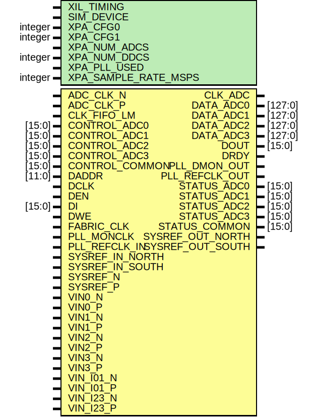

# Entity: HSADC

## Diagram

## Description

    Copyright (c) 1995/2017 Xilinx, Inc.
 
    Licensed under the Apache License, Version 2.0 (the "License");
    you may not use this file except in compliance with the License.
    You may obtain a copy of the License at
 
        http://www.apache.org/licenses/LICENSE-2.0
 
    Unless required by applicable law or agreed to in writing, software
    distributed under the License is distributed on an "AS IS" BASIS,
    WITHOUT WARRANTIES OR CONDITIONS OF ANY KIND, either express or implied.
    See the License for the specific language governing permissions and
    limitations under the License.
   ____  ____
  /   /\/   /
 /___/  \  /     Vendor      : Xilinx
 \   \   \/      Version     : 2018.1
  \   \          Description : Xilinx Unified Simulation Library Component
  /   /                        HSADC
 /___/   /\      Filename    : HSADC.v
 \   \  /  \
  \___\/\___\
  Revision:
  End Revision:
 
## Generics

| Generic name         | Type    | Value             | Description |
| -------------------- | ------- | ----------------- | ----------- |
| XIL_TIMING           |         | "UNPLACED"        |             |
| SIM_DEVICE           |         | "ULTRASCALE_PLUS" |             |
| XPA_CFG0             | integer | 0                 |             |
| XPA_CFG1             | integer | 0                 |             |
| XPA_NUM_ADCS         |         | "0"               |             |
| XPA_NUM_DDCS         | integer | 0                 |             |
| XPA_PLL_USED         |         | "No"              |             |
| XPA_SAMPLE_RATE_MSPS | integer | 0                 |             |
## Ports

| Port name        | Direction | Type    | Description |
| ---------------- | --------- | ------- | ----------- |
| CLK_ADC          | output    |         |             |
| DATA_ADC0        | output    | [127:0] |             |
| DATA_ADC1        | output    | [127:0] |             |
| DATA_ADC2        | output    | [127:0] |             |
| DATA_ADC3        | output    | [127:0] |             |
| DOUT             | output    | [15:0]  |             |
| DRDY             | output    |         |             |
| PLL_DMON_OUT     | output    |         |             |
| PLL_REFCLK_OUT   | output    |         |             |
| STATUS_ADC0      | output    | [15:0]  |             |
| STATUS_ADC1      | output    | [15:0]  |             |
| STATUS_ADC2      | output    | [15:0]  |             |
| STATUS_ADC3      | output    | [15:0]  |             |
| STATUS_COMMON    | output    | [15:0]  |             |
| SYSREF_OUT_NORTH | output    |         |             |
| SYSREF_OUT_SOUTH | output    |         |             |
| ADC_CLK_N        | input     |         |             |
| ADC_CLK_P        | input     |         |             |
| CLK_FIFO_LM      | input     |         |             |
| CONTROL_ADC0     | input     | [15:0]  |             |
| CONTROL_ADC1     | input     | [15:0]  |             |
| CONTROL_ADC2     | input     | [15:0]  |             |
| CONTROL_ADC3     | input     | [15:0]  |             |
| CONTROL_COMMON   | input     | [15:0]  |             |
| DADDR            | input     | [11:0]  |             |
| DCLK             | input     |         |             |
| DEN              | input     |         |             |
| DI               | input     | [15:0]  |             |
| DWE              | input     |         |             |
| FABRIC_CLK       | input     |         |             |
| PLL_MONCLK       | input     |         |             |
| PLL_REFCLK_IN    | input     |         |             |
| SYSREF_IN_NORTH  | input     |         |             |
| SYSREF_IN_SOUTH  | input     |         |             |
| SYSREF_N         | input     |         |             |
| SYSREF_P         | input     |         |             |
| VIN0_N           | input     |         |             |
| VIN0_P           | input     |         |             |
| VIN1_N           | input     |         |             |
| VIN1_P           | input     |         |             |
| VIN2_N           | input     |         |             |
| VIN2_P           | input     |         |             |
| VIN3_N           | input     |         |             |
| VIN3_P           | input     |         |             |
| VIN_I01_N        | input     |         |             |
| VIN_I01_P        | input     |         |             |
| VIN_I23_N        | input     |         |             |
| VIN_I23_P        | input     |         |             |
## Signals

| Name                  | Type         | Description |
| --------------------- | ------------ | ----------- |
| trig_attr             | reg          |             |
| attr_test             | reg          |             |
| attr_test             | reg          |             |
| attr_err              | reg          |             |
| glblGSR               | tri0         |             |
| CLK_ADC_SPARE_out     | wire         |             |
| CLK_ADC_out           | wire         |             |
| DRDY_out              | wire         |             |
| PLL_DMON_OUT_out      | wire         |             |
| PLL_REFCLK_OUT_out    | wire         |             |
| SYSREF_OUT_NORTH_out  | wire         |             |
| SYSREF_OUT_SOUTH_out  | wire         |             |
| DATA_ADC0_out         | wire [127:0] |             |
| DATA_ADC1_out         | wire [127:0] |             |
| DATA_ADC2_out         | wire [127:0] |             |
| DATA_ADC3_out         | wire [127:0] |             |
| DOUT_out              | wire [15:0]  |             |
| STATUS_ADC0_out       | wire [15:0]  |             |
| STATUS_ADC1_out       | wire [15:0]  |             |
| STATUS_ADC2_out       | wire [15:0]  |             |
| STATUS_ADC3_out       | wire [15:0]  |             |
| STATUS_COMMON_out     | wire [15:0]  |             |
| TEST_STATUS_out       | wire [15:0]  |             |
| PLL_SCAN_OUT_B_FD_out | wire [1:0]   |             |
| TEST_SO_out           | wire [299:0] |             |
| ADC_CLK_N_in          | wire         |             |
| ADC_CLK_P_in          | wire         |             |
| CLK_FIFO_LM_in        | wire         |             |
| DCLK_in               | wire         |             |
| DEN_in                | wire         |             |
| DWE_in                | wire         |             |
| FABRIC_CLK_in         | wire         |             |
| PLL_MONCLK_in         | wire         |             |
| PLL_REFCLK_IN_in      | wire         |             |
| PLL_SCAN_EN_B_FD_in   | wire         |             |
| PLL_SCAN_MODE_B_FD_in | wire         |             |
| PLL_SCAN_RST_EN_FD_in | wire         |             |
| SYSREF_IN_NORTH_in    | wire         |             |
| SYSREF_IN_SOUTH_in    | wire         |             |
| SYSREF_N_in           | wire         |             |
| SYSREF_P_in           | wire         |             |
| TEST_SCAN_MODE_B_in   | wire         |             |
| TEST_SCAN_RESET_in    | wire         |             |
| TEST_SE_B_in          | wire         |             |
| VIN0_N_in             | wire         |             |
| VIN0_P_in             | wire         |             |
| VIN1_N_in             | wire         |             |
| VIN1_P_in             | wire         |             |
| VIN2_N_in             | wire         |             |
| VIN2_P_in             | wire         |             |
| VIN3_N_in             | wire         |             |
| VIN3_P_in             | wire         |             |
| VIN_I01_N_in          | wire         |             |
| VIN_I01_P_in          | wire         |             |
| VIN_I23_N_in          | wire         |             |
| VIN_I23_P_in          | wire         |             |
| DADDR_in              | wire [11:0]  |             |
| CONTROL_ADC0_in       | wire [15:0]  |             |
| CONTROL_ADC1_in       | wire [15:0]  |             |
| CONTROL_ADC2_in       | wire [15:0]  |             |
| CONTROL_ADC3_in       | wire [15:0]  |             |
| CONTROL_COMMON_in     | wire [15:0]  |             |
| DI_in                 | wire [15:0]  |             |
| TEST_SCAN_CTRL_in     | wire [15:0]  |             |
| PLL_SCAN_CLK_FD_in    | wire [1:0]   |             |
| PLL_SCAN_IN_FD_in     | wire [1:0]   |             |
| TEST_SI_in            | wire [299:0] |             |
| TEST_SCAN_CLK_in      | wire [4:0]   |             |
| DCLK_delay            | wire         |             |
| DEN_delay             | wire         |             |
| DWE_delay             | wire         |             |
| DADDR_delay           | wire [11:0]  |             |
| DI_delay              | wire [15:0]  |             |
| VIN0_N_real           | real         |             |
| VIN0_P_real           | real         |             |
| VIN1_N_real           | real         |             |
| VIN1_P_real           | real         |             |
| VIN2_N_real           | real         |             |
| VIN2_P_real           | real         |             |
| VIN3_N_real           | real         |             |
| VIN3_P_real           | real         |             |
| VIN_I01_N_real        | real         |             |
| VIN_I01_P_real        | real         |             |
| VIN_I23_N_real        | real         |             |
| VIN_I23_P_real        | real         |             |
| notifier              | reg          |             |
## Constants

| Name                     | Type    | Value                | Description       |
| ------------------------ | ------- | -------------------- | ----------------- |
| MODULE_NAME              |         | "HSADC"              | define constants  |
| SIM_DEVICE_REG           | [152:1] | SIM_DEVICE           |                   |
| XPA_CFG0_REG             | [15:0]  | XPA_CFG0             |                   |
| XPA_CFG1_REG             | [15:0]  | XPA_CFG1             |                   |
| XPA_NUM_ADCS_REG         | [16:1]  | XPA_NUM_ADCS         |                   |
| XPA_NUM_DDCS_REG         | [2:0]   | XPA_NUM_DDCS         |                   |
| XPA_PLL_USED_REG         | [24:1]  | XPA_PLL_USED         |                   |
| XPA_SAMPLE_RATE_MSPS_REG | [13:0]  | XPA_SAMPLE_RATE_MSPS |                   |
## Processes
- unnamed: ( @ (trig_attr) )
- unnamed: (  )
- unnamed: (  )
- unnamed: (  )
- unnamed: (  )
- unnamed: (  )
- unnamed: (  )
- unnamed: (  )
- unnamed: (  )
- unnamed: (  )
- unnamed: (  )
- unnamed: (  )
- unnamed: (  )
- unnamed: (  )
- unnamed: (  )
- unnamed: (  )
- unnamed: (  )
- unnamed: (  )
- unnamed: (  )
- unnamed: (  )
- unnamed: (  )
- unnamed: (  )
- unnamed: (  )
- unnamed: (  )
- unnamed: (  )
- unnamed: (  )
- unnamed: (  )
- unnamed: (  )
- unnamed: (  )
- unnamed: (  )
- unnamed: (  )
- unnamed: (  )
- unnamed: (  )
- unnamed: (  )
- unnamed: (  )
- unnamed: (  )
- unnamed: (  )
- unnamed: (  )
- unnamed: (  )
- unnamed: (  )
- unnamed: (  )
- unnamed: (  )
- unnamed: (  )
- unnamed: (  )
- unnamed: (  )
- unnamed: (  )
- unnamed: (  )
- unnamed: (  )
- unnamed: (  )
- unnamed: (  )
- unnamed: (  )
- unnamed: (  )
- unnamed: (  )
- unnamed: (  )
- unnamed: (  )
- unnamed: (  )
- unnamed: (  )
- unnamed: (  )
- unnamed: (  )
- unnamed: (  )
- unnamed: (  )
- unnamed: (  )
- unnamed: (  )
- unnamed: (  )
- unnamed: (  )
- unnamed: (  )
- unnamed: (  )
- unnamed: (  )
- unnamed: (  )
- unnamed: (  )
- unnamed: (  )
- unnamed: (  )
- unnamed: (  )
- unnamed: (  )
- unnamed: (  )
- unnamed: (  )
- unnamed: (  )
- unnamed: (  )
- unnamed: (  )
- unnamed: (  )
- unnamed: (  )
- unnamed: (  )
- unnamed: (  )
- unnamed: (  )
- unnamed: (  )
## Instantiations

- SIP_HSADC_INST: SIP_HSADC
**Description**
tie off

