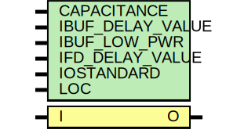

# Entity: IBUF

## Diagram

## Description

   Copyright (c) 1995/2004 Xilinx, Inc.
 
    Licensed under the Apache License, Version 2.0 (the "License");
    you may not use this file except in compliance with the License.
    You may obtain a copy of the License at
 
        http://www.apache.org/licenses/LICENSE-2.0
 
    Unless required by applicable law or agreed to in writing, software
    distributed under the License is distributed on an "AS IS" BASIS,
    WITHOUT WARRANTIES OR CONDITIONS OF ANY KIND, either express or implied.
    See the License for the specific language governing permissions and
    limitations under the License.
   ____  ____
  /   /\/   /
 /___/  \  /    Vendor : Xilinx
 \   \   \/     Version : 10.1
  \   \         Description : Xilinx Functional Simulation Library Component
  /   /                  Input Buffer
 /___/   /\     Filename : IBUF.v
 \   \  /  \    Timestamp : Thu Mar 25 16:42:23 PST 2004
  \___\/\___\
 Revision:
    03/23/04 - Initial version.
    05/23/07 - Changed timescale to 1 ps / 1 ps.
    07/16/08 - Added IBUF_LOW_PWR attribute.
    04/22/09 - CR 519127 - Changed IBUF_LOW_PWR default to TRUE.
    12/13/11 - Added `celldefine and `endcelldefine (CR 524859).
    10/22/14 - Added #1 to $finish (CR 808642).
 End Revision
 
## Generics

| Generic name     | Type | Value       | Description |
| ---------------- | ---- | ----------- | ----------- |
| CAPACITANCE      |      | "DONT_CARE" |             |
| IBUF_DELAY_VALUE |      | "0"         |             |
| IBUF_LOW_PWR     |      | "TRUE"      |             |
| IFD_DELAY_VALUE  |      | "AUTO"      |             |
| IOSTANDARD       |      | "DEFAULT"   |             |
| LOC              |      | " UNPLACED" |             |
## Ports

| Port name | Direction | Type | Description |
| --------- | --------- | ---- | ----------- |
| O         | output    |      |             |
| I         | input     |      |             |
