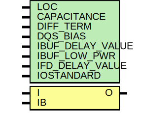

# Entity: IBUFDS

## Diagram

## Description

   Copyright (c) 1995/2004 Xilinx, Inc.
 
    Licensed under the Apache License, Version 2.0 (the "License");
    you may not use this file except in compliance with the License.
    You may obtain a copy of the License at
 
        http://www.apache.org/licenses/LICENSE-2.0
 
    Unless required by applicable law or agreed to in writing, software
    distributed under the License is distributed on an "AS IS" BASIS,
    WITHOUT WARRANTIES OR CONDITIONS OF ANY KIND, either express or implied.
    See the License for the specific language governing permissions and
    limitations under the License.
   ____  ____
  /   /\/   /
 /___/  \  /    Vendor : Xilinx
 \   \   \/     Version : 10.1
  \   \         Description : Xilinx Unified Simulation Library Component
  /   /                  Differential Signaling Input Buffer
 /___/   /\     Filename : IBUFDS.v
 \   \  /  \
  \___\/\___\
 Revision:
    03/23/04 - Initial version.
    03/11/05 - Add LOC paramter;
    07/21/05 - CR 212974 -- matched unisim parameters as requested by other tools
    07/19/06 - Add else to handle x case for o_out (CR 234718).
    12/13/11 - Added `celldefine and `endcelldefine (CR 524859).
    07/13/12 - 669215 - add parameter DQS_BIAS
    08/29/12 - 675511 - add DQS_BIAS functionality
    09/11/12 - 677753 - remove X glitch on O
    10/22/14 - Added #1 to $finish (CR 808642).
 End Revision
 
## Generics

| Generic name     | Type | Value       | Description |
| ---------------- | ---- | ----------- | ----------- |
| LOC              |      | "UNPLACED"  |             |
| CAPACITANCE      |      | "DONT_CARE" |             |
| DIFF_TERM        |      | "FALSE"     |             |
| DQS_BIAS         |      | "FALSE"     |             |
| IBUF_DELAY_VALUE |      | "0"         |             |
| IBUF_LOW_PWR     |      | "TRUE"      |             |
| IFD_DELAY_VALUE  |      | "AUTO"      |             |
| IOSTANDARD       |      | "DEFAULT"   |             |
## Ports

| Port name | Direction | Type | Description |
| --------- | --------- | ---- | ----------- |
| O         | output    |      |             |
| I         | input     |      |             |
|  IB       | input     |      |             |
## Signals

| Name            | Type | Description |
| --------------- | ---- | ----------- |
| i_in            | wire |             |
| ib_in           | wire |             |
| o_out           | reg  |             |
| DQS_BIAS_BINARY | reg  |             |
## Constants

| Name        | Type | Value    | Description |
| ----------- | ---- | -------- | ----------- |
| MODULE_NAME |      | "IBUFDS" |             |
## Processes
- unnamed: ( @(i_in or ib_in or DQS_BIAS_BINARY) )
