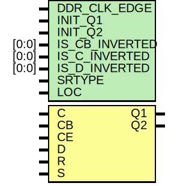

# Entity: IDDR_2CLK

## Diagram

## Description

   Copyright (c) 1995/2006 Xilinx, Inc.
 
    Licensed under the Apache License, Version 2.0 (the "License");
    you may not use this file except in compliance with the License.
    You may obtain a copy of the License at
 
        http://www.apache.org/licenses/LICENSE-2.0
 
    Unless required by applicable law or agreed to in writing, software
    distributed under the License is distributed on an "AS IS" BASIS,
    WITHOUT WARRANTIES OR CONDITIONS OF ANY KIND, either express or implied.
    See the License for the specific language governing permissions and
    limitations under the License.
   ____  ____
  /   /\/   /
 /___/  \  /    Vendor : Xilinx
 \   \   \/     Version : 8.1i 
  \   \         Description : Xilinx Timing Simulation Library Component
  /   /                  Input Dual Data-Rate Register with Dual Clock inputs
 /___/   /\     Filename : IDDR_2CLK.v
 \   \  /  \    Timestamp : Mon Jun 26 16:44:06 PST 2006
  \___\/\___\
 Revision:
    06/26/06 - Initial version.
    05/29/07 - Added wire declaration for internal signals
    04/15/08 - CR 468871 Negative SetupHold fix
    12/13/11 - Added `celldefine and `endcelldefine (CR 524859).
    08/23/13 - PR683925 - add invertible pin support.
    10/22/14 - Added #1 to $finish (CR 808642).
 End Revision
 
## Generics

| Generic name   | Type  | Value           | Description |
| -------------- | ----- | --------------- | ----------- |
| DDR_CLK_EDGE   |       | "OPPOSITE_EDGE" |             |
| INIT_Q1        |       | 1'b0            |             |
| INIT_Q2        |       | 1'b0            |             |
| IS_CB_INVERTED | [0:0] | 1'b0            |             |
| IS_C_INVERTED  | [0:0] | 1'b0            |             |
| IS_D_INVERTED  | [0:0] | 1'b0            |             |
| SRTYPE         |       | "SYNC"          |             |
| LOC            |       | "UNPLACED"      |             |
## Ports

| Port name | Direction | Type | Description |
| --------- | --------- | ---- | ----------- |
| Q1        | output    |      |             |
| Q2        | output    |      |             |
| C         | input     |      |             |
| CB        | input     |      |             |
| CE        | input     |      |             |
| D         | input     |      |             |
| R         | input     |      |             |
| S         | input     |      |             |
## Signals

| Name                 | Type | Description |
| -------------------- | ---- | ----------- |
| q1_out               | reg  |             |
| q2_out               | reg  |             |
| q1_out_int           | reg  |             |
| q2_out_int           | reg  |             |
| q1_out_pipelined     | reg  |             |
| q2_out_same_edge_int | reg  |             |
| notifier             | reg  |             |
| notifier1            | reg  |             |
| notifier2            | reg  |             |
| c_in                 | wire |             |
| delay_c              | wire |             |
| cb_in                | wire |             |
| delay_cb             | wire |             |
| ce_in                | wire |             |
| delay_ce             | wire |             |
| d_in                 | wire |             |
| delay_d              | wire |             |
| gsr_in               | wire |             |
| r_in                 | wire |             |
| delay_r              | wire |             |
| s_in                 | wire |             |
| delay_s              | wire |             |
| GSR                  | tri0 |             |
| c_en_n               | wire |             |
| c_en_p               | wire |             |
| cb_en_n              | wire |             |
| cb_en_p              | wire |             |
## Processes
- unnamed: ( @(gsr_in or r_in or s_in) )
**Description**
initial begin

- unnamed: ( @(posedge c_in) )
**Description**
always @ (gsr_in or r_in or s_in)

- unnamed: ( @(posedge cb_in) )
**Description**
always @ (posedge c_in)

- unnamed: ( @(posedge c_in or posedge cb_in, q1_out_int or q2_out_int or q2_out_same_edge_int or q1_out_pipelined) )
**Description**
always @ (posedge cb_in)

- unnamed: ( @(notifier or notifier1) )
- unnamed: ( @(notifier or notifier2) )
