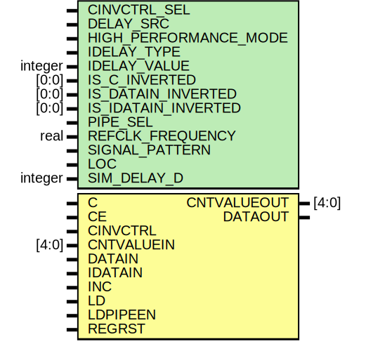

# Entity: IDELAYE2

## Diagram

## Description

   Copyright (c) 1995/2004 Xilinx, Inc.
 
    Licensed under the Apache License, Version 2.0 (the "License");
    you may not use this file except in compliance with the License.
    You may obtain a copy of the License at
 
        http://www.apache.org/licenses/LICENSE-2.0
 
    Unless required by applicable law or agreed to in writing, software
    distributed under the License is distributed on an "AS IS" BASIS,
    WITHOUT WARRANTIES OR CONDITIONS OF ANY KIND, either express or implied.
    See the License for the specific language governing permissions and
    limitations under the License.
   ____  ____
  /   /\/   /
 /___/  \  /    Vendor : Xilinx
 \   \   \/     Version : 12.0
  \   \         Description : Xilinx Functional and Timing Simulation Library Component
  /   /                  Input Fixed or Variable Delay Element.
 /___/   /\     Filename : IDELAYE2.v
 \   \  /  \    Timestamp : Sat Sep 19 14:17:57 PDT 2009
  \___\/\___\
 Revision:
    09/19/09 - Initial version.
    12/13/11 - Added `celldefine and `endcelldefine (CR 524859).
    10/22/14 - Added #1 to $finish (CR 808642).
 End Revision
 
## Generics

| Generic name          | Type    | Value      | Description |
| --------------------- | ------- | ---------- | ----------- |
| CINVCTRL_SEL          |         | "FALSE"    |             |
| DELAY_SRC             |         | "IDATAIN"  |             |
| HIGH_PERFORMANCE_MODE |         | "FALSE"    |             |
| IDELAY_TYPE           |         | "FIXED"    |             |
| IDELAY_VALUE          | integer | 0          |             |
| IS_C_INVERTED         | [0:0]   | 1'b0       |             |
| IS_DATAIN_INVERTED    | [0:0]   | 1'b0       |             |
| IS_IDATAIN_INVERTED   | [0:0]   | 1'b0       |             |
| PIPE_SEL              |         | "FALSE"    |             |
| REFCLK_FREQUENCY      | real    | 200.0      |             |
| SIGNAL_PATTERN        |         | "DATA"     |             |
| LOC                   |         | "UNPLACED" |             |
| SIM_DELAY_D           | integer | 0          |             |
## Ports

| Port name   | Direction | Type  | Description       |
| ----------- | --------- | ----- | ----------------- |
| CNTVALUEOUT | output    | [4:0] | ifndef XIL_TIMING |
| DATAOUT     | output    |       |                   |
| C           | input     |       |                   |
| CE          | input     |       |                   |
| CINVCTRL    | input     |       |                   |
| CNTVALUEIN  | input     | [4:0] |                   |
| DATAIN      | input     |       |                   |
| IDATAIN     | input     |       |                   |
| INC         | input     |       |                   |
| LD          | input     |       |                   |
| LDPIPEEN    | input     |       |                   |
| REGRST      | input     |       |                   |
## Signals

| Name               | Type       | Description |
| ------------------ | ---------- | ----------- |
| DELAY_D            | integer    |             |
| GSR                | tri0       |             |
| CALC_TAPDELAY      | real       |             |
| INIT_DELAY         | real       |             |
| idelay_count       | integer    |             |
| CNTVALUEIN_INTEGER | integer    |             |
| cntvalueout_pre    | reg [4:0]  |             |
| notifier           | reg        |             |
| data_mux           | reg        |             |
| tap_out            | reg        |             |
| DATAOUT_reg        | reg        |             |
| delay_chain_0      | wire       |             |
| delay_chain_1      | wire       |             |
| delay_chain_2      | wire       |             |
| delay_chain_3      | wire       |             |
| delay_chain_4      | wire       |             |
| delay_chain_5      | wire       |             |
| delay_chain_6      | wire       |             |
| delay_chain_7      | wire       |             |
| delay_chain_8      | wire       |             |
| delay_chain_9      | wire       |             |
| delay_chain_10     | wire       |             |
| delay_chain_11     | wire       |             |
| delay_chain_12     | wire       |             |
| delay_chain_13     | wire       |             |
| delay_chain_14     | wire       |             |
| delay_chain_15     | wire       |             |
| delay_chain_16     | wire       |             |
| delay_chain_17     | wire       |             |
| delay_chain_18     | wire       |             |
| delay_chain_19     | wire       |             |
| delay_chain_20     | wire       |             |
| delay_chain_21     | wire       |             |
| delay_chain_22     | wire       |             |
| delay_chain_23     | wire       |             |
| delay_chain_24     | wire       |             |
| delay_chain_25     | wire       |             |
| delay_chain_26     | wire       |             |
| delay_chain_27     | wire       |             |
| delay_chain_28     | wire       |             |
| delay_chain_29     | wire       |             |
| delay_chain_30     | wire       |             |
| delay_chain_31     | wire       |             |
| c_in               | reg        |             |
| ce_in              | wire       |             |
| delay_CE           | wire       |             |
| delay_C            | wire       |             |
| clkin_in           | wire       |             |
| cntvaluein_in      | wire [4:0] |             |
| delay_CNTVALUEIN   | wire [4:0] |             |
| datain_in          | wire       |             |
| delay_DATAIN       | wire       |             |
| gsr_in             | wire       |             |
| idatain_in         | wire       |             |
| delay_IDATAIN      | wire       |             |
| inc_in             | wire       |             |
| delay_INC          | wire       |             |
| odatain_in         | wire       |             |
| ld_in              | wire       |             |
| delay_LD           | wire       |             |
| t_in               | wire       |             |
| cinvctrl_in        | wire       |             |
| delay_CINVCTRL     | wire       |             |
| ldpipeen_in        | wire       |             |
| delay_LDPIPEEN     | wire       |             |
| regrst_in          | wire       |             |
| delay_REGRST       | wire       |             |
| c_in_pre           | wire       |             |
| qcntvalueout_reg   | reg [4:0]  |             |
| qcntvalueout_mux   | reg [4:0]  |             |
| c_en_n             | wire       |             |
| c_en_p             | wire       |             |
| d_en               | wire       |             |
| id_en              | wire       |             |
## Constants

| Name                  | Type | Value       | Description |
| --------------------- | ---- | ----------- | ----------- |
| DELAY_D               |      | SIM_DELAY_D |             |
| MAX_DELAY_COUNT       |      | 31          |             |
| MIN_DELAY_COUNT       |      | 0           |             |
| MAX_REFCLK_FREQUENCYL |      | 210.0       |             |
| MIN_REFCLK_FREQUENCYL |      | 190.0       |             |
| MAX_REFCLK_FREQUENCYH |      | 410.0       |             |
| MIN_REFCLK_FREQUENCYH |      | 290.0       |             |
## Processes
- unnamed: ( @(tap_out) )
**Description**
CR 587496
assign #INIT_DELAY DATAOUT = tap_out;

- unnamed: ( @(gsr_in) )
- unnamed: ( @(idelay_count) )
- unnamed: ( @(posedge c_in) )
- unnamed: ( @(posedge c_in) )
- unnamed: ( @(cntvaluein_in or gsr_in) )
**Description**
always @ (posedge c_in)

- unnamed: ( @(datain_in or idatain_in) )
- unnamed: ( @(idelay_count) )
- unnamed: ( @(notifier) )
