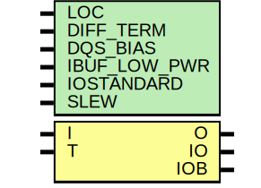

# Entity: IOBUFDS

## Diagram

## Description

   Copyright (c) 1995/2004 Xilinx, Inc.
 
    Licensed under the Apache License, Version 2.0 (the "License");
    you may not use this file except in compliance with the License.
    You may obtain a copy of the License at
 
        http://www.apache.org/licenses/LICENSE-2.0
 
    Unless required by applicable law or agreed to in writing, software
    distributed under the License is distributed on an "AS IS" BASIS,
    WITHOUT WARRANTIES OR CONDITIONS OF ANY KIND, either express or implied.
    See the License for the specific language governing permissions and
    limitations under the License.
   ____  ____
  /   /\/   /
 /___/  \  /    Vendor : Xilinx
 \   \   \/     Version : 10.1
  \   \         Description : Xilinx Unified Simulation Library Component
  /   /                  3-State Diffential Signaling I/O Buffer
 /___/   /\     Filename : IOBUFDS.v
 \   \  /  \
  \___\/\___\
 Revision:
    03/23/04 - Initial version.
    05/23/07 - Changed timescale to 1 ps / 1 ps.
    05/23/07 - Added wire declaration for internal signals.
    07/26/07 - Add else to handle x case for o_out (CR 424214). 
    07/16/08 - Added IBUF_LOW_PWR attribute.
    03/19/09 - CR 511590 - Added Z condition handling
    04/22/09 - CR 519127 - Changed IBUF_LOW_PWR default to TRUE.
    10/14/09 - CR 535630 - Added DIFF_TERM attribute.
    05/12/10 - CR 559468 - Added DRC warnings for LVDS_25 bus architectures.
    12/01/10 - CR 584500 - added attribute SLEW
    08/08/11 - CR 616816 - ncsim compile error during XIL_TIMING
    12/13/11 - Added `celldefine and `endcelldefine (CR 524859).
    07/13/12 - 669215 - add parameter DQS_BIAS
    08/28/12 - 675511 - add DQS_BIAS functionality
    09/11/12 - 677753 - remove X glitch on O
    10/22/14 - Added #1 to $finish (CR 808642).
 End Revision
 
## Generics

| Generic name | Type | Value      | Description        |
| ------------ | ---- | ---------- | ------------------ |
| LOC          |      | "UNPLACED" |                    |
| DIFF_TERM    |      | "FALSE"    | `ifdef XIL_TIMING  |
| DQS_BIAS     |      | "FALSE"    |                    |
| IBUF_LOW_PWR |      | "TRUE"     |                    |
| IOSTANDARD   |      | "DEFAULT"  |                    |
| SLEW         |      | "SLOW"     |                    |
## Ports

| Port name | Direction | Type | Description |
| --------- | --------- | ---- | ----------- |
| O         | output    |      |             |
| IO        | inout     |      |             |
|  IOB      | inout     |      |             |
| I         | input     |      |             |
|  T        | input     |      |             |
## Signals

| Name            | Type | Description |
| --------------- | ---- | ----------- |
| i_in            | wire |             |
| io_in           | wire |             |
| iob_in          | wire |             |
| t_in            | wire |             |
| o_out           | reg  |             |
| io_out          | reg  |             |
| iob_out         | reg  |             |
| O_int           | reg  |             |
| DQS_BIAS_BINARY | reg  |             |
| t_or_gts        | wire |             |
| GTS             | tri0 |             |
## Constants

| Name        | Type | Value     | Description |
| ----------- | ---- | --------- | ----------- |
| MODULE_NAME |      | "IOBUFDS" |             |
## Processes
- unnamed: ( @(io_in or iob_in or DQS_BIAS_BINARY) )
