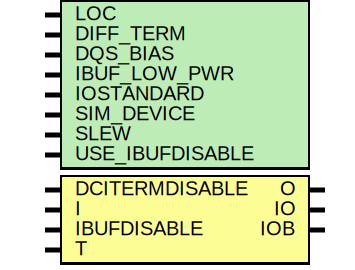

# Entity: IOBUFDS_DCIEN

## Diagram

## Description

   Copyright (c) 1995/2010 Xilinx, Inc.
 
    Licensed under the Apache License, Version 2.0 (the "License");
    you may not use this file except in compliance with the License.
    You may obtain a copy of the License at
 
        http://www.apache.org/licenses/LICENSE-2.0
 
    Unless required by applicable law or agreed to in writing, software
    distributed under the License is distributed on an "AS IS" BASIS,
    WITHOUT WARRANTIES OR CONDITIONS OF ANY KIND, either express or implied.
    See the License for the specific language governing permissions and
    limitations under the License.
   ____  ____
  /   /\/   /
 /___/  \  /    Vendor : Xilinx
 \   \   \/     Version : 13.1
  \   \         Description : Xilinx Unified Simulation Library Component
  /   /                  3-State Diffential Signaling I/O Buffer
 /___/   /\     Filename : IOBUFDS_DCIEN.v
 \   \  /  \
  \___\/\___\
 Revision:
    12/08/10 - Initial version.
    03/28/11 - CR 603466 fix
    06/15/11 - CR 613347 -- made ouput logic_1 when IBUFDISABLE is active
    08/31/11 - CR 623170 -- Tristate powergating support
    09/20/11 - CR 624774, 625725 -- Removed attributes IBUF_DELAY_VALUE, IFD_DELAY_VALUE and CAPACITANCE
    09/20/11 - CR 625564 -- Fixed Tristate powergating polarity
    12/13/11 - Added `celldefine and `endcelldefine (CR 524859).
    07/10/12 - 669215 - add parameter DQS_BIAS
    08/29/12 - 675511 - add DQS_BIAS functionality
    09/11/12 - 677753 - remove X glitch on O
    10/22/14 - Added #1 to $finish (CR 808642).
 End Revision
 
## Generics

| Generic name    | Type | Value      | Description        |
| --------------- | ---- | ---------- | ------------------ |
| LOC             |      | "UNPLACED" |                    |
| DIFF_TERM       |      | "FALSE"    | `ifdef XIL_TIMING  |
| DQS_BIAS        |      | "FALSE"    |                    |
| IBUF_LOW_PWR    |      | "TRUE"     |                    |
| IOSTANDARD      |      | "DEFAULT"  |                    |
| SIM_DEVICE      |      | "7SERIES"  |                    |
| SLEW            |      | "SLOW"     |                    |
| USE_IBUFDISABLE |      | "TRUE"     |                    |
## Ports

| Port name      | Direction | Type | Description |
| -------------- | --------- | ---- | ----------- |
| O              | output    |      |             |
| IO             | inout     |      |             |
| IOB            | inout     |      |             |
| DCITERMDISABLE | input     |      |             |
| I              | input     |      |             |
| IBUFDISABLE    | input     |      |             |
| T              | input     |      |             |
## Signals

| Name                   | Type | Description |
| ---------------------- | ---- | ----------- |
| i_in                   | wire |             |
| io_in                  | wire |             |
| iob_in                 | wire |             |
| ibufdisable_in         | wire |             |
| dcitermdisable_in      | wire |             |
| t_in                   | wire |             |
| out_val                | wire |             |
| o_out                  | reg  |             |
| io_out                 | reg  |             |
| iob_out                | reg  |             |
| O_int                  | reg  |             |
| DQS_BIAS_BINARY        | reg  |             |
| USE_IBUFDISABLE_BINARY | reg  |             |
| t_or_gts               | wire |             |
| not_t_or_ibufdisable   | wire |             |
| GTS                    | tri0 |             |
## Constants

| Name        | Type | Value           | Description |
| ----------- | ---- | --------------- | ----------- |
| MODULE_NAME |      | "IOBUFDS_DCIEN" |             |
## Processes
- unnamed: ( @(io_in or iob_in or DQS_BIAS_BINARY) )
