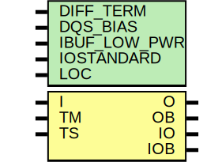

# Entity: IOBUFDS_DIFF_OUT

## Diagram

## Description

   Copyright (c) 1995/2004 Xilinx, Inc.
 
    Licensed under the Apache License, Version 2.0 (the "License");
    you may not use this file except in compliance with the License.
    You may obtain a copy of the License at
 
        http://www.apache.org/licenses/LICENSE-2.0
 
    Unless required by applicable law or agreed to in writing, software
    distributed under the License is distributed on an "AS IS" BASIS,
    WITHOUT WARRANTIES OR CONDITIONS OF ANY KIND, either express or implied.
    See the License for the specific language governing permissions and
    limitations under the License.
   ____  ____
  /   /\/   /
 /___/  \  /    Vendor : Xilinx
 \   \   \/     Version : 12.0
  \   \         Description : Xilinx Functional and Timing Simulation Library Component
  /   /                  3-State Diffential Signaling I/O Buffer
 /___/   /\     Filename : IOBUFDS_DIFF_OUT.v
 \   \  /  \    Timestamp : Tue May 26 17:09:31 PDT 2009
  \___\/\___\
 Revision:
    05/26/09 - Initial version.
    12/13/11 - Added `celldefine and `endcelldefine (CR 524859).
    10/22/14 - Added #1 to $finish (CR 808642).
 End Revision
 
## Generics

| Generic name | Type | Value      | Description |
| ------------ | ---- | ---------- | ----------- |
| DIFF_TERM    |      | "FALSE"    |             |
| DQS_BIAS     |      | "FALSE"    |             |
| IBUF_LOW_PWR |      | "TRUE"     |             |
| IOSTANDARD   |      | "DEFAULT"  |             |
| LOC          |      | "UNPLACED" |             |
## Ports

| Port name | Direction | Type | Description |
| --------- | --------- | ---- | ----------- |
| O         | output    |      |             |
| OB        | output    |      |             |
| IO        | inout     |      |             |
| IOB       | inout     |      |             |
| I         | input     |      |             |
| TM        | input     |      |             |
| TS        | input     |      |             |
## Signals

| Name            | Type | Description |
| --------------- | ---- | ----------- |
| t1              | wire |             |
| t2              | wire |             |
| DQS_BIAS_BINARY | reg  |             |
| GTS             | tri0 |             |
| O_out           | reg  |             |
| OB_out          | reg  |             |
## Processes
- unnamed: ( @(IO or IOB or DQS_BIAS_BINARY) )
