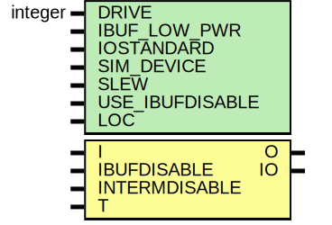

# Entity: IOBUF_INTERMDISABLE

## Diagram

## Description

   Copyright (c) 1995/2011 Xilinx, Inc.
 
    Licensed under the Apache License, Version 2.0 (the "License");
    you may not use this file except in compliance with the License.
    You may obtain a copy of the License at
 
        http://www.apache.org/licenses/LICENSE-2.0
 
    Unless required by applicable law or agreed to in writing, software
    distributed under the License is distributed on an "AS IS" BASIS,
    WITHOUT WARRANTIES OR CONDITIONS OF ANY KIND, either express or implied.
    See the License for the specific language governing permissions and
    limitations under the License.
   ____  ____
  /   /\/   /
 /___/  \  /    Vendor : Xilinx
 \   \   \/     Version : 13.1
  \   \         Description : Xilinx Functional Simulation Library Component
  /   /                  Bi-Directional Buffer
 /___/   /\     Filename : IOBUF_INTERMDISABLE.v
 \   \  /  \    Timestamp : Wed Apr 20 17:49:56 PDT 2011
  \___\/\___\
 Revision:
    04/20/11 - Initial version.
    06/15/11 - CR 613347 -- made ouput logic_1 when IBUFDISABLE is active
    08/31/11 - CR 623170 -- Tristate powergating support
    09/20/11 - CR 624774, 625725 -- Removed attributes IBUF_DELAY_VALUE, IFD_DELAY_VALUE and CAPACITANCE
    09/20/11 - CR 625564 -- Fixed Tristate powergating polarity
    12/13/11 - Added `celldefine and `endcelldefine (CR 524859).
    10/22/14 - Added #1 to $finish (CR 808642).
 End Revision
 
## Generics

| Generic name    | Type    | Value      | Description |
| --------------- | ------- | ---------- | ----------- |
| DRIVE           | integer | 12         |             |
| IBUF_LOW_PWR    |         | "TRUE"     |             |
| IOSTANDARD      |         | "DEFAULT"  |             |
| SIM_DEVICE      |         | "7SERIES"  |             |
| SLEW            |         | "SLOW"     |             |
| USE_IBUFDISABLE |         | "TRUE"     |             |
| LOC             |         | "UNPLACED" |             |
## Ports

| Port name     | Direction | Type | Description       |
| ------------- | --------- | ---- | ----------------- |
| O             | output    |      | `ifdef XIL_TIMING |
| IO            | inout     |      |                   |
| I             | input     |      |                   |
| IBUFDISABLE   | input     |      |                   |
| INTERMDISABLE | input     |      |                   |
| T             | input     |      |                   |
## Signals

| Name             | Type | Description |
| ---------------- | ---- | ----------- |
| ts               | wire |             |
| out_val          | wire |             |
| T_OR_IBUFDISABLE | wire |             |
| GTS              | tri0 |             |
## Constants

| Name        | Type | Value                 | Description       |
| ----------- | ---- | --------------------- | ----------------- |
| MODULE_NAME |      | "IOBUF_INTERMDISABLE" | define constants  |
