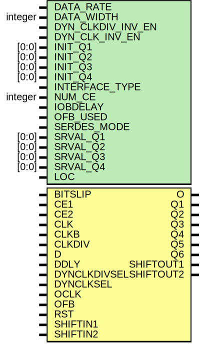

# Entity: ISERDESE1

## Diagram

## Description

   Copyright (c) 1995/2007 Xilinx, Inc.
 
    Licensed under the Apache License, Version 2.0 (the "License");
    you may not use this file except in compliance with the License.
    You may obtain a copy of the License at
 
        http://www.apache.org/licenses/LICENSE-2.0
 
    Unless required by applicable law or agreed to in writing, software
    distributed under the License is distributed on an "AS IS" BASIS,
    WITHOUT WARRANTIES OR CONDITIONS OF ANY KIND, either express or implied.
    See the License for the specific language governing permissions and
    limitations under the License.
   ____  ____
  /   /\/   /
 /___/  \  /    Vendor : Xilinx
 \   \   \/     Version : 12.0
  \   \         Description : Xilinx Functional and Timing Simulation Library Component
  /   /                  Source Synchronous Input Deserializer for Virtex6
 /___/   /\     Filename : ISERDESE1.v
 \   \  /  \    Timestamp : Tue May 26 15:42:08 PDT 2009
  \___\/\___\
 Revision:
    05/26/09 - Initial version.
    12/13/11 - Added `celldefine and `endcelldefine (CR 524859).
    10/22/14 - Added #1 to $finish (CR 808642).
 End Revision
 
## Generics

| Generic name      | Type    | Value      | Description |
| ----------------- | ------- | ---------- | ----------- |
| DATA_RATE         |         | "DDR"      |             |
| DATA_WIDTH        | integer | 4          |             |
| DYN_CLKDIV_INV_EN |         | "FALSE"    |             |
| DYN_CLK_INV_EN    |         | "FALSE"    |             |
| INIT_Q1           | [0:0]   | 1'b0       |             |
| INIT_Q2           | [0:0]   | 1'b0       |             |
| INIT_Q3           | [0:0]   | 1'b0       |             |
| INIT_Q4           | [0:0]   | 1'b0       |             |
| INTERFACE_TYPE    |         | "MEMORY"   |             |
| NUM_CE            | integer | 2          |             |
| IOBDELAY          |         | "NONE"     |             |
| OFB_USED          |         | "FALSE"    |             |
| SERDES_MODE       |         | "MASTER"   |             |
| SRVAL_Q1          | [0:0]   | 1'b0       |             |
| SRVAL_Q2          | [0:0]   | 1'b0       |             |
| SRVAL_Q3          | [0:0]   | 1'b0       |             |
| SRVAL_Q4          | [0:0]   | 1'b0       |             |
| LOC               |         | "UNPLACED" |             |
## Ports

| Port name    | Direction | Type | Description |
| ------------ | --------- | ---- | ----------- |
| O            | output    |      |             |
| Q1           | output    |      |             |
| Q2           | output    |      |             |
| Q3           | output    |      |             |
| Q4           | output    |      |             |
| Q5           | output    |      |             |
| Q6           | output    |      |             |
| SHIFTOUT1    | output    |      |             |
| SHIFTOUT2    | output    |      |             |
| BITSLIP      | input     |      |             |
| CE1          | input     |      |             |
| CE2          | input     |      |             |
| CLK          | input     |      |             |
| CLKB         | input     |      |             |
| CLKDIV       | input     |      |             |
| D            | input     |      |             |
| DDLY         | input     |      |             |
| DYNCLKDIVSEL | input     |      |             |
| DYNCLKSEL    | input     |      |             |
| OCLK         | input     |      |             |
| OFB          | input     |      |             |
| RST          | input     |      |             |
| SHIFTIN1     | input     |      |             |
| SHIFTIN2     | input     |      |             |
## Signals

| Name               | Type       | Description                                            |
| ------------------ | ---------- | ------------------------------------------------------ |
| SRTYPE             | wire [1:0] |                                                        |
| DDR_CLK_EDGE       | wire [1:0] |                                                        |
| SERDES             | wire       |                                                        |
| TFB                | wire       |                                                        |
| RANK12_DLY         | wire       | CR 541284    wire OVERSAMPLE, RANK12_DLY, RANK23_DLY;  |
| RANK23_DLY         | wire       | CR 541284    wire OVERSAMPLE, RANK12_DLY, RANK23_DLY;  |
| D_EMU              | wire       |                                                        |
| OVERSAMPLE         | reg        | CR 541284 assign OVERSAMPLE = 1'b0;                    |
| o_out              | reg        | Output signals                                         |
| q1_out             | reg        | Output signals                                         |
| q2_out             | reg        | Output signals                                         |
| q3_out             | reg        | Output signals                                         |
| q4_out             | reg        | Output signals                                         |
| q5_out             | reg        | Output signals                                         |
| q6_out             | reg        | Output signals                                         |
| shiftout1_out      | wire       |                                                        |
| shiftout2_out      | wire       |                                                        |
| q1rnk1             | reg        |                                                        |
| q2nrnk1            | reg        |                                                        |
| q1prnk1            | reg        |                                                        |
| q2prnk1            | reg        |                                                        |
| q3rnk1             | reg        |                                                        |
| q4rnk1             | reg        |                                                        |
| q5rnk1             | reg        |                                                        |
| q6rnk1             | reg        |                                                        |
| q6prnk1            | reg        |                                                        |
| q1rnk2             | reg        |                                                        |
| q2rnk2             | reg        |                                                        |
| q3rnk2             | reg        |                                                        |
| q4rnk2             | reg        |                                                        |
| q5rnk2             | reg        |                                                        |
| q6rnk2             | reg        |                                                        |
| q1rnk3             | reg        |                                                        |
| q2rnk3             | reg        |                                                        |
| q3rnk3             | reg        |                                                        |
| q4rnk3             | reg        |                                                        |
| q5rnk3             | reg        |                                                        |
| q6rnk3             | reg        |                                                        |
| dataq3rnk1         | reg        |                                                        |
| dataq4rnk1         | reg        |                                                        |
| dataq5rnk1         | reg        |                                                        |
| dataq6rnk1         | reg        |                                                        |
| dataq1rnk2         | reg        |                                                        |
| dataq2rnk2         | reg        |                                                        |
| dataq3rnk2         | reg        |                                                        |
| dataq4rnk2         | reg        |                                                        |
| dataq5rnk2         | reg        |                                                        |
| dataq6rnk2         | reg        |                                                        |
| memmux             | reg        |                                                        |
| q2pmux             | reg        |                                                        |
| clkmux1            | reg        |                                                        |
| clkmux2            | reg        |                                                        |
| clkmux3            | reg        |                                                        |
| clkmux4            | reg        |                                                        |
| clkoimux           | reg        |                                                        |
| oclkoimux          | reg        |                                                        |
| clkdivoimux        | reg        |                                                        |
| clkboimux          | reg        |                                                        |
| oclkboimux         | reg        |                                                        |
| clkdivboimux       | reg        |                                                        |
| clkdivmux1         | reg        |                                                        |
| clkdivmux2         | reg        |                                                        |
| ddr3clkmux         | reg        |                                                        |
| rank3clkmux        | reg        |                                                        |
| c23                | reg        |                                                        |
| c45                | reg        |                                                        |
| c67                | reg        |                                                        |
| sel                | reg [1:0]  |                                                        |
| selrnk3            | wire [3:0] |                                                        |
| cntr               | wire [4:0] |                                                        |
| sel1               | wire [1:0] |                                                        |
| bsmux              | wire [3:0] |                                                        |
| ice                | wire       |                                                        |
| muxc               | wire       |                                                        |
| clkdiv_int         | wire       |                                                        |
| clkdivsel          | wire [1:0] |                                                        |
| bitslip_en         | wire       |                                                        |
| int_typ            | wire       |                                                        |
| os_en              | wire [1:0] |                                                        |
| rank2_cksel        | wire [2:0] |                                                        |
| data_in            | reg        |                                                        |
| o_out_pre_fb       | reg        |                                                        |
| o_delay_pre_fb     | reg        |                                                        |
| data_rate_int      | reg        |                                                        |
| data_width_int     | reg [3:0]  |                                                        |
| dyn_clkdiv_inv_int | reg        |                                                        |
| dyn_clk_inv_int    | reg        |                                                        |
| dyn_oclk_inv_int   | reg        |                                                        |
| ofb_used_int       | reg        |                                                        |
| num_ce_int         | reg        |                                                        |
| serdes_mode_int    | reg        |                                                        |
| interface_type_int | reg [1:0]  |                                                        |
| notifier           | reg        |                                                        |
| GSR                | tri0       | Other signals                                          |
| bitslip_in         | wire       |                                                        |
| ce1_in             | wire       |                                                        |
| ce2_in             | wire       |                                                        |
| clk_in             | wire       |                                                        |
| clkb_in            | wire       |                                                        |
| clkdiv_in          | wire       |                                                        |
| d_in               | wire       |                                                        |
| ddly_in            | wire       |                                                        |
| dynclkdivsel_in    | wire       |                                                        |
| dynclksel_in       | wire       |                                                        |
| dynoclksel_in      | wire       |                                                        |
| oclk_in            | wire       |                                                        |
| oclkb_in           | wire       |                                                        |
| ofb_in             | wire       |                                                        |
| rst_in             | wire       |                                                        |
| shiftin1_in        | wire       |                                                        |
| shiftin2_in        | wire       |                                                        |
## Constants

| Name    | Type | Value | Description                                                |
| ------- | ---- | ----- | ---------------------------------------------------------- |
| ffinp   |      | 300   | {DATA_RATE,DATA_WIDTH}; Parameter declarations for delays  |
| mxinp1  |      | 60    |                                                            |
| mxinp2  |      | 120   |                                                            |
| ht0     |      | 800   | Delay parameters                                           |
| fftco   |      | 300   |                                                            |
| mxdly   |      | 60    |                                                            |
| cnstdly |      | 80    |                                                            |
## Processes
- unnamed: ( @(GSR) )
**Description**
GSR

- unnamed: ( @(d_in or ddly_in) )
- unnamed: ( @(oclk_in) )
- unnamed: ( @ (os_en or oclkoimux or clkoimux) )
**Description**
clkmux for 3rd flop in rank1

- unnamed: ( @ (os_en or oclkoimux or clkoimux or oclkboimux) )
- unnamed: ( @ (int_typ or oclkoimux or clkoimux) )
**Description**
Rest of clock muxs in first rank

- unnamed: ( @ (posedge clkoimux) )
**Description**
Uses the positive edge of CLK
This includes the 1st, 6th, 7th and 8th flops in rank 1
These flops are designated as q1rnk1, q5rnk1, q6rnk1
and q6prnk1. q1rnk1 is full featured.
q5rnk1, q6rnk1 and q6prnk1 are not.

- unnamed: ( @ (posedge clkmux2) )
**Description**
always @ (posedge clkoimux)
2nd flop in rank 1, designated q2nrnk1, that is full featured
and operates only on the negative edge of CLK or positive
edge of CLKB

- unnamed: ( @ (posedge clkmux3) )
- unnamed: ( @ (posedge memmux) )
**Description**
always @ (posedge clkmux3)
5th and 6th flops in rank 1 which are not full featured but can be clocked
by either clk or oclk

- unnamed: ( @ (posedge clkmux4) )
**Description**
always @ (posedge clkmux2)
4th flop in rank 1 (q2prnk1).  This is a full featured flop
that for memory is clocked on the negative edge of OCLK
and for networking is clocked on the positive edge of CLK

- unnamed: ( @ (sel1 or q1prnk1 or shiftin1_in or shiftin2_in) )
**Description**
data input mux for q3, q4, q5 and q6

- unnamed: ( @ (sel1 or q2prnk1 or q3rnk1 or shiftin1_in) )
**Description**
always @ (sel1 or q1prnk1 or shiftin1_in or shiftin2_in)

- unnamed: ( @ (data_rate_int or q3rnk1 or q4rnk1) )
**Description**
always @ (sel1 or q2prnk1 or q3rnk1 or shiftin1_in)

- unnamed: ( @ (data_rate_int or q4rnk1 or q5rnk1) )
**Description**
always @ (data_rate_int or q3rnk1 or q4rnk1)

- unnamed: ( @ (negedge clkoimux) )
**Description**
DDR3 Divide By 2 CKT

- unnamed: ( @ (rank2_cksel or clkdiv_int or clkdivoimux or clkoimux or cntr) )
**Description**
always @ (negedge clkoimux)
clkdivmuxs to pass clkdiv_int or CLKDIV to rank 2

- unnamed: ( @ (rank2_cksel or clkdiv_int or clkdivoimux or clkoimux or oclkoimux or cntr) )
**Description**
always @ (rank2_cksel or clkdiv_int or clkdivoimux or clkoimux or cntr)
clkdivmuxs to pass clkdiv_int or CLKDIV to rank 2

- unnamed: ( @ (posedge clkdivmux1) )
**Description**
always @ (rank2_cksel or clkdiv_int or clkdivoimux or clkoimux)
Synchronous Operation

- unnamed: ( @ (posedge clkdivmux2) )
**Description**
always @ (posedge clkdivmux1)

- unnamed: ( @ (bsmux or q1rnk1 or q1prnk1 or q2prnk1) )
**Description**
always @ (posedge clkdivmux2)
Data mux for 2nd rank of flops
Delay for mux set to 120

- unnamed: ( @ (bsmux or q1prnk1 or q4rnk1 or q2nrnk1) )
**Description**
always @ (bsmux or q1rnk1 or q1prnk1 or q2prnk1)

- unnamed: ( @ (bsmux or q3rnk1 or q4rnk1 or q1prnk1) )
**Description**
always @ (bsmux or q1prnk1 or q4rnk1 or q2nrnk1)

- unnamed: ( @ (bsmux or q3rnk1 or q4rnk1 or q6rnk1 or q2prnk1) )
**Description**
always @ (bsmux or q3rnk1 or q4rnk1 or q1prnk1)

- unnamed: ( @ (bsmux or q5rnk1 or q6rnk1) )
**Description**
always @ (bsmux or q3rnk1 or q4rnk1 or q6rnk1 or q2prnk1)

- unnamed: ( @ (bsmux or q5rnk1 or q6rnk1 or q6prnk1) )
**Description**
always @ (bsmux or q5rnk1 or q6rnk1)

- unnamed: ( @ (OVERSAMPLE or clkdivoimux or clkoimux) )
**Description**
clkdivmuxs to pass CLK or CLKDIV to rank 3

- unnamed: ( @ (posedge rank3clkmux) )
**Description**
always @ (OVERSAMPLE or clkdivoimux or clkoimux)
Synchronous Operation

- unnamed: ( @ (selrnk3 or q1rnk1 or q1prnk1 or q1rnk2 or q1rnk3) )
- unnamed: ( @ (selrnk3 or q2nrnk1 or q2prnk1 or q2rnk2 or q2rnk3) )
- unnamed: ( @ (bitslip_en or q3rnk2 or q3rnk3) )
- unnamed: ( @ (bitslip_en or q4rnk2 or q4rnk3) )
- unnamed: ( @ (bitslip_en or q5rnk2 or q5rnk3) )
- unnamed: ( @ (bitslip_en or q6rnk2 or q6rnk3) )
- unnamed: ( @ (cntr or c23 or c45 or c67 or sel) )
**Description**
Set value of counter in bitslip controller

## Instantiations

- bsc: bscntrl_iserdese1_vlog
**Description**
Instantiate Bitslip controller

- cec: ice_iserdese1_vlog
**Description**
Instantiate clock enable circuit

