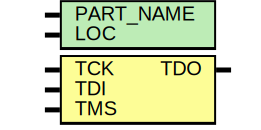
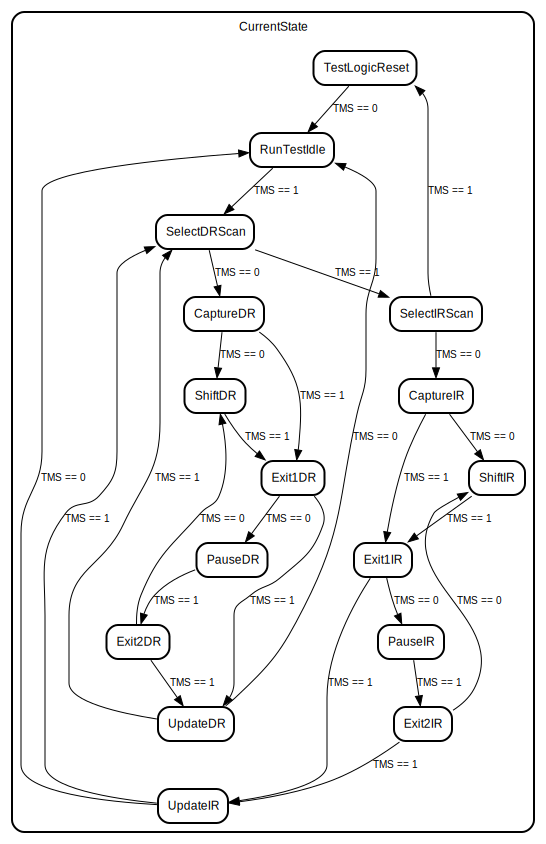

# Entity: JTAG_SIME2

## Diagram

## Description

   Copyright (c) 1995/2010 Xilinx, Inc.
 
    Licensed under the Apache License, Version 2.0 (the "License");
    you may not use this file except in compliance with the License.
    You may obtain a copy of the License at
 
        http://www.apache.org/licenses/LICENSE-2.0
 
    Unless required by applicable law or agreed to in writing, software
    distributed under the License is distributed on an "AS IS" BASIS,
    WITHOUT WARRANTIES OR CONDITIONS OF ANY KIND, either express or implied.
    See the License for the specific language governing permissions and
    limitations under the License.
   ____  ____
  /   /\/   /
 /___/  \  /    Vendor : Xilinx
 \   \   \/     Version : 10.1
  \   \         Description : Xilinx Functional Simulation Library Component
  /   /                  Jtag TAP Controler for VIRTEX7
 /___/   /\     Filename : JTAG_SIME2.v
 \   \  /  \    Timestamp : Mon May 17 17:10:29 PDT 2010
  \___\/\___\
 Revision:
    05/17/10 - Initial version.
    11/30/11 - 632642 - Updated supported devices and corresponding IDCODES.
    12/13/11 - Added `celldefine and `endcelldefine (CR 524859).
    07/05/12 - Updated the simulation model (CR 667100).
    07/23/12 - Fixed IRLengthMax (CR 669116).
    04/07/15 - Added negedge to RESET, RUNTEST, UPDATE and TDO (CR 857726).
 End Revision
 
## Generics

| Generic name | Type | Value      | Description |
| ------------ | ---- | ---------- | ----------- |
| PART_NAME    |      | "7K325T"   |             |
| LOC          |      | "UNPLACED" |             |
## Ports

| Port name | Direction | Type | Description |
| --------- | --------- | ---- | ----------- |
| TDO       | output    |      |             |
| TCK       | input     |      |             |
|  TDI      | input     |      |             |
|  TMS      | input     |      |             |
## Signals

| Name                  | Type                  | Description                      |
| --------------------- | --------------------- | -------------------------------- |
| TDO                   | reg                   |                                  |
| notifier              | reg                   |                                  |
| TRST                  | reg                   |                                  |
| CurrentState          | reg [3:0]             |                                  |
| jtag_state_name       | reg [14*8:0]          |                                  |
| jtag_instruction_name | reg [14*8:0]          |                                  |
| IR_CAPTURE_VAL        | reg [IRLengthMax-1:0] |                                  |
| BYPASS_INSTR          | reg [IRLengthMax-1:0] |                                  |
| IDCODE_INSTR          | reg [IRLengthMax-1:0] |                                  |
| USER1_INSTR           | reg [IRLengthMax-1:0] |                                  |
| USER2_INSTR           | reg [IRLengthMax-1:0] |                                  |
| USER3_INSTR           | reg [IRLengthMax-1:0] |                                  |
| USER4_INSTR           | reg [IRLengthMax-1:0] |                                  |
| IRcontent_sig         | reg [IRLength-1:0]    |                                  |
| IDCODEval_sig         | reg [IDLength-1:0]    |                                  |
| BypassReg             | reg                   |                                  |
| BYPASS_sig            | reg                   |                                  |
| IDCODE_sig            | reg                   |                                  |
| USER1_sig             | reg                   |                                  |
| USER2_sig             | reg                   |                                  |
| USER3_sig             | reg                   |                                  |
| USER4_sig             | reg                   |                                  |
| TDO_latch             | reg                   |                                  |
| Tlrst_sig             | reg                   |                                  |
| TlrstN_sig            | reg                   |                                  |
| IRegLastBit_sig       | reg                   |                                  |
| IDregLastBit_sig      | reg                   |                                  |
| Rti_sig               | reg                   |                                  |
| NextIRreg             | reg [IRLength-1:0]    |                                  |
| ir_int                | reg [IRLength-1:0]    | = IR_CAPTURE_VAL[IRLength-1:0] ; |
| IDreg                 | reg [IDLength-1:0]    |                                  |
## Constants

| Name            | Type | Value     | Description                   |
| --------------- | ---- | --------- | ----------------------------- |
| TestLogicReset  |      | 4'h0      | `ifdef XIL_TIMING             |
| RunTestIdle     |      | 4'h1      | `ifdef XIL_TIMING             |
| SelectDRScan    |      | 4'h2      | `ifdef XIL_TIMING             |
| CaptureDR       |      | 4'h3      | `ifdef XIL_TIMING             |
| ShiftDR         |      | 4'h4      | `ifdef XIL_TIMING             |
| Exit1DR         |      | 4'h5      | `ifdef XIL_TIMING             |
| PauseDR         |      | 4'h6      | `ifdef XIL_TIMING             |
| Exit2DR         |      | 4'h7      | `ifdef XIL_TIMING             |
| UpdateDR        |      | 4'h8      | `ifdef XIL_TIMING             |
| SelectIRScan    |      | 4'h9      | `ifdef XIL_TIMING             |
| CaptureIR       |      | 4'ha      | `ifdef XIL_TIMING             |
| ShiftIR         |      | 4'hb      | `ifdef XIL_TIMING             |
| Exit1IR         |      | 4'hc      | `ifdef XIL_TIMING             |
| PauseIR         |      | 4'hd      | `ifdef XIL_TIMING             |
| Exit2IR         |      | 4'he      | `ifdef XIL_TIMING             |
| UpdateIR        |      | 4'hf      | `ifdef XIL_TIMING             |
| DELAY_SIG       |      | 1         |                               |
| IRLengthMax     |      | 24        | localparam IRLengthMax = 10;  |
| IDLength        |      | 32        |                               |
| IRLength        |      |           | localparam IRLength = 10;     |
| UpdateIR_sig    |      | undefined | localparam IRLength = 10;     |
| ClkUpdateIR_sig |      | undefined | localparam IRLength = 10;     |
## Processes
- unnamed: ( @(posedge TCK or posedge TRST) )
- unnamed: ( @(CurrentState, TCK, TRST) )
- unnamed: ( @(TCK) )
- unnamed: ( @(TCK) )
**Description**
always

- unnamed: ( @(negedge TCK) )
- unnamed: ( @(posedge ClkIR_sig) )
- unnamed: ( @(posedge ClkUp )
- unnamed: ( @(IRcontent_sig) )
- unnamed: ( @(posedge ClkID_sig) )
- unnamed: ( @(ClkUpdateIR_sig, Tlrst_sig, USER1_sig, USER2_sig, USER3_sig, USER4_sig) )
- unnamed: ( @(CurrentState, IRcontent_s )
- unnamed: ( @(negedge TCK) )
**Description**
always

## State machines

