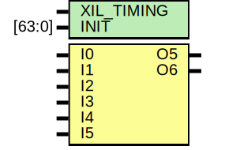

# Entity: LUT6_2

## Diagram

## Description

   Copyright (c) 1995/2016 Xilinx, Inc.
 
    Licensed under the Apache License, Version 2.0 (the "License");
    you may not use this file except in compliance with the License.
    You may obtain a copy of the License at
 
        http://www.apache.org/licenses/LICENSE-2.0
 
    Unless required by applicable law or agreed to in writing, software
    distributed under the License is distributed on an "AS IS" BASIS,
    WITHOUT WARRANTIES OR CONDITIONS OF ANY KIND, either express or implied.
    See the License for the specific language governing permissions and
    limitations under the License.
   ____  ____
  /   /\/   /
 /___/  \  /    Vendor      : Xilinx
 \   \   \/     Version     : 2017.1
  \   \         Description : Xilinx Unified Simulation Library Component
  /   /                  6-Bit Look-Up Table with Two Outputs
 /___/   /\     Filename : LUT6_2.v
 \   \  /  \
  \___\/\___\
  Revision:
    08/08/06 - Initial version.
    06/04/07 - Change timescale form 100ps/10ps to 1ps/1ps.
               Add wire definition.
    06/19/07 - 441956 - Add LOC Parameter
    12/13/11 - 524859 - Added `celldefine and `endcelldefine
    09/12/16 - ANSI ports, speed improvements
  End Revision:
 
## Generics

| Generic name | Type   | Value                | Description |
| ------------ | ------ | -------------------- | ----------- |
| XIL_TIMING   |        | "UNPLACED"           |             |
| INIT         | [63:0] | 64'h0000000000000000 |             |
## Ports

| Port name | Direction | Type | Description |
| --------- | --------- | ---- | ----------- |
| O5        | output    |      |             |
| O6        | output    |      |             |
| I0        | input     |      |             |
| I1        | input     |      |             |
| I2        | input     |      |             |
| I3        | input     |      |             |
| I4        | input     |      |             |
| I5        | input     |      |             |
## Signals

| Name      | Type       | Description             |
| --------- | ---------- | ----------------------- |
| trig_attr | reg        |                         |
| INIT_REG  | reg [63:0] |                         |
| O5_out    | reg        | begin behavioral model  |
| O6_out    | reg        |                         |
## Constants

| Name        | Type | Value    | Description       |
| ----------- | ---- | -------- | ----------------- |
| MODULE_NAME |      | "LUT6_2" | define constants  |
## Processes
- unnamed: ( @(I0 or I1 or I2 or I3 or I4) )
- unnamed: ( @(I0 or I1 or I2 or I3 or I4 or I5) )
