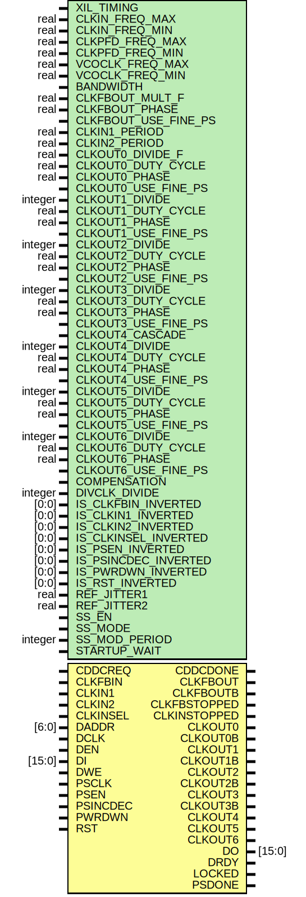

# Entity: MMCME4_ADV

## Diagram

## Description

    Copyright (c) 1995/2017 Xilinx, Inc.
 
    Licensed under the Apache License, Version 2.0 (the "License");
    you may not use this file except in compliance with the License.
    You may obtain a copy of the License at
 
        http://www.apache.org/licenses/LICENSE-2.0
 
    Unless required by applicable law or agreed to in writing, software
    distributed under the License is distributed on an "AS IS" BASIS,
    WITHOUT WARRANTIES OR CONDITIONS OF ANY KIND, either express or implied.
    See the License for the specific language governing permissions and
    limitations under the License.
   ____  ____
  /   /\/   /
 /___/  \  /     Vendor      : Xilinx
 \   \   \/      Version     : 2018.1
  \   \          Description : Xilinx Unified Simulation Library Component
  /   /                        Advanced Mixed Mode Clock Manager (MMCM)
 /___/   /\      Filename    : MMCME4_ADV.v
 \   \  /  \
  \___\/\___\
  Revision:
  03/21/2013   - YML changes
  03/22/2013   - 708090 - Change error to Warning
  03/27/2013   - Update with writer notation
  04/04/2013   - 709484 - Add PFD check
  04/04/2013   - 709093 - Fix periods after DRP
  04/12/2013   - invertible pin changes
  04/22/2013   - 713991 - Fix cddcdone assertion
  04/24/2013   - 709726 - fix vcoflag
  05/07/2013   - 714319 - fix phase warning
  10/22/2014 808642 - Added #1 to $finish
  End Revision:
 
## Generics

| Generic name         | Type    | Value         | Description |
| -------------------- | ------- | ------------- | ----------- |
| XIL_TIMING           |         | "UNPLACED"    |             |
| CLKIN_FREQ_MAX       | real    | 1066.000      |             |
| CLKIN_FREQ_MIN       | real    | 10.000        |             |
| CLKPFD_FREQ_MAX      | real    | 550.000       |             |
| CLKPFD_FREQ_MIN      | real    | 10.000        |             |
| VCOCLK_FREQ_MAX      | real    | 1600.000      |             |
| VCOCLK_FREQ_MIN      | real    | 800.000       |             |
| BANDWIDTH            |         | "OPTIMIZED"   |             |
| CLKFBOUT_MULT_F      | real    | 5.000         |             |
| CLKFBOUT_PHASE       | real    | 0.000         |             |
| CLKFBOUT_USE_FINE_PS |         | "FALSE"       |             |
| CLKIN1_PERIOD        | real    | 0.000         |             |
| CLKIN2_PERIOD        | real    | 0.000         |             |
| CLKOUT0_DIVIDE_F     | real    | 1.000         |             |
| CLKOUT0_DUTY_CYCLE   | real    | 0.500         |             |
| CLKOUT0_PHASE        | real    | 0.000         |             |
| CLKOUT0_USE_FINE_PS  |         | "FALSE"       |             |
| CLKOUT1_DIVIDE       | integer | 1             |             |
| CLKOUT1_DUTY_CYCLE   | real    | 0.500         |             |
| CLKOUT1_PHASE        | real    | 0.000         |             |
| CLKOUT1_USE_FINE_PS  |         | "FALSE"       |             |
| CLKOUT2_DIVIDE       | integer | 1             |             |
| CLKOUT2_DUTY_CYCLE   | real    | 0.500         |             |
| CLKOUT2_PHASE        | real    | 0.000         |             |
| CLKOUT2_USE_FINE_PS  |         | "FALSE"       |             |
| CLKOUT3_DIVIDE       | integer | 1             |             |
| CLKOUT3_DUTY_CYCLE   | real    | 0.500         |             |
| CLKOUT3_PHASE        | real    | 0.000         |             |
| CLKOUT3_USE_FINE_PS  |         | "FALSE"       |             |
| CLKOUT4_CASCADE      |         | "FALSE"       |             |
| CLKOUT4_DIVIDE       | integer | 1             |             |
| CLKOUT4_DUTY_CYCLE   | real    | 0.500         |             |
| CLKOUT4_PHASE        | real    | 0.000         |             |
| CLKOUT4_USE_FINE_PS  |         | "FALSE"       |             |
| CLKOUT5_DIVIDE       | integer | 1             |             |
| CLKOUT5_DUTY_CYCLE   | real    | 0.500         |             |
| CLKOUT5_PHASE        | real    | 0.000         |             |
| CLKOUT5_USE_FINE_PS  |         | "FALSE"       |             |
| CLKOUT6_DIVIDE       | integer | 1             |             |
| CLKOUT6_DUTY_CYCLE   | real    | 0.500         |             |
| CLKOUT6_PHASE        | real    | 0.000         |             |
| CLKOUT6_USE_FINE_PS  |         | "FALSE"       |             |
| COMPENSATION         |         | "AUTO"        |             |
| DIVCLK_DIVIDE        | integer | 1             |             |
| IS_CLKFBIN_INVERTED  | [0:0]   | 1'b0          |             |
| IS_CLKIN1_INVERTED   | [0:0]   | 1'b0          |             |
| IS_CLKIN2_INVERTED   | [0:0]   | 1'b0          |             |
| IS_CLKINSEL_INVERTED | [0:0]   | 1'b0          |             |
| IS_PSEN_INVERTED     | [0:0]   | 1'b0          |             |
| IS_PSINCDEC_INVERTED | [0:0]   | 1'b0          |             |
| IS_PWRDWN_INVERTED   | [0:0]   | 1'b0          |             |
| IS_RST_INVERTED      | [0:0]   | 1'b0          |             |
| REF_JITTER1          | real    | 0.010         |             |
| REF_JITTER2          | real    | 0.010         |             |
| SS_EN                |         | "FALSE"       |             |
| SS_MODE              |         | "CENTER_HIGH" |             |
| SS_MOD_PERIOD        | integer | 10000         |             |
| STARTUP_WAIT         |         | "FALSE"       |             |
## Ports

| Port name    | Direction | Type   | Description |
| ------------ | --------- | ------ | ----------- |
| CDDCDONE     | output    |        |             |
| CLKFBOUT     | output    |        |             |
| CLKFBOUTB    | output    |        |             |
| CLKFBSTOPPED | output    |        |             |
| CLKINSTOPPED | output    |        |             |
| CLKOUT0      | output    |        |             |
| CLKOUT0B     | output    |        |             |
| CLKOUT1      | output    |        |             |
| CLKOUT1B     | output    |        |             |
| CLKOUT2      | output    |        |             |
| CLKOUT2B     | output    |        |             |
| CLKOUT3      | output    |        |             |
| CLKOUT3B     | output    |        |             |
| CLKOUT4      | output    |        |             |
| CLKOUT5      | output    |        |             |
| CLKOUT6      | output    |        |             |
| DO           | output    | [15:0] |             |
| DRDY         | output    |        |             |
| LOCKED       | output    |        |             |
| PSDONE       | output    |        |             |
| CDDCREQ      | input     |        |             |
| CLKFBIN      | input     |        |             |
| CLKIN1       | input     |        |             |
| CLKIN2       | input     |        |             |
| CLKINSEL     | input     |        |             |
| DADDR        | input     | [6:0]  |             |
| DCLK         | input     |        |             |
| DEN          | input     |        |             |
| DI           | input     | [15:0] |             |
| DWE          | input     |        |             |
| PSCLK        | input     |        |             |
| PSEN         | input     |        |             |
| PSINCDEC     | input     |        |             |
| PWRDWN       | input     |        |             |
| RST          | input     |        |             |
## Signals

| Name                     | Type        | Description                                                   |
| ------------------------ | ----------- | ------------------------------------------------------------- |
| trig_attr                | reg         |                                                               |
| BANDWIDTH_BIN            | wire [1:0]  |                                                               |
| CLKFBOUT_MULT_F_BIN      | wire [63:0] |                                                               |
| CLKFBOUT_PHASE_BIN       | wire [63:0] |                                                               |
| CLKFBOUT_USE_FINE_PS_BIN | wire        |                                                               |
| CLKIN1_PERIOD_BIN        | wire [63:0] |                                                               |
| CLKIN2_PERIOD_BIN        | wire [63:0] |                                                               |
| CLKIN_FREQ_MAX_BIN       | wire [63:0] |                                                               |
| CLKIN_FREQ_MIN_BIN       | wire [63:0] |                                                               |
| CLKOUT0_DIVIDE_F_BIN     | wire [63:0] |                                                               |
| CLKOUT0_DUTY_CYCLE_BIN   | wire [63:0] |                                                               |
| CLKOUT0_PHASE_BIN        | wire [63:0] |                                                               |
| CLKOUT0_USE_FINE_PS_BIN  | wire        |                                                               |
| CLKOUT1_DIVIDE_BIN       | wire [7:0]  |                                                               |
| CLKOUT1_DUTY_CYCLE_BIN   | wire [63:0] |                                                               |
| CLKOUT1_PHASE_BIN        | wire [63:0] |                                                               |
| CLKOUT1_USE_FINE_PS_BIN  | wire        |                                                               |
| CLKOUT2_DIVIDE_BIN       | wire [7:0]  |                                                               |
| CLKOUT2_DUTY_CYCLE_BIN   | wire [63:0] |                                                               |
| CLKOUT2_PHASE_BIN        | wire [63:0] |                                                               |
| CLKOUT2_USE_FINE_PS_BIN  | wire        |                                                               |
| CLKOUT3_DIVIDE_BIN       | wire [7:0]  |                                                               |
| CLKOUT3_DUTY_CYCLE_BIN   | wire [63:0] |                                                               |
| CLKOUT3_PHASE_BIN        | wire [63:0] |                                                               |
| CLKOUT3_USE_FINE_PS_BIN  | wire        |                                                               |
| CLKOUT4_CASCADE_BIN      | wire        |                                                               |
| CLKOUT4_DIVIDE_BIN       | wire [7:0]  |                                                               |
| CLKOUT4_DUTY_CYCLE_BIN   | wire [63:0] |                                                               |
| CLKOUT4_PHASE_BIN        | wire [63:0] |                                                               |
| CLKOUT4_USE_FINE_PS_BIN  | wire        |                                                               |
| CLKOUT5_DIVIDE_BIN       | wire [7:0]  |                                                               |
| CLKOUT5_DUTY_CYCLE_BIN   | wire [63:0] |                                                               |
| CLKOUT5_PHASE_BIN        | wire [63:0] |                                                               |
| CLKOUT5_USE_FINE_PS_BIN  | wire        |                                                               |
| CLKOUT6_DIVIDE_BIN       | wire [7:0]  |                                                               |
| CLKOUT6_DUTY_CYCLE_BIN   | wire [63:0] |                                                               |
| CLKOUT6_PHASE_BIN        | wire [63:0] |                                                               |
| CLKOUT6_USE_FINE_PS_BIN  | wire        |                                                               |
| CLKPFD_FREQ_MAX_BIN      | wire [63:0] |                                                               |
| CLKPFD_FREQ_MIN_BIN      | wire [63:0] |                                                               |
| COMPENSATION_BIN         | wire [2:0]  |                                                               |
| DIVCLK_DIVIDE_BIN        | wire [6:0]  |                                                               |
| REF_JITTER1_BIN          | wire [63:0] |                                                               |
| REF_JITTER2_BIN          | wire [63:0] |                                                               |
| SS_EN_BIN                | wire        |                                                               |
| SS_MODE_BIN              | wire [1:0]  |                                                               |
| SS_MOD_PERIOD_BIN        | wire [15:0] |                                                               |
| STARTUP_WAIT_BIN         | wire        |                                                               |
| VCOCLK_FREQ_MAX_BIN      | wire [63:0] |                                                               |
| VCOCLK_FREQ_MIN_BIN      | wire [63:0] |                                                               |
| BANDWIDTH_BIN            | reg [1:0]   |                                                               |
| CLKFBOUT_MULT_F_BIN      | reg [63:0]  |                                                               |
| CLKFBOUT_PHASE_BIN       | reg [63:0]  |                                                               |
| CLKFBOUT_USE_FINE_PS_BIN | reg         |                                                               |
| CLKIN1_PERIOD_BIN        | reg [63:0]  |                                                               |
| CLKIN2_PERIOD_BIN        | reg [63:0]  |                                                               |
| CLKIN_FREQ_MAX_BIN       | reg [63:0]  |                                                               |
| CLKIN_FREQ_MIN_BIN       | reg [63:0]  |                                                               |
| CLKOUT0_DIVIDE_F_BIN     | reg [63:0]  |                                                               |
| CLKOUT0_DUTY_CYCLE_BIN   | reg [63:0]  |                                                               |
| CLKOUT0_PHASE_BIN        | reg [63:0]  |                                                               |
| CLKOUT0_USE_FINE_PS_BIN  | reg         |                                                               |
| CLKOUT1_DIVIDE_BIN       | reg [7:0]   |                                                               |
| CLKOUT1_DUTY_CYCLE_BIN   | reg [63:0]  |                                                               |
| CLKOUT1_PHASE_BIN        | reg [63:0]  |                                                               |
| CLKOUT1_USE_FINE_PS_BIN  | reg         |                                                               |
| CLKOUT2_DIVIDE_BIN       | reg [7:0]   |                                                               |
| CLKOUT2_DUTY_CYCLE_BIN   | reg [63:0]  |                                                               |
| CLKOUT2_PHASE_BIN        | reg [63:0]  |                                                               |
| CLKOUT2_USE_FINE_PS_BIN  | reg         |                                                               |
| CLKOUT3_DIVIDE_BIN       | reg [7:0]   |                                                               |
| CLKOUT3_DUTY_CYCLE_BIN   | reg [63:0]  |                                                               |
| CLKOUT3_PHASE_BIN        | reg [63:0]  |                                                               |
| CLKOUT3_USE_FINE_PS_BIN  | reg         |                                                               |
| CLKOUT4_CASCADE_BIN      | reg         |                                                               |
| CLKOUT4_DIVIDE_BIN       | reg [7:0]   |                                                               |
| CLKOUT4_DUTY_CYCLE_BIN   | reg [63:0]  |                                                               |
| CLKOUT4_PHASE_BIN        | reg [63:0]  |                                                               |
| CLKOUT4_USE_FINE_PS_BIN  | reg         |                                                               |
| CLKOUT5_DIVIDE_BIN       | reg [7:0]   |                                                               |
| CLKOUT5_DUTY_CYCLE_BIN   | reg [63:0]  |                                                               |
| CLKOUT5_PHASE_BIN        | reg [63:0]  |                                                               |
| CLKOUT5_USE_FINE_PS_BIN  | reg         |                                                               |
| CLKOUT6_DIVIDE_BIN       | reg [7:0]   |                                                               |
| CLKOUT6_DUTY_CYCLE_BIN   | reg [63:0]  |                                                               |
| CLKOUT6_PHASE_BIN        | reg [63:0]  |                                                               |
| CLKOUT6_USE_FINE_PS_BIN  | reg         |                                                               |
| CLKPFD_FREQ_MAX_BIN      | reg [63:0]  |                                                               |
| CLKPFD_FREQ_MIN_BIN      | reg [63:0]  |                                                               |
| COMPENSATION_BIN         | reg [2:0]   |                                                               |
| DIVCLK_DIVIDE_BIN        | reg [6:0]   |                                                               |
| REF_JITTER1_BIN          | reg [63:0]  |                                                               |
| REF_JITTER2_BIN          | reg [63:0]  |                                                               |
| SS_EN_BIN                | reg         |                                                               |
| SS_MODE_BIN              | reg [1:0]   |                                                               |
| SS_MOD_PERIOD_BIN        | reg [15:0]  |                                                               |
| STARTUP_WAIT_BIN         | reg         |                                                               |
| VCOCLK_FREQ_MAX_BIN      | reg [63:0]  |                                                               |
| VCOCLK_FREQ_MIN_BIN      | reg [63:0]  |                                                               |
| attr_test                | reg         |                                                               |
| attr_err                 | reg         |                                                               |
| glblGSR                  | tri0        |                                                               |
| CDDCREQ_in               | wire        |                                                               |
| CLKFBIN_in               | wire        |                                                               |
| CLKIN1_in                | wire        |                                                               |
| CLKIN2_in                | wire        |                                                               |
| CLKINSEL_in              | wire        |                                                               |
| DCLK_in                  | wire        |                                                               |
| DEN_in                   | wire        |                                                               |
| DWE_in                   | wire        |                                                               |
| PSCLK_in                 | wire        |                                                               |
| PSEN_in                  | wire        |                                                               |
| PSINCDEC_in              | wire        |                                                               |
| PWRDWN_in                | wire        |                                                               |
| RST_in                   | wire        |                                                               |
| DI_in                    | wire [15:0] |                                                               |
| DADDR_in                 | wire [6:0]  |                                                               |
| DCLK_delay               | wire        |                                                               |
| DEN_delay                | wire        |                                                               |
| DWE_delay                | wire        |                                                               |
| PSCLK_delay              | wire        |                                                               |
| PSEN_delay               | wire        |                                                               |
| PSINCDEC_delay           | wire        |                                                               |
| DI_delay                 | wire [15:0] |                                                               |
| DADDR_delay              | wire [6:0]  |                                                               |
| notifier                 | reg         |                                                               |
| CDDCDONE_out             | reg         | begin behavioral model                                        |
| CLKFBOUTB_out            | reg         |                                                               |
| CLKFBOUT_out             | reg         |                                                               |
| CLKFBSTOPPED_out         | reg         |                                                               |
| CLKINSTOPPED_out         | reg         |                                                               |
| CLKOUT0B_out             | reg         |                                                               |
| CLKOUT0_out              | reg         |                                                               |
| CLKOUT1B_out             | reg         |                                                               |
| CLKOUT1_out              | reg         |                                                               |
| CLKOUT2B_out             | reg         |                                                               |
| CLKOUT2_out              | reg         |                                                               |
| CLKOUT3B_out             | reg         |                                                               |
| CLKOUT3_out              | reg         |                                                               |
| CLKOUT4_out              | reg         |                                                               |
| CLKOUT5_out              | reg         |                                                               |
| CLKOUT6_out              | reg         |                                                               |
| DRDY_out                 | reg         |                                                               |
| LOCKED_out               | reg         |                                                               |
| PSDONE_out               | reg         |                                                               |
| DO_out                   | reg [15:0]  |                                                               |
| nBandwidth_HIGH          | integer     |                                                               |
| nBandwidth_LOW           | integer     |                                                               |
| nBandwidth_OPTIMIZED     | integer     |                                                               |
| clkout_name              | reg [160:1] |                                                               |
| CLKOUT0_DIVIDE_F_RND     | real        |                                                               |
| CLKFBOUT_MULT_F_RND      | real        |                                                               |
| p_up                     | tri1        |                                                               |
| glock                    | wire        |                                                               |
| pchk_tmp1                | integer     |                                                               |
| pchk_tmp2                | integer     |                                                               |
| clkvco_div_fint          | integer     |                                                               |
| clkvco_div_frac          | real        |                                                               |
| clk0_out                 | reg         |                                                               |
| clkfbout_out             | reg         |                                                               |
| clkvco_frac_en           | integer     |                                                               |
| ps_in_init               | integer     |                                                               |
| clk0_fps_en              | reg         |                                                               |
| clk1_fps_en              | reg         |                                                               |
| clk2_fps_en              | reg         |                                                               |
| clk3_fps_en              | reg         |                                                               |
| clk4_fps_en              | reg         |                                                               |
| clk5_fps_en              | reg         |                                                               |
| clk6_fps_en              | reg         |                                                               |
| clkfbout_fps_en          | reg         |                                                               |
| fps_en                   | reg         |                                                               |
| fps_clk_en               | reg         |                                                               |
| clkinstopped_out1        | reg         |                                                               |
| clkin_hold_f             | reg         |                                                               |
| clkinstopped_out_dly2    | reg         |                                                               |
| clkin_stop_f             | reg         |                                                               |
| period_avg_stpi          | integer     |                                                               |
| period_avg_stp           | integer     |                                                               |
| tmp_stp1                 | real        |                                                               |
| tmp_stp2                 | real        |                                                               |
| pd_stp_p                 | reg         |                                                               |
| vco_stp_f                | reg         |                                                               |
| psen_w                   | reg         |                                                               |
| clkinstopped_out_dly     | reg         |                                                               |
| clkfbin_stop_tmp         | reg         |                                                               |
| clkfbstopped_out1        | reg         |                                                               |
| clkin_stop_tmp           | reg         |                                                               |
| rst_clkinstopped         | reg         |                                                               |
| rst_clkfbstopped         | reg         |                                                               |
| rst_clkinstopped_tm      | reg         |                                                               |
| rst_clkinstopped_rc      | reg         |                                                               |
| rst_clkinstopped_lk      | reg         |                                                               |
| rst_clkfbstopped_lk      | reg         |                                                               |
| clkin_lost_cnt           | integer     |                                                               |
| clkfbin_lost_cnt         | integer     |                                                               |
| clkinstopped_hold        | reg         |                                                               |
| ps_in_ps                 | integer     |                                                               |
| ps_cnt                   | integer     |                                                               |
| ps_in_ps_neg             | integer     |                                                               |
| ps_cnt_neg               | integer     |                                                               |
| daddr_lat                | reg [6:0]   |                                                               |
| valid_daddr              | reg         |                                                               |
| drp_lock                 | reg         |                                                               |
| drp_lock_lat             | integer     |                                                               |
| drp_lock_lat_cnt         | integer     |                                                               |
| dr_sram                  | reg [15:0]  |                                                               |
| tmp_string               | reg [160:0] |                                                               |
| rst_int                  | reg         |                                                               |
| pwron_int                | reg         |                                                               |
| rst_in_o                 | wire        |                                                               |
| clk1_out                 | reg         |                                                               |
| clk2_out                 | reg         |                                                               |
| clk3_out                 | reg         |                                                               |
| clk4_out                 | reg         |                                                               |
| clk5_out                 | reg         |                                                               |
| clk6_out                 | reg         |                                                               |
| clkout_en                | reg         |                                                               |
| clkout_en1               | reg         |                                                               |
| clkout_en0               | reg         |                                                               |
| clkout_en0_tmp           | reg         |                                                               |
| clkout_en0_tmp1          | reg         |                                                               |
| clkout_en_val            | integer     |                                                               |
| clkout_en_t              | integer     |                                                               |
| clkin_lock_cnt           | integer     |                                                               |
| clkout_en_time           | integer     |                                                               |
| locked_en_time           | integer     |                                                               |
| lock_cnt_max             | integer     |                                                               |
| pll_lock_time            | integer     |                                                               |
| lock_period_time         | integer     |                                                               |
| clkvco                   | reg         |                                                               |
| clkvco_lk_dly_tmp        | reg         |                                                               |
| clkvco_lk_en             | reg         |                                                               |
| clkvco_lk                | reg         |                                                               |
| fbclk_tmp                | reg         |                                                               |
| clkin_osc                | reg         |                                                               |
| clkin_p                  | reg         |                                                               |
| clkfbin_osc              | reg         |                                                               |
| clkfbin_p                | reg         |                                                               |
| clkinstopped_vco_f       | reg         |                                                               |
| rst_edge                 | time        |                                                               |
| rst_ht                   | time        |                                                               |
| fb_delay_found           | reg         |                                                               |
| fb_delay_found_tmp       | reg         |                                                               |
| clkfbout_tst             | reg         |                                                               |
| fb_delay_max             | real        |                                                               |
| fb_delay                 | time        |                                                               |
| clkvco_delay             | time        |                                                               |
| val_tmp                  | time        |                                                               |
| dly_tmp                  | time        |                                                               |
| fb_comp_delay            | time        |                                                               |
| dly_tmp1                 | time        |                                                               |
| tmp_ps_val2              | time        |                                                               |
| dly_tmp_int              | integer     |                                                               |
| tmp_ps_val1              | integer     |                                                               |
| clkin_edge               | time        |                                                               |
| delay_edge               | time        |                                                               |
| period_clkin             | real        |                                                               |
| clkin_period_tmp         | real        |                                                               |
| clkin_period_tmp_t       | integer     |                                                               |
| clkin_period             | integer     |                                                               |
| period_vco               | integer     |                                                               |
| period_vco_half          | integer     |                                                               |
| period_vco_half1         | integer     |                                                               |
| period_vco_half_rm       | integer     |                                                               |
| period_vco_rl            | real        |                                                               |
| period_vco_rl_half       | real        |                                                               |
| period_vco_half_rm1      | integer     |                                                               |
| period_vco_half_rm2      | integer     |                                                               |
| cmpvco                   | real        |                                                               |
| clkvco_pdrm              | real        |                                                               |
| period_vco_mf            | integer     |                                                               |
| period_vco_tmp           | integer     |                                                               |
| period_vco_rm            | integer     |                                                               |
| period_vco_cmp_cnt       | integer     |                                                               |
| clkvco_rm_cnt            | integer     |                                                               |
| period_vco_cmp_flag      | integer     |                                                               |
| period_vco_max           | integer     |                                                               |
| period_vco_min           | integer     |                                                               |
| period_vco1              | integer     |                                                               |
| period_vco2              | integer     |                                                               |
| period_vco3              | integer     |                                                               |
| period_vco4              | integer     |                                                               |
| period_vco5              | integer     |                                                               |
| period_vco6              | integer     |                                                               |
| period_vco7              | integer     |                                                               |
| period_vco_target        | integer     |                                                               |
| period_vco_target_half   | integer     |                                                               |
| period_fb                | integer     |                                                               |
| period_avg               | integer     |                                                               |
| clk0_frac_lt             | integer     |                                                               |
| clk0_frac_ht             | integer     |                                                               |
| clk0_frac_lt_rl          | real        |                                                               |
| clk0_frac_ht_rl          | real        |                                                               |
| clk0_frac_rm             | integer     |                                                               |
| clk0_frac_rm_rl          | real        |                                                               |
| clkfbout_frac_lt         | integer     |                                                               |
| clkfbout_frac_ht         | integer     |                                                               |
| clkfbout_frac_lt_rl      | real        |                                                               |
| clkfbout_frac_ht_rl      | real        |                                                               |
| clkfbout_frac_rm         | integer     |                                                               |
| clkfbout_frac_rm_rl      | real        |                                                               |
| period_ps                | integer     |                                                               |
| period_ps_old            | integer     |                                                               |
| ps_lock                  | reg         |                                                               |
| ps_lock_dly              | reg         |                                                               |
| clkvco_freq_init_chk     | real        |                                                               |
| clkfbout_pm_rl           | real        |                                                               |
| tmp_real                 | real        |                                                               |
| ik0                      | integer     |                                                               |
| ik1                      | integer     |                                                               |
| ik2                      | integer     |                                                               |
| ik3                      | integer     |                                                               |
| ik4                      | integer     |                                                               |
| ib                       | integer     |                                                               |
| i                        | integer     |                                                               |
| j                        | integer     |                                                               |
| md_product               | integer     |                                                               |
| m_product                | integer     |                                                               |
| m_product2               | integer     |                                                               |
| mf_product               | integer     |                                                               |
| clk0f_product            | integer     |                                                               |
| clkin_lost_val           | integer     | integer clkin_lost_val, clkfbin_lost_val, clkin_lost_val_lk;  |
| clkfbin_lost_val         | integer     |                                                               |
| pll_locked_delay         | time        |                                                               |
| clkin_dly_t              | time        |                                                               |
| clkfbin_dly_t            | time        |                                                               |
| pll_unlock               | wire        |                                                               |
| pll_unlock1              | wire        |                                                               |
| pll_locked_tmp1          | reg         |                                                               |
| pll_locked_tmp2          | reg         |                                                               |
| lock_period              | reg         |                                                               |
| pll_locked_tm            | reg         |                                                               |
| unlock_recover           | reg         |                                                               |
| clkpll_jitter_unlock     | reg         |                                                               |
| clkin_jit                | integer     |                                                               |
| REF_CLK_JITTER_MAX_tmp   | integer     |                                                               |
| init_trig                | wire        |                                                               |
| clkpll_r                 | wire        |                                                               |
| clk0in                   | reg         |                                                               |
| clk1in                   | reg         |                                                               |
| clk2in                   | reg         |                                                               |
| clk3in                   | reg         |                                                               |
| clk4in                   | reg         |                                                               |
| clk5in                   | reg         |                                                               |
| clk6in                   | reg         |                                                               |
| clkpll_tmp1              | reg         |                                                               |
| clkpll                   | reg         |                                                               |
| clkfboutin               | reg         |                                                               |
| clkfbps_en               | wire        |                                                               |
| chk_ok                   | reg         |                                                               |
| clk0ps_en                | wire        |                                                               |
| clk1ps_en                | wire        |                                                               |
| clk2ps_en                | wire        |                                                               |
| clk3ps_en                | wire        |                                                               |
| clk4ps_en                | wire        |                                                               |
| clk5ps_en                | wire        |                                                               |
| clk6ps_en                | wire        |                                                               |
| d_rsel                   | reg [3:0]   |                                                               |
| clkfbout_rsel            | reg [3:0]   |                                                               |
| clk0_rsel                | reg [3:0]   |                                                               |
| d_fsel                   | reg [3:0]   |                                                               |
| clkfbout_fsel            | reg [3:0]   |                                                               |
| clk0_fsel                | reg [3:0]   |                                                               |
| d_fht                    | reg [6:0]   |                                                               |
| clkfbout_fht             | reg [6:0]   |                                                               |
| clk0_fht                 | reg [6:0]   |                                                               |
| d_flt                    | reg [6:0]   |                                                               |
| clkfbout_flt             | reg [6:0]   |                                                               |
| clk0_flt                 | reg [6:0]   |                                                               |
| clk0_dly_cnt             | reg [5:0]   |                                                               |
| clk1_dly_cnt             | reg [5:0]   |                                                               |
| clk2_dly_cnt             | reg [5:0]   |                                                               |
| clk3_dly_cnt             | reg [5:0]   |                                                               |
| clk4_dly_cnt             | reg [5:0]   |                                                               |
| clk5_dly_cnt             | reg [5:0]   |                                                               |
| clk6_dly_cnt             | reg [5:0]   |                                                               |
| clk0_phase               | real        |                                                               |
| clk0_duty                | real        |                                                               |
| clk1_phase               | real        |                                                               |
| clk1_duty                | real        |                                                               |
| clk2_phase               | real        |                                                               |
| clk2_duty                | real        |                                                               |
| clk3_phase               | real        |                                                               |
| clk3_duty                | real        |                                                               |
| clk4_phase               | real        |                                                               |
| clk4_duty                | real        |                                                               |
| clk5_phase               | real        |                                                               |
| clk5_duty                | real        |                                                               |
| clk6_phase               | real        |                                                               |
| clk6_duty                | real        |                                                               |
| divclk_phase             | real        |                                                               |
| divclk_duty              | real        |                                                               |
| clkfbout_phase           | real        |                                                               |
| clkfbout_duty            | real        |                                                               |
| d_frac                   | reg [2:0]   | mem cells                                                     |
| clkfbout_frac            | reg [2:0]   | mem cells                                                     |
| clk0_frac                | reg [2:0]   | mem cells                                                     |
| d_frac_en                | reg         |                                                               |
| clkfbout_frac_en         | reg         |                                                               |
| clk0_frac_en             | reg         |                                                               |
| clk0_cddc_en             | reg         |                                                               |
| clk1_cddc_en             | reg         |                                                               |
| clk2_cddc_en             | reg         |                                                               |
| clk3_cddc_en             | reg         |                                                               |
| clk4_cddc_en             | reg         |                                                               |
| clk5_cddc_en             | reg         |                                                               |
| clk6_cddc_en             | reg         |                                                               |
| clkfbout_cddc_res        | reg         |                                                               |
| d_wf_f                   | reg         |                                                               |
| clkfbout_wf_f            | reg         |                                                               |
| clk0_wf_f                | reg         |                                                               |
| d_wf_r                   | reg         |                                                               |
| clkfbout_wf_r            | reg         |                                                               |
| clk0_wf_r                | reg         |                                                               |
| d_mx                     | reg [2:0]   |                                                               |
| clkfbout_mx              | reg [2:0]   |                                                               |
| clk0_mx                  | reg [2:0]   |                                                               |
| clk1_mx                  | reg [2:0]   |                                                               |
| clk2_mx                  | reg [2:0]   |                                                               |
| clk3_mx                  | reg [2:0]   |                                                               |
| clk4_mx                  | reg [2:0]   |                                                               |
| clk5_mx                  | reg [2:0]   |                                                               |
| clk6_mx                  | reg [2:0]   |                                                               |
| divclk_e                 | reg         |                                                               |
| clkfbin_e                | reg         |                                                               |
| clkfbout_e               | reg         |                                                               |
| clk0_e                   | reg         |                                                               |
| clk1_e                   | reg         |                                                               |
| clk2_e                   | reg         |                                                               |
| clk3_e                   | reg         |                                                               |
| clk4_e                   | reg         |                                                               |
| clk5_e                   | reg         |                                                               |
| clk6_e                   | reg         |                                                               |
| divclk_nc                | reg         |                                                               |
| clkfbin_nc               | reg         |                                                               |
| clkfbout_nc              | reg         |                                                               |
| clk0_nc                  | reg         |                                                               |
| clk1_nc                  | reg         |                                                               |
| clk2_nc                  | reg         |                                                               |
| clk3_nc                  | reg         |                                                               |
| clk4_nc                  | reg         |                                                               |
| clk5_nc                  | reg         |                                                               |
| clk6_nc                  | reg         |                                                               |
| d_dt                     | reg [5:0]   |                                                               |
| clkfbout_dt              | reg [5:0]   |                                                               |
| clk0_dt                  | reg [5:0]   |                                                               |
| clk1_dt                  | reg [5:0]   |                                                               |
| clk2_dt                  | reg [5:0]   |                                                               |
| clk3_dt                  | reg [5:0]   |                                                               |
| clk4_dt                  | reg [5:0]   |                                                               |
| clk5_dt                  | reg [5:0]   |                                                               |
| clk6_dt                  | reg [5:0]   |                                                               |
| d_pm_f                   | reg [2:0]   |                                                               |
| clkfbout_pm_f            | reg [2:0]   |                                                               |
| clk0_pm_f                | reg [2:0]   |                                                               |
| clkfbout_pm_r            | reg [2:0]   |                                                               |
| clk0_pm_r                | reg [2:0]   |                                                               |
| d_pm                     | reg [2:0]   |                                                               |
| clk1_pm                  | reg [2:0]   |                                                               |
| clk2_pm                  | reg [2:0]   |                                                               |
| clk3_pm                  | reg [2:0]   |                                                               |
| clk4_pm                  | reg [2:0]   |                                                               |
| clk5_pm                  | reg [2:0]   |                                                               |
| clk6_pm                  | reg [2:0]   |                                                               |
| divclk_en                | reg         |                                                               |
| clkfbout_en              | reg         |                                                               |
| clk0_en                  | reg         |                                                               |
| clk1_en                  | reg         |                                                               |
| clk2_en                  | reg         |                                                               |
| clk3_en                  | reg         |                                                               |
| clk4_en                  | reg         |                                                               |
| clk5_en                  | reg         |                                                               |
| clk6_en                  | reg         |                                                               |
| clkfbin_ht               | reg [5:0]   |                                                               |
| clkfbout_ht              | reg [5:0]   |                                                               |
| divclk_ht                | reg [7:0]   |                                                               |
| clk0_ht                  | reg [5:0]   |                                                               |
| clk1_ht                  | reg [5:0]   |                                                               |
| clk2_ht                  | reg [5:0]   |                                                               |
| clk3_ht                  | reg [5:0]   |                                                               |
| clk4_ht                  | reg [5:0]   |                                                               |
| clk5_ht                  | reg [5:0]   |                                                               |
| clk6_ht                  | reg [5:0]   |                                                               |
| clkfbin_lt               | reg [5:0]   |                                                               |
| divclk_lt                | reg [7:0]   |                                                               |
| clkfbout_lt              | reg [6:0]   |                                                               |
| clk0_lt                  | reg [6:0]   |                                                               |
| clk1_lt                  | reg [6:0]   |                                                               |
| clk2_lt                  | reg [6:0]   |                                                               |
| clk3_lt                  | reg [6:0]   |                                                               |
| clk4_lt                  | reg [6:0]   |                                                               |
| clk5_lt                  | reg [6:0]   |                                                               |
| clk6_lt                  | reg [6:0]   |                                                               |
| clkfbout_f_div           | real        |                                                               |
| clk0_f_div               | real        |                                                               |
| d_div                    | integer     |                                                               |
| clkfbout_div             | integer     |                                                               |
| clk0_div                 | integer     |                                                               |
| clkfbout_dly_cnt         | reg [5:0]   |                                                               |
| clkfbout_cnt             | reg [7:0]   |                                                               |
| clk0_cnt                 | reg [7:0]   |                                                               |
| clk1_cnt                 | reg [7:0]   |                                                               |
| clk1_div                 | reg [7:0]   |                                                               |
| clk2_cnt                 | reg [7:0]   |                                                               |
| clk2_div                 | reg [7:0]   |                                                               |
| clk3_cnt                 | reg [7:0]   |                                                               |
| clk3_div                 | reg [7:0]   |                                                               |
| clk4_cnt                 | reg [7:0]   |                                                               |
| clk4_div                 | reg [7:0]   |                                                               |
| clk5_cnt                 | reg [7:0]   |                                                               |
| clk5_div                 | reg [7:0]   |                                                               |
| clk6_cnt                 | reg [7:0]   |                                                               |
| clk6_div                 | reg [7:0]   |                                                               |
| divclk_cnt_max           | integer     |                                                               |
| clkfbout_cnt_max         | integer     |                                                               |
| clk0_cnt_max             | integer     |                                                               |
| clk1_cnt_max             | integer     |                                                               |
| clk2_cnt_max             | integer     |                                                               |
| clk3_cnt_max             | integer     |                                                               |
| clk4_cnt_max             | integer     |                                                               |
| clk5_cnt_max             | integer     |                                                               |
| clk6_cnt_max             | integer     |                                                               |
| divclk_cnt_ht            | integer     |                                                               |
| clkfbout_cnt_ht          | integer     |                                                               |
| clk0_cnt_ht              | integer     |                                                               |
| clk1_cnt_ht              | integer     |                                                               |
| clk2_cnt_ht              | integer     |                                                               |
| clk3_cnt_ht              | integer     |                                                               |
| clk4_cnt_ht              | integer     |                                                               |
| clk5_cnt_ht              | integer     |                                                               |
| clk6_cnt_ht              | integer     |                                                               |
| divclk_div               | reg [7:0]   |                                                               |
| divclk_cnt               | reg [7:0]   |                                                               |
| divclk_out               | reg         |                                                               |
| divclk_out_tmp           | reg         |                                                               |
| pll_cp                   | reg [3:0]   |                                                               |
| pll_res                  | reg [3:0]   |                                                               |
| pll_lfhf                 | reg [1:0]   |                                                               |
| pll_cpres                | reg [1:0]   |                                                               |
| drp_lock_ref_dly         | reg [4:0]   |                                                               |
| drp_lock_fb_dly          | reg [4:0]   |                                                               |
| drp_lock_cnt             | reg [9:0]   |                                                               |
| drp_unlock_cnt           | reg [9:0]   |                                                               |
| drp_lock_sat_high        | reg [9:0]   |                                                               |
| clkinsel_tmp             | wire        |                                                               |
| clkin_chk_t1             | real        |                                                               |
| clkin_chk_t2             | real        |                                                               |
| clkin_chk_t1_r           | real        |                                                               |
| clkin_chk_t2_r           | real        |                                                               |
| clkin_chk_t1_i           | integer     |                                                               |
| clkin_chk_t2_i           | integer     |                                                               |
| clkpfd_freq_init_chk     | real        |                                                               |
| init_chk                 | reg         |                                                               |
| rst_clkinsel_flag        | reg         |                                                               |
| CLKFBIN_int              | wire        |                                                               |
| pwrdwn_in1               | wire        |                                                               |
| pwrdwn_in1_h             | reg         |                                                               |
| rst_input_r_h            | reg         |                                                               |
| pchk_clr                 | reg         |                                                               |
| psincdec_chg             | reg         |                                                               |
| psincdec_chg_tmp         | reg         |                                                               |
| rst_input                | wire        |                                                               |
| clkfbin_sel              | wire        |                                                               |
| vcoflag                  | reg         |                                                               |
| drp_updt                 | reg         |                                                               |
| halfperiod_sum           | real        |                                                               |
| halfperiod               | integer     |                                                               |
| clkvco_free              | reg         |                                                               |
| ik10                     | integer     |                                                               |
| ik11                     | integer     |                                                               |
| input_jitter_warn_issued | reg         |                                                               |
| ps_wr_to_max             | reg         |                                                               |
| clk0_delay               | integer     |                                                               |
| clk1_delay               | integer     |                                                               |
| clk2_delay               | integer     |                                                               |
| clk3_delay               | integer     |                                                               |
| clk4_delay               | integer     |                                                               |
| clk5_delay               | integer     |                                                               |
| clk6_delay               | integer     |                                                               |
| clkfbout_delay           | integer     |                                                               |
| clk0_delay_next          | integer     |                                                               |
| clk1_delay_next          | integer     |                                                               |
| clk2_delay_next          | integer     |                                                               |
| clk3_delay_next          | integer     |                                                               |
| clk4_delay_next          | integer     |                                                               |
| clk5_delay_next          | integer     |                                                               |
| clk6_delay_next          | integer     |                                                               |
| clkfbout_delay_next      | integer     |                                                               |
## Constants

| Name                       | Type   | Value                | Description                        |
| -------------------------- | ------ | -------------------- | ---------------------------------- |
| CLKIN_FREQ_MAX             | real   | 1066.000             |                                    |
| CLKIN_FREQ_MIN             | real   | 10.000               |                                    |
| CLKPFD_FREQ_MAX            | real   | 550.000              |                                    |
| CLKPFD_FREQ_MIN            | real   | 10.000               |                                    |
| VCOCLK_FREQ_MAX            | real   | 1600.000             |                                    |
| VCOCLK_FREQ_MIN            | real   | 800.000              |                                    |
| MODULE_NAME                |        | "MMCME4_ADV"         | define constants                   |
| BANDWIDTH_HIGH             |        | 1                    | Parameter encodings and registers  |
| BANDWIDTH_LOW              |        | 2                    |                                    |
| BANDWIDTH_OPTIMIZED        |        | 0                    |                                    |
| CLKFBOUT_USE_FINE_PS_FALSE |        | 0                    |                                    |
| CLKFBOUT_USE_FINE_PS_TRUE  |        | 1                    |                                    |
| CLKOUT0_USE_FINE_PS_FALSE  |        | 0                    |                                    |
| CLKOUT0_USE_FINE_PS_TRUE   |        | 1                    |                                    |
| CLKOUT1_USE_FINE_PS_FALSE  |        | 0                    |                                    |
| CLKOUT1_USE_FINE_PS_TRUE   |        | 1                    |                                    |
| CLKOUT2_USE_FINE_PS_FALSE  |        | 0                    |                                    |
| CLKOUT2_USE_FINE_PS_TRUE   |        | 1                    |                                    |
| CLKOUT3_USE_FINE_PS_FALSE  |        | 0                    |                                    |
| CLKOUT3_USE_FINE_PS_TRUE   |        | 1                    |                                    |
| CLKOUT4_CASCADE_FALSE      |        | 0                    |                                    |
| CLKOUT4_CASCADE_TRUE       |        | 1                    |                                    |
| CLKOUT4_USE_FINE_PS_FALSE  |        | 0                    |                                    |
| CLKOUT4_USE_FINE_PS_TRUE   |        | 1                    |                                    |
| CLKOUT5_USE_FINE_PS_FALSE  |        | 0                    |                                    |
| CLKOUT5_USE_FINE_PS_TRUE   |        | 1                    |                                    |
| CLKOUT6_USE_FINE_PS_FALSE  |        | 0                    |                                    |
| CLKOUT6_USE_FINE_PS_TRUE   |        | 1                    |                                    |
| COMPENSATION_AUTO          |        | 0                    |                                    |
| COMPENSATION_BUF_IN        |        | 1                    |                                    |
| COMPENSATION_EXTERNAL      |        | 2                    |                                    |
| COMPENSATION_INTERNAL      |        | 3                    |                                    |
| COMPENSATION_ZHOLD         |        | 4                    |                                    |
| SS_EN_FALSE                |        | 0                    |                                    |
| SS_EN_TRUE                 |        | 1                    |                                    |
| SS_MODE_CENTER_HIGH        |        | 0                    |                                    |
| SS_MODE_CENTER_LOW         |        | 1                    |                                    |
| SS_MODE_DOWN_HIGH          |        | 2                    |                                    |
| SS_MODE_DOWN_LOW           |        | 3                    |                                    |
| STARTUP_WAIT_FALSE         |        | 0                    |                                    |
| STARTUP_WAIT_TRUE          |        | 1                    |                                    |
| BANDWIDTH_REG              | [72:1] | BANDWIDTH            |                                    |
| CLKFBOUT_MULT_F_REG        | real   | CLKFBOUT_MULT_F      |                                    |
| CLKFBOUT_PHASE_REG         | real   | CLKFBOUT_PHASE       |                                    |
| CLKFBOUT_USE_FINE_PS_REG   | [40:1] | CLKFBOUT_USE_FINE_PS |                                    |
| CLKIN1_PERIOD_REG          | real   | CLKIN1_PERIOD        |                                    |
| CLKIN2_PERIOD_REG          | real   | CLKIN2_PERIOD        |                                    |
| CLKIN_FREQ_MAX_REG         | real   | CLKIN_FREQ_MAX       |                                    |
| CLKIN_FREQ_MIN_REG         | real   | CLKIN_FREQ_MIN       |                                    |
| CLKOUT0_DIVIDE_F_REG       | real   | CLKOUT0_DIVIDE_F     |                                    |
| CLKOUT0_DUTY_CYCLE_REG     | real   | CLKOUT0_DUTY_CYCLE   |                                    |
| CLKOUT0_PHASE_REG          | real   | CLKOUT0_PHASE        |                                    |
| CLKOUT0_USE_FINE_PS_REG    | [40:1] | CLKOUT0_USE_FINE_PS  |                                    |
| CLKOUT1_DIVIDE_REG         | [31:0] | CLKOUT1_DIVIDE       |                                    |
| CLKOUT1_DUTY_CYCLE_REG     | real   | CLKOUT1_DUTY_CYCLE   |                                    |
| CLKOUT1_PHASE_REG          | real   | CLKOUT1_PHASE        |                                    |
| CLKOUT1_USE_FINE_PS_REG    | [40:1] | CLKOUT1_USE_FINE_PS  |                                    |
| CLKOUT2_DIVIDE_REG         | [31:0] | CLKOUT2_DIVIDE       |                                    |
| CLKOUT2_DUTY_CYCLE_REG     | real   | CLKOUT2_DUTY_CYCLE   |                                    |
| CLKOUT2_PHASE_REG          | real   | CLKOUT2_PHASE        |                                    |
| CLKOUT2_USE_FINE_PS_REG    | [40:1] | CLKOUT2_USE_FINE_PS  |                                    |
| CLKOUT3_DIVIDE_REG         | [31:0] | CLKOUT3_DIVIDE       |                                    |
| CLKOUT3_DUTY_CYCLE_REG     | real   | CLKOUT3_DUTY_CYCLE   |                                    |
| CLKOUT3_PHASE_REG          | real   | CLKOUT3_PHASE        |                                    |
| CLKOUT3_USE_FINE_PS_REG    | [40:1] | CLKOUT3_USE_FINE_PS  |                                    |
| CLKOUT4_CASCADE_REG        | [40:1] | CLKOUT4_CASCADE      |                                    |
| CLKOUT4_DIVIDE_REG         | [31:0] | CLKOUT4_DIVIDE       |                                    |
| CLKOUT4_DUTY_CYCLE_REG     | real   | CLKOUT4_DUTY_CYCLE   |                                    |
| CLKOUT4_PHASE_REG          | real   | CLKOUT4_PHASE        |                                    |
| CLKOUT4_USE_FINE_PS_REG    | [40:1] | CLKOUT4_USE_FINE_PS  |                                    |
| CLKOUT5_DIVIDE_REG         | [31:0] | CLKOUT5_DIVIDE       |                                    |
| CLKOUT5_DUTY_CYCLE_REG     | real   | CLKOUT5_DUTY_CYCLE   |                                    |
| CLKOUT5_PHASE_REG          | real   | CLKOUT5_PHASE        |                                    |
| CLKOUT5_USE_FINE_PS_REG    | [40:1] | CLKOUT5_USE_FINE_PS  |                                    |
| CLKOUT6_DIVIDE_REG         | [31:0] | CLKOUT6_DIVIDE       |                                    |
| CLKOUT6_DUTY_CYCLE_REG     | real   | CLKOUT6_DUTY_CYCLE   |                                    |
| CLKOUT6_PHASE_REG          | real   | CLKOUT6_PHASE        |                                    |
| CLKOUT6_USE_FINE_PS_REG    | [40:1] | CLKOUT6_USE_FINE_PS  |                                    |
| CLKPFD_FREQ_MAX_REG        | real   | CLKPFD_FREQ_MAX      |                                    |
| CLKPFD_FREQ_MIN_REG        | real   | CLKPFD_FREQ_MIN      |                                    |
| COMPENSATION_REG           | [64:1] | COMPENSATION         |                                    |
| DIVCLK_DIVIDE_REG          | [31:0] | DIVCLK_DIVIDE        |                                    |
| IS_CLKFBIN_INVERTED_REG    | [0:0]  | IS_CLKFBIN_INVERTED  |                                    |
| IS_CLKIN1_INVERTED_REG     | [0:0]  | IS_CLKIN1_INVERTED   |                                    |
| IS_CLKIN2_INVERTED_REG     | [0:0]  | IS_CLKIN2_INVERTED   |                                    |
| IS_CLKINSEL_INVERTED_REG   | [0:0]  | IS_CLKINSEL_INVERTED |                                    |
| IS_PSEN_INVERTED_REG       | [0:0]  | IS_PSEN_INVERTED     |                                    |
| IS_PSINCDEC_INVERTED_REG   | [0:0]  | IS_PSINCDEC_INVERTED |                                    |
| IS_PWRDWN_INVERTED_REG     | [0:0]  | IS_PWRDWN_INVERTED   |                                    |
| IS_RST_INVERTED_REG        | [0:0]  | IS_RST_INVERTED      |                                    |
| REF_JITTER1_REG            | real   | REF_JITTER1          |                                    |
| REF_JITTER2_REG            | real   | REF_JITTER2          |                                    |
| SS_EN_REG                  | [40:1] | SS_EN                |                                    |
| SS_MODE_REG                | [88:1] | SS_MODE              |                                    |
| SS_MOD_PERIOD_REG          | [31:0] | SS_MOD_PERIOD        |                                    |
| STARTUP_WAIT_REG           | [40:1] | STARTUP_WAIT         |                                    |
| VCOCLK_FREQ_MAX_REG        | real   | VCOCLK_FREQ_MAX      |                                    |
| VCOCLK_FREQ_MIN_REG        | real   | VCOCLK_FREQ_MIN      |                                    |
| VCOCLK_FREQ_TARGET         |        | 1000                 |                                    |
| M_MIN                      |        | 2.000                |                                    |
| M_MAX                      |        | 128.000              |                                    |
| VF_MIN                     |        | 800.000              |                                    |
| D_MIN                      |        | 1                    |                                    |
| D_MAX                      |        | 106                  |                                    |
| O_MIN                      |        | 1                    |                                    |
| O_MAX                      |        | 128                  |                                    |
| O_MAX_HT_LT                |        | 64                   |                                    |
| REF_CLK_JITTER_MAX         |        | 1000                 |                                    |
| REF_CLK_JITTER_SCALE       |        | 0.1                  |                                    |
| MAX_FEEDBACK_DELAY         |        | 5.0                  |                                    |
| MAX_FEEDBACK_DELAY_SCALE   |        | 1.0                  |                                    |
| ps_max                     |        | 55                   |                                    |
## Processes
- unnamed: ( @ (trig_attr) )
- unnamed: ( @ (trig_attr) )
- unnamed: ( @ (trig_attr) )
- unnamed: ( @(CLKINSEL_in or posedge init_chk ) )
- unnamed: ( @(posedge clkpll_r or posedge rst_input) )
- unnamed: ( @(posedge pwrdwn_in1 or posedge pchk_clr) )
- unnamed: ( @(posedge RST_in or posedge pchk_clr) )
- unnamed: ( @(rst_input ) )
- unnamed: ( @ (*) )
- unnamed: ( @(posedge DCLK_in or posedge glblGSR) )
- unnamed: ( @(posedge CDDCREQ_in or negedge CDDCREQ_in) )
- unnamed: ( @(posedge clkpll_r or posedge rst_int or posedge rst_clkinsel_flag) )
- unnamed: ( @(*) )
- unnamed: ( @(clkout_en0_tmp) )
- unnamed: ( @(clkout_en0_tmp1 or clkout_en_t or clkout_en0_tmp ) )
- unnamed: ( @(clkout_en0 ) )
- unnamed: ( @(clkout_en1 or rst_in_o ) )
- unnamed: ( @(pll_locked_tmp1 ) )
- unnamed: ( @(rst_int or glblGSR) )
- unnamed: ( @(rst_int) )
- unnamed: ( @(rst_int or pll_locked_tm or pll_locked_tmp2 or pll_unlock or unlock_recover) )
- unnamed: ( @(clkin_period[0] or clkin_period[1]  )
- unnamed: ( @(rst_int or LOCKED_out or clkin_period[4]) )
- unnamed: ( @(clkinstopped_out1 or clkin_hold_f or rst_int) )
- unnamed: ( @(posedge clkinstopped_out1) )
- unnamed: ( @(negedge clkvco or posedge rst_int or posedge pd_stp_p) )
- unnamed: ( @(period_avg or divclk_div or clkfbout_f_div or clki )
- unnamed: ( @ (negedge RST_in or negedge CDDCREQ_in) )
- unnamed: ( @(clkfbout_f_div) )
- unnamed: ( @(*) )
- unnamed: ( @(*) )
- unnamed: ( @(period_vco or ps_in_ps) )
- unnamed: ( @( clkpll_r ) )
- unnamed: ( @(clkpll_tmp1) )
- unnamed: ( @(posedge clkinstopped_out1  or posedge rst_int) )
- unnamed: ( @(posedge clkinstopped_out1 or posedge rst_int) )
- unnamed: ( @(posedge clkfbstopped_out1 or posedge rst_int) )
- unnamed: ( @(clkout_en_t) )
- unnamed: ( @(negedge clkinstopped_out1 or posedge rst_int) )
- unnamed: ( @(posedge clkinstopped_out1 or posedge rst_int) )
- unnamed: ( @(clkinstopped_out1 or posedge rst_int) )
- unnamed: ( @(negedge rst_clkinstopped or posedge rst_int) )
- unnamed: ( @(clkinstopped_vco_f or  CLKINSTOPPED or clkvco_lk or clkvco_free or rst_int) )
- unnamed: ( @(posedge clkpll) )
**Description**
free run vco comp

- unnamed: ( @(fb_delay or period_vco or  )
- unnamed: ( @(clkfbout_pm_r) )
- unnamed: ( @(clkvco_lk) )
- unnamed: ( @(clkvco_lk_dly_tmp or clkvco_lk  or pll_locked_tm) )
- unnamed: ( @(posedge PSCLK_in or posedge rst_int) )
- unnamed: ( @(posedge ps_lock) )
- unnamed: ( @(rst_clkinstopped) )
- unnamed: ( @(*) )
- unnamed: ( @(*) )
- unnamed: ( @(*) )
- unnamed: ( @(*) )
- unnamed: ( @(*) )
- unnamed: ( @(*) )
- unnamed: ( @(*) )
- unnamed: ( @(*) )
- unnamed: ( @ (posedge clkvco) )
- unnamed: ( @ (clkvco) )
- unnamed: ( @ (clkvco) )
- unnamed: ( @ (clkvco) )
- unnamed: ( @ (clkvco) )
- unnamed: ( @ (clkvco) )
- unnamed: ( @ (clkvco) )
- unnamed: ( @ (clkvco) )
- unnamed: ( @ (clkvco) )
- unnamed: ( @(negedge clk0in or posedge rst_in_o) )
- unnamed: ( @(negedge clk1in or posedge rst_in_o) )
- unnamed: ( @(negedge clk2in or posedge rst_in_o) )
- unnamed: ( @(negedge clk3in or posedge rst_in_o) )
- unnamed: ( @(negedge clk4in or posedge rst_in_o) )
- unnamed: ( @(negedge clk5in or posedge rst_in_o) )
- unnamed: ( @(negedge clk6in or posedge rst_in_o) )
- unnamed: ( @(negedge clkfboutin or posedge rst_in_o) )
- unnamed: ( @(posedge clkfboutin or negedge clkfboutin or posedge rst_in_o) )
- unnamed: ( @(posedge clk0in or negedge clk0in or posedge rst_in_o) )
- unnamed: ( @(posedge clk1in or negedge clk1in or posedge rst_in_o) )
- unnamed: ( @(posedge clk2in or negedge clk2in or posedge rst_in_o) )
- unnamed: ( @(posedge clk3in or negedge clk3in or posedge rst_in_o) )
- unnamed: ( @(posedge clk4in or negedge clk4in or posedge rst_in_o) )
- unnamed: ( @(posedge clk5in or negedge clk5in or posedge rst_in_o) )
- unnamed: ( @(posedge clk6in or negedge clk6in or posedge rst_in_o) )
- unnamed: ( @(clk0_out or clkfbout_tst or fb_delay_found) )
- unnamed: ( @(clk1_out or clkfbout_tst or fb_delay_found) )
- unnamed: ( @(clk2_out or clkfbout_tst or fb_delay_found) )
- unnamed: ( @(clk3_out or clkfbout_tst or fb_delay_found) )
- unnamed: ( @(clk4_out or clkfbout_tst or fb_delay_found) )
- unnamed: ( @(clk5_out or clkfbout_tst or fb_delay_found) )
- unnamed: ( @(clk6_out or clkfbout_tst or fb_delay_found) )
- unnamed: ( @(clkfbout_out or clkfbout_tst or fb_delay_found) )
- unnamed: ( @(posedge clkpll_r ) )
- unnamed: ( @( posedge clkfbout_tst ) )
- unnamed: ( @(posedge CLKFBIN_int ) )
- unnamed: ( @(negedge clkfbout_tst or negedge fb_delay_found_tmp) )
- unnamed: ( @(fb_delay or fb_delay_found) )
- unnamed: (  )
- unnamed: (  )
- unnamed: ( @(posedge clkpll_r or negedge clkpll_r) )
- unnamed: ( @(posedge CLKFBIN_int or negedge CLKFBIN_int) )
- unnamed: ( @(posedge clkin_osc or posedge rst_int or posedge clkin_p) )
- unnamed: ( @(posedge clkfbin_osc or posedge rst_int or posedge clkfbin_p) )
- unnamed: ( @(clkin_jit or rst_int ) )
- unnamed: (  )
- unnamed: (  )
- unnamed: (  )
- unnamed: (  )
- unnamed: (  )
- unnamed: (  )
- unnamed: (  )
- unnamed: (  )
- unnamed: (  )
- unnamed: (  )
- unnamed: (  )
- unnamed: (  )
- unnamed: (  )
- unnamed: (  )
- unnamed: (  )
- unnamed: (  )
- unnamed: (  )
- unnamed: (  )
- unnamed: (  )
- unnamed: (  )
- unnamed: (  )
- unnamed: (  )
- unnamed: (  )
- unnamed: (  )
- unnamed: (  )
- unnamed: (  )
- unnamed: (  )
- unnamed: (  )
- unnamed: (  )
- unnamed: (  )
- unnamed: (  )
- unnamed: (  )
- unnamed: (  )
- unnamed: (  )
- unnamed: (  )
- unnamed: (  )
- unnamed: (  )
- unnamed: (  )
- unnamed: (  )
- unnamed: (  )
- unnamed: (  )
- unnamed: (  )
- unnamed: (  )
- unnamed: (  )
- unnamed: (  )
- unnamed: (  )
- unnamed: (  )
- unnamed: (  )
- unnamed: (  )
- unnamed: (  )
- unnamed: (  )
- unnamed: (  )
- unnamed: (  )
- unnamed: (  )
- unnamed: (  )
- unnamed: (  )
- unnamed: (  )
- unnamed: (  )
- unnamed: (  )
- unnamed: (  )
