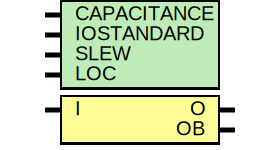

# Entity: OBUFDS

## Diagram

## Description

   Copyright (c) 1995/2009 Xilinx, Inc.
 
    Licensed under the Apache License, Version 2.0 (the "License");
    you may not use this file except in compliance with the License.
    You may obtain a copy of the License at
 
        http://www.apache.org/licenses/LICENSE-2.0
 
    Unless required by applicable law or agreed to in writing, software
    distributed under the License is distributed on an "AS IS" BASIS,
    WITHOUT WARRANTIES OR CONDITIONS OF ANY KIND, either express or implied.
    See the License for the specific language governing permissions and
    limitations under the License.
   ____  ____
  /   /\/   /
 /___/  \  /    Vendor : Xilinx
 \   \   \/     Version : 8.1i (I.13)
  \   \         Description : Xilinx Timing Simulation Library Component
  /   /                  Differential Signaling Output Buffer
 /___/   /\     Filename : OBUFDS.v
 \   \  /  \    Timestamp : Tue Mar  1 14:57:54 PST 2005
  \___\/\___\
 Revision:
    03/23/04 - Initial version.
    03/01/05 - Added global GTS.
    03/01/05 - Added LOC parameter.
    05/23/05 - Declared tri0 GTS.
    07/21/05 - CR 212974 -- matched unisim parameters as requested by other tools
    12/13/11 - Added `celldefine and `endcelldefine (CR 524859).
    10/22/14 - Added #1 to $finish (CR 808642).
 End Revision
 
## Generics

| Generic name | Type | Value       | Description |
| ------------ | ---- | ----------- | ----------- |
| CAPACITANCE  |      | "DONT_CARE" |             |
| IOSTANDARD   |      | "DEFAULT"   |             |
| SLEW         |      | "SLOW"      |             |
| LOC          |      | " UNPLACED" |             |
## Ports

| Port name | Direction | Type | Description |
| --------- | --------- | ---- | ----------- |
| O         | output    |      |             |
| OB        | output    |      |             |
| I         | input     |      |             |
## Signals

| Name | Type | Description |
| ---- | ---- | ----------- |
| GTS  | tri0 |             |
