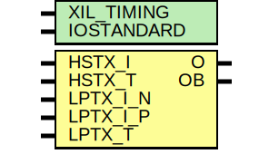

# Entity: OBUFDS_DPHY

## Diagram

## Description

    Copyright (c) 1995/2015 Xilinx, Inc.
 
    Licensed under the Apache License, Version 2.0 (the "License");
    you may not use this file except in compliance with the License.
    You may obtain a copy of the License at
 
        http://www.apache.org/licenses/LICENSE-2.0
 
    Unless required by applicable law or agreed to in writing, software
    distributed under the License is distributed on an "AS IS" BASIS,
    WITHOUT WARRANTIES OR CONDITIONS OF ANY KIND, either express or implied.
    See the License for the specific language governing permissions and
    limitations under the License.
   ____  ____
  /   /\/   /
 /___/  \  /     Vendor      : Xilinx
 \   \   \/      Version     : 2015.4
  \   \          Description : Xilinx Unified Simulation Library Component
  /   /                        _no_description_
 /___/   /\      Filename    : OBUFDS_DPHY.v
 \   \  /  \
  \___\/\___\
  Revision:
  End Revision:
 
## Generics

| Generic name | Type | Value      | Description |
| ------------ | ---- | ---------- | ----------- |
| XIL_TIMING   |      | "UNPLACED" |             |
| IOSTANDARD   |      | "DEFAULT"  |             |
## Ports

| Port name | Direction | Type | Description |
| --------- | --------- | ---- | ----------- |
| O         | output    |      |             |
| OB        | output    |      |             |
| HSTX_I    | input     |      |             |
| HSTX_T    | input     |      |             |
| LPTX_I_N  | input     |      |             |
| LPTX_I_P  | input     |      |             |
| LPTX_T    | input     |      |             |
## Signals

| Name           | Type | Description |
| -------------- | ---- | ----------- |
| trig_attr      | reg  |             |
| IOSTANDARD_BIN | wire |             |
| attr_test      | reg  |             |
| attr_test      | reg  |             |
| attr_err       | reg  |             |
| glblGSR        | tri0 |             |
| OB_out         | reg  |             |
| O_out          | reg  |             |
| HSTX_I_in      | wire |             |
| HSTX_T_in      | wire |             |
| LPTX_I_N_in    | wire |             |
| LPTX_I_P_in    | wire |             |
| LPTX_T_in      | wire |             |
| hs_mode        | reg  |             |
## Constants

| Name               | Type   | Value         | Description                        |
| ------------------ | ------ | ------------- | ---------------------------------- |
| MODULE_NAME        |        | "OBUFDS_DPHY" | define constants                   |
| IOSTANDARD_DEFAULT |        | 0             | Parameter encodings and registers  |
| IOSTANDARD_REG     | [56:1] | IOSTANDARD    |                                    |
## Processes
- unnamed: ( @ (LPTX_T_in or HSTX_T_in or LPTX_I_P_in or LPTX_I_N_in or HSTX_I_in) )
**Description**
initial begin
    #1;
    trig_attr = ~trig_attr;
  end
  
  always @ (trig_attr) begin
    #1;
    if ((attr_test == 1'b1) ||
        ((IOSTANDARD_REG != "DEFAULT"))) begin
      $display("Error: [Unisim %s-101] IOSTANDARD attribute is set to %s.  Legal values for this attribute are DEFAULT. Instance: %m", MODULE_NAME, IOSTANDARD_REG);
      attr_err = 1'b1;
    end
    
    if (attr_err == 1'b1) #1 $finish;
  end
*/

