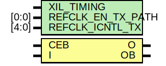

# Entity: OBUFDS_GTE3

## Diagram

## Description

    Copyright (c) 2011 Xilinx Inc.
 
    Licensed under the Apache License, Version 2.0 (the "License");
    you may not use this file except in compliance with the License.
    You may obtain a copy of the License at
 
        http://www.apache.org/licenses/LICENSE-2.0
 
    Unless required by applicable law or agreed to in writing, software
    distributed under the License is distributed on an "AS IS" BASIS,
    WITHOUT WARRANTIES OR CONDITIONS OF ANY KIND, either express or implied.
    See the License for the specific language governing permissions and
    limitations under the License.
   ____   ___
  /   /\/   / 
 /___/  \  /     Vendor      : Xilinx 
 \   \   \/      Version     : 2012.2
  \   \          Description : Xilinx Unified Simulation Library Component
  /   /                        
 /___/   /\      Filename    : OBUFDS_GTE3.v
 \   \  /  \ 
  \___\/\___\                    
                                 
  Revision:
  12/11/2012 - Initial version
  03/22/2013 - Model added
  03/25/2013 - Sync 5 YML & model update
  04/12/2013 - Add attribute section
  08/28/2013 - Remove REFCLKOUT_CLKOUT_SEL, Add specify section
  06/02/2014 - New simulation library message format.
    10/22/14 - Added #1 to $finish (CR 808642).
 End Revision:
 
## Generics

| Generic name      | Type  | Value      | Description |
| ----------------- | ----- | ---------- | ----------- |
| XIL_TIMING        |       | "UNPLACED" |             |
| REFCLK_EN_TX_PATH | [0:0] | 1'b0       |             |
| REFCLK_ICNTL_TX   | [4:0] | 5'b00000   |             |
## Ports

| Port name | Direction | Type | Description |
| --------- | --------- | ---- | ----------- |
| O         | output    |      |             |
| OB        | output    |      |             |
| CEB       | input     |      |             |
| I         | input     |      |             |
## Signals

| Name                  | Type       | Description |
| --------------------- | ---------- | ----------- |
| REFCLK_EN_TX_PATH_BIN | wire       |             |
| REFCLK_ICNTL_TX_BIN   | wire [4:0] |             |
| GTS                   | tri0       |             |
| glblGSR               | tri0       |             |
| notifier              | reg        |             |
| t1                    | wire       |             |
| t2                    | wire       |             |
## Constants

| Name                  | Type  | Value             | Description       |
| --------------------- | ----- | ----------------- | ----------------- |
| MODULE_NAME           |       | "OBUFDS_GTE3"     | define constants  |
| REFCLK_EN_TX_PATH_REG | [0:0] | REFCLK_EN_TX_PATH |                   |
| REFCLK_ICNTL_TX_REG   | [4:0] | REFCLK_ICNTL_TX   |                   |
