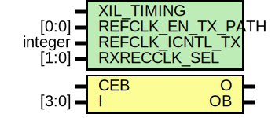

# Entity: OBUFDS_GTM_ADV

## Diagram

## Description

    Copyright (c) 1995/2018 Xilinx, Inc.
 
    Licensed under the Apache License, Version 2.0 (the "License");
    you may not use this file except in compliance with the License.
    You may obtain a copy of the License at
 
        http://www.apache.org/licenses/LICENSE-2.0
 
    Unless required by applicable law or agreed to in writing, software
    distributed under the License is distributed on an "AS IS" BASIS,
    WITHOUT WARRANTIES OR CONDITIONS OF ANY KIND, either express or implied.
    See the License for the specific language governing permissions and
    limitations under the License.
   ____  ____
  /   /\/   /
 /___/  \  /     Vendor      : Xilinx
 \   \   \/      Version     : 2018.3
  \   \          Description : Xilinx Unified Simulation Library Component
  /   /                        OBUFDS_GTM_ADV
 /___/   /\      Filename    : OBUFDS_GTM_ADV.v
 \   \  /  \
  \___\/\___\
  Revision:
  End Revision:
 
## Generics

| Generic name      | Type    | Value      | Description |
| ----------------- | ------- | ---------- | ----------- |
| XIL_TIMING        |         | "UNPLACED" |             |
| REFCLK_EN_TX_PATH | [0:0]   | 1'b0       |             |
| REFCLK_ICNTL_TX   | integer | 0          |             |
| RXRECCLK_SEL      | [1:0]   | 2'b00      |             |
## Ports

| Port name | Direction | Type  | Description |
| --------- | --------- | ----- | ----------- |
| O         | output    |       |             |
| OB        | output    |       |             |
| CEB       | input     |       |             |
| I         | input     | [3:0] |             |
## Signals

| Name                  | Type       | Description             |
| --------------------- | ---------- | ----------------------- |
| trig_attr             | reg        |                         |
| REFCLK_EN_TX_PATH_REG | reg [0:0]  |                         |
| REFCLK_ICNTL_TX_REG   | reg [31:0] |                         |
| RXRECCLK_SEL_REG      | reg [1:0]  |                         |
| REFCLK_ICNTL_TX_BIN   | wire [3:0] |                         |
| REFCLK_ICNTL_TX_BIN   | reg [3:0]  |                         |
| glblGSR               | reg        |                         |
| glblGTS               | reg        |                         |
| glblGSR               | tri0       |                         |
| glblGTS               | tri0       |                         |
| attr_test             | reg        |                         |
| attr_err              | reg        |                         |
| I_sel                 | reg        | begin behavioral model  |
## Constants

| Name        | Type | Value            | Description       |
| ----------- | ---- | ---------------- | ----------------- |
| MODULE_NAME |      | "OBUFDS_GTM_ADV" | define constants  |
## Processes
- unnamed: ( @ (trig_attr) )
- unnamed: ( @ (trig_attr) )
- unnamed: ( @(*) )
**Description**
=====================
Generate I_sel
=====================

