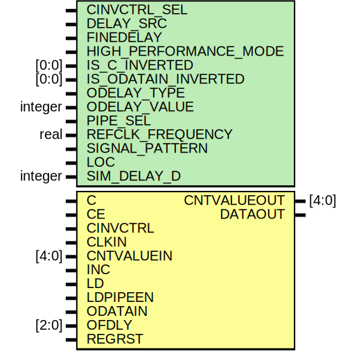

# Entity: ODELAYE2_FINEDELAY

## Diagram

## Description

   Copyright (c) 1995/2011 Xilinx, Inc.
 
    Licensed under the Apache License, Version 2.0 (the "License");
    you may not use this file except in compliance with the License.
    You may obtain a copy of the License at
 
        http://www.apache.org/licenses/LICENSE-2.0
 
    Unless required by applicable law or agreed to in writing, software
    distributed under the License is distributed on an "AS IS" BASIS,
    WITHOUT WARRANTIES OR CONDITIONS OF ANY KIND, either express or implied.
    See the License for the specific language governing permissions and
    limitations under the License.
   ____  ____
  /   /\/   /
 /___/  \  /    Vendor : Xilinx
 \   \   \/     Version : 13.0
  \   \         Description : Xilinx Functional and Timing Simulation Library Component
  /   /                  Onput Fixed or Variable Delay Element with Fine Adjustment.
 /___/   /\     Filename : ODELAYE2_FINEDELAY.v
 \   \  /  \    Timestamp : Tue Feb 15 15:52:17 PST 2011 
  \___\/\___\
 Revision:
    02/15/11 - Initial version.
    12/13/11 - Added `celldefine and `endcelldefine (CR 524859).
    10/22/14 - Added #1 to $finish (CR 808642).
 End Revision
 
## Generics

| Generic name          | Type    | Value      | Description |
| --------------------- | ------- | ---------- | ----------- |
| CINVCTRL_SEL          |         | "FALSE"    |             |
| DELAY_SRC             |         | "ODATAIN"  |             |
| FINEDELAY             |         | "BYPASS"   |             |
| HIGH_PERFORMANCE_MODE |         | "FALSE"    |             |
| IS_C_INVERTED         | [0:0]   | 1'b0       |             |
| IS_ODATAIN_INVERTED   | [0:0]   | 1'b0       |             |
| ODELAY_TYPE           |         | "FIXED"    |             |
| ODELAY_VALUE          | integer | 0          |             |
| PIPE_SEL              |         | "FALSE"    |             |
| REFCLK_FREQUENCY      | real    | 200.0      |             |
| SIGNAL_PATTERN        |         | "DATA"     |             |
| LOC                   |         | "UNPLACED" |             |
| SIM_DELAY_D           | integer | 0          |             |
## Ports

| Port name   | Direction | Type  | Description       |
| ----------- | --------- | ----- | ----------------- |
| CNTVALUEOUT | output    | [4:0] | ifndef XIL_TIMING |
| DATAOUT     | output    |       |                   |
| C           | input     |       |                   |
| CE          | input     |       |                   |
| CINVCTRL    | input     |       |                   |
| CLKIN       | input     |       |                   |
| CNTVALUEIN  | input     | [4:0] |                   |
| INC         | input     |       |                   |
| LD          | input     |       |                   |
| LDPIPEEN    | input     |       |                   |
| ODATAIN     | input     |       |                   |
| OFDLY       | input     | [2:0] |                   |
| REGRST      | input     |       |                   |
## Signals

| Name               | Type       | Description       |
| ------------------ | ---------- | ----------------- |
| DELAY_D            | integer    |                   |
| GSR                | tri0       |                   |
| CALC_TAPDELAY_RD   | real       | regular tap delay |
| CALC_TAPDELAY_FD   | real       | fine tap delay    |
| INIT_DELAY_RD      | real       |                   |
| INIT_DELAY_FD      | real       |                   |
| odelay_count       | integer    |                   |
| CNTVALUEIN_INTEGER | integer    |                   |
| cntvalueout_pre    | reg [4:0]  |                   |
| notifier           | reg        |                   |
| data_mux           | reg        |                   |
| tap_out_rd         | reg        |                   |
| tap_out_fd         | reg        |                   |
| tap_out_final      | reg        |                   |
| DATAOUT_reg        | reg        |                   |
| delay_chain_0      | wire       |                   |
| delay_chain_1      | wire       |                   |
| delay_chain_2      | wire       |                   |
| delay_chain_3      | wire       |                   |
| delay_chain_4      | wire       |                   |
| delay_chain_5      | wire       |                   |
| delay_chain_6      | wire       |                   |
| delay_chain_7      | wire       |                   |
| delay_chain_8      | wire       |                   |
| delay_chain_9      | wire       |                   |
| delay_chain_10     | wire       |                   |
| delay_chain_11     | wire       |                   |
| delay_chain_12     | wire       |                   |
| delay_chain_13     | wire       |                   |
| delay_chain_14     | wire       |                   |
| delay_chain_15     | wire       |                   |
| delay_chain_16     | wire       |                   |
| delay_chain_17     | wire       |                   |
| delay_chain_18     | wire       |                   |
| delay_chain_19     | wire       |                   |
| delay_chain_20     | wire       |                   |
| delay_chain_21     | wire       |                   |
| delay_chain_22     | wire       |                   |
| delay_chain_23     | wire       |                   |
| delay_chain_24     | wire       |                   |
| delay_chain_25     | wire       |                   |
| delay_chain_26     | wire       |                   |
| delay_chain_27     | wire       |                   |
| delay_chain_28     | wire       |                   |
| delay_chain_29     | wire       |                   |
| delay_chain_30     | wire       |                   |
| delay_chain_31     | wire       |                   |
| fine_delay_0       | wire       |                   |
| fine_delay_1       | wire       |                   |
| fine_delay_2       | wire       |                   |
| fine_delay_3       | wire       |                   |
| fine_delay_4       | wire       |                   |
| fine_delay_5       | wire       |                   |
| c_in               | reg        |                   |
| c_in_pre           | wire       |                   |
| delay_c            | wire       |                   |
| ce_in              | wire       |                   |
| delay_ce           | wire       |                   |
| cinvctrl_in        | wire       |                   |
| delay_cinvctrl     | wire       |                   |
| clkin_in           | wire       |                   |
| delay_clkin        | wire       |                   |
| cntvaluein_in      | wire [4:0] |                   |
| delay_cntvaluein   | wire [4:0] |                   |
| odatain_in         | wire       |                   |
| delay_odatain      | wire       |                   |
| ofdly_in           | wire       |                   |
| delay_ofdly        | wire       |                   |
| gsr_in             | wire       |                   |
| inc_in             | wire       |                   |
| delay_inc          | wire       |                   |
| ld_in              | wire       |                   |
| delay_ld           | wire       |                   |
| ldpipeen_in        | wire       |                   |
| delay_ldpipeen     | wire       |                   |
| regrst_in          | wire       |                   |
| delay_regrst       | wire       |                   |
| qcntvalueout_reg   | reg [4:0]  |                   |
| qcntvalueout_mux   | reg [4:0]  |                   |
| c_en_n             | wire       |                   |
| c_en_p             | wire       |                   |
| c_d_en             | wire       |                   |
| o_d_en             | wire       |                   |
## Constants

| Name                  | Type | Value       | Description |
| --------------------- | ---- | ----------- | ----------- |
| DELAY_D               |      | SIM_DELAY_D |             |
| MAX_DELAY_COUNT       |      | 31          |             |
| MIN_DELAY_COUNT       |      | 0           |             |
| MAX_REFCLK_FREQUENCYL |      | 210.0       |             |
| MIN_REFCLK_FREQUENCYL |      | 190.0       |             |
| MAX_REFCLK_FREQUENCYH |      | 410.0       |             |
| MIN_REFCLK_FREQUENCYH |      | 290.0       |             |
## Processes
- unnamed: ( @(tap_out_final) )
**Description**
CR 587496
assign #INIT_DELAY DATAOUT = tap_out_final;

- unnamed: ( @(gsr_in) )
- unnamed: ( @(odelay_count) )
- unnamed: ( @(posedge c_in) )
- unnamed: ( @(posedge c_in) )
- unnamed: ( @(cntvaluein_in or gsr_in) )
**Description**
always @ (posedge c_in)

- unnamed: ( @(clkin_in or odatain_in) )
- unnamed: ( @(odelay_count) )
- unnamed: ( @(ofdly_in) )
- unnamed: ( @(notifier) )
