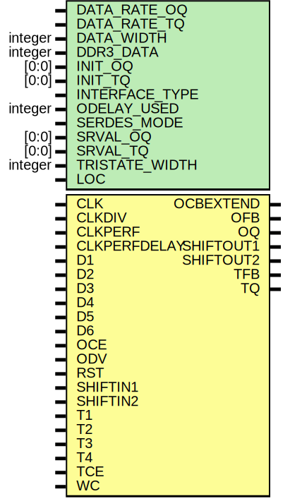

# Entity: OSERDESE1

## Diagram

## Description

   Copyright (c) 1995/2005 Xilinx, Inc.
 
    Licensed under the Apache License, Version 2.0 (the "License");
    you may not use this file except in compliance with the License.
    You may obtain a copy of the License at
 
        http://www.apache.org/licenses/LICENSE-2.0
 
    Unless required by applicable law or agreed to in writing, software
    distributed under the License is distributed on an "AS IS" BASIS,
    WITHOUT WARRANTIES OR CONDITIONS OF ANY KIND, either express or implied.
    See the License for the specific language governing permissions and
    limitations under the License.
   ____  ____
  /   /\/   /
 /___/  \  /    Vendor : Xilinx
 \   \   \/     Version : 10.1
  \   \         Description : Xilinx Timing Simulation Library Component
  /   /                  Source Synchronous Output Serializer
 /___/   /\     Filename : OSERDESE1.v
 \   \  /  \    Timestamp : Tue Sep 16 15:30:44 PDT 2008
  \___\/\___\
 Revision:
    09/16/08 - Initial version.
    12/05/08 - IR 495397.
    01/13/09 - IR 503429.
    01/15/09 - IR 503783 CLKPERF is not inverted for OFB/ofb_out.
    02/06/09 - CR 507373 Removed IOCLKGLITCH and CLKB
    02/26/09 - CR 510489 fixed SHIFTIN2_in
    03/16/09 - CR 512140 and 512139 -- sdf load errors
    01/27/10 - CR 546419 Updated specify block
    12/13/11 - Added `celldefine and `endcelldefine (CR 524859).
    09/04/12 - 676501 CLK -> OFB specify path missing
    10/22/14 - Added #1 to $finish (CR 808642).
 End Revision
 
## Generics

| Generic name   | Type    | Value      | Description |
| -------------- | ------- | ---------- | ----------- |
| DATA_RATE_OQ   |         | "DDR"      |             |
| DATA_RATE_TQ   |         | "DDR"      |             |
| DATA_WIDTH     | integer | 4          |             |
| DDR3_DATA      | integer | 1          |             |
| INIT_OQ        | [0:0]   | 1'b0       |             |
| INIT_TQ        | [0:0]   | 1'b0       |             |
| INTERFACE_TYPE |         | "DEFAULT"  |             |
| ODELAY_USED    | integer | 0          |             |
| SERDES_MODE    |         | "MASTER"   |             |
| SRVAL_OQ       | [0:0]   | 1'b0       |             |
| SRVAL_TQ       | [0:0]   | 1'b0       |             |
| TRISTATE_WIDTH | integer | 4          |             |
| LOC            |         | "UNPLACED" |             |
## Ports

| Port name    | Direction | Type | Description                                                                                                                                                                                                                                                                                                                                                                                                                                                                                                                                    |
| ------------ | --------- | ---- | ---------------------------------------------------------------------------------------------------------------------------------------------------------------------------------------------------------------------------------------------------------------------------------------------------------------------------------------------------------------------------------------------------------------------------------------------------------------------------------------------------------------------------------------------- |
| OCBEXTEND    | output    |      | Inputs:CLK:  High speed clock from DCM CLKB: Inverted High speed clock from DCM CLKDIV: Low speed divided clock from DCM CLKPERF: Performance Path clock CLKPERFDELAY: delayed Performance Path clock D1, D2, D3, D4, D5, D6 : Data inputs OCE: Clock enable for output data flops ODV: ODELAY value > 140 degrees RST: Reset control T1, T2, T3, T4: tristate inputs SHIFTIN1: Carry in data 1 for master from slave SHIFTIN2: Carry in data 2 for master from slave TCE: Tristate clock enable WC: Write command given by memory controller  |
| OFB          | output    |      |                                                                                                                                                                                                                                                                                                                                                                                                                                                                                                                                                |
| OQ           | output    |      |                                                                                                                                                                                                                                                                                                                                                                                                                                                                                                                                                |
| SHIFTOUT1    | output    |      |                                                                                                                                                                                                                                                                                                                                                                                                                                                                                                                                                |
| SHIFTOUT2    | output    |      |                                                                                                                                                                                                                                                                                                                                                                                                                                                                                                                                                |
| TFB          | output    |      |                                                                                                                                                                                                                                                                                                                                                                                                                                                                                                                                                |
| TQ           | output    |      |                                                                                                                                                                                                                                                                                                                                                                                                                                                                                                                                                |
| CLK          | input     |      |                                                                                                                                                                                                                                                                                                                                                                                                                                                                                                                                                |
| CLKDIV       | input     |      |                                                                                                                                                                                                                                                                                                                                                                                                                                                                                                                                                |
| CLKPERF      | input     |      |                                                                                                                                                                                                                                                                                                                                                                                                                                                                                                                                                |
| CLKPERFDELAY | input     |      |                                                                                                                                                                                                                                                                                                                                                                                                                                                                                                                                                |
| D1           | input     |      |                                                                                                                                                                                                                                                                                                                                                                                                                                                                                                                                                |
| D2           | input     |      |                                                                                                                                                                                                                                                                                                                                                                                                                                                                                                                                                |
| D3           | input     |      |                                                                                                                                                                                                                                                                                                                                                                                                                                                                                                                                                |
| D4           | input     |      |                                                                                                                                                                                                                                                                                                                                                                                                                                                                                                                                                |
| D5           | input     |      |                                                                                                                                                                                                                                                                                                                                                                                                                                                                                                                                                |
| D6           | input     |      |                                                                                                                                                                                                                                                                                                                                                                                                                                                                                                                                                |
| OCE          | input     |      |                                                                                                                                                                                                                                                                                                                                                                                                                                                                                                                                                |
| ODV          | input     |      |                                                                                                                                                                                                                                                                                                                                                                                                                                                                                                                                                |
| RST          | input     |      |                                                                                                                                                                                                                                                                                                                                                                                                                                                                                                                                                |
| SHIFTIN1     | input     |      |                                                                                                                                                                                                                                                                                                                                                                                                                                                                                                                                                |
| SHIFTIN2     | input     |      |                                                                                                                                                                                                                                                                                                                                                                                                                                                                                                                                                |
| T1           | input     |      |                                                                                                                                                                                                                                                                                                                                                                                                                                                                                                                                                |
| T2           | input     |      |                                                                                                                                                                                                                                                                                                                                                                                                                                                                                                                                                |
| T3           | input     |      |                                                                                                                                                                                                                                                                                                                                                                                                                                                                                                                                                |
| T4           | input     |      |                                                                                                                                                                                                                                                                                                                                                                                                                                                                                                                                                |
| TCE          | input     |      |                                                                                                                                                                                                                                                                                                                                                                                                                                                                                                                                                |
| WC           | input     |      |                                                                                                                                                                                                                                                                                                                                                                                                                                                                                                                                                |
## Signals

| Name               | Type       | Description     |
| ------------------ | ---------- | --------------- |
| SERDES             | wire       |                 |
| DDR_CLK_EDGE       | wire       |                 |
| SRTYPE             | wire [5:0] |                 |
| WC_DELAY           | wire       |                 |
| SELFHEAL           | wire [4:0] |                 |
| load               | wire       |                 |
| qmux1              | wire       |                 |
| qmux2              | wire       |                 |
| tmux1              | wire       |                 |
| tmux2              | wire       |                 |
| data1              | wire       |                 |
| data2              | wire       |                 |
| triin1             | wire       |                 |
| triin2             | wire       |                 |
| d2rnk2             | wire       |                 |
| CLKD               | wire       |                 |
| CLKDIVD            | wire       |                 |
| iodelay_state      | wire       |                 |
| data_rate_int      | reg        | attribute       |
| data_width_int     | reg [3:0]  |                 |
| tristate_width_int | reg [1:0]  |                 |
| data_rate_oq_int   | reg        |                 |
| data_rate_tq_int   | reg [1:0]  |                 |
| ddr3_data_int      | reg        |                 |
| interface_type_int | reg        |                 |
| odelay_used_int    | reg        |                 |
| serdes_mode_int    | reg        |                 |
| ioclkglitch_out    | wire       | Output signals  |
| ocbextend_out      | wire       | Output signals  |
| ofb_out            | wire       | Output signals  |
| oq_out             | wire       | Output signals  |
| tq_out             | wire       | Output signals  |
| shiftout1_out      | wire       | Output signals  |
| shiftout2_out      | wire       | Output signals  |
| tfb_out            | wire       |                 |
| GSR                | tri0       | Other signals   |
| notifier           | reg        |                 |
| CLK_in             | wire       |                 |
| CLKDIV_in          | wire       |                 |
| CLKPERF_in         | wire       |                 |
| CLKPERFDELAY_in    | wire       |                 |
| D1_in              | wire       |                 |
| D2_in              | wire       |                 |
| D3_in              | wire       |                 |
| D4_in              | wire       |                 |
| D5_in              | wire       |                 |
| D6_in              | wire       |                 |
| OCE_in             | wire       |                 |
| ODV_in             | wire       |                 |
| RST_in             | wire       |                 |
| SHIFTIN1_in        | wire       |                 |
| SHIFTIN2_in        | wire       |                 |
| T1_in              | wire       |                 |
| T2_in              | wire       |                 |
| T3_in              | wire       |                 |
| T4_in              | wire       |                 |
| TCE_in             | wire       |                 |
| WC_in              | wire       |                 |
## Instantiations

- dfront: rank12d_oserdese1_vlog
- tfront: trif_oserdese1_vlog
- DDR3FIFO: txbuffer_oserdese1_vlog
- datao: dout_oserdese1_vlog
- trio: tout_oserdese1_vlog
