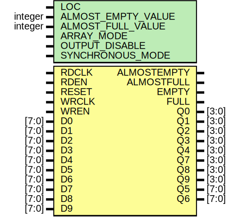

# Entity: OUT_FIFO

## Diagram

## Description

    Copyright (c) 2010 Xilinx Inc.
 
    Licensed under the Apache License, Version 2.0 (the "License");
    you may not use this file except in compliance with the License.
    You may obtain a copy of the License at
 
        http://www.apache.org/licenses/LICENSE-2.0
 
    Unless required by applicable law or agreed to in writing, software
    distributed under the License is distributed on an "AS IS" BASIS,
    WITHOUT WARRANTIES OR CONDITIONS OF ANY KIND, either express or implied.
    See the License for the specific language governing permissions and
    limitations under the License.
   ____   ___
  /   /\/   / 
 /___/  \  /     Vendor      : Xilinx 
 \  \    \/      Version     : 13.1
  \  \           Description : Xilinx Simulation Library Component
  /  /                         7SERIES OUT FIFO
 /__/   /\       Filename    : OUT_FIFO.v
 \  \  /  \ 
  \__\/\__ \                    
                                 
  Date:     Comment:
  15MAR2010 Initial UNI/UNP/SIM version from yml
  03JUN2010 yml update
  10JUN2010 yml update
  29JUN2010 enable encrypted rtl
  10AUG2010 yml, rtl update
  28SEP2010 minor clean up
            add width checks
  28OCT2010 rtl update
  05NOV2010 update defaults
  11JAN2011 586040 correct spelling XIL_TIMING vs XIL_TIMIMG
  15AUG2011 621681 remove SIM_SPEEDUP, make default
  21SEP2011 625537 period checks on RDCLK, WRCLK
  16FEB2012 645871 add conditions to RDEN -> Q delays
 
## Generics

| Generic name       | Type    | Value              | Description |
| ------------------ | ------- | ------------------ | ----------- |
| LOC                |         | "UNPLACED"         |             |
| ALMOST_EMPTY_VALUE | integer | 1                  |             |
| ALMOST_FULL_VALUE  | integer | 1                  |             |
| ARRAY_MODE         |         | "ARRAY_MODE_8_X_4" |             |
| OUTPUT_DISABLE     |         | "FALSE"            |             |
| SYNCHRONOUS_MODE   |         | "FALSE"            |             |
## Ports

| Port name   | Direction | Type  | Description |
| ----------- | --------- | ----- | ----------- |
| ALMOSTEMPTY | output    |       |             |
| ALMOSTFULL  | output    |       |             |
| EMPTY       | output    |       |             |
| FULL        | output    |       |             |
| Q0          | output    | [3:0] |             |
| Q1          | output    | [3:0] |             |
| Q2          | output    | [3:0] |             |
| Q3          | output    | [3:0] |             |
| Q4          | output    | [3:0] |             |
| Q7          | output    | [3:0] |             |
| Q8          | output    | [3:0] |             |
| Q9          | output    | [3:0] |             |
| Q5          | output    | [7:0] |             |
| Q6          | output    | [7:0] |             |
| RDCLK       | input     |       |             |
| RDEN        | input     |       |             |
| RESET       | input     |       |             |
| WRCLK       | input     |       |             |
| WREN        | input     |       |             |
| D0          | input     | [7:0] |             |
| D1          | input     | [7:0] |             |
| D2          | input     | [7:0] |             |
| D3          | input     | [7:0] |             |
| D4          | input     | [7:0] |             |
| D5          | input     | [7:0] |             |
| D6          | input     | [7:0] |             |
| D7          | input     | [7:0] |             |
| D8          | input     | [7:0] |             |
| D9          | input     | [7:0] |             |
## Signals

| Name                      | Type       | Description |
| ------------------------- | ---------- | ----------- |
| ARRAY_MODE_BINARY         | reg [0:0]  |             |
| OUTPUT_DISABLE_BINARY     | reg [0:0]  |             |
| SLOW_RD_CLK_BINARY        | reg [0:0]  |             |
| SLOW_WR_CLK_BINARY        | reg [0:0]  |             |
| SYNCHRONOUS_MODE_BINARY   | reg [0:0]  |             |
| SPARE_BINARY              | reg [3:0]  |             |
| ALMOST_EMPTY_VALUE_BINARY | reg [7:0]  |             |
| ALMOST_FULL_VALUE_BINARY  | reg [7:0]  |             |
| GSR                       | tri0       |             |
| notifier                  | reg        |             |
| delay_Q0                  | wire [3:0] |             |
| delay_Q1                  | wire [3:0] |             |
| delay_Q2                  | wire [3:0] |             |
| delay_Q3                  | wire [3:0] |             |
| delay_Q4                  | wire [3:0] |             |
| delay_Q7                  | wire [3:0] |             |
| delay_Q8                  | wire [3:0] |             |
| delay_Q9                  | wire [3:0] |             |
| delay_Q5                  | wire [7:0] |             |
| delay_Q6                  | wire [7:0] |             |
| delay_ALMOSTEMPTY         | wire       |             |
| delay_ALMOSTFULL          | wire       |             |
| delay_EMPTY               | wire       |             |
| delay_FULL                | wire       |             |
| delay_SCANOUT             | wire [3:0] |             |
| delay_D0                  | wire [7:0] |             |
| delay_D1                  | wire [7:0] |             |
| delay_D2                  | wire [7:0] |             |
| delay_D3                  | wire [7:0] |             |
| delay_D4                  | wire [7:0] |             |
| delay_D5                  | wire [7:0] |             |
| delay_D6                  | wire [7:0] |             |
| delay_D7                  | wire [7:0] |             |
| delay_D8                  | wire [7:0] |             |
| delay_D9                  | wire [7:0] |             |
| delay_RDCLK               | wire       |             |
| delay_RDEN                | wire       |             |
| delay_RESET               | wire       |             |
| delay_SCANENB             | wire       |             |
| delay_TESTMODEB           | wire       |             |
| delay_TESTREADDISB        | wire       |             |
| delay_TESTWRITEDISB       | wire       |             |
| delay_SCANIN              | wire [3:0] |             |
| delay_WRCLK               | wire       |             |
| delay_WREN                | wire       |             |
| delay_GSR                 | wire       |             |
## Constants

| Name         | Type | Value      | Description |
| ------------ | ---- | ---------- | ----------- |
| in_delay     |      | 0          |             |
| out_delay    |      | 0          |             |
| in_delay     |      | 1          |             |
| out_delay    |      | 10         |             |
| INCLK_DELAY  |      | 0          |             |
| OUTCLK_DELAY |      | 0          |             |
| MODULE_NAME  |      | "OUT_FIFO" |             |
## Instantiations

- OUT_FIFO_INST: SIP_OUT_FIFO
