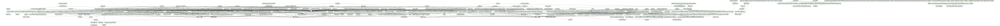

# Project documentation: 

## Designs

- Module: [axi_ad5766 ](./doc_internal/axi_ad5766.md)
- Module: [up_ad5766_sequencer ](./doc_internal/up_ad5766_sequencer.md)
- Module: [axi_ad6676 ](./doc_internal/axi_ad6676.md)
- Module: [axi_ad7616 ](./doc_internal/axi_ad7616.md)
- Module: [axi_ad7616_control ](./doc_internal/axi_ad7616_control.md)
- Module: [axi_ad7616_maxis2wrfifo ](./doc_internal/axi_ad7616_maxis2wrfifo.md)
- Module: [axi_ad7616_pif ](./doc_internal/axi_ad7616_pif.md)
- Module: [axi_ad9122 ](./doc_internal/axi_ad9122.md)
- Module: [axi_ad9122_channel ](./doc_internal/axi_ad9122_channel.md)
- Module: [axi_ad9122_core ](./doc_internal/axi_ad9122_core.md)
- Module: [axi_ad9122_if ](./doc_internal/axi_ad9122_if.md)
- Module: [axi_ad9144 ](./doc_internal/axi_ad9144.md)
- Module: [axi_ad9152 ](./doc_internal/axi_ad9152.md)
- Module: [axi_ad9162 ](./doc_internal/axi_ad9162.md)
- Module: [axi_ad9162_channel ](./doc_internal/axi_ad9162_channel.md)
- Module: [axi_ad9162_core ](./doc_internal/axi_ad9162_core.md)
- Module: [axi_ad9162_if ](./doc_internal/axi_ad9162_if.md)
- Module: [axi_ad9250 ](./doc_internal/axi_ad9250.md)
- Module: [axi_ad9265 ](./doc_internal/axi_ad9265.md)
- Module: [axi_ad9265_channel ](./doc_internal/axi_ad9265_channel.md)
- Module: [axi_ad9265_if ](./doc_internal/axi_ad9265_if.md)
- Module: [axi_ad9265_pnmon ](./doc_internal/axi_ad9265_pnmon.md)
- Module: [axi_ad9361 ](./doc_internal/axi_ad9361.md)
- Module: [axi_ad9361_rx ](./doc_internal/axi_ad9361_rx.md)
- Module: [axi_ad9361_rx_channel ](./doc_internal/axi_ad9361_rx_channel.md)
- Module: [axi_ad9361_rx_pnmon ](./doc_internal/axi_ad9361_rx_pnmon.md)
- Module: [axi_ad9361_tdd ](./doc_internal/axi_ad9361_tdd.md)
- Module: [axi_ad9361_tdd_if ](./doc_internal/axi_ad9361_tdd_if.md)
- Module: [axi_ad9361_tx ](./doc_internal/axi_ad9361_tx.md)
- Module: [axi_ad9361_tx_channel ](./doc_internal/axi_ad9361_tx_channel.md)
- Module: [axi_ad9361_alt_lvds_rx ](./doc_internal/axi_ad9361_alt_lvds_rx.md)
- Module: [axi_ad9361_alt_lvds_tx ](./doc_internal/axi_ad9361_alt_lvds_tx.md)
- Module: [axi_ad9361_cmos_if ](./doc_internal/axi_ad9361_cmos_if.md)
- Module: [axi_ad9361_lvds_if ](./doc_internal/axi_ad9361_lvds_if.md)
- Module: [axi_ad9361_lvds_if_10 ](./doc_internal/axi_ad9361_lvds_if_10.md)
- Module: [axi_ad9361_lvds_if_c5 ](./doc_internal/axi_ad9361_lvds_if_c5.md)
- Module: [axi_ad9361_cmos_if ](./doc_internal/axi_ad9361_cmos_if.md)
- Module: [axi_ad9361_lvds_if ](./doc_internal/axi_ad9361_lvds_if.md)
- Module: [axi_ad9371 ](./doc_internal/axi_ad9371.md)
- Module: [axi_ad9371_if ](./doc_internal/axi_ad9371_if.md)
- Module: [axi_ad9371_rx ](./doc_internal/axi_ad9371_rx.md)
- Module: [axi_ad9371_rx_channel ](./doc_internal/axi_ad9371_rx_channel.md)
- Module: [axi_ad9371_rx_os ](./doc_internal/axi_ad9371_rx_os.md)
- Module: [axi_ad9371_tx ](./doc_internal/axi_ad9371_tx.md)
- Module: [axi_ad9371_tx_channel ](./doc_internal/axi_ad9371_tx_channel.md)
- Module: [axi_ad9434 ](./doc_internal/axi_ad9434.md)
- Module: [axi_ad9434_core ](./doc_internal/axi_ad9434_core.md)
- Module: [axi_ad9434_if ](./doc_internal/axi_ad9434_if.md)
- Module: [axi_ad9434_pnmon ](./doc_internal/axi_ad9434_pnmon.md)
- Module: [axi_ad9467 ](./doc_internal/axi_ad9467.md)
- Module: [axi_ad9467_channel ](./doc_internal/axi_ad9467_channel.md)
- Module: [axi_ad9467_if ](./doc_internal/axi_ad9467_if.md)
- Module: [axi_ad9467_pnmon ](./doc_internal/axi_ad9467_pnmon.md)
- Module: [axi_ad9625 ](./doc_internal/axi_ad9625.md)
- Module: [axi_ad9625_channel ](./doc_internal/axi_ad9625_channel.md)
- Module: [axi_ad9625_if ](./doc_internal/axi_ad9625_if.md)
- Module: [axi_ad9625_pnmon ](./doc_internal/axi_ad9625_pnmon.md)
- Module: [axi_ad9671 ](./doc_internal/axi_ad9671.md)
- Module: [axi_ad9671_channel ](./doc_internal/axi_ad9671_channel.md)
- Module: [axi_ad9671_if ](./doc_internal/axi_ad9671_if.md)
- Module: [axi_ad9671_pnmon ](./doc_internal/axi_ad9671_pnmon.md)
- Module: [axi_ad9680 ](./doc_internal/axi_ad9680.md)
- Module: [axi_ad9684 ](./doc_internal/axi_ad9684.md)
- Module: [axi_ad9684_channel ](./doc_internal/axi_ad9684_channel.md)
- Module: [axi_ad9684_if ](./doc_internal/axi_ad9684_if.md)
- Module: [axi_ad9684_pnmon ](./doc_internal/axi_ad9684_pnmon.md)
- Module: [axi_ad9739a ](./doc_internal/axi_ad9739a.md)
- Module: [axi_ad9739a_channel ](./doc_internal/axi_ad9739a_channel.md)
- Module: [axi_ad9739a_core ](./doc_internal/axi_ad9739a_core.md)
- Module: [axi_ad9739a_if ](./doc_internal/axi_ad9739a_if.md)
- Module: [axi_ad9963 ](./doc_internal/axi_ad9963.md)
- Module: [axi_ad9963_if ](./doc_internal/axi_ad9963_if.md)
- Module: [axi_ad9963_rx ](./doc_internal/axi_ad9963_rx.md)
- Module: [axi_ad9963_rx_channel ](./doc_internal/axi_ad9963_rx_channel.md)
- Module: [axi_ad9963_rx_pnmon ](./doc_internal/axi_ad9963_rx_pnmon.md)
- Module: [axi_ad9963_tx ](./doc_internal/axi_ad9963_tx.md)
- Module: [axi_ad9963_tx_channel ](./doc_internal/axi_ad9963_tx_channel.md)
- Module: [axi_adc_decimate ](./doc_internal/axi_adc_decimate.md)
- Module: [axi_adc_decimate_filter ](./doc_internal/axi_adc_decimate_filter.md)
- Module: [axi_adc_decimate_reg ](./doc_internal/axi_adc_decimate_reg.md)
- Module: [cic_decim ](./doc_internal/cic_decim.md)
- Module: [fir_decim ](./doc_internal/fir_decim.md)
- Module: [axi_adc_trigger ](./doc_internal/axi_adc_trigger.md)
- Module: [axi_adc_trigger_reg ](./doc_internal/axi_adc_trigger_reg.md)
- Module: [adrv9001_aligner4 ](./doc_internal/adrv9001_aligner4.md)
- Module: [adrv9001_aligner8 ](./doc_internal/adrv9001_aligner8.md)
- Module: [adrv9001_pack ](./doc_internal/adrv9001_pack.md)
- Module: [adrv9001_rx ](./doc_internal/adrv9001_rx.md)
- Module: [adrv9001_rx_link ](./doc_internal/adrv9001_rx_link.md)
- Module: [adrv9001_tx ](./doc_internal/adrv9001_tx.md)
- Module: [adrv9001_tx_link ](./doc_internal/adrv9001_tx_link.md)
- Module: [axi_adrv9001 ](./doc_internal/axi_adrv9001.md)
- Module: [axi_ad9001_core ](./doc_internal/axi_adrv9001_core.md)
- Module: [axi_adrv9001_if ](./doc_internal/axi_adrv9001_if.md)
- Module: [axi_adrv9001_rx ](./doc_internal/axi_adrv9001_rx.md)
- Module: [axi_adrv9001_rx_channel ](./doc_internal/axi_adrv9001_rx_channel.md)
- Module: [axi_adrv9001_tdd ](./doc_internal/axi_adrv9001_tdd.md)
- Module: [axi_adrv9001_tx ](./doc_internal/axi_adrv9001_tx.md)
- Module: [axi_adrv9001_tx_channel ](./doc_internal/axi_adrv9001_tx_channel.md)
- Module: [adrv9001_rx ](./doc_internal/adrv9001_rx.md)
- Module: [adrv9001_tx ](./doc_internal/adrv9001_tx.md)
- Module: [axi_adrv9009 ](./doc_internal/axi_adrv9009.md)
- Module: [axi_adrv9009_if ](./doc_internal/axi_adrv9009_if.md)
- Module: [axi_adrv9009_rx ](./doc_internal/axi_adrv9009_rx.md)
- Module: [axi_adrv9009_rx_channel ](./doc_internal/axi_adrv9009_rx_channel.md)
- Module: [axi_adrv9009_rx_os ](./doc_internal/axi_adrv9009_rx_os.md)
- Module: [axi_adrv9009_tx ](./doc_internal/axi_adrv9009_tx.md)
- Module: [axi_adrv9009_tx_channel ](./doc_internal/axi_adrv9009_tx_channel.md)
- Module: [axi_clkgen ](./doc_internal/axi_clkgen.md)
- Module: [axi_dac_interpolate ](./doc_internal/axi_dac_interpolate.md)
- Module: [axi_dac_interpolate_filter ](./doc_internal/axi_dac_interpolate_filter.md)
- Module: [axi_dac_interpolate_reg ](./doc_internal/axi_dac_interpolate_reg.md)
- Module: [cic_interp ](./doc_internal/cic_interp.md)
- Module: [fir_interp ](./doc_internal/fir_interp.md)
- Module: [dmac_2d_transfer ](./doc_internal/2d_transfer.md)
- Module: [dmac_address_generator ](./doc_internal/address_generator.md)
- Module: [axi_dmac ](./doc_internal/axi_dmac.md)
- Module: [axi_dmac_burst_memory ](./doc_internal/axi_dmac_burst_memory.md)
- Module: [axi_dmac_regmap ](./doc_internal/axi_dmac_regmap.md)
- Module: [axi_dmac_regmap_request ](./doc_internal/axi_dmac_regmap_request.md)
- Module: [axi_dmac_reset_manager ](./doc_internal/axi_dmac_reset_manager.md)
- Module: [axi_dmac_resize_dest ](./doc_internal/axi_dmac_resize_dest.md)
- Module: [axi_dmac_resize_src ](./doc_internal/axi_dmac_resize_src.md)
- Module: [axi_dmac_response_manager ](./doc_internal/axi_dmac_response_manager.md)
- Module: [axi_dmac_transfer ](./doc_internal/axi_dmac_transfer.md)
- Module: [axi_register_slice ](./doc_internal/axi_register_slice.md)
- Module: [dmac_data_mover ](./doc_internal/data_mover.md)
- Module: [dmac_dest_mm_axi ](./doc_internal/dest_axi_mm.md)
- Module: [dmac_dest_axi_stream ](./doc_internal/dest_axi_stream.md)
- Module: [dmac_dest_fifo_inf ](./doc_internal/dest_fifo_inf.md)
- Module: [dmac_request_arb ](./doc_internal/request_arb.md)
- Module: [dmac_request_generator ](./doc_internal/request_generator.md)
- Module: [dmac_response_generator ](./doc_internal/response_generator.md)
- Module: [dmac_response_handler ](./doc_internal/response_handler.md)
- Module: [splitter ](./doc_internal/splitter.md)
- Module: [dmac_src_mm_axi ](./doc_internal/src_axi_mm.md)
- Module: [dmac_src_axi_stream ](./doc_internal/src_axi_stream.md)
- Module: [dmac_src_fifo_inf ](./doc_internal/src_fifo_inf.md)
- Module: [axi_read_slave ](./doc_internal/axi_read_slave.md)
- Module: [axi_slave ](./doc_internal/axi_slave.md)
- Module: [axi_write_slave ](./doc_internal/axi_write_slave.md)
- Module: [axi_fmcadc5_sync ](./doc_internal/axi_fmcadc5_sync.md)
- Module: [axi_fmcadc5_sync_calcor ](./doc_internal/axi_fmcadc5_sync_calcor.md)
- Module: [axi_generic_adc ](./doc_internal/axi_generic_adc.md)
- Module: [axi_gpreg ](./doc_internal/axi_gpreg.md)
- Module: [axi_gpreg_clock_mon ](./doc_internal/axi_gpreg_clock_mon.md)
- Module: [axi_gpreg_io ](./doc_internal/axi_gpreg_io.md)
- Module: [axi_hdmi_rx ](./doc_internal/axi_hdmi_rx.md)
- Module: [axi_hdmi_rx_core ](./doc_internal/axi_hdmi_rx_core.md)
- Module: [axi_hdmi_rx_es ](./doc_internal/axi_hdmi_rx_es.md)
- Module: [axi_hdmi_rx_tpm ](./doc_internal/axi_hdmi_rx_tpm.md)
- Module: [axi_hdmi_tx ](./doc_internal/axi_hdmi_tx.md)
- Module: [axi_hdmi_tx_core ](./doc_internal/axi_hdmi_tx_core.md)
- Module: [axi_hdmi_tx_es ](./doc_internal/axi_hdmi_tx_es.md)
- Module: [axi_hdmi_tx_vdma ](./doc_internal/axi_hdmi_tx_vdma.md)
- Module: [axi_i2s_adi ](./doc_internal/axi_i2s_adi.md)
- Module: [fifo_synchronizer ](./doc_internal/fifo_synchronizer.md)
- Module: [i2s_clkgen ](./doc_internal/i2s_clkgen.md)
- Module: [i2s_controller ](./doc_internal/i2s_controller.md)
- Module: [i2s_rx ](./doc_internal/i2s_rx.md)
- Module: [i2s_tx ](./doc_internal/i2s_tx.md)
- Module: [axi_intr_monitor ](./doc_internal/axi_intr_monitor.md)
- Module: [axi_laser_driver ](./doc_internal/axi_laser_driver.md)
- Module: [axi_laser_driver_regmap ](./doc_internal/axi_laser_driver_regmap.md)
- Module: [axi_logic_analyzer ](./doc_internal/axi_logic_analyzer.md)
- Module: [axi_logic_analyzer_reg ](./doc_internal/axi_logic_analyzer_reg.md)
- Module: [axi_logic_analyzer_trigger ](./doc_internal/axi_logic_analyzer_trigger.md)
- Module: [axi_mc_controller ](./doc_internal/axi_mc_controller.md)
- Module: [control_registers ](./doc_internal/control_registers.md)
- Module: [delay ](./doc_internal/delay.md)
- Module: [ad7401 ](./doc_internal/ad7401.md)
- Module: [axi_mc_current_monitor ](./doc_internal/axi_mc_current_monitor.md)
- Module: [dec256sinc24b ](./doc_internal/dec256sinc24b.md)
- Module: [axi_mc_speed ](./doc_internal/axi_mc_speed.md)
- Module: [debouncer ](./doc_internal/debouncer.md)
- Module: [delay_30_degrees ](./doc_internal/delay_30_degrees.md)
- Module: [speed_detector ](./doc_internal/speed_detector.md)
- Module: [axi_pulse_gen ](./doc_internal/axi_pulse_gen.md)
- Module: [axi_pulse_gen_regmap ](./doc_internal/axi_pulse_gen_regmap.md)
- Module: [axi_pwm_gen ](./doc_internal/axi_pwm_gen.md)
- Module: [axi_pwm_gen_1 ](./doc_internal/axi_pwm_gen_1.md)
- Module: [axi_pwm_gen_regmap ](./doc_internal/axi_pwm_gen_regmap.md)
- Module: [axi_rd_wr_combiner ](./doc_internal/axi_rd_wr_combiner.md)
- Module: [axi_spdif_rx ](./doc_internal/axi_spdif_rx.md)
- Module: [rx_cap_reg ](./doc_internal/rx_cap_reg.md)
- Module: [rx_decode ](./doc_internal/rx_decode.md)
- Package: [rx_package ](./doc_internal/rx_package.md)
- Module: [rx_phase_det ](./doc_internal/rx_phase_det.md)
- Module: [rx_status_reg ](./doc_internal/rx_status_reg.md)
- Module: [axi_spdif_tx ](./doc_internal/axi_spdif_tx.md)
- Module: [tx_encoder ](./doc_internal/tx_encoder.md)
- Package: [tx_package ](./doc_internal/tx_package.md)
- Module: [axi_tdd ](./doc_internal/axi_tdd.md)
- Module: [axi_usb_fx3 ](./doc_internal/axi_usb_fx3.md)
- Module: [axi_usb_fx3_core ](./doc_internal/axi_usb_fx3_core.md)
- Module: [axi_usb_fx3_if ](./doc_internal/axi_usb_fx3_if.md)
- Module: [axi_usb_fx3_reg ](./doc_internal/axi_usb_fx3_reg.md)
- Module: [cn0363_phase_data_sync ](./doc_internal/cn0363_phase_data_sync.md)
- Module: [ad_3w_spi ](./doc_internal/ad_3w_spi.md)
- Module: [ad_addsub ](./doc_internal/ad_addsub.md)
- Module: [ad_adl5904_rst ](./doc_internal/ad_adl5904_rst.md)
- Module: [ad_axis_inf_rx ](./doc_internal/ad_axis_inf_rx.md)
- Module: [ad_b2g ](./doc_internal/ad_b2g.md)
- Module: [ad_bus_mux ](./doc_internal/ad_bus_mux.md)
- Module: [ad_csc ](./doc_internal/ad_csc.md)
- Module: [ad_csc_CrYCb2RGB ](./doc_internal/ad_csc_CrYCb2RGB.md)
- Module: [ad_csc_RGB2CrYCb ](./doc_internal/ad_csc_RGB2CrYCb.md)
- Module: [ad_datafmt ](./doc_internal/ad_datafmt.md)
- Module: [ad_dds ](./doc_internal/ad_dds.md)
- Module: [ad_dds_1 ](./doc_internal/ad_dds_1.md)
- Module: [ad_dds_2 ](./doc_internal/ad_dds_2.md)
- Module: [ad_dds_cordic_pipe ](./doc_internal/ad_dds_cordic_pipe.md)
- Module: [ad_dds_sine ](./doc_internal/ad_dds_sine.md)
- Module: [ad_dds_sine_cordic ](./doc_internal/ad_dds_sine_cordic.md)
- Module: [ad_edge_detect ](./doc_internal/ad_edge_detect.md)
- Module: [ad_g2b ](./doc_internal/ad_g2b.md)
- Module: [ad_iobuf ](./doc_internal/ad_iobuf.md)
- Module: [ad_iqcor ](./doc_internal/ad_iqcor.md)
- Module: [ad_mem ](./doc_internal/ad_mem.md)
- Module: [ad_mem_asym ](./doc_internal/ad_mem_asym.md)
- Module: [ad_mux_core ](./doc_internal/ad_mux_core.md)
- Module: [ad_pack ](./doc_internal/ad_pack.md)
- Module: [ad_perfect_shuffle ](./doc_internal/ad_perfect_shuffle.md)
- Module: [ad_pngen ](./doc_internal/ad_pngen.md)
- Module: [ad_pnmon ](./doc_internal/ad_pnmon.md)
- Module: [ad_pps_receiver ](./doc_internal/ad_pps_receiver.md)
- Module: [ad_rst ](./doc_internal/ad_rst.md)
- Module: [ad_ss_422to444 ](./doc_internal/ad_ss_422to444.md)
- Module: [ad_ss_444to422 ](./doc_internal/ad_ss_444to422.md)
- Module: [ad_sysref_gen ](./doc_internal/ad_sysref_gen.md)
- Module: [ad_tdd_control ](./doc_internal/ad_tdd_control.md)
- Module: [ad_upack ](./doc_internal/ad_upack.md)
- Module: [ad_xcvr_rx_if ](./doc_internal/ad_xcvr_rx_if.md)
- Module: [axi_ctrlif ](./doc_internal/axi_ctrlif.md)
- Module: [axi_streaming_dma_rx_fifo ](./doc_internal/axi_streaming_dma_rx_fifo.md)
- Module: [axi_streaming_dma_tx_fifo ](./doc_internal/axi_streaming_dma_tx_fifo.md)
- Module: [dma_fifo ](./doc_internal/dma_fifo.md)
- Module: [pl330_dma_fifo ](./doc_internal/pl330_dma_fifo.md)
- Module: [up_adc_channel ](./doc_internal/up_adc_channel.md)
- Module: [up_adc_common ](./doc_internal/up_adc_common.md)
- Module: [up_axi ](./doc_internal/up_axi.md)
- Module: [up_clkgen ](./doc_internal/up_clkgen.md)
- Module: [up_clock_mon ](./doc_internal/up_clock_mon.md)
- Module: [up_dac_channel ](./doc_internal/up_dac_channel.md)
- Module: [up_dac_common ](./doc_internal/up_dac_common.md)
- Module: [up_delay_cntrl ](./doc_internal/up_delay_cntrl.md)
- Module: [up_hdmi_rx ](./doc_internal/up_hdmi_rx.md)
- Module: [up_hdmi_tx ](./doc_internal/up_hdmi_tx.md)
- Module: [up_pmod ](./doc_internal/up_pmod.md)
- Module: [up_tdd_cntrl ](./doc_internal/up_tdd_cntrl.md)
- Module: [up_xfer_cntrl ](./doc_internal/up_xfer_cntrl.md)
- Module: [up_xfer_status ](./doc_internal/up_xfer_status.md)
- Module: [util_axis_upscale ](./doc_internal/util_axis_upscale.md)
- Module: [util_dec256sinc24b ](./doc_internal/util_dec256sinc24b.md)
- Module: [util_delay ](./doc_internal/util_delay.md)
- Module: [util_pulse_gen ](./doc_internal/util_pulse_gen.md)
- Module: [cordic_demod ](./doc_internal/cordic_demod.md)
- Module: [adi_jesd204_glue ](./doc_internal/adi_jesd204_glue.md)
- Module: [avl_adxcfg ](./doc_internal/avl_adxcfg.md)
- Module: [avl_adxcvr_octet_swap ](./doc_internal/avl_adxcvr_octet_swap.md)
- Module: [avl_adxphy ](./doc_internal/avl_adxphy.md)
- Module: [avl_dacfifo ](./doc_internal/avl_dacfifo.md)
- Module: [avl_dacfifo_rd ](./doc_internal/avl_dacfifo_rd.md)
- Module: [axi_adxcvr ](./doc_internal/axi_adxcvr.md)
- Module: [axi_adxcvr_up ](./doc_internal/axi_adxcvr_up.md)
- Module: [ad_dcfilter ](./doc_internal/ad_dcfilter.md)
- Module: [ad_mul ](./doc_internal/ad_mul.md)
- Module: [jesd204_glue ](./doc_internal/jesd204_phy_glue.md)
- Module: [util_clkdiv ](./doc_internal/util_clkdiv.md)
- Module: [ad_ip_jesd204_tpl_adc ](./doc_internal/ad_ip_jesd204_tpl_adc.md)
- Module: [ad_ip_jesd204_tpl_adc_channel ](./doc_internal/ad_ip_jesd204_tpl_adc_channel.md)
- Module: [ad_ip_jesd204_tpl_adc_core ](./doc_internal/ad_ip_jesd204_tpl_adc_core.md)
- Module: [ad_ip_jesd204_tpl_adc_deframer ](./doc_internal/ad_ip_jesd204_tpl_adc_deframer.md)
- Module: [ad_ip_jesd204_tpl_adc_pnmon ](./doc_internal/ad_ip_jesd204_tpl_adc_pnmon.md)
- Module: [ad_ip_jesd204_tpl_adc_regmap ](./doc_internal/ad_ip_jesd204_tpl_adc_regmap.md)
- Module: [up_tpl_common ](./doc_internal/up_tpl_common.md)
- Module: [ad_ip_jesd204_tpl_dac ](./doc_internal/ad_ip_jesd204_tpl_dac.md)
- Module: [ad_ip_jesd204_tpl_dac_channel ](./doc_internal/ad_ip_jesd204_tpl_dac_channel.md)
- Module: [ad_ip_jesd204_tpl_dac_core ](./doc_internal/ad_ip_jesd204_tpl_dac_core.md)
- Module: [ad_ip_jesd204_tpl_dac_framer ](./doc_internal/ad_ip_jesd204_tpl_dac_framer.md)
- Module: [ad_ip_jesd204_tpl_dac_pn ](./doc_internal/ad_ip_jesd204_tpl_dac_pn.md)
- Module: [ad_ip_jesd204_tpl_dac_regmap ](./doc_internal/ad_ip_jesd204_tpl_dac_regmap.md)
- Module: [jesd204_up_common ](./doc_internal/jesd204_up_common.md)
- Module: [jesd204_up_sysref ](./doc_internal/jesd204_up_sysref.md)
- Module: [axi_jesd204_rx ](./doc_internal/axi_jesd204_rx.md)
- Module: [jesd204_up_ilas_mem ](./doc_internal/jesd204_up_ilas_mem.md)
- Module: [jesd204_up_rx ](./doc_internal/jesd204_up_rx.md)
- Module: [jesd204_up_rx_lane ](./doc_internal/jesd204_up_rx_lane.md)
- Module: [axi_jesd204_tx ](./doc_internal/axi_jesd204_tx.md)
- Module: [jesd204_up_tx ](./doc_internal/jesd204_up_tx.md)
- Module: [jesd204_crc12 ](./doc_internal/jesd204_crc12.md)
- Module: [jesd204_eof_generator ](./doc_internal/jesd204_eof_generator.md)
- Module: [jesd204_frame_align_replace ](./doc_internal/jesd204_frame_align_replace.md)
- Module: [jesd204_frame_mark ](./doc_internal/jesd204_frame_mark.md)
- Module: [jesd204_lmfc ](./doc_internal/jesd204_lmfc.md)
- Module: [jesd204_scrambler ](./doc_internal/jesd204_scrambler.md)
- Module: [jesd204_scrambler_64b ](./doc_internal/jesd204_scrambler_64b.md)
- Module: [pipeline_stage ](./doc_internal/pipeline_stage.md)
- Module: [sync_header_align ](./doc_internal/sync_header_align.md)
- Module: [align_mux ](./doc_internal/align_mux.md)
- Module: [elastic_buffer ](./doc_internal/elastic_buffer.md)
- Module: [error_monitor ](./doc_internal/error_monitor.md)
- Module: [jesd204_ilas_monitor ](./doc_internal/jesd204_ilas_monitor.md)
- Module: [jesd204_lane_latency_monitor ](./doc_internal/jesd204_lane_latency_monitor.md)
- Module: [jesd204_rx ](./doc_internal/jesd204_rx.md)
- Module: [jesd204_rx_cgs ](./doc_internal/jesd204_rx_cgs.md)
- Module: [jesd204_rx_ctrl ](./doc_internal/jesd204_rx_ctrl.md)
- Module: [jesd204_rx_ctrl_64b ](./doc_internal/jesd204_rx_ctrl_64b.md)
- Module: [jesd204_rx_frame_align ](./doc_internal/jesd204_rx_frame_align.md)
- Module: [jesd204_rx_header ](./doc_internal/jesd204_rx_header.md)
- Module: [jesd204_rx_lane ](./doc_internal/jesd204_rx_lane.md)
- Module: [jesd204_rx_lane_64b ](./doc_internal/jesd204_rx_lane_64b.md)
- Module: [jesd204_rx_static_config ](./doc_internal/jesd204_rx_static_config.md)
- Module: [jesd204_8b10b_decoder ](./doc_internal/jesd204_8b10b_decoder.md)
- Module: [jesd204_pattern_align ](./doc_internal/jesd204_pattern_align.md)
- Module: [jesd204_soft_pcs_rx ](./doc_internal/jesd204_soft_pcs_rx.md)
- Module: [jesd204_8b10b_encoder ](./doc_internal/jesd204_8b10b_encoder.md)
- Module: [jesd204_soft_pcs_tx ](./doc_internal/jesd204_soft_pcs_tx.md)
- Module: [jesd204_tx ](./doc_internal/jesd204_tx.md)
- Module: [jesd204_tx_ctrl ](./doc_internal/jesd204_tx_ctrl.md)
- Module: [jesd204_tx_gearbox ](./doc_internal/jesd204_tx_gearbox.md)
- Module: [jesd204_tx_header ](./doc_internal/jesd204_tx_header.md)
- Module: [jesd204_tx_lane ](./doc_internal/jesd204_tx_lane.md)
- Module: [jesd204_tx_lane_64b ](./doc_internal/jesd204_tx_lane_64b.md)
- Module: [jesd204_ilas_config_static ](./doc_internal/jesd204_ilas_cfg_static.md)
- Module: [jesd204_tx_static_config ](./doc_internal/jesd204_tx_static_config.md)
- Module: [axi_spi_engine ](./doc_internal/axi_spi_engine.md)
- Module: [spi_engine_execution ](./doc_internal/spi_engine_execution.md)
- Module: [spi_engine_interconnect ](./doc_internal/spi_engine_interconnect.md)
- Module: [spi_engine_offload ](./doc_internal/spi_engine_offload.md)
- Module: [sysid_rom ](./doc_internal/sysid_rom.md)
- Module: [util_adcfifo ](./doc_internal/util_adcfifo.md)
- Module: [util_axis_fifo ](./doc_internal/util_axis_fifo.md)
- Module: [util_axis_fifo_address_generator ](./doc_internal/util_axis_fifo_address_generator.md)
- Module: [util_axis_resize ](./doc_internal/util_axis_resize.md)
- Module: [util_bsplit ](./doc_internal/util_bsplit.md)
- Module: [sync_bits ](./doc_internal/sync_bits.md)
- Module: [sync_data ](./doc_internal/sync_data.md)
- Module: [sync_event ](./doc_internal/sync_event.md)
- Module: [sync_gray ](./doc_internal/sync_gray.md)
- Module: [cic_comb ](./doc_internal/cic_comb.md)
- Module: [cic_int ](./doc_internal/cic_int.md)
- Module: [util_dacfifo ](./doc_internal/util_dacfifo.md)
- Module: [util_extract ](./doc_internal/util_extract.md)
- Module: [util_fir_dec ](./doc_internal/util_fir_dec.md)
- Module: [util_fir_int ](./doc_internal/util_fir_int.md)
- Module: [mdc_mdio ](./doc_internal/mdc_mdio.md)
- Module: [util_gmii_to_rgmii ](./doc_internal/util_gmii_to_rgmii.md)
- Module: [util_i2c_mixer ](./doc_internal/util_i2c_mixer.md)
- Module: [util_mfifo ](./doc_internal/util_mfifo.md)
- Module: [util_cpack2 ](./doc_internal/util_cpack2.md)
- Module: [util_cpack2_impl ](./doc_internal/util_cpack2_impl.md)
- Module: [pack_ctrl ](./doc_internal/pack_ctrl.md)
- Module: [pack_interconnect ](./doc_internal/pack_interconnect.md)
- Module: [pack_network ](./doc_internal/pack_network.md)
- Module: [pack_shell ](./doc_internal/pack_shell.md)
- Module: [util_upack2 ](./doc_internal/util_upack2.md)
- Module: [util_upack2_impl ](./doc_internal/util_upack2_impl.md)
- Module: [util_rfifo ](./doc_internal/util_rfifo.md)
- Module: [util_sigma_delta_spi ](./doc_internal/util_sigma_delta_spi.md)
- Module: [util_tdd_sync ](./doc_internal/util_tdd_sync.md)
- Module: [util_var_fifo ](./doc_internal/util_var_fifo.md)
- Module: [util_wfifo ](./doc_internal/util_wfifo.md)
- Module: [axi_adcfifo ](./doc_internal/axi_adcfifo.md)
- Module: [axi_adcfifo_adc ](./doc_internal/axi_adcfifo_adc.md)
- Module: [axi_adcfifo_dma ](./doc_internal/axi_adcfifo_dma.md)
- Module: [axi_adcfifo_rd ](./doc_internal/axi_adcfifo_rd.md)
- Module: [axi_adcfifo_wr ](./doc_internal/axi_adcfifo_wr.md)
- Module: [axi_adxcvr ](./doc_internal/axi_adxcvr.md)
- Module: [axi_adxcvr_es ](./doc_internal/axi_adxcvr_es.md)
- Module: [axi_adxcvr_mdrp ](./doc_internal/axi_adxcvr_mdrp.md)
- Module: [axi_adxcvr_mstatus ](./doc_internal/axi_adxcvr_mstatus.md)
- Module: [axi_adxcvr_up ](./doc_internal/axi_adxcvr_up.md)
- Module: [axi_dacfifo ](./doc_internal/axi_dacfifo.md)
- Module: [axi_dacfifo_address_buffer ](./doc_internal/axi_dacfifo_address_buffer.md)
- Module: [axi_xcvrlb ](./doc_internal/axi_xcvrlb.md)
- Module: [axi_xcvrlb_1 ](./doc_internal/axi_xcvrlb_1.md)
- Module: [ad_data_clk ](./doc_internal/ad_data_clk.md)
- Module: [ad_dcfilter ](./doc_internal/ad_dcfilter.md)
- Module: [ad_mmcm_drp ](./doc_internal/ad_mmcm_drp.md)
- Module: [ad_mul ](./doc_internal/ad_mul.md)
- Module: [ad_serdes_clk ](./doc_internal/ad_serdes_clk.md)
- Module: [ad_serdes_in ](./doc_internal/ad_serdes_in.md)
- Module: [ad_serdes_out ](./doc_internal/ad_serdes_out.md)
- Module: [util_adxcvr ](./doc_internal/util_adxcvr.md)
- Module: [util_adxcvr_xch ](./doc_internal/util_adxcvr_xch.md)
- Module: [util_adxcvr_xcm ](./doc_internal/util_adxcvr_xcm.md)
- Module: [util_clkdiv ](./doc_internal/util_clkdiv.md)

