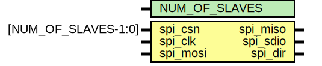

# Entity: ad_3w_spi

## Diagram

## Description

***************************************************************************
 ***************************************************************************
 Copyright 2014 - 2017 (c) Analog Devices, Inc. All rights reserved.
 In this HDL repository, there are many different and unique modules, consisting
 of various HDL (Verilog or VHDL) components. The individual modules are
 developed independently, and may be accompanied by separate and unique license
 terms.
 The user should read each of these license terms, and understand the
 freedoms and responsibilities that he or she has by using this source/core.
 This core is distributed in the hope that it will be useful, but WITHOUT ANY
 WARRANTY; without even the implied warranty of MERCHANTABILITY or FITNESS FOR
 A PARTICULAR PURPOSE.
 Redistribution and use of source or resulting binaries, with or without modification
 of this file, are permitted under one of the following two license terms:
   1. The GNU General Public License version 2 as published by the
      Free Software Foundation, which can be found in the top level directory
      of this repository (LICENSE_GPL2), and also online at:
      <https://www.gnu.org/licenses/old-licenses/gpl-2.0.html>
 OR
   2. An ADI specific BSD license, which can be found in the top level directory
      of this repository (LICENSE_ADIBSD), and also on-line at:
      https://github.com/analogdevicesinc/hdl/blob/master/LICENSE_ADIBSD
      This will allow to generate bit files and not release the source code,
      as long as it attaches to an ADI device.
 ***************************************************************************
 ***************************************************************************
 A 4-wire to 3-wire SPI converter, supporting maximum 8 slaves.
 The expected transfer format is defined in ADI_SPI technical specification
 (https://wiki.analog.com/_media/resources/technical-guides/adispi_rev_1p0_customer.pdf)
 16 bit instruction followed by N x 8 bits of data; the MSB bit of the
 instruction defines the direction of the SDIO during data transfer. (READ
 is 1 and WRITE is 0)
 
## Generics

| Generic name  | Type | Value | Description |
| ------------- | ---- | ----- | ----------- |
| NUM_OF_SLAVES |      | 8     |             |
## Ports

| Port name | Direction | Type                | Description |
| --------- | --------- | ------------------- | ----------- |
| spi_csn   | input     | [NUM_OF_SLAVES-1:0] |             |
| spi_clk   | input     |                     |             |
| spi_mosi  | input     |                     |             |
| spi_miso  | output    |                     |             |
| spi_sdio  | inout     |                     |             |
| spi_dir   | output    |                     |             |
## Signals

| Name         | Type           | Description         |
| ------------ | -------------- | ------------------- |
| spi_count    | reg     [ 5:0] | internal registers  |
| spi_rd_wr_n  | reg            |                     |
| spi_enable   | reg            |                     |
| spi_csn_s    | wire           | internal signals    |
| spi_enable_s | wire           |                     |
## Processes
- unnamed: ( @(posedge spi_clk or posedge spi_csn_s) )
- unnamed: ( @(negedge spi_clk or posedge spi_csn_s) )
