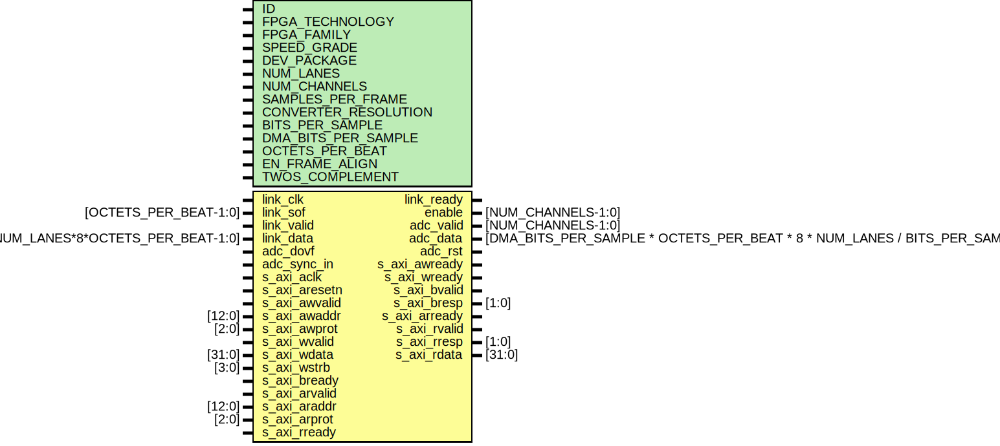

# Entity: ad_ip_jesd204_tpl_adc

## Diagram

## Description

***************************************************************************
 ***************************************************************************
 Copyright 2018 (c) Analog Devices, Inc. All rights reserved.
 Each core or library found in this collection may have its own licensing terms.
 The user should keep this in in mind while exploring these cores.
 Redistribution and use in source and binary forms,
 with or without modification of this file, are permitted under the terms of either
  (at the option of the user):
   1. The GNU General Public License version 2 as published by the
      Free Software Foundation, which can be found in the top level directory, or at:
 https://www.gnu.org/licenses/old-licenses/gpl-2.0.en.html
 OR
   2.  An ADI specific BSD license as noted in the top level directory, or on-line at:
 https://github.com/analogdevicesinc/hdl/blob/dev/LICENSE
 ***************************************************************************
 ***************************************************************************
 
## Generics

| Generic name         | Type | Value | Description |
| -------------------- | ---- | ----- | ----------- |
| ID                   |      | 0     |             |
| FPGA_TECHNOLOGY      |      | 0     |             |
| FPGA_FAMILY          |      | 0     |             |
| SPEED_GRADE          |      | 0     |             |
| DEV_PACKAGE          |      | 0     |             |
| NUM_LANES            |      | 1     |             |
| NUM_CHANNELS         |      | 4     |             |
| SAMPLES_PER_FRAME    |      | 1     |             |
| CONVERTER_RESOLUTION |      | 14    |             |
| BITS_PER_SAMPLE      |      | 16    |             |
| DMA_BITS_PER_SAMPLE  |      | 16    |             |
| OCTETS_PER_BEAT      |      | 4     |             |
| EN_FRAME_ALIGN       |      | 1     |             |
| TWOS_COMPLEMENT      |      | 1     |             |
## Ports

| Port name     | Direction | Type                                                                          | Description                               |
| ------------- | --------- | ----------------------------------------------------------------------------- | ----------------------------------------- |
| link_clk      | input     |                                                                               | jesd interfacelink_clk is (line-rate/40)  |
| link_sof      | input     | [OCTETS_PER_BEAT-1:0]                                                         |                                           |
| link_valid    | input     |                                                                               |                                           |
| link_data     | input     | [NUM_LANES*8*OCTETS_PER_BEAT-1:0]                                             |                                           |
| link_ready    | output    |                                                                               |                                           |
| enable        | output    | [NUM_CHANNELS-1:0]                                                            | dma interface                             |
| adc_valid     | output    | [NUM_CHANNELS-1:0]                                                            |                                           |
| adc_data      | output    | [DMA_BITS_PER_SAMPLE * OCTETS_PER_BEAT * 8 * NUM_LANES / BITS_PER_SAMPLE-1:0] |                                           |
| adc_dovf      | input     |                                                                               |                                           |
| adc_sync_in   | input     |                                                                               |                                           |
| adc_rst       | output    |                                                                               |                                           |
| s_axi_aclk    | input     |                                                                               | axi interface                             |
| s_axi_aresetn | input     |                                                                               |                                           |
| s_axi_awvalid | input     |                                                                               |                                           |
| s_axi_awready | output    |                                                                               |                                           |
| s_axi_awaddr  | input     | [12:0]                                                                        |                                           |
| s_axi_awprot  | input     | [2:0]                                                                         |                                           |
| s_axi_wvalid  | input     |                                                                               |                                           |
| s_axi_wready  | output    |                                                                               |                                           |
| s_axi_wdata   | input     | [31:0]                                                                        |                                           |
| s_axi_wstrb   | input     | [3:0]                                                                         |                                           |
| s_axi_bvalid  | output    |                                                                               |                                           |
| s_axi_bready  | input     |                                                                               |                                           |
| s_axi_bresp   | output    | [1:0]                                                                         |                                           |
| s_axi_arvalid | input     |                                                                               |                                           |
| s_axi_arready | output    |                                                                               |                                           |
| s_axi_araddr  | input     | [12:0]                                                                        |                                           |
| s_axi_arprot  | input     | [2:0]                                                                         |                                           |
| s_axi_rvalid  | output    |                                                                               |                                           |
| s_axi_rready  | input     |                                                                               |                                           |
| s_axi_rresp   | output    | [1:0]                                                                         |                                           |
| s_axi_rdata   | output    | [31:0]                                                                        |                                           |
## Signals

| Name               | Type                      | Description |
| ------------------ | ------------------------- | ----------- |
| dfmt_enable_s      | wire [NUM_CHANNELS-1:0]   |             |
| dfmt_sign_extend_s | wire [NUM_CHANNELS-1:0]   |             |
| dfmt_type_s        | wire [NUM_CHANNELS-1:0]   |             |
| pn_seq_sel_s       | wire [NUM_CHANNELS*4-1:0] |             |
| pn_err_s           | wire [NUM_CHANNELS-1:0]   |             |
| pn_oos_s           | wire [NUM_CHANNELS-1:0]   |             |
| adc_rst_sync_s     | wire                      |             |
| adc_rst_s          | wire                      |             |
| adc_sync           | wire                      |             |
| adc_sync_status    | wire                      |             |
## Constants

| Name            | Type | Value                                                            | Description                                                    |
| --------------- | ---- | ---------------------------------------------------------------- | -------------------------------------------------------------- |
| DATA_PATH_WIDTH |      | OCTETS_PER_BEAT * 8 * NUM_LANES / NUM_CHANNELS / BITS_PER_SAMPLE | Number of samples per channel that are processed in parallel.  |
| LINK_DATA_WIDTH |      | NUM_LANES * OCTETS_PER_BEAT * 8                                  |                                                                |
| DMA_DATA_WIDTH  |      | DMA_BITS_PER_SAMPLE * DATA_PATH_WIDTH * NUM_CHANNELS             |                                                                |
| BYTES_PER_FRAME |      | ( 8 * NUM_LANES)                                                 |                                                                |
## Instantiations

- i_regmap: ad_ip_jesd204_tpl_adc_regmap
**Description**
regmap

- i_core: ad_ip_jesd204_tpl_adc_core
